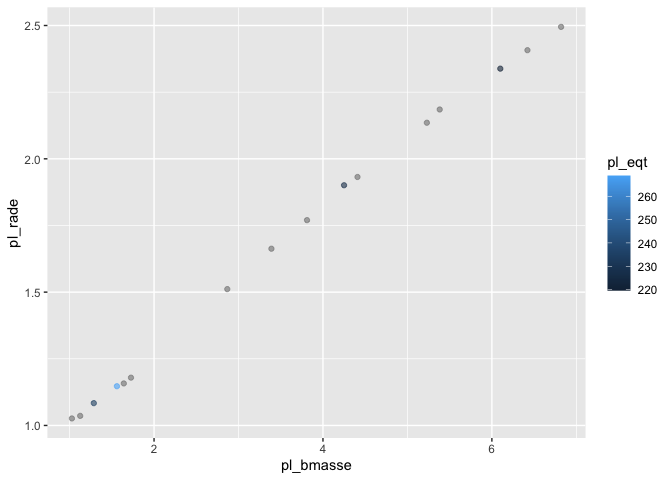
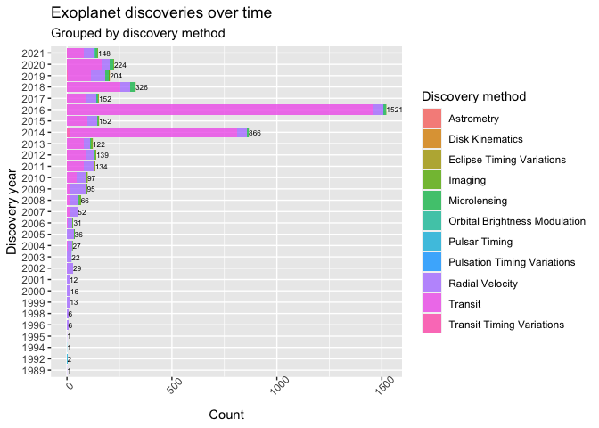
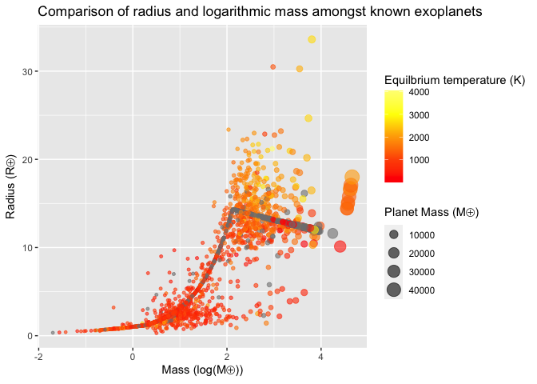

NASA API Vignette
================

## Package requirements

To re-create this vignette, users are required to install

-   **[tidyverse](https://www.tidyverse.org/)** - encompasses packages
    such as `dplyr` for subsetting data and `ggplot2` for creating
    layered graphics.  
-   **[httr](https://httr.r-lib.org/)** - supplies the `GET()` function
    to programmatically retrieve content from NASA Exoplanet Archive’s
    [TAP
    service](https://exoplanetarchive.ipac.caltech.edu/docs/TAP/usingTAP.html#examples).
-   **[jsonlite](https://cran.r-project.org/web/packages/jsonlite/vignettes/json-aaquickstart.html)** -
    supplies the `fromJSON()` function to simplify JSON content into an
    atomic vector.
-   **[DT](https://rstudio.github.io/DT/)** - suplies the `datatables()`
    function with “filtering, pagination, sorting, and many other
    features” in the tables".
-   **[latex2exp](https://cran.r-project.org/web/packages/latex2exp/vignettes/using-latex2exp.html)** -
    “an R package that parses and converts LaTeX math formulas to R’s
    plotmath expressions”. This is useful for labeling masses and radii
    on plots using [solar system
    symbols](https://solarsystem.nasa.gov/resources/680/solar-system-symbols/).

## Custom functions

``` r
# Calculate habitable stellar flux boundaries for exoplanetary habitable zones. 
# Distances returned in Astronomical Units (AU).
# Formula and it coefficients provided by Kopparapu et al.
# https://iopscience.iop.org/article/10.1088/2041-8205/787/2/L29
# Re-factored to R from John Armstrong's Python code at
# https://depts.washington.edu/naivpl/sites/default/files/hzcalc.py.txt

calculateHZ <- function(t_eff, luminosityRatio, planetMass){
  
  # Initiate vectors
  s_eff <- vector()
  distanceFromStar <- vector()
  
  starTemp <- vector()
  recentVenus <- vector()
  runawayGreenhouse <- vector()
  maxGreenhouse <- vector()
  earlyMars <- vector()
  fivemeRunaway <- vector()
  tenthmeRunaway <- vector()
  
  s_eff_sun  = c(1.776, 1.107, 0.356, 0.320, 1.188, 0.99)
  a <- c(2.136e-4, 1.332e-4, 6.171e-5, 5.547e-5, 1.433e-4, 1.209e-4)
  b <- c(2.533e-8, 1.580e-8, 1.698e-9, 1.526e-9, 1.707e-8, 1.404e-8)
  c <- c(-1.332e-11, -8.308e-12, -3.198e-12, -2.874e-12, -8.968e-12, -7.418e-12)
  d <- c(-3.097e-15, -1.931e-15, -5.575e-16, -5.011e-16, -2.084e-15, -1.713e-15)
  
  t_star <- t_eff-5780
  
  for (i in 1:length(a)){
    s_eff[i] <- s_eff_sun[i] + a[i]*t_star + b[i]*t_star^2 + c[i]*t_star^3 + d[i]*t_star^4
    distanceFromStar[i] <- (luminosityRatio/s_eff[i])^0.5
    
    optimisticInnerDist <- distanceFromStar[1]
    optimisticOuterDist <- distanceFromStar[4]
  
  }
  
  description = c("Optimistic, 1M Inner HZ - Recent Venus", "Conservative, 1M Inner HZ - Runaway Greenhouse",
               "Conservative, 1M Outer HZ - Maximum Greenhouse", "Optimistic, 1M Outer HZ - Early Mars",
               "Conservative, 5M Inner HZ - Runaway Greenhouse", "Conservative, 0.1M Inner HZ - Runaway Greenhouse")
  
  hzDescriptions <- data.frame(description, s_eff, distanceFromStar)

  optimisticInnerDist <- distanceFromStar[1]
  optimisticOuterDist <- distanceFromStar[4]
  
  optimisticInnerFlux <- s_eff[1]
  optimisticOuterFlux <- s_eff[4]
  
  return(list(optimisticInnerDist = optimisticInnerDist, optimisticOuterDist = optimisticOuterDist, 
              optimisticInnerFlux = optimisticInnerFlux, optimisticOuterFlux = optimisticOuterFlux))
  
}

sampleCalc <- calculateHZ(5780, 102.3, 9)
sampleCalc
```

    ## $optimisticInnerDist
    ## [1] 7.589555
    ## 
    ## $optimisticOuterDist
    ## [1] 17.87981
    ## 
    ## $optimisticInnerFlux
    ## [1] 1.776
    ## 
    ## $optimisticOuterFlux
    ## [1] 0.32

``` r
# Retrieve exoplanet names, discovery year, and discovery method.
# Defaults start in the year 1989 (earliest year in the pscomppars table)
# and end in the current calendar year: format(Sys.Date(), "%Y").

annualExoDiscoveries <- function(start_year = 1989, end_year = as.integer(format(Sys.Date(), "%Y")), controversial = 0){
  # Create URL string
  urlString <- paste0("https://exoplanetarchive.ipac.caltech.edu/TAP/sync?query=select+pl_name,disc_year,discoverymethod,pl_orbper,pl_rade,pl_bmasse,pl_radj,pl_bmassj,pl_eqt,st_spectype,st_teff,st_lum,pl_controv_flag,pl_orbeccen,pl_orbsmax,st_mass,st_metratio,st_met+from+pscomppars+where+disc_year+between+", start_year, "+and+", end_year, "+and+pl_controv_flag+=+", controversial, "&format=json")
  # Provide string to httr GET function
  apiCall <- GET(urlString)
  # Convert JSON content to data frame, rename columns
  apiContent <- apiCall$content %>% rawToChar() %>% fromJSON() %>%
    mutate(luminosityRatio = 10^(st_lum)) 
  
  # Return formatted data frame
  return(apiContent)
}

discoveryYrMthd <- annualExoDiscoveries()

# Display in a searchable table using DT library's datatable function
#datatable(discoveryYrMthd)
discoveryYrMthd
```

    ##                       pl_name disc_year
    ## 1       OGLE-2016-BLG-1227L b      2020
    ## 2                    GJ 480 b      2020
    ## 3                Kepler-276 c      2013
    ## 4                Kepler-829 b      2016
    ## 5                    K2-283 b      2018
    ## 6                Kepler-477 b      2016
    ## 7                  HAT-P-15 b      2010
    ## 8                 HD 149143 b      2005
    ## 9                 HD 210702 b      2007
    ## 10                HIP 12961 b      2010
    ## 11                     XO-5 b      2008
    ## 12                  HD 5608 b      2012
    ## 13                 HD 95872 b      2015
    ## 14      OGLE-2015-BLG-0966L b      2016
    ## 15                 WASP-123 b      2016
    ## 16                  tau Cet e      2017
    ## 17                   K2-254 c      2018
    ## 18                 HD 26965 b      2018
    ## 19           EPIC 220554210 c      2019
    ## 20            NSVS 14256825 b      2019
    ## 21              Kepler-1390 b      2016
    ## 22               Kepler-393 c      2014
    ## 23               Kepler-263 c      2014
    ## 24              Kepler-1431 b      2016
    ## 25               Kepler-237 c      2014
    ## 26              Kepler-1510 b      2016
    ## 27               Kepler-169 e      2014
    ## 28               Kepler-145 c      2013
    ## 29               Kepler-219 c      2014
    ## 30               Kepler-910 b      2016
    ## 31              Kepler-1037 b      2016
    ## 32               Kepler-992 b      2016
    ## 33               Kepler-113 b      2014
    ## 34              Kepler-1097 b      2016
    ## 35               Kepler-382 b      2014
    ## 36              Kepler-1310 b      2016
    ## 37              WD 1856+534 b      2020
    ## 38                   42 Dra b      2008
    ## 39                   61 Vir c      2009
    ## 40                   70 Vir b      1996
    ## 41               Kepler-255 c      2014
    ## 42                    K2-60 b      2016
    ## 43                Kepler-52 c      2012
    ## 44               Kepler-248 b      2014
    ## 45                   24 Sex b      2010
    ## 46                   24 Sex c      2010
    ## 47                  rho CrB c      2016
    ## 48                 HAT-P-43 b      2012
    ## 49 DENIS-P J082303.1-491201 b      2013
    ## 50                HIP 63242 b      2013
    ## 51                   GJ 504 b      2013
    ## 52  2MASS J01225093-2439505 b      2013
    ##              discoverymethod    pl_orbper pl_rade
    ## 1               Microlensing           NA  13.900
    ## 2            Radial Velocity    9.5670000   3.690
    ## 3                    Transit   31.8840000   2.900
    ## 4                    Transit    6.8833756   2.110
    ## 5                    Transit    1.9210360   3.520
    ## 6                    Transit   11.1199065   2.070
    ## 7                    Transit   10.8635000  11.882
    ## 8            Radial Velocity    4.0718200  13.600
    ## 9            Radial Velocity  354.1000000  13.400
    ## 10           Radial Velocity   57.4350000  13.200
    ## 11                   Transit    4.1877558  12.780
    ## 12           Radial Velocity  779.9000000  13.500
    ## 13           Radial Velocity 4375.0000000  13.000
    ## 14              Microlensing           NA   4.860
    ## 15                   Transit    2.9776412  14.773
    ## 16           Radial Velocity  162.8700000   1.810
    ## 17                   Transit   12.1183900   2.190
    ## 18           Radial Velocity   42.3780000   2.840
    ## 19                   Transit    0.7053100   1.480
    ## 20 Eclipse Timing Variations 3225.0000000  12.300
    ## 21                   Transit    6.4802167   1.180
    ## 22                   Transit   14.6136120   1.330
    ## 23                   Transit   47.3327730   2.470
    ## 24                   Transit    5.8660153   1.470
    ## 25                   Transit    8.1036360   2.080
    ## 26                   Transit   84.7039210   3.360
    ## 27                   Transit   13.7671020   2.200
    ## 28                   Transit   42.8820000   4.320
    ## 29                   Transit   22.7146130   3.580
    ## 30                   Transit    2.3643690   0.820
    ## 31                   Transit    1.0637887   1.280
    ## 32                   Transit   20.1603446   1.620
    ## 33                   Transit    4.7540000   1.820
    ## 34                   Transit  187.7470290   3.260
    ## 35                   Transit    5.2621550   1.320
    ## 36                   Transit    0.6793363   1.440
    ## 37                   Transit    1.4079405  10.400
    ## 38           Radial Velocity  479.1000000  13.000
    ## 39           Radial Velocity   38.0210000   4.460
    ## 40           Radial Velocity  116.6880000  12.600
    ## 41                   Transit    9.9460470   2.990
    ## 42                   Transit    3.0026500   7.656
    ## 43                   Transit   16.3850021   1.840
    ## 44                   Transit    6.3082050   3.020
    ## 45           Radial Velocity  452.8000000  13.400
    ## 46           Radial Velocity  883.0000000  13.900
    ## 47           Radial Velocity  102.5400000   5.380
    ## 48                   Transit    3.3326414  13.630
    ## 49                Astrometry  246.3600000  11.900
    ## 50           Radial Velocity  124.6000000  12.500
    ## 51                   Imaging           NA  13.000
    ## 52                   Imaging           NA  11.209
    ##    pl_bmasse pl_radj pl_bmassj pl_eqt st_spectype
    ## 1   250.0000   1.240   0.79000     NA        <NA>
    ## 2    13.2000   0.330   0.04153     NA     M3.5 Ve
    ## 3    16.6000   0.259   0.05200  563.0        <NA>
    ## 4     5.1000   0.188   0.01600  857.0        <NA>
    ## 5    12.2000   0.314   0.03830 1186.0        <NA>
    ## 6     4.9400   0.185   0.01550  649.0        <NA>
    ## 7   616.5902   1.060   1.94000  904.0          G5
    ## 8   422.7139   1.220   1.33000     NA          G0
    ## 9   574.6366   1.200   1.80800     NA      K1 III
    ## 10  114.4188   1.180   0.36000     NA          M0
    ## 11  378.2000   1.140   1.19000 1230.0        G8 V
    ## 12  534.2722   1.200   1.68100     NA          K0
    ## 13 1188.6842   1.160   3.74000     NA        K0 V
    ## 14   21.0000   0.433   0.06600     NA        <NA>
    ## 15  285.7292   1.318   0.89900 1520.0          G5
    ## 16    3.9300   0.161   0.01237     NA       G8.5V
    ## 17    5.4300   0.195   0.01710  551.0        <NA>
    ## 18    8.4700   0.254   0.02665     NA        K0 V
    ## 19    2.7900   0.132   0.00879     NA        <NA>
    ## 20 4497.2945   1.100  14.15000     NA        <NA>
    ## 21    1.7600   0.105   0.00553  934.0        <NA>
    ## 22    2.3300   0.119   0.00733  901.0        <NA>
    ## 23    6.6600   0.220   0.02100  386.0        <NA>
    ## 24    2.7600   0.131   0.00869 1064.0        <NA>
    ## 25    4.9800   0.186   0.01570  687.0        <NA>
    ## 26   11.2000   0.300   0.03540  537.0        <NA>
    ## 27    5.4800   0.196   0.01720  595.0        <NA>
    ## 28   79.4000   0.385   0.25000  709.0        <NA>
    ## 29   12.5000   0.319   0.03940  766.0        <NA>
    ## 30    0.4770   0.073   0.00150 1752.0        <NA>
    ## 31    2.1800   0.114   0.00687 1650.0        <NA>
    ## 32    3.2600   0.145   0.01020  510.0        <NA>
    ## 33   11.7000   0.162   0.03700  775.0        <NA>
    ## 34   10.7000   0.291   0.03360  267.0        <NA>
    ## 35    2.3000   0.118   0.00724 1166.0        <NA>
    ## 36    2.6700   0.128   0.00839 1883.0        <NA>
    ## 37 4386.0540   0.928  13.80000  163.0        <NA>
    ## 38 1233.1300   1.160   3.88000     NA    K1.5 III
    ## 39   18.2000   0.398   0.05700     NA        G5 V
    ## 40 2380.4500   1.130   7.49000     NA         G5V
    ## 41    9.2200   0.267   0.02900  807.0        <NA>
    ## 42  135.3956   0.683   0.42600 1400.0        G4 V
    ## 43   45.4000   0.164   0.14284  433.0        M0 V
    ## 44    9.3800   0.269   0.02950  819.0        <NA>
    ## 45  632.4600   1.190   1.99000     NA       K0 IV
    ## 46  273.3200   1.240   0.86000     NA       K0 IV
    ## 47   25.0000   0.480   0.07866  448.1        G0 V
    ## 48  210.3950   1.216   0.66200 1353.0          F9
    ## 49 9057.7700   1.060  28.50000     NA        L1.5
    ## 50 2917.5600   1.120   9.18000     NA          G8
    ## 51 1271.3000   1.160   4.00000  510.0        G0 V
    ## 52 7786.5000   1.000  24.50000 1600.0      M3.5 V
    ##    st_teff st_lum pl_controv_flag pl_orbeccen
    ## 1       NA     NA               0          NA
    ## 2     3381 -1.612               0      0.1000
    ## 3     5779 -0.089               0      0.0000
    ## 4     5698  0.040               0      0.0000
    ## 5     5060 -0.524               0          NA
    ## 6     5240 -0.372               0      0.0000
    ## 7     5568  0.000               0      0.1900
    ## 8     5856  0.350               0      0.0167
    ## 9     4951  1.149               0      0.0280
    ## 10    3901 -1.003               0      0.1700
    ## 11    5430 -0.060               0      0.0000
    ## 12    4877  1.179               0      0.0560
    ## 13    5312 -0.242               0      0.0600
    ## 14      NA     NA               0          NA
    ## 15    5740  0.162               0      0.0000
    ## 16    5310 -0.305               0      0.1800
    ## 17    4629 -0.765               0          NA
    ## 18    5072 -0.340               0      0.0400
    ## 19    5523 -0.215               0          NA
    ## 20   40000  1.974               0      0.1200
    ## 21    5753 -0.100               0      0.0000
    ## 22    6189  0.524               0      0.0000
    ## 23    5265 -0.456               0      0.0000
    ## 24    5806  0.243               0      0.0000
    ## 25    4861 -0.477               0      0.0000
    ## 26    6200  0.377               0      0.0000
    ## 27    4997 -0.496               0      0.0000
    ## 28    6022  0.692               0      0.1100
    ## 29    5786  0.214               0      0.0000
    ## 30    6230  0.494               0      0.0000
    ## 31    5105 -0.448               0      0.0000
    ## 32    4944 -0.570               0      0.0000
    ## 33    4725 -0.576               0      0.0000
    ## 34    5211 -0.404               0      0.0000
    ## 35    5600  0.146               0      0.0000
    ## 36    5549 -0.192               0      0.0000
    ## 37    4710 -4.120               0      0.0000
    ## 38    4200  2.155               0      0.3800
    ## 39    5577 -0.095               0      0.1400
    ## 40    5495  0.451               0      0.3988
    ## 41    5573 -0.183               0      0.0000
    ## 42    5500  0.282               0      0.0000
    ## 43    4075 -0.996               0      0.0000
    ## 44    5190 -0.418               0      0.0000
    ## 45    5098  1.164               0      0.0900
    ## 46    5098  1.164               0      0.2900
    ## 47    5627  0.232               0      0.0520
    ## 48    5693  0.060               0      0.2100
    ## 49      NA     NA               0      0.3450
    ## 50    4830  1.630               0      0.2300
    ## 51    6234  0.332               0          NA
    ## 52    3530 -1.720               0          NA
    ##    pl_orbsmax st_mass st_metratio st_met
    ## 1     3.40000    0.10        <NA>     NA
    ## 2     0.06800    0.45        <NA>     NA
    ## 3     0.19940    1.10      [Fe/H]  0.020
    ## 4     0.06780    0.98      [Fe/H]  0.030
    ## 5     0.02910    0.89      [Fe/H]  0.280
    ## 6     0.09110    0.87      [Fe/H] -0.040
    ## 7     0.09650    1.00      [Fe/H]  0.220
    ## 8     0.05300    1.20      [Fe/H]  0.290
    ## 9     1.14800    1.61      [Fe/H]  0.040
    ## 10    0.25000    0.69      [Fe/H] -0.140
    ## 11    0.05150    1.04      [Fe/H]  0.050
    ## 12    1.91100    1.53      [Fe/H]  0.140
    ## 13    5.15000    0.70      [Fe/H]  0.410
    ## 14    2.70000    0.38        <NA>     NA
    ## 15    0.04263    1.17      [Fe/H]  0.180
    ## 16    0.53800    0.78      [Fe/H] -0.520
    ## 17    0.09230    0.71      [Fe/H] -0.140
    ## 18         NA    0.78      [Fe/H] -0.420
    ## 19         NA    0.94      [Fe/H]  0.150
    ## 20    3.12000    0.42        <NA>     NA
    ## 21    0.06620    0.98      [Fe/H] -0.010
    ## 22    0.12400    1.21       [M/H]  0.032
    ## 23    0.24200    0.80       [M/H] -0.031
    ## 24    0.06480    1.03      [Fe/H]  0.070
    ## 25    0.07100    0.70      [Fe/H]  0.030
    ## 26    0.40890    1.19      [Fe/H]  0.040
    ## 27    0.10500    0.84      [Fe/H]  0.050
    ## 28    0.25780    1.32       [M/H] -0.001
    ## 29    0.16500    1.17       [M/H]  0.361
    ## 30    0.03820    1.26      [Fe/H]  0.120
    ## 31    0.01980    0.82      [Fe/H] -0.030
    ## 32    0.13390    0.80      [Fe/H] -0.040
    ## 33    0.05020    0.75      [Fe/H]  0.050
    ## 34    0.57910    0.82      [Fe/H] -0.110
    ## 35    0.05500    0.88       [M/H]  0.082
    ## 36    0.01480    0.91      [Fe/H] -0.070
    ## 37    0.02040    0.52        <NA>     NA
    ## 38    1.19000    0.98      [Fe/H] -0.460
    ## 39    0.21750    0.94      [Fe/H] -0.010
    ## 40    0.48100    1.09      [Fe/H] -0.090
    ## 41    0.09200    0.87       [M/H]  0.339
    ## 42    0.04500    0.97      [Fe/H]  0.010
    ## 43    0.10379    0.54      [Fe/H]  0.000
    ## 44    0.06600    0.90      [Fe/H]  0.200
    ## 45    1.33300    1.54      [Fe/H] -0.030
    ## 46    2.08000    1.54      [Fe/H] -0.030
    ## 47    0.41230    0.89      [Fe/H] -0.310
    ## 48    0.04440    1.03      [Fe/H]  0.200
    ## 49    0.36000    0.07        <NA>     NA
    ## 50    0.56500    1.54      [Fe/H] -0.310
    ## 51   43.50000    1.22      [Fe/H]  0.280
    ## 52   52.00000    0.40        <NA>     NA
    ##    luminosityRatio
    ## 1               NA
    ## 2     2.443431e-02
    ## 3     8.147043e-01
    ## 4     1.096478e+00
    ## 5     2.992265e-01
    ## 6     4.246196e-01
    ## 7     1.000000e+00
    ## 8     2.238721e+00
    ## 9     1.409289e+01
    ## 10    9.931160e-02
    ## 11    8.709636e-01
    ## 12    1.510080e+01
    ## 13    5.727960e-01
    ## 14              NA
    ## 15    1.452112e+00
    ## 16    4.954502e-01
    ## 17    1.717908e-01
    ## 18    4.570882e-01
    ## 19    6.095369e-01
    ## 20    9.418896e+01
    ## 21    7.943282e-01
    ## 22    3.341950e+00
    ## 23    3.499452e-01
    ## 24    1.749847e+00
    ## 25    3.334264e-01
    ## 26    2.382319e+00
    ## 27    3.191538e-01
    ## 28    4.920395e+00
    ## 29    1.636817e+00
    ## 30    3.118890e+00
    ## 31    3.564511e-01
    ## 32    2.691535e-01
    ## 33    2.654606e-01
    ## 34    3.944573e-01
    ## 35    1.399587e+00
    ## 36    6.426877e-01
    ## 37    7.585776e-05
    ## 38    1.428894e+02
    ## 39    8.035261e-01
    ## 40    2.824880e+00
    ## 41    6.561453e-01
    ## 42    1.914256e+00
    ## 43    1.009253e-01
    ## 44    3.819443e-01
    ## 45    1.458814e+01
    ## 46    1.458814e+01
    ## 47    1.706082e+00
    ## 48    1.148154e+00
    ## 49              NA
    ## 50    4.265795e+01
    ## 51    2.147830e+00
    ## 52    1.905461e-02
    ##  [ reached 'max' / getOption("max.print") -- omitted 4449 rows ]

## Exploratory Data Analysis

``` r
exoData <- annualExoDiscoveries()

exoData %>% mutate(innerHZ = NA, outerHZ = NA, innerFlux = NA, outerFlux = NA,
                   spectralClass = NA)
```

    ##                  pl_name disc_year
    ## 1  OGLE-2016-BLG-1227L b      2020
    ## 2               GJ 480 b      2020
    ## 3           Kepler-276 c      2013
    ## 4           Kepler-829 b      2016
    ## 5               K2-283 b      2018
    ## 6           Kepler-477 b      2016
    ## 7             HAT-P-15 b      2010
    ## 8            HD 149143 b      2005
    ## 9            HD 210702 b      2007
    ## 10           HIP 12961 b      2010
    ## 11                XO-5 b      2008
    ## 12             HD 5608 b      2012
    ## 13            HD 95872 b      2015
    ## 14 OGLE-2015-BLG-0966L b      2016
    ## 15            WASP-123 b      2016
    ## 16             tau Cet e      2017
    ## 17              K2-254 c      2018
    ## 18            HD 26965 b      2018
    ## 19      EPIC 220554210 c      2019
    ## 20       NSVS 14256825 b      2019
    ## 21         Kepler-1390 b      2016
    ## 22          Kepler-393 c      2014
    ## 23          Kepler-263 c      2014
    ## 24         Kepler-1431 b      2016
    ## 25          Kepler-237 c      2014
    ## 26         Kepler-1510 b      2016
    ## 27          Kepler-169 e      2014
    ## 28          Kepler-145 c      2013
    ## 29          Kepler-219 c      2014
    ## 30          Kepler-910 b      2016
    ## 31         Kepler-1037 b      2016
    ## 32          Kepler-992 b      2016
    ## 33          Kepler-113 b      2014
    ## 34         Kepler-1097 b      2016
    ## 35          Kepler-382 b      2014
    ## 36         Kepler-1310 b      2016
    ## 37         WD 1856+534 b      2020
    ## 38              42 Dra b      2008
    ## 39              61 Vir c      2009
    ## 40              70 Vir b      1996
    ## 41          Kepler-255 c      2014
    ##              discoverymethod    pl_orbper pl_rade
    ## 1               Microlensing           NA  13.900
    ## 2            Radial Velocity    9.5670000   3.690
    ## 3                    Transit   31.8840000   2.900
    ## 4                    Transit    6.8833756   2.110
    ## 5                    Transit    1.9210360   3.520
    ## 6                    Transit   11.1199065   2.070
    ## 7                    Transit   10.8635000  11.882
    ## 8            Radial Velocity    4.0718200  13.600
    ## 9            Radial Velocity  354.1000000  13.400
    ## 10           Radial Velocity   57.4350000  13.200
    ## 11                   Transit    4.1877558  12.780
    ## 12           Radial Velocity  779.9000000  13.500
    ## 13           Radial Velocity 4375.0000000  13.000
    ## 14              Microlensing           NA   4.860
    ## 15                   Transit    2.9776412  14.773
    ## 16           Radial Velocity  162.8700000   1.810
    ## 17                   Transit   12.1183900   2.190
    ## 18           Radial Velocity   42.3780000   2.840
    ## 19                   Transit    0.7053100   1.480
    ## 20 Eclipse Timing Variations 3225.0000000  12.300
    ## 21                   Transit    6.4802167   1.180
    ## 22                   Transit   14.6136120   1.330
    ## 23                   Transit   47.3327730   2.470
    ## 24                   Transit    5.8660153   1.470
    ## 25                   Transit    8.1036360   2.080
    ## 26                   Transit   84.7039210   3.360
    ## 27                   Transit   13.7671020   2.200
    ## 28                   Transit   42.8820000   4.320
    ## 29                   Transit   22.7146130   3.580
    ## 30                   Transit    2.3643690   0.820
    ## 31                   Transit    1.0637887   1.280
    ## 32                   Transit   20.1603446   1.620
    ## 33                   Transit    4.7540000   1.820
    ## 34                   Transit  187.7470290   3.260
    ## 35                   Transit    5.2621550   1.320
    ## 36                   Transit    0.6793363   1.440
    ## 37                   Transit    1.4079405  10.400
    ## 38           Radial Velocity  479.1000000  13.000
    ## 39           Radial Velocity   38.0210000   4.460
    ## 40           Radial Velocity  116.6880000  12.600
    ## 41                   Transit    9.9460470   2.990
    ##    pl_bmasse pl_radj pl_bmassj pl_eqt st_spectype
    ## 1   250.0000   1.240   0.79000     NA        <NA>
    ## 2    13.2000   0.330   0.04153     NA     M3.5 Ve
    ## 3    16.6000   0.259   0.05200    563        <NA>
    ## 4     5.1000   0.188   0.01600    857        <NA>
    ## 5    12.2000   0.314   0.03830   1186        <NA>
    ## 6     4.9400   0.185   0.01550    649        <NA>
    ## 7   616.5902   1.060   1.94000    904          G5
    ## 8   422.7139   1.220   1.33000     NA          G0
    ## 9   574.6366   1.200   1.80800     NA      K1 III
    ## 10  114.4188   1.180   0.36000     NA          M0
    ## 11  378.2000   1.140   1.19000   1230        G8 V
    ## 12  534.2722   1.200   1.68100     NA          K0
    ## 13 1188.6842   1.160   3.74000     NA        K0 V
    ## 14   21.0000   0.433   0.06600     NA        <NA>
    ## 15  285.7292   1.318   0.89900   1520          G5
    ## 16    3.9300   0.161   0.01237     NA       G8.5V
    ## 17    5.4300   0.195   0.01710    551        <NA>
    ## 18    8.4700   0.254   0.02665     NA        K0 V
    ## 19    2.7900   0.132   0.00879     NA        <NA>
    ## 20 4497.2945   1.100  14.15000     NA        <NA>
    ## 21    1.7600   0.105   0.00553    934        <NA>
    ## 22    2.3300   0.119   0.00733    901        <NA>
    ## 23    6.6600   0.220   0.02100    386        <NA>
    ## 24    2.7600   0.131   0.00869   1064        <NA>
    ## 25    4.9800   0.186   0.01570    687        <NA>
    ## 26   11.2000   0.300   0.03540    537        <NA>
    ## 27    5.4800   0.196   0.01720    595        <NA>
    ## 28   79.4000   0.385   0.25000    709        <NA>
    ## 29   12.5000   0.319   0.03940    766        <NA>
    ## 30    0.4770   0.073   0.00150   1752        <NA>
    ## 31    2.1800   0.114   0.00687   1650        <NA>
    ## 32    3.2600   0.145   0.01020    510        <NA>
    ## 33   11.7000   0.162   0.03700    775        <NA>
    ## 34   10.7000   0.291   0.03360    267        <NA>
    ## 35    2.3000   0.118   0.00724   1166        <NA>
    ## 36    2.6700   0.128   0.00839   1883        <NA>
    ## 37 4386.0540   0.928  13.80000    163        <NA>
    ## 38 1233.1300   1.160   3.88000     NA    K1.5 III
    ## 39   18.2000   0.398   0.05700     NA        G5 V
    ## 40 2380.4500   1.130   7.49000     NA         G5V
    ## 41    9.2200   0.267   0.02900    807        <NA>
    ##    st_teff st_lum pl_controv_flag pl_orbeccen
    ## 1       NA     NA               0          NA
    ## 2     3381 -1.612               0      0.1000
    ## 3     5779 -0.089               0      0.0000
    ## 4     5698  0.040               0      0.0000
    ## 5     5060 -0.524               0          NA
    ## 6     5240 -0.372               0      0.0000
    ## 7     5568  0.000               0      0.1900
    ## 8     5856  0.350               0      0.0167
    ## 9     4951  1.149               0      0.0280
    ## 10    3901 -1.003               0      0.1700
    ## 11    5430 -0.060               0      0.0000
    ## 12    4877  1.179               0      0.0560
    ## 13    5312 -0.242               0      0.0600
    ## 14      NA     NA               0          NA
    ## 15    5740  0.162               0      0.0000
    ## 16    5310 -0.305               0      0.1800
    ## 17    4629 -0.765               0          NA
    ## 18    5072 -0.340               0      0.0400
    ## 19    5523 -0.215               0          NA
    ## 20   40000  1.974               0      0.1200
    ## 21    5753 -0.100               0      0.0000
    ## 22    6189  0.524               0      0.0000
    ## 23    5265 -0.456               0      0.0000
    ## 24    5806  0.243               0      0.0000
    ## 25    4861 -0.477               0      0.0000
    ## 26    6200  0.377               0      0.0000
    ## 27    4997 -0.496               0      0.0000
    ## 28    6022  0.692               0      0.1100
    ## 29    5786  0.214               0      0.0000
    ## 30    6230  0.494               0      0.0000
    ## 31    5105 -0.448               0      0.0000
    ## 32    4944 -0.570               0      0.0000
    ## 33    4725 -0.576               0      0.0000
    ## 34    5211 -0.404               0      0.0000
    ## 35    5600  0.146               0      0.0000
    ## 36    5549 -0.192               0      0.0000
    ## 37    4710 -4.120               0      0.0000
    ## 38    4200  2.155               0      0.3800
    ## 39    5577 -0.095               0      0.1400
    ## 40    5495  0.451               0      0.3988
    ## 41    5573 -0.183               0      0.0000
    ##    pl_orbsmax st_mass st_metratio st_met
    ## 1     3.40000    0.10        <NA>     NA
    ## 2     0.06800    0.45        <NA>     NA
    ## 3     0.19940    1.10      [Fe/H]  0.020
    ## 4     0.06780    0.98      [Fe/H]  0.030
    ## 5     0.02910    0.89      [Fe/H]  0.280
    ## 6     0.09110    0.87      [Fe/H] -0.040
    ## 7     0.09650    1.00      [Fe/H]  0.220
    ## 8     0.05300    1.20      [Fe/H]  0.290
    ## 9     1.14800    1.61      [Fe/H]  0.040
    ## 10    0.25000    0.69      [Fe/H] -0.140
    ## 11    0.05150    1.04      [Fe/H]  0.050
    ## 12    1.91100    1.53      [Fe/H]  0.140
    ## 13    5.15000    0.70      [Fe/H]  0.410
    ## 14    2.70000    0.38        <NA>     NA
    ## 15    0.04263    1.17      [Fe/H]  0.180
    ## 16    0.53800    0.78      [Fe/H] -0.520
    ## 17    0.09230    0.71      [Fe/H] -0.140
    ## 18         NA    0.78      [Fe/H] -0.420
    ## 19         NA    0.94      [Fe/H]  0.150
    ## 20    3.12000    0.42        <NA>     NA
    ## 21    0.06620    0.98      [Fe/H] -0.010
    ## 22    0.12400    1.21       [M/H]  0.032
    ## 23    0.24200    0.80       [M/H] -0.031
    ## 24    0.06480    1.03      [Fe/H]  0.070
    ## 25    0.07100    0.70      [Fe/H]  0.030
    ## 26    0.40890    1.19      [Fe/H]  0.040
    ## 27    0.10500    0.84      [Fe/H]  0.050
    ## 28    0.25780    1.32       [M/H] -0.001
    ## 29    0.16500    1.17       [M/H]  0.361
    ## 30    0.03820    1.26      [Fe/H]  0.120
    ## 31    0.01980    0.82      [Fe/H] -0.030
    ## 32    0.13390    0.80      [Fe/H] -0.040
    ## 33    0.05020    0.75      [Fe/H]  0.050
    ## 34    0.57910    0.82      [Fe/H] -0.110
    ## 35    0.05500    0.88       [M/H]  0.082
    ## 36    0.01480    0.91      [Fe/H] -0.070
    ## 37    0.02040    0.52        <NA>     NA
    ## 38    1.19000    0.98      [Fe/H] -0.460
    ## 39    0.21750    0.94      [Fe/H] -0.010
    ## 40    0.48100    1.09      [Fe/H] -0.090
    ## 41    0.09200    0.87       [M/H]  0.339
    ##    luminosityRatio innerHZ outerHZ innerFlux
    ## 1               NA      NA      NA        NA
    ## 2     2.443431e-02      NA      NA        NA
    ## 3     8.147043e-01      NA      NA        NA
    ## 4     1.096478e+00      NA      NA        NA
    ## 5     2.992265e-01      NA      NA        NA
    ## 6     4.246196e-01      NA      NA        NA
    ## 7     1.000000e+00      NA      NA        NA
    ## 8     2.238721e+00      NA      NA        NA
    ## 9     1.409289e+01      NA      NA        NA
    ## 10    9.931160e-02      NA      NA        NA
    ## 11    8.709636e-01      NA      NA        NA
    ## 12    1.510080e+01      NA      NA        NA
    ## 13    5.727960e-01      NA      NA        NA
    ## 14              NA      NA      NA        NA
    ## 15    1.452112e+00      NA      NA        NA
    ## 16    4.954502e-01      NA      NA        NA
    ## 17    1.717908e-01      NA      NA        NA
    ## 18    4.570882e-01      NA      NA        NA
    ## 19    6.095369e-01      NA      NA        NA
    ## 20    9.418896e+01      NA      NA        NA
    ## 21    7.943282e-01      NA      NA        NA
    ## 22    3.341950e+00      NA      NA        NA
    ## 23    3.499452e-01      NA      NA        NA
    ## 24    1.749847e+00      NA      NA        NA
    ## 25    3.334264e-01      NA      NA        NA
    ## 26    2.382319e+00      NA      NA        NA
    ## 27    3.191538e-01      NA      NA        NA
    ## 28    4.920395e+00      NA      NA        NA
    ## 29    1.636817e+00      NA      NA        NA
    ## 30    3.118890e+00      NA      NA        NA
    ## 31    3.564511e-01      NA      NA        NA
    ## 32    2.691535e-01      NA      NA        NA
    ## 33    2.654606e-01      NA      NA        NA
    ## 34    3.944573e-01      NA      NA        NA
    ## 35    1.399587e+00      NA      NA        NA
    ## 36    6.426877e-01      NA      NA        NA
    ## 37    7.585776e-05      NA      NA        NA
    ## 38    1.428894e+02      NA      NA        NA
    ## 39    8.035261e-01      NA      NA        NA
    ## 40    2.824880e+00      NA      NA        NA
    ## 41    6.561453e-01      NA      NA        NA
    ##    outerFlux spectralClass
    ## 1         NA            NA
    ## 2         NA            NA
    ## 3         NA            NA
    ## 4         NA            NA
    ## 5         NA            NA
    ## 6         NA            NA
    ## 7         NA            NA
    ## 8         NA            NA
    ## 9         NA            NA
    ## 10        NA            NA
    ## 11        NA            NA
    ## 12        NA            NA
    ## 13        NA            NA
    ## 14        NA            NA
    ## 15        NA            NA
    ## 16        NA            NA
    ## 17        NA            NA
    ## 18        NA            NA
    ## 19        NA            NA
    ## 20        NA            NA
    ## 21        NA            NA
    ## 22        NA            NA
    ## 23        NA            NA
    ## 24        NA            NA
    ## 25        NA            NA
    ## 26        NA            NA
    ## 27        NA            NA
    ## 28        NA            NA
    ## 29        NA            NA
    ## 30        NA            NA
    ## 31        NA            NA
    ## 32        NA            NA
    ## 33        NA            NA
    ## 34        NA            NA
    ## 35        NA            NA
    ## 36        NA            NA
    ## 37        NA            NA
    ## 38        NA            NA
    ## 39        NA            NA
    ## 40        NA            NA
    ## 41        NA            NA
    ##  [ reached 'max' / getOption("max.print") -- omitted 4460 rows ]

``` r
for(i in 1:length(exoData$pl_bmasse)){
  
  if(!is.na(exoData$st_spectype[i])){
    exoData$spectralClass[i] <- substr(exoData$st_spectype[i], 1, 1)
  } else {
    exoData$spectralClass[i] <- NA
  }
  
  
  if(!is.na(exoData$pl_bmasse[i]) & exoData$pl_bmasse[i] <= 10 & exoData$pl_bmasse[i] >= 0.1) {
    

      hzVars <- calculateHZ(exoData$st_teff[i], 
             exoData$luminosityRatio[i],
             exoData$pl_bmasse[i])

      exoData$innerHZ[i] <- hzVars[[1]]
      exoData$outerHZ[i] <- hzVars[[2]]
      
      exoData$innerFlux[i] <- hzVars[[3]]
      exoData$outerFlux[i] <- hzVars[[4]]

} else {
  exoData$innerHZ[i] <- NA
  exoData$outerHZ[i] <- NA
  exoData$innerFlux[i] <- NA
  exoData$outerFlux[i] <- NA
  }
}

exoData %>% select(pl_name, pl_bmasse, pl_rade, pl_eqt, pl_orbsmax, innerHZ, outerHZ, innerFlux, outerFlux) %>% filter(grepl("Tee", pl_name))
```

    ##              pl_name pl_bmasse pl_rade pl_eqt
    ## 1 Teegarden's Star c      1.11    1.04     NA
    ## 2 Teegarden's Star b      1.05    1.02     NA
    ##   pl_orbsmax    innerHZ    outerHZ innerFlux
    ## 1     0.0443 0.02222954 0.05933773   1.47618
    ## 2     0.0252 0.02222954 0.05933773   1.47618
    ##   outerFlux
    ## 1 0.2071754
    ## 2 0.2071754

``` r
# Create function to identify potentially habitable exoplanets. 
# Default function parameters provided by Planetary Habitability Laboratory, 
# http://phl.upr.edu/projects/habitable-exoplanets-catalog
habitableExoFinder <- function(data, minEarthMass = 0.1, maxEarthMass = 5, 
                               minEarthRadius = 0.5, maxEarthRadius = 1.5,
                               maxInnerFlux = 1.5, maxOuterFlux = 0.20,
                               minTemp = 273, maxTemp = 340){
  
  # Subset data using provided parameters
  habitablePlanets <- data %>% select(pl_name, pl_eqt, spectralClass, pl_bmasse, pl_rade, 
                                      pl_orbeccen, pl_orbsmax, innerHZ, outerHZ, innerFlux, outerFlux) %>% 
    filter(spectralClass %in% c("F", "G", "K", "M") & (pl_orbsmax >= innerHZ) & (pl_orbsmax <= outerHZ) & (pl_bmasse >= minEarthMass) &
             (pl_bmasse <= maxEarthMass) & (pl_rade >= minEarthRadius) & (pl_rade <= maxEarthRadius) &
             (innerFlux <= maxInnerFlux) & (outerFlux >= maxOuterFlux) &
             (pl_eqt <= maxTemp | (is.na(pl_eqt))) & (pl_eqt >= minTemp | (is.na(pl_eqt == NA))))
  
  return(habitablePlanets)
}

# Run function using "optimistic" parameters from
# Planetary Habitability Laboratory
listHabitablePlanets <- habitableExoFinder(exoData, minTemp = 181, maxTemp = 279,
                                           maxEarthMass = 10, maxEarthRadius = 2.5)
listHabitablePlanets
```

    ##               pl_name pl_eqt spectralClass pl_bmasse
    ## 1            GJ 180 c     NA             M     6.400
    ## 2            GJ 433 d     NA             M     5.223
    ## 3            GJ 832 c     NA             M     5.400
    ## 4         Wolf 1061 c     NA             M     3.410
    ## 5            GJ 682 b     NA             M     4.400
    ## 6          K2-288 B b 226.36             M     4.270
    ## 7       Proxima Cen b 234.00             M     1.270
    ## 8            GJ 273 b     NA             M     2.890
    ## 9            GJ 163 c     NA             M     6.800
    ## 10         GJ 667 C c     NA             M     3.800
    ## 11          GJ 1061 c     NA             M     1.740
    ## 12 Teegarden's Star c     NA             M     1.110
    ## 13          TOI-700 d 268.80             M     1.570
    ## 14          GJ 1061 d     NA             M     1.640
    ## 15 Teegarden's Star b     NA             M     1.050
    ## 16           GJ 357 d 219.60             M     6.100
    ##    pl_rade pl_orbeccen pl_orbsmax    innerHZ
    ## 1    2.410       0.090   0.129000 0.09340197
    ## 2    2.140       0.070   0.178000 0.14976414
    ## 3    2.180       0.180   0.163000 0.13193208
    ## 4    1.660       0.110   0.089000 0.08279293
    ## 5    1.930       0.080   0.080000 0.03675957
    ## 6    1.900          NA   0.164000 0.08881738
    ## 7    1.080       0.350   0.048500 0.03234259
    ## 8    1.510       0.100   0.091101 0.07678974
    ## 9    2.500       0.099   0.125400 0.11447253
    ## 10   1.770       0.020   0.125000 0.09593028
    ## 11   1.180       0.290   0.035000 0.03390032
    ## 12   1.040       0.000   0.044300 0.02222954
    ## 13   1.144       0.111   0.163300 0.12456838
    ## 14   1.160       0.530   0.054000 0.03390032
    ## 15   1.020       0.000   0.025200 0.02222954
    ## 16   2.340          NA   0.204000 0.10319869
    ##       outerHZ innerFlux outerFlux
    ## 1  0.24391761  1.490349 0.2185313
    ## 2  0.38938678  1.493428 0.2209213
    ## 3  0.34283772  1.493823 0.2212192
    ## 4  0.21651733  1.489407 0.2177783
    ## 5  0.09757215  1.479991 0.2100624
    ## 6  0.23228352  1.489375 0.2177525
    ## 7  0.08576098  1.480643 0.2105817
    ## 8  0.20042756  1.490712 0.2188190
    ## 9  0.29705697  1.494849 0.2219834
    ## 10 0.25077627  1.489665 0.2179853
    ## 11 0.09029130  1.477721 0.2083091
    ## 12 0.05933773  1.476180 0.2071754
    ## 13 0.32387782  1.493428 0.2209213
    ## 14 0.09029130  1.477721 0.2083091
    ## 15 0.05933773  1.476180 0.2071754
    ## 16 0.26773515  1.495036 0.2221208

``` r
habitablePlanetSpecs <- ggplot(listHabitablePlanets, aes(x = pl_bmasse, y = pl_rade))
habitablePlanetSpecs + geom_point(aes(color = pl_eqt), alpha = 0.6, position = "jitter")
```

<!-- -->

``` r
a_in <- 2.7619e-5
b_in <- 3.8095e-9

a_out <- 1.3786e-4
b_out <- 1.4286e-9

l_in <- c(0.72, 0.895, 0.72, 0.485)
l_out <- c(1.77, 1.67, 1.95, 2.4)
```

The Planetary Habitability Laboratory outlines its [general habitability
criteria](http://phl.upr.edu/projects/habitable-exoplanets-catalog/methods)
as follows:

1.  The planet orbits an F, G, K, or M star.
2.  The planet orbits within the optimistic (aka empirical) habitable
    zone defined by Kopparapu et al. (2014) and corrected for eccentric
    orbits by Méndez & Rivera-Valentín (2017).
3.  The planet has a radius between 0.5 to 2.5 Earth radii or a minimum
    mass between 0.1 to 10 Earth masses.

``` r
exoDiscoveryHisto <- ggplot(discoveryYrMthd, aes(x = st_teff))
exoDiscoveryHisto + geom_histogram() +
  labs(x = "Stellar Effective Temperature [K]", y = "Count",
       title = "The distribution of planets as a function of stellar effective temperature") 
```

    ## `stat_bin()` using `bins = 30`. Pick better value
    ## with `binwidth`.

    ## Warning: Removed 124 rows containing non-finite values
    ## (stat_bin).

<!-- -->

``` r
exoData <- annualExoDiscoveries() 

annualDiscoveries <- ggplot(exoData, aes(x = as.character(disc_year)))
annualDiscoveries + geom_bar(aes(fill = discoverymethod), alpha = 0.8, position = "stack") +
  labs(x = "Discovery year", y = "Count",
       title = "Exoplanet discoveries over time", subtitle = "Grouped by discovery method") +
  scale_fill_discrete(name = "Discovery method") +
  theme(axis.text.x = element_text(angle = 45)) + 
  geom_text(stat="count", aes(label=..count..), vjust=0.5, hjust = -0.01, size = 2.2) +
  coord_flip() 
```

<!-- -->

``` r
# New vector with termporary data
tempMassData <- annualExoDiscoveries() 

# Scatter plot of masses/radii for discovered exoplanets
# Use LaTeX to denote the standard astronomical symbol for the Earth
tempMassScatter <- ggplot(tempMassData, aes(x = log10(pl_bmasse), y = pl_rade))
tempMassScatter + geom_point(aes(col = pl_eqt, size = pl_bmasse), alpha = 0.6, position = "jitter") +
  scale_color_gradientn(colours = heat.colors(5)) +
  labs(x = TeX(r'(Mass $(log(M\oplus))]$))'), y = TeX(r'(Radius $(R\oplus)$)'),
       title = "Comparison of radius and logarithmic mass amongst known exoplanets", col = "Equilbrium temperature (K)",
       size = TeX(r'(Planet Mass $(M\oplus)$)'))
```

    ## Warning: Removed 26 rows containing missing values
    ## (geom_point).

<!-- -->

``` r
planetClusters <- annualExoDiscoveries()
planetClusters <- planetClusters %>% select(pl_bmasse, pl_bmassj) %>% filter()
```

``` r
metallicityData <- annualExoDiscoveries() 
metallicityData <- metallicityData %>% select(st_metratio, st_met, pl_bmassj, pl_bmasse, pl_orbper) %>% 
  filter(st_metratio == "[Fe/H]" & !(is.na(pl_bmassj)) & (pl_bmassj >= 0.6))

metallicityData %>% mutate(category = NA)
```

    ##     st_metratio st_met pl_bmassj  pl_bmasse
    ## 1        [Fe/H]  0.220   1.94000   616.5902
    ## 2        [Fe/H]  0.290   1.33000   422.7139
    ## 3        [Fe/H]  0.040   1.80800   574.6366
    ## 4        [Fe/H]  0.050   1.19000   378.2000
    ## 5        [Fe/H]  0.140   1.68100   534.2722
    ## 6        [Fe/H]  0.410   3.74000  1188.6842
    ## 7        [Fe/H]  0.180   0.89900   285.7292
    ## 8        [Fe/H] -0.460   3.88000  1233.1300
    ## 9        [Fe/H] -0.090   7.49000  2380.4500
    ## 10       [Fe/H] -0.030   1.99000   632.4600
    ## 11       [Fe/H] -0.030   0.86000   273.3200
    ## 12       [Fe/H]  0.200   0.66200   210.3950
    ## 13       [Fe/H] -0.310   9.18000  2917.5600
    ## 14       [Fe/H]  0.280   4.00000  1271.3000
    ## 15       [Fe/H]  0.010   0.67200   213.5818
    ## 16       [Fe/H] -0.092   1.90000   603.8770
    ## 17       [Fe/H]  0.000   2.17000   689.6911
    ## 18       [Fe/H] -0.080   9.78000  3108.3774
    ## 19       [Fe/H]  0.040  13.50000  4290.5000
    ## 20       [Fe/H]  0.141   3.00000   953.4900
    ## 21       [Fe/H]  0.050   7.60000  2415.4000
    ## 22       [Fe/H]  0.460  14.28000  4538.4210
    ## 23       [Fe/H]  0.110   3.44000  1093.3352
    ## 24       [Fe/H]  0.020   2.90000   921.7070
    ## 25       [Fe/H] -0.100   2.39000   759.6137
    ## 26       [Fe/H]  0.396   0.76000   241.5508
    ## 27       [Fe/H] -0.410   4.94000  1570.0802
    ## 28       [Fe/H]  0.190  11.09000  3524.5900
    ## 29       [Fe/H]  0.250   1.80000   572.0940
    ## 30       [Fe/H] -0.030   5.10000  1620.9000
    ## 31       [Fe/H]  0.010   1.30800   415.7040
    ## 32       [Fe/H]  0.270   2.69000   854.9627
    ## 33       [Fe/H]  0.290   1.52700   485.3264
    ## 34       [Fe/H] -0.660   1.78000   565.7374
    ## 35       [Fe/H] -0.060   1.54700   491.6830
    ## 36       [Fe/H]  0.150   5.58000  1773.4914
    ## 37       [Fe/H]  0.200   2.22300   706.5361
    ## 38       [Fe/H] -0.160   0.68000   216.1244
    ## 39       [Fe/H]  0.020   0.70000   222.4810
    ## 40       [Fe/H] -0.060   6.93000  2202.5619
    ## 41       [Fe/H]  0.060   1.16000   368.6700
    ## 42       [Fe/H] -0.280   0.81000   257.4423
    ## 43       [Fe/H]  0.350   1.97000   626.1251
    ## 44       [Fe/H]  0.350  19.70000  6261.2196
    ## 45       [Fe/H]  0.320   8.37000  2660.2371
    ## 46       [Fe/H]  0.340   0.66800   212.3104
    ## 47       [Fe/H]  0.260   2.54000   807.2882
    ## 48       [Fe/H]  0.290   3.95000  1255.4285
    ## 49       [Fe/H]  0.250   5.45000  1732.1735
    ## 50       [Fe/H]  0.300   1.01700   323.2331
    ## 51       [Fe/H]  0.300  11.00000  3496.1125
    ## 52       [Fe/H]  0.190   1.37000   435.4100
    ## 53       [Fe/H]  0.050   1.25000   397.2875
    ## 54       [Fe/H]  0.170   0.67000   212.9461
    ## 55       [Fe/H] -0.170   0.65790   209.0915
    ## 56       [Fe/H]  0.010   2.37000   753.2300
    ## 57       [Fe/H]  0.220   3.08000   978.9164
    ## 58       [Fe/H]  0.232   1.11200   353.4270
    ## 59       [Fe/H] -0.030   7.27000  2310.6241
    ## 60       [Fe/H] -0.170   3.18000  1010.6994
    ## 61       [Fe/H]  0.290   1.61000   511.7063
    ## 62       [Fe/H]  0.280   9.03000  2870.0049
    ## 63       [Fe/H] -0.250   6.00000  1906.9800
    ## 64       [Fe/H] -0.110   3.93000  1249.0719
    ## 65       [Fe/H]  0.250   4.85000  1540.0000
    ## 66       [Fe/H] -0.140   2.43000   772.3269
    ## 67       [Fe/H]  0.200   1.22000   387.7526
    ## 68       [Fe/H]  0.140   1.92700   612.4584
    ## 69       [Fe/H]  0.170   0.62000   197.0546
    ## 70       [Fe/H]  0.360   2.43000   772.3269
    ## 71       [Fe/H]  0.400   2.23000   708.7609
    ## 72       [Fe/H]  0.030   9.61000  3054.2200
    ## 73       [Fe/H] -0.070   1.11800   355.3339
    ## 74       [Fe/H]  0.060   1.78000   565.7374
    ## 75       [Fe/H]  0.190  13.82000  4392.4106
    ## 76       [Fe/H] -0.090   9.90000  3146.4000
    ## 77       [Fe/H]  0.280   2.71000   861.3193
    ## 78       [Fe/H]  0.180   1.34000   425.8922
    ## 79       [Fe/H]  0.040   3.47000  1102.8200
    ## 80       [Fe/H] -0.130   0.78000   247.9074
    ## 81       [Fe/H]  0.200   2.72000   864.4976
    ## 82       [Fe/H] -0.220   2.70000   858.1000
    ## 83       [Fe/H]  0.100   3.37000  1071.0400
    ## 84       [Fe/H]  0.270   3.19000  1013.8777
    ## 85       [Fe/H] -0.350  20.00000  6356.0000
    ## 86       [Fe/H] -0.060  16.00000  5000.0000
    ## 87       [Fe/H]  0.230   1.98500   630.8926
    ## 88       [Fe/H]  0.280   1.11000   352.7800
    ## 89       [Fe/H]  0.140   5.00000  1589.0000
    ## 90       [Fe/H] -0.150   1.21400   385.8456
    ## 91       [Fe/H]  0.150   3.21600  1022.1413
    ## 92       [Fe/H]  0.240   2.47000   785.0401
    ## 93       [Fe/H]  0.140   2.03600   647.1019
    ## 94       [Fe/H] -0.050   4.50000  1430.1750
    ## 95       [Fe/H]  0.050   0.92000   292.4036
    ## 96       [Fe/H]  0.070   1.61000   511.7063
    ## 97       [Fe/H]  0.220   1.29000   410.0007
    ## 98       [Fe/H]  0.010   1.24000   394.1092
    ## 99       [Fe/H]  0.020   0.61300   194.8298
    ## 100      [Fe/H] -0.100   7.80000  2479.0000
    ## 101      [Fe/H] -0.080  16.88000  5364.9704
    ## 102      [Fe/H]  0.095   2.28000   724.6200
    ## 103      [Fe/H]  0.000   0.80500   255.8531
    ## 104      [Fe/H]  0.070   1.47000   467.2101
    ## 105      [Fe/H]  0.070   4.51000  1433.4133
    ## 106      [Fe/H]  0.010   1.59000   505.3497
    ## 107      [Fe/H]  0.220   3.62000  1150.5446
    ## 108      [Fe/H]  0.390   1.11000   352.7913
    ## 109      [Fe/H] -0.770   0.91000   289.2253
    ## 110      [Fe/H]  0.380   0.83700   266.0237
    ## 111      [Fe/H]  0.090   2.89000   918.5287
    ## 112      [Fe/H]  0.330   7.60000  2415.5080
    ## 113      [Fe/H]  0.220   2.13200   677.6136
    ## 114      [Fe/H]  0.108   0.92100   292.7214
    ## 115      [Fe/H]  0.268   3.14700  1000.2110
    ## 116      [Fe/H] -0.210   9.00000  2860.4700
    ## 117      [Fe/H]  0.000   2.31000   734.1873
    ## 118      [Fe/H]  0.240   1.23000   390.9309
    ## 119      [Fe/H] -0.110   2.00000   635.6600
    ## 120      [Fe/H]  0.170   0.82000   260.0000
    ## 121      [Fe/H]  0.030   1.40000   444.9620
    ## 122      [Fe/H] -0.490  12.89000  4096.8287
    ## 123      [Fe/H]  0.020   1.90000   603.8770
    ## 124      [Fe/H]  0.150  11.10000  3527.9130
    ## 125      [Fe/H]  0.030   5.97000  1897.4451
    ## 126      [Fe/H]  0.230   1.09000   346.4347
    ## 127      [Fe/H] -0.220   1.06100   337.2176
    ## 128      [Fe/H]  0.000   2.26000   718.2958
    ## 129      [Fe/H]  0.247   3.40000  1080.6220
    ## 130      [Fe/H]  0.160   0.73000   232.0159
    ## 131      [Fe/H]  0.270   3.76000  1195.0408
    ## 132      [Fe/H]  0.070   0.89200   283.4920
    ## 133      [Fe/H] -0.290   7.80000  2479.0000
    ## 134      [Fe/H]  0.360   2.40000   762.8000
    ## 135      [Fe/H]  0.140  20.30000  6451.9490
    ## 136      [Fe/H] -0.140   1.51968   483.0000
    ## 137      [Fe/H]  0.070   4.40000  1398.4520
    ## 138      [Fe/H]  0.176   7.30000  2320.1000
    ## 139      [Fe/H] -0.010   2.71000   861.2800
    ## 140      [Fe/H] -0.090   5.00000  1589.1500
    ## 141      [Fe/H]  0.164   0.85500   271.7446
    ## 142      [Fe/H]  0.070   1.46500   465.6209
    ## 143      [Fe/H] -0.080   4.22000  1341.2426
    ## 144      [Fe/H]  0.120   8.40000  2669.6600
    ## 145      [Fe/H]  0.210   0.87000   276.5121
    ## 146      [Fe/H] -0.310   2.35000   746.9005
    ## 147      [Fe/H]  0.030 124.00000 39400.0000
    ## 148      [Fe/H] -0.076   4.70000  1493.7000
    ## 149      [Fe/H]  0.060 131.00000 41600.0000
    ## 150      [Fe/H]  0.190   3.51000  1115.5833
    ## 151      [Fe/H]  0.180   8.70000  2765.1210
    ## 152      [Fe/H]  0.350   7.24600  2302.8990
    ## 153      [Fe/H] -0.160   0.87000   276.5121
    ## 154      [Fe/H]  0.110   1.01000   321.0083
    ## 155      [Fe/H] -0.480   3.10000   985.2000
    ## 156      [Fe/H]  0.160   3.46000  1099.6918
    ## 157      [Fe/H]  0.010   0.73000   232.0159
    ## 158      [Fe/H] -0.306   1.42000   451.3186
    ## 159      [Fe/H] -0.210   2.39000   759.6137
    ## 160      [Fe/H]  0.350   0.66000   209.7678
    ## 161      [Fe/H]  0.100   2.12000   674.0000
    ## 162      [Fe/H]  0.090   2.75000   874.0325
    ## 163      [Fe/H] -0.600   0.99000   314.6517
    ## 164      [Fe/H]  0.110   1.80000   572.0700
    ## 165      [Fe/H]  0.340   0.86000   273.3338
    ## 166      [Fe/H]  0.310   8.20000  2606.1000
    ##        pl_orbper category
    ## 1      10.863500       NA
    ## 2       4.071820       NA
    ## 3     354.100000       NA
    ## 4       4.187756       NA
    ## 5     779.900000       NA
    ## 6    4375.000000       NA
    ## 7       2.977641       NA
    ## 8     479.100000       NA
    ## 9     116.688000       NA
    ## 10    452.800000       NA
    ## 11    883.000000       NA
    ## 12      3.332641       NA
    ## 13    124.600000       NA
    ## 14            NA       NA
    ## 15      3.181078       NA
    ## 16    416.000000       NA
    ## 17      1.747488       NA
    ## 18    714.299990       NA
    ## 19            NA       NA
    ## 20      6.180235       NA
    ## 21      1.512140       NA
    ## 22    446.270000       NA
    ## 23      4.627670       NA
    ## 24      9.060050       NA
    ## 25      3.142702       NA
    ## 26      2.544183       NA
    ## 27    127.580000       NA
    ## 28    835.477000       NA
    ## 29    896.000000       NA
    ## 30    655.600000       NA
    ## 31      4.035190       NA
    ## 32     55.012920       NA
    ## 33   1211.170000       NA
    ## 34   2058.000000       NA
    ## 35    847.000000       NA
    ## 36    882.700010       NA
    ## 37   1334.280000       NA
    ## 38      2.150008       NA
    ## 39      4.187624       NA
    ## 40   1531.000000       NA
    ## 41   1116.000000       NA
    ## 42    832.970000       NA
    ## 43      6.277110       NA
    ## 44      1.744579       NA
    ## 45   7462.057500       NA
    ## 46      3.234700       NA
    ## 47    564.100000       NA
    ## 48    626.515990       NA
    ## 49     39.475000       NA
    ## 50      3.308958       NA
    ## 51            NA       NA
    ## 52    279.800000       NA
    ## 53    380.850010       NA
    ## 54   1558.000000       NA
    ## 55    342.850000       NA
    ## 56   2732.000000       NA
    ## 57    188.300000       NA
    ## 58   1750.000000       NA
    ## 59   1001.700010       NA
    ## 60    218.470000       NA
    ## 61   1173.000000       NA
    ## 62   1561.000000       NA
    ## 63   4100.000000       NA
    ## 64    415.400000       NA
    ## 65   2374.000000       NA
    ## 66   2443.000000       NA
    ## 67   1157.000000       NA
    ## 68    356.210000       NA
    ## 69    466.000000       NA
    ## 70    262.708620       NA
    ## 71    431.880000       NA
    ## 72   3630.000000       NA
    ## 73   2266.400000       NA
    ## 74    798.500000       NA
    ## 75    335.100010       NA
    ## 76    875.500000       NA
    ## 77    422.900000       NA
    ## 78   1807.000000       NA
    ## 79      1.742994       NA
    ## 80   2690.000000       NA
    ## 81   1532.000000       NA
    ## 82    323.600000       NA
    ## 83    133.710000       NA
    ## 84   2720.000000       NA
    ## 85            NA       NA
    ## 86            NA       NA
    ## 87   1176.450000       NA
    ## 88    137.480000       NA
    ## 89            NA       NA
    ## 90    852.500000       NA
    ## 91      4.175186       NA
    ## 92      3.212220       NA
    ## 93    673.200000       NA
    ## 94      2.485533       NA
    ## 95      3.474470       NA
    ## 96    157.570010       NA
    ## 97    442.190000       NA
    ## 98      3.118600       NA
    ## 99      4.298643       NA
    ## 100  1455.000000       NA
    ## 101 10354.837500       NA
    ## 102  2730.000000       NA
    ## 103     2.174674       NA
    ## 104     2.732532       NA
    ## 105   825.900000       NA
    ## 106     3.264274       NA
    ## 107  2149.000000       NA
    ## 108  1179.000000       NA
    ## 109    30.350600       NA
    ## 110     1.915291       NA
    ## 111   434.500000       NA
    ## 112 11613.000000       NA
    ## 113     3.309844       NA
    ## 114     4.204200       NA
    ## 115     2.350621       NA
    ## 116  1200.000000       NA
    ## 117     2.790830       NA
    ## 118   328.550000       NA
    ## 119           NA       NA
    ## 120   258.800000       NA
    ## 121     0.381078       NA
    ## 122   535.599980       NA
    ## 123     1.401379       NA
    ## 124  2556.500000       NA
    ## 125   834.000000       NA
    ## 126     5.050500       NA
    ## 127   153.220000       NA
    ## 128     2.724740       NA
    ## 129     7.817953       NA
    ## 130     3.258832       NA
    ## 131   325.803000       NA
    ## 132     3.128992       NA
    ## 133   605.200000       NA
    ## 134   357.800000       NA
    ## 135  1854.400000       NA
    ## 136  1107.592300       NA
    ## 137  1056.400000       NA
    ## 138   675.470000       NA
    ## 139  5894.000000       NA
    ## 140   613.200000       NA
    ## 141     3.899052       NA
    ## 142     1.091420       NA
    ## 143     5.026799       NA
    ## 144     6.790123       NA
    ## 145   996.000000       NA
    ## 146     4.086050       NA
    ## 147     3.120829       NA
    ## 148    42.631800       NA
    ## 149     2.052350       NA
    ## 150    21.216630       NA
    ## 151     5.633516       NA
    ## 152     2.875317       NA
    ## 153   623.800000       NA
    ## 154     6.837760       NA
    ## 155  4885.000000       NA
    ## 156  1920.099980       NA
    ## 157     3.524749       NA
    ## 158   649.000000       NA
    ## 159   380.700000       NA
    ## 160  5000.000000       NA
    ## 161    44.236000       NA
    ## 162   428.500000       NA
    ## 163   194.300000       NA
    ## 164    51.645000       NA
    ## 165     3.204660       NA
    ## 166   184.200000       NA
    ##  [ reached 'max' / getOption("max.print") -- omitted 683 rows ]

``` r
for(i in 1:length(metallicityData$pl_bmassj)){
  
  if(metallicityData$pl_bmassj[i] <= 0.9 & metallicityData$pl_bmassj[i] >= 0.6){
    metallicityData$category[i] <- "Sub-Jupiter"
  } else if(metallicityData$pl_bmassj[i] <= 4) {
    metallicityData$category[i] <- "Jupiter-mass"
  } else {
    metallicityData$category[i] <- "Super-massive"
  }
}
  
metallicityData
```

    ##     st_metratio st_met pl_bmassj  pl_bmasse
    ## 1        [Fe/H]  0.220   1.94000   616.5902
    ## 2        [Fe/H]  0.290   1.33000   422.7139
    ## 3        [Fe/H]  0.040   1.80800   574.6366
    ## 4        [Fe/H]  0.050   1.19000   378.2000
    ## 5        [Fe/H]  0.140   1.68100   534.2722
    ## 6        [Fe/H]  0.410   3.74000  1188.6842
    ## 7        [Fe/H]  0.180   0.89900   285.7292
    ## 8        [Fe/H] -0.460   3.88000  1233.1300
    ## 9        [Fe/H] -0.090   7.49000  2380.4500
    ## 10       [Fe/H] -0.030   1.99000   632.4600
    ## 11       [Fe/H] -0.030   0.86000   273.3200
    ## 12       [Fe/H]  0.200   0.66200   210.3950
    ## 13       [Fe/H] -0.310   9.18000  2917.5600
    ## 14       [Fe/H]  0.280   4.00000  1271.3000
    ## 15       [Fe/H]  0.010   0.67200   213.5818
    ## 16       [Fe/H] -0.092   1.90000   603.8770
    ## 17       [Fe/H]  0.000   2.17000   689.6911
    ## 18       [Fe/H] -0.080   9.78000  3108.3774
    ## 19       [Fe/H]  0.040  13.50000  4290.5000
    ## 20       [Fe/H]  0.141   3.00000   953.4900
    ## 21       [Fe/H]  0.050   7.60000  2415.4000
    ## 22       [Fe/H]  0.460  14.28000  4538.4210
    ## 23       [Fe/H]  0.110   3.44000  1093.3352
    ## 24       [Fe/H]  0.020   2.90000   921.7070
    ## 25       [Fe/H] -0.100   2.39000   759.6137
    ## 26       [Fe/H]  0.396   0.76000   241.5508
    ## 27       [Fe/H] -0.410   4.94000  1570.0802
    ## 28       [Fe/H]  0.190  11.09000  3524.5900
    ## 29       [Fe/H]  0.250   1.80000   572.0940
    ## 30       [Fe/H] -0.030   5.10000  1620.9000
    ## 31       [Fe/H]  0.010   1.30800   415.7040
    ## 32       [Fe/H]  0.270   2.69000   854.9627
    ## 33       [Fe/H]  0.290   1.52700   485.3264
    ## 34       [Fe/H] -0.660   1.78000   565.7374
    ## 35       [Fe/H] -0.060   1.54700   491.6830
    ## 36       [Fe/H]  0.150   5.58000  1773.4914
    ## 37       [Fe/H]  0.200   2.22300   706.5361
    ## 38       [Fe/H] -0.160   0.68000   216.1244
    ## 39       [Fe/H]  0.020   0.70000   222.4810
    ## 40       [Fe/H] -0.060   6.93000  2202.5619
    ## 41       [Fe/H]  0.060   1.16000   368.6700
    ## 42       [Fe/H] -0.280   0.81000   257.4423
    ## 43       [Fe/H]  0.350   1.97000   626.1251
    ## 44       [Fe/H]  0.350  19.70000  6261.2196
    ## 45       [Fe/H]  0.320   8.37000  2660.2371
    ## 46       [Fe/H]  0.340   0.66800   212.3104
    ## 47       [Fe/H]  0.260   2.54000   807.2882
    ## 48       [Fe/H]  0.290   3.95000  1255.4285
    ## 49       [Fe/H]  0.250   5.45000  1732.1735
    ## 50       [Fe/H]  0.300   1.01700   323.2331
    ## 51       [Fe/H]  0.300  11.00000  3496.1125
    ## 52       [Fe/H]  0.190   1.37000   435.4100
    ## 53       [Fe/H]  0.050   1.25000   397.2875
    ## 54       [Fe/H]  0.170   0.67000   212.9461
    ## 55       [Fe/H] -0.170   0.65790   209.0915
    ## 56       [Fe/H]  0.010   2.37000   753.2300
    ## 57       [Fe/H]  0.220   3.08000   978.9164
    ## 58       [Fe/H]  0.232   1.11200   353.4270
    ## 59       [Fe/H] -0.030   7.27000  2310.6241
    ## 60       [Fe/H] -0.170   3.18000  1010.6994
    ## 61       [Fe/H]  0.290   1.61000   511.7063
    ## 62       [Fe/H]  0.280   9.03000  2870.0049
    ## 63       [Fe/H] -0.250   6.00000  1906.9800
    ## 64       [Fe/H] -0.110   3.93000  1249.0719
    ## 65       [Fe/H]  0.250   4.85000  1540.0000
    ## 66       [Fe/H] -0.140   2.43000   772.3269
    ## 67       [Fe/H]  0.200   1.22000   387.7526
    ## 68       [Fe/H]  0.140   1.92700   612.4584
    ## 69       [Fe/H]  0.170   0.62000   197.0546
    ## 70       [Fe/H]  0.360   2.43000   772.3269
    ## 71       [Fe/H]  0.400   2.23000   708.7609
    ## 72       [Fe/H]  0.030   9.61000  3054.2200
    ## 73       [Fe/H] -0.070   1.11800   355.3339
    ## 74       [Fe/H]  0.060   1.78000   565.7374
    ## 75       [Fe/H]  0.190  13.82000  4392.4106
    ## 76       [Fe/H] -0.090   9.90000  3146.4000
    ## 77       [Fe/H]  0.280   2.71000   861.3193
    ## 78       [Fe/H]  0.180   1.34000   425.8922
    ## 79       [Fe/H]  0.040   3.47000  1102.8200
    ## 80       [Fe/H] -0.130   0.78000   247.9074
    ## 81       [Fe/H]  0.200   2.72000   864.4976
    ## 82       [Fe/H] -0.220   2.70000   858.1000
    ## 83       [Fe/H]  0.100   3.37000  1071.0400
    ## 84       [Fe/H]  0.270   3.19000  1013.8777
    ## 85       [Fe/H] -0.350  20.00000  6356.0000
    ## 86       [Fe/H] -0.060  16.00000  5000.0000
    ## 87       [Fe/H]  0.230   1.98500   630.8926
    ## 88       [Fe/H]  0.280   1.11000   352.7800
    ## 89       [Fe/H]  0.140   5.00000  1589.0000
    ## 90       [Fe/H] -0.150   1.21400   385.8456
    ## 91       [Fe/H]  0.150   3.21600  1022.1413
    ## 92       [Fe/H]  0.240   2.47000   785.0401
    ## 93       [Fe/H]  0.140   2.03600   647.1019
    ## 94       [Fe/H] -0.050   4.50000  1430.1750
    ## 95       [Fe/H]  0.050   0.92000   292.4036
    ## 96       [Fe/H]  0.070   1.61000   511.7063
    ## 97       [Fe/H]  0.220   1.29000   410.0007
    ## 98       [Fe/H]  0.010   1.24000   394.1092
    ## 99       [Fe/H]  0.020   0.61300   194.8298
    ## 100      [Fe/H] -0.100   7.80000  2479.0000
    ## 101      [Fe/H] -0.080  16.88000  5364.9704
    ## 102      [Fe/H]  0.095   2.28000   724.6200
    ## 103      [Fe/H]  0.000   0.80500   255.8531
    ## 104      [Fe/H]  0.070   1.47000   467.2101
    ## 105      [Fe/H]  0.070   4.51000  1433.4133
    ## 106      [Fe/H]  0.010   1.59000   505.3497
    ## 107      [Fe/H]  0.220   3.62000  1150.5446
    ## 108      [Fe/H]  0.390   1.11000   352.7913
    ## 109      [Fe/H] -0.770   0.91000   289.2253
    ## 110      [Fe/H]  0.380   0.83700   266.0237
    ## 111      [Fe/H]  0.090   2.89000   918.5287
    ## 112      [Fe/H]  0.330   7.60000  2415.5080
    ## 113      [Fe/H]  0.220   2.13200   677.6136
    ## 114      [Fe/H]  0.108   0.92100   292.7214
    ## 115      [Fe/H]  0.268   3.14700  1000.2110
    ## 116      [Fe/H] -0.210   9.00000  2860.4700
    ## 117      [Fe/H]  0.000   2.31000   734.1873
    ## 118      [Fe/H]  0.240   1.23000   390.9309
    ## 119      [Fe/H] -0.110   2.00000   635.6600
    ## 120      [Fe/H]  0.170   0.82000   260.0000
    ## 121      [Fe/H]  0.030   1.40000   444.9620
    ## 122      [Fe/H] -0.490  12.89000  4096.8287
    ## 123      [Fe/H]  0.020   1.90000   603.8770
    ## 124      [Fe/H]  0.150  11.10000  3527.9130
    ## 125      [Fe/H]  0.030   5.97000  1897.4451
    ## 126      [Fe/H]  0.230   1.09000   346.4347
    ## 127      [Fe/H] -0.220   1.06100   337.2176
    ## 128      [Fe/H]  0.000   2.26000   718.2958
    ## 129      [Fe/H]  0.247   3.40000  1080.6220
    ## 130      [Fe/H]  0.160   0.73000   232.0159
    ## 131      [Fe/H]  0.270   3.76000  1195.0408
    ## 132      [Fe/H]  0.070   0.89200   283.4920
    ## 133      [Fe/H] -0.290   7.80000  2479.0000
    ## 134      [Fe/H]  0.360   2.40000   762.8000
    ## 135      [Fe/H]  0.140  20.30000  6451.9490
    ## 136      [Fe/H] -0.140   1.51968   483.0000
    ## 137      [Fe/H]  0.070   4.40000  1398.4520
    ## 138      [Fe/H]  0.176   7.30000  2320.1000
    ## 139      [Fe/H] -0.010   2.71000   861.2800
    ## 140      [Fe/H] -0.090   5.00000  1589.1500
    ## 141      [Fe/H]  0.164   0.85500   271.7446
    ## 142      [Fe/H]  0.070   1.46500   465.6209
    ## 143      [Fe/H] -0.080   4.22000  1341.2426
    ## 144      [Fe/H]  0.120   8.40000  2669.6600
    ## 145      [Fe/H]  0.210   0.87000   276.5121
    ## 146      [Fe/H] -0.310   2.35000   746.9005
    ## 147      [Fe/H]  0.030 124.00000 39400.0000
    ## 148      [Fe/H] -0.076   4.70000  1493.7000
    ## 149      [Fe/H]  0.060 131.00000 41600.0000
    ## 150      [Fe/H]  0.190   3.51000  1115.5833
    ## 151      [Fe/H]  0.180   8.70000  2765.1210
    ## 152      [Fe/H]  0.350   7.24600  2302.8990
    ## 153      [Fe/H] -0.160   0.87000   276.5121
    ## 154      [Fe/H]  0.110   1.01000   321.0083
    ## 155      [Fe/H] -0.480   3.10000   985.2000
    ## 156      [Fe/H]  0.160   3.46000  1099.6918
    ## 157      [Fe/H]  0.010   0.73000   232.0159
    ## 158      [Fe/H] -0.306   1.42000   451.3186
    ## 159      [Fe/H] -0.210   2.39000   759.6137
    ## 160      [Fe/H]  0.350   0.66000   209.7678
    ## 161      [Fe/H]  0.100   2.12000   674.0000
    ## 162      [Fe/H]  0.090   2.75000   874.0325
    ## 163      [Fe/H] -0.600   0.99000   314.6517
    ## 164      [Fe/H]  0.110   1.80000   572.0700
    ## 165      [Fe/H]  0.340   0.86000   273.3338
    ## 166      [Fe/H]  0.310   8.20000  2606.1000
    ##        pl_orbper      category
    ## 1      10.863500  Jupiter-mass
    ## 2       4.071820  Jupiter-mass
    ## 3     354.100000  Jupiter-mass
    ## 4       4.187756  Jupiter-mass
    ## 5     779.900000  Jupiter-mass
    ## 6    4375.000000  Jupiter-mass
    ## 7       2.977641   Sub-Jupiter
    ## 8     479.100000  Jupiter-mass
    ## 9     116.688000 Super-massive
    ## 10    452.800000  Jupiter-mass
    ## 11    883.000000   Sub-Jupiter
    ## 12      3.332641   Sub-Jupiter
    ## 13    124.600000 Super-massive
    ## 14            NA  Jupiter-mass
    ## 15      3.181078   Sub-Jupiter
    ## 16    416.000000  Jupiter-mass
    ## 17      1.747488  Jupiter-mass
    ## 18    714.299990 Super-massive
    ## 19            NA Super-massive
    ## 20      6.180235  Jupiter-mass
    ## 21      1.512140 Super-massive
    ## 22    446.270000 Super-massive
    ## 23      4.627670  Jupiter-mass
    ## 24      9.060050  Jupiter-mass
    ## 25      3.142702  Jupiter-mass
    ## 26      2.544183   Sub-Jupiter
    ## 27    127.580000 Super-massive
    ## 28    835.477000 Super-massive
    ## 29    896.000000  Jupiter-mass
    ## 30    655.600000 Super-massive
    ## 31      4.035190  Jupiter-mass
    ## 32     55.012920  Jupiter-mass
    ## 33   1211.170000  Jupiter-mass
    ## 34   2058.000000  Jupiter-mass
    ## 35    847.000000  Jupiter-mass
    ## 36    882.700010 Super-massive
    ## 37   1334.280000  Jupiter-mass
    ## 38      2.150008   Sub-Jupiter
    ## 39      4.187624   Sub-Jupiter
    ## 40   1531.000000 Super-massive
    ## 41   1116.000000  Jupiter-mass
    ## 42    832.970000   Sub-Jupiter
    ## 43      6.277110  Jupiter-mass
    ## 44      1.744579 Super-massive
    ## 45   7462.057500 Super-massive
    ## 46      3.234700   Sub-Jupiter
    ## 47    564.100000  Jupiter-mass
    ## 48    626.515990  Jupiter-mass
    ## 49     39.475000 Super-massive
    ## 50      3.308958  Jupiter-mass
    ## 51            NA Super-massive
    ## 52    279.800000  Jupiter-mass
    ## 53    380.850010  Jupiter-mass
    ## 54   1558.000000   Sub-Jupiter
    ## 55    342.850000   Sub-Jupiter
    ## 56   2732.000000  Jupiter-mass
    ## 57    188.300000  Jupiter-mass
    ## 58   1750.000000  Jupiter-mass
    ## 59   1001.700010 Super-massive
    ## 60    218.470000  Jupiter-mass
    ## 61   1173.000000  Jupiter-mass
    ## 62   1561.000000 Super-massive
    ## 63   4100.000000 Super-massive
    ## 64    415.400000  Jupiter-mass
    ## 65   2374.000000 Super-massive
    ## 66   2443.000000  Jupiter-mass
    ## 67   1157.000000  Jupiter-mass
    ## 68    356.210000  Jupiter-mass
    ## 69    466.000000   Sub-Jupiter
    ## 70    262.708620  Jupiter-mass
    ## 71    431.880000  Jupiter-mass
    ## 72   3630.000000 Super-massive
    ## 73   2266.400000  Jupiter-mass
    ## 74    798.500000  Jupiter-mass
    ## 75    335.100010 Super-massive
    ## 76    875.500000 Super-massive
    ## 77    422.900000  Jupiter-mass
    ## 78   1807.000000  Jupiter-mass
    ## 79      1.742994  Jupiter-mass
    ## 80   2690.000000   Sub-Jupiter
    ## 81   1532.000000  Jupiter-mass
    ## 82    323.600000  Jupiter-mass
    ## 83    133.710000  Jupiter-mass
    ## 84   2720.000000  Jupiter-mass
    ## 85            NA Super-massive
    ## 86            NA Super-massive
    ## 87   1176.450000  Jupiter-mass
    ## 88    137.480000  Jupiter-mass
    ## 89            NA Super-massive
    ## 90    852.500000  Jupiter-mass
    ## 91      4.175186  Jupiter-mass
    ## 92      3.212220  Jupiter-mass
    ## 93    673.200000  Jupiter-mass
    ## 94      2.485533 Super-massive
    ## 95      3.474470  Jupiter-mass
    ## 96    157.570010  Jupiter-mass
    ## 97    442.190000  Jupiter-mass
    ## 98      3.118600  Jupiter-mass
    ## 99      4.298643   Sub-Jupiter
    ## 100  1455.000000 Super-massive
    ## 101 10354.837500 Super-massive
    ## 102  2730.000000  Jupiter-mass
    ## 103     2.174674   Sub-Jupiter
    ## 104     2.732532  Jupiter-mass
    ## 105   825.900000 Super-massive
    ## 106     3.264274  Jupiter-mass
    ## 107  2149.000000  Jupiter-mass
    ## 108  1179.000000  Jupiter-mass
    ## 109    30.350600  Jupiter-mass
    ## 110     1.915291   Sub-Jupiter
    ## 111   434.500000  Jupiter-mass
    ## 112 11613.000000 Super-massive
    ## 113     3.309844  Jupiter-mass
    ## 114     4.204200  Jupiter-mass
    ## 115     2.350621  Jupiter-mass
    ## 116  1200.000000 Super-massive
    ## 117     2.790830  Jupiter-mass
    ## 118   328.550000  Jupiter-mass
    ## 119           NA  Jupiter-mass
    ## 120   258.800000   Sub-Jupiter
    ## 121     0.381078  Jupiter-mass
    ## 122   535.599980 Super-massive
    ## 123     1.401379  Jupiter-mass
    ## 124  2556.500000 Super-massive
    ## 125   834.000000 Super-massive
    ## 126     5.050500  Jupiter-mass
    ## 127   153.220000  Jupiter-mass
    ## 128     2.724740  Jupiter-mass
    ## 129     7.817953  Jupiter-mass
    ## 130     3.258832   Sub-Jupiter
    ## 131   325.803000  Jupiter-mass
    ## 132     3.128992   Sub-Jupiter
    ## 133   605.200000 Super-massive
    ## 134   357.800000  Jupiter-mass
    ## 135  1854.400000 Super-massive
    ## 136  1107.592300  Jupiter-mass
    ## 137  1056.400000 Super-massive
    ## 138   675.470000 Super-massive
    ## 139  5894.000000  Jupiter-mass
    ## 140   613.200000 Super-massive
    ## 141     3.899052   Sub-Jupiter
    ## 142     1.091420  Jupiter-mass
    ## 143     5.026799 Super-massive
    ## 144     6.790123 Super-massive
    ## 145   996.000000   Sub-Jupiter
    ## 146     4.086050  Jupiter-mass
    ## 147     3.120829 Super-massive
    ## 148    42.631800 Super-massive
    ## 149     2.052350 Super-massive
    ## 150    21.216630  Jupiter-mass
    ## 151     5.633516 Super-massive
    ## 152     2.875317 Super-massive
    ## 153   623.800000   Sub-Jupiter
    ## 154     6.837760  Jupiter-mass
    ## 155  4885.000000  Jupiter-mass
    ## 156  1920.099980  Jupiter-mass
    ## 157     3.524749   Sub-Jupiter
    ## 158   649.000000  Jupiter-mass
    ## 159   380.700000  Jupiter-mass
    ## 160  5000.000000   Sub-Jupiter
    ## 161    44.236000  Jupiter-mass
    ## 162   428.500000  Jupiter-mass
    ## 163   194.300000  Jupiter-mass
    ## 164    51.645000  Jupiter-mass
    ## 165     3.204660   Sub-Jupiter
    ## 166   184.200000 Super-massive
    ##  [ reached 'max' / getOption("max.print") -- omitted 683 rows ]

``` r
metallicityHisto <- ggplot(metallicityData, aes(x = st_met))
metallicityHisto + geom_histogram(aes(fill = metallicityData$category)) +
  labs(x = "Stellar Effective Temperature [K]", y = "Count",
       title = "The distribution of planets as a function of stellar effective temperature") 
```

    ## Warning: Use of `metallicityData$category` is
    ## discouraged. Use `category` instead.

    ## `stat_bin()` using `bins = 30`. Pick better value
    ## with `binwidth`.

<!-- -->

``` r
exoDiscoveryScatter <- ggplot(discoveryYrMthd, aes(x = log(pl_orbper), y = pl_orbeccen))
exoDiscoveryScatter + geom_point(aes(size = pl_bmassj, color = pl_bmassj), alpha = 0.6, position = "jitter")
```

    ## Warning: Removed 552 rows containing missing values
    ## (geom_point).

<!-- -->

Then look at the structure of the object!
