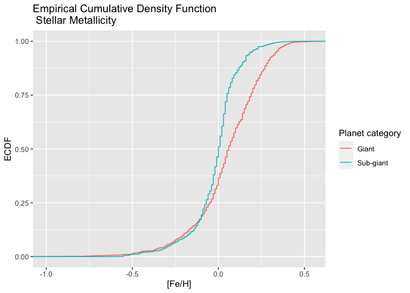

NASA API Vignette
================

-   [Introduction](#introduction)
-   [Package requirements](#package-requirements)
-   [Custom functions](#custom-functions)
    -   [annualExoDiscoveries()](#annualexodiscoveries)
    -   [calculateHZ()](#calculatehz)
    -   [hzFluxCalculator()](#hzfluxcalculator)
    -   [habitableExoFinder()](#habitableexofinder)
-   [Exploratory Data Analysis](#exploratory-data-analysis)
    -   [Annual discoveries and system
        properties](#annual-discoveries-and-system-properties)
    -   [Discovery methods](#discovery-methods)
    -   [Metallicity correlations](#metallicity-correlations)
    -   [Mass-radius diagram](#mass-radius-diagram)
    -   [Exoplanet habitability](#exoplanet-habitability)
-   [References](#references)

## Introduction

This vignette has made use of the [NASA Exoplanet
Archive](https://exoplanetarchive.ipac.caltech.edu/docs/intro.html),
which is operated by the California Institute of Technology, under
contract with the National Aeronautics and Space Administration under
the Exoplanet Exploration Program.

## Package requirements

To re-create this project in R, users are required to install:

-   **[tidyverse](https://www.tidyverse.org/)** - encompasses packages
    such as `dplyr` for subsetting data and `ggplot2` for creating
    layered graphics.  
-   **[httr](https://httr.r-lib.org/)** - supplies the `GET()` function
    to programmatically retrieve content from NASA Exoplanet Archive’s
    [TAP
    service](https://exoplanetarchive.ipac.caltech.edu/docs/TAP/usingTAP.html#examples).
-   **[jsonlite](https://cran.r-project.org/web/packages/jsonlite/vignettes/json-aaquickstart.html)** -
    supplies the `fromJSON()` function to simplify JSON content into an
    atomic vector.
-   **[latex2exp](https://cran.r-project.org/web/packages/latex2exp/vignettes/using-latex2exp.html)** -
    “an R package that parses and converts LaTeX math formulas to R’s
    plotmath expressions.” This is useful for labeling masses and radii
    on plots using [solar system
    symbols](https://solarsystem.nasa.gov/resources/680/solar-system-symbols/).
-   **[ggrepel](https://ggrepel.slowkow.com/)** - eliminate overlapping
    text labels in the `ggplot2` exoplanet mass-radius diagram.

## Custom functions

### annualExoDiscoveries()

This custom function programmatically retrieves data from the [NASA
Exoplanet Archive’s TAP
service](https://exoplanetarchive.ipac.caltech.edu/docs/TAP/usingTAP.html#examples).
Users can specify one of two tables - Planetary Systems (*ps*) or
Planetary Systems Composite Parameters (*pscomppars*) - as well as a
range for the year(s) in which planets were discovered. The default
values for this function are:

-   `tableName = "pscomppars"` - according to the [table
    definitions](https://exoplanetarchive.ipac.caltech.edu/docs/API_PS_columns.html)
    for *ps* and *pscomppars*, “PSCompPars is a more filled-in table,
    with only one row per planet, enabling a more statistical view of
    the known exoplanet population and their host environments. This
    table provides a more complete, though not necessarily
    self-consistent, set of parameters.”
-   `startYear = 1989` - the earliest listing in the PSCompPars table,
    attributed to the planet [HD 114762
    b](https://exoplanetarchive.ipac.caltech.edu/overview/HD%20114762%20b#planet_data_HD-114762-b).  
-   `endYear = as.integer(format(Sys.Date(), "%Y"))` - the current
    calendar year as understood by the user’s computer.
-   `controversial = 0` - exclude planets for which the confirmation
    status “has been questioned in the published literature.”
-   `cb_flag = 0` - exclude (0) planets which orbits a binary system. An
    option of `1` lists only planets which orbit two or more stars.
-   `format = json` - return queries in JSON format. You may also
    request data as a comma-separated-value file (CSV).

``` r
# Retrieve names, discovery years, discovery methods and various other
# planetary and stellar parameters.
# The default search begins in 1989 (the earliest date in the pscomppars table)
# and ends in the current calendar year: format(Sys.Date(), "%Y").
annualExoDiscoveries <- function(tableName = "pscomppars", 
                                 startYear = 1989, 
                                 endYear = as.integer(format(Sys.Date(), "%Y")), 
                                 controversialFlag = 0,
                                 cb_flag = 0,
                                 format = "json"){
  # Create URL string
  urlString <- paste0("https://exoplanetarchive.ipac.caltech.edu/TAP/sync?query=select+pl_name,disc_year,discoverymethod,pl_orbper,pl_rade,pl_bmasse,pl_radj,pl_bmassj,pl_eqt,pl_dens,st_spectype,st_teff,st_lum,pl_controv_flag,pl_orbeccen,pl_orbsmax,st_mass,st_metratio,st_met,sy_snum,sy_pnum,sy_dist+from+", 
                      tableName, "+where+disc_year+between+", 
                      startYear, "+and+", endYear, 
                      "+and+pl_controv_flag+=+", controversialFlag, 
                      "+and+cb_flag+=+", cb_flag,
                      "&format=", format)
  # Provide string to httr GET function
  apiCall <- GET(urlString)
  
  if(format == "json"){
    # Convert JSON content to data frame, rename columns
    apiContent <- apiCall$content %>% rawToChar() %>% fromJSON() %>%
      mutate(luminosityRatio = 10^(st_lum)) 
  } else {
    # Specify format as CSV, convert to data frame
    apiContent <- as.data.frame(read_csv(urlString))
  }
  # Return formatted data frame
  return(apiContent)
}
```

### calculateHZ()

This function calculates planetary habitable zones and their associated
stellar flux boundaries for a host star with effective temperature
`tempEff` and a stellar luminosity `luminosityRatio`. The calculations
are based on formulae defined by Kopparapu et al., whereby the effective
solar flux *S*<sub>*e**f**f*</sub> equates to
*S*<sub>*e**f**f*</sub> = *S*<sub>*e**f**f*⊙</sub> + (*a* ⋅ *T*<sub>⋆</sub>) + (*b* ⋅ *T*<sub>⋆</sub><sup>2</sup>) + (*c* ⋅ *T*<sub>⋆</sub><sup>3</sup>) + (*d* ⋅ *T*<sub>⋆</sub><sup>4</sup>)
and the corresponding habitability zone distances, *d*, equate to
*d* = (*L*/*L* ⊙ )/(*S*<sub>*e**f**f*</sub>)<sup>0.5</sup> AU (Kopparapu
et al., 2014).

The required parameters for this function are:

-   `tempEff` - the effective temperature of a host star such that
    <sub>*e**f**f*</sub> − 5780 = *T*<sub>⋆</sub>.
-   `luminosityRatio` - stellar luminosity, *L*/*L*⊙, required to
    calculate habitability zone distances, *d*. These values may be
    calculated with the `annualExoDiscoveries()` function, which finds
    the inverse logarithm of the stellar luminosity in the *PSCompPars*
    table (`st_lum`).

The output of this function is a list with four numeric parameters -
*optimisticInnerDist*, *optimisticOuterDist*, *optimisticInnerFlux*, and
*optimisticOuterFlux* - which may be used in the function
`hzFluxCalculator()`.

``` r
# Calculate habitable stellar flux boundaries for exoplanetary habitable zones. 
# Distances are returned in Astronomical Units (AU).
# Formula for s_eff and its coefficients is provided by Kopparapu et al.
# https://iopscience.iop.org/article/10.1088/2041-8205/787/2/L29
# Re-factored to R from John Armstrong's Python code at
# https://depts.washington.edu/naivpl/sites/default/files/hzcalc.py.txt
calculateHZ <- function(tempEff, luminosityRatio){
  
  # Initiate empty vectors
  s_eff <- vector()
  distanceFromStar <- vector()
  
  starTemp <- vector()
  recentVenus <- vector()
  runawayGreenhouse <- vector()
  maxGreenhouse <- vector()
  earlyMars <- vector()
  fivemeRunaway <- vector()
  tenthmeRunaway <- vector()
  
  # Populate variables with coefficients from research paper by Kopparapu et al. 
  s_eff_sun  = c(1.776, 1.107, 0.356, 0.320, 1.188, 0.99)
  a <- c(2.136e-4, 1.332e-4, 6.171e-5, 5.547e-5, 1.433e-4, 1.209e-4)
  b <- c(2.533e-8, 1.580e-8, 1.698e-9, 1.526e-9, 1.707e-8, 1.404e-8)
  c <- c(-1.332e-11, -8.308e-12, -3.198e-12, -2.874e-12, -8.968e-12, -7.418e-12)
  d <- c(-3.097e-15, -1.931e-15, -5.575e-16, -5.011e-16, -2.084e-15, -1.713e-15)
  
  t_star <- tempEff-5780
  
  for (i in 1:length(a)){
    # Calculate effective solar flux (s_eff) using formula
    # from research paper by Kopparapu et al.
    s_eff[i] <- s_eff_sun[i] + 
      a[i]*t_star + b[i]*t_star^2 + c[i]*t_star^3 + d[i]*t_star^4
    
    optimisticInnerFlux <- s_eff[1]
    optimisticOuterFlux <- s_eff[4]
    
    # Calculate corresponding inner/outer habitability zone distances
    distanceFromStar[i] <- (luminosityRatio/s_eff[i])^0.5
    
    optimisticInnerDist <- distanceFromStar[1]
    optimisticOuterDist <- distanceFromStar[4]
  }
  
  return(list(optimisticInnerDist = optimisticInnerDist, 
              optimisticOuterDist = optimisticOuterDist, 
              optimisticInnerFlux = optimisticInnerFlux, 
              optimisticOuterFlux = optimisticOuterFlux))
}
```

### hzFluxCalculator()

This custom function calculates the minima and the maxima for a planet’s
habitability zone (in units of *AU*) and stellar flux (in units of
*dex*). It requires the name of a data set and operates with the
following default parameters:

-   `earthMassCol = "pl_bmasse"` - a vector with planetary masses in
    units of Earth mass (*M*⊕).
-   `starSpecTypeCol = "st_spectype"` - a vector listing the spectral
    type of host stars.
-   `effectiveTempCol = "st_teff"` - a vector listing the effective
    temperatures of host stars.
-   `luminosityRatioCol = "luminosityRatio"` - a vector with the stellar
    luminosity ratios, *L*/*L*⊙.

These default column names are based on the variables in the [Planetary
Systems Composite Parameters
(PSCompPars)](https://exoplanetarchive.ipac.caltech.edu/docs/API_PS_columns.html)
table. The *spectralClass* column uses the `substr()` function to
distill the complete classification of a star into its main class (O, B,
A, etc.).

Habitability zone distances and incident flux are calculated only for
planets with a mass of 10*M*⊕ or less. This is the hypothetical
threshold for planets with an appreciable composition of “volatiles”
such as water and ammonia (Kuchner, 2003).

``` r
# Custom function to calculate values for 
# inner and outer habitable zone, stellar flux
hzFluxCalculator <- function(data, earthMassCol = "pl_bmasse", 
                             starSpecTypeCol = "st_spectype", 
                             effectiveTempCol = "st_teff",
                             luminosityRatioCol = "luminosityRatio"){
  
  # Add columns for inner, outer habitable zone distances, flux as well as
  # a column for the primary spectral class 
  data %>% mutate(innerHZ = NA, outerHZ = NA, innerFlux = NA, 
                  outerFlux = NA, spectralClass = NA)
  
  # Transform custom column names (char) into vectors which can be used in 
  # loops
  earthMassCol <- data[ , earthMassCol]
  starSpecTypeCol <- data[ , starSpecTypeCol]
  effectiveTempCol <- data[ , effectiveTempCol]
  luminosityRatioCol <- data[ , luminosityRatioCol]
  
  for(i in 1:length(earthMassCol)){
    if(!is.na(starSpecTypeCol[i])){
      # Extract first letter from stellar classification in the NASA Exoplanet Archive
      data$spectralClass[i] <- substr(starSpecTypeCol[i], 1, 1)
    } else {
      # If stellar classification is not provided
      data$spectralClass[i] <- NA
    }
    
    # Exclude planets which are larger than "super-Earths" (10M)
    if(!is.na(earthMassCol[i]) & earthMassCol[i] <= 10 & 
       earthMassCol[i] >= 0.1){
      
      # Create list of habitability zone and flux parameters
      hzVars <- calculateHZ(effectiveTempCol[i], 
                            luminosityRatioCol[i])
      
      # Extract individual parameters from the list
      data$innerHZ[i] <- hzVars[[1]]
      data$outerHZ[i] <- hzVars[[2]]
      
      data$innerFlux[i] <- hzVars[[3]]
      data$outerFlux[i] <- hzVars[[4]]
      
    } else {
      data$innerHZ[i] <- NA
      data$outerHZ[i] <- NA
      data$innerFlux[i] <- NA
      data$outerFlux[i] <- NA
    }
  }
  
  return(data)
}
```

### habitableExoFinder()

This function produces a data frame listing potentially habitable
exoplanets from a set of general habitability criteria, many of which
are inspired by the University of Puerto Rico’s [Planetary Habitability
Laboratory](http://phl.upr.edu/projects/habitable-exoplanets-catalog/methods).

These parameters can be tuned using arguments from published research.
For simplicity, the default values are:

-   `minEarthMass = 0.1` - minimum acceptable planet mass (*M*⊕).
-   `maxEarthMass = 5` - maximum acceptable planet mass (*M*⊕).
-   `minEarthRadius = 0.5` - minimum acceptable radius (*R*⊕).
-   `maxEarthRadius = 1.5` - maximum acceptable radius (*R*⊕).
-   `maxInnerFlux = 1.5` - maximum stellar flux incident on a planet.
-   `maxOuterFlux = 0.20` - minimum stellar flux incident on a planet.
-   `minTemp = 273` - minimum effective temperature of the planet in
    units of Kelvin.
-   `maxTemp = 340` - maximum effective temperature of the planet in
    units of Kelvin.

``` r
# Identify potentially habitable exoplanets. 
# Default function parameters provided by Planetary Habitability Laboratory, 
# http://phl.upr.edu/projects/habitable-exoplanets-catalog
habitableExoFinder <- function(data, minEarthMass = 0.1, maxEarthMass = 5, 
                               minEarthRadius = 0.5, maxEarthRadius = 1.5,
                               maxInnerFlux = 1.5, maxOuterFlux = 0.20,
                               minTemp = 273, maxTemp = 340){
  
  # Subset data using provided parameters
  habitablePlanets <- data %>% select(pl_name, pl_eqt, spectralClass, 
                                      pl_bmasse, pl_rade, pl_orbeccen, 
                                      pl_orbsmax, innerHZ, outerHZ, 
                                      innerFlux, outerFlux) %>% 
    # Consider planets which only orbit stars of type F, G, K, and M
    # Subset data based on supplied planetary conditions
    filter(spectralClass %in% c("F", "G", "K", "M") & 
             (pl_orbsmax >= innerHZ) & (pl_orbsmax <= outerHZ) & 
             (pl_bmasse >= minEarthMass) &
             (pl_bmasse <= maxEarthMass) & 
             (pl_rade >= minEarthRadius) & (pl_rade <= maxEarthRadius) &
             (innerFlux <= maxInnerFlux) & (outerFlux >= maxOuterFlux) &
             (pl_eqt <= maxTemp | (is.na(pl_eqt))) & 
             (pl_eqt >= minTemp | (is.na(pl_eqt))))
  
  return(habitablePlanets)
}
```

## Exploratory Data Analysis

### Annual discoveries and system properties

The `annualExoDiscoveries()` function retrieves the latest data from
NASA’s Exoplanet Archive. By default, the function targets the Planetary
Systems Composite Parameters Table (`tableName = "pscomppars"`) and
excludes bodies which have had their planetary status “questioned in the
published literature” (NASA Exoplanet Science Institute (2020)).

A preview of the generated data frame is shown below.

``` r
# Retrieve latest exoplanet data
exoplanetData <- annualExoDiscoveries()
str(exoplanetData)
```

    ## 'data.frame':    4462 obs. of  23 variables:
    ##  $ pl_name        : chr  "OGLE-2016-BLG-1227L b" "GJ 480 b" "Kepler-276 c" "Kepler-829 b" ...
    ##  $ disc_year      : int  2020 2020 2013 2016 2018 2016 2010 2005 2007 2010 ...
    ##  $ discoverymethod: chr  "Microlensing" "Radial Velocity" "Transit" "Transit" ...
    ##  $ pl_orbper      : num  NA 9.57 31.88 6.88 1.92 ...
    ##  $ pl_rade        : num  13.9 3.69 2.9 2.11 3.52 ...
    ##  $ pl_bmasse      : num  250 13.2 16.6 5.1 12.2 ...
    ##  $ pl_radj        : num  1.24 0.33 0.259 0.188 0.314 0.185 1.06 1.22 1.2 1.18 ...
    ##  $ pl_bmassj      : num  0.79 0.0415 0.052 0.016 0.0383 ...
    ##  $ pl_eqt         : num  NA NA 563 857 1186 ...
    ##  $ pl_dens        : num  0.512 1.44 3.74 2.98 1.54 3.06 1.96 0.923 1.31 0.273 ...
    ##  $ st_spectype    : chr  NA "M3.5 Ve" NA NA ...
    ##  $ st_teff        : num  NA 3381 5779 5698 5060 ...
    ##  $ st_lum         : num  NA -1.612 -0.089 0.04 -0.524 ...
    ##  $ pl_controv_flag: int  0 0 0 0 0 0 0 0 0 0 ...
    ##  $ pl_orbeccen    : num  NA 0.1 0 0 NA 0 0.19 0.0167 0.028 0.17 ...
    ##  $ pl_orbsmax     : num  3.4 0.068 0.1994 0.0678 0.0291 ...
    ##  $ st_mass        : num  0.1 0.45 1.1 0.98 0.89 0.87 1 1.2 1.61 0.69 ...
    ##  $ st_metratio    : chr  NA NA "[Fe/H]" "[Fe/H]" ...
    ##  $ st_met         : num  NA NA 0.02 0.03 0.28 -0.04 0.22 0.29 0.04 -0.14 ...
    ##  $ sy_snum        : int  1 1 1 1 1 2 1 1 1 1 ...
    ##  $ sy_pnum        : int  1 1 3 1 1 1 1 1 1 1 ...
    ##  $ sy_dist        : num  NA 14.2 1144.9 1073.8 402.9 ...
    ##  $ luminosityRatio: num  NA 0.0244 0.8147 1.0965 0.2992 ...

``` r
# Display the first five rows of data
head(exoplanetData, n = 5) %>% knitr::kable()
```

| pl\_name              | disc\_year | discoverymethod | pl\_orbper | pl\_rade | pl\_bmasse | pl\_radj | pl\_bmassj | pl\_eqt | pl\_dens | st\_spectype | st\_teff | st\_lum | pl\_controv\_flag | pl\_orbeccen | pl\_orbsmax | st\_mass | st\_metratio | st\_met | sy\_snum | sy\_pnum |  sy\_dist | luminosityRatio |
|:----------------------|-----------:|:----------------|-----------:|---------:|-----------:|---------:|-----------:|--------:|---------:|:-------------|---------:|--------:|------------------:|-------------:|------------:|---------:|:-------------|--------:|---------:|---------:|----------:|----------------:|
| OGLE-2016-BLG-1227L b |       2020 | Microlensing    |         NA |    13.90 |      250.0 |    1.240 |    0.79000 |      NA |    0.512 | NA           |       NA |      NA |                 0 |           NA |      3.4000 |     0.10 | NA           |      NA |        1 |        1 |        NA |              NA |
| GJ 480 b              |       2020 | Radial Velocity |   9.567000 |     3.69 |       13.2 |    0.330 |    0.04153 |      NA |    1.440 | M3.5 Ve      |     3381 |  -1.612 |                 0 |          0.1 |      0.0680 |     0.45 | NA           |      NA |        1 |        1 |   14.2358 |       0.0244343 |
| Kepler-276 c          |       2013 | Transit         |  31.884000 |     2.90 |       16.6 |    0.259 |    0.05200 |     563 |    3.740 | NA           |     5779 |  -0.089 |                 0 |          0.0 |      0.1994 |     1.10 | \[Fe/H\]     |    0.02 |        1 |        3 | 1144.8600 |       0.8147043 |
| Kepler-829 b          |       2016 | Transit         |   6.883376 |     2.11 |        5.1 |    0.188 |    0.01600 |     857 |    2.980 | NA           |     5698 |   0.040 |                 0 |          0.0 |      0.0678 |     0.98 | \[Fe/H\]     |    0.03 |        1 |        1 | 1073.7600 |       1.0964782 |
| K2-283 b              |       2018 | Transit         |   1.921036 |     3.52 |       12.2 |    0.314 |    0.03830 |    1186 |    1.540 | NA           |     5060 |  -0.524 |                 0 |           NA |      0.0291 |     0.89 | \[Fe/H\]     |    0.28 |        1 |        1 |  402.9150 |       0.2992265 |

As of Wed Oct 6 18:09:07 2021, the archive’s [Planetary Systems
Composite
Parameters](https://exoplanetarchive.ipac.caltech.edu/docs/API_PS_columns.html)
(PSCompPars) table lists 4462 confirmed exoplanet observations. We can
compare the composition of their extrasolar systems against that of our
own.

``` r
# Two-way "flat" contingency table to display complete rows (vs. table(), which 
# displays the last column separately from others)
# Quantify systems according to the total number of stars and planets
starPlanetFreq <- ftable(exoplanetData$sy_snum, exoplanetData$sy_pnum)
starPlanetFreq
```

    ##       1    2    3    4    5    6    7    8
    ##                                           
    ## 1  2312  950  438  212   95   41    7    8
    ## 2   200   57   39   32   15    6    0    0
    ## 3    34    8    0    0    7    0    0    0
    ## 4     1    0    0    0    0    0    0    0

2312 planets - more than 51.8% of all observed - orbit a single star and
have no other planetary companions. Another 950 planets (21.3%) have one
star and two companion planets. 7 systems are particularly interesting,
with three stars and five planets in their system. One observations
contains a planet with a record four stars.

We can also enumerate the annual number of exoplanet findings since
1989.

``` r
# Retrieve latest exoplanet data
annualDiscoveries <- exoplanetData 

# Create horizontal bar plot with annual number of discoveries
annualDiscoveryBar <- ggplot(annualDiscoveries, aes(x = as.character(disc_year)))
annualDiscoveryBar + geom_bar(aes(fill = discoverymethod), 
                             alpha = 0.8, position = "stack") +
  labs(x = "Discovery year", y = "Count",
       title = "Exoplanet discoveries over time", 
       subtitle = "Grouped by discovery method") +
  theme(axis.text.x = element_text(angle = 45)) + 
  geom_text(stat="count", aes(label=..count..), 
            vjust=0.5, hjust = -0.01, size = 2.5) +
  theme(legend.position = c(0.65, 0.33)) +
  # Split legend into two columns
  guides(fill=guide_legend(ncol=2)) +
  # Change color palette for bars based on
  # http://www.cookbook-r.com/Graphs/Colors_(ggplot2)/
  scale_fill_brewer(palette = "Spectral", name = "Discovery method") +
  coord_flip() 
```

<!-- -->

The contingency table below summarizes the cumulative number of
observations for each discovery method.

``` r
# Contingency table 
# Total number of exoplanets found with each discovery method
discoveriesByMethod <- table(annualDiscoveries$discoverymethod)

# Display as data frame for aesthetics
knitr::kable(discoveriesByMethod,
             col.names = c("Discovery method", "Frequency"))
```

| Discovery method              | Frequency |
|:------------------------------|----------:|
| Astrometry                    |         1 |
| Disk Kinematics               |         1 |
| Imaging                       |        45 |
| Microlensing                  |       113 |
| Orbital Brightness Modulation |         4 |
| Pulsar Timing                 |         6 |
| Pulsation Timing Variations   |         2 |
| Radial Velocity               |       870 |
| Transit                       |      3398 |
| Transit Timing Variations     |        22 |

2014 and 2016 appear as the most prolific years for discovery. Of the
known 4462 exoplanets, 76.2% were observed while transiting their host
star and temporarily reducing its brightness. Another 19.5% were
observed indirectly via the radial velocity method, whereby the planet
and its star orbit around a common center of gravity and prompt
noticeable Doppler shifts in the stellar spectrum.

The data frame below contains the names of planets which are thought to
orbit two or more stars - the so-called “circumbinary planets” (R. et
al., 2011).

``` r
# Query all known circumbinary systems
circumbinaryPlanets <- annualExoDiscoveries(cb_flag = 1)

# Display in a matrix with "ncol = ..." columns
matrix(circumbinaryPlanets$pl_name, nrow = 13, byrow = TRUE)
```

    ##       [,1]                       
    ##  [1,] "NSVS 14256825 b"          
    ##  [2,] "SR 12 AB c"               
    ##  [3,] "VHS J125601.92-125723.9 b"
    ##  [4,] "Kepler-35 b"              
    ##  [5,] "NY Vir b"                 
    ##  [6,] "HIP 79098 AB b"           
    ##  [7,] "Kepler-1661 b"            
    ##  [8,] "OGLE-2016-BLG-0613L AB b" 
    ##  [9,] "HD 202206 c"              
    ## [10,] "OGLE-2007-BLG-349L AB c"  
    ## [11,] "TOI-1338 b"               
    ## [12,] "HW Vir b"                 
    ## [13,] "UZ For b"                 
    ##       [,2]                          
    ##  [1,] "RR Cae b"                    
    ##  [2,] "MXB 1658-298 b"              
    ##  [3,] "2MASS J01033563-5515561 AB b"
    ##  [4,] "Kepler-47 c"                 
    ##  [5,] "NY Vir c"                    
    ##  [6,] "KIC 5095269 b"               
    ##  [7,] "NN Ser d"                    
    ##  [8,] "UZ For c"                    
    ##  [9,] "OGLE-2018-BLG-1700L b"       
    ## [10,] "Ross 458 c"                  
    ## [11,] "Kepler-413 b"                
    ## [12,] "PSR B1620-26 b"              
    ## [13,] "Kepler-38 b"                 
    ##       [,3]                       
    ##  [1,] "2MASS J19383260+4603591 b"
    ##  [2,] "Kepler-1647 b"            
    ##  [3,] "Kepler-453 b"             
    ##  [4,] "Kepler-47 b"              
    ##  [5,] "DP Leo b"                 
    ##  [6,] "Kepler-16 b"              
    ##  [7,] "ROXs 42 B b"              
    ##  [8,] "DE CVn b"                 
    ##  [9,] "PH1 b"                    
    ## [10,] "NN Ser c"                 
    ## [11,] "Kepler-47 d"              
    ## [12,] "Kepler-34 b"              
    ## [13,] "TIC 172900988 b"

They are presented in the table above for completeness but, to reduce
the complexity of *n*-body problems, they are excluded by default from
the `annualExoDiscoveries()` function.

### Discovery methods

Exoplanet observation methods excel under specific conditions. Direct
imaging, for instance, requires planets to be relatively far from their
star in order for stellar brightness not to overwhelm planetary dimness.

``` r
# Subset data to include only detection methods with a relatively large number
# of exoplanet discoveries
extendedDiscoveryProp <- exoplanetData
extendedDiscoveryProp <- extendedDiscoveryProp %>% 
  filter(discoverymethod %in% c("Transit", "Radial Velocity", "Microlensing", "Imaging") &
           !is.na(pl_orbsmax) & !is.na(sy_dist))

# Display mean and median semi-major axes (in units of AU) for 
# planets observed by these methods
discoverySummaries <- extendedDiscoveryProp %>% group_by(discoverymethod) %>%
  summarise(meanSMA = mean(pl_orbsmax), medianSMA = median(pl_orbsmax))
knitr::kable(discoverySummaries, 
             col.names = c("Discovery method", "Mean SMA (AU)",
                           "Median SMA (AU)"))
```

| Discovery method | Mean SMA (AU) | Median SMA (AU) |
|:-----------------|--------------:|----------------:|
| Imaging          |   617.2953488 |       162.00000 |
| Microlensing     |     2.6744455 |         2.25000 |
| Radial Velocity  |     1.6044780 |         1.02000 |
| Transit          |     0.1261105 |         0.07875 |

The transit, radial velocity, and microlensing methods favor the
detection of planets which orbit their star at an average distance of
0.1- 2.7 AU. For direct observations, the median semi-major axis for
planets is 162 AU. The fact that the mean is 3.8 times higher than the
median indicates the presence of outliers at substantially higher
separations from their star.

The boxplot below shows another distinction between the observation
methods. Compared to radial velocity and direct imaging, detection
through microlensing captures planets at a median distance that is over
one hundred times higher from our solar system.

``` r
# Boxplot, four most prolific discovery methods and quantitative summaries for
# distances (in parsecs) to the observed planets
orbsmaxBoxPlot <- ggplot(extendedDiscoveryProp, 
                         aes(x = discoverymethod, y = sy_dist,
                             fill = discoverymethod))

orbsmaxBoxPlot + geom_boxplot() +
  # Remove legend after coloration
  theme(legend.position = "none") +
  scale_y_log10(breaks = scales::trans_breaks("log10", function(x) 10^x),
   labels = scales::trans_format("log10", scales::math_format(10^.x))) +
  labs(x = "Discovery method", y = "Distance (log(pc))",
       title = "Detection methods and \n summary of distances to exoplanetary systems") +
  # Add log ticks to left side
  annotation_logticks(sides="l")
```

<!-- -->

Direct imaging also favors young stars, which tend to be “self-luminous
due to ongoing contraction and…accretion” (service), 2016). The
combination of large semi-major axes and a luminous nature is generally
attributed to giants that match or exceed the mass of Jupiter. This is
corroborated by the scatter plot below, whereby the bulk of
directly-imaged planets have a mass of approximately 10*M*<sub>*J*</sub>
and reside at a distance of 10-10,000 astronomical units from their
star.

``` r
# New vector with temporary data
orbsmaxMassData <- exoplanetData 

# Scatter plot of masses/radii for discovered exoplanets
# Use LaTeX to denote the standard astronomical symbol for the Earth
orbsmaxMassScatter <- ggplot(extendedDiscoveryProp, aes(x = pl_orbsmax, y = pl_bmassj))
orbsmaxMassScatter + geom_point(aes(color = pl_orbeccen, shape = discoverymethod), 
                                alpha = 0.6, position = "jitter") +
  scale_x_log10(breaks = scales::trans_breaks("log10", function(x) 10^x),
   labels = scales::trans_format("log10", scales::math_format(10^.x))) +
    scale_y_log10(breaks = scales::trans_breaks("log10", function(x) 10^x),
   labels = scales::trans_format("log10", scales::math_format(10^.x))) +
  # Select color palette for eccentricity from 
  # https://rdrr.io/r/grDevices/palettes.html
  scale_color_gradientn(colours = terrain.colors(5)) +
  labs(x = "Semi-major axis [AU]", y = TeX(r'(Planet mass $(M_{J})$)'),
       title = "Planetary mass versus semi-major axis", col = "Orbit eccentricity",
       shape = "Discovery method") 
```

    ## Warning: Removed 17 rows containing
    ## missing values (geom_point).

<!-- -->

### Metallicity correlations

We can observe at least one more obvious trend from the data - that of
the “giant planet–metallicity correlation” - whereby giant planets “tend
to appear around metal-rich stars” (Adibekyan, 2019). COonversely,
“there is little or no dependence on metallicity for low-mass planets
such as super-Earths” (Hasegawa & Pudritz, 2014). If we use 10*M*⊕ as
the threshold for super-Earths and create a histogram for the
metallicity distribution of stars in the exoplanet database, we find
that lanets with masses of 10*M*⊕ or less are centered around stars with
\[Fe/H\] = 0. On the other hand, giant plants (those which exceed
10*M*⊕) exhibit a slightly right-skewed distribution with a substantial
concentration near \[Fe/H\] = 0.13.

``` r
metallicityData <- extendedDiscoveryProp %>% filter(st_metratio == "[Fe/H]" &
                                                      !is.na(pl_bmasse))
metallicityData %>% mutate(giantPlFlag = NA)
```

    ## # A tibble: 3,459 × 24
    ##    pl_name      disc_year
    ##    <chr>            <int>
    ##  1 Kepler-276 c      2013
    ##  2 Kepler-829 b      2016
    ##  3 K2-283 b          2018
    ##  4 Kepler-477 b      2016
    ##  5 HAT-P-15 b        2010
    ##  6 HD 149143 b       2005
    ##  7 HD 210702 b       2007
    ##  8 HIP 12961 b       2010
    ##  9 XO-5 b            2008
    ## 10 HD 5608 b         2012
    ## # … with 3,449 more rows, and 22
    ## #   more variables:
    ## #   discoverymethod <chr>,
    ## #   pl_orbper <dbl>,
    ## #   pl_rade <dbl>,
    ## #   pl_bmasse <dbl>,
    ## #   pl_radj <dbl>, …

``` r
for (i in 1:length(metallicityData$pl_name)){
  if (metallicityData$pl_bmasse[i] >= 10){
    metallicityData$giantPlFlag[i] = "Giant"
  } else if(metallicityData$pl_bmasse[i] < 10){
    metallicityData$giantPlFlag[i] = "Sub-giant"
  }
  else {
    metallicityData$giantPlFlag[i] = NA
  }
}

metallicityHisto <- ggplot(metallicityData, aes(x = st_met))
metallicityHisto + geom_histogram(aes(y = ..density.., 
                                      fill = giantPlFlag),
                                  bins = 50, color = "red") +
  labs(x = "Stellar metallicity [Fe/H]",
       title = "The distribution of metallicity in giant and sub-giant planets",
       fill = "") + 
  geom_density(adjust = 0.5, alpha = 0.5, aes(fill = giantPlFlag))
```

<!-- -->

An empirical cumulative distribution function affirms that, while 50% of
sub-giant (*M* &lt; 10*M*⊕) planets orbit a star with a metallicity
\[Fe/H\] = 0, 50% of giant planets (*M* &gt;  = 10*M*⊕) orbit stars with
a metallicity of \[Fe/H\] = 0.06.

``` r
# Render and label metallicity ECDF 
metallicityHisto + stat_ecdf(geom = "step", aes(color = giantPlFlag)) +
  labs(title="Empirical Cumulative Density Function \n Stellar Metallicity",
     y = "ECDF", x="[Fe/H]", color = "Planet category")
```

<!-- -->

``` r
# Group data by planet status (giant/sub-giant) and calculate 
# mean/median metallicity. 
metallicityAverages <- metallicityData %>% group_by(giantPlFlag) %>%
  summarise(meanMetallicity = mean(st_met), medianMetallicity = median(st_met))
knitr::kable(metallicityAverages, 
             col.names = c("Classification", "Mean stellar metallicity [dex]",
                           "Median stellar metallicity [dex]"))
```

| Classification | Mean stellar metallicity \[dex\] | Median stellar metallicity \[dex\] |
|:---------------|---------------------------------:|-----------------------------------:|
| Giant          |                        0.0506846 |                               0.06 |
| Sub-giant      |                       -0.0131614 |                               0.00 |

### Mass-radius diagram

Planets with radii in the range 10 − 15*R*⊕ comprise 20% of our data
set. The bulk of the remaining observations - more than 60% - consists
of planets in the range of 0.1 − 5*R*⊕.

``` r
radiiFreq <- ggplot(annualDiscoveries, aes(x = pl_rade)) 
radiiFreq + geom_histogram(color = "#123456", fill = "#f7a22b", 
                           aes(y = (..count..)/sum(..count..)),
                           binwidth = 2) +
  labs(title="Distribution of planetary radii") +
  labs(x = TeX(r'(Radius $(R\oplus$))'), 
       y = "Frequency") +
  geom_density()
```

    ## Warning: Removed 7 rows containing
    ## non-finite values (stat_bin).

    ## Warning: Removed 7 rows containing
    ## non-finite values
    ## (stat_density).

<!-- -->

By combining radii with the masses of planets, we can produce a
mass-radius diagram and calculate planetary densities. From this
diagram, it is also apparent that planetary radii tend to increase with
mass until approximately 1000*M*⊕, at which point gravity impels even
the hardiest planetary material to compress and constrains further
radial growth (Hoolst et al., 2019).

``` r
# New vector with temporary data
tempMassData <- exoplanetData 

# Scatter plot of masses/radii for discovered exoplanets
# Use LaTeX to denote the standard astronomical symbol for the Earth
tempMassScatter <- ggplot(tempMassData, aes(x = pl_bmasse, y = pl_rade))
tempMassScatter + geom_point(aes(col = pl_eqt, size = pl_dens), alpha = 0.6, position = "jitter") +
  scale_color_gradientn(colours = heat.colors(5)) +
  labs(x = TeX(r'(Planet mass $(log(M\oplus))]$))'), y = TeX(r'(Planet radius $(R\oplus)$)'),
       title = "Planetary mass-radius diagram", col = "Equilbrium temperature (K)",
       size = TeX(r'(Planet density $(g/cm^3)$)')) +
  # Label planets exceeding R = 25 (Earth), eliminate overlapping labels
  # using geom_text_repel from the ggrepel package
  geom_text_repel(aes(label = ifelse(pl_rade >= 25, pl_name,''))) +
  scale_x_log10(breaks = scales::trans_breaks("log10", function(x) 10^x),
   labels = scales::trans_format("log10", scales::math_format(10^.x)))
```

    ## Warning: Removed 94 rows containing
    ## missing values (geom_point).

    ## Warning: Removed 24 rows containing
    ## missing values
    ## (geom_text_repel).

<!-- -->

### Exoplanet habitability

Among the 4462 exoplanets in the NASA Exoplanet Archive, which have the
potential to harbor life? The [Planetary Habitability
Laboratory](http://phl.upr.edu/projects/habitable-exoplanets-catalog/methods)
(PHL) attempts to answer this by narrowing conditions such that

1.  “The planet orbits an F, G, K, or M star.”
2.  “The planet orbits within the optimistic habitable zone defined by
    Kopparapu et al. (2014).”
3.  “The planet has a radius between 0.5 to 2.5 Earth radii or a minimum
    mass between 0.1 to 10 Earth masses.”

Moreover, as defined by Zsom et al., “an exoplanet is habitable if
liquid water, a crucial ingredient for life as we know it, is present on
its surface, and if the surface temperature and pressure are such that
complex organic molecules are stable” (Zsom et al., 2013). This this
end, we can use criteria from the PHL and planetary equilibrium
temperatures to compile our own list of potentially habitable
exoplanets. We can then compare this list against one compiled by the
PHL [Habitable Planets
Catalog](http://phl.upr.edu/projects/habitable-exoplanets-catalog).

First, we calculate the maxima and minima for habitable zone distances
and solar flux using formulae provided by Kopparapu et al. (Kopparapu et
al., 2014). The `hzFluxCalculator()` function takes an existing data
frame (such as the one produced by the `annualExoDiscoveries()`
function) and appends to it the columns *innerHZ*, *outerHZ*,
*innerFlux*, and *outerFlux*. Individual habitable zone values are
calculated using the `calculateHZ()` function and extended to larger
data sets via the `hzFluxCalculator()` function.

``` r
# Exoplanet data from the NASA Exoplanet Archive
planetData <- exoplanetData

# Calculate maxima/minima for habitabilize zone distances 
# and the solar flux incident on each exoplanet
planetData <- hzFluxCalculator(planetData)

head(planetData, n = 1000)
```

    ## # A tibble: 1,000 × 28
    ##    pl_name               disc_year
    ##    <chr>                     <int>
    ##  1 OGLE-2016-BLG-1227L b      2020
    ##  2 GJ 480 b                   2020
    ##  3 Kepler-276 c               2013
    ##  4 Kepler-829 b               2016
    ##  5 K2-283 b                   2018
    ##  6 Kepler-477 b               2016
    ##  7 HAT-P-15 b                 2010
    ##  8 HD 149143 b                2005
    ##  9 HD 210702 b                2007
    ## 10 HIP 12961 b                2010
    ## # … with 990 more rows, and 26
    ## #   more variables:
    ## #   discoverymethod <chr>,
    ## #   pl_orbper <dbl>,
    ## #   pl_rade <dbl>,
    ## #   pl_bmasse <dbl>,
    ## #   pl_radj <dbl>, …

Next, we supply this data frame to the `habitableExoFinder()` function
alongside our criteria for habitability. In the code chunk below, we use
effective temperatures in the range of 181 − 279 Kelvin and planet radii
in the range of 2.5 − 10*R*⊕.

``` r
# List habitable planets using "optimistic" parameters from
# Planetary Habitability Laboratory
listHabitablePlanets <- habitableExoFinder(planetData, minTemp = 181, maxTemp = 279,
                                           maxEarthMass = 10, maxEarthRadius = 2.5)
knitr::kable(listHabitablePlanets)
```

| pl\_name           | pl\_eqt | spectralClass | pl\_bmasse | pl\_rade | pl\_orbeccen | pl\_orbsmax |   innerHZ |   outerHZ | innerFlux | outerFlux |
|:-------------------|--------:|:--------------|-----------:|---------:|-------------:|------------:|----------:|----------:|----------:|----------:|
| GJ 180 c           |      NA | M             |      6.400 |    2.410 |        0.090 |    0.129000 | 0.0934020 | 0.2439176 |  1.490349 | 0.2185313 |
| GJ 433 d           |      NA | M             |      5.223 |    2.140 |        0.070 |    0.178000 | 0.1497641 | 0.3893868 |  1.493428 | 0.2209213 |
| GJ 832 c           |      NA | M             |      5.400 |    2.180 |        0.180 |    0.163000 | 0.1319321 | 0.3428377 |  1.493823 | 0.2212192 |
| Wolf 1061 c        |      NA | M             |      3.410 |    1.660 |        0.110 |    0.089000 | 0.0827929 | 0.2165173 |  1.489407 | 0.2177783 |
| GJ 682 b           |      NA | M             |      4.400 |    1.930 |        0.080 |    0.080000 | 0.0367596 | 0.0975721 |  1.479991 | 0.2100624 |
| K2-288 B b         |  226.36 | M             |      4.270 |    1.900 |           NA |    0.164000 | 0.0888174 | 0.2322835 |  1.489375 | 0.2177525 |
| Proxima Cen b      |  234.00 | M             |      1.270 |    1.080 |        0.350 |    0.048500 | 0.0323426 | 0.0857610 |  1.480643 | 0.2105817 |
| GJ 273 b           |      NA | M             |      2.890 |    1.510 |        0.100 |    0.091101 | 0.0767897 | 0.2004276 |  1.490712 | 0.2188190 |
| GJ 163 c           |      NA | M             |      6.800 |    2.500 |        0.099 |    0.125400 | 0.1144725 | 0.2970570 |  1.494849 | 0.2219834 |
| GJ 667 C c         |      NA | M             |      3.800 |    1.770 |        0.020 |    0.125000 | 0.0959303 | 0.2507763 |  1.489665 | 0.2179853 |
| GJ 1061 c          |      NA | M             |      1.740 |    1.180 |        0.290 |    0.035000 | 0.0339003 | 0.0902913 |  1.477721 | 0.2083091 |
| Teegarden’s Star c |      NA | M             |      1.110 |    1.040 |        0.000 |    0.044300 | 0.0222295 | 0.0593377 |  1.476180 | 0.2071754 |
| TOI-700 d          |  268.80 | M             |      1.570 |    1.144 |        0.111 |    0.163300 | 0.1245684 | 0.3238778 |  1.493428 | 0.2209213 |
| GJ 1061 d          |      NA | M             |      1.640 |    1.160 |        0.530 |    0.054000 | 0.0339003 | 0.0902913 |  1.477721 | 0.2083091 |
| Teegarden’s Star b |      NA | M             |      1.050 |    1.020 |        0.000 |    0.025200 | 0.0222295 | 0.0593377 |  1.476180 | 0.2071754 |
| GJ 357 d           |  219.60 | M             |      6.100 |    2.340 |           NA |    0.204000 | 0.1031987 | 0.2677352 |  1.495036 | 0.2221208 |

Our combination of habitable zone distances, incident flux, effective
temperatures, planet masses, and planet radii yield 16 potentially
habitable exoplanets.

## References

<div id="refs" class="references csl-bib-body hanging-indent"
line-spacing="2">

<div id="ref-geosciences9030105" class="csl-entry">

Adibekyan, V. (2019). Heavy metal rules. I. Exoplanet incidence and
metallicity. *Geosciences*, *9*(3).
<https://doi.org/10.3390/geosciences9030105>

</div>

<div id="ref-pub.1041145028" class="csl-entry">

Hasegawa, Y., & Pudritz, R. E. (2014). PLANET TRAPS AND PLANETARY CORES:
ORIGINS OF THE PLANET-METALLICITY CORRELATION. *The Astrophysical
Journal*, *794*(1), 25. <https://doi.org/10.1088/0004-637x/794/1/25>

</div>

<div id="ref-doi:10.1080/23746149.2019.1630316" class="csl-entry">

Hoolst, T. V., Noack, L., & Rivoldini, A. (2019). Exoplanet interiors
and habitability. *Advances in Physics: X*, *4*(1), 1630316.
<https://doi.org/10.1080/23746149.2019.1630316>

</div>

<div id="ref-Kopparapu_2014" class="csl-entry">

Kopparapu, R. K., Ramirez, R. M., SchottelKotte, J., Kasting, J. F.,
Domagal-Goldman, S., & Eymet, V. (2014). HABITABLE ZONES AROUND
MAIN-SEQUENCE STARS: DEPENDENCE ON PLANETARY MASS. *The Astrophysical
Journal*, *787*(2), L29. <https://doi.org/10.1088/2041-8205/787/2/l29>

</div>

<div id="ref-pub.1058671435" class="csl-entry">

Kuchner, M. J. (2003). Volatile-rich earth-mass planets in the habitable
zone. *The Astrophysical Journal*, *596*(1), l105–l108.
<https://doi.org/10.1086/378397>

</div>

<div id="ref-https://doi.org/10.26133/nea13" class="csl-entry">

NASA Exoplanet Science Institute. (2020). *Planetary systems composite
table*. IPAC. <https://doi.org/10.26133/NEA13>

</div>

<div id="ref-kepler-16" class="csl-entry">

R., D. L., A., C. J., C., F. D., W., S. R., B., H. S., N., W. J., A., O.
J., Andrej, P., F., W. W., N., Q. S., David, L., Guillermo, T., A., B.
L., W., M. G., J., F. J., Avi, S., B., F. E., J., L. J., Darin, R., …
Debra, F. (2011). Kepler-16: A transiting circumbinary planet \[Doi:
10.1126/science.1210923\]. *Science*, *333*(6049), 1602–1606.
<https://doi.org/10.1126/science.1210923>

</div>

<div id="ref-cite-key" class="csl-entry">

service), S. (Online. (2016). *Methods of detecting exoplanets 1st
advanced school on exoplanetary science* (V. Bozza, L. Mancini, & A.
Sozzetti, Eds.). Cham : Springer International Publishing : Imprint:
Springer, 2016. <https://catalog.lib.ncsu.edu/catalog/NCSU3603337>

</div>

<div id="ref-pub.1021397281" class="csl-entry">

Zsom, A., Seager, S., Wit, J. de, & Stamenković, V. (2013). TOWARD THE
MINIMUM INNER EDGE DISTANCE OF THE HABITABLE ZONE. *The Astrophysical
Journal*, *778*(2), 109. <https://doi.org/10.1088/0004-637x/778/2/109>

</div>

</div>
