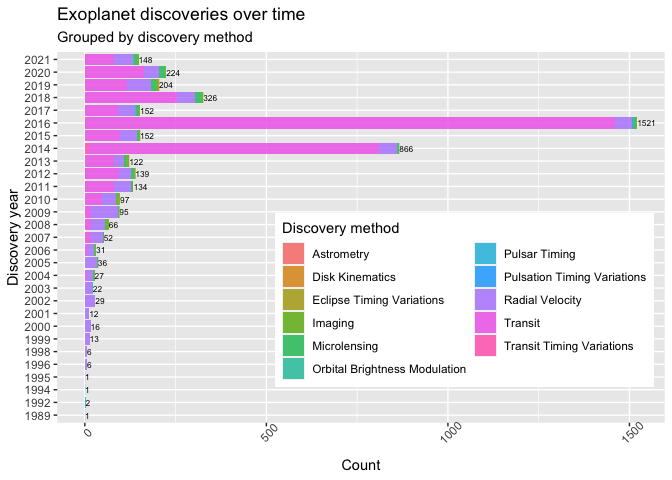

NASA API Vignette
================

-   [Package requirements](#package-requirements)
-   [Custom functions](#custom-functions)
    -   [annualExoDiscoveries()](#annualexodiscoveries)
    -   [calculateHZ](#calculatehz)
    -   [hzFluxCalculator()](#hzfluxcalculator)
    -   [habitableExoFinder()](#habitableexofinder)
-   [Exploratory Data Analysis](#exploratory-data-analysis)
-   [References](#references)

## Package requirements

To re-create this vignette in R, users are required to install

-   **[tidyverse](https://www.tidyverse.org/)** - encompasses packages
    such as `dplyr` for subsetting data and `ggplot2` for creating
    layered graphics.  
-   **[httr](https://httr.r-lib.org/)** - supplies the `GET()` function
    to programmatically retrieve content from NASA Exoplanet Archive’s
    [TAP
    service](https://exoplanetarchive.ipac.caltech.edu/docs/TAP/usingTAP.html#examples).
-   **[jsonlite](https://cran.r-project.org/web/packages/jsonlite/vignettes/json-aaquickstart.html)** -
    supplies the `fromJSON()` function to simplify JSON content into an
    atomic vector.
-   **[DT](https://rstudio.github.io/DT/)** - suplies the `datatables()`
    function with “filtering, pagination, sorting, and many other
    features” in the tables".
-   **[latex2exp](https://cran.r-project.org/web/packages/latex2exp/vignettes/using-latex2exp.html)** -
    “an R package that parses and converts LaTeX math formulas to R’s
    plotmath expressions.” This is useful for labeling masses and radii
    on plots using [solar system
    symbols](https://solarsystem.nasa.gov/resources/680/solar-system-symbols/).

## Custom functions

### annualExoDiscoveries()

This custom function programmatically retrieves data from the [NASA
Exoplanet Archive’s TAP
service](https://exoplanetarchive.ipac.caltech.edu/docs/TAP/usingTAP.html#examples).
Users can specify one of two tables - Planetary Systems (**ps**) or
Planetary Systems Composite Parameters (**pscomppars**) - as well as a
range for the year(s) in which planets were discovered. The default
values for this function are:

-   `tableName = "pscomppars"` - according to the [table
    definitions](https://exoplanetarchive.ipac.caltech.edu/docs/API_PS_columns.html)
    for **ps** and **pscomppars**, “PSCompPars is a more filled-in
    table, with only one row per planet, enabling a more statistical
    view of the known exoplanet population and their host environments.
    This table provides a more complete, though not necessarily
    self-consistent, set of parameters.”
-   `startYear = 1989` - the earliest listing in the PSCompPars table,
    attributed to the planet [HD 114762
    b](https://exoplanetarchive.ipac.caltech.edu/overview/HD%20114762%20b#planet_data_HD-114762-b).  
-   `endYear = as.integer(format(Sys.Date(), "%Y"))` - the current
    calendar year as understood by the user’s computer.
-   `controversial = 0` - exclude planets for which the confirmation
    status “has been questioned in the published literature.”

``` r
# Retrieve exoplanet names, discovery year, and discovery method.
# Defaults start in the year 1989 (earliest year in the pscomppars table)
# and end in the current calendar year: format(Sys.Date(), "%Y").

annualExoDiscoveries <- function(tableName = "pscomppars", startYear = 1989, endYear = as.integer(format(Sys.Date(), "%Y")), controversialFlag = 0){
  # Create URL string
  urlString <- paste0("https://exoplanetarchive.ipac.caltech.edu/TAP/sync?query=select+pl_name,disc_year,discoverymethod,pl_orbper,pl_rade,pl_bmasse,pl_radj,pl_bmassj,pl_eqt,st_spectype,st_teff,st_lum,pl_controv_flag,pl_orbeccen,pl_orbsmax,st_mass,st_metratio,st_met+from+", tableName, "+where+disc_year+between+", startYear, "+and+", endYear, "+and+pl_controv_flag+=+", controversialFlag, "&format=json")
  # Provide string to httr GET function
  apiCall <- GET(urlString)
  # Convert JSON content to data frame, rename columns
  apiContent <- apiCall$content %>% rawToChar() %>% fromJSON() %>%
    mutate(luminosityRatio = 10^(st_lum)) 
  
  # Return formatted data frame
  return(apiContent)
}
```

### calculateHZ

This function calculates exoplanetary habitable zones and their
associated stellar flux boundaries for a star of effective temperature
`tempEff` and a stellar luminosity `luminosityRatio`. The calculations
are based on formulae defined by Kopparapu et al., whereby the effective
solar flux *S*<sub>*e**f**f*</sub> is defined as
*S*<sub>*e**f**f*</sub> = *S*<sub>*e**f**f*⊙</sub> + *a**T*<sub>⋆</sub> + *b**T*<sub>⋆</sub><sup>2</sup> + *c**T*<sub>⋆</sub><sup>3</sup> + *d**T*<sub>⋆</sub><sup>4</sup>
and the corresponding habiatability zone distances, *d*, are defined as
$d = (\\frac{L/L \\odot}{S\_{eff}})^{0.5}$ AU (Kopparapu et al., 2014).
The required parameters for this function are:

-   `tempEff` - the effective temperature of a star.
    *T*<sub>*e**f**f*</sub> is defined as the difference between
    `tempEff` (*T*<sub>*e**f**f*</sub>) and 5780 K,
    *T*<sub>⋆</sub> = *T*<sub>*e**f**f*</sub> − 5780.
-   `luminosityRatio` - stellar luminosity, defined as the ratio
    $\\frac{L}{L \\odot}$. These values are calculated in the
    `annualExoDiscoveries` function by finding the inverse logarithm of
    `st_lum` (the stellar luminosity in the **PSCompPars** table,
    provided in units of *l**o**g*(*S**o**l**a**r*)). The values in this
    vector are used to calculate the habiatability zone distances, *d*.

The output of this function is a list with four numeric parameters -
*optimisticInnerDist*, *optimisticOuterDist*, *optimisticInnerFlux*, and
*optimisticOuterFlux* - which are used in the function
`hzFluxCalculator()`.

``` r
# Calculate habitable stellar flux boundaries for exoplanetary habitable zones. 
# Distances returned in Astronomical Units (AU).
# Formula and it coefficients provided by Kopparapu et al.
# https://iopscience.iop.org/article/10.1088/2041-8205/787/2/L29
# Re-factored to R from John Armstrong's Python code at
# https://depts.washington.edu/naivpl/sites/default/files/hzcalc.py.txt

calculateHZ <- function(tempEff, luminosityRatio){
  
  # Initiate vectors
  s_eff <- vector()
  distanceFromStar <- vector()
  
  starTemp <- vector()
  recentVenus <- vector()
  runawayGreenhouse <- vector()
  maxGreenhouse <- vector()
  earlyMars <- vector()
  fivemeRunaway <- vector()
  tenthmeRunaway <- vector()
  
  s_eff_sun  = c(1.776, 1.107, 0.356, 0.320, 1.188, 0.99)
  a <- c(2.136e-4, 1.332e-4, 6.171e-5, 5.547e-5, 1.433e-4, 1.209e-4)
  b <- c(2.533e-8, 1.580e-8, 1.698e-9, 1.526e-9, 1.707e-8, 1.404e-8)
  c <- c(-1.332e-11, -8.308e-12, -3.198e-12, -2.874e-12, -8.968e-12, -7.418e-12)
  d <- c(-3.097e-15, -1.931e-15, -5.575e-16, -5.011e-16, -2.084e-15, -1.713e-15)
  
  t_star <- tempEff-5780
  
  for (i in 1:length(a)){
    s_eff[i] <- s_eff_sun[i] + a[i]*t_star + b[i]*t_star^2 + c[i]*t_star^3 + d[i]*t_star^4
    distanceFromStar[i] <- (luminosityRatio/s_eff[i])^0.5
    
    optimisticInnerDist <- distanceFromStar[1]
    optimisticOuterDist <- distanceFromStar[4]
    
  }
  
  optimisticInnerDist <- distanceFromStar[1]
  optimisticOuterDist <- distanceFromStar[4]
  
  optimisticInnerFlux <- s_eff[1]
  optimisticOuterFlux <- s_eff[4]
  
  return(list(optimisticInnerDist = optimisticInnerDist, optimisticOuterDist = optimisticOuterDist, 
              optimisticInnerFlux = optimisticInnerFlux, optimisticOuterFlux = optimisticOuterFlux))
}

testVals <- annualExoDiscoveries()
funcTest <- calculateHZ(5780, 1.5)
str(funcTest)
```

    ## List of 4
    ##  $ optimisticInnerDist: num 0.919
    ##  $ optimisticOuterDist: num 2.17
    ##  $ optimisticInnerFlux: num 1.78
    ##  $ optimisticOuterFlux: num 0.32

### hzFluxCalculator()

This custom function calculates the minima and the maxima for a planet’s
habitability zone (in units of *AU*) and stellar flux (in units of
*dex*). It requires the name of a data set and operates with the
following default parameters:

-   `earthMassCol = "pl_bmasse"` - a vector with planetary masses in
    units of Earth mass (*M*⊕).
-   `starSpecTypeCol = "st_spectype"` - a vector listing the spectral
    type of host stars.
-   `effectiveTempCol = "st_teff"` - a vector listing the effective
    temperatures of host stars.
-   `luminosityRatioCol = "luminosityRatio"` - a vector with the stellar
    luminosity ratios, $\\frac{L}{L \\odot}$.

These default column names are based on the variables in the [Planetary
Systems Composite Parameters
(PSCompPars)](https://exoplanetarchive.ipac.caltech.edu/docs/API_PS_columns.html)
table. `luminosityRatioCol` is calculated and appended to each data
frame that stems from the `annualExoDiscoveries()` function.

``` r
# Customer function to calculate values for 
# inner and outer habitable zone, flux
hzFluxCalculator <- function(data, earthMassCol = "pl_bmasse", 
                             starSpecTypeCol = "st_spectype", 
                             effectiveTempCol = "st_teff",
                             luminosityRatioCol = "luminosityRatio"){
  
  data %>% mutate(innerHZ = NA, outerHZ = NA, innerFlux = NA, outerFlux = NA,
                  spectralClass = NA)
  
  earthMassCol <- data[ , earthMassCol]
  starSpecTypeCol <- data[ , starSpecTypeCol]
  effectiveTempCol <- data[ , effectiveTempCol]
  luminosityRatioCol <- data[ , luminosityRatioCol]
  
  for(i in 1:length(earthMassCol)){
    if(!is.na(starSpecTypeCol[i])){
      data$spectralClass[i] <- substr(starSpecTypeCol[i], 1, 1)
    } else {
      data$spectralClass[i] <- NA
    }
    
    
    if(!is.na(earthMassCol[i]) & earthMassCol[i] <= 10 & 
       earthMassCol[i] >= 0.1){
      
      
      hzVars <- calculateHZ(effectiveTempCol[i], 
                            luminosityRatioCol[i])
      
      data$innerHZ[i] <- hzVars[[1]]
      data$outerHZ[i] <- hzVars[[2]]
      
      data$innerFlux[i] <- hzVars[[3]]
      data$outerFlux[i] <- hzVars[[4]]
      
    } else {
      data$innerHZ[i] <- NA
      data$outerHZ[i] <- NA
      data$innerFlux[i] <- NA
      data$outerFlux[i] <- NA
    }
  }
  
  return(data)
}
```

### habitableExoFinder()

This function produces a data frame of potentially habitable exoplanets
based on a set of parameters. The default parameters are:

-   `minEarthMass = 0.1` -
-   `maxEarthMass = 5` -
-   `minEarthRadius = 0.5` -
-   `maxEarthRadius = 1.5` -
-   `maxInnerFlux = 1.5` -
-   `maxOuterFlux = 0.20` -
-   `minTemp = 273` -
-   `maxTemp = 340` -

``` r
# Create function to identify potentially habitable exoplanets. 
# Default function parameters provided by Planetary Habitability Laboratory, 
# http://phl.upr.edu/projects/habitable-exoplanets-catalog
habitableExoFinder <- function(data, minEarthMass = 0.1, maxEarthMass = 5, 
                               minEarthRadius = 0.5, maxEarthRadius = 1.5,
                               maxInnerFlux = 1.5, maxOuterFlux = 0.20,
                               minTemp = 273, maxTemp = 340){
  
  # Subset data using provided parameters
  habitablePlanets <- data %>% select(pl_name, pl_eqt, spectralClass, pl_bmasse, pl_rade, 
                                      pl_orbeccen, pl_orbsmax, innerHZ, outerHZ, innerFlux, outerFlux) %>% 
    filter(spectralClass %in% c("F", "G", "K", "M") & (pl_orbsmax >= innerHZ) & (pl_orbsmax <= outerHZ) & (pl_bmasse >= minEarthMass) &
             (pl_bmasse <= maxEarthMass) & (pl_rade >= minEarthRadius) & (pl_rade <= maxEarthRadius) &
             (innerFlux <= maxInnerFlux) & (outerFlux >= maxOuterFlux) &
             (pl_eqt <= maxTemp | (is.na(pl_eqt))) & (pl_eqt >= minTemp | (is.na(pl_eqt == NA))))
  
  return(habitablePlanets)
}
```

## Exploratory Data Analysis

``` r
# Retrieve latest exoplanet data
exoplanetCount <- annualExoDiscoveries()

# Display in a searchable table using DT library's datatable function
head(exoplanetCount)
```

    ##                 pl_name disc_year discoverymethod
    ## 1 OGLE-2016-BLG-1227L b      2020    Microlensing
    ## 2              GJ 480 b      2020 Radial Velocity
    ## 3          Kepler-276 c      2013         Transit
    ## 4          Kepler-829 b      2016         Transit
    ## 5              K2-283 b      2018         Transit
    ## 6          Kepler-477 b      2016         Transit
    ##   pl_orbper pl_rade pl_bmasse pl_radj pl_bmassj
    ## 1        NA   13.90    250.00   1.240   0.79000
    ## 2  9.567000    3.69     13.20   0.330   0.04153
    ## 3 31.884000    2.90     16.60   0.259   0.05200
    ## 4  6.883376    2.11      5.10   0.188   0.01600
    ## 5  1.921036    3.52     12.20   0.314   0.03830
    ## 6 11.119907    2.07      4.94   0.185   0.01550
    ##   pl_eqt st_spectype st_teff st_lum
    ## 1     NA        <NA>      NA     NA
    ## 2     NA     M3.5 Ve    3381 -1.612
    ## 3    563        <NA>    5779 -0.089
    ## 4    857        <NA>    5698  0.040
    ## 5   1186        <NA>    5060 -0.524
    ## 6    649        <NA>    5240 -0.372
    ##   pl_controv_flag pl_orbeccen pl_orbsmax st_mass
    ## 1               0          NA     3.4000    0.10
    ## 2               0         0.1     0.0680    0.45
    ## 3               0         0.0     0.1994    1.10
    ## 4               0         0.0     0.0678    0.98
    ## 5               0          NA     0.0291    0.89
    ## 6               0         0.0     0.0911    0.87
    ##   st_metratio st_met luminosityRatio
    ## 1        <NA>     NA              NA
    ## 2        <NA>     NA      0.02443431
    ## 3      [Fe/H]   0.02      0.81470428
    ## 4      [Fe/H]   0.03      1.09647820
    ## 5      [Fe/H]   0.28      0.29922646
    ## 6      [Fe/H]  -0.04      0.42461956

As of Sun Oct 3 00:39:53 2021, the NASA Exoplanet Archive’s [Planetary
Systems Composite
Parameters](https://exoplanetarchive.ipac.caltech.edu/docs/API_PS_columns.html)
(PSCompPars) table lists 4501 confirmed and unconfirmed exoplanet
observations. The stacked bar plot below enumerates the annual number of
exoplanet findings since 1989 and highlights 2014 and 2016 as the most
prolific years for discovery.

``` r
# Retrieve latest exoplanet data
exoData <- annualExoDiscoveries() 

# Create horizontal bar plot with annual number of discoveries
annualDiscoveries <- ggplot(exoData, aes(x = as.character(disc_year)))
annualDiscoveries + geom_bar(aes(fill = discoverymethod), 
                             alpha = 0.8, position = "stack") +
  labs(x = "Discovery year", y = "Count",
       title = "Exoplanet discoveries over time", 
       subtitle = "Grouped by discovery method") +
  scale_fill_discrete(name = "Discovery method") +
  theme(axis.text.x = element_text(angle = 45)) + 
  geom_text(stat="count", aes(label=..count..), 
            vjust=0.5, hjust = -0.01, size = 2.2) +
  coord_flip() 
```

<!-- -->

``` r
# Contingency table, total number of exoplanets found with each discovery method
discoveriesByMethod <- table(exoData$discoverymethod)
discoveriesByMethod
```

    ## 
    ##                    Astrometry 
    ##                             1 
    ##               Disk Kinematics 
    ##                             1 
    ##     Eclipse Timing Variations 
    ##                            14 
    ##                       Imaging 
    ##                            51 
    ##                  Microlensing 
    ##                           116 
    ## Orbital Brightness Modulation 
    ##                             4 
    ##                 Pulsar Timing 
    ##                             7 
    ##   Pulsation Timing Variations 
    ##                             2 
    ##               Radial Velocity 
    ##                           871 
    ##                       Transit 
    ##                          3412 
    ##     Transit Timing Variations 
    ##                            22

Of the known 4501 exoplanets, 75.8% were observed transiting their host
star. Another 19.4% were observed indirectly via the radial velocity
method, whereby the planet and its star orbit around a common center of
gravity and prompt noticeable Doppler shifts in the stellar spectrum.
The contingency table below summarizes the cumulative number of
observations for the remaining discovery methods.

``` r
summary(exoData$pl_bmasse)
```

    ##     Min.  1st Qu.   Median     Mean  3rd Qu. 
    ##     0.02     3.97     8.55   415.65   167.73 
    ##     Max.     NA's 
    ## 45700.00       17

``` r
summary(exoData$pl_rade)
```

    ##    Min. 1st Qu.  Median    Mean 3rd Qu.    Max. 
    ##   0.296   1.760   2.740   5.703  11.994  33.600 
    ##    NA's 
    ##       9

``` r
summary(exoData$pl_orbeccen)
```

    ##    Min. 1st Qu.  Median    Mean 3rd Qu.    Max. 
    ##  0.0000  0.0000  0.0000  0.0697  0.0722  0.9500 
    ##    NA's 
    ##     533

``` r
# Masses, radii, eccentricities, and orbit semi-major axes
densityOrbtialProp <- annualExoDiscoveries() 
densityOrbtialProp <- densityOrbtialProp %>% select(pl_orbeccen, pl_orbsmax) %>% 
  filter(!is.na(pl_orbeccen) & !is.na(pl_orbsmax))


orbEccenCDF <- ggplot(densityOrbtialProp, aes(x = pl_orbeccen))
orbEccenCDF + stat_ecdf(geom = "step")
```

<!-- -->

``` r
# Scatter plot of masses/radii for discovered exoplanets
# Use LaTeX to denote the standard astronomical symbol for the Earth
orbsEccenScatter <- ggplot(densityOrbtialProp, aes(x = pl_orbsmax, y = pl_orbeccen, scale_x_log10()))
orbsEccenScatter + geom_point(alpha = 0.6, position = "jitter") +
  scale_x_log10() +
  labs(x = TeX(r'(Mass $(log(M\oplus))]$))'), y = TeX(r'(Radius $(R\oplus)$)'),
       title = "Comparison of radius and logarithmic mass amongst known exoplanets")
```

<!-- -->

``` r
metallicityData <- annualExoDiscoveries() 
metallicityData <- metallicityData %>% select(st_metratio, st_met, discoverymethod, pl_bmassj, pl_bmasse, pl_orbper) %>% 
  filter(st_metratio == "[Fe/H]" & 
           (discoverymethod %in% c("Transit", "Radial Velocity", "Microlensing")))

metallicityHisto <- ggplot(metallicityData, aes(x = st_met))
metallicityHisto + geom_histogram(aes(fill = metallicityData$discoverymethod), adjust = 0.5, alpha = 0.5) +
  labs(x = "Stellar metallicity [Fe/H]", y = "Count",
       title = "The distribution of exo planets as a function of stellar metallicity",
       subtitle = "Grouped by discovery method") 
```

    ## Warning: Ignoring unknown parameters: adjust

    ## Warning: Use of `metallicityData$discoverymethod`
    ## is discouraged. Use `discoverymethod` instead.

    ## `stat_bin()` using `bins = 30`. Pick better
    ## value with `binwidth`.

<!-- -->

The Planetary Habitability Laboratory outlines its [general habitability
criteria](http://phl.upr.edu/projects/habitable-exoplanets-catalog/methods)
as follows:

1.  The planet orbits an F, G, K, or M star.
2.  The planet orbits within the optimistic (aka empirical) habitable
    zone defined by Kopparapu et al. (2014) and corrected for eccentric
    orbits by Méndez & Rivera-Valentín (2017).
3.  The planet has a radius between 0.5 to 2.5 Earth radii or a minimum
    mass between 0.1 to 10 Earth masses.

We can calculate the maxima and minima for habitable zones and flux
using formulae provided by Kopparapu et al. (Kopparapu et al., 2014).

``` r
# Grab up-to-date data from API
planetData <- annualExoDiscoveries()

# Calculate maxima/minima for habitabilize zone and flux for each exoplanet
hzFluxData <- hzFluxCalculator(planetData)

# List habitable planets using "optimistic" parameters from
# Planetary Habitability Laboratory
listHabitablePlanets <- habitableExoFinder(hzFluxData, minTemp = 181, maxTemp = 279,
                                           maxEarthMass = 10, maxEarthRadius = 2.5)
head(listHabitablePlanets)
```

    ##       pl_name pl_eqt spectralClass pl_bmasse
    ## 1    GJ 180 c     NA             M     6.400
    ## 2    GJ 433 d     NA             M     5.223
    ## 3    GJ 832 c     NA             M     5.400
    ## 4 Wolf 1061 c     NA             M     3.410
    ## 5    GJ 682 b     NA             M     4.400
    ## 6  K2-288 B b 226.36             M     4.270
    ##   pl_rade pl_orbeccen pl_orbsmax    innerHZ
    ## 1    2.41        0.09      0.129 0.09340197
    ## 2    2.14        0.07      0.178 0.14976414
    ## 3    2.18        0.18      0.163 0.13193208
    ## 4    1.66        0.11      0.089 0.08279293
    ## 5    1.93        0.08      0.080 0.03675957
    ## 6    1.90          NA      0.164 0.08881738
    ##      outerHZ innerFlux outerFlux
    ## 1 0.24391761  1.490349 0.2185313
    ## 2 0.38938678  1.493428 0.2209213
    ## 3 0.34283772  1.493823 0.2212192
    ## 4 0.21651733  1.489407 0.2177783
    ## 5 0.09757215  1.479991 0.2100624
    ## 6 0.23228352  1.489375 0.2177525

``` r
# New vector with temporary data
tempMassData <- annualExoDiscoveries() 

# Scatter plot of masses/radii for discovered exoplanets
# Use LaTeX to denote the standard astronomical symbol for the Earth
tempMassScatter <- ggplot(tempMassData, aes(x = log10(pl_bmasse), y = pl_rade))
tempMassScatter + geom_point(aes(col = pl_eqt, size = pl_bmasse), alpha = 0.6, position = "jitter") +
  scale_color_gradientn(colours = heat.colors(5)) +
  labs(x = TeX(r'(Mass $(log(M\oplus))]$))'), y = TeX(r'(Radius $(R\oplus)$)'),
       title = "Comparison of radius and logarithmic mass amongst known exoplanets", col = "Equilbrium temperature (K)",
       size = TeX(r'(Planet Mass $(M\oplus)$)'))
```

    ## Warning: Removed 26 rows containing missing values
    ## (geom_point).

<!-- -->

``` r
planetClusters <- annualExoDiscoveries()
planetClusters <- planetClusters %>% select(pl_bmasse, pl_bmassj) %>% filter()
```

``` r
metallicityData <- annualExoDiscoveries() 
metallicityData <- metallicityData %>% select(st_metratio, st_met, pl_bmassj, pl_bmasse, pl_orbper) %>% 
  filter(st_metratio == "[Fe/H]" & !(is.na(pl_bmassj)) & (pl_bmassj >= 0.6))

metallicityData %>% mutate(category = NA)
```

    ##     st_metratio st_met pl_bmassj  pl_bmasse
    ## 1        [Fe/H]  0.220   1.94000   616.5902
    ## 2        [Fe/H]  0.290   1.33000   422.7139
    ## 3        [Fe/H]  0.040   1.80800   574.6366
    ## 4        [Fe/H]  0.050   1.19000   378.2000
    ## 5        [Fe/H]  0.140   1.68100   534.2722
    ## 6        [Fe/H]  0.410   3.74000  1188.6842
    ## 7        [Fe/H]  0.180   0.89900   285.7292
    ## 8        [Fe/H] -0.460   3.88000  1233.1300
    ## 9        [Fe/H] -0.090   7.49000  2380.4500
    ## 10       [Fe/H] -0.030   1.99000   632.4600
    ## 11       [Fe/H] -0.030   0.86000   273.3200
    ## 12       [Fe/H]  0.200   0.66200   210.3950
    ## 13       [Fe/H] -0.310   9.18000  2917.5600
    ## 14       [Fe/H]  0.280   4.00000  1271.3000
    ## 15       [Fe/H]  0.010   0.67200   213.5818
    ## 16       [Fe/H] -0.092   1.90000   603.8770
    ## 17       [Fe/H]  0.000   2.17000   689.6911
    ## 18       [Fe/H] -0.080   9.78000  3108.3774
    ## 19       [Fe/H]  0.040  13.50000  4290.5000
    ## 20       [Fe/H]  0.141   3.00000   953.4900
    ## 21       [Fe/H]  0.050   7.60000  2415.4000
    ## 22       [Fe/H]  0.460  14.28000  4538.4210
    ## 23       [Fe/H]  0.110   3.44000  1093.3352
    ## 24       [Fe/H]  0.020   2.90000   921.7070
    ## 25       [Fe/H] -0.100   2.39000   759.6137
    ## 26       [Fe/H]  0.396   0.76000   241.5508
    ## 27       [Fe/H] -0.410   4.94000  1570.0802
    ## 28       [Fe/H]  0.190  11.09000  3524.5900
    ## 29       [Fe/H]  0.250   1.80000   572.0940
    ## 30       [Fe/H] -0.030   5.10000  1620.9000
    ## 31       [Fe/H]  0.010   1.30800   415.7040
    ## 32       [Fe/H]  0.270   2.69000   854.9627
    ## 33       [Fe/H]  0.290   1.52700   485.3264
    ## 34       [Fe/H] -0.660   1.78000   565.7374
    ## 35       [Fe/H] -0.060   1.54700   491.6830
    ## 36       [Fe/H]  0.150   5.58000  1773.4914
    ## 37       [Fe/H]  0.200   2.22300   706.5361
    ## 38       [Fe/H] -0.160   0.68000   216.1244
    ## 39       [Fe/H]  0.020   0.70000   222.4810
    ## 40       [Fe/H] -0.060   6.93000  2202.5619
    ## 41       [Fe/H]  0.060   1.16000   368.6700
    ## 42       [Fe/H] -0.280   0.81000   257.4423
    ## 43       [Fe/H]  0.350   1.97000   626.1251
    ## 44       [Fe/H]  0.350  19.70000  6261.2196
    ## 45       [Fe/H]  0.320   8.37000  2660.2371
    ## 46       [Fe/H]  0.340   0.66800   212.3104
    ## 47       [Fe/H]  0.260   2.54000   807.2882
    ## 48       [Fe/H]  0.290   3.95000  1255.4285
    ## 49       [Fe/H]  0.250   5.45000  1732.1735
    ## 50       [Fe/H]  0.300   1.01700   323.2331
    ## 51       [Fe/H]  0.300  11.00000  3496.1125
    ## 52       [Fe/H]  0.190   1.37000   435.4100
    ## 53       [Fe/H]  0.050   1.25000   397.2875
    ## 54       [Fe/H]  0.170   0.67000   212.9461
    ## 55       [Fe/H] -0.170   0.65790   209.0915
    ## 56       [Fe/H]  0.010   2.37000   753.2300
    ## 57       [Fe/H]  0.220   3.08000   978.9164
    ## 58       [Fe/H]  0.232   1.11200   353.4270
    ## 59       [Fe/H] -0.030   7.27000  2310.6241
    ## 60       [Fe/H] -0.170   3.18000  1010.6994
    ## 61       [Fe/H]  0.290   1.61000   511.7063
    ## 62       [Fe/H]  0.280   9.03000  2870.0049
    ## 63       [Fe/H] -0.250   6.00000  1906.9800
    ## 64       [Fe/H] -0.110   3.93000  1249.0719
    ## 65       [Fe/H]  0.250   4.85000  1540.0000
    ## 66       [Fe/H] -0.140   2.43000   772.3269
    ## 67       [Fe/H]  0.200   1.22000   387.7526
    ## 68       [Fe/H]  0.140   1.92700   612.4584
    ## 69       [Fe/H]  0.170   0.62000   197.0546
    ## 70       [Fe/H]  0.360   2.43000   772.3269
    ## 71       [Fe/H]  0.400   2.23000   708.7609
    ## 72       [Fe/H]  0.030   9.61000  3054.2200
    ## 73       [Fe/H] -0.070   1.11800   355.3339
    ## 74       [Fe/H]  0.060   1.78000   565.7374
    ## 75       [Fe/H]  0.190  13.82000  4392.4106
    ## 76       [Fe/H] -0.090   9.90000  3146.4000
    ## 77       [Fe/H]  0.280   2.71000   861.3193
    ## 78       [Fe/H]  0.180   1.34000   425.8922
    ## 79       [Fe/H]  0.040   3.47000  1102.8200
    ## 80       [Fe/H] -0.130   0.78000   247.9074
    ## 81       [Fe/H]  0.200   2.72000   864.4976
    ## 82       [Fe/H] -0.220   2.70000   858.1000
    ## 83       [Fe/H]  0.100   3.37000  1071.0400
    ## 84       [Fe/H]  0.270   3.19000  1013.8777
    ## 85       [Fe/H] -0.350  20.00000  6356.0000
    ## 86       [Fe/H] -0.060  16.00000  5000.0000
    ## 87       [Fe/H]  0.230   1.98500   630.8926
    ## 88       [Fe/H]  0.280   1.11000   352.7800
    ## 89       [Fe/H]  0.140   5.00000  1589.0000
    ## 90       [Fe/H] -0.150   1.21400   385.8456
    ## 91       [Fe/H]  0.150   3.21600  1022.1413
    ## 92       [Fe/H]  0.240   2.47000   785.0401
    ## 93       [Fe/H]  0.140   2.03600   647.1019
    ## 94       [Fe/H] -0.050   4.50000  1430.1750
    ## 95       [Fe/H]  0.050   0.92000   292.4036
    ## 96       [Fe/H]  0.070   1.61000   511.7063
    ## 97       [Fe/H]  0.220   1.29000   410.0007
    ## 98       [Fe/H]  0.010   1.24000   394.1092
    ## 99       [Fe/H]  0.020   0.61300   194.8298
    ## 100      [Fe/H] -0.100   7.80000  2479.0000
    ## 101      [Fe/H] -0.080  16.88000  5364.9704
    ## 102      [Fe/H]  0.095   2.28000   724.6200
    ## 103      [Fe/H]  0.000   0.80500   255.8531
    ## 104      [Fe/H]  0.070   1.47000   467.2101
    ## 105      [Fe/H]  0.070   4.51000  1433.4133
    ## 106      [Fe/H]  0.010   1.59000   505.3497
    ## 107      [Fe/H]  0.220   3.62000  1150.5446
    ## 108      [Fe/H]  0.390   1.11000   352.7913
    ## 109      [Fe/H] -0.770   0.91000   289.2253
    ## 110      [Fe/H]  0.380   0.83700   266.0237
    ## 111      [Fe/H]  0.090   2.89000   918.5287
    ## 112      [Fe/H]  0.330   7.60000  2415.5080
    ## 113      [Fe/H]  0.220   2.13200   677.6136
    ## 114      [Fe/H]  0.108   0.92100   292.7214
    ## 115      [Fe/H]  0.268   3.14700  1000.2110
    ## 116      [Fe/H] -0.210   9.00000  2860.4700
    ## 117      [Fe/H]  0.000   2.31000   734.1873
    ## 118      [Fe/H]  0.240   1.23000   390.9309
    ## 119      [Fe/H] -0.110   2.00000   635.6600
    ## 120      [Fe/H]  0.170   0.82000   260.0000
    ## 121      [Fe/H]  0.030   1.40000   444.9620
    ## 122      [Fe/H] -0.490  12.89000  4096.8287
    ## 123      [Fe/H]  0.020   1.90000   603.8770
    ## 124      [Fe/H]  0.150  11.10000  3527.9130
    ## 125      [Fe/H]  0.030   5.97000  1897.4451
    ## 126      [Fe/H]  0.230   1.09000   346.4347
    ## 127      [Fe/H] -0.220   1.06100   337.2176
    ## 128      [Fe/H]  0.000   2.26000   718.2958
    ## 129      [Fe/H]  0.247   3.40000  1080.6220
    ## 130      [Fe/H]  0.160   0.73000   232.0159
    ## 131      [Fe/H]  0.270   3.76000  1195.0408
    ## 132      [Fe/H]  0.070   0.89200   283.4920
    ## 133      [Fe/H] -0.290   7.80000  2479.0000
    ## 134      [Fe/H]  0.360   2.40000   762.8000
    ## 135      [Fe/H]  0.140  20.30000  6451.9490
    ## 136      [Fe/H] -0.140   1.51968   483.0000
    ## 137      [Fe/H]  0.070   4.40000  1398.4520
    ## 138      [Fe/H]  0.176   7.30000  2320.1000
    ## 139      [Fe/H] -0.010   2.71000   861.2800
    ## 140      [Fe/H] -0.090   5.00000  1589.1500
    ## 141      [Fe/H]  0.164   0.85500   271.7446
    ## 142      [Fe/H]  0.070   1.46500   465.6209
    ## 143      [Fe/H] -0.080   4.22000  1341.2426
    ## 144      [Fe/H]  0.120   8.40000  2669.6600
    ## 145      [Fe/H]  0.210   0.87000   276.5121
    ## 146      [Fe/H] -0.310   2.35000   746.9005
    ## 147      [Fe/H]  0.030 124.00000 39400.0000
    ## 148      [Fe/H] -0.076   4.70000  1493.7000
    ## 149      [Fe/H]  0.060 131.00000 41600.0000
    ## 150      [Fe/H]  0.190   3.51000  1115.5833
    ## 151      [Fe/H]  0.180   8.70000  2765.1210
    ## 152      [Fe/H]  0.350   7.24600  2302.8990
    ## 153      [Fe/H] -0.160   0.87000   276.5121
    ## 154      [Fe/H]  0.110   1.01000   321.0083
    ## 155      [Fe/H] -0.480   3.10000   985.2000
    ## 156      [Fe/H]  0.160   3.46000  1099.6918
    ## 157      [Fe/H]  0.010   0.73000   232.0159
    ## 158      [Fe/H] -0.306   1.42000   451.3186
    ## 159      [Fe/H] -0.210   2.39000   759.6137
    ## 160      [Fe/H]  0.350   0.66000   209.7678
    ## 161      [Fe/H]  0.100   2.12000   674.0000
    ## 162      [Fe/H]  0.090   2.75000   874.0325
    ## 163      [Fe/H] -0.600   0.99000   314.6517
    ## 164      [Fe/H]  0.110   1.80000   572.0700
    ## 165      [Fe/H]  0.340   0.86000   273.3338
    ## 166      [Fe/H]  0.310   8.20000  2606.1000
    ##        pl_orbper category
    ## 1      10.863500       NA
    ## 2       4.071820       NA
    ## 3     354.100000       NA
    ## 4       4.187756       NA
    ## 5     779.900000       NA
    ## 6    4375.000000       NA
    ## 7       2.977641       NA
    ## 8     479.100000       NA
    ## 9     116.688000       NA
    ## 10    452.800000       NA
    ## 11    883.000000       NA
    ## 12      3.332641       NA
    ## 13    124.600000       NA
    ## 14            NA       NA
    ## 15      3.181078       NA
    ## 16    416.000000       NA
    ## 17      1.747488       NA
    ## 18    714.299990       NA
    ## 19            NA       NA
    ## 20      6.180235       NA
    ## 21      1.512140       NA
    ## 22    446.270000       NA
    ## 23      4.627670       NA
    ## 24      9.060050       NA
    ## 25      3.142702       NA
    ## 26      2.544183       NA
    ## 27    127.580000       NA
    ## 28    835.477000       NA
    ## 29    896.000000       NA
    ## 30    655.600000       NA
    ## 31      4.035190       NA
    ## 32     55.012920       NA
    ## 33   1211.170000       NA
    ## 34   2058.000000       NA
    ## 35    847.000000       NA
    ## 36    882.700010       NA
    ## 37   1334.280000       NA
    ## 38      2.150008       NA
    ## 39      4.187624       NA
    ## 40   1531.000000       NA
    ## 41   1116.000000       NA
    ## 42    832.970000       NA
    ## 43      6.277110       NA
    ## 44      1.744579       NA
    ## 45   7462.057500       NA
    ## 46      3.234700       NA
    ## 47    564.100000       NA
    ## 48    626.515990       NA
    ## 49     39.475000       NA
    ## 50      3.308958       NA
    ## 51            NA       NA
    ## 52    279.800000       NA
    ## 53    380.850010       NA
    ## 54   1558.000000       NA
    ## 55    342.850000       NA
    ## 56   2732.000000       NA
    ## 57    188.300000       NA
    ## 58   1750.000000       NA
    ## 59   1001.700010       NA
    ## 60    218.470000       NA
    ## 61   1173.000000       NA
    ## 62   1561.000000       NA
    ## 63   4100.000000       NA
    ## 64    415.400000       NA
    ## 65   2374.000000       NA
    ## 66   2443.000000       NA
    ## 67   1157.000000       NA
    ## 68    356.210000       NA
    ## 69    466.000000       NA
    ## 70    262.708620       NA
    ## 71    431.880000       NA
    ## 72   3630.000000       NA
    ## 73   2266.400000       NA
    ## 74    798.500000       NA
    ## 75    335.100010       NA
    ## 76    875.500000       NA
    ## 77    422.900000       NA
    ## 78   1807.000000       NA
    ## 79      1.742994       NA
    ## 80   2690.000000       NA
    ## 81   1532.000000       NA
    ## 82    323.600000       NA
    ## 83    133.710000       NA
    ## 84   2720.000000       NA
    ## 85            NA       NA
    ## 86            NA       NA
    ## 87   1176.450000       NA
    ## 88    137.480000       NA
    ## 89            NA       NA
    ## 90    852.500000       NA
    ## 91      4.175186       NA
    ## 92      3.212220       NA
    ## 93    673.200000       NA
    ## 94      2.485533       NA
    ## 95      3.474470       NA
    ## 96    157.570010       NA
    ## 97    442.190000       NA
    ## 98      3.118600       NA
    ## 99      4.298643       NA
    ## 100  1455.000000       NA
    ## 101 10354.837500       NA
    ## 102  2730.000000       NA
    ## 103     2.174674       NA
    ## 104     2.732532       NA
    ## 105   825.900000       NA
    ## 106     3.264274       NA
    ## 107  2149.000000       NA
    ## 108  1179.000000       NA
    ## 109    30.350600       NA
    ## 110     1.915291       NA
    ## 111   434.500000       NA
    ## 112 11613.000000       NA
    ## 113     3.309844       NA
    ## 114     4.204200       NA
    ## 115     2.350621       NA
    ## 116  1200.000000       NA
    ## 117     2.790830       NA
    ## 118   328.550000       NA
    ## 119           NA       NA
    ## 120   258.800000       NA
    ## 121     0.381078       NA
    ## 122   535.599980       NA
    ## 123     1.401379       NA
    ## 124  2556.500000       NA
    ## 125   834.000000       NA
    ## 126     5.050500       NA
    ## 127   153.220000       NA
    ## 128     2.724740       NA
    ## 129     7.817953       NA
    ## 130     3.258832       NA
    ## 131   325.803000       NA
    ## 132     3.128992       NA
    ## 133   605.200000       NA
    ## 134   357.800000       NA
    ## 135  1854.400000       NA
    ## 136  1107.592300       NA
    ## 137  1056.400000       NA
    ## 138   675.470000       NA
    ## 139  5894.000000       NA
    ## 140   613.200000       NA
    ## 141     3.899052       NA
    ## 142     1.091420       NA
    ## 143     5.026799       NA
    ## 144     6.790123       NA
    ## 145   996.000000       NA
    ## 146     4.086050       NA
    ## 147     3.120829       NA
    ## 148    42.631800       NA
    ## 149     2.052350       NA
    ## 150    21.216630       NA
    ## 151     5.633516       NA
    ## 152     2.875317       NA
    ## 153   623.800000       NA
    ## 154     6.837760       NA
    ## 155  4885.000000       NA
    ## 156  1920.099980       NA
    ## 157     3.524749       NA
    ## 158   649.000000       NA
    ## 159   380.700000       NA
    ## 160  5000.000000       NA
    ## 161    44.236000       NA
    ## 162   428.500000       NA
    ## 163   194.300000       NA
    ## 164    51.645000       NA
    ## 165     3.204660       NA
    ## 166   184.200000       NA
    ##  [ reached 'max' / getOption("max.print") -- omitted 683 rows ]

``` r
for(i in 1:length(metallicityData$pl_bmassj)){
  
  if(metallicityData$pl_bmassj[i] <= 0.9 & metallicityData$pl_bmassj[i] >= 0.6){
    metallicityData$category[i] <- "Sub-Jupiter"
  } else if(metallicityData$pl_bmassj[i] <= 4) {
    metallicityData$category[i] <- "Jupiter-mass"
  } else {
    metallicityData$category[i] <- "Super-massive"
  }
}

metallicityHisto <- ggplot(metallicityData, aes(x = st_met))
metallicityHisto + geom_histogram(aes(fill = category)) +
  labs(x = "Stellar Effective Temperature [K]", y = "Count",
       title = "The distribution of planets as a function of stellar effective temperature") 
```

    ## `stat_bin()` using `bins = 30`. Pick better
    ## value with `binwidth`.

<!-- -->

``` r
orbPerEccen <- annualExoDiscoveries() 

exoDiscoveryScatter <- ggplot(orbPerEccen, aes(x = log(pl_orbper), y = pl_orbeccen))
exoDiscoveryScatter + geom_point(aes(size = pl_bmassj, color = pl_bmassj), alpha = 0.6, position = "jitter")
```

    ## Warning: Removed 552 rows containing missing values
    ## (geom_point).

<!-- -->

## References

<div id="refs" class="references csl-bib-body hanging-indent"
line-spacing="2">

<div id="ref-Kopparapu_2014" class="csl-entry">

Kopparapu, R. K., Ramirez, R. M., SchottelKotte, J., Kasting, J. F.,
Domagal-Goldman, S., & Eymet, V. (2014). HABITABLE ZONES AROUND
MAIN-SEQUENCE STARS: DEPENDENCE ON PLANETARY MASS. *The Astrophysical
Journal*, *787*(2), L29. <https://doi.org/10.1088/2041-8205/787/2/l29>

</div>

</div>
