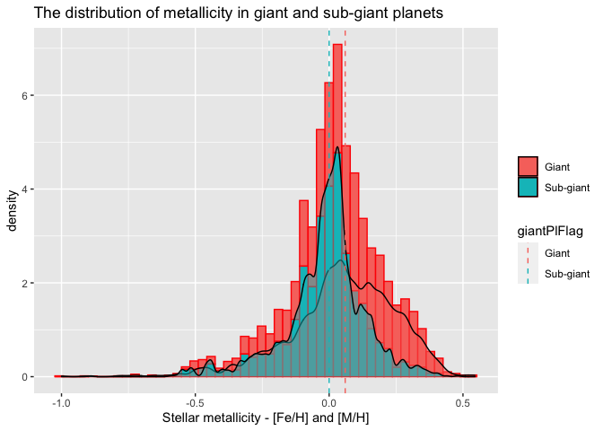

NASA API Vignette
================

-   [Introduction](#introduction)
-   [Package requirements](#package-requirements)
-   [Custom functions](#custom-functions)
    -   [annualExoDiscoveries()](#annualexodiscoveries)
    -   [calculateHZ()](#calculatehz)
    -   [hzFluxCalculator()](#hzfluxcalculator)
    -   [habitableExoFinder()](#habitableexofinder)
-   [Exploratory Data Analysis](#exploratory-data-analysis)
    -   [Annual discoveries](#annual-discoveries)
    -   [Discovery methods](#discovery-methods)
    -   [Metallicity correlations](#metallicity-correlations)
    -   [Mass-radius diagram](#mass-radius-diagram)
    -   [Exoplanet habitability](#exoplanet-habitability)
-   [References](#references)

## Introduction

This vignette has made use of the [NASA Exoplanet
Archive](https://exoplanetarchive.ipac.caltech.edu/docs/intro.html),
which is operated by the California Institute of Technology, under
contract with the National Aeronautics and Space Administration under
the Exoplanet Exploration Program.

## Package requirements

To re-create this project in R, users are required to install:

-   **[tidyverse](https://www.tidyverse.org/)** - encompasses packages
    such as `dplyr` for subsetting data and `ggplot2` for creating
    layered graphics.  
-   **[httr](https://httr.r-lib.org/)** - supplies the `GET()` function
    to programmatically retrieve content from NASA Exoplanet Archive’s
    [TAP
    service](https://exoplanetarchive.ipac.caltech.edu/docs/TAP/usingTAP.html#examples).
-   **[jsonlite](https://cran.r-project.org/web/packages/jsonlite/vignettes/json-aaquickstart.html)** -
    supplies the `fromJSON()` function to simplify JSON content into an
    atomic vector.
-   **[latex2exp](https://cran.r-project.org/web/packages/latex2exp/vignettes/using-latex2exp.html)** -
    “an R package that parses and converts LaTeX math formulas to R’s
    plotmath expressions.” This is useful for labeling masses and radii
    on plots using [solar system
    symbols](https://solarsystem.nasa.gov/resources/680/solar-system-symbols/).
-   **[ggrepel](https://ggrepel.slowkow.com/)** - eliminate overlapping
    text labels in the `ggplot2` exoplanet mass-radius diagram.

## Custom functions

### annualExoDiscoveries()

This custom function programmatically retrieves data from the [NASA
Exoplanet Archive’s TAP
service](https://exoplanetarchive.ipac.caltech.edu/docs/TAP/usingTAP.html#examples).
Users can specify one of two tables - Planetary Systems (*ps*) or
Planetary Systems Composite Parameters (*pscomppars*) - as well as a
range for the year(s) in which planets were discovered. The default
values for this function are:

-   `tableName = "pscomppars"` - according to the [table
    definitions](https://exoplanetarchive.ipac.caltech.edu/docs/API_PS_columns.html)
    for *ps* and *pscomppars*, “PSCompPars is a more filled-in table,
    with only one row per planet, enabling a more statistical view of
    the known exoplanet population and their host environments. This
    table provides a more complete, though not necessarily
    self-consistent, set of parameters.”
-   `startYear = 1989` - the earliest listing in the PSCompPars table,
    attributed to the planet [HD 114762
    b](https://exoplanetarchive.ipac.caltech.edu/overview/HD%20114762%20b#planet_data_HD-114762-b).  
-   `endYear = as.integer(format(Sys.Date(), "%Y"))` - the current
    calendar year as understood by the user’s computer.
-   `controversial = 0` - exclude planets for which the confirmation
    status “has been questioned in the published literature.”
-   `cb_flag = 0` - exclude (0) planets which orbits a binary system. An
    option of `1` lists only planets which orbit two or more stars.
-   `format = json` - return queries in JSON format. You may also
    request data as a comma-separated-value file (CSV).

``` r
# Retrieve names, discovery years, discovery methods and various other
# planetary and stellar parameters.
# The default search begins in 1989 (the earliest date in the pscomppars table)
# and ends in the current calendar year: format(Sys.Date(), "%Y").
annualExoDiscoveries <- function(tableName = "pscomppars", 
                                 startYear = 1989, 
                                 endYear = as.integer(format(Sys.Date(), "%Y")), 
                                 controversialFlag = 0,
                                 cb_flag = 0,
                                 format = "json"){
  # Create URL string
  urlString <- paste0("https://exoplanetarchive.ipac.caltech.edu/TAP/sync?query=select+pl_name,disc_year,discoverymethod,pl_orbper,pl_rade,pl_bmasse,pl_radj,pl_bmassj,pl_eqt,pl_dens,st_spectype,st_teff,st_lum,pl_controv_flag,pl_orbeccen,pl_orbsmax,st_mass,st_metratio,st_met,sy_snum,sy_pnum+from+", 
                      tableName, "+where+disc_year+between+", 
                      startYear, "+and+", endYear, 
                      "+and+pl_controv_flag+=+", controversialFlag, 
                      "+and+cb_flag+=+", cb_flag,
                      "&format=", format)
  # Provide string to httr GET function
  apiCall <- GET(urlString)
  
  if(format == "json"){
    # Convert JSON content to data frame, rename columns
    apiContent <- apiCall$content %>% rawToChar() %>% fromJSON() %>%
      mutate(luminosityRatio = 10^(st_lum)) 
  } else {
    # Specify format as CSV, convert to data frame
    apiContent <- as.data.frame(read_csv(urlString))
  }
  # Return formatted data frame
  return(apiContent)
}
```

### calculateHZ()

This function calculates planetary habitable zones and their associated
stellar flux boundaries for a host star with effective temperature
`tempEff` and a stellar luminosity `luminosityRatio`. The calculations
are based on formulae defined by Kopparapu et al., whereby the effective
solar flux *S*<sub>*e**f**f*</sub> equates to
*S*<sub>*e**f**f*</sub> = *S*<sub>*e**f**f*⊙</sub> + (*a* ⋅ *T*<sub>⋆</sub>) + (*b* ⋅ *T*<sub>⋆</sub><sup>2</sup>) + (*c* ⋅ *T*<sub>⋆</sub><sup>3</sup>) + (*d* ⋅ *T*<sub>⋆</sub><sup>4</sup>)
and the corresponding habitability zone distances, *d*, equate to
*d* = (*L*/*L* ⊙ )/(*S*<sub>*e**f**f*</sub>)<sup>0.5</sup> AU (Kopparapu
et al., 2014).

The required parameters for this function are:

-   `tempEff` - the effective temperature of a host star such that
    <sub>*e**f**f*</sub> − 5780 = *T*<sub>⋆</sub>.
-   `luminosityRatio` - stellar luminosity, *L*/*L*⊙, required to
    calculate habitability zone distances, *d*. These values may be
    calculated with the `annualExoDiscoveries()` function, which finds
    the inverse logarithm of the stellar luminosity in the *PSCompPars*
    table (`st_lum`).

The output of this function is a list with four numeric parameters -
*optimisticInnerDist*, *optimisticOuterDist*, *optimisticInnerFlux*, and
*optimisticOuterFlux* - which may be used in the function
`hzFluxCalculator()`.

``` r
# Calculate habitable stellar flux boundaries for exoplanetary habitable zones. 
# Distances are returned in Astronomical Units (AU).
# Formula for s_eff and its coefficients is provided by Kopparapu et al.
# https://iopscience.iop.org/article/10.1088/2041-8205/787/2/L29
# Re-factored to R from John Armstrong's Python code at
# https://depts.washington.edu/naivpl/sites/default/files/hzcalc.py.txt
calculateHZ <- function(tempEff, luminosityRatio){
  
  # Initiate empty vectors
  s_eff <- vector()
  distanceFromStar <- vector()
  
  starTemp <- vector()
  recentVenus <- vector()
  runawayGreenhouse <- vector()
  maxGreenhouse <- vector()
  earlyMars <- vector()
  fivemeRunaway <- vector()
  tenthmeRunaway <- vector()
  
  # Populate variables with coefficients from research paper by Kopparapu et al. 
  s_eff_sun  = c(1.776, 1.107, 0.356, 0.320, 1.188, 0.99)
  a <- c(2.136e-4, 1.332e-4, 6.171e-5, 5.547e-5, 1.433e-4, 1.209e-4)
  b <- c(2.533e-8, 1.580e-8, 1.698e-9, 1.526e-9, 1.707e-8, 1.404e-8)
  c <- c(-1.332e-11, -8.308e-12, -3.198e-12, -2.874e-12, -8.968e-12, -7.418e-12)
  d <- c(-3.097e-15, -1.931e-15, -5.575e-16, -5.011e-16, -2.084e-15, -1.713e-15)
  
  t_star <- tempEff-5780
  
  
  for (i in 1:length(a)){
    # Calculate effective solar flux (s_eff) using formula
    # from research paper by Kopparapu et al.
    s_eff[i] <- s_eff_sun[i] + 
      a[i]*t_star + b[i]*t_star^2 + c[i]*t_star^3 + d[i]*t_star^4
    
    # Calculate corresponding inner/outer habitability zone distances
    distanceFromStar[i] <- (luminosityRatio/s_eff[i])^0.5
    
    optimisticInnerDist <- distanceFromStar[1]
    optimisticOuterDist <- distanceFromStar[4]
    
    # Calculate effective solar flux incident on the planet
    optimisticInnerFlux <- s_eff[1]
    optimisticOuterFlux <- s_eff[4]
    
    return(list(optimisticInnerDist = optimisticInnerDist, 
                optimisticOuterDist = optimisticOuterDist, 
                optimisticInnerFlux = optimisticInnerFlux, 
                optimisticOuterFlux = optimisticOuterFlux))
  }
}
```

### hzFluxCalculator()

This custom function calculates the minima and the maxima for a planet’s
habitability zone (in units of *AU*) and stellar flux (in units of
*dex*). It requires the name of a data set and operates with the
following default parameters:

-   `earthMassCol = "pl_bmasse"` - a vector with planetary masses in
    units of Earth mass (*M*⊕).
-   `starSpecTypeCol = "st_spectype"` - a vector listing the spectral
    type of host stars.
-   `effectiveTempCol = "st_teff"` - a vector listing the effective
    temperatures of host stars.
-   `luminosityRatioCol = "luminosityRatio"` - a vector with the stellar
    luminosity ratios, *L*/*L*⊙.

These default column names are based on the variables in the [Planetary
Systems Composite Parameters
(PSCompPars)](https://exoplanetarchive.ipac.caltech.edu/docs/API_PS_columns.html)
table. The *spectralClass* column uses the `substr()` function to
distill the complete classification of a star into its main class (O, B,
A, etc.).

Habitability zone distances and incident flux are calculated only for
planets with a mass of 10*M*⊕ or less. This is the hypothetical
threshold for planets with an appreciable composition of “volatiles”
such as water and ammonia (Kuchner, 2003).

``` r
# Custom function to calculate values for 
# inner and outer habitable zone, stellar flux
hzFluxCalculator <- function(data, earthMassCol = "pl_bmasse", 
                             starSpecTypeCol = "st_spectype", 
                             effectiveTempCol = "st_teff",
                             luminosityRatioCol = "luminosityRatio"){
  
  # Add columns for inner, outer habitable zone distances, flux as well as
  # a column for the primary spectral class 
  data %>% mutate(innerHZ = NA, outerHZ = NA, innerFlux = NA, 
                  outerFlux = NA, spectralClass = NA)
  
  # Transform custom column names (char) into vectors which can be used in 
  # loops
  earthMassCol <- data[ , earthMassCol]
  starSpecTypeCol <- data[ , starSpecTypeCol]
  effectiveTempCol <- data[ , effectiveTempCol]
  luminosityRatioCol <- data[ , luminosityRatioCol]
  
  for(i in 1:length(earthMassCol)){
    if(!is.na(starSpecTypeCol[i])){
      # Extract first letter from stellar classification in the NASA Exoplanet Archive
      data$spectralClass[i] <- substr(starSpecTypeCol[i], 1, 1)
    } else {
      # If stellar classification is not provided
      data$spectralClass[i] <- NA
    }
    
    # Exclude planets which are larger than "super-Earths" (10M)
    if(!is.na(earthMassCol[i]) & earthMassCol[i] <= 10 & 
       earthMassCol[i] >= 0.1){
      
      # Create list of habitability zone and flux parameters
      hzVars <- calculateHZ(effectiveTempCol[i], 
                            luminosityRatioCol[i])
      
      # Extract individual parameters from the list
      data$innerHZ[i] <- hzVars[[1]]
      data$outerHZ[i] <- hzVars[[2]]
      
      data$innerFlux[i] <- hzVars[[3]]
      data$outerFlux[i] <- hzVars[[4]]
      
    } else {
      data$innerHZ[i] <- NA
      data$outerHZ[i] <- NA
      data$innerFlux[i] <- NA
      data$outerFlux[i] <- NA
    }
  }
  
  return(data)
}
```

### habitableExoFinder()

This function produces a data frame listing potentially habitable
exoplanets from a set of general habitability criteria, many of which
are inspired by the University of Puerto Rico’s [Planetary Habitability
Laboratory](http://phl.upr.edu/projects/habitable-exoplanets-catalog/methods).

These parameters can be tuned using arguments from published research.
For simplicity, the default values are:

-   `minEarthMass = 0.1` - minimum acceptable planet mass (*M*⊕).
-   `maxEarthMass = 5` - maximum acceptable planet mass (*M*⊕).
-   `minEarthRadius = 0.5` - minimum acceptable radius (*R*⊕).
-   `maxEarthRadius = 1.5` - maximum acceptable radius (*R*⊕).
-   `maxInnerFlux = 1.5` - maximum stellar flux incident on a planet.
-   `maxOuterFlux = 0.20` - minimum stellar flux incident on a planet.
-   `minTemp = 273` - minimum effective temperature of the planet in
    units of Kelvin.
-   `maxTemp = 340` - maximum effective temperature of the planet in
    units of Kelvin.

``` r
# Identify potentially habitable exoplanets. 
# Default function parameters provided by Planetary Habitability Laboratory, 
# http://phl.upr.edu/projects/habitable-exoplanets-catalog
habitableExoFinder <- function(data, minEarthMass = 0.1, maxEarthMass = 5, 
                               minEarthRadius = 0.5, maxEarthRadius = 1.5,
                               maxInnerFlux = 1.5, maxOuterFlux = 0.20,
                               minTemp = 273, maxTemp = 340){
  
  # Subset data using provided parameters
  habitablePlanets <- data %>% select(pl_name, pl_eqt, spectralClass, 
                                      pl_bmasse, pl_rade, pl_orbeccen, 
                                      pl_orbsmax, innerHZ, outerHZ, 
                                      innerFlux, outerFlux) %>% 
    # Consider planets which only orbit stars of type F, G, K, and M
    # Subset data based on supplied planetary conditions
    filter(spectralClass %in% c("F", "G", "K", "M") & 
             (pl_orbsmax >= innerHZ) & (pl_orbsmax <= outerHZ) & 
             (pl_bmasse >= minEarthMass) &
             (pl_bmasse <= maxEarthMass) & 
             (pl_rade >= minEarthRadius) & (pl_rade <= maxEarthRadius) &
             (innerFlux <= maxInnerFlux) & (outerFlux >= maxOuterFlux) &
             (pl_eqt <= maxTemp | (is.na(pl_eqt))) & 
             (pl_eqt >= minTemp | (is.na(pl_eqt))))
  
  return(habitablePlanets)
}
```

## Exploratory Data Analysis

### Annual discoveries

The `annualExoDiscoveries()` function retrieves the latest data from
NASA’s Exoplanet Archive.

``` r
# Retrieve latest exoplanet data
exoplanetData <- annualExoDiscoveries()

# List the variables and their properties
datatable(exoplanetData)
```

<div id="htmlwidget-bea51a8ebab5df58bf39" style="width:100%;height:auto;" class="datatables html-widget"></div>
<script type="application/json" data-for="htmlwidget-bea51a8ebab5df58bf39">{"x":{"filter":"none","vertical":false,"data":[["1","2","3","4","5","6","7","8","9","10","11","12","13","14","15","16","17","18","19","20","21","22","23","24","25","26","27","28","29","30","31","32","33","34","35","36","37","38","39","40","41","42","43","44","45","46","47","48","49","50","51","52","53","54","55","56","57","58","59","60","61","62","63","64","65","66","67","68","69","70","71","72","73","74","75","76","77","78","79","80","81","82","83","84","85","86","87","88","89","90","91","92","93","94","95","96","97","98","99","100","101","102","103","104","105","106","107","108","109","110","111","112","113","114","115","116","117","118","119","120","121","122","123","124","125","126","127","128","129","130","131","132","133","134","135","136","137","138","139","140","141","142","143","144","145","146","147","148","149","150","151","152","153","154","155","156","157","158","159","160","161","162","163","164","165","166","167","168","169","170","171","172","173","174","175","176","177","178","179","180","181","182","183","184","185","186","187","188","189","190","191","192","193","194","195","196","197","198","199","200","201","202","203","204","205","206","207","208","209","210","211","212","213","214","215","216","217","218","219","220","221","222","223","224","225","226","227","228","229","230","231","232","233","234","235","236","237","238","239","240","241","242","243","244","245","246","247","248","249","250","251","252","253","254","255","256","257","258","259","260","261","262","263","264","265","266","267","268","269","270","271","272","273","274","275","276","277","278","279","280","281","282","283","284","285","286","287","288","289","290","291","292","293","294","295","296","297","298","299","300","301","302","303","304","305","306","307","308","309","310","311","312","313","314","315","316","317","318","319","320","321","322","323","324","325","326","327","328","329","330","331","332","333","334","335","336","337","338","339","340","341","342","343","344","345","346","347","348","349","350","351","352","353","354","355","356","357","358","359","360","361","362","363","364","365","366","367","368","369","370","371","372","373","374","375","376","377","378","379","380","381","382","383","384","385","386","387","388","389","390","391","392","393","394","395","396","397","398","399","400","401","402","403","404","405","406","407","408","409","410","411","412","413","414","415","416","417","418","419","420","421","422","423","424","425","426","427","428","429","430","431","432","433","434","435","436","437","438","439","440","441","442","443","444","445","446","447","448","449","450","451","452","453","454","455","456","457","458","459","460","461","462","463","464","465","466","467","468","469","470","471","472","473","474","475","476","477","478","479","480","481","482","483","484","485","486","487","488","489","490","491","492","493","494","495","496","497","498","499","500","501","502","503","504","505","506","507","508","509","510","511","512","513","514","515","516","517","518","519","520","521","522","523","524","525","526","527","528","529","530","531","532","533","534","535","536","537","538","539","540","541","542","543","544","545","546","547","548","549","550","551","552","553","554","555","556","557","558","559","560","561","562","563","564","565","566","567","568","569","570","571","572","573","574","575","576","577","578","579","580","581","582","583","584","585","586","587","588","589","590","591","592","593","594","595","596","597","598","599","600","601","602","603","604","605","606","607","608","609","610","611","612","613","614","615","616","617","618","619","620","621","622","623","624","625","626","627","628","629","630","631","632","633","634","635","636","637","638","639","640","641","642","643","644","645","646","647","648","649","650","651","652","653","654","655","656","657","658","659","660","661","662","663","664","665","666","667","668","669","670","671","672","673","674","675","676","677","678","679","680","681","682","683","684","685","686","687","688","689","690","691","692","693","694","695","696","697","698","699","700","701","702","703","704","705","706","707","708","709","710","711","712","713","714","715","716","717","718","719","720","721","722","723","724","725","726","727","728","729","730","731","732","733","734","735","736","737","738","739","740","741","742","743","744","745","746","747","748","749","750","751","752","753","754","755","756","757","758","759","760","761","762","763","764","765","766","767","768","769","770","771","772","773","774","775","776","777","778","779","780","781","782","783","784","785","786","787","788","789","790","791","792","793","794","795","796","797","798","799","800","801","802","803","804","805","806","807","808","809","810","811","812","813","814","815","816","817","818","819","820","821","822","823","824","825","826","827","828","829","830","831","832","833","834","835","836","837","838","839","840","841","842","843","844","845","846","847","848","849","850","851","852","853","854","855","856","857","858","859","860","861","862","863","864","865","866","867","868","869","870","871","872","873","874","875","876","877","878","879","880","881","882","883","884","885","886","887","888","889","890","891","892","893","894","895","896","897","898","899","900","901","902","903","904","905","906","907","908","909","910","911","912","913","914","915","916","917","918","919","920","921","922","923","924","925","926","927","928","929","930","931","932","933","934","935","936","937","938","939","940","941","942","943","944","945","946","947","948","949","950","951","952","953","954","955","956","957","958","959","960","961","962","963","964","965","966","967","968","969","970","971","972","973","974","975","976","977","978","979","980","981","982","983","984","985","986","987","988","989","990","991","992","993","994","995","996","997","998","999","1000","1001","1002","1003","1004","1005","1006","1007","1008","1009","1010","1011","1012","1013","1014","1015","1016","1017","1018","1019","1020","1021","1022","1023","1024","1025","1026","1027","1028","1029","1030","1031","1032","1033","1034","1035","1036","1037","1038","1039","1040","1041","1042","1043","1044","1045","1046","1047","1048","1049","1050","1051","1052","1053","1054","1055","1056","1057","1058","1059","1060","1061","1062","1063","1064","1065","1066","1067","1068","1069","1070","1071","1072","1073","1074","1075","1076","1077","1078","1079","1080","1081","1082","1083","1084","1085","1086","1087","1088","1089","1090","1091","1092","1093","1094","1095","1096","1097","1098","1099","1100","1101","1102","1103","1104","1105","1106","1107","1108","1109","1110","1111","1112","1113","1114","1115","1116","1117","1118","1119","1120","1121","1122","1123","1124","1125","1126","1127","1128","1129","1130","1131","1132","1133","1134","1135","1136","1137","1138","1139","1140","1141","1142","1143","1144","1145","1146","1147","1148","1149","1150","1151","1152","1153","1154","1155","1156","1157","1158","1159","1160","1161","1162","1163","1164","1165","1166","1167","1168","1169","1170","1171","1172","1173","1174","1175","1176","1177","1178","1179","1180","1181","1182","1183","1184","1185","1186","1187","1188","1189","1190","1191","1192","1193","1194","1195","1196","1197","1198","1199","1200","1201","1202","1203","1204","1205","1206","1207","1208","1209","1210","1211","1212","1213","1214","1215","1216","1217","1218","1219","1220","1221","1222","1223","1224","1225","1226","1227","1228","1229","1230","1231","1232","1233","1234","1235","1236","1237","1238","1239","1240","1241","1242","1243","1244","1245","1246","1247","1248","1249","1250","1251","1252","1253","1254","1255","1256","1257","1258","1259","1260","1261","1262","1263","1264","1265","1266","1267","1268","1269","1270","1271","1272","1273","1274","1275","1276","1277","1278","1279","1280","1281","1282","1283","1284","1285","1286","1287","1288","1289","1290","1291","1292","1293","1294","1295","1296","1297","1298","1299","1300","1301","1302","1303","1304","1305","1306","1307","1308","1309","1310","1311","1312","1313","1314","1315","1316","1317","1318","1319","1320","1321","1322","1323","1324","1325","1326","1327","1328","1329","1330","1331","1332","1333","1334","1335","1336","1337","1338","1339","1340","1341","1342","1343","1344","1345","1346","1347","1348","1349","1350","1351","1352","1353","1354","1355","1356","1357","1358","1359","1360","1361","1362","1363","1364","1365","1366","1367","1368","1369","1370","1371","1372","1373","1374","1375","1376","1377","1378","1379","1380","1381","1382","1383","1384","1385","1386","1387","1388","1389","1390","1391","1392","1393","1394","1395","1396","1397","1398","1399","1400","1401","1402","1403","1404","1405","1406","1407","1408","1409","1410","1411","1412","1413","1414","1415","1416","1417","1418","1419","1420","1421","1422","1423","1424","1425","1426","1427","1428","1429","1430","1431","1432","1433","1434","1435","1436","1437","1438","1439","1440","1441","1442","1443","1444","1445","1446","1447","1448","1449","1450","1451","1452","1453","1454","1455","1456","1457","1458","1459","1460","1461","1462","1463","1464","1465","1466","1467","1468","1469","1470","1471","1472","1473","1474","1475","1476","1477","1478","1479","1480","1481","1482","1483","1484","1485","1486","1487","1488","1489","1490","1491","1492","1493","1494","1495","1496","1497","1498","1499","1500","1501","1502","1503","1504","1505","1506","1507","1508","1509","1510","1511","1512","1513","1514","1515","1516","1517","1518","1519","1520","1521","1522","1523","1524","1525","1526","1527","1528","1529","1530","1531","1532","1533","1534","1535","1536","1537","1538","1539","1540","1541","1542","1543","1544","1545","1546","1547","1548","1549","1550","1551","1552","1553","1554","1555","1556","1557","1558","1559","1560","1561","1562","1563","1564","1565","1566","1567","1568","1569","1570","1571","1572","1573","1574","1575","1576","1577","1578","1579","1580","1581","1582","1583","1584","1585","1586","1587","1588","1589","1590","1591","1592","1593","1594","1595","1596","1597","1598","1599","1600","1601","1602","1603","1604","1605","1606","1607","1608","1609","1610","1611","1612","1613","1614","1615","1616","1617","1618","1619","1620","1621","1622","1623","1624","1625","1626","1627","1628","1629","1630","1631","1632","1633","1634","1635","1636","1637","1638","1639","1640","1641","1642","1643","1644","1645","1646","1647","1648","1649","1650","1651","1652","1653","1654","1655","1656","1657","1658","1659","1660","1661","1662","1663","1664","1665","1666","1667","1668","1669","1670","1671","1672","1673","1674","1675","1676","1677","1678","1679","1680","1681","1682","1683","1684","1685","1686","1687","1688","1689","1690","1691","1692","1693","1694","1695","1696","1697","1698","1699","1700","1701","1702","1703","1704","1705","1706","1707","1708","1709","1710","1711","1712","1713","1714","1715","1716","1717","1718","1719","1720","1721","1722","1723","1724","1725","1726","1727","1728","1729","1730","1731","1732","1733","1734","1735","1736","1737","1738","1739","1740","1741","1742","1743","1744","1745","1746","1747","1748","1749","1750","1751","1752","1753","1754","1755","1756","1757","1758","1759","1760","1761","1762","1763","1764","1765","1766","1767","1768","1769","1770","1771","1772","1773","1774","1775","1776","1777","1778","1779","1780","1781","1782","1783","1784","1785","1786","1787","1788","1789","1790","1791","1792","1793","1794","1795","1796","1797","1798","1799","1800","1801","1802","1803","1804","1805","1806","1807","1808","1809","1810","1811","1812","1813","1814","1815","1816","1817","1818","1819","1820","1821","1822","1823","1824","1825","1826","1827","1828","1829","1830","1831","1832","1833","1834","1835","1836","1837","1838","1839","1840","1841","1842","1843","1844","1845","1846","1847","1848","1849","1850","1851","1852","1853","1854","1855","1856","1857","1858","1859","1860","1861","1862","1863","1864","1865","1866","1867","1868","1869","1870","1871","1872","1873","1874","1875","1876","1877","1878","1879","1880","1881","1882","1883","1884","1885","1886","1887","1888","1889","1890","1891","1892","1893","1894","1895","1896","1897","1898","1899","1900","1901","1902","1903","1904","1905","1906","1907","1908","1909","1910","1911","1912","1913","1914","1915","1916","1917","1918","1919","1920","1921","1922","1923","1924","1925","1926","1927","1928","1929","1930","1931","1932","1933","1934","1935","1936","1937","1938","1939","1940","1941","1942","1943","1944","1945","1946","1947","1948","1949","1950","1951","1952","1953","1954","1955","1956","1957","1958","1959","1960","1961","1962","1963","1964","1965","1966","1967","1968","1969","1970","1971","1972","1973","1974","1975","1976","1977","1978","1979","1980","1981","1982","1983","1984","1985","1986","1987","1988","1989","1990","1991","1992","1993","1994","1995","1996","1997","1998","1999","2000","2001","2002","2003","2004","2005","2006","2007","2008","2009","2010","2011","2012","2013","2014","2015","2016","2017","2018","2019","2020","2021","2022","2023","2024","2025","2026","2027","2028","2029","2030","2031","2032","2033","2034","2035","2036","2037","2038","2039","2040","2041","2042","2043","2044","2045","2046","2047","2048","2049","2050","2051","2052","2053","2054","2055","2056","2057","2058","2059","2060","2061","2062","2063","2064","2065","2066","2067","2068","2069","2070","2071","2072","2073","2074","2075","2076","2077","2078","2079","2080","2081","2082","2083","2084","2085","2086","2087","2088","2089","2090","2091","2092","2093","2094","2095","2096","2097","2098","2099","2100","2101","2102","2103","2104","2105","2106","2107","2108","2109","2110","2111","2112","2113","2114","2115","2116","2117","2118","2119","2120","2121","2122","2123","2124","2125","2126","2127","2128","2129","2130","2131","2132","2133","2134","2135","2136","2137","2138","2139","2140","2141","2142","2143","2144","2145","2146","2147","2148","2149","2150","2151","2152","2153","2154","2155","2156","2157","2158","2159","2160","2161","2162","2163","2164","2165","2166","2167","2168","2169","2170","2171","2172","2173","2174","2175","2176","2177","2178","2179","2180","2181","2182","2183","2184","2185","2186","2187","2188","2189","2190","2191","2192","2193","2194","2195","2196","2197","2198","2199","2200","2201","2202","2203","2204","2205","2206","2207","2208","2209","2210","2211","2212","2213","2214","2215","2216","2217","2218","2219","2220","2221","2222","2223","2224","2225","2226","2227","2228","2229","2230","2231","2232","2233","2234","2235","2236","2237","2238","2239","2240","2241","2242","2243","2244","2245","2246","2247","2248","2249","2250","2251","2252","2253","2254","2255","2256","2257","2258","2259","2260","2261","2262","2263","2264","2265","2266","2267","2268","2269","2270","2271","2272","2273","2274","2275","2276","2277","2278","2279","2280","2281","2282","2283","2284","2285","2286","2287","2288","2289","2290","2291","2292","2293","2294","2295","2296","2297","2298","2299","2300","2301","2302","2303","2304","2305","2306","2307","2308","2309","2310","2311","2312","2313","2314","2315","2316","2317","2318","2319","2320","2321","2322","2323","2324","2325","2326","2327","2328","2329","2330","2331","2332","2333","2334","2335","2336","2337","2338","2339","2340","2341","2342","2343","2344","2345","2346","2347","2348","2349","2350","2351","2352","2353","2354","2355","2356","2357","2358","2359","2360","2361","2362","2363","2364","2365","2366","2367","2368","2369","2370","2371","2372","2373","2374","2375","2376","2377","2378","2379","2380","2381","2382","2383","2384","2385","2386","2387","2388","2389","2390","2391","2392","2393","2394","2395","2396","2397","2398","2399","2400","2401","2402","2403","2404","2405","2406","2407","2408","2409","2410","2411","2412","2413","2414","2415","2416","2417","2418","2419","2420","2421","2422","2423","2424","2425","2426","2427","2428","2429","2430","2431","2432","2433","2434","2435","2436","2437","2438","2439","2440","2441","2442","2443","2444","2445","2446","2447","2448","2449","2450","2451","2452","2453","2454","2455","2456","2457","2458","2459","2460","2461","2462","2463","2464","2465","2466","2467","2468","2469","2470","2471","2472","2473","2474","2475","2476","2477","2478","2479","2480","2481","2482","2483","2484","2485","2486","2487","2488","2489","2490","2491","2492","2493","2494","2495","2496","2497","2498","2499","2500","2501","2502","2503","2504","2505","2506","2507","2508","2509","2510","2511","2512","2513","2514","2515","2516","2517","2518","2519","2520","2521","2522","2523","2524","2525","2526","2527","2528","2529","2530","2531","2532","2533","2534","2535","2536","2537","2538","2539","2540","2541","2542","2543","2544","2545","2546","2547","2548","2549","2550","2551","2552","2553","2554","2555","2556","2557","2558","2559","2560","2561","2562","2563","2564","2565","2566","2567","2568","2569","2570","2571","2572","2573","2574","2575","2576","2577","2578","2579","2580","2581","2582","2583","2584","2585","2586","2587","2588","2589","2590","2591","2592","2593","2594","2595","2596","2597","2598","2599","2600","2601","2602","2603","2604","2605","2606","2607","2608","2609","2610","2611","2612","2613","2614","2615","2616","2617","2618","2619","2620","2621","2622","2623","2624","2625","2626","2627","2628","2629","2630","2631","2632","2633","2634","2635","2636","2637","2638","2639","2640","2641","2642","2643","2644","2645","2646","2647","2648","2649","2650","2651","2652","2653","2654","2655","2656","2657","2658","2659","2660","2661","2662","2663","2664","2665","2666","2667","2668","2669","2670","2671","2672","2673","2674","2675","2676","2677","2678","2679","2680","2681","2682","2683","2684","2685","2686","2687","2688","2689","2690","2691","2692","2693","2694","2695","2696","2697","2698","2699","2700","2701","2702","2703","2704","2705","2706","2707","2708","2709","2710","2711","2712","2713","2714","2715","2716","2717","2718","2719","2720","2721","2722","2723","2724","2725","2726","2727","2728","2729","2730","2731","2732","2733","2734","2735","2736","2737","2738","2739","2740","2741","2742","2743","2744","2745","2746","2747","2748","2749","2750","2751","2752","2753","2754","2755","2756","2757","2758","2759","2760","2761","2762","2763","2764","2765","2766","2767","2768","2769","2770","2771","2772","2773","2774","2775","2776","2777","2778","2779","2780","2781","2782","2783","2784","2785","2786","2787","2788","2789","2790","2791","2792","2793","2794","2795","2796","2797","2798","2799","2800","2801","2802","2803","2804","2805","2806","2807","2808","2809","2810","2811","2812","2813","2814","2815","2816","2817","2818","2819","2820","2821","2822","2823","2824","2825","2826","2827","2828","2829","2830","2831","2832","2833","2834","2835","2836","2837","2838","2839","2840","2841","2842","2843","2844","2845","2846","2847","2848","2849","2850","2851","2852","2853","2854","2855","2856","2857","2858","2859","2860","2861","2862","2863","2864","2865","2866","2867","2868","2869","2870","2871","2872","2873","2874","2875","2876","2877","2878","2879","2880","2881","2882","2883","2884","2885","2886","2887","2888","2889","2890","2891","2892","2893","2894","2895","2896","2897","2898","2899","2900","2901","2902","2903","2904","2905","2906","2907","2908","2909","2910","2911","2912","2913","2914","2915","2916","2917","2918","2919","2920","2921","2922","2923","2924","2925","2926","2927","2928","2929","2930","2931","2932","2933","2934","2935","2936","2937","2938","2939","2940","2941","2942","2943","2944","2945","2946","2947","2948","2949","2950","2951","2952","2953","2954","2955","2956","2957","2958","2959","2960","2961","2962","2963","2964","2965","2966","2967","2968","2969","2970","2971","2972","2973","2974","2975","2976","2977","2978","2979","2980","2981","2982","2983","2984","2985","2986","2987","2988","2989","2990","2991","2992","2993","2994","2995","2996","2997","2998","2999","3000","3001","3002","3003","3004","3005","3006","3007","3008","3009","3010","3011","3012","3013","3014","3015","3016","3017","3018","3019","3020","3021","3022","3023","3024","3025","3026","3027","3028","3029","3030","3031","3032","3033","3034","3035","3036","3037","3038","3039","3040","3041","3042","3043","3044","3045","3046","3047","3048","3049","3050","3051","3052","3053","3054","3055","3056","3057","3058","3059","3060","3061","3062","3063","3064","3065","3066","3067","3068","3069","3070","3071","3072","3073","3074","3075","3076","3077","3078","3079","3080","3081","3082","3083","3084","3085","3086","3087","3088","3089","3090","3091","3092","3093","3094","3095","3096","3097","3098","3099","3100","3101","3102","3103","3104","3105","3106","3107","3108","3109","3110","3111","3112","3113","3114","3115","3116","3117","3118","3119","3120","3121","3122","3123","3124","3125","3126","3127","3128","3129","3130","3131","3132","3133","3134","3135","3136","3137","3138","3139","3140","3141","3142","3143","3144","3145","3146","3147","3148","3149","3150","3151","3152","3153","3154","3155","3156","3157","3158","3159","3160","3161","3162","3163","3164","3165","3166","3167","3168","3169","3170","3171","3172","3173","3174","3175","3176","3177","3178","3179","3180","3181","3182","3183","3184","3185","3186","3187","3188","3189","3190","3191","3192","3193","3194","3195","3196","3197","3198","3199","3200","3201","3202","3203","3204","3205","3206","3207","3208","3209","3210","3211","3212","3213","3214","3215","3216","3217","3218","3219","3220","3221","3222","3223","3224","3225","3226","3227","3228","3229","3230","3231","3232","3233","3234","3235","3236","3237","3238","3239","3240","3241","3242","3243","3244","3245","3246","3247","3248","3249","3250","3251","3252","3253","3254","3255","3256","3257","3258","3259","3260","3261","3262","3263","3264","3265","3266","3267","3268","3269","3270","3271","3272","3273","3274","3275","3276","3277","3278","3279","3280","3281","3282","3283","3284","3285","3286","3287","3288","3289","3290","3291","3292","3293","3294","3295","3296","3297","3298","3299","3300","3301","3302","3303","3304","3305","3306","3307","3308","3309","3310","3311","3312","3313","3314","3315","3316","3317","3318","3319","3320","3321","3322","3323","3324","3325","3326","3327","3328","3329","3330","3331","3332","3333","3334","3335","3336","3337","3338","3339","3340","3341","3342","3343","3344","3345","3346","3347","3348","3349","3350","3351","3352","3353","3354","3355","3356","3357","3358","3359","3360","3361","3362","3363","3364","3365","3366","3367","3368","3369","3370","3371","3372","3373","3374","3375","3376","3377","3378","3379","3380","3381","3382","3383","3384","3385","3386","3387","3388","3389","3390","3391","3392","3393","3394","3395","3396","3397","3398","3399","3400","3401","3402","3403","3404","3405","3406","3407","3408","3409","3410","3411","3412","3413","3414","3415","3416","3417","3418","3419","3420","3421","3422","3423","3424","3425","3426","3427","3428","3429","3430","3431","3432","3433","3434","3435","3436","3437","3438","3439","3440","3441","3442","3443","3444","3445","3446","3447","3448","3449","3450","3451","3452","3453","3454","3455","3456","3457","3458","3459","3460","3461","3462","3463","3464","3465","3466","3467","3468","3469","3470","3471","3472","3473","3474","3475","3476","3477","3478","3479","3480","3481","3482","3483","3484","3485","3486","3487","3488","3489","3490","3491","3492","3493","3494","3495","3496","3497","3498","3499","3500","3501","3502","3503","3504","3505","3506","3507","3508","3509","3510","3511","3512","3513","3514","3515","3516","3517","3518","3519","3520","3521","3522","3523","3524","3525","3526","3527","3528","3529","3530","3531","3532","3533","3534","3535","3536","3537","3538","3539","3540","3541","3542","3543","3544","3545","3546","3547","3548","3549","3550","3551","3552","3553","3554","3555","3556","3557","3558","3559","3560","3561","3562","3563","3564","3565","3566","3567","3568","3569","3570","3571","3572","3573","3574","3575","3576","3577","3578","3579","3580","3581","3582","3583","3584","3585","3586","3587","3588","3589","3590","3591","3592","3593","3594","3595","3596","3597","3598","3599","3600","3601","3602","3603","3604","3605","3606","3607","3608","3609","3610","3611","3612","3613","3614","3615","3616","3617","3618","3619","3620","3621","3622","3623","3624","3625","3626","3627","3628","3629","3630","3631","3632","3633","3634","3635","3636","3637","3638","3639","3640","3641","3642","3643","3644","3645","3646","3647","3648","3649","3650","3651","3652","3653","3654","3655","3656","3657","3658","3659","3660","3661","3662","3663","3664","3665","3666","3667","3668","3669","3670","3671","3672","3673","3674","3675","3676","3677","3678","3679","3680","3681","3682","3683","3684","3685","3686","3687","3688","3689","3690","3691","3692","3693","3694","3695","3696","3697","3698","3699","3700","3701","3702","3703","3704","3705","3706","3707","3708","3709","3710","3711","3712","3713","3714","3715","3716","3717","3718","3719","3720","3721","3722","3723","3724","3725","3726","3727","3728","3729","3730","3731","3732","3733","3734","3735","3736","3737","3738","3739","3740","3741","3742","3743","3744","3745","3746","3747","3748","3749","3750","3751","3752","3753","3754","3755","3756","3757","3758","3759","3760","3761","3762","3763","3764","3765","3766","3767","3768","3769","3770","3771","3772","3773","3774","3775","3776","3777","3778","3779","3780","3781","3782","3783","3784","3785","3786","3787","3788","3789","3790","3791","3792","3793","3794","3795","3796","3797","3798","3799","3800","3801","3802","3803","3804","3805","3806","3807","3808","3809","3810","3811","3812","3813","3814","3815","3816","3817","3818","3819","3820","3821","3822","3823","3824","3825","3826","3827","3828","3829","3830","3831","3832","3833","3834","3835","3836","3837","3838","3839","3840","3841","3842","3843","3844","3845","3846","3847","3848","3849","3850","3851","3852","3853","3854","3855","3856","3857","3858","3859","3860","3861","3862","3863","3864","3865","3866","3867","3868","3869","3870","3871","3872","3873","3874","3875","3876","3877","3878","3879","3880","3881","3882","3883","3884","3885","3886","3887","3888","3889","3890","3891","3892","3893","3894","3895","3896","3897","3898","3899","3900","3901","3902","3903","3904","3905","3906","3907","3908","3909","3910","3911","3912","3913","3914","3915","3916","3917","3918","3919","3920","3921","3922","3923","3924","3925","3926","3927","3928","3929","3930","3931","3932","3933","3934","3935","3936","3937","3938","3939","3940","3941","3942","3943","3944","3945","3946","3947","3948","3949","3950","3951","3952","3953","3954","3955","3956","3957","3958","3959","3960","3961","3962","3963","3964","3965","3966","3967","3968","3969","3970","3971","3972","3973","3974","3975","3976","3977","3978","3979","3980","3981","3982","3983","3984","3985","3986","3987","3988","3989","3990","3991","3992","3993","3994","3995","3996","3997","3998","3999","4000","4001","4002","4003","4004","4005","4006","4007","4008","4009","4010","4011","4012","4013","4014","4015","4016","4017","4018","4019","4020","4021","4022","4023","4024","4025","4026","4027","4028","4029","4030","4031","4032","4033","4034","4035","4036","4037","4038","4039","4040","4041","4042","4043","4044","4045","4046","4047","4048","4049","4050","4051","4052","4053","4054","4055","4056","4057","4058","4059","4060","4061","4062","4063","4064","4065","4066","4067","4068","4069","4070","4071","4072","4073","4074","4075","4076","4077","4078","4079","4080","4081","4082","4083","4084","4085","4086","4087","4088","4089","4090","4091","4092","4093","4094","4095","4096","4097","4098","4099","4100","4101","4102","4103","4104","4105","4106","4107","4108","4109","4110","4111","4112","4113","4114","4115","4116","4117","4118","4119","4120","4121","4122","4123","4124","4125","4126","4127","4128","4129","4130","4131","4132","4133","4134","4135","4136","4137","4138","4139","4140","4141","4142","4143","4144","4145","4146","4147","4148","4149","4150","4151","4152","4153","4154","4155","4156","4157","4158","4159","4160","4161","4162","4163","4164","4165","4166","4167","4168","4169","4170","4171","4172","4173","4174","4175","4176","4177","4178","4179","4180","4181","4182","4183","4184","4185","4186","4187","4188","4189","4190","4191","4192","4193","4194","4195","4196","4197","4198","4199","4200","4201","4202","4203","4204","4205","4206","4207","4208","4209","4210","4211","4212","4213","4214","4215","4216","4217","4218","4219","4220","4221","4222","4223","4224","4225","4226","4227","4228","4229","4230","4231","4232","4233","4234","4235","4236","4237","4238","4239","4240","4241","4242","4243","4244","4245","4246","4247","4248","4249","4250","4251","4252","4253","4254","4255","4256","4257","4258","4259","4260","4261","4262","4263","4264","4265","4266","4267","4268","4269","4270","4271","4272","4273","4274","4275","4276","4277","4278","4279","4280","4281","4282","4283","4284","4285","4286","4287","4288","4289","4290","4291","4292","4293","4294","4295","4296","4297","4298","4299","4300","4301","4302","4303","4304","4305","4306","4307","4308","4309","4310","4311","4312","4313","4314","4315","4316","4317","4318","4319","4320","4321","4322","4323","4324","4325","4326","4327","4328","4329","4330","4331","4332","4333","4334","4335","4336","4337","4338","4339","4340","4341","4342","4343","4344","4345","4346","4347","4348","4349","4350","4351","4352","4353","4354","4355","4356","4357","4358","4359","4360","4361","4362","4363","4364","4365","4366","4367","4368","4369","4370","4371","4372","4373","4374","4375","4376","4377","4378","4379","4380","4381","4382","4383","4384","4385","4386","4387","4388","4389","4390","4391","4392","4393","4394","4395","4396","4397","4398","4399","4400","4401","4402","4403","4404","4405","4406","4407","4408","4409","4410","4411","4412","4413","4414","4415","4416","4417","4418","4419","4420","4421","4422","4423","4424","4425","4426","4427","4428","4429","4430","4431","4432","4433","4434","4435","4436","4437","4438","4439","4440","4441","4442","4443","4444","4445","4446","4447","4448","4449","4450","4451","4452","4453","4454","4455","4456","4457","4458","4459","4460","4461","4462"],["OGLE-2016-BLG-1227L b","GJ 480 b","Kepler-276 c","Kepler-829 b","K2-283 b","Kepler-477 b","HAT-P-15 b","HD 149143 b","HD 210702 b","HIP 12961 b","XO-5 b","HD 5608 b","HD 95872 b","OGLE-2015-BLG-0966L b","WASP-123 b","tau Cet e","K2-254 c","HD 26965 b","EPIC 220554210 c","Kepler-1390 b","Kepler-393 c","Kepler-263 c","Kepler-1431 b","Kepler-237 c","Kepler-1510 b","Kepler-169 e","Kepler-145 c","Kepler-219 c","Kepler-910 b","Kepler-1037 b","Kepler-992 b","Kepler-113 b","Kepler-1097 b","Kepler-382 b","Kepler-1310 b","WD 1856+534 b","42 Dra b","61 Vir c","70 Vir b","Kepler-255 c","K2-60 b","Kepler-52 c","Kepler-248 b","24 Sex b","24 Sex c","rho CrB c","HAT-P-43 b","DENIS-P J082303.1-491201 b","HIP 63242 b","GJ 504 b","2MASS J01225093-2439505 b","WD 0806-661 b","HATS-28 b","HATS-27 b","HATS-15 b","GJ 3341 b","GJ 3512 b","GJ 581 b","55 Cnc f","G 264-012 b","EPIC 201833600 c","EPIC 205950854 c","EPIC 249893012 b","EPIC 249893012 c","GJ 3293 d","GJ 3473 c","GJ 3998 c","BD-08 2823 b","BD-10 3166 b","OGLE-2018-BLG-0567L b","OGLE-2018-BLG-0962L b","TOI-1201 b","GJ 720 A b","BD-13 2130 b","HD 215152 d","AB Pic b","GJ 9827 d","HAT-P-12 b","EPIC 246851721 b","CFBDSIR J145829+101343 b","CoRoT-14 b","EPIC 206024342 b","EPIC 206215704 b","EPIC 212297394 b","EPIC 212499991 b","EPIC 212737443 c","GJ 180 c","GJ 229 b","GJ 3138 d","GJ 3470 b","HD 134060 c","HD 136352 b","GJ 433 b","GJ 433 d","GJ 436 b","GJ 9827 c","HAT-P-13 c","HAT-P-14 b","HAT-P-37 b","CoRoT-30 b","HAT-P-40 b","HAT-P-51 b","HATS-12 b","HATS-49 b","HATS-54 b","HD 10180 d","HD 102272 b","HD 42618 b","HD 110014 b","HD 131496 b","BD-17 63 b","CoRoT-13 b","EPIC 201754305 d","EPIC 201841433 b","HD 7449 b","HD 37605 b","HD 40307 d","HD 75289 b","HD 73526 c","HD 46375 b","HD 7924 c","G 264-012 c","HD 23127 b","HD 233832 b","HD 238090 b","HD 160691 b","HD 30856 b","HD 212301 b","HD 213240 b","HD 213885 b","HD 215497 b","HD 216437 b","HAT-P-32 b","HAT-P-35 b","HD 219666 b","DMPP-3 A b","HATS-45 b","HATS-48 A b","HD 106252 b","HD 110113 b","HD 27894 c","HD 28254 b","HD 13808 b","HD 4208 b","HD 68988 b","GPX-1 b","HD 69830 b","HD 180053 b","HD 18015 b","HD 181234 b","Kepler-6 b","Kepler-491 b","HD 181342 b","HD 181433 b","HD 183263 b","HD 187123 c","HD 72892 b","HD 202772 A b","HD 203030 b","HD 205739 b","HD 20794 c","HD 20868 b","HD 211810 b","Kepler-32 c","Kepler-165 c","Kepler-197 d","HD 45364 c","HD 4732 c","HD 21411 b","HD 73526 b","HD 73534 b","HD 81040 b","HD 64114 b","HD 220842 b","HD 221416 b","HD 221585 b","HD 23596 b","HD 238914 b","HD 76920 b","HD 20781 b","HD 67087 c","HD 65216 c","HD 290327 b","HD 30562 b","HD 4313 b","HD 330075 b","HD 31253 b","HD 31527 b","GJ 1132 c","HD 45364 b","K2-219 b","HD 40307 b","G 9-40 b","HD 12661 b","HD 4203 b","HD 106515 A b","HD 220689 b","Kepler-773 b","HD 49674 b","16 Cyg B b","30 Ari B b","HD 62509 b","HD 208527 b","BD-06 1339 b","47 UMa c","HD 191939 d","HD 7199 b","HD 75898 b","HD 79498 b","WASP-42 b","Kepler-751 b","CoRoT-2 b","eps Eri b","HD 171238 b","HD 173416 b","Kepler-782 b","HD 77338 b","GJ 3021 b","GJ 3634 b","GJ 674 b","HD 37605 c","GJ 876 e","GQ Lup b","GSC 06214-00210 b","HD 190360 c","HD 190647 b","BD+15 2940 b","HD 95086 b","Kepler-123 b","HAT-P-19 b","HD 200964 c","HATS-36 b","HAT-P-22 b","HD 206610 b","HD 20794 b","OGLE2-TR-L9 b","OGLE-TR-113 b","Kepler-166 c","K2-295 b","HAT-P-33 b","HD 100655 b","HD 210277 b","HD 21693 b","HD 10180 f","HD 10180 g","WASP-16 b","K2-263 b","HD 176986 c","HATS-25 b","HD 147379 b","GJ 411 b","HD 14067 b","GJ 3998 b","K2-294 b","HD 92987 b","GJ 3293 c","HR 2562 b","K2-154 b","K2-155 d","TOI-216.01","HD 145934 b","WASP-92 b","WASP-93 b","HD 111998 b","OGLE-2017-BLG-0173L b","HATS-40 b","HD 1605 c","Kepler-265 c","Kepler-56 d","HD 9174 b","24 Boo b","Kepler-756 b","HATS-9 b","HD 165155 b","OGLE-2017-BLG-1140L b","K2-239 b","EPIC 201497682 b","EPIC 206032309 b","HATS-8 b","OGLE-2014-BLG-0676L b","HD 180617 b","CI Tau b","K2-19 c","HD 30177 c","EPIC 220674823 b","WASP-53 b","K2-252 b","HATS-55 b","HATS-57 b","bet Pic c","HAT-P-56 b","TRAPPIST-1 h","GJ 3138 b","HD 148164 b","PDS 70 c","Kepler-65 e","K2-22 b","HD 24064 b","K2-266 c","KMT-2017-BLG-0165L b","Kepler-849 b","WASP-135 b","HIP 67537 b","MOA-2016-BLG-319L b","MOA-2011-BLG-291L b","HD 33142 c","HIP 91258 b","BD+15 2375 b","K2-117 c","K2-125 b","CoRoT-21 b","HD 14787 b","NGC 2682 YBP 1514 b","GJ 1148 c","HATS-61 b","CoRoT-26 b","K2-29 b","OGLE-2012-BLG-0724L b","NGTS-1 b","K2-136 d","HD 92788 b","HAT-P-45 b","bet Cnc b","mu Leo b","HD 214823 b","HD 111591 b","Kepler-80 g","Kepler-419 c","HD 150706 b","HD 112640 b","Kepler-121 c","Kepler-130 b","Kepler-1048 b","Kepler-102 d","Kepler-821 b","Kepler-820 b","Kepler-162 b","Kepler-183 b","2MASS J02192210-3925225 b","Kepler-1009 b","TOI-1130 b","Kepler-819 b","Kepler-811 b","Kepler-286 b","Kepler-214 b","Kepler-232 c","Kepler-961 b","Kepler-985 b","WASP-176 b","Kepler-804 b","Kepler-330 c","GJ 338 B b","Kepler-732 c","WASP-12 b","Kepler-1019 b","HD 89744 b","Kepler-842 b","Kepler-56 c","Kepler-279 c","Kepler-791 b","Kepler-486 b","Kepler-127 d","Kepler-41 b","Kepler-786 b","Kepler-465 b","Kepler-960 b","Kepler-409 b","GJ 2056 b","KMT-2019-BLG-1339L b","Kepler-82 e","Kepler-247 b","Kepler-42 d","Kepler-1673 b","Kepler-1041 b","K2-322 b","K2-323 b","Kepler-458 c","Kepler-962 b","TOI-763 b","TOI-540 b","Kepler-303 b","Kepler-916 b","KOI-1783.01","Kepler-334 c","GJ 3473 b","EPIC 201757695.02","Kepler-861 b","Kepler-1670 b","Kepler-325 b","WASP-186 b","K2-111 c","Kepler-14 b","Kepler-104 c","Kepler-300 c","GJ 27.1 b","HD 102365 b","Kepler-306 c","Kepler-1034 b","7 CMa c","WASP-66 b","HD 108236 e","Kepler-488 b","KOI-1599.01","Kepler-49 c","Kepler-317 b","Kepler-1671 b","HD 220197 b","Kepler-299 c","Kepler-295 b","Kepler-311 b","Kepler-759 b","Kepler-906 b","Kepler-955 b","Kepler-1672 b","HD 110082 b","Kepler-84 c","Kepler-338 b","Kepler-1221 b","Kepler-384 b","Kepler-221 d","Kepler-1348 b","Kepler-329 b","Kepler-132 d","Kepler-385 c","Kepler-138 d","Kepler-337 b","Kepler-23 c","Kepler-1073 b","Kepler-79 d","Kepler-446 b","Kepler-106 d","Kepler-81 d","Kepler-480 b","Kepler-31 c","Kepler-527 b","Kepler-262 b","Kepler-1075 b","Kepler-51 b","Kepler-18 d","Kepler-522 b","Kepler-436 c","Kepler-1384 b","Kepler-414 c","Kepler-288 d","Kepler-1276 b","Kepler-252 b","Kepler-401 c","Kepler-85 b","Kepler-1280 b","Kepler-392 b","Kepler-185 b","Kepler-755 c","Kepler-1457 b","Kepler-30 b","Kepler-417 c","Kepler-106 e","Kepler-1111 b","Kepler-187 b","Kepler-206 d","Kepler-345 b","Kepler-87 c","Kepler-1289 b","Kepler-353 b","Kepler-68 c","Kepler-285 c","Kepler-191 c","Kepler-366 c","Kepler-367 c","Kepler-1419 b","Kepler-1422 b","Kepler-825 c","Kepler-298 c","Kepler-1307 b","Kepler-535 b","Kepler-1681 b","Kepler-136 b","Kepler-324 b","Kepler-328 b","Kepler-384 c","Kepler-1194 b","Kepler-1591 b","Kepler-400 b","Kepler-1211 b","Kepler-206 b","Kepler-84 e","Kepler-1135 b","Kepler-1216 b","Kepler-1217 b","Kepler-1336 b","Kepler-1689 b","Kepler-250 b","Kepler-1151 b","Kepler-1462 b","Kepler-1466 b","Kepler-1470 b","Kepler-641 b","Kepler-487 b","Kepler-1604 b","Kepler-1549 b","Kepler-1594 b","Kepler-1475 b","K2-35 b","Kepler-154 f","Kepler-239 b","Kepler-184 b","Kepler-713 b","Kepler-1418 b","Kepler-1488 b","Kepler-121 b","Kepler-248 c","Kepler-385 d","Kepler-1504 b","Kepler-635 b","Kepler-718 b","Kepler-386 b","Kepler-1245 c","Kepler-953 c","K2-170 c","Kepler-20 g","Kepler-390 c","Kepler-599 b","Kepler-151 b","Kepler-143 b","Kepler-723 b","Kepler-200 b","Kepler-582 b","Kepler-342 e","K2-180 b","TOI-1259 A b","Kepler-1596 b","Kepler-235 b","Kepler-347 c","Kepler-698 b","Kepler-1482 b","Kepler-109 b","Kepler-1608 b","Kepler-700 b","Kepler-1065 c","Kepler-1518 b","Kepler-166 b","Kepler-1610 b","Kepler-689 b","Kepler-160 d","Kepler-557 b","Kepler-192 b","K2-269 b","Kepler-690 b","Kepler-628 b","Kepler-1600 b","KOI-142 b","Kepler-1326 b","Kepler-621 b","Kepler-1620 b","Kepler-1699 b","Kepler-705 b","Kepler-1646 b","Kepler-511 b","Kepler-1539 b","Kepler-742 b","Kepler-654 b","Kepler-164 b","Kepler-1448 b","Kepler-79 b","Kepler-150 c","Kepler-1451 b","Kepler-243 b","Kepler-623 b","KOI-12 b","Kepler-1592 b","Kepler-438 b","Kepler-354 c","Kepler-460 c","Kepler-207 d","Kepler-164 c","HD 160691 d","HD 164509 b","HD 219134 g","Kepler-574 b","Kepler-9 c","Kepler-146 c","HD 17156 b","HAT-P-17 c","HAT-P-2 b","HAT-P-20 b","HD 17674 b","HD 177830 c","HD 179079 b","HD 183263 c","Kepler-247 d","Kepler-55 b","HD 185269 b","Kepler-33 f","GJ 486 b","HATS-44 b","HD 190984 b","HD 10180 c","HD 108236 d","HD 204313 b","HD 206255 b","HD 113538 b","HD 11964 b","HD 20781 c","K2-100 b","Kepler-672 b","HD 125595 b","HD 209458 b","HD 133131 A b","HD 212771 b","K2-279 b","HD 141399 e","HD 147018 b","HD 1502 b","HD 99492 b","Kepler-1649 c","HD 155358 b","HD 74156 b","K2-238 b","K2-204 b","K2-215 b","HR 858 b","K2-18 b","K2-24 b","K2-240 c","K2-240 b","K2-217 b","K2-219 d","K2-224 b","K2-231 b","HIP 79431 b","HIP 105854 b","K2-186 b","HD 7924 d","HIP 109384 b","HIP 116454 b","HIP 5158 b","HD 8574 b","HD 86950 b","HD 89307 b","HD 90156 b","HD 95089 b","K2-105 b","K2-199 c","K2-108 b","HD 99109 b","HIP 41378 b","HD 85512 b","HD 96992 b","HD 96063 b","HD 98219 b","HIP 65407 b","HIP 48714 b","HIP 54373 b","HD 109246 b","HIP 5158 c","HIP 57274 c","HIP 71135 b","HIP 65426 b","HR 810 b","HR 8799 c","K2-114 b","K2-119 b","K2-121 b","K2-122 b","K2-118 b","K2-124 b","K2-137 b","HIP 107772 b","HIP 65407 c","HIP 67522 b","K2-146 b","K2-149 b","K2-111 b","K2-133 d","K2-117 b","HD 108341 b","K2-138 c","K2-152 b","K2-155 b","K2-157 b","HD 108874 c","K2-206 b","IC 4651 9122 b","K2-153 b","K2-164 b","K2-165 d","HIP 70849 b","HIP 74890 b","K2-232 b","K2-163 b","K2-17 b","K2-254 b","K2-27 b","K2-187 b","K2-129 b","HIP 107773 b","K2-160 b","HIP 65 A b","K2-172 b","K2-173 b","Kepler-1050 c","K2-189 c","K2-19 b","K2-193 b","K2-194 b","K2-251 b","K2-249 b","K2-199 b","K2-201 c","K2-203 b","HD 99706 c","K2-237 b","K2-198 d","K2-216 b","K2-222 b","K2-179 b","Kepler-10 c","KELT-6 b","KELT-7 b","KELT-1 b","Kepler-1430 b","Kepler-1084 b","KIC 3558849 b","KIC 9663113 b","K2-243 c","K2-264 b","K2-264 c","K2-266 d","K2-278 b","K2-68 b","K2-7 b","K2-275 b","K2-282 b","KELT-15 b","Kepler-1023 b","K2-242 b","K2-247 b","K2-247 c","K2-286 b","K2-72 b","K2-201 b","K2-13 b","K2-159 b","KMT-2019-BLG-1953L b","KOI-217 b","K2-233 c","K2-290 b","K2-290 c","K2-291 b","K2-318 b","K2-32 c","K2-32 d","K2-320 b","K2-266 e","K2-74 b","K2-166 b","K2-80 b","K2-80 c","K2-28 b","K2-87 b","K2-37 c","K2-43 c","KOI-94 b","KMT-2016-BLG-2364L b","K2-250 b","K2-48 b","K2-5 b","K2-55 b","K2-195 c","K2-196 b","K2-198 b","HD 48265 b","Kepler-100 d","K2-83 b","Kepler-149 b","K2-261 b","K2-85 b","K2-9 b","K2-84 b","KELT-10 b","KMT-2017-BLG-1146L b","K2-97 b","KELT-11 b","K2-220 b","K2-89 b","Kepler-1001 b","KIC 5437945 b","Kepler-101 b","K2-47 b","K2-6 b","KMT-2018-BLG-1990L b","KMT-2016-BLG-2142L b","Kepler-103 b","K2-66 b","KOI-351 d","KELT-4 A b","KOI-94 e","Kapteyn c","KOI-3680 b","Kepler-127 b","Kepler-1227 b","Kepler-1480 b","Kepler-1274 b","Kepler-1275 b","Kepler-1262 b","Kepler-1491 b","Kepler-149 c","Kepler-129 b","TOI-1260 c","Kepler-1284 b","Kepler-1049 b","Kepler-1051 b","Kepler-1076 b","Kepler-1079 b","Kepler-1057 b","Kepler-1065 b","Kepler-1068 b","Kepler-1069 b","Kepler-1099 b","Kepler-1102 b","Kepler-1040 b","Kepler-1058 b","Kepler-1067 b","Kepler-107 c","Kepler-1074 b","Kepler-1078 b","Kepler-1093 c","Kepler-1101 b","Kepler-111 b","Kepler-111 c","Kepler-1106 b","Kepler-1103 b","Kepler-1105 b","Kepler-1107 b","Kepler-1108 b","Kepler-1115 b","Kepler-1119 b","Kepler-1139 b","Kepler-1141 b","Kepler-1142 b","Kepler-114 c","Kepler-1122 b","Kepler-1143 b","Kepler-1186 b","Kepler-156 b","Kepler-1560 b","Kepler-1562 b","Kepler-157 c","Kepler-1182 b","Kepler-1184 b","Kepler-1209 b","Kepler-1198 b","Kepler-1572 b","Kepler-1573 b","Kepler-1230 b","Kepler-1212 b","Kepler-1254 b","Kepler-1259 b","Kepler-126 b","Kepler-1489 b","Kepler-1214 b","Kepler-150 d","Kepler-1500 b","Kepler-148 c","Kepler-1530 c","Kepler-154 e","Kepler-1484 b","Kepler-1519 b","Kepler-1532 b","Kepler-1515 b","Kepler-157 d","Kepler-476 b","Kepler-478 b","Kepler-1496 b","Kepler-1497 b","Kepler-1517 b","Kepler-1569 b","Kepler-1571 b","Kepler-1440 b","Kepler-132 b","Kepler-1322 b","Kepler-1337 b","Kepler-1502 b","Kepler-1302 b","Kepler-1511 b","Kepler-1311 c","Kepler-1584 b","Kepler-1294 b","Kepler-1297 b","Kepler-1298 b","Kepler-131 c","Kepler-1316 b","Kepler-1335 b","Kepler-1576 b","Kepler-1490 b","Kepler-1512 b","Kepler-1338 b","Kepler-1323 b","Kepler-1498 b","Kepler-1499 b","Kepler-133 c","Kepler-1336 c","Kepler-134 c","Kepler-1355 b","Kepler-1513 b","Kepler-1370 b","Kepler-1360 b","Kepler-1367 b","Kepler-1381 b","Kepler-1383 b","Kepler-1371 c","Kepler-1373 b","Kepler-1397 b","Kepler-1386 b","Kepler-1406 b","Kepler-1554 b","Kepler-1536 b","Kepler-1420 b","Kepler-1544 b","Kepler-1577 b","Kepler-1410 b","Kepler-1426 b","Kepler-1432 b","Kepler-1436 b","Kepler-142 b","Kepler-150 b","Kepler-1579 b","Kepler-15 b","Kepler-492 b","Kepler-1507 b","Kepler-1428 b","Kepler-1453 b","Kepler-495 b","Kepler-1438 b","Kepler-1465 b","Kepler-1469 b","Kepler-1528 b","Kepler-1550 b","Kepler-1468 b","Kepler-153 c","Kepler-1551 b","Kepler-1479 b","Kepler-1483 b","Kepler-1526 b","Kepler-1442 b","Kepler-153 b","Kepler-1494 b","Kepler-1566 b","Kepler-186 b","Kepler-188 c","Kepler-19 d","Kepler-725 b","Kepler-187 c","Kepler-188 b","Kepler-190 b","Kepler-653 b","Kepler-67 b","Kepler-728 b","Kepler-201 b","Kepler-1534 b","Kepler-1540 b","Kepler-1542 b","Kepler-1542 e","Kepler-1543 b","Kepler-1553 b","Kepler-1585 b","Kepler-1586 b","Kepler-732 b","Kepler-203 b","Kepler-207 c","Kepler-1570 b","Kepler-1575 b","Kepler-1522 b","Kepler-1525 b","Kepler-1546 b","Kepler-1547 b","Kepler-1555 b","Kepler-221 c","Kepler-605 b","Kepler-160 c","Kepler-1601 b","Kepler-1603 b","Kepler-158 c","Kepler-1443 b","Kepler-1447 b","Kepler-205 b","Kepler-1606 b","Kepler-1429 b","Kepler-606 b","Kepler-1593 b","Kepler-733 b","Kepler-1641 b","Kepler-57 c","Kepler-212 b","Kepler-221 e","Kepler-1641 c","Kepler-189 c","Kepler-160 b","Kepler-158 b","Kepler-572 b","Kepler-223 d","Kepler-646 b","Kepler-208 b","Kepler-161 b","Kepler-1587 b","Kepler-1588 b","Kepler-1589 b","Kepler-1613 b","Kepler-767 b","Kepler-229 b","Kepler-573 b","Kepler-208 d","Kepler-161 c","Kepler-216 b","Kepler-1611 b","Kepler-1618 b","Kepler-1614 b","Kepler-1612 b","Kepler-1631 b","Kepler-1615 b","Kepler-220 b","Kepler-1632 b","Kepler-1639 b","Kepler-208 e","Kepler-209 c","Kepler-210 b","Kepler-210 c","Kepler-221 b","Kepler-58 c","Kepler-184 d","Kepler-1668 b","Kepler-1669 b","Kepler-1630 b","Kepler-769 b","Kepler-241 c","Kepler-1649 b","Kepler-1653 b","Kepler-1686 b","Kepler-747 b","Kepler-191 d","Kepler-650 b","Kepler-167 d","Kepler-1674 b","Kepler-17 b","Kepler-195 c","Kepler-758 e","Kepler-60 d","Kepler-242 c","Kepler-1690 b","Kepler-1692 b","Kepler-1700 b","Kepler-1684 b","Kepler-1691 b","Kepler-172 c","Kepler-18 b","Kepler-704 b","Kepler-706 b","Kepler-707 b","Kepler-724 b","Kepler-196 b","Kepler-567 b","Kepler-327 c","Kepler-322 b","Kepler-313 b","Kepler-30 c","Kepler-301 d","Kepler-296 f","Kepler-297 b","Kepler-301 b","Kepler-275 b","Kepler-285 b","Kepler-287 b","Kepler-288 b","Kepler-150 e","Kepler-305 b","Kepler-305 e","Kepler-276 d","Kepler-244 d","Kepler-245 b","Kepler-212 c","Kepler-214 c","Kepler-215 b","Kepler-217 c","Kepler-229 d","Kepler-23 d","Kepler-236 b","Kepler-1456 b","Kepler-31 b","Kepler-32 e","Kepler-326 d","Kepler-238 c","Kepler-245 c","Kepler-205 c","Kepler-206 c","Kepler-208 c","Kepler-216 c","Kepler-224 c","Kepler-224 d","Kepler-243 c","Kepler-232 b","Kepler-245 d","Kepler-230 c","Kepler-24 b","Kepler-249 d","Kepler-24 d","Kepler-246 b","Kepler-246 c","Kepler-256 d","Kepler-26 d","Kepler-262 c","Kepler-1472 b","Kepler-228 c","Kepler-230 b","Kepler-254 c","Kepler-255 b","Kepler-256 b","Kepler-257 b","Kepler-257 d","Kepler-26 c","Kepler-258 b","Kepler-259 c","Kepler-26 e","Kepler-254 b","Kepler-265 b","Kepler-267 c","Kepler-1477 b","Kepler-306 e","Kepler-1473 b","Kepler-231 c","Kepler-265 e","Kepler-292 b","Kepler-271 c","Kepler-271 d","Kepler-286 c","Kepler-286 e","Kepler-271 b","Kepler-272 b","Kepler-278 b","Kepler-292 c","Kepler-282 b","Kepler-293 b","Kepler-275 d","Kepler-280 c","Kepler-282 c","Kepler-282 d","Kepler-283 b","Kepler-295 d","Kepler-289 c","Kepler-1417 b","Kepler-1474 b","Kepler-293 c","Kepler-302 b","Kepler-294 b","Kepler-295 c","Kepler-290 c","Kepler-291 b","Kepler-298 b","Kepler-311 c","Kepler-423 b","Kepler-447 b","Kepler-481 b","Kepler-484 b","Kepler-392 c","GJ 273 c","Kepler-479 b","Kepler-498 b","Kepler-461 b","Kepler-489 b","Kepler-411 c","Kepler-334 d","Kepler-335 c","Kepler-336 d","Kepler-337 c","Kepler-339 d","Kepler-342 b","Kepler-343 c","Kepler-344 c","Kepler-357 d","Kepler-472 b","Kepler-499 b","Kepler-348 b","Kepler-349 c","Kepler-323 b","Kepler-332 d","Kepler-377 c","Kepler-350 d","Kepler-1590 b","Kepler-355 b","Kepler-355 c","Kepler-350 b","Kepler-341 d","Kepler-345 c","Kepler-1492 b","Kepler-37 d","Kepler-427 b","Kepler-373 b","Kepler-373 c","Kepler-1508 b","Kepler-371 b","Kepler-383 b","Kepler-383 c","Kepler-365 b","Kepler-404 b","Kepler-387 b","Kepler-387 c","Kepler-388 b","Kepler-388 c","Kepler-354 d","Kepler-410 A b","Kepler-411 b","Kepler-431 c","Kepler-414 b","Kepler-418 b","Kepler-37 e","Kepler-411 d","Kepler-44 b","Kepler-421 b","Kepler-369 c","Kepler-37 c","Kepler-445 c","Kepler-358 c","Kepler-46 c","Kepler-717 b","Kepler-721 b","Kepler-449 c","Kepler-450 c","Kepler-68 b","Kepler-75 b","Kepler-714 b","Kepler-69 b","Kepler-813 b","Kepler-702 b","Kepler-711 b","Kepler-673 b","Kepler-674 b","Kepler-694 b","Kepler-675 b","Kepler-715 b","Kepler-693 b","Kepler-685 b","Kepler-530 b","Kepler-54 b","Kepler-540 b","Kepler-548 b","Kepler-55 c","Kepler-523 b","Kepler-525 b","Kepler-788 b","Kepler-743 b","Kepler-844 b","Kepler-845 b","Kepler-848 b","Kepler-827 b","Kepler-828 b","Kepler-48 d","Kepler-483 b","Kepler-485 b","Kepler-516 b","Kepler-524 b","Kepler-524 c","Kepler-737 b","Kepler-738 b","Kepler-741 b","Kepler-764 b","Kepler-789 b","Kepler-745 b","Kepler-758 d","Kepler-770 d","Kepler-82 f","Kepler-746 b","Kepler-796 b","Kepler-765 b","Kepler-542 b","Kepler-549 b","Kepler-81 c","Kepler-810 b","Kepler-80 b","Kepler-758 b","Kepler-80 f","Kepler-553 c","Kepler-766 b","Kepler-770 c","Kepler-778 b","Kepler-783 b","Kepler-784 b","Kepler-801 b","Kepler-744 b","Kepler-283 c","Kepler-830 b","Kepler-797 b","Kepler-758 c","Kepler-798 b","Kepler-799 b","Kepler-589 b","Kepler-57 b","Kepler-593 b","Kepler-76 b","Kepler-831 b","Kepler-58 d","Kepler-581 b","Kepler-585 b","Kepler-59 c","Kepler-591 b","Kepler-8 b","Kepler-812 b","Kepler-651 b","Kepler-790 b","Kepler-615 b","Kepler-793 b","Kepler-794 b","Kepler-802 b","Kepler-825 b","Kepler-284 c","Kepler-679 b","Kepler-777 b","Kepler-611 b","Kepler-637 b","Kepler-639 b","Kepler-760 b","Kepler-814 b","Kepler-605 c","Kepler-805 b","Kepler-731 b","Kepler-712 b","Kepler-722 b","Kepler-680 b","Kepler-85 e","Kepler-616 b","Kepler-618 b","Kepler-769 c","Kepler-277 c","Kepler-712 c","Kepler-887 b","Kepler-74 b","Kepler-701 b","Kepler-740 b","Kepler-696 b","Kepler-686 b","BD+14 4559 b","Kepler-785 b","Kepler-653 c","Kepler-656 b","Kepler-66 b","Kepler-682 b","Kepler-815 b","Kepler-82 c","Kepler-834 b","Kepler-907 b","Kepler-850 b","Kepler-930 b","Kepler-978 b","Kepler-979 b","Kepler-783 c","Kepler-963 b","Kepler-752 b","Kepler-755 b","Kepler-774 b","Kepler-808 b","Kepler-748 b","Kepler-772 b","Kepler-776 b","Kepler-795 b","Kepler-804 c","Kepler-967 c","Kepler-968 c","Kepler-129 d","Kepler-734 b","Kepler-750 b","Kepler-750 c","Kepler-757 b","Kepler-761 b","Kepler-763 b","NGC 2682 YBP 1194 b","Kepler-869 b","Kepler-81 b","Kepler-877 b","Kepler-932 b","Kepler-854 b","Kepler-779 b","Kepler-878 b","Kepler-855 b","Kepler-92 d","Kepler-824 b","Kepler-879 b","Kepler-856 b","Kepler-818 b","Kepler-914 b","Kepler-857 b","Kepler-851 b","Kepler-807 b","Kepler-826 b","Kepler-927 b","Kepler-862 b","OGLE-2008-BLG-092L b","Kepler-836 b","Kepler-860 b","Kepler-873 b","Kepler-874 b","Kepler-936 b","Kepler-863 b","Kepler-915 b","Kepler-949 b","Kepler-951 b","Kepler-82 b","Kepler-867 b","Kepler-833 b","Kepler-870 b","Kepler-864 b","Kepler-865 b","Kepler-905 b","Kepler-887 c","Kepler-9 d","Kepler-871 b","Kepler-880 b","Kepler-894 b","Kepler-9 b","Kepler-90 i","Kepler-882 b","Kepler-883 b","Kepler-92 b","Kepler-920 b","Kepler-929 b","Kepler-901 b","Kepler-903 b","Kepler-937 b","Kepler-933 b","Kepler-934 b","Kepler-947 b","Kepler-858 b","Kepler-940 b","Kepler-912 b","Kepler-917 b","Kepler-920 c","Kepler-93 c","Kepler-96 b","Kepler-967 b","Kepler-85 d","WASP-11 b","WASP-113 b","WASP-114 b","TOI-1266 b","Kepler-835 b","CoRoT-27 b","K2-131 b","TOI-421 b","WASP-13 b","USco1621 b","Kepler-983 b","Kepler-987 b","Kepler-989 b","Kepler-997 b","Kepler-991 b","L 168-9 b","L 98-59 b","MOA-2007-BLG-400L b","MOA-2008-BLG-310L b","TOI-421 c","Kepler-809 b","V1298 Tau b","Kepler-941 b","LHS 3844 b","Kepler-97 b","Kepler-972 b","Kepler-973 b","Kepler-990 c","Kepler-998 b","MOA-2012-BLG-505L b","Kepler-959 b","Kepler-888 b","Kepler-994 b","NGTS-6 b","Kepler-966 b","MOA-2011-BLG-322L b","MOA-2015-BLG-337L b","OGLE-2011-BLG-0265L b","Kepler-462 c","Kepler-760 c","MOA-2012-BLG-006L b","NGC 2682 Sand 364 b","NGTS-11 b","NGTS-13 b","NGTS-14 A b","HD 20781 d","GJ 832 c","HD 60292 b","OGLE-2013-BLG-0911L b","OGLE-2013-BLG-0341L B b","Kepler-464 b","Kepler-993 b","OGLE-2005-BLG-390L b","V1298 Tau e","Kepler-1043 b","OGLE-2013-BLG-0132L b","V1298 Tau d","OGLE-TR-211 b","OGLE-2017-BLG-1375L b","OGLE-2017-BLG-1434L b","Qatar-10 b","Kepler-1027 b","TOI-813 b","ROXs 12 b","Oph 11 b","TYC 1422-614-1 b","TOI-1333 b","TOI-178 c","PSR B1257+12 c","PSR B1257+12 d","TYC 0434-04538-1 b","TYC 1422-614-1 c","TYC 4282-00605-1 b","Qatar-2 b","TOI-125 d","TrES-5 b","TOI-824 b","SWEEPS-11 b","pi Men c","YZ Cet b","HD 114783 c","TOI-849 b","TRAPPIST-1 b","Kepler-895 b","HATS-46 b","WASP-124 b","WASP-139 b","WASP-158 b","WASP-159 b","WASP-160 B b","WASP-165 b","75 Cet b","Kepler-762 b","WASP-32 b","WASP-167 b","WASP-169 b","WASP-170 b","Kepler-266 b","WASP-178 b","K2-243 b","HATS-63 b","Kepler-197 b","EPIC 201615463 c","HD 128356 b","AU Mic c","WASP-22 b","HD 215152 c","K2-185 b","KMT-2019-BLG-1715L b","GJ 3082 b","WASP-80 b","K2-32 e","HD 331093 b","TOI-1231 b","TOI-1444 b","TOI-220 b","YSES 2 b","BD+45 564 b","BD+63 1405 b","HD 124330 b","BD-00 4475 b","TOI-1444 c","BD+55 362 b","HD 155193 b","47 UMa d","K2-5 c","GJ 3323 c","14 Her b","WASP-58 b","WASP-98 b","WASP-99 b","WASP-64 b","WASP-65 b","WASP-68 b","XO-3 b","XO-6 b","HATS-6 b","WASP-75 b","WASP-76 b","HD 104985 b","alf Tau b","nu Oph b","WASP-90 b","HD 87646 b","GJ 625 b","Wolf 1061 c","HD 87883 b","XO-7 b","HIP 67851 b","HD 31527 d","K2-225 b","HD 41004 B b","FU Tau b","Kepler-775 b","BD+03 2562 b","GJ 682 b","55 Cnc d","xi Aql b","2MASS J12073346-3932539 b","HD 147873 c","BD+20 2457 b","HAT-P-57 b","HD 74156 c","HD 158259 b","HD 215152 e","HAT-P-53 b","HD 81817 b","HAT-P-27 b","HD 86226 b","HD 8535 b","HAT-P-68 b","GJ 876 b","HAT-P-38 b","WASP-117 b","HAT-P-29 b","HD 86081 b","HD 86264 b","HD 44219 b","Kepler-1169 b","HAT-P-4 b","HD 86226 c","Kepler-1150 b","GJ 849 b","HD 66141 b","HD 95127 b","HD 95338 b","HD 97658 b","KELT-12 b","HD 69830 c","HD 69830 d","Kepler-117 b","Kepler-1061 b","Kepler-1073 c","Kepler-1062 b","Kepler-1087 b","Kepler-110 b","HIP 14810 c","Kepler-1129 b","Kepler-117 c","Kepler-1396 b","Kepler-1200 b","Kepler-1343 b","Kepler-1085 c","Kepler-1210 b","Kepler-1399 b","Kepler-1388 c","Kepler-110 c","Kepler-1167 b","Kepler-1293 b","Kepler-1296 b","Kepler-1201 b","Kepler-281 c","Kepler-1400 b","Kepler-1091 b","Kepler-1081 b","Kepler-1401 b","Kepler-1104 b","Kepler-1166 b","Kepler-1124 b","Kepler-272 d","Kepler-1407 b","HIP 109600 b","Kepler-1154 c","Kepler-1388 e","Kepler-1125 b","Kepler-1413 b","Kepler-1086 c","Kepler-296 b","Kepler-1012 b","Kepler-299 e","Kepler-1509 b","Kepler-1080 b","Kepler-304 b","Kepler-1506 b","Kepler-1342 b","Kepler-1024 b","Kepler-319 c","Kepler-172 d","Kepler-176 d","Kepler-179 c","Kepler-318 b","Kepler-304 e","Kepler-181 c","Kepler-296 c","Kepler-319 d","Kepler-318 c","Kepler-1650 b","Kepler-317 c","Kepler-213 c","Kepler-32 d","Kepler-319 b","Kepler-1025 b","Kepler-1478 b","Kepler-1481 b","Kepler-1485 b","Kepler-50 c","Kepler-316 c","Kepler-390 b","Kepler-501 b","Kepler-374 c","Kepler-595 c","Kepler-617 b","Kepler-378 c","Kepler-62 e","Kepler-279 b","Kepler-532 b","Kepler-526 b","Kepler-346 b","Kepler-603 b","Kepler-62 f","Kepler-379 c","Kepler-625 b","Kepler-1556 b","Kepler-648 b","Kepler-642 b","Kepler-398 d","Kepler-625 c","Kepler-226 d","Kepler-649 b","Kepler-65 c","Kepler-620 b","Kepler-432 b","Kepler-361 c","Kepler-359 c","Kepler-65 d","61 Vir d","Kepler-496 b","Kepler-385 b","Kepler-445 d","Kepler-506 b","Kepler-45 b","Kepler-497 b","Kepler-398 c","Kepler-533 b","Kepler-374 d","Kepler-616 c","Kepler-555 b","Kepler-559 b","Kepler-46 d","Kepler-50 b","Kepler-273 c","Kepler-543 b","Kepler-847 b","Kepler-88 d","Kepler-275 c","Kepler-564 b","Kepler-83 b","Kepler-884 b","Kepler-885 b","Kepler-274 c","Kepler-921 b","Kepler-958 b","Kepler-841 b","61 Vir b","Kepler-891 b","Kepler-899 b","Kepler-939 b","WASP-132 b","Kepler-908 b","HD 20781 e","HD 220773 b","Kepler-664 b","Kepler-97 c","Kepler-889 b","Kepler-909 b","Kepler-872 b","Kepler-91 b","Kepler-565 b","HD 11506 c","Kepler-80 d","Kepler-55 d","Kepler-83 c","Kepler-832 b","Kepler-94 b","Kepler-561 b","Kepler-800 b","Kepler-84 f","Kepler-552 b","Kepler-816 b","Kepler-965 b","Kepler-913 b","Kepler-562 b","Kepler-822 b","Kepler-563 b","Kepler-948 b","Kepler-943 b","Kepler-852 b","Kepler-964 b","WASP-144 b","HIP 38594 b","Kepler-20 d","Kepler-968 b","GJ 849 c","Kepler-1050 b","Kepler-1651 b","Kepler-1154 b","WASP-121 b","WASP-127 b","KMT-2016-BLG-2397L b","GJ 229 A c","Kepler-952 b","DMPP-2 b","Kepler-866 b","Kepler-853 b","CoRoT-24 c","CoRoT-25 b","CoRoT-1 b","CoRoT-10 b","HD 97048 b","Kepler-256 e","Kepler-487 c","DH Tau b","DMPP-1 c","DMPP-1 d","Kepler-1222 b","GJ 887 b","BD+20 274 b","Kepler-1056 b","Kepler-840 b","Kepler-898 b","HD 125390 b","WASP-129 b","GJ 317 b","GJ 317 c","GJ 581 c","GJ 740 b","GJ 86 b","HD 117618 b","HD 12484 b","GJ 876 d","GJ 96 b","HAT-P-17 b","HATS-31 b","HATS-59 b","HATS-67 b","HATS-69 b","HATS-7 b","HD 1397 b","HD 142415 b","HD 143361 b","HD 145377 b","HAT-P-34 b","HAT-P-39 b","HD 100777 b","HATS-33 b","HD 133131 A c","HD 177830 b","HD 178911 B b","HATS-32 b","HATS-17 b","HATS-22 b","HATS-3 b","HD 106315 c","HD 10647 b","HD 10697 b","HATS-35 b","HD 136352 d","HD 240210 b","HATS-30 b","HATS-34 b","HATS-39 b","HD 114613 b","HD 118203 b","HATS-42 b","HATS-58 A b","HD 125612 d","HD 13167 b","HD 134987 c","HD 136418 b","HD 13808 c","HD 126614 b","HD 176986 b","HD 181433 d","HD 141399 c","HD 141937 b","HD 142 b","HD 159868 b","HD 39855 b","HD 16141 b","HD 103949 b","HD 104067 b","HD 147873 b","HD 148427 b","HD 152079 b","HD 154672 b","HD 154857 b","HD 158259 c","HD 158259 d","HD 204313 c","HD 108147 b","HD 15337 c","HD 153950 b","HD 108874 b","HD 2952 b","HD 16175 b","HD 162020 b","HD 163607 c","HATS-52 b","HD 109271 b","HD 155233 b","HD 111232 b","HATS-71 b","HATS-72 b","HD 13908 b","HD 101930 b","HD 113337 b","HD 113538 c","HD 1605 b","HD 215152 b","HD 116029 b","HD 188015 b","HD 190360 b","GJ 393 b","HD 191806 b","HD 192310 b","TOI-1634 b","HD 196050 b","HD 117207 b","HD 216520 b","HD 11964 c","HD 164604 b","HD 21693 c","HD 143105 b","HD 1461 c","HD 147018 c","HD 148156 b","HD 1666 b","GJ 414 A c","TOI-2076 b","HD 207832 c","HD 20794 d","HD 133131 B b","HD 132406 b","HD 132563 b","2MASS J22362452+4751425 b","81 Cet b","BD-06 1339 c","CoRoT-18 b","CoRoT-19 b","HAT-P-65 b","HAT-P-67 b","HAT-P-7 b","HAT-P-70 b","HAT-P-8 b","CoRoT-28 b","CoRoT-7 c","DMPP-1 e","EPIC 220674823 c","GJ 160.2 b","HAT-P-41 b","HATS-24 b","HATS-26 b","HATS-62 b","HATS-65 b","HD 134060 b","GJ 682 c","GJ 687 c","HD 32963 b","HD 34445 c","HD 38283 b","HD 40956 b","HD 40979 b","K2-101 b","K2-104 b","K2-130 b","K2-133 e","K2-183 b","K2-184 b","HIP 8541 b","HN Peg b","K2-275 c","HR 5183 b","TOI-1260 b","HR 858 c","HR 8799 b","HR 8799 d","HR 8799 e","K2-277 b","K2-241 b","Kepler-1112 b","K2-11 b","K2-132 b","K2-133 c","K2-138 b","Kepler-1140 b","K2-223 c","K2-285 b","K2-285 c","K2-285 d","Kepler-1002 b","Kepler-1003 b","Kepler-1005 b","Kepler-1008 b","K2-141 b","K2-224 c","K2-230 b","Kepler-1092 b","Kepler-1094 b","K2-233 d","K2-288 B b","KELT-20 b","K2-155 c","K2-156 b","K2-158 b","K2-239 d","K2-329 b","K2-34 b","K2-37 b","KELT-17 b","KELT-19 A b","Kepler-11 g","K2-16 c","K2-172 c","K2-176 b","K2-266 b","K2-37 d","K2-38 b","K2-187 c","K2-189 b","K2-270 b","K2-270 c","K2-272 b","K2-38 c","K2-44 b","K2-46 b","K2-3 c","K2-308 b","Kepler-11 d","Kepler-1096 b","K2-58 b","K2-58 d","K2-62 b","Kepler-1120 b","KOI-1783.02","K2-62 c","K2-26 b","K2-63 b","K2-260 b","K2-70 b","Kepler-11 c","Kepler-1015 b","K2-80 d","K2-81 b","Kepler-1016 b","KOI-351 c","KOI-351 e","K2-71 b","K2-72 c","K2-83 c","Kepler-102 b","Kepler-102 c","Kepler-1017 b","Kepler-1018 b","Kepler-100 b","Kepler-1000 b","HD 98736 b","HIP 35173 b","Kepler-102 e","Kepler-102 f","Kepler-1086 b","Kepler-1089 b","K2-325 b","HD 218566 b","HD 221287 b","HD 222076 b","HD 222582 b","HD 224693 b","HD 168443 c","HD 45350 b","HD 47186 b","HD 60532 b","K2-138 d","K2-175 b","K2-177 b","HD 82886 b","HD 82943 b","HD 83443 b","K2-205 b","K2-207 b","HD 22781 b","HD 231701 b","HD 24040 b","HD 25171 b","HD 6434 b","HD 7924 b","TOI-1685 b","HD 81688 b","HD 9446 b","HIP 97233 b","K2-178 b","HD 94834 b","K2-208 b","Kepler-1137 b","Kepler-1165 b","Kepler-1174 b","Kepler-1231 b","Kepler-1235 b","Kepler-1236 b","KIC 7917485 b","KMT-2016-BLG-1107L b","KMT-2018-BLG-0029L b","Kepler-1136 b","Kepler-1260 b","Kepler-1261 b","Kepler-1271 b","Kepler-1163 b","Kepler-1164 b","Kepler-1237 b","Kepler-1238 b","Kepler-124 c","Kepler-1215 b","Kepler-1145 b","Kepler-115 c","Kepler-1291 b","Kepler-1168 b","Kepler-1170 b","Kepler-122 b","Kepler-1157 b","Kepler-116 b","Kepler-1160 b","Kepler-101 c","Kepler-1011 b","Kepler-1014 b","Kepler-1016 c","Kepler-1029 b","Kepler-1031 b","Kepler-1155 b","Kepler-1206 b","Kepler-1208 b","Kepler-1223 b","Kepler-1224 b","Kepler-1398 c","Kepler-1402 b","Kepler-1405 b","Kepler-1408 b","Kepler-104 d","Kepler-105 b","Kepler-1053 b","Kepler-1228 b","Kepler-1242 b","Kepler-1245 b","Kepler-1248 b","Kepler-1249 b","Kepler-1250 b","Kepler-1308 b","Kepler-1312 b","Kepler-1315 b","Kepler-1317 b","Kepler-1318 b","Kepler-1321 c","Kepler-107 e","Kepler-1072 b","Kepler-108 c","Kepler-11 e","Kepler-1252 b","Kepler-1253 b","Kepler-1255 b","Kepler-1256 b","Kepler-1325 b","Kepler-136 c","Kepler-1344 b","Kepler-1349 b","Kepler-1114 b","Kepler-112 b","Kepler-1121 b","Kepler-1156 b","Kepler-1286 b","Kepler-1288 b","Kepler-1126 b","Kepler-1127 b","Kepler-1128 b","Kepler-1129 c","Kepler-1130 b","Kepler-1132 b","Kepler-1272 b","Kepler-1346 b","Kepler-1347 b","Kepler-1350 b","Kepler-1454 b","Kepler-139 b","Kepler-1458 b","Kepler-146 b","Kepler-1134 b","Kepler-1138 b","Kepler-1144 b","Kepler-1180 b","Kepler-1181 b","Kepler-1351 b","Kepler-1352 b","Kepler-1353 b","Kepler-1354 b","Kepler-135 b","Kepler-1350 c","Kepler-1361 b","Kepler-1363 b","Kepler-1370 c","Kepler-1374 b","Kepler-1441 b","Kepler-119 b","Kepler-1190 b","Kepler-1192 b","Kepler-1197 b","Kepler-1199 b","Kepler-1364 b","Kepler-1366 b","Kepler-141 b","Kepler-141 c","Kepler-1412 b","Kepler-1414 b","Kepler-142 c","Kepler-1266 b","Kepler-12 b","Kepler-120 b","Kepler-1203 b","Kepler-1220 b","Kepler-138 b","Kepler-1387 b","Kepler-1226 b","Kepler-1233 b","Kepler-1239 b","Kepler-124 b","Kepler-124 d","Kepler-1365 c","Kepler-1375 b","Kepler-1427 b","Kepler-1268 b","Kepler-1434 b","Kepler-1435 b","Kepler-1437 b","Kepler-1445 b","Kepler-1446 b","Kepler-1388 d","Kepler-1425 b","Kepler-1300 b","Kepler-1066 b","Kepler-1149 b","Kepler-1083 b","Kepler-1088 b","Kepler-109 c","Kepler-1090 b","Kepler-1395 b","Kepler-1398 b","Kepler-140 b","Kepler-1301 b","Kepler-1460 b","Kepler-1463 b","Kepler-1311 b","Kepler-1320 b","Kepler-1321 b","KOI-94 c","Kepler-1001 c","Kepler-103 c","Kepler-104 b","Kepler-1042 b","Kepler-1054 b","K2-61 b","K2-63 c","K2-65 b","Kepler-1098 b","Kepler-128 c","Kepler-1117 b","Kepler-1055 b","Kepler-107 b","Kepler-1071 b","Kepler-1113 b","Kepler-1116 b","Kepler-1131 b","K2-75 c","K2-77 b","K2-79 b","K2-8 b","KELT-9 b","Kepler-1118 b","Kepler-1303 b","Kepler-1328 b","Kepler-1306 b","Kepler-125 c","Kepler-1254 d","Kepler-172 b","Kepler-173 c","Kepler-174 d","Kepler-178 b","Kepler-178 c","Kepler-18 c","Kepler-159 c","Kepler-1609 b","Kepler-1622 b","Kepler-184 c","Kepler-183 c","Kepler-191 b","Kepler-194 b","Kepler-194 d","Kepler-197 c","Kepler-105 c","Kepler-218 b","Kepler-218 c","Kepler-219 b","Kepler-198 d","Kepler-22 b","Kepler-1637 b","Kepler-1616 b","Kepler-20 c","Kepler-220 e","Kepler-223 b","Kepler-223 c","Kepler-1643 b","Kepler-1645 b","Kepler-20 f","Kepler-202 c","Kepler-264 b","Kepler-166 d","Kepler-167 c","Kepler-213 b","Kepler-278 c","Kepler-280 b","Kepler-264 c","Kepler-1677 b","Kepler-1679 b","Kepler-1680 b","Kepler-231 b","Kepler-233 c","Kepler-1693 b","Kepler-1696 b","Kepler-223 e","Kepler-168 b","Kepler-233 b","Kepler-235 d","Kepler-171 b","Kepler-185 c","Kepler-1654 b","Kepler-1656 b","Kepler-173 b","Kepler-194 c","Kepler-1664 b","Kepler-1666 b","Kepler-1667 b","Kepler-21 b","Kepler-238 e","Kepler-175 b","Kepler-175 c","Kepler-176 b","Kepler-222 d","Kepler-24 c","Kepler-241 b","Kepler-180 b","Kepler-182 b","Kepler-251 b","Kepler-189 b","Kepler-192 c","Kepler-192 d","Kepler-193 c","Kepler-1582 b","Kepler-1583 b","Kepler-1597 b","Kepler-1633 b","Kepler-1634 b","Kepler-1635 b","Kepler-201 c","Kepler-202 b","Kepler-204 b","Kepler-207 b","Kepler-287 c","Kepler-289 d","Kepler-29 b","Kepler-225 b","Kepler-1521 b","Kepler-1535 b","Kepler-1605 b","Kepler-1617 b","Kepler-1514 b","Kepler-1514 c","Kepler-152 c","Kepler-1527 b","Kepler-1538 b","Kepler-1629 b","Kepler-163 b","Kepler-252 c","Kepler-1619 b","Kepler-1642 c","Kepler-1698 b","Kepler-170 b","Kepler-1702 b","Kepler-171 c","Kepler-1545 b","Kepler-1552 b","Kepler-1557 b","Kepler-1558 b","Kepler-1568 b","Kepler-157 b","Kepler-444 b","Kepler-444 c","Kepler-490 b","Kepler-531 b","Kepler-54 c","Kepler-55 e","Kepler-550 b","Kepler-556 b","Kepler-558 b","Kepler-508 b","Kepler-502 b","Kepler-507 b","Kepler-339 c","Kepler-341 c","Kepler-51 c","Kepler-51 d","Kepler-515 b","Kepler-977 b","Kepler-541 b","Kepler-359 b","Kepler-36 b","Kepler-517 b","Kepler-528 b","Kepler-980 b","Kepler-560 b","Kepler-52 b","Kepler-586 b","Kepler-592 b","Kepler-529 b","Kepler-691 b","Kepler-382 c","Kepler-386 c","Kepler-538 b","Kepler-603 c","Kepler-619 c","Kepler-62 b","Kepler-62 c","Kepler-629 b","Kepler-566 b","Kepler-396 c","Kepler-546 b","Kepler-547 b","Kepler-55 f","Kepler-411 e","Kepler-412 b","Kepler-415 b","Kepler-594 b","Kepler-598 b","Kepler-60 b","Kepler-433 b","Kepler-437 b","Kepler-440 b","Kepler-442 b","Kepler-63 b","Kepler-632 b","Kepler-610 c","Kepler-613 b","Kepler-614 b","Kepler-544 b","Kepler-570 b","Kepler-561 c","Kepler-568 b","Kepler-645 b","Kepler-444 f","Kepler-454 b","Kepler-597 b","Kepler-601 b","Kepler-659 b","Kepler-666 b","Kepler-667 b","Kepler-60 c","Kepler-600 b","Kepler-609 b","Kepler-467 b","Kepler-471 b","Kepler-578 b","Kepler-579 b","Kepler-580 b","Kepler-630 b","Kepler-638 b","Kepler-662 b","Kepler-665 b","Kepler-62 d","Kepler-619 b","Kepler-644 b","Kepler-677 b","Kepler-588 b","Kepler-687 b","Kepler-688 b","Kepler-504 b","Kepler-312 b","Kepler-314 c","Kepler-315 b","Kepler-316 b","Kepler-320 c","LSPM J2116+0234 b","Kepler-399 b","Kepler-402 b","Kepler-402 d","Kepler-402 e","Kepler-406 b","Kepler-407 c","Kepler-473 b","Kepler-48 c","Kepler-49 d","Kepler-539 c","Kepler-5 b","Kepler-425 b","Kepler-428 b","Kepler-529 c","Kepler-53 c","Kepler-500 b","Kepler-509 b","Kepler-514 b","Kepler-519 b","Kepler-53 b","Kepler-53 d","MOA-2007-BLG-192L b","LTT 9779 b","MOA-2008-BLG-379L b","Kepler-982 b","Kepler-984 b","Kepler-990 b","MOA-2010-BLG-073L b","MOA-2011-BLG-028L b","NGTS-12 b","NGTS-3 A b","NGTS-5 b","OGLE-2003-BLG-235L b","OGLE-2006-BLG-109L c","Lupus-TR-3 b","MOA-2011-BLG-262L b","MOA-2009-BLG-319L b","MOA-bin-29 b","Kepler-95 b","Kepler-950 b","OGLE-2005-BLG-169L b","OGLE-2012-BLG-0406L b","OGLE-2012-BLG-0950L b","OGLE-2016-BLG-0263L b","OGLE-2016-BLG-1190L b","NGC 2682 YBP 401 b","OGLE-2017-BLG-0373L b","OGLE-2018-BLG-0677L b","Pr0211 c","Kepler-660 b","SWEEPS-4 b","NGTS-4 b","OGLE-2011-BLG-0173L b","OGLE-2011-BLG-0251L b","OGLE-2018-BLG-0596L b","TCP J05074264+2447555 b","Kepler-969 b","Kepler-974 b","Kepler-99 b","Proxima Cen b","TYC 8998-760-1 c","OGLE-2017-BLG-0604L b","MOA-2011-BLG-293L b","Qatar-4 b","Qatar-8 b","TOI-1235 b","NGTS-9 b","OGLE-2017-BLG-1522L b","TOI-132 b","TOI-1478 b","TOI-1601 b","WASP-10 b","Ross 128 b","TOI-1728 b","OGLE-2012-BLG-0563L b","TOI-251 b","OGLE-2013-BLG-1761L b","OGLE-2016-BLG-1067L b","TrES-2 b","TrES-3 b","TOI-216.02","TOI-700 b","OGLE-2015-BLG-1771L b","TOI-628 b","TOI-640 b","OGLE-2017-BLG-0406L b","TOI-905 b","TOI-954 b","OGLE-2018-BLG-1011L c","TRAPPIST-1 g","TOI-763 c","TOI-776 b","TOI-776 c","WASP-130 b","LTT 1445 A b","Kepler-661 b","TOI-892 b","TRAPPIST-1 c","Pr0201 b","Kepler-970 b","Kepler-897 b","Kepler-923 b","Kepler-924 b","Kepler-925 b","Kepler-928 b","MASCARA-1 b","MASCARA-4 b","WASP-85 A b","WASP-91 b","EPIC 249893012 d","GJ 15 A c","GJ 1132 b","GJ 1265 b","Kepler-1683 b","WASP-38 b","Kepler-1345 b","kap And b","ome Ser b","psi 1 Dra B b","tau Gem b","GJ 273 b","GJ 163 c","bet Pic b","omi CrB b","tau Boo b","HD 152843 b","HD 152843 c","HD 107148 c","HD 136925 b","HD 141004 b","HD 145675 c","HD 156668 c","HD 164922 e","HD 168009 b","HD 213472 b","HD 24040 c","HD 26161 b","HD 3765 b","HD 66428 c","HD 68988 c","HD 95735 c","WASP-110 b","KOI-1831 d","KOI-3503 b","KOI-1833 d","KOI-3503 c","WASP-5 b","WASP-53 c","GJ 3138 c","GJ 4276 b","GJ 414 A b","GJ 649 b","GJ 667 C b","GJ 667 C c","CoRoT-24 b","WASP-67 b","WASP-69 b","WASP-70 A b","GJ 581 e","GJ 9066 c","GU Psc b","HAT-P-11 b","HAT-P-1 b","HAT-P-25 b","WASP-88 b","WASP-89 b","HAT-P-11 c","HAT-P-18 b","HAT-P-55 b","WASP-96 b","WTS-2 b","XO-2 S c","YZ Cet c","HAT-P-23 b","HAT-P-26 b","HAT-P-3 b","HAT-P-30 b","HAT-P-36 b","HAT-P-44 b","HATS-18 b","HAT-P-9 b","HD 8673 b","HAT-P-46 b","HAT-P-49 b","HAT-P-5 b","HAT-P-52 b","HATS-10 b","4 UMa b","47 UMa b","6 Lyn b","CT Cha b","CoRoT-3 b","55 Cnc c","91 Aqr b","BD+20 594 b","BD+48 738 b","BD+49 828 b","BD-11 4672 c","CoRoT-16 b","CoRoT-20 b","CoRoT-6 b","CoRoT-7 b","WASP-104 b","WASP-105 b","WASP-136 b","WASP-151 b","WASP-156 b","CoRoT-9 b","DS Tuc A b","CoRoTID 223977153 b","EPIC 206042996 b","WASP-161 b","WASP-163 b","WASP-142 b","WASP-145 A b","WASP-15 b","WASP-153 b","Kepler-969 c","HATS-14 b","WASP-147 b","WASP-148 c","WASP-181 b","WASP-190 b","WASP-25 b","WASP-45 b","WASP-7 b","WASP-8 b","WASP-83 b","WASP-87 b","WASP-17 b","WASP-77 A b","WASP-79 b","EPIC 206317286 b","GJ 1061 b","GJ 1061 c","EPIC 248847494 b","GJ 1214 b","WASP-20 b","HD 175607 b","HD 191939 b","HD 181720 b","HD 192699 b","HD 183579 b","HD 20782 b","HD 213885 c","HD 219134 d","HD 219415 b","HD 219828 b","HD 34445 d","HD 3651 b","HD 37124 b","HD 37124 c","HD 37124 d","HD 216770 b","HD 38801 b","HD 32518 b","HD 4113 b","HD 4203 c","HD 43691 b","HD 47186 c","HD 4732 b","HD 41004 A b","HD 42012 b","HD 13908 c","HD 50499 c","HD 65216 b","HD 51608 c","HD 52265 b","HD 5319 b","HD 5583 b","HD 8326 b","HD 59686 A b","HD 63454 b","HD 70642 b","HD 75784 c","HD 50499 b","HD 51608 b","HD 564 b","HD 109271 c","HD 114386 b","HD 114783 b","HD 120084 b","HD 12648 b","HD 210193 b","HATS-51 b","HD 10180 h","HD 102195 b","HD 102329 b","HD 102843 b","HD 141399 b","HD 217107 b","HD 217107 c","HD 224538 b","HD 219134 h","HD 27631 b","HD 103197 b","HD 103720 b","HD 103774 b","HD 108236 f","HD 108863 b","HD 147513 b","HD 149026 b","HD 155358 c","HD 156279 c","HD 30669 b","HD 31527 c","HD 2638 b","HD 27442 b","HD 332231 b","HD 114729 b","HD 129445 b","HD 128311 b","HD 130322 b","HD 134987 b","HD 156411 b","HD 156668 b","HD 156846 b","HD 158259 f","HD 159243 b","HD 189733 b","HD 200964 b","HD 168746 b","HD 1690 b","HD 169830 b","HD 169830 c","HD 196067 b","HD 196885 A b","HD 19994 b","HD 20003 b","HD 33283 b","HD 16417 b","HD 170469 b","HD 17092 b","HD 180902 b","HD 181433 c","HD 207832 b","HD 20794 e","HD 2039 b","HD 204941 b","HD 27894 d","HD 33844 b","HD 33844 c","HD 34445 b","HD 285968 b","K2-213 b","K2-214 b","K2-229 b","K2-50 b","K2-52 b","K2-229 c","K2-53 b","K2-88 b","K2-59 c","K2-99 b","KELT-2 A b","KELT-21 b","KELT-23 A b","KMT-2018-BLG-0748L b","KELT-24 b","KMT-2019-BLG-0842L b","KOI-13 b","Kepler-1044 b","Kepler-1046 b","KOI-351 h","Kepler-149 d","KPS-1 b","Kepler-1047 b","2MASS J04414489+2301513 b","Kepler-1020 b","HIP 41378 c","HIP 41378 e","HIP 41378 f","K2-10 b","K2-102 b","GJ 357 b","Kepler-1038 b","K2-113 b","K2-127 b","K2-128 b","K2-138 e","K2-138 f","K2-248 b","K2-281 b","K2-287 b","K2-140 b","K2-148 d","K2-167 b","K2-169 b","K2-171 b","K2-289 b","K2-3 d","K2-31 b","K2-316 b","K2-316 c","K2-181 b","K2-182 b","K2-183 c","K2-187 d","K2-19 d","TOI-1807 b","Kepler-1047 c","K2-321 b","K2-324 b","K2-35 c","K2-36 c","K2-84 c","K2-191 b","K2-209 b","K2-21 c","K2-210 b","K2-212 b","Kepler-1371 b","Kepler-138 c","Kepler-1380 b","Kepler-1385 b","Kepler-1388 b","Kepler-1314 b","Kepler-139 c","Kepler-1392 b","Kepler-1393 b","Kepler-1394 b","Kepler-142 d","Kepler-1421 b","Kepler-143 c","Kepler-144 c","Kepler-145 b","CoRoT-11 b","Kepler-1452 b","Kepler-148 b","Kepler-1158 b","Kepler-1159 b","Kepler-116 c","Kepler-1161 b","Kepler-1175 b","Kepler-1176 b","Kepler-1178 b","Kepler-1179 b","Kepler-1183 b","Kepler-1185 b","Kepler-120 c","Kepler-1202 b","Kepler-1204 b","Kepler-1205 b","Kepler-1218 b","Kepler-122 c","Kepler-122 e","Kepler-1240 b","Kepler-1243 b","Kepler-1267 b","Kepler-1269 b","Kepler-1277 b","Kepler-1278 b","Kepler-1279 b","Kepler-128 b","Kepler-1281 b","Kepler-1290 b","Kepler-1313 b","Kepler-1329 b","Kepler-1331 b","Kepler-1332 b","Kepler-1334 b","Kepler-1358 b","Kepler-1359 b","Kepler-195 b","Kepler-198 c","Kepler-225 c","Kepler-226 b","Kepler-224 b","Kepler-238 f","Kepler-251 e","Kepler-253 b","Kepler-253 d","Kepler-162 c","Kepler-1621 b","Kepler-1628 b","Kepler-163 c","Kepler-1638 b","Kepler-164 d","Kepler-1640 b","Kepler-1644 b","Kepler-1652 b","Kepler-167 e","Kepler-1676 b","Kepler-176 c","Kepler-178 d","Kepler-182 c","Kepler-336 b","Kepler-326 c","Kepler-327 d","Kepler-338 c","Kepler-352 b","Kepler-352 c","Kepler-366 b","Kepler-353 c","Kepler-381 c","Kepler-368 c","Kepler-370 c","Kepler-371 c","Kepler-372 b","Kepler-376 c","Kepler-328 c","Kepler-367 b","Kepler-393 b","Kepler-396 b","Kepler-397 c","Kepler-381 b","Kepler-399 d","Kepler-40 b","Kepler-400 c","Kepler-401 b","Kepler-401 d","Kepler-403 c","Kepler-405 c","Kepler-4 b","Kepler-408 b","Kepler-394 b","Kepler-394 c","Kepler-419 b","Kepler-431 b","Kepler-395 c","Kepler-430 c","Kepler-43 b","Kepler-448 c","Kepler-449 b","Kepler-430 b","Kepler-445 b","Kepler-46 b","Kepler-463 b","Kepler-470 b","Kepler-450 b","Kepler-450 d","Kepler-494 b","Kepler-441 b","Kepler-49 b","Kepler-462 b","Kepler-444 e","Kepler-446 d","Kepler-260 c","Kepler-261 b","Kepler-269 b","Kepler-269 c","Kepler-27 b","Kepler-28 c","Kepler-288 c","Kepler-282 e","Kepler-292 f","Kepler-297 c","Kepler-29 c","Kepler-298 d","Kepler-368 b","Kepler-359 d","Kepler-291 c","Kepler-300 b","Kepler-304 c","Kepler-305 c","Kepler-309 c","Kepler-31 d","Kepler-36 c","Kepler-360 b","Kepler-375 b","Kepler-362 b","Kepler-378 b","Kepler-379 b","Kepler-302 c","Kepler-314 b","Kepler-303 c","Kepler-315 c","Kepler-306 d","Kepler-312 c","Kepler-32 b","Kepler-330 b","Kepler-331 b","Kepler-331 c","Kepler-332 b","Kepler-333 b","Kepler-339 b","Kepler-33 d","Kepler-344 b","Kepler-338 d","Kepler-338 e","Kepler-356 c","Kepler-357 b","Kepler-323 c","Kepler-333 c","Kepler-334 b","Kepler-325 c","Kepler-335 b","Kepler-360 c","Kepler-348 c","Kepler-361 b","Kepler-349 b","Kepler-363 c","Kepler-351 b","Kepler-380 b","Kepler-380 c","OGLE-2015-BLG-0954L b","OGLE-2016-BLG-1195L b","TOI-451 d","TOI-519 b","TOI-561 b","TOI-564 b","TOI-942 b","Teegarden's Star c","TOI-837 b","WASP-166 b","TrES-1 b","WASP-175 b","WASP-177 b","WASP-18 b","WASP-18 c","V1298 Tau c","WASP-171 b","WASP-182 b","WASP-187 b","WASP-19 b","WASP-2 b","WASP-28 b","WASP-78 b","WASP-31 b","WASP-33 b","WASP-36 b","WASP-37 b","WASP-4 b","WASP-138 b","WASP-141 b","WASP-150 b","WASP-46 b","WTS-1 b","WASP-81 b","WASP-184 b","WASP-3 b","WASP-39 b","WASP-47 c","WASP-47 d","WASP-48 b","WASP-94 B b","WASP-43 b","WASP-47 e","WASP-52 b","WASP-56 b","Wolf 503 b","WASP-54 b","WASP-55 b","WASP-59 b","WASP-60 b","WASP-61 b","WASP-62 b","WASP-63 b","gam Lib b","WASP-74 b","WASP-72 b","kap CrB b","L 98-59 d","LHS 1140 b","LP 714-47 b","LP 791-18 c","LTT 3780 b","OGLE-2018-BLG-0740L b","OGLE-TR-111 b","PSR B0329+54 b","WASP-8 c","WISEP J121756.91+162640.2 A b","MOA-2009-BLG-387L b","MOA-2013-BLG-605L b","NGC 2682 Sand 978 b","NGTS-10 b","PSR J2322-2650 b","Qatar-1 b","TAP 26 b","TIC 237913194 b","TOI-1130 c","WASP-106 b","WASP-118 b","WASP-120 b","WASP-126 c","WASP-131 b","WASP-133 b","NGTS-2 b","OGLE-2012-BLG-0026L c","OGLE-2014-BLG-0124L b","OGLE-2014-BLG-1760L b","TOI-163 b","TOI-178 b","TOI-178 d","TOI-178 f","TOI-178 g","OGLE-2015-BLG-0051L b","TOI-451 b","TOI-451 c","HD 4308 b","Kepler-1004 b","K2-187 e","KOI-351 b","HD 63765 b","Kepler-30 d","K2-58 c","Kepler-253 c","K2-75 b","Kepler-242 b","Kepler-193 b","Kepler-1148 b","Kepler-1013 b","Kepler-1225 b","Kepler-1273 b","Kepler-1247 b","Kepler-130 d","KIC 10525077 b","K2-268 b","K2-49 b","K2-271 b","K2-197 b","Kepler-1244 b","Kepler-1341 b","Kepler-1123 b","Kepler-1356 b","Kepler-1461 b","Kepler-1070 b","Kepler-222 b","Kepler-274 b","Kepler-640 b","HD 163607 b","HD 125612 b","Kepler-113 c","Kepler-1330 b","Kepler-129 c","Kepler-137 b","Kepler-1195 b","Kepler-1416 b","K2-72 d","KMT-2018-BLG-1292L b","Kepler-1052 b","Kepler-1143 c","Kepler-1229 b","Kepler-218 d","Kepler-258 c","Kepler-1658 b","Kepler-1666 c","Kepler-180 c","HD 148164 c","K2-21 b","K2-165 b","K2-219 c","HIP 57274 d","Kepler-1241 b","Kepler-144 b","Kepler-1082 b","Kepler-1036 b","Kepler-1110 b","Kepler-1305 b","Kepler-1531 b","Kepler-1493 b","Kepler-1524 b","Kepler-1333 b","Kepler-137 c","Kepler-1372 b","Kepler-20 e","Kepler-1697 b","Kepler-434 b","Kepler-631 b","Kepler-569 b","K2-16 b","Kepler-1006 b","Kepler-1085 b","K2-246 b","K2-8 c","Kepler-177 b","Kepler-20 b","Kepler-1655 b","Kepler-169 d","Kepler-1636 b","Kepler-1404 b","Kepler-1503 b","Kepler-505 b","Kepler-1471 b","Kepler-154 b","Kepler-169 f","Kepler-655 b","Kepler-539 b","Kepler-405 b","K2-285 e","K2-98 b","Kepler-1285 b","Kepler-126 c","Kepler-1263 b","Kepler-190 c","HD 34445 g","HATS-53 b","HD 136352 c","HD 179949 b","Kepler-209 b","Kepler-219 d","Kepler-235 c","Kepler-249 c","Kepler-257 c","Kepler-272 c","XO-2 N b","WASP-97 b","WASP-100 b","HD 4917 b","HD 12661 c","Kepler-106 c","Kepler-1187 b","Kepler-1251 b","Kepler-1501 b","Kepler-1530 b","Kepler-1548 b","Kepler-1626 b","Kepler-1701 b","Kepler-1559 b","Kepler-554 b","Kepler-518 b","Kepler-534 b","Kepler-292 e","Kepler-286 d","Kepler-289 b","Kepler-299 d","Kepler-321 b","Kepler-372 d","HD 28678 b","KELT-6 c","Kepler-224 e","Kepler-399 c","Kepler-306 b","Kepler-1391 b","Kepler-1529 b","Kepler-19 b","Kepler-1542 d","Kepler-155 c","Kepler-520 c","LHS 1815 b","TOI-178 e","TOI-942 c","Kepler-922 b","Kepler-719 b","Kepler-843 b","Kepler-551 b","WASP-192 b","iot Dra b","KMT-2016-BLG-1836L b","OGLE-2014-BLG-1722L b","Kepler-627 b","51 Peg b","Kepler-186 c","Kepler-186 d","Kepler-169 c","Kepler-171 d","Kepler-186 e","Kepler-301 c","K2-95 b","K2-188 b","K2-36 b","Kepler-1379 b","Kepler-159 b","Kepler-602 b","Kepler-79 e","Kepler-722 c","Kepler-806 b","Kepler-838 b","BD-11 4672 b","GJ 180 d","CoRoT-4 b","HD 38529 b","HD 216435 b","Kepler-217 b","Kepler-215 d","Kepler-267 d","Kepler-265 d","Kepler-351 c","Kepler-444 d","Kepler-596 b","Kepler-634 b","Kepler-676 b","Kepler-683 b","Kepler-407 b","Kepler-466 b","Kepler-893 b","Kepler-918 b","Kepler-954 b","TYC 8998-760-1 b","WASP-107 b","LHS 1140 c","EPIC 201170410.02","HD 67087 b","11 Com b","HD 47536 b","HD 80606 b","Kepler-468 b","Kepler-54 d","Kepler-699 b","Kepler-513 b","Kepler-780 b","Kepler-80 c","GJ 357 c","WASP-14 b","WASP-24 b","WASP-6 b","GJ 1252 b","Wolf 1061 d","eps CrB b","eps Ind A b","eps Tau b","Kepler-770 b","Kepler-612 b","Kepler-900 b","Kepler-956 b","Kepler-988 b","Kepler-823 b","Kepler-1172 b","Kepler-1213 b","Kepler-1265 b","Kepler-1282 b","Kepler-255 d","Kepler-1625 b","tau Cet f","tau Cet g","ups And b","TOI-125 c","UKIRT-2017-BLG-001L b","HIP 14810 d","Kepler-108 b","HD 10180 e","V0391 Peg b","K2-202 b","HD 106270 b","Kepler-94 c","Kepler-868 b","Kepler-876 b","Kepler-904 b","Kepler-771 b","MOA-2010-BLG-328L b","OGLE-2005-BLG-071L b","Kepler-1162 b","Kepler-321 c","Kepler-1177 b","Kepler-1382 b","Kepler-148 d","TOI-270 b","TOI-431 b","WASP-21 b","GJ 536 b","XO-4 b","HD 102956 b","K2-150 b","Qatar-9 b","WASP-82 b","TRAPPIST-1 f","K2-257 b","TYC 3667-1280-1 b","WASP-126 b","GJ 3293 b","Kepler-454 c","Kepler-976 b","Kepler-363 d","Kepler-211 c","Kepler-576 b","Kepler-1578 b","Kepler-118 c","Kepler-671 b","Kepler-892 b","ups And c","COCONUTS-2 b","HAT-P-44 c","HAT-P-54 b","Kepler-521 b","Kepler-942 b","8 UMi b","7 CMa b","HD 96127 b","HD 34445 e","Kepler-343 b","HAT-P-16 b","HD 11755 b","HD 240237 b","HD 142022 A b","HD 160691 e","Kepler-1516 b","Kepler-730 b","Kepler-692 b","Kepler-1444 b","Kepler-657 b","HATS-66 b","HD 13931 b","HATS-5 b","HD 106315 b","Kepler-647 b","Kepler-792 b","KOI-94 d","Kepler-77 b","Kepler-1060 b","Kepler-122 f","HD 164922 c","K2-107 b","K2-165 c","HD 5319 c","Kepler-196 c","Kepler-174 c","HATS-43 b","EPIC 211945201 b","EPIC 212737443 b","HD 164922 b","HD 11506 b","HD 216520 c","CoRoT-17 b","GJ 876 c","Kepler-33 b","Kepler-417 b","Kepler-1309 b","Kepler-342 c","Kepler-1487 b","Kepler-1505 b","HIP 14810 b","HD 3167 c","HD 80653 b","Kepler-122 d","Kepler-1270 b","HIP 67851 c","K2-136 c","K2-15 b","K2-162 b","K2-126 b","Kepler-590 b","Kepler-678 b","Kepler-82 d","Kepler-975 b","Kepler-953 b","Kepler-84 b","Kepler-1368 b","Kepler-397 b","Kepler-357 c","Kepler-324 c","OGLE-2015-BLG-1670L b","Kepler-729 b","Kepler-199 c","Kepler-1542 c","Kepler-1564 b","Kepler-1607 b","Kepler-215 e","HD 233604 b","HD 40307 c","HD 13189 b","Kepler-268 b","KELT-3 b","Kepler-931 b","Kepler-84 d","Kepler-926 b","MOA-2010-BLG-117L b","Qatar-5 b","WASP-164 b","WASP-185 b","WASP-41 b","Wendelstein-2 b","YZ Cet d","WASP-73 b","Kepler-215 c","Kepler-1476 b","Kepler-254 d","Kepler-249 b","Kepler-292 d","Kepler-279 d","HD 192263 b","HD 23079 b","HD 96167 b","Kepler-424 c","HD 29021 b","OGLE-TR-56 b","TOI-674 b","HD 85390 b","Kepler-362 c","Kepler-902 b","Kepler-938 b","Kepler-996 b","PSR B1257+12 b","MOA-2016-BLG-227L b","TOI-1899 b","K2-3 b","Kepler-358 b","Kepler-351 d","Kepler-375 c","Kepler-422 b","Kepler-42 c","HD 217850 b","HD 95089 c","HD 35759 b","bet UMi b","HD 142245 b","HD 222155 b","HATS-11 b","HD 190007 b","HD 158038 b","Kepler-624 b","TOI-1266 c","Kepler-331 d","Kepler-276 b","TOI-237 b","Kepler-446 c","Kepler-681 b","Kepler-716 b","Kepler-536 b","Kepler-78 b","Kepler-510 b","Kepler-25 b","Kepler-935 b","Kepler-309 b","GJ 251 b","Kepler-341 b","HD 113996 b","GJ 433 c","CoRoT-31 b","HATS-64 b","Kepler-179 b","HD 70573 b","HD 154857 c","K2-255 b","Kepler-245 e","Kepler-695 b","Kepler-583 b","HD 30177 b","HD 175167 b","HD 166724 b","K2-136 b","Kepler-716 c","Kepler-1695 b","Kepler-354 b","Kepler-132 e","Kepler-937 c","Kepler-720 b","Kepler-1007 b","K2-228 b","K2-39 b","HD 21749 c","HD 45652 b","Kepler-327 b","Kepler-49 e","K2-43 b","HATS-2 b","CoRoT-23 b","Kepler-787 b","Kepler-93 b","Kepler-753 b","Kepler-730 c","Kepler-839 b","Kepler-1665 b","Kepler-610 b","Kepler-168 c","Kepler-703 b","Kepler-1450 b","Qatar-3 b","K2-192 b","HD 9446 c","Kepler-1258 b","Kepler-1409 b","Kepler-1287 b","Kepler-1133 b","HD 23472 b","HD 160691 c","HATS-13 b","HD 164595 b","HD 73267 b","TRAPPIST-1 e","55 Cnc e","HATS-70 b","GJ 676 A d","HD 220074 b","HD 11977 b","K2-190 b","HD 89345 b","HD 92788 c","TOI-2076 c","HIP 65891 b","Kepler-1357 b","Kepler-134 b","Kepler-1464 b","Kepler-1675 b","Kepler-150 f","Kepler-1523 b","Kepler-263 b","HD 145457 b","HD 191939 c","WASP-47 b","Pr0211 b","HD 98649 b","K2-57 b","KOI-142 c","K2-86 b","KELT-16 b","HAT-P-6 b","K2-148 c","K2-174 b","K2-25 b","K2-253 b","Kepler-512 b","Kepler-59 b","Kepler-603 d","Kepler-435 b","Kepler-647 c","Kepler-658 b","HD 187085 b","Gl 686 b","EPIC 211822797 b","Gl 49 b","HATS-56 b","Kepler-881 b","Kepler-890 b","TRAPPIST-1 d","V830 Tau b","Kepler-981 b","OGLE-2007-BLG-368L b","K2-256 b","K2-147 b","K2-293 b","K2-42 b","KMT-2017-BLG-1038L b","Kepler-607 b","Kepler-58 b","Kepler-663 b","Kepler-426 b","OGLE-2006-BLG-109L b","OGLE-2012-BLG-0838L b","KMT-2016-BLG-1820L b","HD 219828 c","Kepler-598 c","Kepler-1010 b","AU Mic b","TOI-431 d","GJ 887 c","Kepler-571 b","Kepler-859 b","HD 137388 b","HATS-50 b","HD 154345 b","Kepler-1077 b","Kepler-1173 b","Kepler-1563 b","Kepler-118 b","Kepler-1567 b","Kepler-151 c","PDS 70 b","OGLE-2017-BLG-1049L b","NGTS-8 b","TOI-700 d","TYC 3318-01333-1 b","HIP 38594 c","Kepler-125 b","HD 110113 c","Kepler-424 b","Kepler-1095 b","K2-170 b","HD 76700 b","Kepler-1219 b","KMT-2016-BLG-0212L b","Kepler-1264 b","Kepler-115 b","Kepler-1340 b","Kepler-1495 b","Kepler-1403 b","Kepler-1449 b","Kepler-1439 b","Kepler-1602 b","GJ 163 d","omi UMa b","Gl 378 b","XO-2 S b","BD+48 740 b","Kepler-1109 b","Kepler-896 b","Kepler-85 c","Kepler-1196 b","Kepler-203 d","Kepler-1146 b","Kepler-365 c","Kepler-374 b","Kepler-403 b","Kepler-39 b","Kepler-28 b","Kepler-296 d","Kepler-1580 b","Kepler-65 b","Kepler-1595 b","Kepler-211 b","Kepler-299 b","Kepler-228 b","CHXR 73 b","EPIC 212424622 b","HD 108236 b","WASP-44 b","HD 219134 b","Kepler-1467 b","Kepler-198 b","Kepler-608 b","Kepler-133 b","HD 177565 b","Kepler-310 d","Kepler-377 b","Kepler-308 c","Kepler-322 c","Kepler-33 e","TOI-481 b","Kepler-247 c","Kepler-326 b","Kepler-229 c","Kepler-237 b","Kepler-234 c","Kepler-25 c","HD 47366 b","HD 5891 b","HD 50554 b","HD 217786 b","HD 109749 b","K2-115 b","HD 88133 b","K2-90 b","K2-233 b","Kepler-1059 b","WASP-174 b","WASP-29 b","OGLE-2018-BLG-1269L b","TOI-125 b","WASP-119 b","Kepler-26 b","Kepler-270 c","Kepler-244 b","Kepler-307 b","Kepler-259 b","Kepler-260 b","HD 159868 c","HD 197037 b","HD 211970 b","HD 285507 b","KMT-2016-BLG-1397L b","Kepler-114 b","Kepler-1574 b","Kepler-475 b","Kepler-474 b","Kepler-1319 b","Kepler-1299 b","OGLE-2013-BLG-1721L b","TOI-169 b","gam 1 Leo b","GJ 1061 d","GJ 832 b","Kepler-391 c","Kepler-749 b","Kepler-709 b","Kepler-669 b","Kepler-549 c","Kepler-56 b","K2-138 g","K2-195 b","Kepler-140 c","Kepler-1423 b","Kepler-1188 b","Kepler-1324 b","Kepler-1362 b","Kepler-1369 b","Kepler-1378 b","Kepler-1468 c","Kepler-1486 b","HATS-29 b","HD 192310 c","HD 219134 c","HD 23472 c","HD 221420 b","HD 72490 b","HD 60532 c","HD 66428 b","2MASS J21402931+1625183 A b","18 Del b","Kepler-986 b","MOA-bin-1L b","WASP-1 b","WASP-95 b","gam Lib c","TOI-150.01","HD 25015 b","GJ 676 A b","alf Ari b","Kepler-995 b","Kepler-340 c","Kepler-416 c","Kepler-633 b","Kepler-575 b","Kepler-320 b","Kepler-406 c","HD 171028 b","GJ 179 b","GJ 3942 b","OGLE-2013-BLG-0102L b","ups And d","KIC 5479689 b","Kepler-376 b","Kepler-369 b","Kepler-391 b","CoRoT-22 b","K2-139 b","Kepler-1561 b","K2-268 c","1RXS J160929.1-210524 b","HAT-P-50 b","Kepler-227 b","Kepler-520 b","MOA-2010-BLG-477L b","TOI-157 b","Qatar-6 b","HD 158996 b","HD 68402 b","Kepler-577 b","K2-4 b","Kepler-48 e","HAT-P-13 b","HD 131664 b","HD 116029 c","HD 125612 c","HAT-P-69 b","HATS-23 b","GJ 3323 b","GJ 328 b","HATS-60 b","CoRoT-12 b","TOI-270 c","TOI-532 b","Kepler-92 c","WASP-84 b","GJ 676 A c","GJ 687 b","OGLE-2008-BLG-355L b","Kepler-119 c","MOA-2013-BLG-220L b","Kepler-1030 b","USco1556 b","GJ 1151 b","HR 858 d","K2-280 b","K2-326 b","KELT-18 b","HD 39091 b","HAT-P-28 b","HD 18742 b","HD 33564 b","HD 33142 b","GJ 676 A e","HD 34445 f","HD 3167 d","HATS-41 b","HD 1461 b","Kepler-1687 b","Kepler-132 c","Kepler-347 b","Kepler-537 b","Kepler-313 c","K2-274 b","K2-30 b","K2-90 c","HD 2685 b","Kepler-1189 b","HD 202696 c","Kepler-1045 b","Kepler-107 d","HATS-38 b","Kepler-244 c","HD 20003 c","HD 167042 b","HD 168443 b","K2-110 b","K2-317 b","Kepler-1339 b","Kepler-668 b","K2-273 b","Kepler-735 b","K2-188 c","Kepler-114 d","Kepler-1234 b","Kepler-1153 b","Kepler-220 c","Kepler-240 c","HD 126525 b","HD 6718 b","Kepler-68 d","OGLE-TR-132 b","Kepler-1377 b","Kepler-1171 b","Kepler-1207 b","Kepler-126 d","Kepler-1283 b","Kepler-197 e","K2-120 b","K2-116 b","K2-24 c","HIP 57274 b","K2-123 b","Kepler-154 c","Kepler-389 b","Kepler-626 b","Kepler-545 b","MOA-2009-BLG-266L b","Kepler-176 e","OGLE-2018-BLG-1011L b","HATS-59 c","GJ 9827 b","Kepler-294 c","Kepler-228 d","Kepler-23 b","Kepler-251 c","Kepler-1623 b","Kepler-181 b","Kepler-336 c","HIP 54373 c","K2-141 c","K2-161 b","K2-168 b","KIC 8540376 c","LTT 3780 c","KIC 8121913 b","OGLE-2018-BLG-1428L b","Kepler-98 b","TOI-201 b","OGLE-2015-BLG-1649L b","KOI-351 g","Kepler-846 b","Kepler-416 b","Kepler-1685 b","Kepler-123 c","Kepler-372 c","Kepler-402 c","Kepler-404 c","Kepler-27 c","Kepler-296 e","Kepler-310 b","Kepler-1022 b","K2-244 b","K2-315 b","K2-72 e","K2-59 b","TOI-700 c","Kepler-595 b","WASP-50 b","HAT-P-24 b","HAT-P-42 b","K2-151 b","HD 107148 b","HD 24085 b","WASP-140 b","Kepler-768 b","Kepler-363 b","Kepler-307 c","Kepler-332 c","Kepler-342 d","Kepler-364 b","WASP-173 A b","K2-223 b","K2-45 b","Kepler-127 c","Kepler-11 b","Kepler-112 c","BD+20 2457 c","CoRoT-5 b","WASP-101 b","WASP-157 b","WASP-148 b","Kepler-1035 b","Kepler-227 c","HD 164922 d","Kepler-238 d","Kepler-238 b","nu Oph c","WASP-107 c","OGLE-2012-BLG-0026L b","K2-148 b","Kepler-1411 b","Kepler-172 e","Kepler-1254 c","Kepler-154 d","Kepler-1520 b","Kepler-652 b","Kepler-1541 b","GJ 1148 b","HD 187123 b","HD 216536 b","HD 63433 c","HD 72659 b","Kepler-482 b","Kepler-87 b","K2-33 b","Kepler-1537 b","Kepler-684 b","Kepler-1295 b","Kepler-204 c","Kepler-250 c","Kepler-131 b","Kepler-340 b","Kepler-1688 b","Kepler-1694 b","Kepler-305 d","Kepler-268 c","Kepler-250 d","HD 27894 b","HD 3167 b","K2-54 b","Kepler-1039 b","Kepler-1028 b","Kepler-106 b","Kepler-1246 b","Kepler-130 c","Kepler-11 f","Kepler-147 b","Wolf 1061 b","Kepler-48 b","Kepler-277 b","Kepler-32 f","USco CTIO 108 b","Kepler-754 b","Kepler-261 c","Kepler-266 c","Kepler-273 b","Kepler-284 b","Kepler-270 b","K2-259 b","K2-183 d","K2-32 b","Kepler-217 d","Kepler-364 c","Kepler-135 c","Kepler-1459 b","Kepler-1365 b","Kepler-1193 b","Kepler-1415 b","Kepler-1433 b","Kepler-24 e","PSR J1719-1438 b","TOI-2076 d","Kepler-1232 b","XO-1 b","Kepler-167 b","Kepler-290 b","Kepler-310 c","Kepler-37 b","Kepler-350 c","Kepler-443 b","Kepler-33 c","Kepler-398 b","Kepler-432 c","Kepler-439 b","Kepler-370 b","Kepler-1464 c","Kepler-1152 b","Kepler-1376 b","Kepler-1033 b","Kepler-1093 b","Kepler-1304 b","BD-08 2823 c","Kepler-1598 b","HD 158259 e","HD 180314 b","Kepler-736 b","Kepler-708 b","Kepler-697 b","Kepler-727 b","Kepler-587 b","Kepler-622 b","Kepler-325 d","TOI-561 c","TOI-677 b","WASP-183 b","WASP-23 b","Kepler-177 c","Kepler-203 c","Kepler-281 b","Kepler-169 b","Kepler-174 b","Kepler-251 d","HATS-16 b","GJ 422 b","HAT-P-31 b","HD 108236 c","Kepler-781 b","Kepler-643 b","Kepler-636 b","Kepler-903 c","WASP-103 b","WASP-94 A b","WASP-172 b","WASP-26 b","LP 791-18 b","TOI-122 b","Kepler-256 c","Kepler-1599 b","Kepler-199 b","Kepler-170 c","Kepler-1565 b","Kepler-553 b","Kepler-1147 b","HD 219077 b","HD 82943 c","Kepler-1026 b","Kepler-837 b","HD 75784 b","CoRoT-8 b","Kepler-69 c","L 98-59 c","Kepler-1424 b","Kepler-19 c","Kepler-604 b","Kepler-1455 b","Kepler-61 b","K2-64 b","K2-73 b","Kepler-1624 b","Kepler-222 c","Kepler-1663 b","Kepler-1292 b","Kepler-1021 b","HD 102329 c","Kepler-165 b","HATS-4 b","Kepler-156 c","Kepler-1581 b","Kepler-234 b","Kepler-220 d","Kepler-239 c","Kepler-236 c","Kepler-226 c","Kepler-1533 b","Kepler-1627 b","Kepler-395 b","HD 99706 b","EPIC 201238110 b","KIC 8540376 b","Teegarden's Star b","HD 156279 b","Kepler-710 b","Kepler-308 b","Kepler-235 e","Kepler-267 b","Kepler-304 d","Kepler-584 b","Kepler-436 b","Kepler-670 b","GJ 357 d","Kepler-7 b","WASP-41 c","GJ 685 b","HATS-68 b","HD 202696 b","HD 106906 b","Kepler-466 c","Kepler-389 c","Kepler-42 b","Kepler-356 b","Kepler-493 b","Kepler-946 b","OGLE-2012-BLG-0358L b","POTS-1 b","Qatar-7 b","HAT-P-66 b","Kepler-52 d","55 Cnc b","K2-133 b","HD 121504 b","Kepler-726 b","Kepler-79 c","Kepler-739 b","Kepler-80 e","Kepler-803 b","OGLE-2017-BLG-0482L b","PH2 b","GJ 3779 b","WASP-71 b","GJ 9066 b","WASP-49 b","KOI-1257 b","HIP 78530 b","HATS-47 b","Kepler-817 b","Kepler-945 b","Kepler-875 b","Kepler-886 b","Kepler-911 b","CoRoT-20 c","CoRoT-29 b","WASP-34 b","HD 38529 c","HD 4760 b","Kepler-957 b","Kepler-999 b","MOA-2010-BLG-353L b","TOI-172 b","HD 43197 b","HD 63433 b","HD 114762 b","HD 10442 b","HD 128311 c","WASP-162 b","WASP-168 b","GJ 143 b","tau Cet h","HD 15337 b","HD 175541 b","HD 203473 b","HD 28185 b","K2-218 b","11 UMi b","HD 215497 c","HD 45184 b","HD 47366 c","Kepler-1064 b","K2-91 b","HIP 41378 d","K2-154 c","Kepler-1389 b","Kepler-25 d","Kepler-346 c","Kepler-83 d","Kepler-919 b","14 And b","Kepler-944 b","Kepler-1682 b","Kepler-1642 b","Kepler-415 c","Kepler-431 d","Kepler-329 c","Kepler-971 b","DMPP-1 b","GJ 180 b","HATS-37 A b","HD 142 c","Kepler-341 e","WASP-180 A b","WASP-35 b","Wendelstein-1 b","Kepler-200 c","GJ 3293 e","GJ 163 b","HD 141399 d","HD 93083 b","HD 159243 c","HD 152581 b","HD 208897 b","HD 102117 b","HD 195019 b","WASP-57 b","gam Cep b","OGLE-TR-10 b","OGLE-2014-BLG-1722L c","Kepler-1191 b","K2-12 b","K2-146 c","K2-258 b","Kepler-1063 b","K2-198 c","HD 208487 b","51 Eri b","HAT-P-21 b","HATS-1 b","Kepler-1032 b","K2-221 b","Kepler-240 b","HD 139357 b","Kepler-155 b","K2-200 b","K2-211 b","HIP 4845 b","Kepler-100 c","K2-265 b","HD 40307 f","HD 45184 c","K2-190 c","K2-276 b","KELT-8 b","Kepler-1678 b","OGLE-TR-182 b","KOI-1599.02","HD 55696 b","K2-69 b","K2-14 b","KELT-14 b","KOI-351 f","K2-284 b","K2-227 b","K2-292 b","K2-239 c","K2-158 c","K2-245 b","K2-319 b","Kepler-147 c","TrES-4 b","Kepler-403 d","K2-226 b","Kepler-10 b","Kepler-1257 b","Kepler-1100 b","Kepler-152 b","Kepler-1327 b","HIP 75092 b","HIP 56640 b","HIP 114933 b","TOI-269 b","CFHTWIR-Oph 98 b","HIP 90988 b","HD 5278 c","TOI-257 b","HD 5278 b","NGTS-16 b","NGTS-15 b","NGTS-17 b","LHS 1478 b","NGTS-18 b","HD 80869 b","HAT-P-58 b","HAT-P-59 b","HAT-P-60 b","HAT-P-62 b","HD 211403 b","HAT-P-64 b","HD 27969 b","HD 95544 b","TOI-1749 b","TOI-1749 d","HAT-P-63 b","TOI-1749 c","HD 109286 b","HD 115954 b","Kepler-1704 b","HAT-P-61 b","TOI-1062 b","TOI-1278 b","KMT-2018-BLG-1976L b","KMT-2018-BLG-1996L b","OGLE-2019-BLG-0954L b","TOI-431 c","TOI-1062 c","KIC 10068024 b","KMT-2019-BLG-0371L b","TOI-270 d","TOI-2406 b","K2-347 b","K2-334 b","K2-330 b","K2-333 b","K2-343 c","TOI-2202 b","K2-332 b","K2-338 b","K2-341 b","K2-348 b","K2-348 c","EPIC 212297394 c","EPIC 212587672 c","EPIC 212587672 b","K2-354 b","K2-331 b","K2-344 b","K2-345 b","K2-268 d","K2-268 e","K2-331 c","KMT-2018-BLG-1025L b","K2-268 f","K2-335 b","K2-336 b","L 98-59 e","K2-349 b","K2-353 b","K2-350 c","K2-352 c","K2-185 c","K2-350 b","K2-352 d","TOI-2202 c","K2-352 b","K2-351 b","K2-343 b","K2-346 b","K2-337 b","K2-339 b","K2-340 b","K2-342 b","HD 22496 b","K2-358 b","K2-357 b","K2-356 b","K2-355 b","TOI-1518 b"],[2020,2020,2013,2016,2018,2016,2010,2005,2007,2010,2008,2012,2015,2016,2016,2017,2018,2018,2019,2016,2014,2014,2016,2014,2016,2014,2013,2014,2016,2016,2016,2014,2016,2014,2016,2020,2008,2009,1996,2014,2016,2012,2014,2010,2010,2016,2012,2013,2013,2013,2013,2011,2016,2016,2016,2015,2019,2005,2007,2021,2019,2019,2020,2020,2017,2020,2016,2009,2000,2021,2021,2021,2021,2007,2018,2005,2017,2009,2018,2011,2010,2019,2019,2019,2019,2019,2014,2014,2017,2012,2019,2019,2011,2020,2004,2017,2009,2010,2011,2020,2012,2015,2016,2020,2019,2010,2008,2016,2009,2011,2008,2010,2019,2019,2011,2004,2009,1999,2005,2000,2015,2021,2006,2018,2020,2000,2011,2005,2001,2019,2009,2002,2011,2011,2018,2019,2018,2020,2002,2021,2017,2010,2021,2001,2001,2021,2006,2018,2018,2019,2009,2016,2009,2008,2004,2008,2016,2019,2006,2008,2011,2008,2018,2011,2014,2014,2008,2012,2019,2002,2008,2005,2019,2016,2019,2016,2003,2018,2017,2019,2015,2013,2009,2009,2009,2004,2010,2019,2018,2008,2018,2009,2019,2000,2001,2012,2012,2016,2002,1996,2009,2006,2012,2013,2001,2020,2011,2007,2011,2012,2016,2008,2000,2009,2008,2016,2012,2000,2010,2007,2012,2010,2004,2010,2005,2007,2013,2013,2014,2010,2010,2018,2010,2009,2011,2008,2004,2014,2018,2011,2011,1998,2019,2010,2010,2009,2018,2017,2016,2017,2019,2014,2016,2019,2019,2015,2016,2018,2018,2019,2015,2016,2016,2016,2018,2018,2015,2014,2016,2016,2018,2016,2015,2016,2018,2018,2019,2019,2015,2016,2018,2019,2015,2016,2016,2017,2018,2019,2019,2019,2015,2017,2017,2018,2019,2019,2015,2015,2018,2018,2016,2015,2017,2018,2018,2018,2013,2016,2017,2017,2012,2018,2014,2017,2018,2013,2016,2016,2017,2017,2000,2014,2014,2014,2016,2017,2017,2014,2012,2020,2014,2014,2016,2014,2016,2016,2014,2014,2015,2016,2020,2016,2016,2014,2014,2014,2016,2016,2020,2016,2014,2020,2016,2008,2016,1999,2016,2012,2013,2016,2016,2014,2011,2016,2016,2016,2014,2020,2020,2014,2014,2011,2020,2016,2020,2020,2016,2016,2020,2020,2014,2016,2020,2014,2020,2020,2016,2020,2014,2020,2020,2011,2014,2014,2014,2010,2014,2016,2019,2012,2020,2016,2019,2012,2014,2020,2018,2014,2014,2014,2016,2016,2016,2020,2021,2012,2014,2016,2014,2014,2016,2014,2014,2014,2014,2014,2011,2016,2014,2015,2014,2014,2016,2011,2016,2014,2016,2012,2011,2016,2016,2016,2014,2014,2016,2014,2014,2012,2016,2014,2014,2016,2016,2012,2014,2014,2016,2014,2014,2014,2013,2016,2014,2013,2014,2014,2014,2014,2016,2016,2016,2014,2016,2016,2020,2014,2014,2013,2014,2016,2016,2014,2016,2014,2014,2016,2016,2016,2016,2020,2014,2016,2016,2016,2016,2016,2016,2016,2016,2016,2016,2016,2016,2014,2014,2016,2016,2016,2014,2014,2020,2016,2016,2016,2014,2016,2016,2018,2016,2014,2016,2014,2014,2016,2014,2016,2016,2018,2021,2016,2014,2014,2016,2016,2014,2016,2016,2016,2016,2014,2016,2016,2020,2016,2014,2018,2016,2016,2016,2013,2016,2016,2016,2020,2016,2016,2016,2016,2016,2016,2014,2016,2012,2014,2016,2014,2016,2015,2016,2015,2014,2016,2014,2014,2004,2010,2015,2016,2010,2014,2007,2010,2007,2010,2017,2010,2008,2008,2014,2012,2006,2011,2021,2018,2009,2010,2020,2010,2019,2010,2005,2019,2016,2016,2009,1999,2016,2009,2018,2014,2009,2011,2004,2020,2007,2003,2018,2018,2018,2019,2015,2016,2018,2018,2018,2018,2018,2018,2009,2014,2018,2015,2016,2014,2009,2002,2016,2009,2009,2009,2017,2018,2017,2005,2016,2011,2021,2011,2011,2016,2020,2019,2010,2011,2011,2019,2017,1999,2008,2017,2017,2017,2017,2017,2017,2017,2020,2016,2020,2018,2018,2017,2017,2017,2014,2017,2018,2018,2018,2005,2018,2018,2018,2018,2018,2009,2016,2018,2018,2015,2018,2016,2018,2017,2015,2018,2020,2018,2018,2016,2018,2015,2018,2018,2018,2018,2018,2018,2018,2018,2018,2019,2018,2018,2018,2011,2014,2015,2012,2016,2016,2015,2015,2018,2018,2018,2018,2018,2016,2015,2018,2018,2016,2016,2018,2018,2018,2018,2016,2018,2015,2018,2020,2010,2018,2019,2019,2019,2020,2016,2016,2020,2018,2016,2018,2016,2016,2016,2016,2016,2019,2013,2020,2018,2016,2015,2016,2018,2018,2018,2008,2014,2016,2014,2018,2016,2015,2016,2016,2019,2016,2017,2018,2016,2016,2015,2014,2016,2015,2019,2018,2014,2016,2013,2016,2013,2014,2018,2014,2016,2016,2016,2016,2016,2016,2014,2014,2021,2016,2016,2016,2016,2016,2016,2016,2016,2016,2016,2016,2016,2016,2016,2014,2016,2016,2016,2016,2014,2014,2016,2016,2016,2016,2016,2016,2016,2016,2016,2016,2013,2016,2016,2016,2014,2016,2016,2014,2016,2016,2016,2016,2016,2016,2016,2016,2016,2016,2014,2016,2016,2014,2016,2014,2016,2016,2016,2016,2016,2016,2016,2016,2016,2016,2016,2016,2016,2016,2016,2014,2016,2016,2016,2016,2016,2016,2016,2016,2016,2016,2014,2016,2016,2016,2016,2016,2016,2016,2016,2016,2014,2016,2014,2016,2016,2016,2016,2016,2016,2016,2016,2016,2016,2016,2016,2016,2016,2016,2016,2016,2016,2016,2016,2016,2014,2014,2016,2011,2016,2016,2016,2016,2016,2016,2016,2016,2016,2016,2016,2014,2016,2016,2016,2016,2016,2014,2016,2016,2014,2014,2017,2016,2014,2014,2014,2016,2013,2016,2014,2016,2016,2016,2016,2016,2016,2016,2016,2016,2014,2014,2016,2016,2016,2016,2016,2016,2016,2014,2016,2014,2016,2016,2014,2016,2016,2014,2016,2016,2016,2016,2016,2016,2012,2014,2014,2016,2014,2014,2014,2016,2014,2016,2014,2014,2016,2016,2016,2016,2016,2014,2016,2014,2014,2014,2016,2016,2016,2016,2016,2016,2014,2016,2016,2014,2014,2014,2014,2014,2012,2014,2020,2020,2016,2016,2014,2017,2017,2020,2016,2016,2016,2016,2020,2011,2014,2016,2012,2014,2020,2020,2020,2020,2020,2014,2011,2016,2016,2016,2016,2014,2016,2014,2014,2014,2012,2014,2014,2014,2014,2014,2014,2014,2014,2014,2013,2020,2013,2014,2014,2014,2014,2014,2014,2014,2014,2014,2016,2011,2012,2014,2014,2014,2014,2014,2014,2014,2014,2014,2014,2014,2014,2014,2011,2014,2014,2014,2014,2014,2014,2014,2016,2014,2014,2014,2014,2014,2014,2014,2011,2014,2014,2014,2014,2014,2014,2016,2014,2016,2014,2014,2014,2014,2016,2014,2014,2014,2014,2014,2014,2014,2014,2014,2014,2014,2013,2014,2014,2014,2016,2016,2014,2014,2014,2014,2014,2014,2014,2014,2014,2015,2016,2016,2014,2017,2016,2016,2016,2016,2016,2014,2014,2014,2014,2014,2014,2014,2014,2014,2016,2016,2014,2014,2014,2014,2014,2013,2016,2014,2014,2014,2014,2014,2016,2013,2014,2014,2014,2016,2014,2014,2014,2014,2014,2014,2014,2014,2014,2014,2013,2013,2015,2014,2014,2014,2018,2011,2014,2014,2013,2015,2014,2012,2016,2016,2015,2015,2013,2013,2016,2013,2016,2016,2016,2016,2016,2016,2016,2016,2016,2016,2016,2012,2016,2016,2012,2016,2016,2016,2016,2016,2016,2016,2016,2016,2014,2016,2016,2016,2016,2016,2016,2016,2016,2016,2016,2016,2016,2016,2019,2016,2016,2016,2016,2016,2012,2016,2012,2016,2016,2016,2016,2016,2016,2016,2016,2016,2016,2014,2016,2016,2016,2016,2016,2016,2012,2016,2013,2016,2014,2016,2016,2012,2016,2010,2016,2016,2016,2016,2016,2016,2016,2016,2014,2016,2016,2016,2016,2016,2016,2016,2016,2016,2016,2016,2016,2016,2014,2016,2016,2016,2013,2016,2016,2013,2016,2016,2016,2016,2009,2016,2016,2016,2013,2016,2016,2012,2016,2016,2016,2016,2016,2016,2020,2016,2016,2016,2016,2016,2016,2016,2016,2016,2016,2016,2016,2021,2016,2016,2016,2016,2016,2016,2014,2016,2012,2016,2016,2016,2016,2016,2016,2015,2016,2016,2016,2016,2016,2016,2016,2016,2016,2016,2016,2014,2016,2016,2016,2016,2016,2016,2016,2016,2016,2012,2016,2016,2016,2016,2016,2016,2016,2010,2016,2016,2016,2010,2017,2016,2016,2013,2016,2016,2016,2016,2016,2016,2016,2016,2016,2016,2016,2016,2016,2014,2014,2016,2014,2008,2016,2016,2020,2016,2014,2017,2020,2009,2019,2016,2016,2016,2016,2016,2020,2019,2008,2009,2020,2016,2019,2016,2019,2014,2016,2016,2016,2016,2017,2016,2016,2016,2019,2016,2013,2018,2015,2020,2016,2017,2014,2020,2021,2021,2019,2014,2020,2019,2014,2016,2016,2005,2019,2016,2017,2019,2007,2020,2018,2019,2016,2020,2013,2006,2014,2021,2021,1992,1992,2021,2014,2017,2011,2020,2011,2020,2006,2018,2017,2018,2020,2016,2016,2018,2016,2016,2018,2018,2018,2018,2012,2016,2010,2017,2019,2018,2014,2019,2018,2018,2014,2019,2016,2021,2010,2018,2018,2021,2020,2012,2019,2021,2021,2021,2021,2021,2021,2021,2021,2021,2021,2021,2021,2009,2015,2017,2002,2012,2014,2014,2012,2013,2014,2007,2016,2015,2013,2016,2003,2015,2012,2016,2016,2017,2015,2009,2019,2015,2019,2018,2003,2008,2016,2017,2014,2002,2007,2004,2016,2009,2015,2003,2020,2018,2015,2020,2011,2009,2010,2020,1998,2012,2014,2011,2006,2009,2010,2016,2007,2020,2016,2006,2012,2015,2020,2010,2017,2006,2006,2014,2016,2016,2016,2016,2014,2006,2016,2014,2016,2016,2016,2020,2016,2016,2016,2014,2016,2016,2016,2016,2014,2016,2016,2016,2016,2016,2016,2016,2014,2016,2016,2016,2016,2016,2016,2016,2014,2016,2014,2016,2016,2014,2016,2016,2016,2014,2014,2014,2014,2014,2016,2014,2014,2014,2014,2017,2014,2014,2012,2014,2016,2016,2016,2016,2012,2014,2014,2016,2014,2020,2016,2014,2013,2014,2016,2016,2014,2016,2013,2014,2016,2016,2016,2016,2016,2016,2014,2016,2012,2016,2015,2014,2014,2012,2009,2016,2014,2015,2016,2011,2016,2014,2016,2014,2016,2016,2016,2014,2012,2014,2016,2016,2020,2014,2016,2012,2016,2016,2014,2016,2016,2016,2009,2016,2016,2016,2016,2016,2019,2011,2016,2014,2016,2016,2016,2013,2016,2008,2014,2014,2012,2016,2014,2016,2016,2014,2016,2016,2016,2016,2016,2016,2016,2016,2016,2016,2016,2018,2020,2011,2016,2014,2016,2017,2016,2016,2016,2020,2020,2016,2019,2016,2016,2014,2013,2008,2010,2019,2014,2016,2004,2019,2019,2016,2020,2012,2016,2016,2016,2019,2016,2007,2018,2007,2021,1999,2004,2016,2005,2018,2010,2016,2018,2018,2018,2015,2018,2003,2008,2008,2011,2012,2007,2016,2016,1999,2001,2016,2016,2017,2013,2017,2006,1999,2016,2019,2009,2016,2016,2018,2014,2005,2018,2019,2009,2018,2009,2009,2021,2009,2017,2008,2014,2002,2001,2006,2019,2000,2019,2009,2016,2009,2009,2008,2004,2020,2020,2015,2002,2019,2008,2002,2013,2009,2002,2010,2017,2013,2015,2003,2020,2020,2013,2005,2013,2010,2015,2018,2011,2004,2003,2021,2016,2011,2021,2002,2004,2020,2008,2009,2019,2016,2015,2009,2009,2015,2021,2021,2012,2011,2016,2007,2011,2016,2008,2013,2011,2011,2016,2017,2008,2019,2008,2015,2009,2019,2016,2014,2012,2017,2016,2018,2018,2019,2014,2020,2015,2017,2010,2017,2002,2016,2016,2017,2019,2018,2018,2016,2006,2018,2019,2021,2019,2008,2008,2010,2018,2018,2016,2015,2017,2017,2017,2016,2018,2018,2018,2018,2016,2016,2016,2016,2018,2018,2018,2016,2016,2018,2018,2017,2018,2018,2018,2018,2020,2016,2016,2016,2017,2010,2015,2018,2018,2018,2016,2016,2018,2018,2018,2018,2018,2016,2016,2016,2015,2019,2010,2016,2016,2016,2016,2016,2020,2016,2016,2016,2018,2016,2010,2016,2018,2016,2016,2013,2013,2016,2016,2016,2014,2014,2016,2016,2014,2016,2018,2019,2013,2014,2016,2016,2020,2010,2007,2016,1999,2006,2000,2004,2008,2008,2017,2018,2018,2011,2003,2002,2018,2018,2011,2007,2006,2010,2003,2008,2021,2007,2009,2014,2018,2018,2018,2016,2016,2016,2016,2016,2016,2016,2019,2020,2016,2016,2016,2016,2016,2016,2016,2016,2014,2016,2016,2014,2016,2016,2016,2014,2016,2014,2016,2014,2016,2016,2016,2016,2016,2016,2016,2016,2016,2016,2016,2016,2016,2016,2014,2013,2016,2016,2016,2016,2016,2016,2016,2016,2016,2016,2016,2016,2016,2014,2016,2014,2010,2016,2016,2016,2016,2016,2014,2016,2016,2016,2014,2016,2016,2016,2016,2016,2016,2016,2016,2016,2016,2016,2016,2016,2016,2016,2014,2016,2014,2016,2016,2016,2016,2016,2016,2016,2016,2016,2014,2016,2016,2016,2016,2016,2016,2014,2016,2016,2016,2016,2016,2016,2014,2014,2016,2016,2014,2016,2011,2014,2016,2016,2014,2016,2016,2016,2016,2014,2014,2016,2016,2016,2016,2016,2016,2016,2016,2016,2016,2016,2016,2016,2016,2016,2016,2014,2016,2016,2016,2014,2016,2016,2016,2016,2016,2016,2013,2020,2014,2014,2016,2016,2016,2016,2016,2016,2013,2016,2016,2014,2016,2016,2016,2016,2016,2016,2016,2015,2017,2016,2016,2016,2016,2014,2016,2014,2014,2014,2014,2014,2011,2014,2016,2016,2014,2014,2014,2014,2014,2014,2014,2014,2014,2014,2016,2011,2016,2016,2011,2014,2014,2014,2016,2016,2011,2014,2014,2016,2014,2014,2014,2014,2014,2020,2020,2020,2014,2014,2020,2020,2014,2014,2014,2014,2014,2014,2018,2018,2014,2014,2020,2020,2020,2012,2013,2014,2014,2014,2014,2011,2014,2014,2014,2014,2014,2014,2016,2014,2016,2016,2016,2016,2016,2016,2014,2014,2014,2014,2014,2014,2011,2014,2016,2016,2016,2016,2016,2020,2014,2016,2016,2016,2014,2014,2016,2016,2020,2014,2020,2014,2016,2016,2016,2016,2016,2014,2015,2015,2016,2016,2012,2014,2016,2016,2016,2016,2016,2016,2014,2014,2012,2014,2016,2016,2016,2014,2012,2016,2016,2016,2016,2012,2016,2016,2016,2016,2014,2014,2016,2016,2016,2013,2013,2016,2016,2013,2016,2016,2014,2018,2014,2014,2016,2016,2012,2015,2015,2015,2015,2013,2016,2016,2016,2016,2016,2016,2016,2016,2016,2015,2015,2016,2016,2016,2016,2016,2012,2016,2016,2016,2016,2016,2016,2016,2016,2016,2016,2016,2013,2016,2016,2016,2016,2016,2016,2016,2014,2014,2014,2014,2014,2019,2014,2014,2014,2014,2014,2014,2016,2012,2014,2016,2009,2014,2014,2016,2012,2016,2016,2016,2016,2012,2014,2008,2020,2013,2016,2016,2016,2012,2016,2020,2018,2019,2004,2008,2007,2014,2010,2019,2014,2016,2006,2013,2016,2017,2017,2016,2018,2020,2016,2016,2006,2019,2018,2012,2019,2018,2016,2016,2014,2016,2020,2020,2012,2017,2019,2020,2019,2018,2020,2021,2021,2008,2017,2020,2015,2021,2018,2019,2006,2007,2019,2020,2020,2021,2021,2020,2020,2020,2019,2017,2020,2020,2020,2016,2019,2016,2020,2016,2012,2016,2016,2016,2016,2016,2016,2017,2020,2016,2017,2020,2018,2015,2018,2020,2010,2016,2012,2013,2015,2013,2017,2013,2008,2012,1996,2021,2021,2021,2021,2021,2021,2021,2021,2021,2021,2021,2021,2021,2021,2021,2021,2021,2021,2021,2021,2021,2008,2017,2017,2019,2021,2009,2011,2011,2014,2012,2014,2014,2009,2020,2014,2008,2006,2010,2014,2015,2018,2010,2015,2014,2014,2014,2017,2010,2010,2007,2011,2011,2014,2016,2008,2009,2014,2014,2007,2015,2015,2006,1996,2008,2007,2008,2004,2013,2016,2011,2015,2020,2011,2011,2009,2009,2014,2017,2016,2017,2017,2009,2019,2017,2019,2018,2018,2016,2018,2009,2017,2016,2015,2018,2020,2019,2019,2010,2011,2008,2010,2015,2016,2009,2012,2012,2019,2020,2020,2018,2009,2015,2015,2020,2009,2007,2021,2006,2019,2015,2012,2007,2017,2003,2002,2002,2005,2003,2009,2009,2007,2014,2007,2008,2012,2004,2017,2013,2019,2003,2019,2000,2007,2016,2019,2016,2005,2003,2018,2005,2019,2014,2013,2003,2001,2013,2015,2019,2017,2010,2006,2011,2019,2014,1998,2005,2016,2015,2012,2009,2014,2013,2021,2011,2003,2005,2007,2018,2014,2019,2005,2000,2020,2002,2009,2002,1999,1999,2009,2010,2007,2020,2013,2005,2010,2002,2010,2000,2003,2012,2007,2003,2019,2006,2008,2007,2007,2009,2008,2012,2017,2002,2011,2017,2015,2015,2009,2008,2018,2018,2018,2016,2016,2018,2016,2016,2016,2016,2012,2018,2019,2020,2019,2020,2011,2016,2016,2013,2014,2018,2016,2010,2016,2016,2016,2016,2015,2016,2019,2016,2017,2017,2017,2017,2017,2018,2018,2018,2017,2018,2018,2018,2018,2019,2015,2016,2020,2020,2018,2018,2018,2018,2016,2021,2016,2020,2020,2016,2016,2016,2018,2018,2015,2018,2018,2016,2014,2016,2016,2016,2016,2014,2016,2016,2016,2014,2016,2014,2014,2013,2010,2016,2014,2016,2016,2014,2016,2016,2016,2016,2016,2016,2016,2014,2016,2016,2016,2016,2014,2014,2016,2016,2016,2016,2016,2016,2016,2013,2016,2016,2016,2016,2016,2016,2016,2016,2016,2014,2014,2014,2014,2014,2013,2014,2014,2014,2014,2016,2016,2014,2016,2014,2016,2016,2017,2016,2020,2014,2014,2014,2014,2014,2014,2014,2014,2014,2014,2014,2014,2014,2014,2014,2014,2014,2013,2014,2014,2013,2014,2014,2014,2010,2014,2014,2016,2014,2014,2009,2014,2014,2014,2014,2015,2014,2015,2011,2017,2015,2015,2015,2012,2016,2016,2015,2015,2016,2015,2012,2016,2015,2015,2014,2014,2014,2014,2011,2011,2014,2013,2014,2014,2011,2014,2014,2014,2014,2014,2014,2013,2014,2014,2012,2014,2014,2014,2014,2014,2014,2014,2014,2014,2014,2014,2011,2014,2014,2014,2014,2014,2014,2011,2014,2014,2014,2014,2014,2014,2014,2014,2014,2014,2014,2014,2014,2014,2014,2014,2014,2014,2016,2017,2020,2021,2020,2020,2020,2019,2020,2019,2004,2019,2019,2009,2019,2019,2019,2019,2020,2009,2007,2014,2012,2010,2010,2011,2010,2007,2016,2016,2020,2011,2012,2017,2019,2007,2011,2015,2015,2011,2014,2011,2015,2012,2012,2018,2012,2012,2012,2012,2012,2012,2012,2018,2015,2012,2007,2019,2017,2020,2019,2020,2019,2004,2017,2013,2012,2010,2016,2017,2020,2017,2010,2017,2020,2020,2014,2016,2016,2019,2016,2016,2018,2012,2015,2016,2019,2021,2021,2021,2021,2016,2020,2020,2005,2016,2018,2013,2009,2012,2016,2014,2016,2014,2014,2016,2016,2016,2016,2016,2014,2015,2018,2016,2018,2018,2016,2016,2016,2016,2016,2016,2014,2014,2016,2010,2007,2014,2016,2014,2014,2016,2016,2016,2020,2016,2016,2016,2016,2014,2019,2020,2014,2018,2015,2018,2018,2011,2016,2014,2016,2016,2016,2016,2016,2016,2016,2016,2014,2016,2011,2020,2015,2016,2016,2015,2016,2016,2018,2016,2013,2011,2018,2014,2016,2016,2016,2016,2016,2014,2014,2016,2016,2014,2018,2016,2016,2014,2016,2014,2017,2017,2019,2000,2014,2014,2014,2014,2014,2014,2007,2014,2014,2018,2002,2014,2016,2016,2016,2016,2016,2016,2020,2016,2016,2016,2016,2014,2014,2014,2014,2014,2014,2011,2015,2014,2014,2014,2016,2016,2011,2016,2014,2016,2020,2021,2020,2016,2016,2016,2016,2019,2002,2019,2018,2016,1995,2014,2014,2014,2014,2014,2014,2016,2018,2016,2016,2014,2016,2014,2016,2016,2016,2014,2020,2008,2000,2002,2014,2014,2014,2014,2014,2015,2016,2016,2016,2016,2014,2016,2016,2016,2016,2020,2017,2018,2020,2015,2007,2002,2001,2016,2014,2016,2016,2016,2012,2019,2008,2010,2009,2020,2015,2012,2019,2006,2016,2016,2016,2016,2016,2016,2016,2016,2016,2016,2016,2016,2017,2017,1996,2019,2018,2009,2014,2010,2007,2018,2011,2014,2016,2016,2016,2016,2013,2005,2016,2014,2016,2016,2016,2019,2021,2010,2016,2008,2010,2018,2019,2015,2017,2018,2016,2016,2015,2015,2016,2014,2014,2016,2016,2014,2016,2016,1999,2021,2014,2015,2016,2016,2015,2011,2011,2017,2014,2010,2015,2011,2005,2006,2016,2016,2016,2016,2016,2018,2009,2014,2017,2016,2016,2013,2013,2016,2014,2016,2017,2018,2014,2014,2014,2018,2018,2019,2005,2007,2020,2011,2000,2011,2014,2016,2014,2016,2016,2005,2016,2020,2014,2016,2015,2017,2015,2018,2017,2016,2016,2014,2016,2016,2012,2016,2014,2014,2014,2019,2016,2014,2016,2016,2016,2014,2013,2009,2005,2014,2013,2016,2014,2016,2018,2017,2018,2019,2012,2020,2017,2014,2014,2016,2014,2014,2014,2013,1999,2001,2009,2014,2017,2002,2021,2009,2014,2016,2016,2016,1994,2017,2020,2015,2014,2016,2014,2014,2011,2018,2018,2016,2014,2011,2011,2016,2020,2011,2016,2020,2014,2014,2020,2015,2016,2016,2016,2013,2016,2011,2016,2014,2020,2014,2017,2014,2020,2018,2014,2007,2014,2018,2016,2016,2016,2002,2009,2012,2017,2020,2020,2014,2016,2016,2016,2016,2018,2016,2019,2008,2014,2014,2016,2013,2011,2016,2014,2016,2018,2016,2020,2016,2014,2016,2016,2017,2018,2009,2016,2016,2016,2016,2019,2004,2015,2015,2008,2017,2004,2019,2012,2012,2005,2018,2018,2019,2021,2015,2016,2014,2016,2020,2017,2016,2014,2010,2020,2012,2012,2012,2016,2013,2016,2017,2007,2018,2018,2015,2018,2016,2012,2016,2015,2020,2016,2006,2018,2016,2019,2019,2016,2016,2016,2016,2016,2009,2018,2018,2019,2016,2019,2016,2012,2016,2014,2008,2020,2018,2016,2020,2016,2020,2021,2020,2016,2016,2011,2017,2006,2016,2016,2016,2014,2016,2014,2018,2020,2019,2020,2018,2020,2014,2021,2014,2016,2018,2002,2016,2018,2016,2014,2016,2016,2016,2016,2016,2016,2013,2012,2019,2014,2018,2016,2016,2012,2016,2014,2016,2014,2014,2014,2011,2011,2014,2016,2012,2016,2014,2014,2014,2006,2019,2020,2011,2015,2016,2014,2016,2014,2017,2014,2014,2014,2014,2011,2020,2014,2014,2014,2014,2014,2011,2016,2011,2002,2011,2005,2017,2004,2016,2018,2016,2018,2010,2020,2019,2016,2011,2014,2014,2013,2014,2014,2012,2012,2019,2013,2018,2014,2016,2016,2016,2016,2016,2017,2020,2009,2020,2008,2014,2016,2016,2016,2016,2012,2021,2018,2014,2016,2016,2016,2016,2016,2016,2016,2016,2016,2011,2015,2019,2019,2018,2008,2005,2009,2008,2016,2012,2007,2014,2018,2019,2019,2010,2010,2016,2014,2014,2016,2016,2014,2014,2007,2009,2017,2014,1999,2021,2014,2014,2014,2014,2017,2016,2018,2008,2015,2014,2016,2012,2020,2017,2018,2016,2016,2015,2014,2009,2008,2018,2009,2019,2017,2017,2013,2018,2010,2019,2021,2013,2014,2016,2014,2014,2014,2014,2016,2019,2021,2019,2018,2020,2017,2001,2011,2011,2005,2011,2012,2017,2017,2018,2010,2020,2014,2014,2016,2014,2018,2016,2016,2019,2016,2019,2016,2014,2020,2014,2019,2007,1998,2017,2020,2016,2016,2018,2016,2018,2013,2016,2016,2014,2014,2018,2009,2013,2004,2016,2016,2016,2014,2016,2014,2017,2017,2016,2011,2017,2014,2014,2016,2016,2011,2016,2019,2018,2017,2014,2014,2011,2014,2016,2014,2014,2019,2018,2018,2018,2015,2020,2021,2021,2014,2021,2019,2013,2016,2014,2020,2014,2014,2014,2014,2011,2014,2014,2016,2018,2020,2016,2016,2020,2016,2011,2010,2012,2018,2005,2019,2016,2016,2014,2013,2014,2014,2014,2018,2018,2016,2014,2010,2014,2009,2009,2014,2016,2020,2016,2014,2020,2014,2014,2012,2020,2012,2018,2016,2014,2016,2016,2016,2016,2016,2010,1998,2015,2020,2002,2016,2013,2016,2016,2016,2016,2014,2014,2014,2014,2020,2020,2014,2014,2014,2005,2016,2016,2016,2016,2014,2016,2014,2010,2014,2015,2012,2013,2012,2008,2016,2014,2014,2014,2014,2014,2018,2018,2016,2016,2014,2014,2016,2016,2016,2016,2016,2014,2011,2021,2016,2006,2014,2014,2014,2013,2013,2015,2011,2014,2015,2015,2014,2016,2016,2016,2016,2016,2016,2009,2016,2020,2010,2016,2016,2016,2016,2016,2016,2014,2020,2020,2019,2010,2013,2014,2014,2014,2014,2014,2016,2014,2011,2020,2016,2016,2016,2016,2014,2014,2018,2010,2019,2020,2014,2016,2014,2014,2016,2016,2016,2012,2003,2016,2016,2014,2010,2013,2019,2016,2011,2016,2016,2013,2016,2016,2016,2014,2020,2016,2016,2018,2014,2014,2014,2016,2014,2014,2014,2014,2014,2016,2016,2014,2011,2019,2015,2019,2011,2016,2014,2014,2014,2014,2016,2015,2016,2019,2009,2015,2019,2018,2019,2013,2016,2014,2011,2014,2016,2016,2013,2013,2019,2016,2014,1996,2017,2003,2016,2012,2016,2014,2016,2018,2013,2018,2012,2020,2012,2014,2010,2020,2016,2016,2016,2016,2016,2018,2015,2010,2000,2021,2016,2016,2015,2019,2010,2020,1989,2014,2005,2018,2018,2019,2017,2019,2007,2018,2001,2018,2009,2009,2019,2016,2016,2016,2016,2018,2016,2014,2014,2014,2016,2008,2016,2020,2016,2014,2015,2014,2016,2019,2014,2020,2012,2014,2019,2011,2020,2014,2017,2013,2014,2005,2013,2011,2017,2005,1998,2012,2003,2004,2018,2016,2015,2019,2018,2016,2019,2004,2015,2010,2012,2016,2018,2014,2008,2014,2018,2018,2020,2014,2018,2013,2019,2018,2018,2015,2020,2007,2019,2018,2016,2015,2016,2013,2018,2018,2019,2018,2018,2018,2020,2014,2007,2016,2018,2011,2016,2016,2014,2016,2021,2021,2021,2021,2021,2021,2021,2021,2021,2021,2021,2021,2021,2021,2021,2021,2021,2021,2021,2021,2021,2021,2021,2021,2021,2021,2021,2021,2021,2013,2021,2021,2021,2021,2021,2021,2021,2021,2021,2021,2019,2021,2016,2018,2016,2018,2018,2021,2016,2016,2018,2018,2018,2016,2016,2019,2016,2021,2018,2016,2019,2019,2018,2021,2019,2016,2016,2021,2016,2021,2016,2018,2018,2021,2018,2021,2021,2016,2019,2016,2016,2019,2016,2018,2021,2021,2021,2021,2021,2021],["Microlensing","Radial Velocity","Transit","Transit","Transit","Transit","Transit","Radial Velocity","Radial Velocity","Radial Velocity","Transit","Radial Velocity","Radial Velocity","Microlensing","Transit","Radial Velocity","Transit","Radial Velocity","Transit","Transit","Transit","Transit","Transit","Transit","Transit","Transit","Transit","Transit","Transit","Transit","Transit","Transit","Transit","Transit","Transit","Transit","Radial Velocity","Radial Velocity","Radial Velocity","Transit","Transit","Transit","Transit","Radial Velocity","Radial Velocity","Radial Velocity","Transit","Astrometry","Radial Velocity","Imaging","Imaging","Imaging","Transit","Transit","Transit","Radial Velocity","Radial Velocity","Radial Velocity","Radial Velocity","Radial Velocity","Transit","Transit","Transit","Transit","Radial Velocity","Radial Velocity","Radial Velocity","Radial Velocity","Radial Velocity","Microlensing","Microlensing","Transit","Radial Velocity","Radial Velocity","Radial Velocity","Imaging","Transit","Transit","Transit","Imaging","Transit","Transit","Transit","Transit","Transit","Transit","Radial Velocity","Radial Velocity","Radial Velocity","Radial Velocity","Radial Velocity","Radial Velocity","Radial Velocity","Radial Velocity","Radial Velocity","Transit","Radial Velocity","Transit","Transit","Transit","Transit","Transit","Transit","Transit","Transit","Radial Velocity","Radial Velocity","Radial Velocity","Radial Velocity","Radial Velocity","Radial Velocity","Transit","Transit","Transit","Radial Velocity","Radial Velocity","Radial Velocity","Radial Velocity","Radial Velocity","Radial Velocity","Radial Velocity","Radial Velocity","Radial Velocity","Radial Velocity","Radial Velocity","Radial Velocity","Radial Velocity","Radial Velocity","Radial Velocity","Transit","Radial Velocity","Radial Velocity","Transit","Transit","Transit","Radial Velocity","Transit","Transit","Radial Velocity","Transit","Radial Velocity","Radial Velocity","Radial Velocity","Radial Velocity","Radial Velocity","Transit","Radial Velocity","Radial Velocity","Radial Velocity","Radial Velocity","Transit","Transit","Radial Velocity","Radial Velocity","Radial Velocity","Radial Velocity","Radial Velocity","Transit","Imaging","Radial Velocity","Radial Velocity","Radial Velocity","Radial Velocity","Transit","Transit","Transit","Radial Velocity","Radial Velocity","Radial Velocity","Radial Velocity","Radial Velocity","Radial Velocity","Radial Velocity","Radial Velocity","Transit","Radial Velocity","Radial Velocity","Radial Velocity","Radial Velocity","Radial Velocity","Radial Velocity","Radial Velocity","Radial Velocity","Radial Velocity","Radial Velocity","Radial Velocity","Radial Velocity","Radial Velocity","Radial Velocity","Radial Velocity","Transit","Radial Velocity","Transit","Radial Velocity","Radial Velocity","Radial Velocity","Radial Velocity","Transit","Radial Velocity","Radial Velocity","Radial Velocity","Radial Velocity","Radial Velocity","Radial Velocity","Radial Velocity","Transit","Radial Velocity","Radial Velocity","Radial Velocity","Transit","Transit","Transit","Radial Velocity","Radial Velocity","Radial Velocity","Transit","Radial Velocity","Radial Velocity","Radial Velocity","Radial Velocity","Radial Velocity","Radial Velocity","Imaging","Imaging","Radial Velocity","Radial Velocity","Radial Velocity","Imaging","Transit","Transit","Radial Velocity","Transit","Transit","Radial Velocity","Radial Velocity","Transit","Transit","Transit","Transit","Transit","Radial Velocity","Radial Velocity","Radial Velocity","Radial Velocity","Radial Velocity","Transit","Transit","Radial Velocity","Transit","Radial Velocity","Radial Velocity","Radial Velocity","Radial Velocity","Transit","Radial Velocity","Radial Velocity","Imaging","Transit","Transit","Transit","Radial Velocity","Transit","Transit","Radial Velocity","Microlensing","Transit","Radial Velocity","Transit","Radial Velocity","Radial Velocity","Radial Velocity","Transit","Transit","Radial Velocity","Microlensing","Transit","Transit","Transit","Transit","Microlensing","Radial Velocity","Radial Velocity","Transit","Radial Velocity","Transit","Transit","Transit","Transit","Transit","Radial Velocity","Transit","Transit","Radial Velocity","Radial Velocity","Imaging","Radial Velocity","Transit","Radial Velocity","Transit","Microlensing","Transit","Transit","Radial Velocity","Microlensing","Microlensing","Radial Velocity","Radial Velocity","Radial Velocity","Transit","Transit","Transit","Radial Velocity","Radial Velocity","Radial Velocity","Transit","Transit","Transit","Microlensing","Transit","Transit","Radial Velocity","Transit","Radial Velocity","Radial Velocity","Radial Velocity","Radial Velocity","Transit","Transit Timing Variations","Radial Velocity","Radial Velocity","Transit","Transit","Transit","Transit","Transit","Transit","Transit","Transit","Imaging","Transit","Transit","Transit","Transit","Transit","Transit","Transit","Transit","Transit","Transit","Transit","Transit","Radial Velocity","Transit","Transit","Transit","Radial Velocity","Transit","Transit","Transit","Transit","Transit","Transit","Transit","Transit","Transit","Transit","Transit","Radial Velocity","Microlensing","Transit","Transit","Transit","Transit","Transit","Transit","Transit","Transit","Transit","Transit","Transit","Transit","Transit","Transit","Transit","Transit","Transit","Transit","Transit","Transit","Transit","Radial Velocity","Transit","Transit","Transit","Radial Velocity","Radial Velocity","Transit","Transit","Radial Velocity","Transit","Transit","Transit","Transit","Transit","Transit","Transit","Radial Velocity","Transit","Transit","Transit","Transit","Transit","Transit","Transit","Transit","Transit","Transit","Transit","Transit","Transit","Transit","Transit","Transit","Transit","Transit","Transit","Transit","Transit","Transit","Transit","Transit","Transit","Transit","Transit","Transit","Transit","Transit","Transit","Transit","Transit","Transit","Transit","Transit Timing Variations","Transit","Transit","Transit","Transit","Transit","Transit","Transit","Transit","Transit","Transit","Transit","Transit Timing Variations","Transit","Transit","Transit","Transit","Transit","Transit","Transit","Transit","Transit","Transit","Transit","Transit","Transit","Transit","Transit","Transit","Transit","Transit","Transit","Transit","Transit","Transit","Transit","Transit","Transit","Transit","Transit","Transit","Transit","Transit","Transit","Transit","Transit","Transit","Transit","Transit","Transit","Transit","Transit","Transit","Transit","Transit","Transit","Transit","Transit","Transit","Transit","Transit","Transit","Transit","Transit","Transit","Transit","Transit","Transit","Transit","Transit","Transit","Transit","Transit","Transit","Transit","Transit","Radial Velocity","Transit","Transit","Transit","Transit","Transit","Transit","Transit","Transit","Transit","Transit","Transit","Transit","Transit","Transit","Transit","Transit","Transit","Transit","Transit","Transit","Transit","Transit","Transit","Transit Timing Variations","Transit","Transit","Transit","Transit","Transit","Transit","Transit","Transit","Transit","Transit","Transit","Transit","Transit","Transit","Transit","Transit","Transit","Transit","Transit","Transit","Transit","Transit","Transit","Transit","Transit","Transit","Transit","Transit","Transit","Transit","Transit","Radial Velocity","Radial Velocity","Radial Velocity","Transit","Transit","Transit","Radial Velocity","Radial Velocity","Transit","Transit","Radial Velocity","Radial Velocity","Radial Velocity","Radial Velocity","Transit","Transit","Radial Velocity","Transit","Radial Velocity","Transit","Radial Velocity","Radial Velocity","Transit","Radial Velocity","Radial Velocity","Radial Velocity","Radial Velocity","Radial Velocity","Transit","Transit","Radial Velocity","Radial Velocity","Radial Velocity","Radial Velocity","Transit","Radial Velocity","Radial Velocity","Radial Velocity","Radial Velocity","Transit","Radial Velocity","Radial Velocity","Transit","Transit","Transit","Transit","Transit","Transit","Transit","Transit","Transit","Transit","Transit","Transit","Radial Velocity","Radial Velocity","Transit","Radial Velocity","Radial Velocity","Transit","Radial Velocity","Radial Velocity","Radial Velocity","Radial Velocity","Radial Velocity","Radial Velocity","Transit","Transit","Transit","Radial Velocity","Transit","Radial Velocity","Radial Velocity","Radial Velocity","Radial Velocity","Radial Velocity","Radial Velocity","Radial Velocity","Radial Velocity","Radial Velocity","Radial Velocity","Radial Velocity","Imaging","Radial Velocity","Imaging","Transit","Transit","Transit","Transit","Transit","Transit","Transit","Radial Velocity","Radial Velocity","Transit","Transit","Transit","Transit","Transit","Transit","Radial Velocity","Transit","Transit","Transit","Transit","Radial Velocity","Transit","Radial Velocity","Transit","Transit","Transit","Radial Velocity","Radial Velocity","Transit","Transit","Transit","Transit","Transit","Transit","Transit","Radial Velocity","Transit","Transit","Transit","Transit","Transit","Transit","Transit","Transit","Transit","Transit","Transit","Transit","Transit","Transit","Radial Velocity","Transit","Transit","Transit","Transit","Transit","Transit","Transit","Transit","Transit","Transit","Transit","Transit","Transit","Transit","Transit","Transit","Transit","Transit","Transit","Transit","Transit","Transit","Transit","Transit","Transit","Transit","Transit","Transit","Transit","Transit","Transit","Transit","Microlensing","Transit","Transit","Transit","Transit","Transit","Transit","Transit","Transit","Transit","Transit","Transit","Transit","Transit","Transit","Transit","Transit","Transit","Transit","Transit","Microlensing","Transit","Transit","Transit","Transit","Transit","Transit","Transit","Radial Velocity","Transit","Transit","Transit","Transit","Transit","Transit","Transit","Transit","Microlensing","Transit","Transit","Transit","Transit","Transit","Transit","Transit","Transit","Transit","Microlensing","Microlensing","Transit","Transit","Transit","Transit","Transit","Radial Velocity","Transit","Transit","Transit","Transit","Transit","Transit","Transit","Transit","Transit","Transit","Transit","Transit","Transit","Transit","Transit","Transit","Transit","Transit","Transit","Transit","Transit","Transit","Transit","Transit","Transit","Transit","Transit","Transit","Transit","Transit","Transit","Transit","Transit","Transit","Transit","Transit","Transit","Transit","Transit","Transit","Transit","Transit","Transit","Transit","Transit","Transit","Transit","Transit","Transit","Transit","Transit","Transit","Transit","Transit","Transit","Transit","Transit","Transit","Transit","Transit","Transit","Transit","Transit","Transit","Transit","Transit","Transit","Transit","Transit","Transit","Transit","Transit","Transit","Transit","Transit","Transit","Transit","Transit","Transit","Transit","Transit","Transit","Transit","Transit","Transit","Transit","Transit","Transit","Transit","Transit","Transit","Transit","Transit","Transit","Transit","Transit","Transit","Transit","Transit","Transit","Transit","Transit","Transit","Transit","Transit","Transit","Transit","Transit","Transit","Transit","Transit","Transit","Transit","Transit","Transit","Transit","Transit","Transit","Transit","Transit","Transit","Transit","Transit","Transit","Transit","Transit","Transit","Transit","Transit","Transit","Transit","Transit","Transit","Transit","Transit","Transit","Transit","Transit","Transit","Transit","Transit","Transit","Transit","Transit","Transit","Transit","Transit","Transit","Transit","Transit","Transit","Transit","Radial Velocity","Transit","Transit","Transit","Transit","Transit","Transit","Transit","Transit","Transit","Transit","Transit","Transit","Transit","Transit","Transit","Transit","Transit","Transit","Transit","Transit","Transit","Transit","Transit","Transit","Transit","Transit","Transit","Transit","Transit","Transit","Transit","Transit","Transit","Transit","Transit","Transit","Transit","Transit","Transit","Transit","Transit","Transit","Transit","Transit","Transit","Transit","Transit","Transit","Transit","Transit","Transit","Transit","Transit","Transit","Transit","Transit","Transit","Transit","Transit","Transit","Transit","Transit","Transit","Transit","Transit","Transit","Transit","Transit","Transit","Transit","Transit","Transit","Transit","Transit","Transit","Transit","Transit","Transit","Transit","Transit","Transit","Transit","Transit","Transit","Transit","Transit","Transit","Transit","Transit","Transit","Transit","Transit","Transit","Transit","Transit","Transit","Transit","Transit","Transit","Transit","Transit","Transit","Transit","Transit","Transit","Transit","Transit","Transit","Transit","Transit","Transit","Transit","Transit","Transit","Transit","Transit","Transit","Transit","Transit","Transit","Transit","Transit","Transit","Transit","Transit","Transit","Transit","Transit","Transit","Transit","Transit","Transit","Transit","Transit","Transit","Transit","Transit","Transit","Transit","Transit","Transit","Transit","Transit","Transit","Transit","Transit","Transit","Transit","Transit","Transit","Transit","Transit","Transit","Transit","Transit","Transit","Transit","Transit","Transit","Transit","Transit","Transit","Transit","Transit","Transit","Transit","Transit","Transit","Transit","Transit","Transit","Transit","Transit","Transit","Transit","Transit","Transit","Transit","Transit","Transit","Transit","Transit","Transit","Transit","Transit","Transit","Transit","Transit","Transit","Transit","Transit","Transit","Transit","Transit","Transit","Transit","Transit","Transit","Transit","Transit","Transit","Transit","Transit","Transit","Transit","Transit","Transit","Transit","Transit","Transit","Transit","Transit","Radial Velocity","Transit","Transit","Transit","Transit","Transit","Transit","Transit","Transit","Transit","Transit","Transit","Transit","Transit","Transit","Transit","Transit","Transit","Transit","Transit","Transit","Transit","Transit","Transit","Transit","Transit","Transit","Transit","Transit","Transit","Transit","Transit","Transit","Transit","Transit","Transit","Transit","Transit","Transit","Transit","Transit","Transit","Transit","Transit","Transit","Transit","Transit","Transit","Transit Timing Variations","Transit","Transit Timing Variations","Transit","Transit","Transit","Transit","Transit","Transit","Transit","Transit Timing Variations","Transit","Transit","Transit","Transit","Transit","Transit","Transit","Transit","Transit","Transit","Transit","Transit","Transit","Transit","Transit","Transit","Transit","Transit","Transit","Transit","Transit","Transit","Transit","Transit","Transit","Transit","Transit","Transit","Transit","Transit","Transit","Transit","Transit","Transit","Transit","Transit","Transit","Transit","Transit","Transit","Transit","Transit","Transit","Transit","Transit","Transit","Transit Timing Variations","Transit","Transit","Transit","Transit","Transit","Transit","Transit","Transit","Transit","Transit","Transit","Transit","Transit","Transit","Transit","Transit","Transit","Transit","Transit","Transit","Transit","Transit","Transit","Transit","Transit","Transit","Transit","Orbital Brightness Modulation","Transit","Transit","Transit","Transit","Transit","Transit","Transit","Transit","Transit","Transit","Transit","Transit","Transit","Transit","Transit","Transit","Transit","Transit","Transit","Transit","Transit","Transit","Transit","Transit","Transit","Transit","Transit","Transit","Transit","Transit","Transit","Transit","Transit","Transit","Transit","Transit","Transit","Transit","Transit","Transit","Transit","Radial Velocity","Transit","Transit","Transit","Transit","Transit","Transit","Transit","Transit","Transit","Transit","Transit","Transit","Transit","Transit","Transit","Transit","Transit","Transit","Transit","Transit","Transit","Transit","Transit","Transit","Transit","Transit","Radial Velocity","Transit","Transit","Transit","Transit","Transit","Transit","Radial Velocity","Transit","Transit","Transit","Transit","Transit","Transit","Transit","Transit","Transit","Transit","Transit","Transit","Transit","Transit","Transit","Transit","Transit","Transit","Transit","Transit","Microlensing","Transit","Transit","Transit","Transit","Transit","Transit","Transit","Transit","Transit","Transit","Transit","Transit","Transit","Transit","Transit","Transit","Transit","Transit","Transit","Transit","Transit","Transit","Transit","Transit","Transit","Transit","Transit","Transit","Transit","Transit","Transit","Transit","Transit","Transit","Transit","Transit","Transit","Transit","Transit","Radial Velocity","Transit","Transit","Transit","Transit","Transit","Transit","Transit","Transit","Transit","Transit","Transit","Transit","Imaging","Transit","Transit","Transit","Transit","Transit","Transit","Transit","Microlensing","Microlensing","Transit","Transit","Transit","Transit","Transit","Transit","Transit","Transit","Transit","Transit","Microlensing","Transit","Transit","Transit","Transit","Transit","Microlensing","Microlensing","Microlensing","Transit","Transit","Microlensing","Radial Velocity","Transit","Transit","Transit","Radial Velocity","Radial Velocity","Radial Velocity","Microlensing","Microlensing","Transit","Transit","Microlensing","Transit","Transit","Microlensing","Transit","Transit","Microlensing","Microlensing","Transit","Transit","Transit","Imaging","Imaging","Radial Velocity","Transit","Transit","Pulsar Timing","Pulsar Timing","Radial Velocity","Radial Velocity","Radial Velocity","Transit","Transit","Transit","Transit","Transit","Transit","Radial Velocity","Radial Velocity","Transit","Transit","Transit","Transit","Transit","Transit","Transit","Transit","Transit","Transit","Radial Velocity","Transit","Transit","Transit","Transit","Transit","Transit","Transit","Transit","Transit","Transit","Transit","Radial Velocity","Transit","Transit","Radial Velocity","Transit","Microlensing","Radial Velocity","Transit","Transit","Radial Velocity","Transit","Transit","Transit","Imaging","Radial Velocity","Radial Velocity","Radial Velocity","Radial Velocity","Radial Velocity","Radial Velocity","Radial Velocity","Radial Velocity","Transit","Radial Velocity","Radial Velocity","Transit","Transit","Transit","Transit","Transit","Transit","Transit","Transit","Transit","Transit","Transit","Radial Velocity","Radial Velocity","Radial Velocity","Transit","Radial Velocity","Radial Velocity","Radial Velocity","Radial Velocity","Transit","Radial Velocity","Radial Velocity","Transit","Radial Velocity","Imaging","Transit","Radial Velocity","Radial Velocity","Radial Velocity","Radial Velocity","Imaging","Radial Velocity","Radial Velocity","Transit","Radial Velocity","Radial Velocity","Radial Velocity","Transit","Radial Velocity","Transit","Radial Velocity","Radial Velocity","Transit","Radial Velocity","Transit","Transit","Transit","Radial Velocity","Radial Velocity","Radial Velocity","Transit","Transit","Transit","Transit","Radial Velocity","Radial Velocity","Radial Velocity","Radial Velocity","Radial Velocity","Transit","Radial Velocity","Radial Velocity","Transit","Transit","Transit","Transit","Transit","Transit","Radial Velocity","Transit","Transit","Transit","Transit","Transit","Transit","Transit","Transit","Transit","Transit","Transit","Transit","Transit","Transit","Transit","Transit","Transit","Transit","Transit","Transit","Transit","Transit","Transit","Transit","Radial Velocity","Transit","Transit","Transit","Transit","Transit","Transit","Transit","Transit","Transit","Transit","Transit","Transit","Transit","Transit","Transit","Transit","Transit","Transit","Transit","Transit","Transit","Transit","Transit","Transit","Transit","Transit","Transit","Transit","Transit","Transit","Transit","Transit","Transit","Transit","Transit","Transit","Transit","Transit","Transit","Transit","Transit","Transit","Transit","Transit","Transit","Transit","Transit","Transit","Transit","Transit","Transit","Transit","Transit","Transit","Transit","Transit","Transit","Transit","Transit","Transit","Transit","Transit","Transit","Radial Velocity","Transit","Transit","Transit","Transit","Transit","Transit","Transit","Transit","Transit","Transit","Transit","Transit","Transit","Transit","Transit","Transit","Transit","Radial Velocity","Transit","Transit","Transit","Transit","Transit","Transit","Transit","Transit","Transit","Radial Velocity","Transit","Transit","Transit","Transit","Transit","Radial Velocity","Radial Velocity","Transit","Radial Velocity","Transit","Transit","Transit","Transit","Transit","Radial Velocity","Transit","Transit","Transit","Transit","Transit","Transit","Transit","Transit","Transit","Transit","Transit","Transit","Transit","Transit","Transit","Transit","Transit","Transit","Transit","Transit","Radial Velocity","Transit","Transit","Radial Velocity","Transit","Transit","Transit","Transit","Transit","Microlensing","Radial Velocity","Transit","Radial Velocity","Transit","Transit","Transit","Transit","Transit","Transit","Disk Kinematics","Transit","Transit","Imaging","Radial Velocity","Radial Velocity","Transit","Radial Velocity","Radial Velocity","Transit","Transit","Transit","Radial Velocity","Transit","Radial Velocity","Radial Velocity","Radial Velocity","Radial Velocity","Radial Velocity","Radial Velocity","Radial Velocity","Radial Velocity","Radial Velocity","Transit","Transit","Transit","Transit","Transit","Transit","Transit","Radial Velocity","Radial Velocity","Radial Velocity","Transit","Transit","Radial Velocity","Transit","Radial Velocity","Radial Velocity","Radial Velocity","Transit","Transit","Transit","Transit","Transit","Radial Velocity","Radial Velocity","Transit","Radial Velocity","Radial Velocity","Transit","Transit","Transit","Radial Velocity","Radial Velocity","Transit","Transit","Radial Velocity","Radial Velocity","Radial Velocity","Radial Velocity","Radial Velocity","Radial Velocity","Radial Velocity","Radial Velocity","Radial Velocity","Radial Velocity","Radial Velocity","Radial Velocity","Radial Velocity","Radial Velocity","Radial Velocity","Radial Velocity","Radial Velocity","Radial Velocity","Radial Velocity","Radial Velocity","Radial Velocity","Radial Velocity","Radial Velocity","Radial Velocity","Radial Velocity","Transit","Radial Velocity","Radial Velocity","Radial Velocity","Radial Velocity","Radial Velocity","Radial Velocity","Transit","Radial Velocity","Radial Velocity","Radial Velocity","Transit","Transit","Radial Velocity","Radial Velocity","Radial Velocity","Radial Velocity","Radial Velocity","Radial Velocity","Radial Velocity","Radial Velocity","Radial Velocity","Radial Velocity","Radial Velocity","Radial Velocity","Transit","Radial Velocity","Radial Velocity","Radial Velocity","Radial Velocity","Radial Velocity","Radial Velocity","Radial Velocity","Radial Velocity","Radial Velocity","Radial Velocity","Radial Velocity","Radial Velocity","Transit","Radial Velocity","Radial Velocity","Radial Velocity","Radial Velocity","Radial Velocity","Imaging","Radial Velocity","Radial Velocity","Transit","Transit","Transit","Transit","Transit","Transit","Transit","Transit","Radial Velocity","Radial Velocity","Transit","Radial Velocity","Transit","Transit","Transit","Transit","Transit","Radial Velocity","Radial Velocity","Radial Velocity","Radial Velocity","Radial Velocity","Radial Velocity","Radial Velocity","Radial Velocity","Transit","Transit","Transit","Transit","Transit","Transit","Radial Velocity","Imaging","Transit","Radial Velocity","Transit","Transit","Imaging","Imaging","Imaging","Transit","Transit","Transit","Transit","Transit","Transit","Transit","Transit","Transit","Transit","Transit","Transit","Transit","Transit","Transit","Transit","Transit","Transit","Transit","Transit","Transit","Transit","Transit","Transit","Transit","Transit","Transit","Transit","Transit","Transit","Transit","Transit","Transit","Transit","Transit","Transit","Transit","Transit","Transit","Transit","Transit","Transit","Transit","Transit","Transit","Transit","Transit","Transit","Transit","Transit","Transit","Transit","Transit","Transit","Transit","Transit","Transit","Transit","Transit","Transit","Transit","Transit","Transit","Transit","Transit","Transit","Transit","Transit","Transit","Transit","Transit","Transit","Transit","Transit","Transit","Transit","Transit","Transit","Radial Velocity","Radial Velocity","Transit","Transit","Transit","Transit","Transit","Radial Velocity","Radial Velocity","Radial Velocity","Radial Velocity","Radial Velocity","Radial Velocity","Radial Velocity","Radial Velocity","Radial Velocity","Transit","Transit","Transit","Radial Velocity","Radial Velocity","Radial Velocity","Transit","Transit","Radial Velocity","Radial Velocity","Radial Velocity","Radial Velocity","Radial Velocity","Radial Velocity","Transit","Radial Velocity","Radial Velocity","Radial Velocity","Transit","Radial Velocity","Transit","Transit","Transit","Transit","Transit","Transit","Transit","Pulsation Timing Variations","Microlensing","Microlensing","Transit","Transit","Transit","Transit","Transit","Transit","Transit","Transit","Transit","Transit","Transit","Transit","Transit","Transit","Transit","Transit","Transit","Transit","Transit","Transit","Transit","Transit","Transit","Transit","Transit","Transit","Transit","Transit","Transit","Transit","Transit","Transit","Transit","Transit","Transit","Transit","Transit","Transit","Transit","Transit","Transit","Transit","Transit","Transit","Transit","Transit","Transit","Transit","Transit","Transit","Transit","Transit","Transit","Transit","Transit","Transit","Transit","Transit","Transit","Transit","Transit","Transit","Transit","Transit","Transit","Transit","Transit","Transit","Transit","Transit","Transit","Transit","Transit","Transit","Transit","Transit","Transit","Transit","Transit","Transit","Transit","Transit","Transit","Transit","Transit","Transit","Transit","Transit","Transit","Transit","Transit","Transit","Transit","Transit","Transit","Transit","Transit","Transit","Transit","Transit","Transit","Transit","Transit","Transit","Transit","Transit","Transit","Transit","Transit","Transit","Transit","Transit","Transit","Transit","Transit","Transit","Transit","Transit","Transit","Transit","Transit","Transit","Transit","Transit","Transit","Transit","Transit","Transit","Transit","Transit","Transit","Transit","Transit","Transit","Transit","Transit","Transit","Transit","Transit","Transit","Transit","Transit","Transit","Transit","Transit","Transit","Transit","Transit","Transit","Transit","Transit","Transit","Transit","Transit","Transit","Transit","Transit","Transit","Transit","Transit","Transit","Transit","Transit","Transit","Transit","Transit","Transit","Transit","Transit","Transit","Transit","Transit","Transit","Transit","Transit","Transit","Transit","Transit","Transit","Transit","Transit","Transit","Transit","Transit","Transit","Transit","Transit","Transit","Transit","Transit","Transit","Transit","Transit","Transit","Transit","Transit","Transit","Transit","Transit","Transit","Transit","Transit","Transit","Transit","Transit","Transit","Transit","Transit","Transit","Transit","Transit","Transit","Transit","Transit","Transit","Transit","Transit","Transit","Transit","Transit","Transit","Transit","Transit","Transit","Transit","Transit","Transit","Transit","Transit","Transit","Transit","Transit","Transit","Transit","Transit","Transit","Transit","Transit","Transit","Transit","Transit","Transit","Transit","Transit","Transit","Transit","Transit","Transit","Transit","Transit","Transit","Transit","Transit","Transit","Transit","Transit","Transit","Transit","Transit","Transit","Transit","Transit","Transit","Transit","Transit","Transit","Transit","Transit","Transit","Transit","Transit","Transit","Transit","Transit","Transit","Transit","Transit","Transit","Transit","Transit","Transit","Transit","Transit","Transit","Transit","Transit","Transit","Transit","Transit","Transit","Transit","Transit","Transit","Transit","Transit","Transit","Transit","Transit","Transit","Transit","Transit","Transit","Transit","Transit","Transit","Transit","Transit","Transit","Transit","Transit","Transit","Transit","Transit","Transit","Transit","Transit","Transit","Transit","Transit","Transit","Transit","Transit","Transit","Transit","Transit","Transit","Transit","Transit","Transit","Transit","Transit","Transit Timing Variations","Transit","Transit Timing Variations","Transit","Transit","Transit","Transit","Transit","Transit","Transit","Transit","Transit","Transit","Transit","Transit","Transit","Transit","Transit","Transit","Transit","Transit","Transit","Transit","Transit","Transit","Transit","Transit","Transit","Transit","Transit","Transit","Transit","Transit","Transit","Transit","Transit","Transit","Transit","Transit","Transit","Transit","Transit","Transit","Transit","Transit","Transit","Transit","Transit","Transit","Transit","Transit","Transit","Radial Velocity","Transit","Transit","Transit","Transit","Transit","Radial Velocity","Transit","Transit","Transit","Transit Timing Variations","Transit","Transit","Transit","Transit","Transit","Transit","Transit","Transit","Transit","Transit","Transit","Microlensing","Transit","Microlensing","Transit","Transit","Transit","Microlensing","Microlensing","Transit","Transit","Transit","Microlensing","Microlensing","Transit","Microlensing","Microlensing","Microlensing","Transit","Transit","Microlensing","Microlensing","Microlensing","Microlensing","Microlensing","Radial Velocity","Microlensing","Microlensing","Radial Velocity","Transit","Transit","Transit","Microlensing","Microlensing","Microlensing","Microlensing","Transit","Transit","Transit","Radial Velocity","Imaging","Microlensing","Microlensing","Transit","Transit","Transit","Transit","Microlensing","Transit","Transit","Transit","Transit","Radial Velocity","Transit","Microlensing","Transit","Microlensing","Microlensing","Transit","Transit","Transit","Transit","Microlensing","Transit","Transit","Microlensing","Transit","Transit","Microlensing","Transit","Transit","Transit","Transit","Transit","Transit","Transit","Transit","Transit","Radial Velocity","Transit","Transit","Transit","Transit","Transit","Transit","Transit","Transit","Transit","Transit","Transit","Radial Velocity","Transit","Radial Velocity","Transit","Transit","Transit","Imaging","Radial Velocity","Radial Velocity","Radial Velocity","Radial Velocity","Radial Velocity","Imaging","Radial Velocity","Radial Velocity","Transit","Transit","Radial Velocity","Radial Velocity","Radial Velocity","Radial Velocity","Radial Velocity","Radial Velocity","Radial Velocity","Radial Velocity","Radial Velocity","Radial Velocity","Radial Velocity","Radial Velocity","Radial Velocity","Radial Velocity","Transit","Transit","Transit","Transit","Transit","Transit","Radial Velocity","Radial Velocity","Radial Velocity","Radial Velocity","Radial Velocity","Radial Velocity","Radial Velocity","Transit","Transit","Transit","Transit","Radial Velocity","Radial Velocity","Imaging","Transit","Transit","Transit","Transit","Transit","Radial Velocity","Transit","Transit","Transit","Transit","Radial Velocity","Radial Velocity","Transit","Transit","Transit","Transit","Transit","Transit","Transit","Transit","Radial Velocity","Transit","Transit","Transit","Transit","Transit","Radial Velocity","Radial Velocity","Radial Velocity","Imaging","Transit","Radial Velocity","Radial Velocity","Transit","Radial Velocity","Radial Velocity","Radial Velocity","Transit","Transit","Transit","Transit","Transit","Transit","Transit","Transit","Transit","Transit","Transit","Transit","Transit","Transit","Transit","Transit","Transit","Transit","Transit","Transit","Transit","Transit","Radial Velocity","Transit","Transit","Transit","Transit","Transit","Transit","Transit","Transit","Transit","Transit","Transit","Transit","Radial Velocity","Radial Velocity","Transit","Transit","Transit","Radial Velocity","Transit","Radial Velocity","Radial Velocity","Transit","Radial Velocity","Radial Velocity","Radial Velocity","Radial Velocity","Radial Velocity","Radial Velocity","Radial Velocity","Radial Velocity","Radial Velocity","Radial Velocity","Radial Velocity","Radial Velocity","Radial Velocity","Radial Velocity","Radial Velocity","Radial Velocity","Radial Velocity","Radial Velocity","Radial Velocity","Radial Velocity","Radial Velocity","Radial Velocity","Radial Velocity","Radial Velocity","Radial Velocity","Radial Velocity","Radial Velocity","Radial Velocity","Radial Velocity","Radial Velocity","Radial Velocity","Radial Velocity","Radial Velocity","Radial Velocity","Radial Velocity","Radial Velocity","Radial Velocity","Radial Velocity","Radial Velocity","Radial Velocity","Radial Velocity","Transit","Radial Velocity","Radial Velocity","Radial Velocity","Radial Velocity","Radial Velocity","Radial Velocity","Radial Velocity","Radial Velocity","Radial Velocity","Radial Velocity","Radial Velocity","Radial Velocity","Radial Velocity","Transit","Radial Velocity","Radial Velocity","Radial Velocity","Radial Velocity","Radial Velocity","Radial Velocity","Radial Velocity","Radial Velocity","Radial Velocity","Transit","Radial Velocity","Radial Velocity","Radial Velocity","Radial Velocity","Radial Velocity","Radial Velocity","Radial Velocity","Radial Velocity","Radial Velocity","Radial Velocity","Radial Velocity","Radial Velocity","Radial Velocity","Radial Velocity","Radial Velocity","Radial Velocity","Radial Velocity","Radial Velocity","Radial Velocity","Radial Velocity","Radial Velocity","Radial Velocity","Radial Velocity","Radial Velocity","Radial Velocity","Radial Velocity","Radial Velocity","Radial Velocity","Radial Velocity","Radial Velocity","Radial Velocity","Radial Velocity","Radial Velocity","Radial Velocity","Radial Velocity","Transit","Transit","Transit","Transit","Transit","Transit","Transit","Transit","Transit","Transit","Transit","Transit","Transit","Microlensing","Transit","Microlensing","Transit","Transit","Transit","Transit","Transit","Transit","Transit","Imaging","Transit","Transit","Transit","Transit","Transit","Transit","Transit","Transit","Transit","Transit","Transit","Transit","Transit","Transit","Transit","Transit","Transit","Transit","Transit","Transit","Transit","Transit","Transit","Transit","Transit","Transit","Transit","Transit","Transit","Transit","Transit","Transit","Transit","Transit","Transit","Transit","Transit","Transit","Transit","Transit","Transit","Transit","Transit","Transit","Transit","Transit","Transit","Transit","Transit","Transit","Transit","Transit","Transit","Transit","Transit","Transit","Transit","Transit","Transit","Transit","Transit","Transit","Transit","Transit","Transit","Transit","Transit","Transit","Transit","Transit","Transit","Transit","Transit","Transit","Transit","Transit","Transit","Transit","Transit","Transit","Transit","Transit","Transit","Transit","Transit","Transit","Transit","Transit","Transit","Transit","Transit","Transit","Transit","Transit","Transit","Transit","Transit","Transit","Transit","Transit","Transit","Transit","Transit","Transit","Transit","Transit","Transit","Transit","Transit","Transit","Transit","Transit","Transit","Transit","Transit","Transit","Transit","Transit","Transit","Transit","Transit","Transit","Transit","Transit","Transit","Transit","Transit","Transit","Transit","Transit","Transit","Transit","Transit","Transit","Transit","Transit","Transit","Transit","Transit","Transit","Transit","Transit","Transit","Transit","Transit","Transit","Transit","Transit","Transit","Transit","Transit","Transit","Transit","Transit","Transit Timing Variations","Transit","Transit","Transit","Transit","Transit","Transit","Transit","Transit","Transit","Transit","Transit","Transit","Transit","Transit","Transit","Transit","Transit","Transit","Transit","Transit","Transit","Transit","Transit","Transit","Transit","Transit","Transit","Transit","Transit","Transit","Transit","Transit","Transit","Transit","Transit","Transit","Transit","Transit","Transit","Transit","Transit","Transit","Transit","Transit","Transit","Transit","Transit","Transit","Transit","Transit","Transit","Transit","Transit","Transit","Transit","Transit","Transit Timing Variations","Transit","Transit","Transit","Transit","Transit","Transit","Transit","Transit","Transit","Transit","Transit","Transit","Transit","Transit","Transit","Microlensing","Microlensing","Transit","Transit","Transit","Transit","Transit","Radial Velocity","Transit","Transit","Transit","Transit","Transit","Transit","Transit Timing Variations","Transit","Transit","Transit","Transit","Transit","Transit","Transit","Transit","Transit","Transit","Transit","Transit","Transit","Transit","Transit","Transit","Transit","Transit","Transit","Transit","Transit","Transit","Radial Velocity","Transit","Transit","Radial Velocity","Transit","Transit","Transit","Transit","Transit","Transit","Transit","Transit","Transit","Transit","Transit","Transit","Radial Velocity","Transit","Transit","Radial Velocity","Transit","Transit","Transit","Transit","Transit","Microlensing","Transit","Pulsar Timing","Radial Velocity","Imaging","Microlensing","Microlensing","Radial Velocity","Transit","Pulsar Timing","Transit","Radial Velocity","Transit","Transit","Transit","Transit","Transit","Transit Timing Variations","Transit","Transit","Transit","Microlensing","Microlensing","Microlensing","Transit","Transit","Transit","Transit","Transit","Microlensing","Transit","Transit","Radial Velocity","Transit","Transit","Transit","Radial Velocity","Transit","Transit","Transit","Transit","Transit","Transit","Transit","Transit","Transit","Transit","Transit","Transit","Transit","Transit","Transit","Transit","Transit","Transit","Transit","Transit","Transit","Transit","Transit","Transit","Transit","Transit","Radial Velocity","Radial Velocity","Transit","Transit","Transit","Transit","Transit","Transit","Transit","Microlensing","Transit","Transit","Transit","Transit","Transit","Transit","Transit","Transit","Radial Velocity","Transit","Transit","Transit","Radial Velocity","Transit","Transit","Transit","Transit","Transit","Transit","Transit","Transit","Transit","Transit","Transit","Transit","Transit","Transit","Transit","Transit","Transit","Transit","Transit","Transit","Transit","Transit","Transit","Transit","Transit","Transit","Transit","Transit","Transit","Transit","Transit","Transit","Transit","Transit","Transit","Transit","Transit","Transit","Transit","Transit","Transit","Transit","Radial Velocity","Transit","Radial Velocity","Radial Velocity","Transit","Transit","Transit","Transit","Transit","Transit","Transit","Transit","Transit","Radial Velocity","Radial Velocity","Transit","Transit","Transit","Transit","Transit","Transit","Transit","Transit","Transit","Transit","Transit","Transit","Transit","Transit","Transit","Transit","Transit","Transit","Radial Velocity","Radial Velocity","Transit","Transit","Transit","Transit","Transit","Transit","Transit","Transit","Transit","Transit","Transit","Transit","Transit","Transit","Transit","Transit","Transit","Radial Velocity","Microlensing","Microlensing","Transit","Radial Velocity","Transit","Transit","Transit","Transit","Transit","Transit","Transit","Transit","Transit","Transit","Transit","Transit","Transit","Transit","Transit","Transit","Radial Velocity","Radial Velocity","Transit","Radial Velocity","Radial Velocity","Transit","Transit","Transit","Transit","Transit","Transit","Transit","Transit","Transit","Transit","Transit","Transit","Transit","Transit","Transit","Imaging","Transit","Transit","Transit","Radial Velocity","Radial Velocity","Radial Velocity","Radial Velocity","Transit","Transit","Transit","Transit","Transit","Transit","Radial Velocity","Transit","Transit","Transit","Transit","Radial Velocity","Radial Velocity","Radial Velocity","Radial Velocity","Transit","Transit","Transit","Transit","Transit","Transit","Transit","Transit","Transit","Transit","Transit","Transit","Radial Velocity","Radial Velocity","Radial Velocity","Transit","Microlensing","Radial Velocity","Transit","Radial Velocity","Pulsation Timing Variations","Transit","Radial Velocity","Radial Velocity","Transit","Transit","Transit","Transit","Microlensing","Microlensing","Transit","Transit","Transit","Transit","Transit","Transit","Transit","Transit","Radial Velocity","Transit","Radial Velocity","Transit","Transit","Transit","Transit","Transit","Radial Velocity","Transit","Radial Velocity","Radial Velocity","Transit","Transit","Transit","Transit","Transit","Transit","Transit","Transit","Radial Velocity","Imaging","Radial Velocity","Transit","Transit","Transit","Radial Velocity","Radial Velocity","Radial Velocity","Radial Velocity","Transit","Transit","Radial Velocity","Radial Velocity","Radial Velocity","Radial Velocity","Transit","Transit","Transit","Transit","Transit","Transit","Radial Velocity","Transit","Transit","Transit","Transit","Transit","Transit","Transit","Transit Timing Variations","Radial Velocity","Transit","Transit","Radial Velocity","Transit","Transit","Transit","Transit","Transit","Radial Velocity","Radial Velocity","Radial Velocity","Transit","Radial Velocity","Transit","Transit Timing Variations","Transit","Transit","Transit","Transit","Radial Velocity","Transit","Transit","Transit","Transit","Radial Velocity","Transit","Transit","Transit","Transit","Transit","Transit","Transit","Transit","Transit","Transit","Transit","Transit","Transit","Transit","Microlensing","Transit","Transit","Transit","Transit","Transit","Transit","Radial Velocity","Radial Velocity","Radial Velocity","Transit","Transit","Transit","Transit","Transit","Microlensing","Transit","Transit","Transit","Transit","Transit","Radial Velocity","Transit","Transit","Transit","Transit","Transit","Transit","Transit","Radial Velocity","Radial Velocity","Radial Velocity","Radial Velocity","Radial Velocity","Transit","Transit","Radial Velocity","Transit","Transit","Transit","Transit","Pulsar Timing","Microlensing","Transit","Transit","Transit","Transit","Transit","Transit","Transit","Radial Velocity","Radial Velocity","Radial Velocity","Radial Velocity","Radial Velocity","Radial Velocity","Transit","Radial Velocity","Radial Velocity","Transit","Transit","Transit","Transit","Transit","Transit","Transit","Transit","Transit","Transit","Transit","Transit","Transit","Transit","Radial Velocity","Transit","Radial Velocity","Radial Velocity","Transit","Transit","Transit","Radial Velocity","Radial Velocity","Transit","Transit","Transit","Transit","Radial Velocity","Radial Velocity","Radial Velocity","Transit","Transit","Transit","Transit","Transit","Transit","Transit","Transit","Transit","Transit","Transit","Radial Velocity","Transit","Transit","Transit","Transit","Transit","Transit","Transit","Transit","Transit","Transit","Transit","Transit","Transit","Transit","Transit","Transit","Transit","Radial Velocity","Transit","Transit","Transit","Transit","Transit","Radial Velocity","Transit","Radial Velocity","Radial Velocity","Transit","Radial Velocity","Transit","Radial Velocity","Radial Velocity","Radial Velocity","Transit","Transit","Radial Velocity","Transit","Radial Velocity","Transit","Transit","Transit","Transit","Transit","Transit","Transit","Radial Velocity","Transit","Transit","Radial Velocity","Radial Velocity","Transit","Transit","Transit","Transit","Transit","Transit","Transit","Transit","Transit","Transit","Transit","Transit","Transit","Transit","Transit","Radial Velocity","Radial Velocity","Transit","Radial Velocity","Transit","Transit","Transit","Transit","Radial Velocity","Transit","Microlensing","Transit","Transit","Transit","Transit","Microlensing","Transit","Transit","Transit","Transit","Microlensing","Microlensing","Microlensing","Radial Velocity","Transit","Transit","Transit","Transit","Radial Velocity","Transit","Transit","Radial Velocity","Transit","Radial Velocity","Transit","Transit","Transit","Transit","Transit","Transit","Imaging","Microlensing","Transit","Transit","Radial Velocity","Radial Velocity","Transit","Radial Velocity","Transit","Transit","Transit","Radial Velocity","Transit","Microlensing","Transit","Transit","Transit","Transit","Transit","Transit","Transit","Transit","Radial Velocity","Radial Velocity","Radial Velocity","Radial Velocity","Radial Velocity","Transit","Transit","Transit","Transit","Transit","Transit","Transit","Transit","Transit","Transit","Transit","Transit","Transit","Transit","Transit","Transit","Transit","Transit","Imaging","Transit","Transit","Transit","Radial Velocity","Transit","Transit","Transit","Transit","Radial Velocity","Transit","Transit","Transit","Transit","Transit","Transit","Transit","Transit","Transit","Transit","Transit","Transit","Radial Velocity","Radial Velocity","Radial Velocity","Radial Velocity","Radial Velocity","Transit","Radial Velocity","Transit","Transit","Transit","Transit","Transit","Microlensing","Transit","Transit","Transit","Transit","Transit","Transit","Transit","Transit","Radial Velocity","Radial Velocity","Radial Velocity","Radial Velocity","Microlensing","Transit","Transit","Transit","Transit","Transit","Transit","Microlensing","Transit","Radial Velocity","Radial Velocity","Radial Velocity","Transit","Transit","Transit","Transit","Transit","Transit","Transit","Transit","Transit","Transit","Transit","Transit","Transit","Transit","Transit","Transit","Transit","Transit","Radial Velocity","Radial Velocity","Transit","Radial Velocity","Transit","Radial Velocity","Radial Velocity","Imaging","Radial Velocity","Transit","Microlensing","Transit","Transit","Radial Velocity","Transit","Radial Velocity","Radial Velocity","Radial Velocity","Transit","Transit","Transit Timing Variations","Transit","Transit","Transit","Transit","Radial Velocity","Radial Velocity","Radial Velocity","Microlensing","Radial Velocity","Orbital Brightness Modulation","Transit","Transit","Transit","Transit","Transit","Transit","Transit","Imaging","Transit","Transit","Transit","Microlensing","Transit","Transit","Radial Velocity","Radial Velocity","Transit","Transit","Radial Velocity","Transit","Radial Velocity","Radial Velocity","Radial Velocity","Transit","Transit","Radial Velocity","Radial Velocity","Transit","Transit","Transit","Transit","Transit","Transit","Radial Velocity","Radial Velocity","Microlensing","Transit","Microlensing","Transit","Imaging","Radial Velocity","Transit","Transit","Transit","Transit","Radial Velocity","Transit","Radial Velocity","Radial Velocity","Radial Velocity","Radial Velocity","Radial Velocity","Transit","Transit","Radial Velocity","Transit","Transit","Transit","Transit","Transit","Transit","Transit","Transit","Transit","Transit","Radial Velocity","Transit","Transit","Transit","Transit","Radial Velocity","Radial Velocity","Radial Velocity","Transit","Transit","Transit","Transit","Transit","Transit","Transit","Transit","Transit","Transit","Transit","Transit","Radial Velocity","Radial Velocity","Radial Velocity","Transit","Transit","Transit","Transit","Transit","Transit","Transit","Transit","Transit","Transit","Radial Velocity","Transit","Transit","Transit","Transit","Transit","Microlensing","Transit","Microlensing","Radial Velocity","Transit","Transit","Transit","Transit","Transit","Transit","Transit","Transit","Radial Velocity","Transit","Transit","Transit","Transit","Transit","Orbital Brightness Modulation","Microlensing","Transit","Transit","Microlensing","Transit","Transit","Transit Timing Variations","Transit","Transit","Transit","Transit","Transit","Transit","Transit","Transit","Transit","Transit","Transit","Transit","Transit","Transit","Transit","Transit","Transit","Transit","Transit","Radial Velocity","Radial Velocity","Transit","Transit","Transit","Transit","Transit","Transit","Transit","Transit","Transit","Transit","Transit","Transit","Transit","Radial Velocity","Transit","Transit","Transit","Transit","Transit","Transit","Radial Velocity","Transit","Transit","Radial Velocity","Radial Velocity","Microlensing","Transit","Transit","Transit","Transit","Transit","Transit","Transit","Transit","Radial Velocity","Radial Velocity","Radial Velocity","Transit","Radial Velocity","Transit","Transit","Transit","Transit","Transit","Transit","Transit","Transit","Transit","Transit","Transit","Transit","Transit","Transit","Transit","Radial Velocity","Transit","Transit","Transit","Transit","Transit","Transit","Transit","Transit","Transit","Radial Velocity","Transit","Transit","Transit","Imaging","Transit","Transit","Transit","Transit","Transit","Transit","Transit","Transit","Transit","Transit","Transit","Transit","Transit","Transit","Transit","Transit","Transit","Transit","Pulsar Timing","Transit","Transit","Transit","Transit","Transit","Transit","Transit","Transit","Transit","Transit","Transit","Radial Velocity","Transit","Transit","Transit","Transit","Transit","Transit","Transit","Transit","Radial Velocity","Transit","Radial Velocity","Radial Velocity","Transit","Transit","Transit","Transit","Transit","Transit","Transit","Transit","Transit","Transit","Transit","Transit","Transit","Transit","Transit","Transit","Transit","Transit","Radial Velocity","Transit","Transit","Transit","Transit","Transit","Transit","Transit","Transit","Transit","Transit","Transit","Transit","Transit","Transit","Transit","Transit","Transit","Transit","Transit","Radial Velocity","Radial Velocity","Transit","Transit","Radial Velocity","Transit","Transit","Transit","Transit","Transit Timing Variations","Transit","Transit","Transit","Transit","Transit","Transit","Transit","Transit","Transit","Transit","Radial Velocity","Transit","Transit","Transit","Transit","Transit","Transit","Transit","Transit","Transit","Transit","Transit","Transit","Radial Velocity","Transit","Transit","Radial Velocity","Radial Velocity","Transit","Transit","Transit","Transit","Transit","Transit","Transit","Transit","Radial Velocity","Transit","Radial Velocity","Radial Velocity","Transit","Radial Velocity","Imaging","Transit","Transit","Transit","Transit","Transit","Transit","Microlensing","Transit","Transit","Transit","Transit","Radial Velocity","Transit","Radial Velocity","Transit","Transit","Transit","Transit","Transit","Microlensing","Transit","Radial Velocity","Transit","Radial Velocity","Transit","Transit","Imaging","Transit","Transit","Transit","Transit","Transit","Transit","Radial Velocity","Transit","Transit","Radial Velocity","Radial Velocity","Transit","Transit","Microlensing","Transit","Radial Velocity","Transit","Radial Velocity","Radial Velocity","Radial Velocity","Transit","Transit","Transit","Radial Velocity","Transit","Radial Velocity","Radial Velocity","Radial Velocity","Transit","Radial Velocity","Radial Velocity","Radial Velocity","Radial Velocity","Transit","Transit","Transit","Transit","Transit","Radial Velocity","Transit","Transit","Transit","Radial Velocity","Transit","Transit","Transit","Transit Timing Variations","Transit","Transit","Transit","Radial Velocity","Radial Velocity","Transit","Radial Velocity","Transit","Transit","Transit","Transit","Transit","Radial Velocity","Radial Velocity","Radial Velocity","Radial Velocity","Radial Velocity","Radial Velocity","Radial Velocity","Radial Velocity","Radial Velocity","Transit","Radial Velocity","Transit","Microlensing","Transit","Transit","Transit","Transit","Transit","Transit","Radial Velocity","Imaging","Transit","Transit","Transit","Transit","Transit","Radial Velocity","Transit","Transit","Transit","Radial Velocity","Transit","Transit","Radial Velocity","Radial Velocity","Transit","Transit","Transit","Transit","Transit","Transit","Radial Velocity","Transit","Transit","Transit","Transit","Transit","Transit","Transit","Transit","Transit","Transit","Transit","Transit","Transit","Transit","Transit","Transit","Transit","Transit","Transit","Transit","Radial Velocity","Radial Velocity","Radial Velocity","Transit","Imaging","Radial Velocity","Radial Velocity","Transit","Transit","Transit","Transit","Transit","Transit","Transit","Radial Velocity","Transit","Transit","Transit","Transit","Radial Velocity","Transit","Radial Velocity","Radial Velocity","Transit","Transit","Transit","Transit","Radial Velocity","Radial Velocity","Transit","Transit","Transit","Transit","Microlensing","Microlensing","Microlensing","Radial Velocity","Transit","Orbital Brightness Modulation","Microlensing","Transit","Transit","Transit","Transit","Transit","Transit","Transit","Transit","Transit","Transit","Transit","Transit","Transit","Transit","Transit","Transit","Transit","Transit","Transit","Transit","Transit","Transit","Transit","Microlensing","Transit","Transit","Transit","Radial Velocity","Transit","Transit","Transit","Transit","Transit","Transit","Transit","Transit Timing Variations","Transit","Transit","Transit","Transit","Transit","Transit","Transit","Transit","Radial Velocity","Transit","Transit","Transit","Transit","Transit"],[null,9.567,31.884,6.88337562,1.921036,11.11990653,10.8635,4.07182,354.1,57.435,4.1877558,779.9,4375,null,2.9776412,162.87,12.11839,42.378,0.70531,6.48021673,14.613612,47.332773,5.86601526,8.103636,84.703921,13.767102,42.882,22.714613,2.36436901,1.06378867,20.16034462,4.754,187.747029,5.262155,0.67933627,1.4079405,479.1,38.021,116.688,9.946047,3.00265,16.3850021,6.308205,452.8,883,102.54,3.3326414,246.36,124.6,null,null,null,3.1810781,4.637038,1.74748753,14.207,203.59,5.3686,259.88,2.30538,3.96151,8.050722,3.5951,15.624,48.1345,15.509,13.74,5.6,3.48777,null,null,2.4919863,19.466,714.29999,10.86499,null,6.2014698,3.2130598,6.180235,10037.5,1.51214,4.50756,2.25372,2.289363,34.885,65.55,24.329,526.115,257.8,3.3366496,1291.5646,11.57797,7.3705,36.059,2.64388312,3.6480957,446.27,4.62767,2.797436,9.06005,4.45724,4.2180278,3.142702,4.1480467,2.5441828,16.357,127.58,149.61,835.477,896,655.6,4.03519,2.71578,4.1698,1255.5,55.01292,20.432,3.50927,379.1,3.023573,15.299,8.0518,1211.17,2058,13.671,643.25,847,2.24571,882.70001,1.008035,3.93404,1334.28,2.1500082,3.646706,6.03607,6.6732,4.1876244,3.1316666,1531,2.541,36.07,1116,14.1815,832.97,6.27711,1.744579,8.667,213.72,2278,7462.0575,3.2346996,4.22538451,564.1,9.3743,626.51599,3810,39.475,3.308958,null,279.8,40.114,380.85001,1558,8.7522,15.31299,15.677563,342.85,2732,84.288,188.3,1750,1001.70001,45.791,218.47,14.2767,1173,1561,4100,415.4,5.3135,2374,5370,2443,1157,356.21,3.38773,466,16.5535,8.929,226.93,3.901287,4.3123,5.746007,262.70862,431.88,3630,2266.4,3.74910006,4.94737,798.5,335.10001,589.64,875.5,3.8728,2391,38.3561,615,422.9,1807,4.9816819,17.44490636,1.7429935,2690,1532,323.6,158.6853308,5.7361,133.71,2.64561,4.6938,2720,124.26,null,null,17.111,1176.45,137.48,null,17.232366,4.008778,852.5,4.175186,3.21222,673.2,18.315,2.4855335,1.4324752,34.260281,4.024867,3.47447,157.57001,442.19,22.6786,122.744,604.67,3.1186,50.818947,16.8191,4.2986432,86.78,12.946,1455,2.64977,2.50387,10354.8375,122.6196,null,3.67626,40.718,34.556,2730,2.1746742,2.7325321,825.9,null,3.2642736,2149,17.028937,1002,1179,30.3506,1.22486632,1.915291,434.5,null,5.24,2.13174,2.87814,3.583893,null,105.911,8.9891,11.90715,11613,0.571331,3.3098443,13.81513,4.2042001,2.350621,1200,2.79083,18.772866,1.22003,328.55,null,258.8,0.381078,535.59998,7.814,null,394.6244904,1.4013794,2556.5,null,null,834,5.0505,153.22,5.444017,21.750264,2.72474,676.6,5.118,532.58,7.817953,4.20474,3.2588321,null,2.647298,25.575065,325.803,3.128992,605.2,357.8,1854.4,1056.4,14.64558,675.47,5894,613.2,41.008011,8.457458,6.92101021,10.3117,1.92279873,127.8338098,6.919798,5.687945,null,11.35011917,4.066499,33.1995648,23.58447697,1.796302,15.660544,11.379349,16.87727414,116.331901,3.899052,14.37457351,15.955387,24.45,0.89304124,1.09142,1.41122985,256.78,1.21956827,21.40239,35.736,14.5539759,30.36044667,48.630408,1.8555582,53.5293487,9.94067247,3.12686223,68.9584,69.971,null,5.902206,3.33616,1.865169,33.7888,24.7576421,8.205,24.93,20.74028413,12.05707239,5.6057,1.2391491,1.937055,32.2968798,134.4628,12.758005,1.1980035,2.0478,3.94963138,20.4998,4.544439,5.026799,15.6785,6.790123,23.668205,40.714955,15.819,122.1,7.240193,12.12400943,996,4.08605,19.590025,3.12082923,20.4415,10.9129343,5.524242,4.16787,1728,6.885875,12.645164,9.176092,41.805985,41.6979976,14.53244172,150.878,10.18271,12.883,13.726976,12.00096042,22.597053,10.04156,27.5722742,7.416397,18.010199,15.163161,23.0881,3.292781,10.7421,8.67888593,52.0902,1.565409,23.9802,20.837846,4.9195838,42.6318,13.28535633,13.060855,1.52372816,45.154,14.85888,38.58422849,16.79713874,15.36262753,7.171,56.633742,12.5720095,6.668391,47.318218,8.306,66.5579057,5.341853,1.6329,2.85313364,51.1110243,29.33434,15.943,43.8445,8.79617863,4.938864,23.44281,7.415563,191.2318,7.99019627,5.795278,9.6051,6.186676,17.738506,12.51616,53.578637,42.5215895,18.6051942,8.1818246,22.92881,18.01621096,4.90332155,69.8956,11.5789,4.385315,34.921,45.348269,16.22371307,8.18504949,9.024389,11.01816836,7.781987,27.434389,76.957857,4.37034536,2.03232507,23.198681,8.483,4.148141,65.6478424,65.6488341,31.1750448,16.2950903,9.48961571,15.3587684,0.68368426,214.886545,2.71603809,82.177374,2.399964,9.91935684,11.763051,10.687576,7.411141,22.4764425,39.8189932,3.177422,16.239494,56.4159,82.304003,23.44971004,2.0523499,12.31043,2.93658468,9.10967112,12.400047,34.94,13.060022,15.65562652,15.228958,16.007583,4.08227507,8.594805,18.49235668,1.64422461,8.8656511,3.477978,66.373379,3.340222,27.320871,16.32976218,12.25383217,6.48163,16.4735686,80.8720639,2.37030743,5.11177904,7.650254,8.70181574,22.36656079,30,3.70598955,9.926746,4.144965,7.74809437,15.4580567,386.370548,10.91647,42.3514267,2.62811375,101.951829,3.49082,56.0560538,4.48558383,296.637865,133.3036741,8.36086824,13.72465129,5.03503,12.27065865,13.4845,7.381998,35.622233,5.715442,9.07097734,17.855182,3.05710069,35.23319,16.934402,220.1303357,5.868075,10.945723,9.6386,280.17,94.2,7.65880414,38.9853,76.732171,21.21663,5584,5.6335158,2.875317,623.8,110.9,14.479,3070,20.477912,27.9481449,6.83776,41.02902,1.467119,2.7439004,4885,5.75969,14.175685,1920.09998,96.045,663.2,1945,13.8905,1.6739035,38.3774623,9.6737,3.52474859,649,380.7,7.122605,5000,44.236,428.5,17.0431,19.53527,194.3,51.645,3.20466,7.055784,8.269648,3.58599,32.939623,20.88977,20.523,6.034,14.074524,11.137278,4.47904,13.841901,111.7,184.2,41.474219,24.451,499.48,9.1205,345.72,227,1270,2166,49.77,464.4,8.2669928,7.374694,4.733999,439.29999,15.572098,58.43,514,362.5,433.8,28.125,17.818,7.76,68.27,9017.76,32.03,87.19,null,302.79999,69000,11.3909344,7.727283,5.1857539,2.2193023,50.92092,6.413651,0.179715,55.199,67.3,6.959503,2.6446,11.332,5.3518,11.02454,1.2916,1129,3.56004,32.6479,6.342,0.365257,1624,18.294549,734,7.51574,17.355066,14.101361,17337.5,822.3,11.168454,6.673117,17.96753,4.09639,6.771315,0.77392,8.239493,144.3,3.705871,0.9809734,14.316941,5.868699,21.1284569,6.679195,7.9194,14.786889,39.721386,9.30075,12.409,3.225338,22.779878,9.695101,1278,2.1805577,7.4500177,2.1748,15.387063,5.172191,45.2946,7.8457,2.73477,1.217514,2.46050993,2.05333679,1322.3,572.3847,24.94598,5.840002,19.660302,14.697,3.334966,8.05428,28.67992,3.2809626,4.169836,3.32944,62.1387714,6.51389,2.25021,6.49424,27.359,5.577212,1.05979,39.91488,12.42205,null,3.90512,7.06005,9.21165,48.36685,2.225177,7.01,20.66093,31.71701,1.995,19.482,19.5666,8.52695,19.0918,5.605,2.260455,9.726618,6.42904,2.198884,3.743208,null,4.01457,20.5065,5.73594,2.849258,28.482786,48.324222,17.0428683,778.51,35.3331,2.74697,29.198943,11.63344,0.684533,18.4498,6.4215,4.1662739,null,8.406726,4.7361,13.683256,1.096026,14.30511983,440.7813,3.4876812,31.6372,30.94191,null,null,15.9654,5.06963,59.73667,2.9895932,54.32031,121.54,141.241671,14.435889,94.2887577,22.12679948,6.98152703,3.65691115,8.67900242,16.5861762,55.328328,15.79,7.49325,0.66407381,3.27346074,25.96200249,6.14727918,13.24503188,14.08827448,3.60930891,16.92344113,23.8990296,2.16845259,51.3285623,201.1214,110.96546,0.76212926,4.901452,5.94566534,3.00725242,89.722292,81.3151059,3.341815,224.784608,1.25275217,19.79191978,4.42157218,0.57103852,4.51005748,23.5540725,8.3265153,0.81316672,2.34451194,18.3027248,8.041,42.1917357,2.88890485,16.07677615,4.973456,3.03195744,64.2737752,13.5405,11.17394617,53.5991044,25.369116,7.6847716,5.49548621,2.6157554,9.95661537,12.94130146,9.99113313,0.66308526,10.495711,82.294751,18.82634264,12.56093,15.0330105,4.180043,5.3227406,3.93276465,30.4549136,240.7989397,1.09366356,214.3114164,7.02573474,14.00640607,13.2217576,64.6588017,8.74199772,5.54608367,5.79180156,3.38555488,39.859484,6.178196,0.96286738,24.4002549,41.7083629,8.83922659,23.2382792,2.53573424,13.3997099,115.6862258,1.68189002,7.12811928,25.5169,87.9732136,6.26406846,6.98471973,92.4362973,20.35972599,0.93511806,0.92990668,48.051405,44.2008,31.517586,5.77721211,10.105785,1.28958811,160.88465087,20.2641684,40.5286413,1.57409027,25.3842686,13.9093583,2.00541269,1.29123275,47.449955,6.73972381,11.62905828,198.088774,364.758031,6.69960006,168.811174,6.30560247,60.866168,14.2563227,23.9109011,9.705716,2.024152,3.428054,0.84990789,4.942782,11.72012266,16.0506213,10.67607169,47.1611696,3.41303622,2.31942009,31.8277111,21.8635301,1.79111021,225.582809,8.23984869,46.90232,24.4973698,14.53261362,9.5085156,3.908632,81.4162941,18.870227,91.080482,0.53991524,3.8867907,5.996553,62.95,39.64317811,10.640263,2.061897,2.019999,14.70748976,15.7259,5.74347727,25.672083,5.71668872,125.4131177,3.95116882,5.10115756,6.96710269,4.24261881,3.5827463,15.6049212,9.46781405,3.162697,3.071571,26.548955,2.55314213,1.84788917,2.41660118,19.5974971,0.69297968,8.10501635,5.690586,3.38353807,13.699429,2.20921951,2.27163926,28.551383,2.41811321,56.6747285,2.75564,196.435224,4.48487493,24.31575992,174.509835,20.83424726,19.672266,11.6092567,16.257582,18.369917,32.657212,20.134866,4.309397,16.709184,17.20523483,14.78869,15.87364565,4.22864,4.921355,9.4060467,7.84931739,0.99166527,1.5184299,161.5280101,6.252972,22.18329658,11.131786,7.06424,7.693641,5.1762429,6.10826019,3.9466141,3.91795101,4.09513932,47.3126192,4.159807,448.303558,9.878482,16.259458,41.749882,2.453234,7.972513,2.795906,15.5741568,29.022358,15.434,9.51216,509.997402,7.42608998,36.065978,8.689099,140.2524,9.30987,35.61760587,5.94504102,3.03214559,21.803855,62.5611,1.4857108,34.096863,8.1934719,11.8981,14.496481,234.636,5.95966,234.239,47.7055,3.8482,6.388996,3.504725,3.76182115,41.40831347,2.23749275,3.31494634,20.739886,16.54297375,5.212333,1.653888,14.970418,60.323105,13.751243,63.33627,38.871826,2.508553,10.300682,2.633867,20.342199,6.097326,30.826557,5.487,3.20538,48.648,20.050401,7.49019,31.805174,28.7798,9.360672,8.586004,41.194912,15.274299,8.295611,18.1373829,20.8613,2.896,6.766888,6.155557,17.460812,20.306546,13.137471,7.466623,17.406669,5.925003,11.349393,20.026218,4.431222,36.277108,91.773242,8.1453,15.368459,4.244384,4.60182,11.187161,5.839172,3.543919,21.853722,38.1312831,4.134444,32.625555,12.412183,5.714606,1.620493,2.382667,24.664551,17.2559,13.19722,36.924931,46.827915,5.826662,6.846262,6.87745,11.55530021,44.840975,14.4273551,19.271566,67.831024,2.580827,7.41086267,5.24972541,3.468095,29.221289,10.43547805,2.971353,30.160546,3.715335,9.220524,19.254196,35.676062,4.807091,13.638723,24.806,11.008151,33.884054,125.8518,20.3505213,36.4333452,54.155743,30.184104,3.701212,21.526258,36.77031,3.546511,10.475464,19.738286,2.6843285,7.79430132,10.06082567,10.04556931,10.423118,4.7234,12.49341307,9.61375356,8.31378306,17.27629612,7.834435,25.09849,67.844469,20.678772,9.693201,10.558345,15.170318,23.22182,125.596809,49.499875,4.17625551,5.63252845,7.05677,12.247629,1.678327,34.21154,27.014976,26.136,7.61760804,11.03189,25.762294,11.189562,27.666313,9.387427,16.75255007,39.7922,10.290994,5.535309,16.725948,20.7056504,34.763278,12.904532,31.200751,10.664903,11.829851,6.791636,11.837549,3.173315,13.297004,24.209842,17.833648,3.005156,8.703,4.7,86.67856,51.196,58.02035,3.2467293,704.1984,14.871572,21.302,4.871229,83.488369,57.011,4.40840023,5.39202539,33.6727,15.413135,5.3988,8.8849116,8.09888799,13.722341,19.12947337,10.52629406,23.58914398,3.72873109,2.24338185,6.36584161,2.33743801,10.00652995,15.37563332,1.6255222,39.30941904,8.0109434,172.7049784,4.45419434,42.1516418,5.83598311,18.68404933,8.39846269,3.17926292,2.61302086,0.92785982,6.91134416,51.92927591,0.56785714,42.8961,30.229104,3.2432598,24.85462415,7.97419807,1.88897906,28.59915399,24.58721573,7.03902374,7.33683936,8.63847725,9.93143556,20.4966197,4.15244722,75.732,3.48159251,6.40087618,27.6655226,13.14497566,42.9495649,12.04,4.59725385,7.05246,12.1097104,0.9867873,328.2399546,6.10027804,1.47532231,3.75574426,4.29264638,31.5922646,11.41928253,12.06222443,92.743711,11.29695137,27.07237711,4.75793986,13.71933369,133.4605235,16.54964934,5.7293196,21.21708973,1.5449298,5.62153941,40.101371,40.6069821,2.75235975,17.9801235,81.1694299,3.5224991,10.11716531,21.38521506,13.73469807,10.35584657,4.24153639,11.13125132,40.0587473,3.77360059,37.514456,12.39358604,5.72812599,2.4370333,23.20584623,10.21420496,8.70419416,6.1469851,2.35895152,30.8638931,3.85560355,21.02247699,4.09357325,3.68992629,25.216751,9.99761851,3.59576964,15.9870174,33.006,226.89047,20.42228798,7.340711,10.35533177,3.58410122,4.19042557,1.59474546,268.94,1.97376093,0.90037648,1.26025909,17.815815,12.61190667,8.57503552,51.54,13.32388301,15.86621821,7.19303878,71.4517775,49.6221509,8.0880135,7.05395,9.97683705,18.82747265,1.26909037,11.0895723,0.63133235,7.40742793,12.99207337,4.89718784,29.6193421,9.65185017,198.7112502,5.70940492,2646,6.10485286,9.42887179,4.08899022,1.02267882,10.12804789,1.19655156,6.959,40.4287755,5.955,18.45847097,1.9214374,2.14463285,7.09714223,25.9422033,7.8866311,49.3568,4.51436633,33.3855938,8.02768059,10.03538581,4.40966548,85.35129427,8.50699658,117.93108781,4.48758907,9.1149903,3.14866453,null,11.36112327,5.10137945,20.5533844,40.0686727,10.56134221,15.59461874,4.59489604,8.6893073,71.52530845,26.44,150.242127,18.7546998,21.3587621,5.83376092,14.16399294,5.08274652,7.63846023,1.592851,22.0459018,7.71468975,9.803224,19.23891,14.44912,3.98953967,12.98495573,13.749,6.53192704,0.92103214,3.51749439,10.3507721,67.668827,14.20443009,55.6738309,26.9644317,76.13602028,59.6225257,2.53475627,2.97041437,100.8274113,1460,16.2385,13.22713379,17.91323,3.72247,4.54216875,1.5487743,10.894843,11.41909375,3.57532,0.36931,5.19672,4.35301,null,60.0855082,105.3033148,7.96431535,2.70730672,82.5342519,1.4015,2.2531136,null,null,16.06819,55.63934,24.1396,17.42395198,0.46292913,2.58664,7.03932553,49.6077331,0.53835431,5.65377733,null,14.80074836,70.6979061,1.15116651,0.882059,99.747622,null,null,null,207.62,2.46697439,null,121.71,35.45533,4.119027,3.5357173,29.158,35.68,495.4,null,null,7.25696522,22.08557563,3285,60,38.5053398,null,12.4032,3.67724,null,null,1.645321,1.9078052,83.8911,null,7300000,198.4,4.720219,3.23845,66.5419,98.2114,193.2,559.3,101.54,1.33711647,19.98,1.48224686,1.392978,1.796,6.2679,1.96876,4319,0.76552414,1.510826,2.80624233,4.7423729,3.37265,5.924262,3.656333,3.840401,3.7684952,3.465509,691.9,3.7705521,2.71866,2.0219596,5.6114118,2.34478022,6.61833,3.3448285,11.54182,3.0566527,5.599308,3.80464,298.2,18.859019,3.53269,7.28243,10.616384,null,11.949,3.06785234,4.34934,621.62,24.245586,0.4702694,10.695264,null,307.88,1198.48,270.66,723.2,16.066,265.59,352.65,14002,10.93241,40.54,1773.40002,5.01718,2.96264036,5.75251,1.5732918,2.3114243,5.0843,3.19154,3.7650007,3.3252725,2.484193,1.809886,199.505,628.96,530.21,3.916243,13.481,14.628,17.8719,2754,2.8641424,88.9,271.6737,15.87209,1.3283,null,0.97486893,481.9,17.478,5574.2,136.75,null,491.54,379.63,2.4653,2473,2.178,25.1967,1.9616241,1047.1,3.039577,1628,1313,2.29840551,61.1166,4.640382,10.02165,5.72319,2.1378431,1475,472.3,6.11009134,3.056536,3.98442,2.78786839,1915,480.5,482,55.087,9.4897116,5.031623,31.56,197,18.7959228,2.75798267,4.02582254,9.30412078,0.69384285,12.691112,147.747,24.3397804,50.790391,18.2206421,1.11854972,3.35183158,56.7771,8.07124073,1.63865306,5.53608151,31.719775,1.00393374,5.57654784,8.3839865,15.18725932,36.337373,9.06689421,1.43474156,3.85691855,11.20066445,5.03728015,33.2406882,2.85234897,10.937304,20.0711504,232.08,8.45808312,37.6327084,17.6700642,13.1829642,161.5163345,10.864384,5.50860439,38.285489,25.4338197,77.2548396,3.295709,14.0329154,2.21571036,66.4162133,6.941357,14.627119,25.751974,6.40013,4.662715,1.49914695,4.302149,5.8416366,31.781925,11.815007,1.53818001,8.77501,4.822962,22.7802,4.362705,37.3229493,26.0840594,5.94220998,19.9157725,9.37647,6.827766,6.738088,5.64067757,3.282807,12.38602,1.68269615,28.906009,122.3874,12.309681,12.92491623,5.45849832,6.511127,21.05358596,267.291,62.784697,7.75192492,8.82713457,17.4211749,4.41745855,6.83437001,4.1653651,8.109044,29.90722674,5.859944,12.91375431,52.501129,55.188023,57.68802,8.13123,123.01,8.30864937,10.043686,8.15275,6.8834055,2.455239,3.57320367,11.419412,28.51120525,5.028219,90.4113556,16.21775407,17.58752333,6.766589,7.81254,8.014927,13.89961966,2.3432319,1403,16.088134,3.75083228,9.77,5.69919514,18.11472949,33.197861,51.300634,9.7678805,124.4198398,4.215,53.44945593,19.17891293,14.878296,7.133521,1.34059747,85.5073,3724.7,2.52559332,789,3.744439,13.93290318,2.57885507,6.24658,4.24374723,223.41,3.07222,2.211099,20.09,7.1396941,2.50806,58.3620495,14.13176026,44.552169,5.26341577,10.50682565,134.2527298,10.29672521,18.00931444,3.22296927,22.18432708,7.76846622,49.7701438,44.9309804,13.5225106,2.2783152,60.722,77.61130017,3.69298373,7068,15.3787546,9.87863917,5.1856142,1.2749255,4.17806203,null,121.995,130.3546919,5.2072,2.61703254,7.16892463,11.759,4.86069,1.5089557,13.2406,null,10.681572,38.6519976,null,6.584,2.882,1.91694425,9.262,578.2,27.495606,2.49577962,5.8706191,1756.2,5.748145,695.66,6739.323,12.914,2.37756,15.76491,25.8,58.83,1.93778,73.94,10.33852,3.37796,5.416081,1.6091788,2.2252577,3.185315,11.53533,386.29999,1039.15,103.95,5.452654,3.54387,383.70001,2.5495551,3568,410.10001,71.484,2.8126548,16.254611,4.7228124,3.547851,21.05704,989.2,1075.69,1.8209993,107.245,501.75,3.1743516,2.1061607,4.5776348,4000,6.1335,2.292102,4.2180896,2835,2613,5000,464.29999,53.753,1244,6.4898,2172,201.99,653.21997,349.7,1184.1,3.2498,75.523,120.878,55.806,116.596,331.5,2918.92,163.94,408.60001,3.432,5.1980814,34.905,10.8985,17.1784,499.39999,394.48123,311.60001,990,8.4282,1272,1.36665436,7.8543,818.8,1143,3.7955202,7.3279474,19.382,70.46,324,1818,577.2,5.75999,670,461.2,2915.03687,7.02679,1606.3,74.72,0.989343,1378,2621.75,35.45,37.91,641.472,53.7357,2.1974,13.5052,1008,1027,270,749.83,10.35566,1155.7,90.309,5769,974,1544,null,952.7,125.94,1.9000693,3.89713,2.6054552,4.8101025,2.20474,2.74432452,3.07634,5.20851,3.698,5.516,13.339079,5.2354,2.69405,1.3484978,3.3023881,3.2768837,3.105161,3.2696,57.32,727.562,2372,214.67,363.20001,578.6,264.14999,14.6762429,1.9741954,2.49412,26.5841,0.469269,16.9780102,1560.2,null,8.4388385,27000,3.12748,5.97293,170000,37000,20815.6,6.326763,26.8199,14.36267939,39.93767,9.1751,4.86784,2.35309,24.0862707,4.56327,3.471745,7.138048,10.45582,4.33642933,3.55485691,6.49801525,12.43931193,0.2803244,10.09489,2.86041,58.6017925,78.1000231,24.3645,31.393463,3.4741085,13.85,0.81314,10.06049,10.115,12.4551225,2.9956348,4.44117,3.0801716,4.6117093,118.3807,19.07863,29.62682,5.329439,0.658524,14.09189,4.01593,2.872042,2.588309,1.543069,4.400028,14.4536756,10.56103,5.657,19.1541,24.646582,3.38628,22.6845,2.89221751,7.05254,22.8827,6.67202,2.94902905,284.215,16.1966,14.5665,20.257,2.6266657,13.97896,13.0241,16.00494214,28.867253,6.102325,1.95452434,8.719375,91.93913,6.98541,15.189034,9.99767,5.28696,7.07142,7.23400469,49.1013514,6.88705,120.0181272,968.8,41.516,16.1457,27.4536,18.78425728,5.13248562,6.93,225.7,456.1,871,572.38,26.6904,1749.83,963.6,4.0845,201.9,5.40479,9.525988,14.155185,705,441.47,2.9857,26.672263,12.48749,528.07,141.63,3668,1802.29,21.998,5.39792,0.6691403,184.02,30.052,1058.8,8.747818,1576,4.190948,23.9210791,9.478522,6.89225223,10.41725184,4.16055856,31.0571618,840,null,null,2.36172433,19.1187753,48.4308991,3.0255955,6.11786898,3.97599768,84.5733226,4.14787559,13.821375,4.76703963,3.97076766,8.990889,8.63043276,55.8226539,9.98969327,5.766193,4.45743164,5.968734,7.97034958,6.02976,5.75322197,16.57110363,105.6551369,4.41769648,1.22621732,33.469743,1.21699766,11.08507637,16.301259,13.32351601,4.13827595,2.03387914,28.2274184,2.99793191,51.755394,5.4122,2.41435165,0.57736958,13.62798432,4.35409304,7.46725407,24.3347127,2.60754383,2.10433812,5.44832529,0.84338011,0.56887443,213.257663,2.22649109,14.749143,1.5690665,190.323494,31.9996,15.0540329,68.8861915,36.2919336,12.4127754,33.8786838,16.399235,4.7683049,2.12823928,14.97435694,8.408878,13.15141081,11.89520511,11.25402929,2.76122421,108.593329,5.12330347,61.6178167,76.5369586,5.45298175,62.8916228,51.1309704,3.40165668,14.00947528,4.4968604,47.0319479,15.771044,47.9872764,31.158799,17.13263989,3.17060005,17.14647302,16.8601286,4.89337519,0.91614077,1.87788275,24.7543966,76.613377,6.00253,1.76678906,3.57554956,2.94194094,7.44142113,10.65276707,39.4419839,2.422082,10.45843441,25.2034787,2.03231845,15.0447198,13.32196237,2.16457097,3.107675,7.010606,3.6146051,3.51576315,4.761702,28.474748,4.4379629,6.312501,0.58800076,7.42693741,10.3126,2.27952666,17.2923453,45.1263042,5.19104016,3.410493,30.950851,4.77468005,3.3004192,0.96897238,40.9903986,8.05333618,4.45343281,10.9295461,10.60052251,0.68996783,20.9568158,14.4541302,22.2419092,1.93155984,3.73089898,33.4177993,23.12748644,21.2227,198.680179,3.78470649,2.78815679,3.25427,9.08237046,29.9633247,25.15864,11.1726994,0.86838653,11.12830484,10.423648,9.18186,179.612,11.427548,10.13202575,4.30655689,2.57302,25.4556,12.6475,2.54307286,22.804,4.79028459,2.29503623,3.1800218,6.1799844,42.3004954,41.6977827,3.53232449,18.311,8.199796,10.99573,10.35239,1.4811235,38.6715075,7.56127224,4.52158888,16.29595382,5.774464,5.72717226,2.940309,8.005777,247.35373,9.576694,20.552802,7.64159,43.595792,114.34219,10.8118737,20.303005,11.637071,9.939632,2.092281,52.814973,10.349695,7.1262,3.619337,44.699576,4.585512,1.31184443,289.8623,6.10960324,6.76284377,10.85409089,45.902733,7.38449,9.84564,5.34264507,16.1779561,19.57758478,16.282493,40.806231,1.55400393,7.406114,2.46236,51.078775,2.139542,140.101261,22.064,9.75376,8.77424,10.065275,60.418955,12.0999,65.9409,19.72567,4.425391,8.472382,20.060548,4.166972,20.729042,1047.8356,31.578659,4.263742,17.308032,14.3868,25.8476,83.5781,2.78578,23.654,11.903515,34.035257,5.433074,28.081912,12.3335,12.718092,13.817124,9.825792,4.790936,10.399931,21.2234,6.47027579,50.697494,4.83817712,9.32807355,2.94654179,186.404271,374.876239,469.63111,151.884058,4.069427,14.400974,1.611865,44.851896,66.0634,10.33974,6.738975,47.14840805,138.9442,85.7565495,27.4785572,217.83184,10.514181,88.255055,160.129918,175.138819,3.87595807,7.810937,10.848463,23.6225913,6.6513802,1.2107,7.930592,18.5012,11.463462,163.692349,184.771853,3.74032496,3.50470358,20.925392,1.732342,3.6001053,4.5458841,3.26869515,29.88485741,12.0717249,4.617534,8.60010411,11.72292176,29.00790538,25.30889748,4.28686431,3.56809693,6.988055,8.01041,85.312,130.194,19.96371318,26.85328322,5.08005848,25.563222,13.86825,60.92832271,19.78297415,11.55102504,18.47764449,7.8773565,2.10472218,2.82019241,1.98035766,8.114379,12.162701,25.193458,81.73778,127.9075774,1.20846503,5.714932,12.4417,7.2385854,18.42794624,88.505,4.14702026,6.01038429,10.198545,31.509728,1.7208604,4.176,13.64618192,3.70175428,7.1334,5.33408384,66.65062,101.11141,112.3053,9.4341505,30.99660733,151.86392,15.77979614,14.03491514,21.41616926,4.301662,5.35016198,11.02347475,3.27582262,9.740486,10.57,13.02365861,5.37886844,17.671796,4.49876092,41.43962808,8.9187,23.67517607,6.52121067,24.99324193,5.01423457,1.6168837,9.66857723,8.22241966,161.4743937,6.07972888,21.67697486,16.01310205,18.16406,5.4042722,3.1739171,6.57531678,4.22162536,20.50586978,3.89593684,9.54927542,1.772419,5.960392,96.101141,2.240508,17.934937,14.4399,14.425281,4.028751,8.921099,11.242861,2.42629,3000,14.55731705,9.67395,2.576549,1000,3.5484657,3.79701816,3.52563254,12.8345022,38.5583038,8.5083244,41.74600392,5.65179605,24.3078946,18.6489525,9.751962,null,0.792052,null,15.7738221,43.0342272,9.91723428,null,null,7.532806,1.6753728,3.3569866,null,4927.5,3.91405,null,null,null,11.5231,98.7180406,null,null,null,null,1224,4.087,null,null,4850,9.27358194,4.2,1.3373508,null,null,null,null,34.1731714,4.19449651,4.60358,11.186,null,null,547.5,1.8053564,3.71495,3.444717,4.43527,null,2.1097019,10.180249,5.331751,3.0927616,9.8658,3.49151,null,4.93777,null,null,2.47063,1.30618581,17.089,9.97702,null,3.4095675,5.0037775,null,3.739494,3.6849729,null,12.352446,12.2737,8.24661,15.6653,11.55098,5.35882,6.02930132,10.62656,2.421937,4.4264,16.73652231,8.0472642,6.93366476,61.0370117,33.8678531,3.9324613,2.14878,2.82406,2.6556777,2.798581,35.747,7600,1.628931,3.6511,15.0337,6.87188,44.6169557,null,277.02,3117,305.5,18.6498,25.63058,7665,187.83,3.3124568,11.6264,24.38,18.3267,4540,15.5083,25000,811.3,41.763,15.1479,17000,515.4,32000,1211,39000,16000,3190,3.77840121,34.169,21.185,7.685,31.828,1.6284279,2840,5.974,13.352,50.8,598.3,7.2004,28.14,5.1134,4.61442,3.86814,3.7130203,3.149,767.887,null,4.88780244,4.46529976,3.65281514,4.954,3.3564227,3407,5.508023,3.5852467,3.4252602,1.0187068,120.8,3.06008,1.21288,4.23452,2.8997,2.8106,1.32734683,4.301219,0.83784,3.92281072,1634,4.463129,2.69155,2.78849,2.7535953,3.312846,269.3,1078,934.3,null,4.2568,44.3989,181.4,41.6855,392.6,2590,74.2,5.35227,9.24285,8.886593,0.85359163,1.7554137,7.87288,5.215357,4.533471,3.836169,95.272656,8.138268,6.71837,5.29711,5.4060425,1.6096884,2.052868,1.7690381,3.7521,3.332609,1.6829346,2.7667641,4.60273,34.516,4.5195064,5.367753,3.76483,3.126089,4.9546416,8.15872,4.971252,1.682795,3.73543,1.36003,3.66238,1.58252,3.204,6.689,3650,1.58040433,4.8996284,29.01,8.880403,956,340.94,17.471278,597.0643,4.78503,46.859,2093.3,3.83492,117.87,62.25,154.378,885.5,1862,118.45,685.25,157.54,526.62,6700,36.9987,1353.6,360.2,963,857.5,931,8619.9,577.6,95.9446,119.27,637.1,139.35,158.991,299.36,2.81805,2124.54,7900,2447.1,14.0726,492.3,30.93,937.70001,493.7,2082,133.60001,649.918,3.3488702,2205,4.11377,778.09998,3090.942,94.44,7.12682,4270,1189.1,2247,2198.14,47.84,4.5557,5.8881,29.54115,437.7,528.4,2.87589,391.9,4191,1684,51.2053,3.4442,428.1,18.71204,1121.79,1840,453.019,10.70871,258.17999,842.2,4.6455,359.51001,12.028,12.62,2.21857567,606.3,6.404,533,225.62,2102,3638,1333,466.2,11.8482,18.1991,17.24,1145,359.89999,510.9,962,160.07,147.02,1120,1733,5174,551.40002,916,1049,8.7836,8.13087,8.596802,0.58426,8.7529,3.535055,8.32727,12.20772,4.6122,11.2954,18.251985,4.11379,3.6127647,2.255251,null,5.5514926,null,1.763588,6.77408868,14.37508035,331.60059,160.018032,1.706291,56.1886887,null,96.9151496,31.70648,131,1084,19.3044,9.915615,3.93072,148.4603382,5.817685,3.588163,5.675819,8.26146,12.75758,7.17256,8.687721,14.893291,6.569188,9.7579,9.977481,6.380803,5.628466,13.156969,44.55646,1.25785,1.133,5.26,6.894256,4.7369729,10.792635,7.14921,2.50856,0.549372,3.18897601,2.298,3.262,5.608352,5.340888,27.86,2.858646,2.080615,15.50192,0.570233,9.79551,3.4462039,13.7813,10.3108245,2.88879862,12.2854603,5.42474928,157.072878,15.1410397,2.44357812,3.93766373,41.809118,6.9131112,27.082511,10.104665,22.951,2.99433,42.913751,1.729366,13.5396293,22.70816791,13.07163,10.71252541,37.94563,24.1738579,31.80634,2.68505749,28.5057189,104.3518976,12.794585,28.6851324,85.7350285,1.07839035,22.9221266,12.465988,37.993273,4.8663815,16.8320729,13.0313945,37.3331536,40.8365012,3.23941344,23.4774101,15.09,3.11602791,4.69500134,3.83309118,9.33646594,0.78916165,11.87456832,15.64591713,7.06317341,59.4970952,8.307872,49.567416,18.794234,3.940997,3.132924,50.447,99.640161,3.783986,18.119869,19.446355,92.263714,76.378033,21.347262,259.33683,28.986769,7.5844126,21.0907758,38.09722,1071.23228,29.9221,12.759712,96.678988,20.684342,2.024823,4.580358,13.969457,24.310856,10.05537,16.332995,3.281959,8.410894,13.391635,72.379334,19.02293,67.968015,6.849692,14.172327,71.312,37.815724,9.182417,42.994,135.498527,5.629021,58.034616,6.87349,17.340824,14.383035,184.256405,54.280749,29.726682,3.21346,2.46502,8.005013,12.130686,69.7546,6.803,34.989262,110.979,3.0240949,2500,12.58242,35.968,2.984151,33.60134,8.98101683,24.66919569,28.454851,7.51464,8.02511821,207.2482,7.2037945,84.6866,7.743493,5.148921,76.050178,10.381227,5.326718,8.127899,15.3348,8.9858,19.305772,44.347,20.834237,74.920137,13.28613,77.473633,26.84768,77.095691,5.700786,10.446347,5.315946,8.291,105.356383,87.6451,16.21865,3.289672,12.125934,10.327186,16.092361,20.09838,127.282184,2.461069,7.061149,265.469335,17.326644,19.747412,5.90124,8.25978,8.457496,17.28111,7.626324,12.551158,4.977656,21.77596,21.963945,44.431014,9.341,13.121632,6.475434,3.553822,24.08821,5.470319,12.762172,6.562331,7.186434,17.265427,8.486616,5.929778,7.542427,37.054919,3.930821,7.630004,null,null,16.364988,1.2652328,0.446578,1.651144,4.32419,11.409,8.3248762,5.44354,3.03007,3.0652907,3.071722,0.94124,2.1558,8.24958,3.8186244,3.3769848,5.147878,0.78883899,2.152175,3.40883,2.17518,3.4059096,1.21987,1.53736596,3.577469,1.33823147,3.634433,3.310651,5.644207,1.43036763,3.352057,2.7164762,5.1817,1.84683,4.055259,588.5,9.03077,2.14363,2.00839,0.813475,0.789592,1.7497798,4.6171,6.00118,3.69364,4.46563,7.919585,4.305,3.8559,4.41195,4.37808,415.2,2.13775,2.21673,1285,7.4507245,24.73694,4.052037,4.989963,0.768448,5480,4.0144463,10140,4323,null,1982,null,511.21,0.7668944,0.322964,1.4200242,10.79,15.168865,8.350381,9.28971,4.0460435,3.6112706,7.63,5.322023,2.176423,4.511164,null,null,null,4.231306,1.914558,6.5577,15.231915,20.7095,null,1.858703,9.192522,15.56,5.28789787,13.609878,7.008151,358,143.34394,2.53726,10.281951,7.8142,8.20395,11.38848,1.10446351,18.93054959,7.01075434,28.625653,13.71220213,87.517905,854.083,2.151676,2.77065,8.562421,8.357881,3.70428172,132.9968322,4.33946454,0.63400294,29.3494775,6.2216147,3.936981,11.634788,22.24813967,75.2203,557.04,8.92507,10.10769068,82.2,8.436387,8.49642241,1.49514952,7.760178,null,34.8538276,210.630591,86.828989,124.5244647,33.653079,3.84937278,40.7157,41.885775,5062,9.325038,2.354992,6.66767,431.7,18.5525701,5.885273,1.5432066,122.8808058,9.69312032,13.5630972,1.13854338,15.0217983,70.9674603,109.6471842,18.735753,1.31155557,6.09852281,33.4969,12.8747099,17.97979059,34.18890521,7.6188,19.76172042,219.3217528,5.76918,5.06416,36.8601,3.69611525,11.8728787,8.348125,425.47785,15.9314739,96.16987,27.52197994,3.63899398,33.040532,87.090195,46.4063358,125.63243,10.613839,14.76289,10.136448,14.7967458,21.869741,4.55139967,3.763024,5700,3.8537768,27.59221,3.092514,16.087845,47.903645,7.824904,7.113702,6.581484,6.057342,2.61586178,2.07276,2.84938,400.5,1708,13.5708,18.87064068,45.0904643,14.5564533,2.5904434,124.828679,4.13962966,169.134,0.97191543,1.90220856,8.51203588,15.95994513,11.97901,5.914323,34.545,15.054786,4.915379,30.092568,380.2,1276,18.643577,26.67569,4.646186,54.4092333,5.33905686,9.28716,5.99273738,52.661793,5.21104261,3.81433,9.961881,10.15643,0.93846683,5.00731778,2.05387982,12.3764661,2.8786765,511.098,null,null,40.6994443,4.230785,7.267302,13.342996,6.195469,39.595519,22.407704,5.419026,10.1346454,1.742169,1.422614,0.88184115,10.139623,15.28469497,81.0659,105.144749,8.09219642,15.74957994,1634,106.3,9.20205,14.30944,1311,5.374943,30.864423,28.464515,43.130617,57.24809,6.189392,21.30022655,5.16950177,11.59822172,2.53918318,0.66931,51.07926307,6.33855761,4.85386933,16.78176602,null,5.7214742,3.77792,6.7987,352.2,326.03,712.13,111.4367,38.47875707,20.995694,27.80756293,28.86235584,0.67737516,9.52355,9.1247,2.24375,2.34121,3.36101,0.5182349,217.21,417.9,16510,594.9,18.92540274,3.72215641,6.9913086,5.24867263,17.76080053,4.16809082,26.0204423,5.34982412,6.49441289,2.13194651,1.04562266,287.378949,636.13,20,4.617033,9.15059,null,981.8,49.183921,49.748,1170,3.405164,1888,820.3,5.03251791,5.14438011,3.02166863,8.73485836,null,null,32.5637069,13.093921,106.247547,16.3583055,51.84688575,3.3601538,0.490047,4.322482,8.7076,4.12508,6.4947,10.59357,1.540731,2.70579,9.20754,1.60588,26.468,3.28883,30.5987,523.9,105.9564148,11.932125,6.04045,29.91136794,1.45088691,20.17202,4.28095859,13.7521072,241.258,402000000,872.2,3.799847,22.20813214,44.96417488,93.4,735.1,647.29999,49.175,8.96855,2.77596,433.70001,745.70001,1928,310.55,7.25931979,6.49168281,21.81293494,33.42035034,24.54350418,3.1414391,4218,4.763387,9.55237,16.2254649,11.30119217,22.342989,3.57878087,46.8779367,56.268,75.74,3.313959,4.382745,872.2,47.427737,44.000529,4.3888497,19.49221,13.603,1207,1622.1,154.43,3.7681,30.0881,5.66793,12.331,28.8432647,26.234138,7.31946363,30.8609366,6.673892,29.83832,0.719573,21.587475,6.03356196,2131.8,17.307137,11.8104,9.45889,7.385655,5.85296257,7.27503724,2.382961,1.97034246,88.40655258,8.726,0.67564949,22.250949,16.85837,51.805612,null,3.16635371,67.093408,2.89223021,18.0540381,13.6473676,68.16101,192,9.6184,471.60001,25.934138,2.70339,8.03755877,4.224537,52.0688601,null,2.8792319,1.7771255,9.38755,3.0524,1.7522239,4.65627,4.08722,14.667108,10.35863224,18.746477,3.306539,7.055679,54.414,24.3556,730.59998,498.04,223.3,1362.3,1.2119189,1.977143,799.52,37.866281,40.1099547,52.6298417,3.77059058,25.262,null,29.02,10.054626,34.060467,142.544247,19.986326,7.8914483,0.45328509,3501.3,1785,82.467,522.3,1299,3999,3.619188,11.72,521,14.58649607,18.80151,32.134328,14.12841,5.436098,3.036179,26.39435646,10.37168453,1.8270823,0.35500744,19.55659418,6.238297,4.88083852,5.923653,14.238,5.195528,610.2,5094.105,4.62941,4.908897,2.735926,851.8,3452,1.96417,3.21982106,3.04033042,6.5100253,2527.83,1290,5144,7.975292,3.96999,4.7329,5.47666,110.2869374,153.343364,4.70832654,5.18500207,2.69828,4.60543,7.78993,44.073,2.549575,18.596108,3.471149,1.354133,3.6313,0.9283105,4.72674,5.74772501,2.85188338,37.8144514,11.9548,6.99692655,13.193242,4.58352176,54.5094166,2.5079204,4.162817,192.9,0.98494017,0.76486493,11.47685909,11.55562343,17.667,4205.8,3.0440499,40,1245.36,6.101013,0.7365474,1.8882378,3.6005,672.09998,711,10.098858,11.8143,11611.2975,null,1084.5,3.0091324,5.317429,31.7785901,63.0382,637.2093,0.93875077,16.568087,176.3,28.58059,4.1591289,2.1461,6022.9725,9.0063,22.26492,8.77683,0.9689951,3.85298,6.9226,19.562307,3.484552,4.00167,34.43587975,11.8681707,6.2171292,8.6001536,29.6663,1.28707676,1019.74,15.53,21.1701963,13.8508,4.324799,4.44448017,52.75875577,4.049219,4.927,4.46975774,null,5.52011,0.961917,13.1225,6.68796,null,0.6381632,10.2184954,4.99678284,3.21751883,1788.5,null,null,4682,86.4945,34.2685705,8.463,12.46103,21.789,4.79859939,20.38177573,330,3.8297015,3341.55884,34.3511874,0.7698536,3.43276598,7.518496,153.979578,24.674612,43500,null,2.4997,37.42475,562,3477.768,4.164389,6.744,3.3118644,4.27103091,7.576544,3.97097,16.10467749,null,0.96852602,2.403679,0.66502692,85.273256,5.19492202,13.2274528,8.07392849,11.17931605,603.95116,1630,3.822,18.157,733,37.6467384,144.547396,12.513,66.1849031,11.32972,2.3522658,17.784129,1.897806,7.031462,21.08721,5.9123,19.850291,56.6449279,2.15491,4.56380468,4.138575,2.927128,2.566546,null,18.0983,3.795963,2.423804,3.092926,47.0569043,17.790037,6.41251504,8.129976,44.505,92.876125,12.509529,15.38231,4.337234,31.7844,10.33111,9.439452,2.248329,16.068638,4.715106,7.21205,12.7207,359.15,177.11,1293,1319,5.239891,20.272615,3.414884,13.733314,2.4675,3.76419105,4.2337,3.92273,null,4.65382,2.49979,12.28,25.262887,4.311792,10.4208,8.115317,8.187399,351,1035.7,25.201,6.0881,null,5.188549,6.9424334,3.10550819,5.66067294,2.88676265,19.9400874,null,2.2554477,428.5,13.031,3657,20.485435,17.31716585,16.08524954,4.12554687,117.040498,10.5016,41.96797,15.852975,91.353282,23.955378,17.1369543,4.11584468,136.205626,25.873148,11.95398936,3.54553021,54.6495759,4.6058749,525.8,6.76458,29.625,10090,858,600.1,2263.12,7336.5,993.3,56.4349938,null,2.5199454,2.18467,964.6,5.857487,6019.32,1056.80005,380.8,28.26731672,22.824669,12.209,8.50340718,9.37891944,8.371554,4.62332,550,2288,6.905,null,1276.46,1.701531,4.920199,2.732756,7.416755,9.75598,28.380619,1.00520701,9.327527,null,3.1220109,9.488015,19.67416124,null,2.0845435,3.506195,820.2,1103,25.69578251,10.003417,982,2.91625,1951,907,4.15514,4.7869491,2.1605156,5.3636,4100,3.560829,2.828042,5.6605731,2.3266508,26.723,8.5234865,7337,38.142,null,4.125103,null,19.32952416,null,2.018,11.23,19.89526,1.256,2.8717518,2093.07,3.257215,766,388,326,35.39,676.8,8.509,4.193649,5.77152,5.77954,6.414914,12.79836,3.24755522,32.273273,14.1330314,4.098503,2.900706,4.12688,3.78858982,946.6,26.41045478,7.95839,4.375021,9.767292,33.9239,420.77,58.11247,13.86387,6.22,1.34155513,8.35390639,11.7195663,11.51516988,7.810253,11.776,11.94014029,1.75583533,9.034199,7.953528,960.41,2496,634.6,1.689868,0.74092842,1.44259224,13.68237119,100.283134,12.9460978,25.209715,9.562742,4.655411,42.3391,8.1352,30.951524,62.303276,3.244107,14.48585199,13.24934059,2774,51.16579,null,1422,1.2089819,6.6264,11.094286,7.1073,16.514043,4.36128348,3.137873,9.600001,15.144,7.7485,9.283188,15.8523,75.2,12.2519,3.294601,null,1.54168,52.97818,null,210.60697,19.80792185,6.319,20.4905,26.695074,20.053763,6.124821,14.751166,31.3309,34.14211,13.930698,10.99469878,21.06884,3.1443189,24.158868,20.6921,16.05111,25.3029092,1.9551,3.35524,4.641878,3.835476,48.056,2.0455,2.2359835,11.3910025,3.614568,13.0729,15.995622,39.459357,25.745718,1.38665318,0.50565,1.7292684,29.393195,10.3039,28.574263,621.99,4.0378962,3.58572,3.951623,8.80381,2.71407755,54.418694,12.458,13.233549,2.090876,3184.83,1088,null,4.38395,86.1150888,35.118736,3.60084276,20.54981883,0.65355357,4.18200253,8.40691199,41.38,3.0965828,148.60001,20.5453,3658,56.35418576,114.73635,5.424865,1.4444538,6.77030201,3.81371974,25.660593,7.156804,16.092,14.844387,5.62012,3.89526,16.738661,83.446393,17.648312,18.02,0.959624,9.7843,0.93488424,2.51462432,6.16486,11.32271513,27.50868,46.6888,12.610584,4.8869,4.778,17.324,0.74296,null,14.5596237,24.570858,107.723601,2.936532,12.699149,11.476094,15.48043,22.631964,8.992,3.88689525,59.980627,11.448708,62.8691611,7.69993485,2.83265213,0.63642408,4.13592271,18.998355,0.09070629,null,26.7839183,3.94153,4.3931632,14.589347,56.47542,13.36731,17.849,177.6693,13.17562,4.081423,406.2,178.1396,4.57953,5.32786292,1.64680191,5.30880656,7.56052806,25.0824626,16.1288853,237.6,4.34195123,7.951,396.03,3.60147201,3.16789194,3.70987065,5.15448442,10.94027841,14.28226676,38.715185,10.779,11.2366,4.1117771,2.9444256,49.40926,5.370647,14.646008,3.250619,13.98179,30.133001,2.686502,20.129,5.00542,6.203449,13.2140732,16.33889626,16.08066115,62.9228557,0.925542,3.95019,5.477433,2.7566,0.948005,5.07803,3.38802,122.363553,23.637604,16.665863,1.53818844,4.03046804,10.62784997,5501,220.078,36.5156053,16.56059504,341.2,6.21229,242.4613,3.6906777,29.6091744,28.731,25.85501786,49.276764,59.87756,6.53044,7.49543,3.29030452,10.08881,17.6046,3.27646405,13.47469571,1123,8.180848,2.516729,15.906801,6.28385491,2.711506,28.122397,56.228098,23.968127,5.349555,308.5471,7.20283653,7.054346,841,28.1656,31.8099,4.91,131.05,4.34728553,9.694928,46.183669,3.353728,9.653471,35.1810304,64.00205,2.81650485,55.661,4.8854892,421,24.16,3.5862202,517.8,null,3.70921385,14.51143,1.2137672,4.612696,3.00387658,11.79162572,null,3.1606296,2.032046,2.972086,36.445171,14.6516,3.07133,63.33,21.80451088,27.4029,12.53248465,4.64489,50.28638192,null,282.5255,3.0232,2.90367,241.883,2.78174,86.647661,null,3.9228038,3.99010623,31.0033814,27.5073799,6.24146367,20.310501,1675,2.85057,4.31768,2136.1,434,5.90741354,5.99185702,null,9.47725,327.8,7.10793,83.9151,1032.3,921.538,9.62468,4.153658,35.61253,49.41,4.75615,298.43,1552.9,379,8.679885,516.21997,567.94,5.8854,682.85,16.54080322,1.419549,1114,7.95486,99.2530951,122.4,23.851549,5.169796,11.04603384,185.84,43.3167737,14.8334,12.2057513,8.708,11.922,18.684737,9.59070716,18.57,17.133,4.3315366,6005,42.473269,3.409264,3.16158,2.663416,10.222157,13.2543,8.63182,1069.8,143.58,248.4,686.5,352.7,20.8133,18.20132,2.83891856,903.3,3.101278,null,5.60014851,8.28212,4.00498,19.0921,14.07971466,3.3596055,130.08,11688,4.12448,3.446459,3.29011795,2.399094,4.144495,1125.7,5.931194,2.849883,0.669558,34.15,12.8159,2.369172,51.76,13.1354,21.574023,18.718269,3.24406,147.974,3.9791,13.6088,1827,7.06599,8.36802,1.7100566,124.9144,4.795069,13.621832,16.9841,7.775,5.90279,11.89307,26.68,33.416423,3.55395,13.61159129,3.27108,0.837491,2.66831376,6.42200058,18.207973,14.88801098,926.4,2574.9,1481.6,3.6977104,8040000,453.9,40.87,18.38818,14.339156,4.84532,3.27623,3.24253,1.9495378,3.05125,1711.7,4.0138379,4.1419771,4.7947813,2.6453235,223.8,4.007232,654.5,2172,2.38839,9.0497,3.377728,4.4929,520.1,3700,988.88113,1.90231289,4.11296,14.47567,null,null,null,4.8494,7.972,2.073549,null,11.379573,3.0766896,7.187257,5.113981,13.774798,14.759287,7.676972,11.9101,17.70632,3.850614,36.552551,4.688418,12.550171,5.213965,23.228555,15.28078,3.793306,9.398977,3.35585,10.367437,4.528598,6.131243,22.996591,null,26.27057,12.283211,21.194733,12.796,9.032178,15.466805,19.991944,8.234885,52.713494,4.163873,14.871387,24.6744,3.665912,7.806164,2.787174,26.201446,16.273563,19.507428,29.740451,11.561052,5.09071,11.2510285,16.3488637,21.0267366,5.7385647,1.902603],[13.9,3.69,2.9,2.11,3.52,2.07,11.882,13.6,13.4,13.2,12.78,13.5,13,4.86,14.773,1.81,2.19,2.84,1.48,1.18,1.33,2.47,1.47,2.08,3.36,2.2,4.32,3.58,0.82,1.28,1.62,1.82,3.26,1.32,1.44,10.4,13,4.46,12.6,2.99,7.656,1.84,3.02,13.4,13.9,5.38,13.63,11.9,12.5,13,11.209,12.6,13.384,16.814,12.386,2.46,14.3,4.11,7.59,1.39,1,1.31,1.95,3.67,2.67,2.63,2.38,3.61,14.1,12.3,13.6,2.415,3.77,12.5,1.48,12.3,2.022,10.749,11.781,12.4,12.22,1.7,0.9,1.48,1.6,2.69,2.41,2.85,3.23,4.57,5.91,1.664,2.33,2.14,4.17,1.241,12.3,15.917,13.204,11.31,17.038,14.493,7.76,8.575,11.96,3.45,12.9,3.89,12.4,13.4,12.8,9.92,1.03,1.04,14.2,13.2,3.04,14.2,13.3,10,2.72,1.76,13.5,13.5,2.52,13.5,13.5,14.2,12.8,1.745,2.4,13.3,22.194,14.93,4.71,1.41,14.415,8.967,12.7,2.05,8.24,13.7,3.35,13.9,13.4,16.477,3.17,13.3,13.1,12.6,14.617,8.92,13.2,2.4,13,13.4,12.8,17.318,14.46,13.6,1.35,13.7,14,2,2.23,1.22,14.1,13.3,9.52,13.1,13.7,12.6,4.41,13.1,9.17,13.5,12.5,12.8,13,1.21,12.9,13.4,13.3,13.7,13.4,14.3,14.1,3.22,1.43,8.97,1.348,1.83,2.025,13.3,13.3,12.5,13.7,1.43,6.2,13.5,12.3,13.3,12.5,2.85,14.2,3.16,11.1,13.2,13.6,12.576,2.46,16.432,14,13.2,13.2,3.21,4.12,13.1,2.83,3.33,13.1,3.92,33.6,20.176,4.59,13.4,13.7,12.9,2.94,12.689,13.7,12.92,12.89,13.4,1.45,18.046,12.251,2.38,10.054,20.737,13.5,13.6,2.8,5.24,4.91,13.675,2.41,2.98,14.123,5.82,1.45,12.6,1.38,1.66,12.2,4.87,12.442,1.99,1.9,11.29,13.3,16.376,17.901,12.9,1.62,17.71,13,2.63,12.8,13.7,13.9,1.12,13.85,13.2,13.5,1.1,0.692,1.01,9.785,13.1,3.53,12.4,4.86,12.6,1.82,12.038,1.74,14.022,12.767,12.5,16.926,0.755,1.18,13.7,22.866,13.9,2.5,12.3,0.705,6.45,7.14,14.572,12.4,14.1,4.43,12.8,13.7,13.8,2.06,2.18,14.572,13.7,14,9.71,13.395,14.12,13.339,14.3,14.908,1.45,13,15.984,12.6,13.3,12.1,12.9,1.13,12.6,13.2,12.9,2.27,1.02,1.61,1.18,1.31,6.09,1.26,2.06,16.141,2.17,3.65,2.76,2.7,1.24,2.61,3.83,2.55,2.98,16.87,1.94,1.95,3.19,1.27,21.712,1.46,12.6,1.6,9.8,4.3,3.05,11,2.64,14.46,2.43,2.95,2.29,1.19,4.17,13.7,2.47,1.64,0.57,2.936,2.94,1.92,2.1,4.2,1.97,2.28,0.903,0.89,1.76,8.86,1.43,1.264,0.908,2.28,3.356,2.91,12.442,3.37,12.733,3.13,2.25,3.66,4.14,2.35,2.26,13.9,15.693,3.083,15.79,1.9,2.55,2.09,1.326,9.32,2.65,1.22,1.7,2.27,2.11,3.13,2.97,3.2,2.36,2.44,1.88,1.12,2.73,1.94,1.4,1.55,3.04,1.212,1.54,3.2,2.3,7.16,1.5,0.95,1.21,2.78,5.3,2.84,1.36,1.42,7.1,6.98,6.91,2.33,1.94,3.01,2.67,1.19,1.23,2.15,1.97,1.87,1,1.17,1.26,1.99,3.9,2.69,2.56,2,1.41,1.19,0.74,6.14,1.52,0.89,0.92,1.12,1.86,1.79,1.2,2.86,2.02,1.84,1.93,2.47,2.36,2.553,2.05,1.14,2.3,1.13,1.51,1.27,1.65,2.55,1.2,2.6,1.85,1.39,1.99,1.98,0.947,1.13,2.22,3.82,1.55,1.07,1.85,11.42,1.41,2.57,1.06,2.92,1.32,1.5,2.33,2.36,2.48,1.66,1.86,2.34,4.07,2.619,2.13,2.64,16.56,1.39,1.44,1.19,1.802,4.71,0.79,2.84,3.06,2.41,12.19,2.13,3.68,0.88,2.52,11.456,1.9,2.23,1.75,3.68,1.01,2.37,1.73,5.99,1.6,3.05,2.27,1.61,2.89,null,2.67,2.74,1.57,5.95,8.4,3.13,3.438,4.18,2.3,1.61,1.567,2.11,1.23,6.35,2.7,3.24,2.07,1.41,1.61,3.47,3.69,3.35,2.45,3.01,13.787,1.54,1.12,1.31,5.52,3.31,2.73,3.24,14.3,3.28,2.39,8.08,3.13,12.33,13.1,10.66,9.718,13.9,7.87,5.48,13,3.94,2.43,13.8,4.46,1.305,11.96,13.1,3.68,2.539,13.1,6.47,13.2,14.1,2.17,3.88,2.5,2.4,15.581,13.6,13.3,1.21,14.1,13.4,13.2,5.02,1.06,13.8,13.4,14.572,3.046,2.124,2.085,2.37,5.4,1.8,2,3.579,2.576,1.56,2.5,13.4,12.6,3.172,2.42,13.5,2.466,13.6,13.4,13,13.4,4.43,13.7,3.59,2.78,5.33,14.3,2.9,1.72,13.7,13.7,13.4,14.3,5.11,2.87,13.9,12.2,14.2,4.55,16.814,13.3,13,10.88,2.53,7.52,1.16,2.54,2.9,0.89,3.64,13.9,10.07,2.05,1.64,1.82,2.003,2.03,13.1,2.299,2.29,1.8,1.055,13.8,2.795,12.7,2,3.249,2.648,12.5,13.3,11.209,2.466,2.23,1.63,4.48,1.3,1.04,13.4,3.178,22.754,1.666,1.608,1.48,2.5,7.74,3.95,3.642,2.35,2.79,1.87,3.286,1.371,12.8,18.405,2.438,1.75,2.39,2.513,2.323,14.572,17.934,12.442,1.18,1.11,6.9,4.6,2.01,2.231,2.668,2.93,2.98,1.58,2.67,2.34,2.82,19.504,2.63,2.54,2.12,2.19,2.1,1.08,1.4,1.89,2.26,14.1,12.442,1.281,3.06,11.276,1.589,1.66,3.134,3.484,2.62,2.73,2.31,2.19,2.01,1.47,2.32,7.6,2.75,2.42,1.71,13,2.44,2.24,1.91,3.82,2.576,3.6,4.189,13.5,1.61,1.244,4.21,9.528,1.01,2.25,2.41,15.681,14,10.61,15.132,2.39,0.615,3.15,6.4,5.77,1.89,2.5,12.9,12.2,3.37,2.49,2.87,19.044,6.56,2.54,11.097,1.4,2.29,1.67,1.42,1.48,1.82,1.51,1.61,2.4,2.82,1.21,0.95,3.4,0.8,1.63,3.36,3.73,3.63,1.6,2.83,2.66,2.08,2.72,0.8,1.597,1.25,1.9,1.96,2.47,1.58,7.3,1.65,2.27,2.01,1.34,1.46,1.7,1.92,1.19,0.82,1.47,1.6,2.04,1.67,2.23,2.3,0.89,3.55,2.24,2.41,2.68,1.51,1.47,0.94,1.2,2.71,2.14,1.55,1.43,1.52,1.77,2.36,2.79,1.2,3.6,1.65,1.5,2.11,7.06,1.35,9.55,1.46,3.08,2.71,2.22,1.66,9.76,1.68,1.52,1.26,1.21,1.61,2.41,3.18,1.43,1.68,1.22,1.61,3.19,0.97,1.31,0.84,3.54,1.45,1.04,3.04,1.18,0.92,1.52,1.33,1.19,2.84,1.71,1.26,1.46,8.46,1.84,3.4,0.92,2.25,1.41,0.64,1.16,1.72,1.24,1.1,2.9,3.14,1.28,1.78,1.13,1.78,1.56,2.22,1.31,1.99,1.25,0.84,10.76,9.59,0.84,1.64,2.67,5.23,0.94,1.77,2.8,1.46,3.02,1.73,2.53,2.66,1.83,1.52,2.43,3.93,2.92,3.07,0.79,1.07,3.19,5.06,10.63,2.67,1.68,1.56,1.95,2.94,3.34,2.46,1.89,2.49,0.76,0.76,2.71,1.15,1.79,1.52,2.18,2.57,1.5,1.07,1.31,1.73,0.91,3.13,0.9,1.61,2.93,1.44,3.76,0.82,1.29,1.9,0.97,2.9,1.51,2.07,1.29,3.31,3.17,2.82,3.11,1.55,1.09,2.63,2.95,2.38,1.715,2.12,2.58,5.24,1.99,1.63,2.12,1.33,0.76,1.09,2.08,6.64,2.2,2.79,1.2,2.05,2.35,0.81,1.26,1.49,1.03,1.35,2.06,0.81,2.47,2.58,1.48,3.1,2.94,3.62,1.71,2.86,2.49,4.348,2.78,2.19,2.92,2.57,1.017,2.17,1.426,5.27,2.28,2.96,1.194,3.206,14.68,1.55,1.53,1.99,2,2.811,1.112,2.901,2.871,1.835,2.86,2,2.61,13.17,1.33,3.29,1.9,2.25,1.03,1.01,2.53,12.3,1.75,1.8,2.87,1.35,2.34,1.34,2.33,1.67,3.12,3.6,1.794,2.8,2.31,2.57,2.74,2.13,1.62,1.85,3.85,2.2,1.57,1.14,5.5,1.5,1.21,2.39,2.18,1.64,1.77,1.39,3.04,3.12,2.3,1.99,3.08,3.03,2.04,2.4,1.57,1.67,2.34,1.5,2.48,1.07,1.64,1.9,2.7,4.26,2.15,1.55,1.59,2.61,4.95,2.72,4.06,2.7,2.41,3.87,1.86,2.13,1.18,2.27,1.19,1.93,2.59,1.32,0.95,0.66,1.37,1.77,1.23,1.43,4.07,1.47,1.01,3.07,3.33,2.01,1.2,2.46,2.13,1.36,11.59,1,2.16,3.83,4.06,1.77,1.17,2.7,2.16,1.96,1.43,13.361,18.49,2.5,2.28,1.1,1.06,2.12,3.03,2.58,7.72,4.421,1.41,3.07,2.37,2.05,1.17,2.25,2.02,2.95,3.43,3.22,2.17,1.52,1.96,1.43,1.18,2.06,2.8,1.14,1.46,2.71,1.85,1.85,1.2,1.49,1.94,13.79,1.36,1.24,1.33,1.89,1.32,1.24,2.04,1.27,1.03,0.89,0.81,0.86,1.24,2.838,2.401,0.668,1.71,13.45,0.37,3.319,12.22,4.16,1.41,0.75,2.51,2.85,13.5,2.42,2.64,2.764,2.62,2.354,11.77,9.67,2.24,2.14,9.17,3.41,6.54,1.69,2.8,2.44,3.75,10.18,10.58,3.01,2.1,2.71,11.99,2.21,1.96,2.63,2.55,1.21,1.68,2.04,1.7,5.63,1.51,2.04,3.21,14.41,5.74,1.91,0.96,1.96,2.5,2.97,1.64,2.12,2.16,2.12,1.4,4.84,1.11,1.3,2.43,1.57,2.57,2.37,1.93,2.67,2.48,1.21,11.2,3.39,1.2,1.68,0.78,1.58,2,1.62,1.82,1.7,2.17,1.69,2.39,6.88,2.27,2.19,2.87,15.244,1.27,2.94,2.63,2.83,1.98,3.39,15.872,3.55,2.37,2.18,1.74,1.37,2.11,3.54,1.53,2.61,3.01,1.47,1.65,4.75,2.38,3.06,2.12,0.86,2.89,13.88,3.41,2.63,2.42,1.27,2.43,2.6,1.79,3.36,4.85,1.84,10.76,2.84,4.57,6.14,12.15,13.8,13.02,0.78,3.12,2.8,7.37,4.11,5.34,2.02,1.2,1.78,2.13,2.99,2.72,2.332,2.66,2.81,1.76,3.17,1.46,2.52,1.82,1.28,1.68,1.14,3.65,1.69,12.6,3.56,3.07,1.62,1.36,2.03,1.22,12.3,3.61,2.42,2.12,1.37,16.72,0.92,1.93,8.35,2.067,1.87,2.57,9.3,5.11,1.38,6.8,1.68,10.42,1.25,1.72,2.21,8.74,2.73,3.24,3.75,3.94,1.45,2.9,1.5,2.91,5.59,4.07,4.64,2.02,2.78,2.4,2.49,1.41,1.13,1.64,3.74,2.66,2.78,8.29,1.32,1.23,1.78,3.51,2.42,1.11,1.37,2.01,3.72,2.46,2.09,2.28,4.87,3.34,2.8,1.91,3.8,null,2.67,2.35,1.2,12.442,15.793,15.009,2.37,2.79,11.287,1.7,2.68,13.675,12.2,2.36,3.26,2.21,1.36,2.54,1.39,0.85,13.9,5.18,5.09,3.01,10.27,3.08,1.303,1.48,4.65,1.96,1.53,2.32,2.48,4.38,1.76,1.6,14.863,4.13,12.4,6.42,13.9,4,1.48,12.6,12.7,9.158,12.801,4.977,3.25,2.18,12.7,12.5,1.16,3.3,2.97,2.21,8.74,2.55,11.6,6.41,15.244,12.4,1.96,17.295,0.89,6.71,12.2,12.3,13.3,15.648,1.669,1.91,1.8,12.7,12.5,12.4,14.056,2.93,13.384,2.926,12.666,2.042,0.93,14.1,3.444,1.116,1.54,10.122,13.899,8.967,11.994,15.468,12.218,14.123,13.1,12.68,10.761,17.71,14.617,12.285,2.48,20.288,2.17,13.529,1.02,1.22,13.9,3.24,13.787,1.17,1.15,13.2,2.79,11.198,1.212,13.6,3.65,1.397,3.03,12.7,13.6,13,14,12,3.46,14,14,13.5,2.26,1.32,12.9,16.029,12.823,11.433,14.247,12.464,14.796,15.805,23.203,11.187,14.235,20.512,12.6,12.7,12,18.271,12.4,1.49,1.66,13.5,15.39,13.6,3.46,3.49,12.1,12.2,1.19,12.7,1.93,13,13.2,13,13.3,11.6,19.504,12.6,1.214,1.51,14.773,11.9,11.43,14.3,14,12.016,13.3,9.247,11.882,13.115,13.6,12.7,14.1,0.94,14.28,2.16,1.02,13.9,12.8,12.4,3.89,2.12,19.952,3.46,4.45,8.059,1.98,1.64,1.76,0.61,1.83,13.6,2.96,12.341,2.07,1.06,1.93,3.268,1.7,1.25,2.26,2.21,1.71,0.97,0.91,2.29,5.31,1.62,1.46,1.01,1.68,1.23,1.69,1.28,2.25,2.25,13.2,2.36,2.46,1.84,1.82,2.94,1.61,1.29,1.87,1.85,3.28,2.86,1.32,1.66,3.91,2.63,2.25,2.51,2,4.71,1.2,1.99,2,2.29,3.68,0.96,1.72,2.34,2.7,1.63,1.98,1.73,1.23,1.47,2.17,1.16,0.82,4.3,1.1,1.009,1.32,0.7,1.61,3.62,2.57,1.99,2.66,2.65,1.41,2.29,1.99,1.96,3.22,2.9,0.88,1.05,1.22,2.26,2.58,3.32,12.834,2.52,4.3,1.52,5.11,2.32,2.73,1.25,2.73,10.76,6.04,1.01,3.38,1.31,3.41,2.83,3.61,1.64,1.71,1.98,2.5,1.18,13.1,3.38,4.63,2.83,1.23,2.5,1.84,2.87,2.06,5.23,2.11,6.41,2.68,1.75,9.752,1.22,3.83,13.6,2.66,null,1.09,1.47,1.99,15.323,3.64,14.2,1.53,1.59,2.36,2.06,3.51,6.96,2.85,2.2,3.95,10.24,3.38,2.06,5.21,1.77,3.09,1.85,5.93,2.54,2.12,9.528,2.77,2.744,2,14,1.6,1.84,2.34,20.905,14.695,13.2,2.6,7.65,14.3,1.63,1.69,5,12.11,16.7,10.87,13.3,2.35,2.68,30.264,3.06,1.65,0.79,1.88,13,3.01,17.07,1.49,12,10.424,13.3,13.5,2.21,1.53,12.9,8.59,13.2,2.51,4.67,11.769,18.383,12.621,18.887,10.593,6.311,11.5,13.5,13.1,12.8,13.417,17.609,13.8,13.787,14.3,13.5,12.6,14,8.709,10.682,15.48,4.35,13.8,12.7,16.41,2.562,12.8,13.171,16.029,17.598,13.1,13.2,15.693,12.274,12.6,13.1,13.9,13.3,3.13,14.2,2.26,14.2,13.6,12.5,13.7,13.3,2.85,10.9,3.35,8.18,12.8,13.6,13.2,12.8,13.3,2.23,2.18,4.38,10.9,2.39,13.2,13.6,13.6,12.8,12.5,13.3,15.491,4.31,13.2,12.7,11.478,8.097,13.9,10.6,13.2,13.8,13.8,1.19,13.6,13.6,13.5,1.17,12.6,4.27,1.79,13.1,13.4,3.18,5.38,13.4,4.34,13.7,2.23,12.7,13.9,12.7,8.4,3.282,14,2.04,13.3,12.8,13.6,12.3,12.8,8.38,14.68,14.46,21.185,23.371,16.926,20.961,15.693,10.705,2.83,1.86,2.73,3.17,22.978,15.637,19.616,11.825,16.825,3.16,2.89,4.14,14,8.42,14,13.2,12.9,2,1.79,1.25,1.73,2.599,1.47,12.8,11.777,2.21,13.1,2.34,1.939,13,13,13.115,2.07,2.55,3.02,7.55,14.572,1.603,1.51,2.77,1.57,2.59,3.53,2.48,1.71,1.78,1.5,1.28,1.51,2.41,1.96,2.07,3.18,2.358,1.9,19.515,2.6,1.15,2.64,1.1,8.676,13.75,1.61,17.094,21.409,3.33,2.54,3.206,1.491,3.3,2.73,1.906,1.8,1.52,1.38,2.95,3.13,2.42,2.433,2.05,1.56,9.916,3.12,1.24,2.68,1.71,2.14,1.38,5.44,2.14,2.67,3.22,17.396,2.89,2.87,3.55,2.552,1.97,2.18,1.19,2.66,2.15,1.16,1.483,0.47,0.58,1.99,2.58,1.32,4.76,13.3,3.61,2.22,0.88,2.44,1.83,2.2,9.32,13.1,13.5,12.6,14,12.2,13.5,5.02,13.8,2.39,2.038,2.116,13.3,13.5,12.7,1.996,2.606,12.3,13.7,13,13.9,14.2,2.4,1.7,13.2,14,12.1,3.558,13.7,1.679,2.2,1.55,1.59,1.42,0.79,2.14,12.4,13.1,2.67,1.64,1.77,2.26,1.48,1.03,1.12,2.86,1.93,1.75,1.22,1.4,2.6,1.66,2.5,2.41,2.34,1.09,3.42,2.14,1.25,2.87,2.39,3.68,1.26,0.87,2.03,1.64,2.32,1.22,1.33,1.03,0.76,3.96,0.89,3.58,4.81,0.98,1.54,2.26,1.44,1.18,2.38,1.92,0.52,2.1,1.38,1.56,3.11,2.4,2.903,1.58,8.18,4.19,1.67,1.33,2.32,1.49,2.86,1.99,1.84,0.7,1.35,2.36,1.91,1.32,2.15,1.12,1.73,1.96,3.65,2.73,0.8,2.35,2.37,1.58,1.03,2.52,1.88,2.94,2.76,3.71,2.64,1.7,1.99,1.99,1.57,0.65,0.89,1.8,2.97,1.81,1.73,0.86,1.25,1.27,2.29,1.31,3.6,1.33,2.36,1.25,1.15,2.15,1.43,0.69,1.41,0.83,1.23,2.86,2.58,19.661,2.15,1.06,1.52,0.522,0.93,1.45,2.6,2.9,0.73,1.11,0.8,1.74,1.1,2.03,1.11,0.86,1.37,0.96,0.82,2.86,0.94,1.37,2.36,1.44,3.36,1.42,2.52,2.25,0.8,0.9,1.61,1.4,1.96,1.86,1.24,1.7,4.92,4.32,1.578,5.14,3.1,2.19,2.63,2.48,3.9,1.58,1.3,1.34,1.11,1.23,1.536,2.38,2.81,2.54,1.59,2.77,2.3,3.69,3.58,21.196,2.74,1.42,0.98,1.91,0.74,1.31,2.35,2.43,2.19,2.9,2.88,5.49,3.41,2.22,1.47,1.97,2.27,1.34,1.51,2.4,1.23,1.31,1.48,3.14,2.95,1.53,2.38,0.89,1.02,3.047,1.33,2.99,3.44,2.3,1.78,1.003,1.85,3.33,1.73,1.548,1.62,3.59,1.45,2.83,2.702,2.069,1.36,1.73,2.71,1.289,2.81,4.6,1.46,2.43,2.05,2.34,2.02,9.18,5.02,1.29,2.59,3.033,2.883,2.984,1.639,5.6,2.56,3.1,1.43,3.69,2.8,2.33,1.5,2.58,1.33,1.21,2.79,1.02,2.75,1.49,0.6,1.06,1.58,3.19,3.64,2.85,1.63,2.53,1.57,3.26,2.68,2.55,1.2,2.5,2.55,1.08,1.2,12.42,1.176,2.39,4.77,2.82,0.77,1.05,2.15,0.76,2.66,1.073,3.2,1.602,2.56,2.7,2.47,1.53,0.68,1.3,1.32,0.403,0.497,11.65,2.78,1.23,1.55,4.42,2.24,2.37,1.64,4.77,1.3,1.15,1.7,9,9.7,1.46,2.62,3.36,3.53,1.498,2.67,2.08,2.67,1.72,2.1,2.79,2.39,1.86,2.09,1.59,1.58,2.215,6.5,1.69,1.31,0.54,1.38,2.15,5.3,7,4,1.59,3.28,15.031,1.21,2.18,1.5,1.71,16.25,2.14,1.86,1.34,6.11,2.21,3.3,2.29,2.39,2.12,2.45,2.68,2.26,2.1,0.741,2.354,2.37,1.9,2.5,2.4,4.73,1.9,2.9,3.35,2.25,14.96,2,2,2.57,3.18,1.83,2.18,2.6,1.95,3.16,3.15,5.38,2.63,3.52,9.76,1.59,1.29,2.9,3.77,1.06,1.37,3.71,0.96,1.22,1.38,1.46,1.43,12.3,4.08,2.71,1.6,13.3,15.984,10.962,12.11,2,3.17,2.58,2.49,1.72,2.1,2.89,2.12,1.63,4.72,13,2.25,2.12,2.6,12.4,5.99,11.747,16.589,12.733,13.2,11.1,9.976,4.29,9.64,14.1,3.42,8.98,3.84,13.2,6.56,13,12.3,14.3,14,1.82,12.6,2.57,9.079,3.18,9.01,14.2,3.81,2.99,2.07,1.57,1.48,1.08,12.33,14.2,12.9,12.722,14.404,1.694,11.994,14,3.42,11.882,13.888,12.106,1.11,5.05,13.6,2.74,13.2,14.3,15.244,14.975,7.69,1.037,14.3,11.882,19.851,14.2,13.126,9.55,13.2,1.129,2.63,1.85,2.02,9.976,1.38,3.07,11.994,1.097,14.2,2.77,2.39,1.38,3.07,2.34,1.59,16.814,17.15,13.899,11.545,3.94,6.67,1.13,2.63,1.875,13.787,2.36,12.3,13.5,13.5,12.1,1.51,2.5,18.495,13.6,12.8,3.41,5.83,4.7,13.9,3.77,12.8,6.17,3.23,3.05,13.1,9.35,12.3,8.56,11.9,12.3,4.44,13.877,1.13,1.19,2.58,1.21,12.184,null,1.88,4.22,2.63,12.5,2.23,1.77,3.7,12.89,12.442,13.047,1.17,10,14.179,4.36,14.785,12.722,16.365,11.657,13.3,11.153,13.249,13.45,15.278,13.6,1,12.218,7.062,10.536,16.141,14.314,13.922,14.897,15.614,12.3,14.392,17.822,13.563,11.31,10.862,12.7,13.2,13.4,24.66,11.32,8.51,13.1,2.578,13.9,13.5,4.04,13.11,9.416,13.068,1.681,12.745,10.761,15.468,12.666,5.717,11.949,5.7,6.389,1.62,12.812,13.473,17.15,10.088,15.805,17.374,0.99,11.646,12.498,14,13.271,12.89,11.994,10.604,14.908,12.666,11.657,15.524,20.961,15.468,18.719,0.96,1.1,1.18,12.442,2.742,16.388,2.94,3.42,14,13.4,3.55,13.6,4.71,1.61,13.8,4.85,6.07,10.1,14,14.1,14,14.1,12.5,13.1,13.5,13.3,13.2,13,13.3,13.2,13.5,12.8,13.2,13.6,3.87,13.7,13.5,12.8,9.58,12.7,12.31,13.4,12.8,13.5,3.62,12.5,5.27,13.7,13.7,12.9,13.4,14.3,15.805,9.4,14.2,12.6,13.1,14.3,13.6,13.2,12.8,12.7,13.6,5.83,14.1,13.3,2.017,13.3,13.7,8.295,13.9,12.6,14.3,3.85,14.3,13.5,9.718,13.9,13.5,13.5,13.7,13.5,14,1.87,12.4,2.35,13.7,12.666,13.5,11.1,12.5,13.2,13,12.7,13.2,13.6,3.43,12.5,5,14.1,12.5,13.5,14.1,14.2,2.03,12.7,10.1,12.8,13.4,13.5,13.9,2.83,1.514,2.43,1.14,1.59,18,2.03,2.6,1.23,2.3,11.73,15.132,17.777,14.83,9.01,14.258,3.19,16.948,2.67,1.71,11.3,3.96,11.545,2.09,12.6,2.28,2.56,5.51,10.2,3.84,1.3,1.217,3.53,12.14,8.37,1.42,3.39,2.904,2.57,8.18,9.494,13.563,1.64,2.819,1.273,2.687,9.1,1.53,11.882,1.33,1.83,2.84,2.7,2.87,3.17,1.14,1.849,0.99,1.95,2.43,1.93,3.2,2.03,1.579,0.869,2.49,0.819,2.52,0.73,1.197,1.43,0.85,2.59,5.11,3.38,1.96,0.8,1.39,2.16,0.93,3.37,1.35,2.65,16.03,2.7,1.8,2.34,2.37,2.3,2.13,2.99,2.45,1.07,1.32,2.82,1.33,1.53,2.94,3.05,1.41,1.44,5.87,2.6,1.15,1.75,3.01,1.63,1.6,1.01,1.75,1.43,1.64,1.42,1.76,2.17,1.05,1.37,2.29,1.12,2.83,2.03,2.47,1.84,1.55,1.39,2,2.77,1.63,3.17,3.03,2.16,6.43,2.26,1.87,2.45,4.82,1.88,1.6,10.15,3.377,2.6,3.95,3.43,1.02,1.4,1.73,2.34,0.86,1.24,1.46,1.38,1.12,3.88,1.91,1.78,1.36,1.79,5.4,1.3,1.29,3.5,6.18,0.99,1.89,13.11,1.49,1.71,2.27,1.75,4.66,4.002,0.82,1.6,1.66,10.8,0.764,1.32,1.75,13.664,12,2.056,3.25,1.58,9.057,3.05,14.44,6.14,0.837,7.14,1.64,2.72,3,0.546,1.35,1.74,2.18,2.47,1.69,4,3.4,2.85,3.1,2.35,6.54,2.34,2.5,3.26,4.01,1.88,1.67,2.17,3.3,2.51,3.9,3.679,1.65,1.45,0.88,0.75,1.66,12.45,0.83,1.14,4.15,2.47,3.15,2.2,1.35,1.82,1.84,1.17,1.32,1.42,5.35,2.61,3,1.56,1.81,1.84,1.63,1.11,1.12,2.54,3.39,2.1,1.33,1.45,1.9,1.69,3.06,1.19,1.27,13.1,1.11,4.07,11.994,1.423,11.433,4.81,1.04,8.631,7.062,12.666,13.54,17.71,13.35,8.58,5.59,10.985,9.528,18.383,15.603,12.117,13.597,21.633,17.363,17.856,14.874,13.002,14.807,12.218,13.563,11.994,13.159,16.7,16.018,14.908,15.917,14.235,13.5,3.576,16.814,14.1,10.424,1.81,14.24,10.536,2.03,17.71,14.908,8.687,9.864,15.805,14.796,15.805,13.8,15.244,14.46,13.4,1.521,1.635,4.7,2.31,1.332,12.9,11.422,1.22,12.5,10.468,13.2,1.62,13.3,13.507,13.9,12.812,13.5,12.52,16.814,11.433,16.141,16.511,9.38,13.675,13.563,17.878,13.9,14.2,14.2,16.69,1.152,2.572,2.287,2.87,14,1.91,3.1,4.12,6.28,2.38,1.31,14.2,8.8,1.62,2.65,2.67,2.61,2.39,1.69,2.15,1.82,2.49,2.33,1.64,5.5,1.5,1.93,7.28,2.56,1.35,2.99,1.67,1.53,2.03,1.73,3.16,1.54,2.56,13.9,13.1,2.18,1.65,2.52,1.47,2.08,0.88,1.01,12.9,2.93,3.6,1.4,2.66,3.61,11.994,3.236,3.01,12.8,1.84,1.274,1.438,14.2,2.63,1.33,1.12,3.01,2.66,1.88,1.11,1.41,3.54,2.81,1.88,1.27,0.865,1.26,12.67,2.9,3.16,2.02,1.54,7.22,3.49,2.41,3.5,1.868,2.213,1.25,3.23,2.01,2.27,2.6,1.41,2.26,2.58,2.71,8.373,2.08,1.95,5.2,0.97,1.58,1.14,1.46,13.6,15.02,2.916,13.9,2.26,2.81,1.28,1.51,5.41,1.79,11.131,12.778,14.908,13.5,13.4,2.5,2.61,1.84,1.56,1.64,2.64,2.02,2.222,0.72,4.29,2.11,2.24,2.67,1.33,2.15,1.86,1.77,1.69,13.5,13,1.97,1.43,1.52,1.68,2.1,2.209,0.87,2.24,1.07,1.088,2.207,5.79,1.42,8.52,2.59,2.73,13.787,12.5,13.3,8.59,3.73,14.3,1.25,1.4,1.21,1.89,1.27,1.35,3.31,1.35,1.43,1.3,2.38,2.09,3.49,2.82,1.14,2.73,14.1,2.66,13.34,13.9,13.7,2.23,2.39,2.27,2.49,3.19,0.53,3.46,1.89,3.04,1.97,1.07,2.85,3.03,1.74,2.32,12.3,10.536,1.169,1.047,13.1,12.1,12.6,11.994,13.34,1.53,14.11,2.2,0.89,2.74,1.66,15.468,15.468,11.545,1.193,2.69,12.7,13.1,12.6,2.3,2.84,2.08,3,2.07,1.57,3.2,1.19,1.35,1.55,1.32,6.06,1.81,1.18,14,2.759,13.7,14.1,8.65,5.39,13.1,2.302,12.5,12.5,2.05,1.43,1.77,1.82,2.99,13,2.21,2.32,1.9,1.88,8.68,1.206,1.28,11.99,2.17,14.011,13.8,2,11.31,18.159,1.045,0.83,12.8,10.503,5.19,12.9,3.96,2.05,1.29,3.27,1.04,7.68,2.69,2.81,12.3,12.442,13,10.581,3.18,2.13,13.6,13.4,12.1,4.26,2.41,14.448,12.8,12.2,12.9,14.2,1.75,12.33,3.11,2.18,3.52,15.816,13.3,10.223,2.44,1.17,1.96,11.27,10.761,2.38,1.75,3.66,15.98,1.554,13.8,2.24,1.49,13.227,5.76,2.586,13.3,12.9,3.03,11.43,14,1.74,2.31,2.37,1.96,2.13,0.93,13,2.86,1.613,2.2,3.32,12.7,2.91,2.48,1.44,1.97,4.02,5.14,1.77,1.48,4.21,2.23,1.65,2.46,2.67,3.15,4.42,3.58,3.25,0.65,1.47,0.92,1.75,12.7,2.46,12.4,2.55,17.486,1.33,1.38,2.31,14.2,12.408,12.644,14.011,12.33,12.993,1.05,15.917,1.77,1.67,2.5,1.09,2.23,3.1,14.2,13.2,14,12.7,13.3,15.278,5.25,6.16,1.45,2.54,2.22,1.98,0.338,13.2,12.89,1.98,2.72,2.72,2.65,12.89,0.73,12.1,13.1,13,12.7,13.1,13.4,18.03,4.21,13.5,2.31,1.56,1.64,2.87,1.44,1.11,3.08,2.9,3.1,1.121,2.47,2.748,1.35,1.56,1.83,1.18,12.7,6.27,16.365,18.82,1.64,12.8,13.2,2.9,1.75,9.21,2.28,12.6,12.5,13.1,0.99,1.393,1.119,1.84,1.18,2.67,8.41,1.44,1.21,6.277,0.892,14.3,1.11,1.56,4.51,13.092,11.77,1.28,1.569,1.91,1.569,2.57,2.839,4.19,2.69,8.2,1.71,12.285,1.52,13.4,0.86,1.04,1.54,1.97,1.872,13.4,13.585,4.16,13.1,0.92,1.875,15.513,1.93,12.2,12.7,1.357,7.398,13,4.438,12.8,1.28,2,1.66,3.125,3.64,1.58,2.67,13.3,3.23,12.63,13.4,12.7,2.1,14,1.96,15.861,16.589,1.73,2.6,3.43,12.67,2.69,1.1,1.32,22.31,4.001,1.63,13.9,2.46,1.92,2.24,18.921,1.78,8.89,0.788,14,2.31,4.72,2.63,1.38,2.45,2.15,13.4,0.87,2.78,2.6,12.22,14,8.39,12.9,12.3,3.024,2.32,4.07,3.29,2.67,2.64,3.09,9.32,12.666,13.9,2.77,0.89,0.75,1.96,2.73,2.09,30.488,12.8,12.218,1.144,13.1,7.94,2.37,3.23,9.98,1.21,1.418,9.6,2.12,12.2,1.18,1.09,1.55,2.94,2.14,1.68,1.46,1.34,5.92,13,3.66,10.9,13.5,2.19,2.53,2.18,2.23,1.44,1.23,1.64,1.03,1.25,13.9,3.6,2.09,2.11,1.42,1.23,1.26,1.32,1.53,12.3,2.17,1.615,12.33,1.602,3.3,2.82,3.64,1.76,4,2.47,1.39,2.16,1.67,4.02,11.097,4.09,1.52,4.92,1.41,3.51,5.217,13.3,12.6,12.9,12.3,11.1,12.06,13.8,2.6,1.343,1.73,14.572,8.631,14.1,2.726,15.693,2.78,1.77,2.76,2.43,2.8,2.01,14,13.9,3.66,13.8,12.7,1.26,1.29,2.49,3.06,1.34,2.98,14.1,12.173,12.5,1.16,14,3.54,3.1,2.92,4.83,2.93,6.51,3.013,3.13,1.8,1.06,2.08,1.51,2.6,2.69,2.2,1.15,2.32,14.022,5.25,1.511,2.149,12,13.5,13.3,13.1,10.31,12.5,2.36,13,16.623,13.787,12.9,14.067,12.9,12.7,13.4,2.7,3.37,2.45,1.63,2.39,1.14,0.85,13.2,13.9,2.57,12.3,12.5,14.2,1.07,1.13,3.2,4.88,9.11,1.09,2.69,18.647,14.437,3.11,1.66,13.6,14.415,11.904,12.3,13.1,2.55,2.1,13.4,14.258,12.1,13.7,4.36,18.786,20.849,1.23,13.3,12.924,16.14,2.355,5.82,2.6,10.559,12.7,4.32,12.9,0.92,13.2,2.48,12.3,1.39,2.164,7.5,2.28,17.598,12.3,13.585,13.1,12.5,13.6,2.77,6.88,2.52,14.908,2.42,1.656,1.28,1.97,1.41,2.57,2.08,11.646,1.3,16.141,1.77,null,2.69,0.86,6.882,2.05,3.89,13.5,12.6,2.56,2.93,0.71,2.7,3.05,2.95,2.83,2.53,2.81,1.73,1.57,2.2,10.3,13.5,13.9,13.45,1.25,2.56,1.62,2.5,1.91,0.91,2.01,0.69,7.5,2.4,2.76,2.95,1.51,2.29,2.69,3.21,1.45,13.5,12.3,1.577,2.71,4.04,1.9,2.77,1.31,1.27,2.1,3.57,7,6.117,1.86,2.4,2.3,13.4,14,1.99,11.299,13.2,8.1,2.48,2.48,2.577,1.48,2.09,1.56,1.72,4.9,1.53,1.19,2.36,1.75,0.95,1.29,2.41,2.65,3.708,13.07,14.572,14.348,1.49,9.6,3.46,16.141,1.79,1.16,2.2,1.09,2.49,1.55,13.451,0.89,6.71,2.66,1.8,2.4,12.4,15.558,16.029,11.19,8.093,1.17,3.04,1.83,3.07,1.73,12,13.2,7.72,1.33,2.82,2.76,1.3,3.84,5.77,2.49,1.16,11.9,14.2,13.8,2.67,13,2.36,13.49,5.04,1.18,3.36,1.55,1.79,2.28,2.41,2.53,1.262,1.18,2.71,3.38,2.18,14.1,1.7,1.15,1.46,1.33,0.82,1.36,2.9,2.49,1.53,1.21,1.88,2.92,0.82,12.3,2.01,2,3.89,1.5,2.24,2.01,2.32,2.86,5.299,1.32,2.15,1.16,1.36,0.92,1.32,1.29,1.56,2.78,null,4.14,1.93,12.778,1.615,2.25,3.38,0.296,3.1,2.33,3.2,0.93,13.3,2.24,1.59,1,0.87,1.05,2.51,1.95,2.29,12.5,0.95,2.34,12.1,2.93,2.93,4.13,2.53,2.23,2.13,2.79,2.878,13.115,16.477,10.783,8.73,2.47,2.82,1.13,1.96,2.77,14.572,3.33,12.218,2.071,2.89,10.16,4.45,2.53,17.127,17.71,17.598,13.563,1.12,2.72,2.15,1.62,3.11,2.86,1.19,4.63,2.61,12.5,13.4,2.21,2.56,13.8,6.39,1.71,1.385,1.16,3.68,2.59,2.16,2.15,2.07,2.45,5.7,4.64,3.304,1.82,2.33,13.5,2.32,11.433,2.55,0.8,3.7,0.98,2.51,2,2.27,3.46,3.69,1.03,13.7,1.87,4.1,1.02,12.5,1.88,2.12,2.22,1.98,2.75,4.21,2.73,13.18,2.34,18.181,13.1,2.95,13.809,null,12.4,1.25,1.46,0.78,1.57,15.13,1.93,13.4,10.548,19.055,17.822,1.95,13.9,1.34,13.6,3.26,3.72,3.32,1.6,3.79,2.95,10.12,2.75,13.227,6.1,12.442,10.54,12,12.52,9.03,2.63,2.9,1.52,2.6,12.2,10.088,11.209,12.3,12.3,5.5,2.34,11.1,10.817,14.1,2.15,12.44,13.6,13,11.209,16.814,2.61,1.19,1.64,14.1,12.6,12.8,2.569,12.3,12.5,3.52,13.4,1.55,1.1,3.96,2.07,1.77,10,3.07,1.94,2.25,12.9,2.63,2.889,3.2,2.01,1.11,1.93,2.13,5.29,2.43,6.793,12.8,1.99,13.899,14.572,11.561,1.59,1.63,3.25,13.7,13.4,13.4,13.4,13.6,8.47,13,11.769,12.5,14.011,11,1.51,2.33,2.19,3,1.49,1.423,14.2,13.4,12.442,14.594,1.87,1.679,1.37,12.5,2.09,1.364,1.375,3.89,2.2,1.71,2.13,2.91,1.093,3.77,18.159,3.304,12.666,1.9,13,2.32,4.81,19.537,2.88,2.78,1.666,2.63,1,1.28,4.34,2.79,2.43,18.046,1.42,1.54,1.481,1.52,1.75,2.79,1.8,13.5,13,13.4,2.77,20.849,13.4,4.49,7.163,2.45,14.572,12.33,13.899,1.242,13.563,12.9,14.93,12.588,18.282,12.027,12.8,19.089,12.9,12.7,1.39,2.52,12.543,2.12,13.2,12.6,11.938,10.077,2.265,12.218,13.3,13.7,12.3,1.49,3.1,13.4,12.6,2.133,2.94,2.41,5.65,2.77,6.18,2.02,11.321,2.2,1.03,3.21,3.26,2.67,2.27,2.32,1.26,1.56,1.79,1.59,2.11,1.49,1.33,2.72,2.34,2.23,2.21,1.22,1.56,1.38,5.55,2.74,1.92,2.39,1.54,2.23,13.4,1.37,2.54,1.65,2.26,2.62,1.92,3.36,2.03,2.22,2.68,3.72,2.29,2.25,21.017],[250,13.2,16.6,5.1,12.2,4.94,616.5902,422.7139,574.63664,114.4188,378.2,534.27223,1188.6842,21,285.72917,3.93,5.43,8.47,2.79,1.76,2.33,6.66,2.76,4.98,11.2,5.48,79.4,12.5,0.477,2.18,3.26,11.7,10.7,2.3,2.67,4386.054,1233.13,18.2,2380.45,9.22,135.39558,45.4,9.38,632.46,273.32,25,210.395,9057.77,2917.56,1271.3,7786.5,2383.6,213.58176,168.4499,689.6911,6.6,147.15529,15.8,44.812,2.5,0.972,2.27,8.75,14.67,7.6,7.41,6.26,12.7132,187.5197,101.70509,425.89007,6.28,13.64,3108.3774,2.801,4290.5,4.04,67.059,953.49,3337.1,2415.4,3.53,0.666,2.79,3.19,7.7,6.4,8.478,10.5,13.9,29.29,4.72,6.043,5.223,22.1,0.84,4538.421,1093.3352,371.528,921.707,152.5584,98.20947,759.6137,112.19399,241.5508,11.75,1570.0802,14.4,3524.59,572.094,1620.9,415.704,1.08,1.12,161.45764,854.9627,9.5,155.7367,715.09,71.8,7.86,3.75,485.32641,565.7374,6.89,532.68308,491.68301,162.0933,1773.4914,8.83,6.3566,706.53609,216.1244,335.62848,16.6,2.58,222.481,77.23269,2202.5619,4.55,51.48846,368.67,11.2,257.4423,626.1251,6261.21962,10.2,697.31902,1010.6994,2660.2371,212.31044,59,807.2882,6.3566,1255.4285,632.46,1732.1735,323.23311,3496.11248,435.41,2.4,397.2875,212.9461,158.9,5.6,1.98,209.0915,753.23,65.9,978.9164,353.42696,2310.6241,17.8,1010.6994,60.5,511.7063,2870.0049,1906.98,1249.0719,1.93,1540,645.1949,772.3269,387.7526,612.45841,152.5584,197.0546,10.47,2.64,59.4953,2.38,4,4.76,772.3269,708.7609,3054.22,355.33394,2.63,31.783,565.7374,4392.4106,731,3146.4,8.5,171.621,10.1,85.8141,861.3193,425.8922,167.49641,6.62,1102.82,247.9074,864.4976,858.1,10.4,15.9,1071.04,8.4,11.09,1013.8777,14.6,6356,5000,19.069,630.89255,352.78,1589,55.3,92.802,385.84562,1022.14128,785.0401,647.10188,2.7,1430.175,400.449,6.26,106.47305,292.4036,511.7063,410.0007,8.23,23.9,21.4,394.1092,14.8,9.18,194.82979,28.55,2.69,2479,2.47,3.39,5364.9704,21.09,9534.9,4.62,4.27,200,724.62,255.85315,467.2101,1433.4133,3.269,505.3497,1150.5446,7.41,1784,352.7913,289.2253,1.46,266.02371,918.5287,505,1.37,0.26,1.01,43.86054,982,12.214,3686.828,7.5,2415.508,7.72,677.61356,3.68,292.72143,1000.21101,2860.47,734.1873,0.326,1.78,390.9309,635.66,260,444.962,4096.8287,0.29013,34,40.4,603.877,3527.913,200,18,1897.4451,346.4347,337.21763,4.9,5.39,718.2958,356.28743,127.132,68.06,1080.622,165.26,232.0159,150,258.07796,2.7,1195.0408,283.492,2479,762.8,6451.949,1398.452,1.51,2320.1,861.28,1589.15,5.77,1.04,3.22,3.8,2.27,30.8,2.13,4.9,4417.837,5.35,12.9,8.05,7.75,2.07,7.32,14,7.04,9.17,271.74465,4.42,4.46,10.27,2.15,465.62095,2.73,2653.8805,3.19,181,49.4,9.53,84.2,7.46,177.98,6.48,9.01,5.86,22,16.2,397,6.66,3.33,0.13,8.93,8.96,4.35,5.06,16.4,4.54,9.79,0.674,0.64,3.75,71,2.63,1.86,0.688,5.82,11.2,8.8,1341.2426,11.3,2669.66,9.96,5.69,13,16,6.12,5.73,276.5121,746.9005,9.71,39400,4.6,5.9,109.8,2.32,63.566,7.51,1.98,3.53,5.77,5.1,9.96,9.11,10.3,20.2,30.6,4.19,1.46,7.9,4.42,2.54,3.02,13.2,0.64,2.99,858.1,5.9,6,2.86,8.1,1.92,8.15,1493.7,8.45,2.42,2.6,2.1,16.4,38.2,6.04,4.42,29.9,7.61,1.81,2.04,5.27,4.54,4.16,0.972,1.71,2.13,4.62,11.3,7.7,11.17,4.66,2.57,1.81,0.5,6.4,2.92,0.64,2.04,1.46,4.12,3.86,1.87,8.55,4.74,4.04,4.38,6.66,6.17,7.05,19.8,1.55,28.5,1.51,2.89,2.15,3.36,7.04,1.87,7.27,4.08,2.51,4.62,4.58,0.799,1.51,5.56,14,3.02,1.24,4.08,null,2.57,7.13,1.2,8.85,2.3,2.86,6.04,6.17,6.71,3.39,4.12,6.08,15.6,7.36,5.18,7.46,41600,2.51,2.67,1.81,3.9,19.96,0.418,8.45,9.59,6.39,null,5.18,13.1,0.615,11.44182,140.16233,4.27,5.6,3.71,13.1,1.01,7.3,3.64,30,3.19,9.53,5.77,3.22,8.7,100,7.61,7.95,3.09,29.6,53.2,9.96,9.5,16.3,5.9,3.22,3.08,5.1,2.04,33.1,7.75,10.6,4.94,2.57,3.22,10.9,13.2,11.2,6.57,9.32,349.613,2.99,1.46,2.27,26.1,11,7.9,10.5547,140.79869,10.80622,6.3,29.9,9.96,1115.5833,1080.6,2765.121,2302.899,276.5121,47.6725,25.74423,1134.61,14.7,43,321.0083,9.6,2.82,177.9848,985.2,13.1,6.98,1099.6918,34.2,114.41,198,5.33,21.8,6.8,6.3566,232.0159,451.3186,759.6137,1.92,209.7678,674,874.0325,22.2481,1.2,314.6517,572.07,273.3338,9.51,5.16,5,8.92,19,3.89,4.66,12.5,7.16,3.05,6.8,667.415,2606.1,10.2,6.44,495.8148,12.7132,451,645.1949,1144.188,670.6213,17.98,400.4658,30,8.15,59.4,139.8452,8.75,3.6,362.3262,403.6441,624.21812,136.03124,22.9,8.62,273.3338,4780.1632,130,18.8,2860.47,721.4741,3000,587.9855,6.94,44.1,1.65,6.99,8.75,158.915,12.9,249.17872,72.4,5.77,3.33,5.29,4.67,4.78,1112.4,6.31,5.86,3.89,1.18,314.64,8.22,2002.329,4.66,10.6,7.5,2860,762.792,126.49634,6.65,5.6,3.29,30.9,2.24,1.12,629.3034,10.2,1021.18779,3.42,3.22,2.79,6.8,28.5,14.8,12.9,6.12,8.2,4.16,10.8,2.45,1808.4527,392.83788,6.52,8,6.3,6.86,7.37,165.2716,441.7837,8654.15,1.76,1.41,38.1,19.2,4.7,5.61,7.6,8.9,9.17,3.12,7.61,6.08,8.35,416.3573,7.41,6.99,5.14,5.43,5.06,1.28,2.54,4.23,5.73,200,null,12.81,10.9,246.00042,6.49,3.39,8.1,6.7,7.37,14.3,5.95,5.43,4.7,2.76,5.99,44.9,8,6.44,10.5,1250,6.53,5.65,4.31,14,7.16,12.6,16.3,484.69075,3,2.08,16.5,70.87609,1.01,5.69,6.39,215.80657,230,152.5584,54.34893,6.3,0.17,10.1,33.6,51.1,4.23,6.8,111,4923,9.7,21.3,8.6,286.68266,35,7,613.4119,2.54,5.86,3.43,2.6,2.79,3.97,2.89,3.22,20,11.8,1.92,0.809,11.5,0.437,3.29,11.2,13.4,12.8,3.19,8.4,7.56,4.98,7.85,0.437,9.39,2.1,4.27,4.5,6.66,3.12,42,3.36,5.77,4.7,2.36,2.73,3.53,4.35,1.81,0.477,2.76,2.8,4.82,3.43,5.6,5.9,0.64,12.3,5.65,6.39,7.65,2.89,2.76,0.779,1.87,7.8,5.22,3.02,2.63,2.92,3.78,6.17,8.2,1.87,12.6,3.36,2.86,5.1,39.6,2.39,66.2,2.73,9.69,7.8,5.56,3.39,68.7,3.46,2.92,2.13,1.92,3.22,6.39,10.2,2.63,3.46,1.98,3.22,10.3,0.871,2.27,8.25,12.3,2.7,1.12,9.48,1.76,0.721,2.92,2.33,1.81,8.45,3.57,2.13,2.73,53.9,4.04,11.5,0.721,5.69,2.57,0.196,1.65,3.61,2.07,1.37,8.75,10,2.18,3.82,1.51,3.82,3.05,5.56,2.27,4.62,2.1,0.52,209.76,66.7,0.52,3.33,7.61,23.8,0.779,3.78,8.25,2.73,9.38,3.64,6.94,7.56,4.01,2.92,6.48,14.7,8.85,9.64,0.418,1.24,10.3,22.5,79.4,7.61,3.46,3.05,4.46,8.96,11.1,6.62,4.23,6.76,0.363,0.363,7.8,1.6,3.86,2.92,5.39,7.13,2.86,1.24,2.27,3.64,0.693,9.96,0.666,3.22,15.1,2.67,13.6,0.477,2.21,4.27,0.871,8.75,2.89,4.94,2.21,11,10.2,8.35,9.85,9.1,1.32,7.41,9.01,22.7,3.59,5.14,7.18,8,4.62,3.29,12.1,2.33,0.363,1.32,4.98,35.7,5.48,8.2,1.87,11.8,6.12,0.457,2.13,2.83,1.08,2.39,4.9,0.457,6.66,7.18,2.79,9.8,8.96,12.8,3.57,53,6.76,17.4,8.15,5.43,8.85,7.13,1.03,5.35,2.62,24.1,5.82,9.06,1.83,10.4,778.65,3.02,2.96,4.16,4.66,8.3,1.42,8.76,8.6,4.02,8.55,6.9,7.32,null,2.33,10.8,4.27,5.69,20.3,1.01,6.94,640,3.71,3.89,48.5,2.39,6.08,2.36,6.04,3.43,9.91,10.5,3.87,16.3,15.2,7.13,7.95,5.18,3.26,4.08,14.2,17.6,3.09,1.55,25.9,2.86,6.9,6.3,225.6,3.33,3.78,2.51,9.48,9.91,5.9,4.62,9.69,21.6,4.82,508.5,3.09,3.43,6.08,2.86,6.71,1.24,3.33,4.27,7.75,16.8,3.2,3.02,3.15,7.32,21.7,6.2,15.5,7.75,6.39,14.3,4.12,5.18,1.76,5.77,1.81,24.1,7.22,2.3,0.809,0.219,2.45,3.78,2.04,78,15.6,2.76,1.01,9.64,11.1,4.7,1.87,61,5.18,2.42,132,0.972,5.31,14,15.5,3.78,1.71,7.75,5.31,4.5,2.63,189.101,435.41,6.8,5.82,1.37,1.18,5.14,9.43,7.18,46.1,26.4,2.57,9.64,6.21,4.86,14.7,5.69,4.74,9.01,11.6,10.5,5.35,2.92,4.5,684.4,1.76,4.9,14.9,1.55,2.73,7.8,4.08,4.08,2.2,2.83,12.2,92.17,2.42,2.07,2.33,4.23,2.3,2.07,4.82,2.15,1.08,0.64,0.457,0.566,2.07,8.44,25.6,0.229,3.5,349.6,0.0275,15.2,317.82,16.1,2.57,12,6.85,8.5,119.499,6.44,7.46,8.07,12.5,7.65,3209.9,67.6,5.65,5.22,61.8,11.5,34.8,3.5,8.25,6.53,13.5,73.8,78.8,9.32,21.5,7.8,null,69.8,4.5,7.41,7.04,1.92,3.46,4.82,3.53,27,2.89,7.93,10.4,35500,27.9,4.31,0.84,4.5,6.8,9.11,3.33,5.14,5.31,5.14,2.54,20.9,1.41,2.24,6.48,3.09,11,4.3,4.38,6.93,6.71,1.92,null,11.4,1.87,3.46,0.399,3.12,4.66,3.26,3.97,3.53,5.35,3.5,6.3,37.9,5.77,115,8.6,638.8383,2.15,8.96,7.41,8.4,4.58,11.4,187.5197,12.3,6.21,5.39,3.68,2.45,5.1,12.3,2.96,7.32,9.32,2.76,3.36,20.2,6.26,9.59,5.14,0.566,8.7,null,11.5,7.41,6.44,0.6,6.48,7.27,3.86,64.2,21,4.04,200.22,8.45,18.9,31.3,null,330.5432,null,0.399,9.91,8.25,42.6,15.8,13.9,4.74,1.87,3.82,5.18,9.22,7.85,6.04,7.56,8.3,3.75,10.2,2.73,6.9,3.97,2.18,3.46,1.55,12.9,3.5,2637.97578,12.4,9.64,3.26,2.42,4.78,1.98,101.7056,12.7,17.2,5.14,2.45,42000,0.721,4.38,52.7,4.93,4.16,7.13,63.3,22.9,2.48,37.2,3.46,76.8,2.1,3.61,5.52,57,7.9,10.6,13.5,14.7,2.7,8.75,2.86,8.8,26.7,12.15,19.4,4.74,8.15,6.35,6.76,2.57,1.51,3.33,13.5,7.56,8.15,43.4,2.3,2.04,3.82,64.3,6.44,1.41,2.45,4.7,13.4,6.62,5.02,5.82,21.1,11.1,8.25,4.31,13.8,954,8.46,6.12,1.87,251.0857,150.96925,562.24127,13.5,8.2,3302.11,6.3,7.17,114.4188,5085.28,6.17,10.7,5.52,2.42,6.99,4.6,0.4,260,23.4,16.42,9.32,74.9,9.69,2.25,3.51,19.5,4.5,2.96,5.99,6.7,17.6,3.75,3.19,425.57437,16,3690,33.7,280,6,2.79,2700,2126.2827,109.33352,1538.2972,29.24036,10.61,5.4,2065.895,3020,1.66,10.9,9.11,5.5,57,7.04,92,33.6,327.351,3585,4.5,233.92288,0.64,36.4,5085,4449.62,794.5,753.2571,4.77,4.3,3.9,1938.763,3178,3426.2074,792.635,13.6,568.9157,18.467,3082.82,4.82,0.75,194.19413,39.09,1.374,2.99,54.98459,190.698,37.18611,886.7457,174.8065,88.35674,209.13214,953.49,null,835.8929,2542.64,178.30263,508.528,6.71,527.5978,5.35,305.1168,1.04,1.98,282.8687,13.6,212.9461,1.72,1.6,813.64072,8.2,170.99254,2.1,476.74261,15.4,3.87,13.8,2002.31896,432.24663,1258.60049,238.37131,7961.6016,11.8,228.83645,238.37131,521.22,5.73,2.31,1481.0878,308.2951,293.03926,772.3269,403.945,492.62,343.2564,2316.9807,1398.452,101.38777,340.06,292.4036,2637.9,2056.3601,7057.73298,200.2329,3941.092,2.82,3.41,489.4582,225.34147,438.6054,11.82,12,5838.29,5085.28,1.81,2034.112,4.4,1232.493,890,1271,731.009,17668.1697,448.1403,2561.6,2.22,2.877,471.65972,8613.193,197.05,143.0235,216.1244,230.10892,723.2235,84.857,95.349,279.6904,470.3884,2224.81,184.33,0.779,213.255,7.25,1.04,286.04557,1906.9,3378.5329,42.44,8.3,301.9385,11.8,18.1,29.875,4.58,3.33,3.75,0.165,4.01,416.3573,9.06,584.78,4.94,1.2,4.38,10.7,3.53,2.1,5.73,5.52,3.57,0.871,0.693,5.86,24.4,3.26,2.73,1.01,3.46,2.04,3.5,2.18,5.69,5.69,851.7844,6.17,6.62,4.04,3.97,8.96,3.22,2.21,4.16,4.08,10.8,8.55,2.3,3.39,14.5,7.41,5.69,15.2,4.66,19.9,1.87,4.62,4.66,5.86,13.1,0.84,3.61,6.08,7.75,3.29,4.58,3.64,2.04,2.76,8.2,1.65,0.477,17.1,1.37,3.3,2.3,0.271,36,12.8,7.13,4.62,7.56,7.51,35,5.86,4.62,4.5,10.5,8.75,0.615,1.16,1.98,5.73,5.4,11,1719.4603,6.9,2.9,4.14,22.9,5.99,12.8,2.1,7.9,160.497,30.4,1.01,11.4,2.27,11.5,8.4,12.7,3.33,8.9,4.58,6.8,1.76,965.147,11.4,19.4,42.1,2.04,6.8,4.04,8.6,4.9,23.8,5.1,33.6,7.65,3.71,130.3103,1.98,14.03,460.8,7.56,344,1.32,2.76,4.62,257.4423,12.9,129.67464,6.75,3.15,11.4,4.9,10.84,38.7,8.5,5.48,14.8,74.5,11.4,4.9,23.7,3.78,9.75,4.08,29.5,6.99,5.14,139.8452,8.1,10.07,4.66,223.11554,3.19,4.04,6.08,375.99289,52.3466,836,7.268,45.4,138.89171,3.29,3.5,28,85.81,327.35,874,794.575,6.12,7.65,3496,9.6,3.35,0.418,4.2,1334.886,9.32,43000,2.83,7043.1128,317.83,794.5,522.5,5.5,2.96,1404.8086,55.30242,947.1334,6.83,19.66,184.3414,279.6904,256.17098,460.8535,183.38791,38.1396,131.89945,530.7761,1122.57556,1913.3366,1058.3739,190.372,327.3649,378.85336,133.4886,537.1327,2552.1749,292.4036,425.25654,870.8542,340.382,15.2,298.75,2028.70889,388.38826,8.82,1655.82,224.38798,299.07803,200.2329,113.46531,886.7457,597.5204,327.3649,2313.8024,1052.0173,260,680.1562,9.96,130.3103,5.74,171,422.7139,3079.7727,397.27,704.94694,8.5,82.6358,11.2,50.8528,1633.6462,413.179,845.74563,1706.7471,778.6835,5.6,5.41,17.6,82.95,8.11,937.5985,451.3186,435.4271,1620.933,3127.4472,699.54383,711.9392,17.162,826.358,2269.3062,117.5971,39.85588,274.91,79.4575,899.42,295.57,296.85322,1.819,444.962,476.72,489.4582,1.71,2707.9116,16.9,4.91,1010.6994,612.14058,10.26,25,635,17.37,384.5743,5.59,2080,270.144,2040,53.83,10.8,232.0159,4.8,794.575,1709.9254,473.547,3972.875,1684.4,53,1102.82,352.78,167.49641,108.0622,584.8072,2154.8874,406.8224,153.82972,8.4,4.13,5.8,10.2,378.2177,718.2958,206.5895,56.89157,260.93843,10.1,8.7,16,222.481,53.5,127.132,858.141,1484.2661,4.66,3.86,2.1,3.64,7.27,2.76,1748.065,6991.57,5.52,1026.5909,8.6,4.42,2000,3000,3178.3,4.94,7.04,9.38,44.4,155.7367,3.2,3.1,8.1,3.09,9.68,15.68,6.5,3.57,3.82,2.86,2.18,5.08,6.39,4.5,4.94,10.2,21.14,4.27,1074.90106,7.27,1.6,7.46,1.37,82.6358,539.67534,3.22,416.3573,1293.5681,25,6.99,10.4,2.83,11.26782,7.9,19.0698,3.89,2.92,2.48,9.01,9.96,9.9,6.5,4.86,2.14,70.6,7.3,2.07,7.65,3.57,5.22,2.48,15,5.22,7.61,10.5,451.3186,8.7,2.9,12.3,7.04,4.54,5.39,1.81,7.56,5.27,1.65,2.8,4.3,3,4.62,7.18,7.34,20.3,740.5439,12.7,8.93,5.2,6.53,4.01,5.48,63.566,982.05,495.8148,2660.2371,222.481,5464.221,568.89,22.2481,336.8998,7.92,4.81,5.13,740.5439,534.25,108.0622,4.64,7.3,4338.2,359.1479,1226.8238,290.81445,155.7367,6.3566,3.78,858.1,222.472,6356.3,12.4,400.4658,3.46,5.48,3.02,3.15,2.6,0.418,5.22,3750.394,1043,7.59,3.33,3.78,5.73,2.79,1.08,1.46,8.55,4.38,3.71,1.98,2.54,7.27,3.39,6.8,6.39,6.08,1.32,11.6,5.22,3.78,8.6,6.3,13.1,2.13,0.59,4.78,3.33,5.99,1.98,2.33,1.08,0.363,14.9,0.64,12.5,5.1,0.904,2.99,5.73,2.67,1.76,6.26,4.35,0.0933,5.06,2.48,3.05,9.85,6.35,8.6,3.12,50.9,8,3.43,2.33,5.99,2.83,8.55,4.62,4.04,0.271,2.39,6.17,4.31,2.3,5.27,1.46,3.64,4.5,12.9,7.9,0.437,6.12,6.21,3.12,1.08,6.9,4.19,8.96,8.05,13.3,7.46,3.53,4.62,4.62,3.09,0.208,0.64,3.89,9.11,3.93,3.64,0.566,2.1,2.15,5.86,2.27,12.6,2.33,6.17,2.1,1.6,5.27,2.63,0.257,2.57,0.498,2.04,8.55,7.18,137.30256,8.5,1.2,2.92,0.066,0.749,2.7,7.27,8.75,0.315,1.41,0.437,3.68,1.37,4.78,1.41,0.566,2.45,0.84,0.477,8.55,0.779,2.45,6.17,2.67,11.2,2.6,21.8,5.69,0.437,0.666,3.22,2.54,4.5,4.12,2.07,3.53,21.5,15.6,3.11,36.1,19.6,5.43,7.41,6.71,14.5,3.12,2.24,0.9,1.41,2.04,3.51,6.26,8.3,6.99,3.15,8.1,603.877,13.2,12.5,915.3504,7.95,2.6,0.904,4.31,0.33,2.27,6.12,6.48,5.43,8.75,8.65,17.3,11.5,5.56,2.76,8.8,35.7,2.36,2.89,6.35,5.3,4.6,2.79,10,9.01,2.96,36,0.64,1.04,12.75,2.33,7.4,5.1,5.9,3.82,14.3,4.08,11.1,3.64,3.01,3.26,12.6,2.7,8.4,7.76,4.93,2.42,35.4,7.8,2.21,8.29,4.8,2.73,6.48,4.86,6.08,4.74,158.915,48.6,2.21,7.22,9.45,8.66,9.19,5.08,169.7,7.08,9.8,2.63,13.2,508.5,6.04,2.86,7.18,2.33,1.92,8.2,1.04,8,2.83,0.156,1.2,3.12,10.3,12.9,8.5,3.29,6.94,3.09,10.7,4,5,1.87,6.8,7.04,1.28,1.87,1678.1424,1.74,6.3,20.4,8.35,0.381,1.16,5.27,0.363,7.56,1.25,82.6,3.2,7.08,7.75,6.66,2.96,0.244,2.24,2.3,0.0374,0.0793,null,8.15,19.8,3.02,17.9,5.65,6.21,3.33,20.4,2.24,7.3,3.53,4,7.6,2.73,7.37,11.2,12.2,3.83,7.61,4.98,7.61,3.61,135,8.2,6.3,4.12,5.02,3.15,3.12,10.6,34.5,3.5,9,4,2.48,5.27,17.9,39.1,15.1,3.15,10.8,299.07803,119.9,5.39,2.86,4.19,896.24,5.22,4.12,2.36,120,5.52,10.9,5.86,6.3,5.14,6.57,7.65,5.73,5.06,0.332,6.05338,6.21,4.27,6.8,6.35,20.1,3.85,8.75,11.2,5.69,37000,4.66,4.66,7.13,10.2,4.01,5.39,7.27,14,10.1,10.1,25,7.41,12.2,68.7,3.15,2.21,8.75,13.7,1.2,2.45,13.3,0.84,1.98,2.48,2.73,6.35,4000,15.6,14.61,3.19,762.792,670.93913,79.45,403.63,4.66,36,7.18,6.76,3.61,5.06,111,5.14,3.3,29.32,1300,5.69,5.14,7.27,3500,30,66.10864,756.4354,72.78307,830,86,257.431,17,67.3,190,13,59.6,14.1,868,35,1300,4253,146.2018,127,3.96,2475.8957,7.13,1207.7,20.6,60,170,13.93,9.2,4.94,3.09,6.15,1.27,1906.98,160,1500,1938.763,117.91493,5.9,921.707,240,22.4,270.47333,314.6517,1001.12,1.4,26.78,120,317.83,860,140,473.5667,607.03,30,1.11,138,2011.8639,279.6904,130,211.99261,55.30242,890,1.321,9.32,4,5.3,390.9309,2.2,9.64,301.9385,1.308,171.6282,8.1,6.3,2.48,9.64,6.08,3.15,1175.971,985.273,402.05495,425.8922,10.18,36,1.66,7.4,4.17,1093.3352,6.17,4327.36,540.3,486.2799,6547,2.89,6.8,3496.13,476.745,1891,11.56,27.5,19.89606,266.97586,13.63484,1843.40476,31.4968,10.52012,9.53485,1112.39942,63.88351,4290.68349,54.98431,8581.36699,4767.4261,18.05265,162.09249,2.23,9.2,11.02,10.36,502.15,5196.5205,4.18,16.57,7.6,104.244,5.6,3.8,5.7,136.6669,92.1707,187.512,1.7,71.6,3591.3,26.69772,166.86075,180.84527,133.4886,1875.197,731.009,62.61,184.97706,152.55,355.9696,435.409,0.98,425.8922,22.2481,206.5895,263.7989,587.41341,111.871,629.14449,238.05467,4513,156.684,699.226,311.4734,259.98494,167.17858,2256.5,804.08,638.8383,5403,6883.91,54.4738,1017,22.2481,289.2253,508.5,15.37,170.032,1366.669,940.74,4.07661,404.263,572.094,479.9233,98.5273,40.68224,266.9772,413.179,47.6745,3.26,791.3967,594.3421,266.9772,282.8687,171.6282,123.9537,0.937,340.39593,87.40325,127.132,95.03117,317.83,139.8452,306.38812,305.1168,807.2882,95.349,692.8694,247.9074,727.8307,270.1555,0.84,1.37,1.74,4131.79,8.17,98.841,8.98,11.6,127.132,666.17168,19.7,472.83,19.95,16.17,317.83,20.97678,30.7,72.46524,214.53525,207.22516,221.20968,181.1631,3082.31534,966.16,495.79,689.66,810.4665,111.42,753.23,807.25,508.528,1630.4,931.2419,411.58985,14.31,384.5743,494.54348,1837.0574,66.6,2199.3836,79.4575,633.43519,1792.5612,519.96988,12.77,104.88,24.154,362.3262,349.6,1430.2,622.9468,153.1,244.09344,64.4,130.3103,2593.4928,113.9,143.34133,413.179,826.32,1897.4451,108.0622,474.83802,28.6047,197.046,116,4.72,767.24162,385,120.7754,261,2733.338,149.37,14.16,133.4886,495.8,77.55052,262.20975,508.507,562.24127,365.49,511.7063,235.18,4.15,3391.2461,6.14,359.13,359.1479,508.21017,85.8141,2793.7257,915.31,1283.98,2192.9,819.97,435.41,11.66,104.56607,22.1,209.7678,3219.6179,535.54355,203,177.9848,4.77,1999.1507,73.1009,1721.04945,638.8383,556.2025,260.6206,8.4,2.9,6.48,2.49,3.15,45700,21.3,7.27,2.04,5.9,308.2951,540.311,1242.7153,298.12454,60,1646.3594,10.28,2949.4624,7.61,3.57,381.396,14.9,346.4347,5.02,2383.6,5.82,7.08,26,74,27,2.24,1.84,12.2,410.0007,52.9,2.6,12.97,1.63,7.13,50.9,100.11645,295.58042,3.33,8.34,2.16,7.69,61,2.8,563.83042,2.33,4.01,8.45,7.75,8.6,10.2,14,4.08,0.937,4.46,6.48,4.38,7.8,4.78,3.12,0.586,6.76,0.474,6.9,0.315,1.97,2.63,0.543,7.22,22.9,11.4,4.5,0.437,2.51,5.31,0.749,11.3,2.39,37.1,740.51,7.75,3.89,6.08,6.21,5.9,5.18,9.22,6.57,1.24,2.3,8.35,2.33,2.96,8.96,9.53,2.57,2.67,29,27.7,1.6,3.71,9.32,3.29,3.19,1.01,3.71,0.77,3.33,2.6,3.75,5.35,1.16,2.45,5.86,1.46,8.4,4.78,6.66,4.04,24,2.51,13.5,8.1,3.29,10.2,9.43,5.31,33.8,5.73,4.16,6.57,20.7,4.19,3.19,73.4,11.3,23,14.8,11.6,1.04,17.4,3.64,6.08,0.566,2.07,2.73,2.48,1.46,14.3,4.31,3.82,2.42,3.86,39.4,2.24,2.21,75.5,31.6,0.937,4.23,699.2,2.83,3.57,5.77,3.71,19.6,24.472,5,3.19,3.39,794.5,0.37,2.3,3.71,1026.5909,6992.26,4.88,10.6,3.12,1907,9.53,35600,19.4,17.6,40.4,3.33,8,53.9,0.1,2.39,3.68,5.39,6.66,3.5,2895.31,432.23,8.5,56.2,6.12,42.1,4.5,6.8,10.7,2.7,4.19,3.43,5.35,6,6.85,2161.244,7.13,3.36,2.7,0.615,0.347,3.39,null,0.498,1.55,16.1,6.66,10.1,1303,2.39,3.97,4.04,1.71,28.2,2.6,3.91,7.32,9.27,8.5,3.93,4.04,79.7,1.41,1.46,6.99,11.4,5.06,2.33,2.7,94.5,66.4,4.8,1.81,2.15,1100,1.43,15.6,4449.62,1.59,464.98529,826.358,1.11,381.396,32.10083,266.9772,314.6517,161.45764,3314.82,55.2,26.7,344.52772,47.03884,254.264,339.76027,295.89973,288.26,352.7913,151.916,665.21819,750.39663,572.07,376.94638,387.7526,854.9627,2688.8418,607.0553,1274.44,231.69807,181.1631,772.3269,88.989,500,13.1,254.264,196.411,565.714,6.83,146.2,143.0235,4.78,187.5197,193.8763,274.276,174.8065,851.7844,165.2716,117.5971,324.1866,228.8376,731.009,635.66,1.94,6.38,30.8,5.95,2.62,1500,174.799,1.97,3003.37,6992,830,3.24,692.8694,687.14846,252.64307,411.27202,527.5978,617.22586,309.56642,514.8846,163.36462,1541.4755,64.2,85.8141,368.6828,235.1942,270,160,180,387.7526,1.5,3.01,7.72,3.94,230,4.31,9.8,15.8915,32.5,6.26,2.27,168.4499,23.1,3.26,7.51,7.61,7.32,6.3,3.5,5.27,3.97,6.76,6.04,3.33,25.9,2.86,4.38,41.8,7.08,2.39,9.22,3.43,2.96,4.78,3.64,10.1,2.99,7.08,249.05159,985.273,8.7,3.36,43,2.76,4.98,0.615,1.01,1400,8.91,12.6,2.54,7.56,12.7,1868.8404,10.5,9.32,1640.0028,4.04,2.17,2.66,167.4,7.41,2.33,1.46,9.32,7.56,4.19,1.41,2.57,12.3,8.3,4.19,2.15,3.08,2.12,908.96,8.75,10.1,4.74,2.99,41.2,12,6.39,5.84,9.7,5,2.1,10.5,4.7,5.77,7.27,2.57,5.73,7.18,7.8,308.2951,4.98,10.7,32.2,0.871,3.12,1.55,2.73,120.6,189.10885,11.24,291.12,5.73,19.1,2.18,2.89,25.2,97.8,179.89178,432.2488,400.4658,513.29545,575.884,10.44,7.32,4.04,3.05,3.33,7.46,4.74,5.57,0.299,17,5.1,5.65,7.61,2.33,7.3,4.12,3.78,3.5,490.09386,1179.1493,4.54,2.63,2.92,3.46,5.06,8.4,0.59,5.65,1.24,8.7,3.86,794.575,2.6,54.5,7.22,7.9,731.009,2803.1,700,55.3,13.4,146.2018,2.1,2.54,1.92,4.23,2.15,2.39,11,2.39,3.9,2.24,6.26,5.02,4.1,8.35,1.55,7.9,206.5895,7.56,228.83,253.31051,400.4,5.6,23.6,5.77,6.76,11.1,0.2,11.8,4.23,9.48,4.54,3.2,8.5,9.43,3.68,5.99,4449.62,30.5,1.76,1.15,973,6165.6,2330,1392.0954,null,2.96,null,5.48,0.64,6.74,3.4,2809.6172,394.1092,117.5971,2.09,7.7,2129.461,1032.9475,2415.406,5.9,8.45,4.98,9.27,4.94,3.09,10.3,1.81,2.39,3.02,2.3,30.6,3.93,1.75,218.531,6.63,407,187.5197,56,25.1,1017.056,5.91,3219.6179,3126,4.86,2.63,3.78,3.97,9.2,1200,5.52,5.99,4.27,4.19,56.3,1.58,3.07,95.345,5.36,451.3186,305.1168,4.66,378.2177,371.8611,1.039,0.498,1716.282,90.3,23.54,1417.5218,14.9,4.86,18.3,10.7,1.12,45.7,7.7,8.3,4443.24113,2002.31896,1271.3,241.5508,10.2,5.18,416.3573,587.9855,6661.7168,16.8,6.39,1332.605,1789.3829,5050.3187,1411.1652,165.8685,3.71,null,9.85,5.39,12.2,1694.0339,699.226,75.323,12.6,1.71,4.5,106,136.661,6.26,36,13,266.9772,3.03,334.67499,5.65,2.83,82.95363,27,7.2,116,1535.1189,9.44,772.29,226.9846,3.68,11,6.21,4.5,5.18,0.749,1239.537,9.8,5.6,5.48,11,2002.2,8.8,6.71,2.67,4.54,15.2,23.1,3.78,2.79,16.5,40,3.36,6.62,7.61,10.1,17.9,12.5,10.6,0.208,2.76,0.721,3.71,2089.644,6.6,3480.2385,7.04,616.5902,2.33,2.48,5.95,170,1373.0256,676.9779,311.4734,270.1555,232.33373,1.14,908.9938,3.78,3.43,6.8,1.32,5.6,37.5,177.9848,829.5363,227.88411,2215.18,762.792,441.77,23.6,31.46517,2.7,6.99,5.56,4.58,0.02,890,209.7678,6.48,7.85,7.85,7.51,136.66,0.315,6865.128,1096.5135,1195.0408,1938.7,975.7381,673.7996,263.7989,16.46,486.2799,5.95,2.2,3.33,8.6,2.67,1.41,9.69,8.75,9.8,1.96716,6.66,8.7,2.39,3.05,4,1.76,2002.329,32.422,266.9772,305.1168,3.33,1900,819.97,8.75,3.71,62.3,5.82,2740.33026,2850.9351,1121.89,0.937,2.52,1.46,4.04,1.76,7.61,53.4,2.67,1.92,28.6047,3.7,137.62039,1.41,3.05,18.5,427.463,889.9,2.18,4.54426,4.31,3.09,7.13,8.44,16.3,7.7,51.1,3.57,1369.8473,2.92,578.426,0.566,1.12,2.99,4.54,17.92,576.519,172.58169,16.14,984.31951,0.692,7.99,4100.007,4.4,5288.6912,2080,2.41,34.9613,1166.4361,18,1906.98,2.18,4.66,3.39,9.93,12.9,3.12,7.61,708.7609,10.5,363.1,597.5204,2158.0657,5.06,214.1,4.5,874.0325,419.5356,3.64,7.27,11.6,null,7.7,1.37,2.3,266.97,15.1,3.29,265.70588,6.624,4.35,5.63,191.33366,3.82,58.6,0.388,222.481,5.95,20,7.41,2.48,6.57,5.27,640,0.59,35.5,7.27,108.06,231,53.1,1450,4640.318,9.4,5.99,17,9.9,7.6,7.46,9.75,63.566,123.9537,260.6206,8.1,0.64,0.347,4.5,7.9,5.02,953.49,1760,295.5819,1.57,1086.9786,48.4,6.21,10.5,327.35,1.92,2.6,66.7443,5.14,5700,1.76,1.32,3.02,8.96,5.22,3.46,2.73,2.36,29.4,1303.103,13.02,82.6358,540.311,5.43,6.94,20.9,5.6,33.9,2.04,3.33,1.08,2.1,6388.1,479.9,5.02,5.1,2.4,2.04,2.13,2.3,2.96,3994.486,5.35,3.24,276.5121,4.74,10.9,8.35,12.9,3.75,15.1,7,2.51,5.31,3.43,5.57,486.2799,15.7,44.6,21.5,2.57,12.1,15.2,731.009,2425.0429,1574.464,4131.62,85.8141,266.9772,324.1866,7.27,11.26,3.64,413.179,73.1009,210,9.5,390.9309,5.12,3.78,8.05,7.44,8.25,4.7,244.09344,251,13,311.4734,2200,6.8,2.21,6.76,9.59,2.36,9.17,200,251.40353,2790.43,1.64,216,12.3,9.8,8.85,20.8,8.91,22.1,4.32,9.96,3.89,1.2,4.98,2.89,7.27,7.7,5.48,1.6,5.99,207.54299,24,4.36,17.18,7278.27052,561.92344,797.7533,1018.32732,6657.48,3273.5,6.17,1200,271.415,457.6752,1455.6614,797.7533,1423.8784,2129.461,572.07,7.75,11.3,6.57,3.29,6.3,1.55,2.71,832.7146,260.61,7.14,4100,3257.74117,158.9142,1.24,1.51,10.3,12.2,123.00021,1.32,7.7,3000,429.0705,9.85,3.39,480,375.0394,212.31044,4449.62,975.7381,7.04,5.06,657,270.462,6076.9096,403.6441,17.48065,1137.8314,467.2101,2.02,731,210.40346,291.438,6.15,61.5,6.1,220.565,2161.244,17.2,1500,0.721,871,6.71,4767.45,2.5,5.32,37.1,5.82,375.0394,4099.98645,198.953,1080.622,2892.1,440.19455,8.1,37.9,6.9,3082.951,6.44,3.38,2.18,4.54,2.57,7.13,4.98,184.02357,2.24,371.8611,3.78,592.43512,7.7,3.8,23.51942,4.86,14.44,540.29,2434.157,16.7,8.91,0.285,7.75,9.53,9.01,8.4,3.9,8.3,3.64,3.09,102.3,75.32571,533.9544,267,375.02,2.1,7.08,3.26,6.8,4.31,0.693,4.7,0.257,15.4,6.3566,8.05,9.01,2.89,5.86,7.7,10.4,2.7,570,4036.441,4.91,7.8,15.4,254.3,8.1,2.27,2.15,5.06,12.44,7.4,31.1,4.12,6.35,8.6,667.43965,240,3.55,133.4886,807,254.264,6.71,58.2,7.16,2.79,5.02,3.05,3.61,4385.87,2.96,1.81,6.17,3.71,0.809,2.21,6.39,7.51,17.4,466.8287,238.3725,331.801,2.83,66.741,11.8,775.5052,3.86,1.65,3.64,1.32,6.76,3.02,1172.7927,0.64,36.4,7.56,1.9,6.35,3963.17,148.42,162.0933,182.43442,92.48853,1.71,9.48,4,9.64,3.64,7838.32346,115,46.1,2.33,8.35,8.05,2.24,14.1,28.1,6.76,1.65,96.7,166.218,333.7215,7.61,1223.6455,6.17,324.2,1175.971,1.76,11.2,3.02,3.86,5.82,16.13,6.94,2.13,1.76,9.1,11.4,5.39,211.35695,5.02,1.6,2.73,2.33,5.3,2.42,8.75,2,2.96,1.91,3.94,87.3,0.477,4449.62,4.7,4.66,14.4,2.86,5.65,4.7,5.99,8.55,15,2.3,5.27,1.65,2.42,0.721,2.3,2.21,3.05,8.15,382.8,16,4.38,263.7989,3.24,5.69,11.4,3.1783,6.1,6.04,0.39,0.749,772.3269,5.65,3.15,0.972,0.59,1.16,6.85,4.46,5.86,104,0.809,6.08,6397.9179,8.91,8.91,16,6.94,5.6,5.18,8.2,5.4,392.83788,159.55066,280.95,14.7,749.9,8.35,1.51,4.5,8.1,1039.3041,11.07,721.4741,4.94,8.7,321.0083,18.1,6.94,473.547,158.915,149.3801,270.1555,1.46,7.85,5.27,3.26,9.85,8.55,1.81,19.4,7.32,3302.11,622.603,5.52,7.08,317.83,69.92,3.57,2.22,1.65,13.1,7.22,5.31,5.27,4.94,6.57,27.6,19.4,10.9,3.97,6.04,483.1016,5.99,420.471,7.04,0.437,13.2,0.904,6.85,4.66,45.2,11.8,13.2,1.08,390.9309,4.16,15.8,1.05,3140.1604,4.19,5.14,5.56,37.9,8,16.5,7.9,null,6.1,140.16303,1010.6994,9,410.0007,634.38868,3496,2.1,2.73,0.399,3.09,37500,4.38,588,734.16,597.5204,248.86089,4.46,263.9785,2.36,479.9233,10.7,5.9,11,4.13,13.8,9,25426.4,8,441.7837,30.9,117.5971,460.83,7300,117.27927,60.2,7.41,8.75,2.92,7.27,5403.11,270.1555,177.9848,4128.6117,4417.837,25.9,6.08,86,1722.6386,190.69,5.27,3397.6027,472.61321,1204.25787,1652.716,133.4886,22.7,1.83,7.51,190.06234,2479.074,1875.197,7.13,4684.8142,104.3,12.19,597.5204,3.02,1.37,14.9,4.94,3.78,71.9,9.64,24.6,5.69,1525.5,7.41,8.7,10.3,4.7,1.41,4.38,5.18,24.27,6.49,31.46517,1684.4,4.62,286.047,225.6593,188.15536,3.15,3.28,10.6,375.0394,117.59,603.9,594.02427,444.962,54.0311,1264.9634,204.68252,2987.58703,197.046,83.7,2.89,6.04,7.49,9.27,2.83,2.61,165.265,635.66,1547.8321,589.55,4.16,3.46,2.45,3101.89,5.02,2.43,2.46,14.4,7.05,6.54,5.2,8.81,1.34,13.7,209.7678,10.9,320.995,9,1230.0021,5.99,20.7,408.09372,8.65,8.15,3.41,24.5,0.972,2.18,17.4,8.2,6.48,247.9074,2.6,2.99,4.60853,2.92,3.71,8.2,3.89,568.91285,1166.43025,616.58711,8.8,2479.06157,622.94368,18.4,43.86032,7.8,211.99155,238.68913,242.8209,2.33,129.99182,1544.64606,118.23217,489.45575,182.43351,241.86742,1760.76937,184.34048,1525.57635,2173.9463,57,15,195.14664,14,950.30694,2634.79749,1318.98789,335.94463,10.15,5879.82553,705.57906,346.43296,4513.16338,2.83,9.78,635.65681,2447.27873,4.78,8.96,6.39,27.2,8.1,31.6,4.74,310.83618,5.48,1.08,10.4,10.7,7.61,5.77,5.99,2.13,3.05,3.86,3.15,5.1,2.83,2.33,7.85,6.059,5.6,5.52,1.98,3.06,2.48,26.3,7.95,4.35,6.3,2.99,5.6,117.27868,2.45,6.99,3.36,5.73,7.37,4.35,11.2,4.78,5.57,7.65,13.4,5.86,5.69,731.00534],[1.24,0.33,0.259,0.188,0.314,0.185,1.06,1.22,1.2,1.18,1.14,1.2,1.16,0.433,1.318,0.161,0.195,0.254,0.132,0.105,0.119,0.22,0.131,0.186,0.3,0.196,0.385,0.319,0.073,0.114,0.145,0.162,0.291,0.118,0.128,0.928,1.16,0.398,1.13,0.267,0.683,0.164,0.269,1.19,1.24,0.48,1.216,1.06,1.12,1.16,1,1.13,1.194,1.5,1.105,0.219,1.27,0.366,0.677,0.124,0.089,0.117,0.174,0.327,0.238,0.235,0.212,0.322,1.26,1.1,1.22,0.215,0.336,1.11,0.132,1.1,0.18,0.959,1.051,1.11,1.09,0.152,0.08,0.132,0.143,0.24,0.215,0.254,0.288,0.408,0.527,0.148,0.208,0.191,0.372,0.111,1.1,1.42,1.178,1.009,1.52,1.293,0.692,0.765,1.067,0.308,1.15,0.347,1.11,1.2,1.15,0.885,0.092,0.093,1.27,1.18,0.272,1.27,1.19,0.894,0.243,0.157,1.21,1.2,0.225,1.2,1.21,1.27,1.14,0.156,0.214,1.19,1.98,1.332,0.42,0.126,1.286,0.8,1.13,0.183,0.735,1.22,0.299,1.24,1.2,1.47,0.283,1.19,1.17,1.12,1.304,0.796,1.18,0.214,1.16,1.19,1.14,1.545,1.29,1.21,0.121,1.22,1.25,0.178,0.199,0.109,1.25,1.19,0.85,1.17,1.23,1.13,0.393,1.17,0.836,1.21,1.12,1.14,1.16,0.108,1.15,1.19,1.18,1.22,1.2,1.27,1.26,0.288,0.128,0.8,0.12,0.163,0.181,1.18,1.19,1.11,1.23,0.128,0.553,1.2,1.1,1.19,1.11,0.254,1.27,0.282,0.993,1.18,1.22,1.122,0.219,1.466,1.24,1.18,1.18,0.286,0.368,1.17,0.253,0.297,1.17,0.35,3,1.8,0.409,1.19,1.23,1.15,0.262,1.132,1.22,1.153,1.15,1.19,0.129,1.61,1.093,0.212,0.897,1.85,1.21,1.22,0.25,0.468,0.438,1.22,0.215,0.266,1.26,0.519,0.129,1.12,0.123,0.148,1.09,0.434,1.11,0.178,0.17,1.007,1.19,1.461,1.597,1.15,0.145,1.58,1.16,0.235,1.14,1.23,1.24,0.1,1.236,1.18,1.21,0.098,0.062,0.09,0.873,1.17,0.315,1.11,0.434,1.13,0.162,1.074,0.155,1.251,1.139,1.12,1.51,0.067,0.106,1.22,2.04,1.24,0.223,1.1,0.063,0.575,0.637,1.3,1.11,1.26,0.396,1.14,1.23,1.23,0.184,0.194,1.3,1.23,1.25,0.866,1.195,1.26,1.19,1.27,1.33,0.129,1.16,1.426,1.12,1.18,1.08,1.15,0.101,1.13,1.18,1.15,0.203,0.091,0.144,0.105,0.117,0.543,0.112,0.184,1.44,0.194,0.326,0.246,0.241,0.111,0.233,0.342,0.227,0.266,1.505,0.173,0.174,0.284,0.113,1.937,0.13,1.12,0.143,0.874,0.384,0.272,0.981,0.236,1.29,0.217,0.263,0.204,0.106,0.372,1.22,0.22,0.146,0.051,0.262,0.262,0.171,0.187,0.375,0.176,0.203,0.081,0.079,0.157,0.79,0.128,0.113,0.081,0.203,0.299,0.26,1.11,0.301,1.136,0.279,0.201,0.327,0.369,0.21,0.202,1.24,1.4,0.275,1.409,0.17,0.227,0.186,0.118,0.832,0.236,0.109,0.152,0.203,0.188,0.279,0.265,0.285,0.211,0.218,0.168,0.1,0.244,0.173,0.125,0.138,0.271,0.108,0.137,0.285,0.205,0.639,0.13,0.085,0.108,0.248,0.473,0.253,0.121,0.127,0.633,0.623,0.616,0.208,0.173,0.269,0.238,0.106,0.11,0.192,0.176,0.167,0.089,0.104,0.112,0.178,0.348,0.24,0.228,0.178,0.126,0.106,0.066,0.548,0.136,0.079,0.089,0.1,0.166,0.16,0.107,0.255,0.18,0.164,0.172,0.22,0.211,0.228,0.183,0.102,0.205,0.101,0.135,0.113,0.147,0.227,0.107,0.232,0.165,0.124,0.178,0.177,0.084,0.101,0.198,0.341,0.138,0.095,0.165,1.019,0.126,0.229,0.095,0.261,0.118,0.134,0.208,0.211,0.221,0.148,0.166,0.209,0.363,0.234,0.19,0.236,1.477,0.124,0.128,0.106,0.161,0.42,0.07,0.253,0.273,0.215,1.088,0.19,0.328,0.079,0.225,1.022,0.17,0.199,0.156,0.328,0.09,0.211,0.154,0.534,0.143,0.272,0.203,0.144,0.258,null,0.238,0.244,0.14,0.531,0.749,0.279,0.307,0.373,0.205,0.144,0.14,0.188,0.11,0.567,0.241,0.289,0.185,0.126,0.144,0.31,0.329,0.299,0.219,0.269,1.23,0.137,0.1,0.117,0.492,0.295,0.244,0.289,1.28,0.293,0.213,0.721,0.279,1.1,1.17,0.951,0.867,1.24,0.702,0.488,1.16,0.352,0.217,1.23,0.398,0.116,1.067,1.17,0.328,0.227,1.17,0.577,1.18,1.26,0.193,0.346,0.223,0.214,1.39,1.21,1.18,0.108,1.25,1.19,1.18,0.448,0.095,1.23,1.2,1.3,0.272,0.189,0.186,0.211,0.482,0.161,0.178,0.319,0.23,0.139,0.223,1.19,1.12,0.283,0.216,1.21,0.22,1.21,1.19,1.16,1.19,0.395,1.22,0.32,0.248,0.476,1.28,0.259,0.153,1.22,1.22,1.2,1.28,0.456,0.256,1.24,1.09,1.27,0.406,1.5,1.19,1.2,0.971,0.226,0.671,0.103,0.227,0.259,0.079,0.325,1.24,0.898,0.183,0.146,0.162,0.179,0.181,1.17,0.205,0.204,0.161,0.094,1.23,0.249,1.14,0.178,0.29,0.236,1.12,1.18,1,0.22,0.199,0.145,0.4,0.116,0.093,1.19,0.284,2.03,0.149,0.143,0.132,0.223,0.691,0.352,0.325,0.21,0.249,0.167,0.293,0.122,1.14,1.642,0.218,0.156,0.213,0.224,0.207,1.3,1.6,1.11,0.105,0.099,0.616,0.41,0.179,0.199,0.238,0.261,0.266,0.141,0.238,0.209,0.252,1.74,0.235,0.227,0.189,0.195,0.187,0.096,0.125,0.169,0.202,1.26,1.11,0.114,0.273,1.006,0.142,0.148,0.28,0.311,0.234,0.244,0.206,0.195,0.179,0.131,0.207,0.678,0.245,0.216,0.153,1.16,0.218,0.2,0.17,0.341,0.23,0.321,0.374,1.21,0.144,0.111,0.376,0.85,0.09,0.201,0.215,1.399,1.25,0.947,1.35,0.213,0.055,0.281,0.571,0.51,0.169,0.223,1.16,1.09,0.301,0.222,0.256,1.699,0.585,0.227,0.99,0.125,0.204,0.149,0.127,0.132,0.162,0.135,0.144,0.214,0.252,0.108,0.085,0.303,0.071,0.145,0.3,0.333,0.324,0.143,0.252,0.237,0.186,0.243,0.071,0.142,0.112,0.17,0.175,0.22,0.141,0.651,0.147,0.203,0.179,0.12,0.13,0.152,0.171,0.106,0.073,0.131,0.143,0.182,0.149,0.199,0.205,0.079,0.317,0.2,0.215,0.239,0.135,0.131,0.084,0.107,0.242,0.191,0.138,0.128,0.136,0.158,0.211,0.249,0.107,0.321,0.147,0.134,0.188,0.63,0.12,0.852,0.13,0.275,0.242,0.198,0.148,0.871,0.15,0.136,0.112,0.108,0.144,0.215,0.284,0.128,0.15,0.109,0.144,0.285,0.087,0.117,0.075,0.316,0.129,0.093,0.271,0.105,0.082,0.136,0.119,0.106,0.253,0.153,0.112,0.13,0.755,0.164,0.303,0.082,0.201,0.126,0.057,0.103,0.153,0.111,0.098,0.259,0.28,0.114,0.159,0.101,0.159,0.139,0.198,0.117,0.178,0.112,0.075,0.96,0.856,0.075,0.146,0.238,0.467,0.084,0.158,0.25,0.13,0.269,0.154,0.226,0.237,0.163,0.136,0.217,0.351,0.261,0.274,0.07,0.095,0.285,0.451,0.948,0.238,0.15,0.139,0.174,0.262,0.298,0.219,0.169,0.222,0.068,0.068,0.242,0.103,0.16,0.136,0.194,0.229,0.134,0.095,0.117,0.154,0.081,0.279,0.08,0.144,0.261,0.128,0.335,0.073,0.115,0.17,0.087,0.259,0.135,0.185,0.115,0.295,0.283,0.252,0.277,0.138,0.097,0.235,0.263,0.212,0.153,0.189,0.23,0.467,0.178,0.145,0.189,0.119,0.068,0.097,0.186,0.592,0.196,0.249,0.107,0.183,0.21,0.072,0.112,0.133,0.092,0.12,0.184,0.072,0.22,0.23,0.132,0.277,0.262,0.323,0.153,0.255,0.222,0.388,0.248,0.195,0.261,0.229,0.091,0.194,0.127,0.47,0.203,0.264,0.107,0.286,1.31,0.138,0.136,0.178,0.178,0.251,0.099,0.259,0.256,0.164,0.255,0.178,0.233,1.175,0.119,0.294,0.17,0.201,0.092,0.09,0.226,1.097,0.156,0.161,0.256,0.12,0.209,0.12,0.208,0.149,0.278,0.321,0.16,0.25,0.206,0.229,0.244,0.19,0.145,0.165,0.343,0.196,0.14,0.102,0.491,0.134,0.108,0.213,0.194,0.146,0.158,0.124,0.271,0.278,0.205,0.178,0.275,0.27,0.182,0.214,0.14,0.149,0.209,0.134,0.221,0.095,0.146,0.17,0.241,0.38,0.192,0.138,0.142,0.233,0.442,0.243,0.362,0.241,0.215,0.345,0.166,0.19,0.105,0.203,0.106,0.172,0.231,0.118,0.085,0.059,0.122,0.158,0.11,0.128,0.363,0.131,0.09,0.274,0.297,0.179,0.107,0.219,0.19,0.121,1.034,0.089,0.193,0.342,0.362,0.158,0.104,0.241,0.193,0.175,0.128,1.192,1.65,0.223,0.203,0.098,0.094,0.189,0.27,0.23,0.689,0.394,0.126,0.274,0.211,0.183,0.104,0.201,0.18,0.263,0.306,0.287,0.194,0.136,0.175,0.128,0.105,0.184,0.25,0.102,0.13,0.242,0.165,0.165,0.107,0.133,0.173,1.23,0.121,0.111,0.119,0.169,0.118,0.111,0.182,0.113,0.092,0.079,0.072,0.077,0.111,0.253,0.214,0.06,0.153,1.2,null,0.296,1.09,0.371,0.126,0.067,0.22,0.254,1.21,0.216,0.236,0.247,0.234,0.21,1.05,0.863,0.2,0.191,0.818,0.304,0.583,0.151,0.25,0.218,0.335,0.908,0.944,0.269,0.187,0.242,1.07,0.197,0.175,0.235,0.227,0.108,0.15,0.182,0.152,0.502,0.135,0.182,0.286,1.286,0.512,0.17,0.086,0.175,0.223,0.265,0.146,0.189,0.193,0.189,0.125,0.432,0.099,0.116,0.217,0.14,0.229,0.211,0.172,0.238,0.221,0.108,0.999,0.302,0.107,0.15,0.07,0.141,0.178,0.145,0.162,0.152,0.194,0.151,0.213,0.614,0.203,0.195,0.256,1.36,0.113,0.262,0.235,0.252,0.177,0.302,1.416,0.317,0.211,0.194,0.155,0.122,0.188,0.316,0.136,0.233,0.269,0.131,0.147,0.424,0.212,0.273,0.189,0.077,0.258,1.238,0.304,0.235,0.216,0.113,0.217,0.232,0.16,0.3,0.433,0.164,0.96,0.253,0.408,0.548,1.084,1.23,1.162,0.07,0.278,0.25,0.658,0.367,0.476,0.18,0.107,0.159,0.19,0.267,0.243,0.208,0.237,0.251,0.157,0.283,0.13,0.225,0.162,0.114,0.15,0.102,0.326,0.151,1.12,0.318,0.274,0.145,0.121,0.181,0.109,1.1,0.322,0.216,0.189,0.122,1.492,0.082,0.172,0.745,0.184,0.167,0.229,0.83,0.456,0.123,0.607,0.15,0.93,0.112,0.153,0.197,0.78,0.244,0.289,0.335,0.352,0.129,0.259,0.134,0.26,0.499,0.363,0.414,0.18,0.248,0.214,0.222,0.126,0.101,0.146,0.334,0.237,0.248,0.74,0.118,0.11,0.159,0.313,0.216,0.099,0.122,0.179,0.332,0.219,0.186,0.203,0.434,0.298,0.25,0.17,0.339,null,0.238,0.21,0.107,1.11,1.409,1.339,0.211,0.249,1.007,0.152,0.239,1.22,1.09,0.211,0.291,0.197,0.121,0.227,0.124,0.076,1.24,0.462,0.454,0.269,0.916,0.275,0.116,0.132,0.415,0.175,0.136,0.207,0.221,0.391,0.157,0.143,1.326,0.368,1.11,0.572,1.24,0.357,0.132,1.12,1.13,0.817,1.142,0.444,0.29,0.195,1.13,1.12,0.104,0.294,0.265,0.197,0.78,0.227,1.03,0.572,1.36,1.11,0.175,1.543,0.079,0.599,1.09,1.1,1.18,1.396,0.149,0.17,0.161,1.14,1.11,1.11,1.254,0.261,1.194,0.261,1.13,0.182,0.083,1.26,0.307,0.1,0.137,0.903,1.24,0.8,1.07,1.38,1.09,1.26,1.17,1.131,0.96,1.58,1.304,1.096,0.221,1.81,0.194,1.207,0.091,0.109,1.24,0.289,1.23,0.105,0.103,1.18,0.249,0.999,0.108,1.21,0.326,0.125,0.27,1.14,1.21,1.16,1.25,1.07,0.309,1.25,1.25,1.2,0.202,0.118,1.15,1.43,1.144,1.02,1.271,1.112,1.32,1.41,2.07,0.998,1.27,1.83,1.12,1.13,1.07,1.63,1.1,0.133,0.148,1.21,1.373,1.21,0.309,0.311,1.08,1.09,0.106,1.13,0.173,1.16,1.18,1.16,1.19,1.03,1.74,1.12,null,0.134,1.318,1.06,1.02,1.28,1.25,1.072,1.19,0.825,1.06,1.17,1.21,1.13,1.26,0.084,1.274,0.193,0.091,1.24,1.14,1.11,0.347,0.189,1.78,0.309,0.397,0.719,0.177,0.146,0.157,0.054,0.163,1.22,0.264,1.101,0.185,0.095,0.172,0.292,0.152,0.112,0.202,0.197,0.153,0.087,0.081,0.204,0.474,0.145,0.13,0.09,0.15,0.11,0.151,0.114,0.201,0.201,1.18,0.211,0.219,0.164,0.162,0.262,0.144,0.115,0.167,0.165,0.293,0.255,0.118,0.148,0.349,0.235,0.201,0.224,0.178,0.42,0.107,0.178,0.178,0.204,0.328,0.086,0.153,0.209,0.241,0.145,0.177,0.154,0.11,0.131,0.194,0.103,0.073,0.384,0.098,0.09,0.118,0.062,0.144,0.323,0.229,0.178,0.237,0.236,0.126,0.204,0.178,0.175,0.287,0.259,0.079,0.094,0.109,0.202,0.23,0.296,1.145,0.225,0.384,0.136,0.456,0.207,0.244,0.11,0.244,0.96,0.539,0.09,0.302,0.117,0.304,0.252,0.322,0.146,0.153,0.177,0.223,0.105,1.17,0.302,0.413,0.252,0.11,0.223,0.164,0.256,0.184,0.467,0.188,0.572,0.239,0.156,0.87,0.109,0.342,1.21,0.237,null,0.097,0.131,0.178,1.367,0.325,1.27,0.136,0.142,0.211,0.184,0.313,0.621,0.254,0.196,0.352,0.914,0.302,0.184,0.465,0.158,0.276,0.165,0.529,0.227,0.189,0.85,0.247,0.245,0.178,1.25,0.143,0.164,0.209,1.865,1.311,1.18,0.232,0.682,1.28,0.145,0.151,0.44,1.08,1.49,0.97,1.18,0.21,0.239,2.7,0.273,0.147,0.07,0.168,1.16,0.269,1.523,0.133,1.07,0.93,1.18,1.2,0.197,0.137,1.15,0.766,1.17,0.224,0.417,1.05,1.64,1.126,1.685,0.945,0.563,1.026,1.2,1.16,1.14,1.197,1.571,1.23,1.23,1.28,1.2,1.12,1.249,0.777,0.953,1.381,0.388,1.23,1.13,1.464,0.229,1.14,1.175,1.43,1.57,1.17,1.18,1.4,1.095,1.13,1.17,1.24,1.19,0.279,1.27,0.202,1.27,1.22,1.11,1.22,1.19,0.254,0.971,0.299,0.729,1.15,1.22,1.18,1.14,1.18,0.199,0.195,0.39,0.973,0.213,1.17,1.21,1.21,1.15,1.11,1.19,1.382,0.385,1.18,1.13,1.024,0.722,1.24,0.949,1.18,1.24,1.23,0.106,1.21,1.21,1.21,0.104,1.12,0.381,0.16,1.17,1.2,0.284,0.48,1.19,0.387,1.22,0.199,1.13,1.24,1.13,0.749,0.293,1.25,0.182,1.18,1.14,1.21,1.1,1.14,0.747,1.31,1.29,1.89,2.085,1.51,1.87,1.4,0.955,0.253,0.166,0.244,0.283,2.05,1.395,1.75,1.055,1.501,0.282,0.258,0.369,1.25,0.752,1.25,1.18,1.15,0.178,0.16,0.112,0.154,0.232,0.131,1.14,1.051,0.197,1.17,0.209,0.173,1.2,1.2,1.17,0.185,0.227,0.269,0.674,1.3,0.143,0.135,0.247,0.14,0.231,0.315,0.221,0.153,0.159,0.134,0.114,0.135,0.215,0.175,0.185,0.284,0.21,0.17,1.741,0.232,0.103,0.236,0.098,0.774,1.227,0.144,1.525,1.91,0.297,0.227,0.286,0.133,0.294,0.244,0.17,0.161,0.136,0.123,0.263,0.279,0.216,0.217,0.183,0.139,0.884,0.278,0.111,0.239,0.153,0.191,0.123,0.485,0.191,0.238,0.287,1.552,0.258,0.256,0.317,0.228,0.176,0.194,0.106,0.237,0.192,0.103,0.132,0.042,0.052,0.178,0.23,0.118,0.425,1.19,0.322,0.198,0.079,0.218,0.163,0.196,0.832,1.17,1.21,1.12,1.25,1.09,1.2,0.448,1.23,0.213,0.182,0.189,1.19,1.2,1.14,0.178,0.232,1.1,1.22,1.16,1.24,1.27,0.214,0.152,1.18,1.25,1.08,0.317,1.22,0.15,0.196,0.138,0.142,0.127,0.07,0.191,1.1,1.17,0.238,0.146,0.158,0.202,0.132,0.092,0.1,0.255,0.172,0.156,0.109,0.125,0.232,0.148,0.223,0.215,0.209,0.097,0.305,0.191,0.112,0.256,0.213,0.328,0.112,0.078,0.181,0.146,0.207,0.109,0.119,0.092,0.068,0.353,0.079,0.319,0.429,0.087,0.137,0.202,0.128,0.105,0.212,0.171,0.046,0.187,0.123,0.139,0.277,0.214,0.259,0.141,0.73,0.374,0.149,0.119,0.207,0.133,0.255,0.178,0.164,0.062,0.12,0.211,0.17,0.118,0.192,0.1,0.154,0.175,0.326,0.244,0.071,0.21,0.211,0.141,0.092,0.225,0.168,0.262,0.246,0.331,0.236,0.152,0.178,0.178,0.14,0.058,0.079,0.161,0.265,0.161,0.154,0.077,0.112,0.113,0.204,0.117,0.321,0.119,0.211,0.112,0.103,0.192,0.128,0.062,0.126,0.074,0.11,0.255,0.23,1.754,0.192,0.095,0.136,0.047,0.083,0.129,0.232,0.259,0.065,0.099,0.071,0.155,0.098,0.181,0.099,0.077,0.122,0.086,0.073,0.255,0.084,0.122,0.211,0.128,0.3,0.127,0.225,0.201,0.071,0.08,0.144,0.125,0.175,0.166,0.111,0.152,0.439,0.385,0.141,0.459,0.277,0.195,0.235,0.221,0.348,0.141,0.116,0.12,0.099,0.11,0.137,0.212,0.251,0.227,0.142,0.247,0.205,0.329,0.319,1.891,0.244,0.127,0.087,0.17,0.066,0.117,0.21,0.217,0.195,0.259,0.257,0.49,0.304,0.198,0.131,0.176,0.203,0.12,0.135,0.214,0.11,0.117,0.132,0.28,0.263,0.136,0.212,0.079,0.091,0.272,0.119,0.267,0.307,0.205,0.159,0.089,0.165,0.297,0.154,0.138,0.145,0.32,0.129,0.252,0.241,0.185,0.121,0.154,0.242,0.115,0.251,0.41,0.13,0.217,0.183,0.209,0.18,0.819,0.448,0.115,0.231,0.271,0.257,0.266,0.146,0.5,0.228,0.277,0.128,0.329,0.25,0.208,0.134,0.23,0.119,0.108,0.249,0.091,0.245,0.133,0.054,0.095,0.141,0.285,0.325,0.254,0.145,0.226,0.14,0.291,0.239,0.227,0.107,0.223,0.227,0.096,0.107,1.108,0.105,0.213,0.426,0.252,0.069,0.094,0.192,0.068,0.237,0.096,0.285,0.143,0.228,0.241,0.22,0.136,0.061,0.116,0.118,0.036,0.044,1.039,0.248,0.11,0.138,0.394,0.2,0.211,0.146,0.426,0.116,0.103,0.152,0.803,0.865,0.13,0.234,0.3,0.315,0.134,0.238,0.186,0.238,0.153,0.187,0.249,0.213,0.166,0.186,0.142,0.141,0.198,0.58,0.151,0.117,0.048,0.123,0.192,0.473,0.624,0.357,0.142,0.293,1.341,0.108,0.194,0.134,0.153,1.45,0.19,0.17,0.12,0.545,0.197,0.294,0.204,0.213,0.189,0.219,0.239,0.202,0.187,0.066,0.21,0.211,0.17,0.223,0.214,0.422,0.17,0.259,0.299,0.201,1.335,0.178,0.178,0.229,0.284,0.163,0.194,0.232,0.174,0.282,0.281,0.48,0.235,0.314,0.871,0.142,0.115,0.259,0.336,0.095,0.122,0.331,0.086,0.109,0.123,0.13,0.128,1.1,0.364,0.242,0.143,1.18,1.426,0.978,1.08,0.178,0.283,0.23,0.222,0.153,0.187,0.258,0.189,0.146,0.421,1.16,0.201,0.189,0.232,1.11,0.535,1.048,1.48,1.136,1.18,0.994,0.89,0.383,0.86,1.26,0.305,0.801,0.343,1.18,0.585,1.16,1.1,1.27,1.25,0.162,1.12,0.229,0.81,0.284,0.804,1.27,0.34,0.266,0.185,0.14,0.132,0.096,1.1,1.27,1.15,1.135,1.285,0.151,1.07,1.25,0.305,1.06,1.239,1.08,0.099,0.451,1.21,0.244,1.18,1.28,1.36,1.336,0.686,0.093,1.28,1.06,1.771,1.27,1.171,0.852,1.18,0.101,0.235,0.165,0.18,0.89,0.123,0.274,1.07,0.098,1.27,0.247,0.213,0.123,0.274,0.209,0.142,1.5,1.53,1.24,1.03,0.352,0.595,0.101,0.234,0.167,1.23,0.211,1.1,1.2,1.21,1.08,0.135,0.223,1.65,1.21,1.14,0.304,0.52,0.42,1.24,0.336,1.14,0.55,0.288,0.272,1.17,0.834,1.1,0.764,1.07,1.09,0.396,1.238,0.101,0.106,0.23,0.108,1.087,null,0.167,0.377,0.235,1.11,0.199,0.158,0.33,1.15,1.11,1.164,0.104,0.892,1.265,0.389,1.319,1.135,1.46,1.04,1.19,0.995,1.182,1.2,1.363,1.21,0.089,1.09,0.63,0.94,1.44,1.277,1.242,1.329,1.393,1.1,1.284,1.59,1.21,1.009,0.969,1.13,1.18,1.19,2.2,1.01,0.76,1.17,0.23,1.24,1.21,0.36,1.17,0.84,1.166,0.15,1.137,0.96,1.38,1.13,0.51,1.066,0.509,0.57,0.145,1.143,1.202,1.53,0.9,1.41,1.55,0.088,1.039,1.115,1.25,1.184,1.15,1.07,0.946,1.33,1.13,1.04,1.385,1.87,1.38,1.67,0.086,0.098,0.105,1.11,0.245,1.462,0.263,0.305,1.25,1.19,0.317,1.21,0.42,0.144,1.23,0.433,0.542,0.899,1.25,1.25,1.25,1.26,1.11,1.17,1.21,1.19,1.18,1.16,1.19,1.18,1.21,1.15,1.17,1.22,0.346,1.22,1.21,1.14,0.855,1.13,1.098,1.19,1.14,1.2,0.323,1.12,0.47,1.22,1.23,1.15,1.2,1.27,1.41,0.838,1.27,1.12,1.17,1.28,1.22,1.18,1.14,1.14,1.21,0.52,1.26,1.19,0.18,1.18,1.22,0.74,1.24,1.12,1.27,0.343,1.28,1.21,0.867,1.24,1.21,1.2,1.22,1.21,1.25,0.167,1.11,0.21,1.22,1.13,1.21,0.993,1.12,1.18,1.16,1.13,1.18,1.21,0.306,1.12,0.446,1.25,1.11,1.2,1.26,1.26,0.181,1.14,0.903,1.14,1.19,1.2,1.24,0.253,0.135,0.217,0.102,0.142,1.606,0.181,0.232,0.11,0.205,1.046,1.35,1.586,1.323,0.804,1.272,0.284,1.512,0.238,0.153,1.008,0.353,1.03,0.186,1.13,0.203,0.228,0.492,0.91,0.343,0.116,0.109,0.315,1.083,0.747,0.127,0.302,0.259,0.229,0.73,0.847,1.21,0.146,0.252,0.114,0.24,0.812,0.136,1.06,0.119,0.163,0.253,0.241,0.256,0.283,0.102,0.165,0.088,0.174,0.217,0.172,0.285,0.181,0.141,0.077,0.222,0.073,0.225,0.065,0.107,0.128,0.076,0.231,0.456,0.302,0.175,0.071,0.124,0.193,0.083,0.301,0.12,0.236,1.43,0.241,0.161,0.209,0.211,0.205,0.19,0.267,0.219,0.095,0.118,0.252,0.119,0.136,0.262,0.272,0.126,0.128,0.524,0.232,0.103,0.156,0.269,0.145,0.143,0.09,0.156,0.128,0.146,0.127,0.157,0.194,0.094,0.122,0.204,0.1,0.252,0.181,0.22,0.164,0.138,0.124,0.178,0.247,0.145,0.283,0.27,0.193,0.574,0.202,0.167,0.219,0.43,0.168,0.143,0.906,0.301,0.232,0.352,0.306,0.091,0.125,0.154,0.209,0.077,0.111,0.13,0.123,0.1,0.346,0.17,0.159,0.121,0.16,0.482,0.116,0.115,0.312,0.551,0.088,0.169,1.17,0.133,0.153,0.203,0.156,0.416,0.357,0.073,0.143,0.148,0.96,0.068,0.118,0.16,1.219,1.07,0.183,0.29,0.14,0.808,0.272,1.288,0.548,0.075,0.637,0.15,0.243,0.268,0.049,0.12,0.155,0.194,0.22,0.151,0.357,0.303,0.254,0.277,0.21,0.583,0.209,0.223,0.291,0.358,0.168,0.149,0.194,0.294,0.224,0.348,0.328,0.147,0.129,0.079,0.067,0.148,1.111,0.074,0.102,0.37,0.22,0.281,0.196,0.12,0.162,0.164,0.104,0.118,0.127,0.477,0.233,0.268,0.139,0.161,0.164,0.145,0.099,0.1,0.227,0.302,0.187,0.119,0.129,0.17,0.151,0.273,0.106,0.113,1.17,0.099,0.363,1.07,0.127,1.02,0.429,0.093,0.77,0.63,1.13,1.208,1.58,1.191,0.765,0.499,0.98,0.85,1.64,1.392,1.081,1.213,1.93,1.549,1.593,1.327,1.16,1.321,1.09,1.21,1.07,1.174,1.49,1.429,1.33,1.42,1.27,1.21,0.319,1.5,1.26,0.93,0.161,1.27,0.94,0.181,1.58,1.33,0.775,0.88,1.41,1.32,1.41,1.23,1.36,1.29,1.19,0.136,0.146,0.419,0.206,0.119,1.15,1.019,0.109,1.12,0.934,1.18,0.144,1.19,1.205,1.24,1.143,1.2,1.117,1.5,1.02,1.44,1.473,0.837,1.22,1.21,1.595,1.24,1.27,1.26,1.489,0.103,0.229,0.204,0.256,1.25,0.17,0.277,0.368,0.56,0.212,0.117,1.27,0.785,0.145,0.236,0.238,0.233,0.213,0.151,0.192,0.162,0.222,0.208,0.146,0.491,0.134,0.172,0.649,0.228,0.12,0.267,0.149,0.136,0.181,0.154,0.282,0.137,0.228,1.24,1.17,0.194,0.147,0.225,0.131,0.186,0.079,0.09,1.15,0.261,0.321,0.125,0.237,0.322,1.07,0.289,0.269,1.15,0.164,0.114,0.128,1.27,0.235,0.119,0.1,0.269,0.237,0.168,0.099,0.126,0.316,0.251,0.168,0.113,0.077,0.112,1.13,0.259,0.282,0.18,0.137,0.644,0.311,0.215,0.312,0.167,0.197,0.112,0.288,0.179,0.203,0.232,0.126,0.202,0.23,0.242,0.747,0.186,0.174,0.464,0.087,0.141,0.102,0.13,1.21,1.34,0.26,1.24,0.202,0.251,0.114,0.135,0.483,0.16,0.993,1.14,1.33,1.21,1.2,0.223,0.233,0.164,0.139,0.146,0.236,0.18,0.198,0.064,0.383,0.188,0.2,0.238,0.119,0.192,0.166,0.158,0.151,1.21,1.16,0.176,0.128,0.136,0.15,0.187,0.197,0.078,0.2,0.095,0.097,0.197,0.517,0.127,0.76,0.231,0.244,1.23,1.12,1.19,0.766,0.333,1.27,0.112,0.125,0.108,0.169,0.113,0.12,0.295,0.12,0.128,0.116,0.212,0.186,0.311,0.252,0.102,0.244,1.25,0.237,1.19,1.24,1.22,0.199,0.213,0.203,0.222,0.285,0.047,0.309,0.169,0.271,0.176,0.095,0.254,0.27,0.155,0.207,1.1,0.94,0.104,0.093,1.17,1.08,1.13,1.07,1.19,0.136,1.259,0.196,0.079,0.244,0.148,1.38,1.38,1.03,0.106,0.24,1.13,1.17,1.13,0.205,0.253,0.186,0.268,0.185,0.14,0.285,0.106,0.12,0.138,0.118,0.541,0.161,0.105,1.25,0.246,1.22,1.26,0.772,0.481,1.17,0.205,1.11,1.11,0.183,0.128,0.158,0.162,0.266,1.16,0.197,0.207,0.17,0.168,0.774,0.108,0.114,1.07,0.194,1.25,1.23,0.178,1.009,1.62,0.093,0.074,1.14,0.96,0.463,1.15,0.353,0.183,0.115,0.292,0.093,0.685,0.24,0.251,1.1,1.11,1.16,0.944,0.284,0.19,1.22,1.2,1.08,0.38,0.215,1.289,1.14,1.09,1.15,1.27,0.156,1.1,0.277,0.194,0.314,1.411,1.19,0.912,0.218,0.104,0.175,1.005,0.96,0.212,0.156,0.327,1.426,0.139,1.23,0.2,0.133,1.18,0.514,0.231,1.19,1.15,0.271,1.02,1.25,0.155,0.206,0.211,0.175,0.19,0.083,1.16,0.255,0.144,0.196,0.296,1.14,0.26,0.221,0.128,0.176,0.359,0.459,0.158,0.132,0.376,0.199,0.147,0.219,0.238,0.281,0.394,0.319,0.29,0.058,0.131,0.082,0.156,1.13,0.219,1.11,0.227,1.56,0.119,0.123,0.206,1.27,1.107,1.128,1.25,1.1,1.159,0.093,1.42,0.158,0.149,0.223,0.097,0.199,0.277,1.26,1.18,1.25,1.13,1.18,1.363,0.468,0.55,0.129,0.227,0.198,0.177,0.03,1.18,1.15,0.177,0.243,0.243,0.236,1.15,0.065,1.08,1.17,1.16,1.14,1.17,1.19,1.609,0.375,1.21,0.206,0.139,0.146,0.256,0.128,0.1,0.275,0.259,0.277,0.1,0.22,0.245,0.12,0.139,0.163,0.105,1.14,0.56,1.46,1.679,0.146,1.14,1.18,0.259,0.156,0.822,0.203,1.12,1.12,1.16,0.088,0.124,0.1,0.164,0.105,0.238,0.75,0.128,0.108,0.56,0.08,1.28,0.099,0.139,0.402,1.168,1.05,0.114,0.14,0.17,0.14,0.229,0.253,0.374,0.24,0.732,0.153,1.096,0.136,1.2,0.077,0.093,0.137,0.176,0.167,1.2,1.212,0.371,1.17,0.082,0.167,1.384,0.173,1.09,1.13,0.121,0.66,1.16,0.396,1.14,0.114,0.178,0.148,0.279,0.325,0.141,0.238,1.19,0.288,1.127,1.2,1.13,0.187,1.25,0.175,1.415,1.48,0.154,0.232,0.306,1.13,0.24,0.098,0.118,1.99,0.357,0.145,1.24,0.22,0.171,0.2,1.688,0.159,0.793,0.07,1.25,0.206,0.421,0.235,0.123,0.219,0.192,1.19,0.078,0.248,0.232,1.09,1.25,0.748,1.15,1.09,0.27,0.207,0.363,0.294,0.238,0.236,0.276,0.832,1.13,1.24,0.247,0.079,0.067,0.175,0.244,0.186,2.72,1.14,1.09,0.102,1.17,0.708,0.211,0.288,0.89,0.108,0.127,0.856,0.189,1.08,0.105,0.097,0.138,0.262,0.191,0.15,0.13,0.12,0.528,1.16,0.327,0.971,1.2,0.195,0.226,0.194,0.199,0.128,0.11,0.146,0.092,0.112,1.24,0.321,0.186,0.188,0.127,0.11,0.112,0.118,0.136,1.1,0.194,0.144,1.1,0.143,0.294,0.252,0.325,0.157,0.357,0.22,0.124,0.193,0.149,0.359,0.99,0.365,0.136,0.439,0.126,0.313,0.465,1.19,1.13,1.15,1.1,0.993,1.076,1.23,0.232,0.12,0.154,1.3,0.77,1.25,0.243,1.4,0.248,0.158,0.246,0.217,0.25,0.179,1.25,1.24,0.327,1.23,1.13,0.112,0.115,0.222,0.273,0.12,0.266,1.26,1.086,1.12,0.103,1.25,0.316,0.277,0.261,0.431,0.261,0.581,0.269,0.279,0.161,0.095,0.186,0.135,0.232,0.24,0.196,0.103,0.207,1.251,0.469,0.135,0.192,1.07,1.2,1.18,1.17,0.92,1.11,0.211,1.16,1.483,1.23,1.15,1.255,1.15,1.13,1.2,0.241,0.301,0.219,0.145,0.213,0.102,0.076,1.18,1.24,0.229,1.1,1.11,1.27,0.095,0.101,0.285,0.435,0.813,0.097,0.24,1.664,1.288,0.277,0.148,1.21,1.286,1.062,1.1,1.17,0.227,0.187,1.19,1.272,1.08,1.22,0.389,1.676,1.86,0.109,1.19,1.153,1.44,0.21,0.519,0.232,0.942,1.13,0.385,1.15,0.082,1.18,0.221,1.09,0.124,0.193,0.669,0.203,1.57,1.1,1.212,1.17,1.12,1.21,0.247,0.613,0.225,1.33,0.216,0.148,0.114,0.176,0.126,0.229,0.186,1.039,0.116,1.44,0.158,null,0.24,0.077,0.614,0.183,0.347,1.2,1.13,0.228,0.261,0.063,0.241,0.272,0.263,0.252,0.226,0.251,0.154,0.14,0.196,0.919,1.2,1.24,1.2,0.112,0.228,0.145,0.223,0.17,0.081,0.179,0.062,0.669,0.214,0.246,0.263,0.135,0.204,0.24,0.286,0.129,1.2,1.1,0.141,0.242,0.36,0.17,0.247,0.117,0.113,0.187,0.318,0.624,0.546,0.166,0.214,0.205,1.19,1.25,0.178,1.008,1.18,0.723,0.221,0.221,0.23,0.132,0.186,0.139,0.153,0.437,0.136,0.106,0.211,0.156,0.085,0.115,0.215,0.236,0.331,1.166,1.3,1.28,0.133,0.856,0.309,1.44,0.16,0.103,0.196,0.097,0.222,0.138,1.2,0.079,0.599,0.237,0.161,0.214,1.1,1.388,1.43,0.998,0.722,0.104,0.271,0.163,0.274,0.154,1.07,1.18,0.688,0.119,0.252,0.246,0.116,0.343,0.515,0.222,0.103,1.07,1.27,1.23,0.238,1.16,0.211,1.204,0.45,0.105,0.3,0.138,0.16,0.203,0.215,0.226,0.113,0.105,0.242,0.302,0.194,1.25,0.152,0.103,0.13,0.119,0.073,0.121,0.259,0.222,0.136,0.108,0.168,0.261,0.073,1.1,0.179,0.178,0.347,0.134,0.2,0.179,0.207,0.255,0.473,0.118,0.192,0.103,0.121,0.082,0.118,0.115,0.139,0.248,null,0.369,0.172,1.14,0.144,0.201,0.302,0.026,0.277,0.21,0.285,0.083,1.18,0.2,0.142,0.089,0.078,0.094,0.224,0.174,0.204,1.11,0.085,0.209,1.08,0.261,0.261,0.368,0.226,0.199,0.19,0.249,0.257,1.17,1.47,0.962,0.779,0.22,0.252,0.101,0.175,0.247,1.3,0.297,1.09,0.185,0.258,0.906,0.397,0.226,1.528,1.58,1.57,1.21,0.1,0.243,0.192,0.145,0.277,0.255,0.106,0.413,0.233,1.11,1.2,0.197,0.228,1.23,0.57,0.153,0.124,0.103,0.328,0.231,0.193,0.192,0.185,0.219,0.509,0.414,0.295,0.162,0.208,1.21,0.207,1.02,0.227,0.071,0.33,0.087,0.224,0.178,0.203,0.309,0.329,0.092,1.22,0.167,0.366,0.091,1.11,0.168,0.189,0.198,0.177,0.245,0.376,0.24,1.176,0.209,1.622,1.17,0.263,1.232,null,1.11,0.112,0.13,0.07,0.14,1.35,0.172,1.2,0.941,1.7,1.59,0.174,1.24,0.12,1.21,0.291,0.332,0.296,0.143,0.338,0.263,0.903,0.245,1.18,0.544,1.11,0.94,1.07,1.117,0.806,0.235,0.259,0.136,0.232,1.09,0.9,1,1.1,1.1,0.491,0.209,0.994,0.965,1.26,0.192,1.11,1.21,1.16,1,1.5,0.233,0.106,0.146,1.26,1.12,1.14,0.229,1.09,1.11,0.314,1.2,0.138,0.098,0.353,0.185,0.158,0.894,0.274,0.173,0.201,1.15,0.235,0.258,0.285,0.201,0.1,0.172,0.19,0.472,0.217,0.606,1.14,0.178,1.24,1.3,1.031,0.142,0.145,0.29,1.22,1.2,1.2,1.2,1.21,0.756,1.16,1.05,1.12,1.25,0.978,0.135,0.208,0.195,0.268,0.133,0.127,1.27,1.19,1.11,1.302,0.167,0.15,0.122,1.11,0.186,0.122,0.123,0.347,0.196,0.153,0.19,0.26,0.098,0.336,1.62,0.295,1.13,0.17,1.16,0.207,0.429,1.743,0.257,0.248,0.149,0.235,0.089,0.114,0.387,0.249,0.217,1.61,0.127,0.137,0.132,0.136,0.156,0.249,0.161,1.2,1.16,1.2,0.247,1.86,1.2,0.401,0.639,0.219,1.3,1.1,1.24,0.111,1.21,1.15,1.332,1.123,1.631,1.073,1.14,1.703,1.15,1.13,0.124,0.225,1.119,0.189,1.17,1.12,1.065,0.899,0.202,1.09,1.19,1.23,1.1,0.133,0.276,1.19,1.13,0.19,0.262,0.215,0.504,0.247,0.551,0.18,1.01,0.196,0.092,0.286,0.291,0.238,0.203,0.207,0.112,0.139,0.16,0.142,0.188,0.133,0.119,0.243,0.208,0.199,0.197,0.109,0.139,0.123,0.495,0.244,0.171,0.213,0.137,0.199,1.19,0.122,0.227,0.147,0.202,0.234,0.171,0.3,0.181,0.198,0.239,0.332,0.204,0.201,1.875],[0.79,0.04153,0.052,0.016,0.0383,0.0155,1.94,1.33,1.808,0.36,1.19,1.681,3.74,0.066,0.899,0.01237,0.0171,0.02665,0.00879,0.00553,0.00733,0.021,0.00869,0.0157,0.0354,0.0172,0.25,0.0394,0.0015,0.00687,0.0102,0.037,0.0336,0.00724,0.00839,13.8,3.88,0.057,7.49,0.029,0.426,0.14284,0.0295,1.99,0.86,0.07866,0.662,28.5,9.18,4,24.5,7.5,0.672,0.53,2.17,0.0208,0.463,0.0497,0.141,0.00787,0.00306,0.00714,0.02753,0.04616,0.02391,0.02331,0.0197,0.04,0.59,0.32,1.34,0.01976,0.04292,9.78,0.00881,13.5,0.01271,0.211,3,10.5,7.6,0.0111,0.0021,0.00879,0.01,0.0242,0.02014,0.02667,0.03304,0.04373,0.0922,0.01485,0.01901,0.01643,0.07,0.00264,14.28,3.44,1.169,2.9,0.48,0.309,2.39,0.353,0.76,0.03697,4.94,0.04531,11.09,1.8,5.1,1.308,0.0034,0.00352,0.508,2.69,0.0299,0.49,2.25,0.226,0.02473,0.0118,1.527,1.78,0.02168,1.676,1.547,0.51,5.58,0.02778,0.02,2.223,0.68,1.056,0.05223,0.00812,0.7,0.243,6.93,0.01432,0.162,1.16,0.03524,0.81,1.97,19.7,0.0321,2.194,3.18,8.37,0.668,0.186,2.54,0.02,3.95,1.99,5.45,1.017,11,1.37,0.0076,1.25,0.67,0.5,0.0176,0.00624,0.6579,2.37,0.20734,3.08,1.112,7.27,0.056,3.18,0.19,1.61,9.03,6,3.93,0.0061,4.85,2.03,2.43,1.22,1.927,0.48,0.62,0.0329,0.00831,0.1872,0.0075,0.0126,0.015,2.43,2.23,9.61,1.118,0.00829,0.1,1.78,13.82,2.3,9.9,0.027,0.54,0.0319,0.27,2.71,1.34,0.527,0.0208,3.47,0.78,2.72,2.7,0.0327,0.05,3.37,0.026,0.035,3.19,0.046,20,16,0.06,1.985,1.11,5,0.174,0.292,1.214,3.216,2.47,2.036,0.0085,4.5,1.26,0.0197,0.335,0.92,1.61,1.29,0.0259,0.0752,0.0673,1.24,0.04657,0.02888,0.613,0.08983,0.00846,7.8,0.00777,0.0107,16.88,0.06636,30,0.0145,0.0134,0.62927,2.28,0.805,1.47,4.51,0.01029,1.59,3.62,0.0233,5.61,1.11,0.91,0.00459,0.837,2.89,1.59,0.0043,0.00082,0.00317,0.138,3.09,0.03843,11.6,0.0236,7.6,0.02429,2.132,0.0116,0.921,3.147,9,2.31,0.00103,0.0056,1.23,2,0.82,1.4,12.89,0.00091,0.11,0.127,1.9,11.1,0.62,0.057,5.97,1.09,1.061,0.0154,0.017,2.26,1.121,0.4,0.21414,3.4,0.52,0.73,0.47,0.812,0.00849,3.76,0.892,7.8,2.4,20.3,4.4,0.00474,7.3,2.71,5,0.0182,0.00328,0.0101,0.012,0.00714,0.097,0.00669,0.0154,13.9,0.0168,0.0407,0.0253,0.0244,0.00651,0.023,0.0442,0.0221,0.0288,0.855,0.0139,0.014,0.03231,0.00678,1.465,0.00859,8.35,0.01,0.57,0.155,0.03,0.265,0.0235,0.56,0.0204,0.0283,0.0184,0.06922,0.05097,1.25,0.021,0.0105,0.00041,0.0281,0.0282,0.0137,0.0159,0.0516,0.0143,0.0308,0.00212,0.00201,0.0118,0.22339,0.00829,0.00585,0.00217,0.0183,0.0353,0.0277,4.22,0.03555,8.4,0.0313,0.0179,0.0409,0.05,0.0193,0.018,0.87,2.35,0.0306,124,0.01447,0.01856,0.345,0.00729,0.2,0.0236,0.00624,0.0111,0.0182,0.016,0.0313,0.0287,0.0325,0.064,0.096,0.0132,0.00459,0.0249,0.0139,0.008,0.00951,0.042,0.00201,0.0094,2.7,0.0186,0.019,0.00899,0.02549,0.00606,0.0256,4.7,0.0266,0.00761,0.00819,0.007,0.052,0.12,0.019,0.0139,0.094,0.0239,0.0057,0.00642,0.0166,0.0143,0.0131,0.00306,0.00537,0.00669,0.0145,0.036,0.0242,0.035,0.0147,0.00809,0.0057,0.00157,0.02,0.0092,0.00201,0.00642,0.00459,0.013,0.0121,0.00588,0.0269,0.0149,0.0127,0.0138,0.021,0.0194,0.0222,0.062,0.00489,0.09,0.00474,0.00909,0.00678,0.0106,0.0221,0.00588,0.0229,0.0128,0.0079,0.0145,0.0144,0.00251,0.00474,0.0175,0.044,0.00951,0.0039,0.0128,null,0.00809,0.0224,0.00377,0.0279,0.00724,0.00899,0.019,0.0194,0.0211,0.0107,0.013,0.0191,0.049,0.0232,0.0163,0.0235,131,0.0079,0.00839,0.0057,0.0123,0.0628,0.00131,0.0266,0.0302,0.0201,null,0.0163,0.0413,0.00193,0.036,0.441,0.0134,0.0176,0.0117,0.0413,0.00317,0.02297,0.0115,0.0944,0.01,0.03,0.0182,0.0101,0.0274,0.31463,0.0239,0.025,0.00972,0.0933,0.168,0.0313,0.03,0.0512,0.0186,0.0101,0.00968,0.016,0.00642,0.104,0.0244,0.0332,0.0155,0.00809,0.0101,0.0343,0.0415,0.0352,0.0207,0.0293,1.1,0.0094,0.00459,0.00714,0.0821,0.0345,0.0249,0.03321,0.443,0.034,0.0198,0.09408,0.0313,3.51,3.4,8.7,7.246,0.87,0.15,0.081,3.57,0.0463,0.135,1.01,0.0302,0.00887,0.56,3.1,0.04122,0.022,3.46,0.1076,0.36,0.622,0.0168,0.06859,0.0214,0.02,0.73,1.42,2.39,0.00606,0.66,2.12,2.75,0.07,0.00377,0.99,1.8,0.86,0.0299,0.0162,0.0157,0.02807,0.05978,0.0123,0.0147,0.0393,0.0225,0.00961,0.0214,2.1,8.2,0.0321,0.02026,1.56,0.04,1.42,2.03,3.6,2.11,0.057,1.26,0.09439,0.0256,0.18689,0.44,0.0275,0.011,1.14,1.27,1.964,0.428,0.07205,0.02712,0.86,15.04,0.40902,0.05915,9,2.27,10,1.85,0.0218,0.139,0.00521,0.022,0.0275,0.5,0.04059,0.784,0.228,0.01816,0.0105,0.01664,0.0147,0.015,3.5,0.01985,0.0184,0.0123,0.00371,0.99,0.0259,6.3,0.0147,0.0334,0.0236,9,2.4,0.398,0.0209,0.0176,0.0104,0.09722,0.00705,0.00352,1.98,0.0322,3.213,0.0107,0.0101,0.00879,0.0214,0.08967,0.0465,0.0405,0.0193,0.0258,0.0131,0.034,0.00772,5.69,1.236,0.0205,0.02517,0.0198,0.0216,0.02319,0.52,1.39,27.23,0.00553,0.00444,0.12,0.0603,0.0148,0.0176,0.0239,0.028,0.0288,0.00982,0.0239,0.0191,0.0263,1.31,0.0233,0.022,0.0162,0.0171,0.0159,0.00403,0.008,0.0133,0.018,0.64,null,0.0403,0.0343,0.774,0.02042,0.0107,0.02549,0.02108,0.0232,0.04499,0.0187,0.0171,0.0148,0.00869,0.0189,0.141,0.0252,0.0203,0.033,3.93,0.0205,0.0178,0.0136,0.044,0.0225,0.0397,0.0514,1.525,0.00944,0.00654,0.0519,0.223,0.00317,0.0179,0.0201,0.679,0.71,0.48,0.171,0.0198,0.00053,0.0317,0.106,0.16,0.0133,0.0214,0.348,15.49,0.031,0.06702,0.0271,0.902,0.11,0.022,1.93,0.008,0.0184,0.0108,0.00819,0.00879,0.0125,0.00909,0.0101,0.06293,0.03713,0.00606,0.00254,0.0361,0.00137,0.0104,0.0354,0.0422,0.0403,0.01,0.0264,0.0238,0.0157,0.0247,0.00137,0.02954,0.0066,0.0134,0.0142,0.021,0.00982,0.132,0.0106,0.0182,0.0148,0.00742,0.00859,0.0111,0.0137,0.0057,0.0015,0.00869,0.009,0.0152,0.0108,0.0176,0.0186,0.00201,0.0388,0.0178,0.0201,0.0241,0.00909,0.00869,0.00245,0.00588,0.0245,0.0164,0.00951,0.00829,0.0092,0.0119,0.0194,0.0258,0.00588,0.0398,0.0106,0.00899,0.016,0.125,0.00752,0.208,0.00859,0.0305,0.0245,0.0175,0.0107,0.216,0.0109,0.0092,0.00669,0.00606,0.0101,0.0201,0.0322,0.00829,0.0109,0.00624,0.0101,0.0324,0.00274,0.00714,0.026,0.0386,0.00849,0.00352,0.0298,0.00553,0.00227,0.0092,0.00733,0.0057,0.0266,0.0112,0.00669,0.00859,0.17,0.0127,0.0361,0.00227,0.0179,0.00809,0.00062,0.00521,0.0113,0.00651,0.0043,0.0275,0.0315,0.00687,0.012,0.00474,0.012,0.00961,0.0175,0.00714,0.0145,0.0066,0.00164,0.66,0.21,0.00164,0.0105,0.0239,0.0749,0.00245,0.0119,0.0259,0.00859,0.0295,0.0115,0.0218,0.0238,0.0126,0.0092,0.0204,0.0461,0.0279,0.0303,0.00131,0.0039,0.0324,0.07079,0.25,0.0239,0.0109,0.00961,0.014,0.0282,0.035,0.0208,0.0133,0.0213,0.00114,0.00114,0.0245,0.00505,0.0121,0.0092,0.017,0.0224,0.00899,0.0039,0.00714,0.0115,0.00218,0.0313,0.0021,0.0101,0.048,0.00839,0.0428,0.0015,0.00696,0.0134,0.00274,0.0275,0.00909,0.0155,0.00696,0.0345,0.032,0.0263,0.031,0.02863,0.00416,0.0233,0.0283,0.071,0.0113,0.0162,0.0226,0.02517,0.0145,0.0104,0.038,0.00733,0.00114,0.00416,0.0157,0.112,0.0172,0.0258,0.00588,0.037,0.0193,0.00144,0.00669,0.00889,0.0034,0.00752,0.0154,0.00144,0.021,0.0226,0.00879,0.0308,0.0282,0.0401,0.0112,0.16676,0.0213,0.0548,0.0256,0.0171,0.0279,0.0224,0.00325,0.0168,0.00825,0.0759,0.0183,0.0285,0.00577,0.0326,2.45,0.00951,0.0093,0.01309,0.0147,0.0261,0.00447,0.0276,0.0271,0.0127,0.0269,0.022,0.023,null,0.00733,0.0341,0.0134,0.0179,0.064,0.00317,0.0218,2.01,0.0117,0.0123,0.153,0.00752,0.0191,0.00742,0.019,0.0108,0.0312,0.033,0.0122,0.051,0.048,0.0224,0.025,0.0163,0.0102,0.0128,0.0445,0.055,0.00972,0.00489,0.0816,0.00899,0.022,0.0198,0.71,0.0105,0.0119,0.0079,0.0298,0.0312,0.0186,0.0145,0.0305,0.068,0.0152,1.6,0.00972,0.0108,0.0191,0.00899,0.0211,0.0039,0.0105,0.0134,0.0244,0.0529,0.01,0.00951,0.00993,0.023,0.0683,0.01951,0.0488,0.0244,0.0201,0.0449,0.013,0.0163,0.00553,0.0182,0.0057,0.076,0.0227,0.00724,0.00254,0.00069,0.00771,0.0119,0.00642,0.245,0.049,0.00869,0.00317,0.0303,0.0348,0.0148,0.00588,0.192,0.0163,0.00761,0.42,0.00306,0.0167,0.0442,0.0488,0.0119,0.00537,0.0244,0.0167,0.0142,0.00829,0.595,1.37,0.0214,0.0183,0.0043,0.00371,0.0162,0.0297,0.0226,0.145,0.08306,0.00809,0.0303,0.0195,0.0153,0.046,0.0179,0.0149,0.0283,0.0366,0.0329,0.0168,0.0092,0.0142,2.153,0.00553,0.0154,0.047,0.00489,0.00859,0.0245,0.0128,0.0128,0.00692,0.00889,0.03839,0.29,0.00761,0.00651,0.00733,0.0133,0.00724,0.00651,0.0152,0.00678,0.0034,0.00201,0.00144,0.00178,0.00651,0.0265,0.08055,0.00072,0.011,1.1,9e-05,0.04782,1,0.0508,0.00809,0.03776,0.0215,0.0267,0.376,0.0203,0.0235,0.0254,0.03933,0.02407,10.1,0.213,0.0178,0.0164,0.194,0.0363,0.11,0.011,0.0259,0.0205,0.0426,0.232,0.248,0.0293,0.068,0.0245,null,0.22,0.0142,0.0233,0.0221,0.00606,0.0109,0.0152,0.0111,0.0849,0.00909,0.025,0.0327,112,0.0878,0.0136,0.00264,0.0142,0.0214,0.0287,0.0105,0.0162,0.0167,0.0162,0.008,0.06576,0.00444,0.00705,0.0204,0.00972,0.03461,0.014,0.0138,0.0218,0.0211,0.00606,null,0.0359,0.00588,0.0109,0.00126,0.00982,0.0147,0.0102,0.0125,0.0111,0.0168,0.011,0.0198,0.119,0.0182,0.36183,0.0271,2.01,0.00678,0.0282,0.0233,0.0264,0.0144,0.0359,0.59,0.0388,0.0195,0.017,0.0116,0.00771,0.016,0.0386,0.0093,0.023,0.0293,0.00869,0.0106,0.0636,0.0197,0.0302,0.0162,0.00178,0.0274,null,0.0363,0.0233,0.0203,0.00189,0.0204,0.0229,0.0121,0.202,0.0659,0.0127,0.63,0.0266,0.0596,0.0984,null,1.04,null,0.00126,0.0312,0.0259,0.134,0.0498,0.04373,0.0149,0.00588,0.012,0.0163,0.029,0.0247,0.019,0.0238,0.0261,0.0118,0.032,0.00859,0.0217,0.0125,0.00687,0.0109,0.00489,0.0407,0.011,8.3,0.039,0.0303,0.0102,0.00761,0.015,0.00624,0.32,0.0399,0.054,0.0162,0.00771,132,0.00227,0.0138,0.166,0.0155,0.0131,0.0224,0.199,0.072,0.0078,0.117,0.0109,0.242,0.0066,0.0113,0.0174,0.18,0.0249,0.0332,0.0426,0.0463,0.00849,0.0275,0.00899,0.0277,0.0839,0.03823,0.0612,0.0149,0.0256,0.02,0.0213,0.00809,0.00474,0.0105,0.0424,0.0238,0.0256,0.13655,0.00724,0.00642,0.012,0.202,0.0203,0.00444,0.00771,0.0148,0.042,0.0208,0.0158,0.0183,0.0664,0.035,0.0259,0.0136,0.0436,3,0.027,0.0193,0.00588,0.79,0.475,1.769,0.04248,0.0258,10.39,0.01982,0.02256,0.36,16,0.0194,0.0336,0.0174,0.00761,0.022,0.01447,0.00126,0.83,0.0736,0.05166,0.0293,0.236,0.0305,0.00708,0.011,0.0614,0.0142,0.0093,0.0189,0.0211,0.0555,0.0118,0.01,1.339,0.0502,11.6,0.106,0.88,0.01888,0.00879,8.4,6.69,0.344,4.84,0.092,0.0334,0.017,6.5,9.51,0.00522,0.0343,0.0287,0.017,0.179,0.0221,0.29,0.106,1.03,11.28,0.014,0.736,0.00201,0.114,16,14,2.5,2.37,0.01501,0.01353,0.01227,6.1,10,10.78,2.494,0.04279,1.79,0.0581,9.7,0.01517,0.00236,0.611,0.12299,0.00432,0.0094,0.173,0.6,0.117,2.79,0.55,0.278,0.658,3,null,2.63,8,0.561,1.6,0.0211,1.66,0.0168,0.96,0.00328,0.00624,0.89,0.04279,0.67,0.00541,0.00505,2.56,0.0258,0.538,0.00661,1.5,0.04845,0.01218,0.04342,6.3,1.36,3.96,0.75,25.05,0.03713,0.72,0.75,1.64,0.018,0.00727,4.66,0.97,0.922,2.43,1.271,1.55,1.08,7.29,4.4,0.319,1.07,0.92,8.3,6.47,22.206,0.63,12.4,0.00887,0.01073,1.54,0.709,1.38,0.0372,0.0377,18.37,16,0.0057,6.4,0.01384,3.878,2.8,4,2.3,55.59,1.41,8.06,0.00698,0.00905,1.484,27.1,0.62,0.45,0.68,0.724,2.2756,0.267,0.3,0.88,1.48,7,0.58,0.00245,0.671,0.02281,0.00328,0.9,6,10.63,0.13353,0.02611,0.95,0.0371,0.057,0.094,0.0144,0.0105,0.0118,0.00052,0.0126,1.31,0.0285,1.84,0.0155,0.00377,0.0138,0.0337,0.0111,0.0066,0.018,0.0174,0.0112,0.00274,0.00218,0.0184,0.0769,0.0102,0.00859,0.00317,0.0109,0.00642,0.011,0.00687,0.0179,0.0179,2.68,0.0194,0.0208,0.0127,0.0125,0.0282,0.0101,0.00696,0.0131,0.0128,0.0339,0.0269,0.00724,0.0107,0.0457,0.0233,0.0179,0.048,0.0147,0.0627,0.00588,0.0145,0.0147,0.0184,0.0413,0.00264,0.0113,0.0191,0.0244,0.0104,0.0144,0.0115,0.00642,0.00869,0.0258,0.00521,0.0015,0.0537,0.0043,0.01038,0.00724,0.00085,0.113,0.0401,0.0224,0.0145,0.0238,0.0236,0.11,0.0184,0.0145,0.0142,0.0329,0.0275,0.00193,0.00364,0.00624,0.018,0.017,0.0346,5.41,0.0217,0.00912,0.013,0.072,0.0189,0.04,0.0066,0.0249,0.505,0.0957,0.00317,0.0357,0.00714,0.0363,0.0264,0.0399,0.0105,0.028,0.0144,0.0214,0.00553,3.05046,0.0357,0.0609,0.132,0.00642,0.0214,0.0127,0.0271,0.0154,0.0749,0.016,0.106,0.0241,0.0117,0.41,0.00624,0.0442,1.45,0.0238,1.08,0.00416,0.00869,0.0145,0.81,0.0405,0.408,0.02124,0.00993,0.036,0.0154,0.034,0.122,0.0267,0.0172,0.0465,0.234,0.0357,0.0154,0.0745,0.0119,0.0307,0.0128,0.0928,0.022,0.0162,0.44,0.02549,0.03168,0.0147,0.702,0.01,0.0127,0.0191,1.183,0.1647,2.63,0.02287,0.143,0.437,0.0104,0.011,0.088,0.27,1.03,2.75,2.5,0.0193,0.0241,11,0.0302,0.01054,0.00131,0.01321,4.2,0.0293,135,0.00889,22.16,1,2.5,1.64396,0.0173,0.00931,4.42,0.174,2.98,0.021,0.06186,0.58,0.88,0.806,1.45,0.577,0.12,0.415,1.67,3.532,6.02,3.33,0.599,1.03,1.192,0.42,1.69,8.03,0.92,1.338,2.74,1.071,0.04782,0.94,6.383,1.222,0.02775,5.21,0.706,0.941,0.63,0.357,2.79,1.88,1.03,7.28,3.31,0.82,2.14,0.03134,0.41,0.01806,0.54,1.33,9.69,1.25,2.218,0.02674,0.26,0.03524,0.16,5.14,1.3,2.661,5.37,2.45,0.01762,0.01702,0.0553,0.261,0.02552,2.95,1.42,1.37,5.1,9.84,2.201,2.24,0.054,2.6,7.14,0.37,0.1254,0.865,0.25,2.83,0.93,0.934,0.00572,1.4,1.5,1.54,0.00538,8.52,0.0532,0.01545,3.18,1.926,0.03228,0.0788,1.99792,0.0547,1.21,0.01759,6.56,0.85,6.43,0.16937,0.034,0.73,0.015,2.5,5.38,1.49,12.5,5.3,0.17,3.47,1.11,0.527,0.34,1.84,6.78,1.28,0.484,0.02643,0.01299,0.01825,0.03209,1.19,2.26,0.65,0.179,0.821,0.0318,0.02737,0.05034,0.7,0.168,0.4,2.7,4.67,0.0147,0.0121,0.0066,0.0115,0.0229,0.00869,5.5,21.9987,0.0174,3.23,0.02706,0.0139,7,10,10,0.0155,0.0221,0.0295,0.14,0.49,0.0101,0.00975,0.0255,0.00972,0.03046,0.04933,0.02045,0.0112,0.012,0.00899,0.00687,0.01598,0.0201,0.0142,0.0155,0.0322,0.06651,0.0134,3.382,0.0229,0.00505,0.0235,0.0043,0.26,1.698,0.0101,1.31,4.07,0.079,0.022,0.0326,0.0089,0.03545,0.0249,0.06,0.0123,0.0092,0.0078,0.0283,0.0313,0.03115,0.0204,0.0153,0.00673,0.222,0.023,0.00651,0.0241,0.0112,0.0164,0.0078,0.0472,0.0164,0.0239,0.0329,1.42,0.0274,0.009,0.0388,0.0222,0.0143,0.017,0.0057,0.0238,0.0166,0.00521,0.00882,0.01353,0.00944,0.0145,0.0226,0.023,0.0639,2.33,0.03996,0.028,0.01636,0.0205,0.0126,0.0172,0.2,3.09,1.56,8.37,0.7,17.193,1.79,0.07,1.06,0.02492,0.0151,0.0161,2.33,1.681,0.34,0.0146,0.023,13.65,1.13,3.86,0.915,0.49,0.02,0.01189,2.7,0.7,20,0.039,1.26,0.0109,0.0172,0.00951,0.00993,0.00819,0.00131,0.0164,11.8,3.283,0.0239,0.0105,0.0119,0.018,0.00879,0.0034,0.00459,0.0269,0.0138,0.0117,0.00624,0.008,0.0229,0.0107,0.0214,0.0201,0.0191,0.00416,0.0364,0.0164,0.01,0.0271,0.0198,0.0413,0.00669,0.00186,0.015,0.0105,0.0189,0.00624,0.00733,0.0034,0.00114,0.0467,0.00201,0.0394,0.016,0.00284,0.0094,0.018,0.00839,0.00553,0.0197,0.0137,0.00029,0.0159,0.0078,0.00961,0.031,0.02,0.02706,0.00982,0.16,0.025,0.0108,0.00733,0.0189,0.00889,0.0269,0.0145,0.0127,0.00085,0.00752,0.0194,0.0136,0.00724,0.0166,0.00459,0.0115,0.0142,0.0407,0.0249,0.00137,0.0193,0.0195,0.00982,0.0034,0.0217,0.0132,0.0282,0.0253,0.0418,0.0235,0.0111,0.0145,0.0145,0.00972,0.00065,0.00201,0.0123,0.0287,0.0124,0.0115,0.00178,0.0066,0.00678,0.0184,0.00714,0.0398,0.00733,0.0194,0.0066,0.00505,0.0166,0.00829,0.00081,0.00809,0.00157,0.00642,0.0269,0.0226,0.432,0.027,0.00377,0.0092,0.00021,0.00236,0.00849,0.0229,0.0275,0.00099,0.00444,0.00137,0.0116,0.0043,0.015,0.00444,0.00178,0.00771,0.00264,0.0015,0.0269,0.00245,0.00771,0.0194,0.00839,0.0354,0.00819,0.06859,0.0179,0.00137,0.0021,0.0101,0.008,0.0142,0.013,0.00651,0.0111,0.0676,0.049,0.0098,0.114,0.062,0.0171,0.0233,0.0211,0.0455,0.00982,0.00705,0.00283,0.00444,0.00642,0.01104,0.0197,0.0261,0.022,0.00993,0.0255,1.9,0.0415,0.0394,2.88,0.025,0.00819,0.00284,0.0136,0.00104,0.00714,0.0193,0.0204,0.0171,0.0275,0.0272,0.054,0.0363,0.0175,0.00869,0.028,0.112,0.00742,0.00909,0.02,0.017,0.01447,0.00879,0.0315,0.0283,0.0093,0.113,0.00201,0.00328,0.04012,0.00733,0.02328,0.01605,0.0186,0.012,0.045,0.0128,0.0348,0.0115,0.00949,0.0102,0.0396,0.00849,0.0264,0.0244,0.0155,0.00761,0.111,0.0245,0.00695,0.0261,0.0151,0.00859,0.0204,0.0153,0.0191,0.0149,0.5,0.15291,0.00696,0.0227,0.0297,0.0273,0.0289,0.01598,0.534,0.0223,0.0308,0.00829,0.0415,1.6,0.019,0.00899,0.0226,0.00733,0.00606,0.0258,0.00328,0.0252,0.00889,0.00049,0.00377,0.00982,0.0324,0.0405,0.0267,0.0104,0.0218,0.00972,0.0336,0.013,0.01573,0.00588,0.0214,0.0221,0.00403,0.00588,5.28,0.00546,0.0198,0.0641,0.0263,0.0012,0.00364,0.0166,0.00114,0.0238,0.00394,0.26,0.0101,0.0223,0.0244,0.021,0.0093,0.00077,0.00705,0.00724,0.00012,0.00025,null,0.0256,0.062,0.00951,0.0563,0.0178,0.0195,0.0105,0.0641,0.00705,0.023,0.0111,0.013,0.024,0.00859,0.0232,0.0354,0.0384,0.01205,0.0239,0.0157,0.0239,0.0113,0.42476,0.0258,0.0198,0.013,0.0158,0.00993,0.00982,0.03335,0.108,0.011,0.03,0.013,0.0078,0.0166,0.056,0.123,0.0475,0.00993,0.03398,0.941,0.377,0.017,0.00899,0.01318,2.82,0.0164,0.013,0.00742,0.378,0.0174,0.0343,0.0184,0.0198,0.0162,0.0207,0.0241,0.018,0.0159,0.00104,0.01905,0.0195,0.0134,0.0214,0.02,0.0632,0.01211,0.0275,0.0352,0.0179,117,0.0147,0.0147,0.0224,0.0322,0.0126,0.017,0.0229,0.044,0.0319,0.0317,0.0786,0.0233,0.0383,0.216,0.00993,0.00696,0.0275,0.043,0.00377,0.00771,0.04185,0.00264,0.00624,0.0078,0.00859,0.02,12.6,0.0492,0.04597,0.01,2.4,2.111,0.25,1.27,0.0147,0.11327,0.0226,0.0213,0.0113,0.0159,0.34925,0.0162,0.01,0.09225,4.1,0.0179,0.0162,0.0229,11,0.09,0.208,2.38,0.229,2.6,0.27,0.81,0.053,0.212,0.6,0.041,0.188,0.0444,2.73,0.11,4.1,13.38,0.46,0.401,0.0125,7.79,0.0224,3.8,0.06481,0.19,0.53,0.04383,0.029,0.0155,0.00972,0.019,0.004,6,0.51,4.8,6.1,0.371,0.01856,2.9,0.75,0.07048,0.851,0.99,3.15,0.0044,0.08426,0.39,1,2.7,0.43,1.49,1.91,0.09439,0.00348,0.433,6.33,0.88,0.41,0.667,0.174,2.8,0.00416,0.02932,0.01259,0.01668,1.23,0.00692,0.0303,0.95,0.00412,0.54,0.0255,0.0198,0.0078,0.0303,0.0191,0.00993,3.7,3.1,1.265,1.34,0.03203,0.11327,0.00522,0.02328,0.0131,3.44,0.0194,13.616,1.7,1.53,20.6,0.00909,0.0214,11,1.5,5.95,0.03637,0.08652,0.0626,0.84,0.0429,5.8,0.0991,0.0331,0.03,3.5,0.201,13.5,0.173,27,15,0.0568,0.51,0.00702,0.02895,0.03467,0.0326,1.58,16.35,0.01315,0.05213,0.02391,0.328,0.018,0.012,0.018,0.43,0.29,0.59,0.0053,0.22528,11.3,0.084,0.525,0.569,0.42,5.9,2.3,0.197,0.582,0.48,1.12,1.37,0.00308,1.34,0.07,0.65,0.83,1.8482,0.352,1.9795,0.749,14.2,0.493,2.2,0.98,0.818,0.526,7.1,2.53,2.01,17,21.66,0.1714,3.2,0.07,0.91,1.6,0.04836,0.535,4.3,2.96,0.01283,1.272,1.8,1.51,0.31,0.128,0.84,1.3,0.15,0.0102,2.49,1.87,0.84,0.89,0.54,0.39,0.00295,1.071,0.275,0.4,0.299,1,0.44,0.964,0.96,2.54,0.3,2.18,0.78,2.29,0.85,0.00264,0.00431,0.00547,13,0.02571,0.311,0.02825,0.0364,0.4,2.096,0.06198,1.4878,0.06277,0.05088,1,0.066,0.097,0.228,0.675,0.652,0.696,0.57,9.698,3.04,1.56,2.17,2.55,0.35061,2.37,2.54,1.6,5.13,2.93,1.295,0.045,1.21,1.556,5.78,0.20955,6.92,0.25,1.993,5.64,1.636,0.0402,0.33,0.076,1.14,1.1,4.5,1.96,0.4817,0.768,0.203,0.41,8.16,0.35837,0.451,1.3,2.6,5.97,0.34,1.494,0.09,0.62,0.367,0.0149,2.414,1.21,0.38,0.82,8.6,0.47,0.0445,0.42,1.56,0.244,0.825,1.6,1.769,1.15,1.61,0.74,0.013,10.67,0.01932,1.13,1.13,1.599,0.27,8.79,2.88,4.04,6.9,2.58,1.37,0.0367,0.329,0.0696,0.66,10.13,1.685,0.64,0.56,0.01501,6.29,0.23,5.415,2.01,1.75,0.82,0.026,0.00913,0.0204,0.00783,0.00993,144,0.06702,0.0229,0.00642,0.0186,0.97,1.7,3.91,0.938,0.19,5.18,0.03234,9.28,0.0239,0.0112,1.2,0.0467,1.09,0.0158,7.5,0.0183,0.0223,0.0819,0.233,0.08495,0.00705,0.00579,0.0384,1.29,0.167,0.00819,0.04081,0.00513,0.0224,0.16,0.315,0.93,0.0105,0.0262,0.00681,0.0242,0.192,0.00881,1.774,0.00733,0.0126,0.0266,0.0244,0.0271,0.032,0.04405,0.0128,0.00295,0.014,0.0204,0.0138,0.02454,0.015,0.00981,0.00184,0.0213,0.00149,0.0217,0.00099,0.0062,0.00829,0.00171,0.0227,0.072,0.0357,0.0142,0.00137,0.0079,0.0167,0.00236,0.0355,0.00752,0.117,2.33,0.0244,0.0123,0.0191,0.0195,0.0186,0.0163,0.029,0.0207,0.0039,0.00724,0.0263,0.00733,0.0093,0.0282,0.03,0.00809,0.00839,0.0912,0.087,0.00505,0.0117,0.0293,0.0104,0.01,0.00317,0.0117,0.00242,0.0105,0.00819,0.0118,0.0168,0.00364,0.00771,0.0184,0.00459,0.0264,0.015,0.021,0.0127,0.076,0.0079,0.042,0.0255,0.0104,0.032,0.0297,0.0167,0.106,0.018,0.0131,0.0207,0.0652,0.0132,0.01,0.231,0.0357,0.072,0.0465,0.0366,0.00328,0.055,0.0115,0.0191,0.00178,0.00651,0.00859,0.0078,0.00459,0.0451,0.0136,0.012,0.00761,0.0121,0.124,0.00705,0.00696,0.238,0.0995,0.00295,0.0133,2.2,0.00889,0.0112,0.0182,0.0117,0.0616,0.077,0.01573,0.01,0.0107,2.5,0.00117,0.00724,0.0117,3.23,22,0.0154,0.0334,0.00982,6,0.03,112,0.06104,0.05538,0.127,0.0105,0.027,0.16959,0.00031,0.00752,0.0116,0.017,0.021,0.011,9.11,1.36,0.0267,0.177,0.0193,0.132,0.01416,0.0214,0.0336,0.0085,0.0132,0.0108,0.0168,0.019,0.0215,6.8,0.02243,0.0106,0.00849,0.00193,0.00109,0.0107,null,0.00157,0.00489,0.0506,0.021,0.0317,4.1,0.00752,0.0125,0.0127,0.00537,0.089,0.00819,0.0123,0.023,0.0292,0.027,0.0124,0.0127,0.251,0.00444,0.00459,0.022,0.0359,0.0159,0.00733,0.00849,0.297,0.209,0.015,0.0057,0.00678,3.4,0.0045,0.049,14,0.005,1.463,2.6,0.00349,1.2,0.101,0.84,0.99,0.508,10.42954,0.17368,0.0839,1.084,0.148,0.8,1.069,0.931,0.907,1.11,0.478,2.093,2.361,1.8,1.186,1.22,2.69,8.46,1.91,4.01,0.729,0.57,2.43,0.28,1.57,0.04122,0.8,0.618,1.78,0.02149,0.46,0.45,0.015,0.59,0.61,0.863,0.55,2.68,0.52,0.37,1.02,0.72,2.3,2,0.0061,0.02007,0.09691,0.0187,0.00824,4.8,0.55,0.0062,9.45,22,2.6,0.0102,2.18,2.162,0.7949,1.294,1.66,1.942,0.974,1.62,0.514,4.85,0.20199,0.27,1.16,0.74,0.86,0.51,0.56,1.22,0.00472,0.00947,0.02429,0.0124,0.72,0.0136,0.0308,0.05,0.102,0.0197,0.00714,0.53,0.073,0.0102,0.0236,0.0239,0.023,0.0198,0.011,0.0166,0.0125,0.0213,0.019,0.0105,0.0816,0.00899,0.0138,0.131,0.0223,0.00752,0.029,0.0108,0.0093,0.015,0.0115,0.0319,0.0094,0.0223,0.7836,3.1,0.02737,0.0106,0.13529,0.00869,0.0157,0.00193,0.00317,4.42,0.028,0.0398,0.008,0.0238,0.0399,5.88,0.0332,0.0293,5.16,0.0127,0.00682,0.00837,0.5267,0.0233,0.00733,0.00459,0.0293,0.0238,0.0132,0.00444,0.00809,0.0386,0.0261,0.0132,0.00678,0.01,0.00668,2.86,0.0275,0.0319,0.0149,0.0094,0.13,0.0377,0.0201,0.01837,0.03052,0.01573,0.0066,0.0331,0.0148,0.0182,0.0229,0.00809,0.018,0.0226,0.0245,0.97,0.0157,0.03367,0.10131,0.00274,0.00982,0.00489,0.00859,0.38,0.595,0.03536,0.916,0.018,0.06,0.00687,0.00909,0.0794,0.308,0.566,1.36,1.26,1.615,1.812,0.033,0.023,0.0127,0.00961,0.0105,0.0235,0.0149,0.0175,0.00094,0.0535,0.016,0.0178,0.0239,0.00733,0.023,0.013,0.0119,0.011,1.542,3.71,0.0143,0.00829,0.0092,0.0109,0.0159,0.02643,0.00186,0.0178,0.0039,0.02737,0.01214,2.5,0.00819,0.172,0.0227,0.0249,2.3,8.82,2.2,0.174,0.0422,0.46,0.0066,0.008,0.00606,0.0133,0.00678,0.00752,0.0345,0.00752,0.01227,0.00705,0.0197,0.0158,0.013,0.0263,0.00489,0.0249,0.65,0.02379,0.72,0.797,1.26,0.0176,0.074,0.0182,0.0213,0.035,0.00063,0.0372,0.0133,0.0298,0.0143,0.01007,0.0267,0.0297,0.0116,0.0189,14,0.096,0.00554,0.0036,3.06,19.4,7.32,4.38,null,0.0093,null,0.0172,0.00201,0.02121,0.0107,8.84,1.24,0.37,0.00658,0.02423,6.7,3.25,7.6,0.0186,0.0266,0.0157,0.0292,0.0155,0.00972,0.0325,0.0057,0.00752,0.00951,0.00724,0.0962,0.01237,0.00551,0.6876,0.02086,1.28,0.59,0.176,0.079,3.2,0.0186,10.13,9.836,0.0153,0.00829,0.0119,0.0125,0.029,3.8,0.0174,0.0189,0.0134,0.0132,0.177,0.00497,0.00966,0.3,0.01686,1.42,0.96,0.0147,1.19,1.17,0.00327,0.00157,5.4,0.28411,0.07406,4.46,0.0467,0.0153,0.058,0.0338,0.00352,0.144,0.0242,0.0261,13.98,6.3,4,0.76,0.0322,0.0163,1.31,1.85,20.96,0.0529,0.0201,4.193,5.63,15.89,4.44,0.5219,0.0117,null,0.031,0.017,0.0383,5.33,2.2,0.237,0.03964,0.00537,0.0142,0.334,0.43,0.0197,0.113,0.0409,0.84,0.00955,1.053,0.0178,0.00889,0.261,0.08495,0.0227,0.36497,4.83,0.0297,2.43,0.7142,0.0116,0.035,0.0195,0.0142,0.0163,0.00236,3.9,0.03083,0.01762,0.0172,0.0346,6.3,0.0277,0.0211,0.00839,0.0143,0.0479,0.0728,0.0119,0.00879,0.0519,0.126,0.0106,0.0208,0.0239,0.0317,0.0563,0.0394,0.0334,0.00065,0.00869,0.00227,0.0117,6.575,0.0208,10.95,0.0221,1.94,0.00733,0.0078,0.0187,0.54,4.32,2.13,0.98,0.85,0.731,0.00359,2.86,0.0119,0.0108,0.0214,0.00416,0.0176,0.118,0.56,2.61,0.717,6.97,2.4,1.39,0.07425,0.099,0.00849,0.022,0.0175,0.0144,6e-05,2.8,0.66,0.02039,0.0247,0.0247,0.0236,0.43,0.00099,21.6,3.45,3.76,6.1,3.07,2.12,0.83,0.05179,1.53,0.0187,0.00692,0.0105,0.0271,0.00839,0.00444,0.0305,0.0275,0.0308,0.00619,0.021,0.0275,0.00752,0.00961,0.01259,0.00553,6.3,0.10201,0.84,0.96,0.0105,6.1,2.58,0.0275,0.0117,0.196,0.0183,8.622,8.97,3.53,0.00295,0.00793,0.00458,0.0127,0.00553,0.0239,0.168,0.00839,0.00606,0.09,0.01164,0.433,0.00444,0.00961,0.0583,1.345,2.8,0.00687,0.0143,0.0136,0.00971,0.0224,0.0266,0.0514,0.0242,0.161,0.0112,4.31,0.0092,1.82,0.00178,0.00352,0.0094,0.0143,0.05638,1.814,0.543,0.05078,3.097,0.00218,0.02514,12.9,0.014,16.64,6.54,0.00758,0.11,3.67,0.0567,6,0.00687,0.0147,0.0107,0.0313,0.0405,0.00982,0.0239,2.23,0.0331,1.14243,1.88,6.79,0.0159,0.674,0.0142,2.75,1.32,0.0115,0.0229,0.0366,null,0.0242,0.0043,0.00724,0.84,0.0476,0.0104,0.836,0.02084,0.0137,0.01771,0.602,0.012,0.184,0.00122,0.7,0.0187,0.06,0.0233,0.0078,0.0207,0.0166,2,0.00186,0.1117,0.0229,0.34,0.727,0.167,4.57,14.6,0.0296,0.0189,0.05349,0.03115,0.02391,0.0235,0.0307,0.2,0.39,0.82,0.0255,0.00201,0.00109,0.0142,0.0249,0.0158,3,5.53,0.93,0.00495,3.42,0.15228,0.0195,0.03304,1.03,0.00606,0.00817,0.21,0.0162,18,0.00553,0.00416,0.00951,0.0282,0.0164,0.0109,0.00859,0.00742,0.0925,4.1,0.04097,0.26,1.7,0.0171,0.0218,0.066,0.0176,0.107,0.00642,0.0105,0.0034,0.0066,20.1,1.51,0.0158,0.016,0.0076,0.00642,0.00669,0.00724,0.0093,12.569,0.0168,0.0102,0.87,0.01491,0.0343,0.0263,0.0405,0.0118,0.04751,0.02202,0.0079,0.0167,0.0108,0.01753,1.53,0.0494,0.14,0.0676,0.00809,0.0381,0.0479,2.3,7.63,4.954,13,0.27,0.84,1.02,0.0229,0.03543,0.0115,1.3,0.23,0.67,0.02989,1.23,0.01611,0.0119,0.0253,0.02341,0.0259,0.0148,0.768,0.79,0.0409,0.98,7,0.021,0.00696,0.0213,0.0302,0.00742,0.0288,0.64,0.791,8.78,0.00516,0.68,0.0386,0.0308,0.0279,0.0655,0.028,0.07,0.01359,0.0313,0.0123,0.00377,0.0157,0.00909,0.0229,0.0242,0.0172,0.00505,0.0189,0.653,0.076,0.01372,0.05405,22.9,1.768,2.51,3.204,20.95,10.3,0.0194,3.7,0.854,1.44,4.58,2.51,4.48,6.7,1.8,0.0244,0.0355,0.0207,0.0104,0.0198,0.00489,0.009,2.62,0.82,0.02246,13,10.25,0.5,0.0039,0.00474,0.0325,0.038,0.387,0.00416,0.0242,8,1.35,0.031,0.0107,1.5,1.18,0.668,14,3.07,0.0221,0.0159,2.067,0.851,19.12,1.27,0.055,3.58,1.47,0.00636,2.3,0.662,0.917,0.01935,0.1935,0.019,0.694,6.8,0.05412,4.6,0.00227,2.74,0.0211,15,0.00787,0.0168,0.11673,0.0183,1.18,12.9,0.626,3.4,9.1,1.385,0.025,0.119,0.02171,9.7,0.02026,0.0106,0.00687,0.0143,0.00809,0.0224,0.0157,0.579,0.00705,1.17,0.0119,1.864,0.0242,0.01196,0.074,0.0153,0.0454,1.7,7.659,0.05254,0.028,0.0009,0.0244,0.03,0.0283,0.0264,0.012,0.0261,0.0115,0.00972,0.322,0.237,1.68,0.84007,1.18,0.0066,0.0223,0.0102,0.0214,0.0136,0.00218,0.0148,0.00081,0.04845,0.02,0.0253,0.0283,0.00909,0.0184,0.0242,0.0327,0.00849,1.8,12.7,0.01545,0.0245,0.0483,0.8,0.0255,0.00714,0.00678,0.0159,0.03914,0.02328,0.0978,0.013,0.02,0.02706,2.1,0.77,0.011,0.42,2.54,0.8,0.0211,0.183,0.0225,0.00879,0.0158,0.00961,0.0113,13.8,0.0093,0.0057,0.0194,0.0117,0.00254,0.00696,0.0201,0.0236,0.05475,1.4688,0.75,1.044,0.00889,0.21,0.03713,2.44,0.0121,0.00521,0.01145,0.00416,0.0213,0.00951,3.69,0.00201,0.114,0.0238,0.006,0.02,12.47,0.467,0.51,0.574,0.291,0.00537,0.0298,0.01259,0.0303,0.0115,24.662,0.36,0.145,0.00733,0.0263,0.0253,0.00705,0.0444,0.0885,0.0213,0.00521,0.30425,0.523,1.05,0.0239,3.85,0.0194,1.02,3.7,0.00553,0.0354,0.00951,0.0121,0.0183,0.051,0.0218,0.0067,0.00553,0.02863,0.0357,0.017,0.665,0.01579,0.00505,0.00859,0.00733,0.01668,0.00761,0.0275,0.006,0.0093,0.00601,0.0124,0.275,0.0015,14,0.0148,0.0147,0.0453,0.00899,0.0178,0.0148,0.0189,0.0269,0.0472,0.00724,0.0166,0.00521,0.00761,0.00227,0.00724,0.00696,0.00961,0.0256,1.2,0.0504,0.0138,0.83,0.0102,0.0179,0.0357,0.01,0.019,0.019,0.00123,0.00236,2.43,0.0178,0.00993,0.00306,0.00186,0.00364,0.0215,0.014,0.0184,0.33,0.00254,0.01913,20.13,0.028,0.028,0.0502,0.0218,0.0176,0.0163,0.0258,0.01699,1.236,0.502,0.884,0.04625,2.36,0.0263,0.00474,0.0142,0.0255,3.27,0.03483,2.27,0.0155,0.0274,1.01,0.057,0.0218,1.49,0.5,0.47,0.85,0.00459,0.0247,0.0166,0.0102,0.031,0.0269,0.0057,0.0609,0.023,10.39,1.959,0.0174,0.0223,1,0.22,0.0112,0.00698,0.00521,0.04122,0.0227,0.0167,0.0166,0.0155,0.0207,0.0867,0.0612,0.0344,0.0125,0.019,1.52,0.0189,1.323,0.0221,0.00137,0.0416,0.00284,0.0215,0.0147,0.142,0.0372,0.0415,0.0034,1.23,0.0131,0.0496,0.0033,9.88,0.0132,0.0162,0.0175,0.119,0.0252,0.0519,0.0249,null,0.01919,0.441,3.18,0.02832,1.29,1.996,11,0.0066,0.00859,0.00126,0.00972,118,0.0138,1.85,2.31,1.88,0.783,0.014,0.8306,0.00742,1.51,0.0336,0.019,0.0346,0.01299,0.0434,0.028,80,0.02517,1.39,0.09722,0.37,1.45,23,0.369,0.189,0.0233,0.0275,0.0092,0.0229,17,0.85,0.56,12.99,13.9,0.0816,0.0191,0.27,5.42,0.6,0.0166,10.69,1.487,3.789,5.2,0.42,0.07142,0.00576,0.02363,0.598,7.8,5.9,0.0224,14.74,0.33,0.0384,1.88,0.00951,0.0043,0.0467,0.0155,0.0119,0.226,0.0303,0.077,0.0179,4.8,0.0233,0.0274,0.0325,0.0148,0.00444,0.0138,0.0163,0.07636,0.02042,0.099,5.3,0.0145,0.9,0.71,0.592,0.00993,0.01032,0.03335,1.18,0.37,1.9,1.869,1.4,0.17,3.98,0.644,9.4,0.62,0.263,0.00909,0.019,0.02358,0.0292,0.00889,0.00822,0.52,2,4.87,1.855,0.0131,0.0109,0.00771,9.76,0.0158,0.00766,0.00775,0.04531,0.02218,0.02058,0.0164,0.0277,0.00421,0.043,0.66,0.0344,1.01,0.02832,3.87,0.0189,0.065,1.284,0.0272,0.0256,0.0107,0.07709,0.00306,0.00687,0.0546,0.0258,0.0204,0.78,0.00819,0.0094,0.0145,0.0092,0.0117,0.0258,0.0123,1.79,3.67,1.94,0.02769,7.8,1.96,0.05789,0.138,0.02454,0.667,0.751,0.764,0.00733,0.409,4.86,0.372,1.54,0.574,0.761,5.54,0.58,4.8,6.84,0.17934,0.0472,0.614,0.04405,2.99,8.29,4.15,1.057,0.03194,18.5,2.22,1.09,14.2,0.0089,0.03077,2,7.7,0.01504,0.0282,0.0201,0.0854,0.0255,0.0995,0.0149,0.978,0.0172,0.0034,0.0327,0.0336,0.0239,0.0182,0.0189,0.00669,0.00961,0.0121,0.00993,0.016,0.00889,0.00733,0.0247,0.01906,0.0176,0.0174,0.00624,0.00963,0.0078,0.0829,0.025,0.0137,0.0198,0.0094,0.0176,0.369,0.00771,0.022,0.0106,0.018,0.0232,0.0137,0.0354,0.015,0.01753,0.0241,0.042,0.0184,0.0179,2.3],[null,null,563,857,1186,649,904,null,null,null,1230,null,null,null,1520,null,551,null,null,934,901,386,1064,687,537,595,709,766,1752,1650,510,775,267,1166,1883,163,null,null,null,807,1400,433,819,null,null,448.1,1353,null,null,510,1600,323,1253,1659,1505,null,null,null,null,587,null,960.6,1616,990,null,329.1,null,null,null,null,null,703,401,null,null,null,604.9,963,1401,370,1952,null,null,1149,null,316,null,null,null,593.5,null,905,null,null,686,721.9,340,1624,1271,null,1770,1192,1446,834.8,1625,null,null,337,null,null,null,1700,null,null,null,null,541,1260,null,null,583.6,387,null,null,469.6,null,null,null,null,2128,null,null,1835.7,1581,1073,854,1518,954.6,null,1371,null,null,null,null,null,2300,null,null,null,null,1460,1111,null,null,null,null,null,2132,1040,null,508,null,null,451,581,810,null,null,null,null,null,null,null,null,1012,null,null,null,null,null,null,null,null,null,null,990,null,null,300,null,null,910,456,null,null,null,null,1160,null,null,null,null,null,null,null,499,null,null,null,1021,679,1521,null,null,null,350,null,350,null,null,null,null,2650,2300,null,null,null,1000,817,1010,null,1203,1463,null,660,2034,1342,468,852,1782,null,null,null,null,null,1389,470,null,1277,null,370.1,null,null,1425,null,null,1200,715,381,497,null,1871,1942,null,null,2101,null,755,null,null,null,1741,1746,null,null,502,null,null,1324,null,null,null,745,null,2119,1053,639,1367,1413.4,null,1840,173,null,null,995,null,2100,null,664.5,null,325,null,null,null,null,null,null,null,537,null,null,null,null,null,1226.1,1600,1171,null,790,373,null,1652,null,null,null,null,418,null,null,null,425,982,619,634,1215,554,961,1088,null,403,810,485,730,1367,758,806,642,323,1721,779,573,391,893,2592.6,1164,null,1252,1087,774,939,459,590,1790,348,996,1391,402,null,null,926,970,450,611,644,635,318,798,689,1038,611,802,503,412,822,773,null,966,731,1017,1369,null,1605,668,516,null,null,716,675,null,null,636,1303,660,443,976,962,null,946,741,960,533,537,664,423,955.146119,865,1005,632,670,712,636,547,758,829,338,1458,1008,905,592,648,649,418,1312,615,1157,734,818,543,720,761,503,608,890,570,886,587,598,809,757,1125,1237,1016,478,524,616,531,938,1244,681,622,403,1113,534,941,851,596,848,357,510,833,981,416,768,1247,442,951,935,602,531,676,892,939,840,983,672,451,1191,1542,793,879,938,485,390,585,574,926,662,2023,286,1360,441,979,838,616,780,905,419,650,997,598,535,485,802,1497,651,1190,873,null,524,630,623,639,838,1016,854,603,1897,802,963,471,731,705,727,678,1145,612,452,1256,1351,772,750,536,null,1281,803,1429,964,871,209,758,938,737,428,1010,265,365,332,301,690,831,1141,811,929,876,523,850,825,911,1202,288,508,389,1254,881,900,null,null,858,523,473,883,null,1540,970,null,null,null,null,530,400,null,691,701,1161,null,null,708,null,null,null,null,null,1841,529,null,1459,null,null,879,null,null,null,null,234,null,null,1587,null,null,1572,284,709,389,586,null,null,1002,null,null,null,null,499,null,690,null,null,null,null,null,null,928,653,1360,null,null,298,null,null,null,null,null,null,null,null,null,null,1500,null,1200,722,666,738,769,null,442,1471,null,null,1174,534,null,1309,null,868,null,1012,337,708,null,null,null,null,497,null,null,null,null,1030,null,487,791,902,1815,null,null,null,1411,null,null,935,872,854,739,null,437,1061,861,null,null,null,1838,943.2,1103,801,null,584,1313,2048,null,969,1737,null,264,801,496,331,538.3,1711,null,651,1166,1057,1642,524,416,979,688,347,null,null,511,684,null,1046,790,1230,676,null,456,634,550,698,490.1,null,1140,null,null,568,979,861,1093.7,1486,null,958,null,565,null,null,null,715.8,null,670,null,540,1080,null,314,null,1377,null,1499,1712,758,null,693,308,1513,null,615,null,null,872,1372,520,1823,584,null,347,884,369,721,1384,1368,949,821,436,910,643,1703,625,850,770,887,724,1092,702,823,1558,546,300,239,1872,1379,568,1122,508,393,1356,333,2199,736,729,1897,1063,1381,938,1693,1471,902,507,526,976,724,867,1269,554,779,796,529,755,830,1293,1379,946,795,660,1681,1009,400,591,734,928,957,1167,1140,624,342,1681,380,969,807,640,535,924,2336,1222,1476,597,1082,1666,437,608,778,903,1671,886,401,1790,1373,615,446,809,1059,348,322,2124,2291,564,409,663,1260,892,1448,346,770,933,998,649,928,1216,1887,551,1011,854,288,166,806,269,1125,290,797,709,1001,1597,1131,1139,1251,660,630,1049,503,1200,1490,668,551,1549,348,1093,458,722,746,1131,787,522,621,415,1871,571,1025,null,472,963,1463,1166,819,602,982,683,955,266,1160,1065,1774,926,1064,1013,407,1308,1556,836,1312,1374,1343,671,3186,959,860,1133,771,1507,1522,418,1602,522,757,324,1199,683,260,595,908,671,830,582,767,544,1134,500,553,827,632,1379,868,981,925,2102,1926,366,823,646,999,769,1069,1243,1267,981,1030,1122,658,759,369,1003,880,486,737,497,1090,799,559,721,530,182,1037,397,307,284,913,456,857,1507,536,417,1570,469,1144,929,613,267,897,329,347,1283,970,1165,1121,453,1160,1155,536,611,537,1373,883,411,725,274,509,1278,1015,1131,667,1197,544,836,1000,489,622,753,664,619,784,1208,439,896,469,433,781,652,781,1146,568,389,825,1141,814,758,610,559,1104,445,359,1050,332,1305,896,667,1097,652,618,613,1160,506,787,971,1681,1237,567,385,642,530,276,1013,1022,484,674,390,783,393,476,1130,850,954,1098,539,759,1200,836,1001,817,657,671,1088,717,588,488,533,394,695,561,466,634,1087,621,437,1212,540,744,1605,882,899,766,901,null,649,931,886,538,838,656,592,749,1017,796,905,746,360,402,876,844,1196,763,1659,427,677,782,1020,840,633,1037,622,575,801,458,1100,1054,729,967,554,545,406,865,730,994,826,830,515,451,866,1138,951,1024,434,401,410,1544,185,391,564,341,411,455,1139,850,661,944,1280,767,986,779,817,713,487,1023,822,914,1070,876,600,1579,488,453,355,1017,349,884,832,984,1101,713,1361,1086,574,1848,448,755,1243,1095,974,1574,298,530,1051,875,1419,931,843,1941,null,1156,1109,641,698,487,502,1105,547,1005,1054,224,990,2740,977,991,688,419,750,240,907,605,1372,864,433,656,850,706,2140,992,583,521,1178,752,436,1680,1163,574,634,620,1177,952,489,1270,478,677,569,1513,1002,957,748,1164,1278,743,1212,521,1182,1147,559,860,1296,803,778,236,785,1078,777,1131,1234,1539,null,753,2078,1569,699,753,1374,450,378,879,995,561,546,792,840,802,632,1331,1422,1322,938,866,904,580,890,258,644,null,784,1163,1537,1734,767,1414,null,494,635,632,1276,1736,425,501,996,637,1231,580,824,786,1192,390,900,418,1305,906,1097,null,869,1050,749,560,867,718,1319,782,340,562,327,382,691,1143,694,928,1089,2026,640,1622,896,661,709,903,818,975,907,2362,704,842,495,602,384,573,399,486,1218,991,364,null,711,638,626,992,1496,2043,413,921,1500,2062,981.4,1531,2270,485,351,805,1709,260,965,627,103,null,673.6,478,677,722,805,1328,1060,402,2386,1020,null,1912,417,957,1283.9,391,null,null,null,453,1139,null,null,435,1605,1143,null,null,null,null,null,1163,352,50,492,532,null,845,1686,null,null,1955,1268,610,null,2175,null,1679,873,null,null,null,null,null,1344,638.1,1480,1253,null,1169.8,null,null,1932,400.1,771,1054,1400,910,1590,1850,1119,1624,null,1302,null,2329,1604,1422,1066,2470,1035,1398.3,1142,null,null,454,1502,null,809,null,null,825,1066,null,329.6,2147.769348,805,null,null,null,null,null,null,null,null,null,456,null,null,1270,1171,1480,1689,1480,1490,1729,1577,712.8,1710,2160,null,null,null,1840,null,null,null,null,1743,null,null,902,null,2375,1612,null,null,null,null,1150,null,null,2200,null,1576.751696,null,1778,null,null,176,null,1027.8,null,1082,1001,1271,null,null,null,1125,1686,1311,1432,null,null,null,385,751,1800,null,null,984,1332,1169,583,2161,1008,null,737,704,786,1174,1294,491,856,1610,566,743,1419,1183,1285,789,513,725,1664,972,808,1321,486,621,777,826,null,1117,299,778,661,211,495,934,534,667,548,875,783,1283,376,876,736,501,810,1039,1137,937,606,528,762,602,837,1060,328,1023,1654,598,797,728,1125,577,786,1125,1467,679,750,414,270,1104,620,1099,1008,731,208,530,852,797,674,1810,636,1048,800,564,1246,849,812,568,512,1117,null,747,951,305,1080,1000,1210,536,423,1272,413,664,706,845,1196,865,521,1054,null,875,1129,460,964,830,678,492,749,416,null,486,640,692,763,1783,null,null,1406,null,1328,852,1230,2040,1063,null,722,931,362,965,997,446,675,572,1103,668,393,1129,658,1239,546,841,455,565,652,1260,null,401,745,null,1039,393,1314,2358,1400,null,null,369,1000,996,1187,850,1330,1898,600,null,897,487,2200,1239,1632,1246,468,null,590,1408,616,null,1100,null,null,null,829,null,null,null,null,null,792,1823,1128,2193,1295.7,1084,1228.3,null,null,null,1520,1752,null,1429,null,null,null,1437,814,858,1648,886,null,null,2037,431,null,1414,1445,1645,null,null,1856,1721,null,null,null,null,null,null,null,null,null,null,null,null,null,null,null,null,null,null,null,null,null,null,null,null,890,642,null,null,null,null,null,null,1834,null,null,null,586.8,739.3,null,null,null,null,null,null,null,null,null,485,null,355,924,null,null,null,null,null,null,null,null,null,null,null,124.7,870,null,388,null,null,null,null,null,null,1550,2000,1930,1903,2733,2562,1700,null,null,1314,741,null,1941,2166,1918,1237,1634,null,null,null,null,null,null,null,null,618,798,null,296,null,533,null,null,653,171,860,1326,1200,1300,1150,958,507,918,734,1586,null,1157,500,1091,1088.9,741.4,619.9,1453,1157,1026,627,2039,764,1529,508,480,523,226.36,2262,583,1347,794,399,650,1687,974,2087,1935,376,485,null,null,1515,663,1184,1173,1197,1203,848,747,858,1211,889,374,null,653,794,null,null,null,1027,321,null,430,null,1957,null,786,1040,null,null,1540,987,450,null,null,null,792,719,831,498,1155,473,null,null,546,457,433,584,423,null,null,null,null,null,null,null,null,null,888,null,null,null,null,null,null,null,null,null,null,null,null,825.9,1069,null,null,null,null,null,null,1020,946,1156,870,985,480,null,null,null,922,823,396,1484,1211,936,366,1389,560,1046,958,960,739,379,705,1159,732,1251,839,1413,920,614,407,790,2024,609,1314,665,557,872,1324,1789,565,1616,515,1418,953,1757,639,1043,1035,647,1431,662,978,1541,1796,202,697,955,1849,426,582,665,501,694,933,564,847,1219,1668,631,809,1008,787,888,2017,374,994,424,503,904,384,542,1236,617,535,492,752,493,639,611,1080,811,765,1374,1212,1701,491,466,1209,730,1061,988,1075,737,682,1213,609,600,1011,931,1299,783,968,738,1397,1033,1201,489,1480,575,1188,899,443,1123,809,604,1183,892,428,1137,1543,1844,627,1320,1331,770,987,1539,363,676,954,1290,1128,448,667,771,297,1311,1510,1301,734,391,619,1019,1389,408,1012,804,389,852,574,1177,null,null,null,1319,843,938,1304,1593,814,558,488,1159,null,null,null,631,4050,502,891,1214,678,529,794,1256,956,212,846,656,899,275,429,922,630,857,722,1648,562,930,997,1156,500,1307,1562,262,1093,1337,772,341,1042,947,799,754,705,505,772,1313,768,1326,702,1425,511,712,813,771,488,390,807,454,751,1240,751,401,1053,530,206,651,1179,815,776,672,655,2025,731,827,583,841,522,915,562,781,935,990,678,623,926,595,354,788,1497,925,282,200,378,802,828,1930,513,null,777,579,391,384,528,736,387.9,1066,326,450,346,1081,906,499,797,1095,1351,899,555,752,274,268,1287,1019,729,1546,938,868,1597,453,395,728,760,766,498,710,1217,1407,914,940,439,381,564,544,1673,671,978,467,708,845,298,553,1365,1367,1662,460,882,513,380,401,1767,750,578,816,526,390,1258,768,559,503,1850,694,678,1050,1102,1776,308,229,241,791,500,318,713,641,748,1009,989,429,1730,673,844,743,833,513,1133,516,1023,528,932,712,1308,1774,730,558,343,1111,530,593,510,1073,1655,1015,1176,518,1005,374,1685,890,409,837,1002,null,773,1311,1006,931,1302,null,879,736,717,253,1750,1070,1070,891,550,909,584,1248,532,701,870,null,1978,null,955,484,903,null,null,1257,null,952,null,59,null,null,null,null,927,360,null,null,null,null,null,null,null,null,null,649,null,1650,null,null,null,null,465,577,810,234,1240,null,null,1385,1457,775,1448,null,1395,918,1619,1370,301,767,null,1041.044763,null,null,1466,1638,628,417,null,1586,1749,null,1192,1526,null,198.6,800,514,415,833,433,678,1397,341.9,null,464,855,1104,610,394,894,2570,2100,1452,1160,752,null,529,null,669,1250,693,1900,null,null,null,null,null,1612,null,null,1119.546882,null,null,null,null,null,null,null,null,null,null,null,null,null,null,null,null,475,785,613,686,1706,null,null,null,308.6,null,null,null,1070,1003,963,1387,null,null,1050,838,1322,1182,1772,1120,null,852,1313,1285,2000,null,null,1951,1001,1189,1630,1780.97,1108,2069.48,1540,null,1458,2131,1539,1218,1407,null,null,null,2600,1695,null,null,546,null,null,null,null,1024,1017,1756,1516,900,1742,1290,970,420,850,938,null,1557,1638,2000,1200,1676,1700,1270,1276,1404,590,1186,1500,1210,1153,1487,950,1120,null,1755,1674,1716.2,null,null,null,183,596,1379,null,812,null,null,769,null,1265.4,410.5,null,null,null,null,null,null,null,null,null,null,null,null,null,null,null,null,null,null,null,null,null,405,null,null,null,null,null,null,null,null,null,null,null,null,null,null,null,null,1553,null,null,null,null,null,null,null,null,null,null,null,null,null,null,null,null,1626,null,null,null,null,null,null,876,null,null,null,720,null,null,null,null,null,null,1209,null,900,null,345,null,null,null,null,null,null,null,null,null,null,null,null,null,null,null,null,null,null,null,450,null,1006,1818,null,2004,750,665,null,null,1113,null,2051,1561,null,1459,null,2550,1058,786,294,306,1459,503,null,325,null,null,null,703,null,525,285,1098,809,null,757,653,886,665,804,962,null,null,null,null,753,282,null,841,423,962,982,787,865,1252,2100,1309,701,707,766,788,null,null,null,420,null,542,1015,402,786,1423,434,625,350,714,1249,1947,582,1209,703,1046,873,1657,810,1284,1079,677,964,485,515,595,378,1137,555,355,455,547,448,1667,684,897,618,1121,690,774,657,496,1213,738,968,1123,1098,1012,577,1244,728,710,827,369,751,465,412,1018,937,568,360,949,563,681,469,240,648,304,637,1228,606,268,130.9,782,633,392,729,1625,889,387,831,694,591,1326,472,1180,575,647,443,1081,873,475,401,1052,496,295,1576,486,1620,755,889,380,604,557,1650,1561,1035,901,613,1032,341,458,1620,null,917,667,401,543,880,1485,769,1199,1093,189,509,611,727,436,372,672,1007,875,610,509,815,484,563,409,715,277,800,464,1035,812,746,728,204,484,928,1116,851,838,503,775,392,1195,521,291,535,754,514,714,540,425,703,480,1023,853,643,680,1143,913,793,1292,386,1090,721,1290,860,888,1060,972,1054,498,1317,1056,null,null,722,760,2480,1714,1120,null,980.842908,1270,1140,1571,1142,2413,null,968,1642,1479,1760,2520,1311,1468,2469.7,1575,2781.7,1733,null,1673,1590,1540,1460,1636,1500,1623,1480,2020,1166,247,null,2035,null,1426.7,null,1315,1216,805,1759,1300,670,1479,1624.4,1475.3,null,null,1926,2210,null,416,378.9,700,370,892,null,1019,null,null,450,null,null,null,1332,null,1418,null,974,637,1140,1729,1880,null,1460,1790,1468,null,null,null,1669,1040,690,521,470,null,1491,875,null,1661,698,1062,null,308,null,680,null,742,979,1397,766,1453,573,676,451,null,1136,null,893,848,1839,241,1061,1714,451,1101,1004,961,609,null,null,628,879,525,742,702,1870,null,null,522,234,212,356,470,2034,578,540,null,500,null,null,null,612,1253,1827,326,609,733,2537,874,438,428,568,1655,1040,630,1000,828,526,658,791,313,977,801,549,1105,863,702,248,596,321,314,1238,561,321,588,387.6,785,500.9,1092,874,790,907,948,null,1312,677,null,668,598,555,429,881,947,1328,1555,2190,null,null,785,701,487,787,1484,350,1352,273,1609,1346,839,721,678,919,607,729,1042,660,null,null,517,630,830,513,817,762,1010,286,1107,617,600,null,1876,998,1523,483,1620,null,null,null,685,null,464,379,776,497,319,989,474,1692,1224,1564,447,852,511,401,1089,777,null,null,1074,null,null,1413,527,301,554,431,783,725,1309,396,1332,1983,503,1034,1052,545,null,736,708.9,null,null,null,null,405,484,328,554,623,2099,495,401.2,1872,1772,1184,1089,null,null,null,null,1171,1046,716,1056,368,1277,675,1156,732,1418,1710,350,null,null,null,827.8,null,null,669,null,null,null,null,null,1047,923,1332,890,null,55,490,752,377,959,413,581,1862,1340,null,1630,null,null,1134,2190,219,789,1350,1480,null,null,324,905,841,541,1700,564,1012,556,null,434,null,818,803,379,null,null,null,null,1024,1626,null,null,null,null,967,1219,639,581,616,1998,null,1025,1153,788,852,806,1440,484,543,400.5,1649,null,null,407,377,1003,817,536,159.4,null,null,1626,null,1336,671,491,754,1682,525,null,531,null,747,1598,null,425,676,631,601,1056,833,1253,1599,410,985,2085,539,576,410,null,1273,420,1287,635,913,405,null,696,null,695,1816,744,1254,524,null,1415,1610,1160,1244,2470,null,1790,675,860,686,554,808,574,486,null,null,null,null,2212,635,null,543,556,544,1272,null,null,362,504,554,318,720,1028,720,null,null,null,null,null,null,1596,null,null,852,344,346,739,388,520,489,720,1877,2250,797,1185,879,531,351,1085,null,null,null,1793,1075,null,null,1034,998,1021,1017,null,null,null,553,992,957,741,414,377,1162,652,914,1670,701,null,682,371,939.3,1577,1660,1115,1037,641,1607,626,906,888,862,1038,308,1681,939,null,2335,1733,796,703,500,null,1244,null,null,251.3,1958,2730,null,null,null,null,1089,null,734,null,1177,1105,564,465,null,1676,548,null,552,1275,null,null,null,null,null,2453,1675,null,455,null,1238,652,864,1098,1729,644,871,null,379,431,null,1902,1217,540,288,null,1103,null,845,null,750,null,null,1874,920,917,1300,82,null,null,null,367,477,593,633,352,978,528,null,null,null,576,1650,1134,784,330,544,1204,null,1345,268.8,null,null,590,990,1116,1108,null,null,1159,null,1677,1489,2174,443,1238,867,420,1159,null,null,830,null,null,787,303,706,436,855,1019,729,1761,1194,897,585,403,733,1740,980,954,1258,1360,null,null,1099,1337,1015,411,655,1069,1041,null,353,875,714,996,752,1370,686,1127,600,823,1025,934,null,null,null,null,null,619,null,502,1121,908,1490,970,null,1037,1600,431,756,1038,797,879,782,null,null,null,null,null,586,1003,980,1115,557,588,null,1715,null,null,null,1015,454,613,1243,349,1378,445,720,428,741,775,895,248,667,525,1448,538,1212,185,782,613,null,null,null,null,2075,null,465,null,1812,1570,null,1404.5,null,null,null,517,946,791,1021,803,1292,1050,null,null,590,null,null,null,1242,687,1425,885,524,1682,696,1700,1862,793,711,null,1588,1006,null,null,314,563,null,1740,null,null,null,1930,1654,null,null,1528,1442,488,867,781,797,null,null,null,1016,null,529,2240,null,1075,787,1114,2085,null,1384,null,null,null,null,null,null,1710,null,598,1069,908,1181,683,655,1092,null,2061,1158,null,512,1173,1294,791,null,null,null,575,432,1642,790,849,657,1026,446,625,1343,586,696,null,null,null,2013,1873,2700,802,475,764,691,null,null,560,null,338,454,1047,784,806,null,398,null,175.9,1043.5,895,835,1157,655,1000,1041,967,null,null,null,766.35,null,353,null,null,1592,759,null,342,624,986,625,706,755,1140,678,481,337,665,512,638,460,null,null,356,535,1394.84,1637,1428,566,null,null,1320,618,1347,739,550,658,753,1880,2271,null,698,849,538,null,1438,1560,1193,940,1301,443,null,888,1642,null,null,null,null,441,550,927,657,1437,974,1048,null,null,null,621.909976,null,352,478,850,1800,812,1029,683,782,718,1092,772,956,576,471,579,null,1669,null,2080,1217,1021,554,683,513,953,null,932,964,1026,null,758,505,421,1209,686,984,795,615,837,1574,568,975,349,969,1453,1846,1226,792,null,648,523,1210,914,594,417,656,888,233,1009,755,null,291,1040,1023,806,1042,914,776,715,null,1236,null,null,996,1221,1151,964,764,446,498,860,1252,1111,null,497,1096,694,962,553,536,1592,null,1450,932,629,963,614,462,2508,1604,1740,1650,650,471,1315,407,595,702,1234,970,872,null,null,425,701,null,870,299,553,629,null,637,298,273,null,null,540,734,362,1195,634,null,716,1315,588,1108,1420,401,366,329,919,330,794,576,null,null,null,null,null,1174,833,306,615,611,664,322,1219,219.6,1630,241,null,1741,null,1800,1206,636,519,1294,1438,857,null,null,2053,1896,332,700,null,null,543,734,775,629,543,null,281,null,2049,null,1400,511,2700,852.9,1124,616,569,1111,931,null,null,1250,null,null,769,1355,null,1198,null,885.898044,null,null,null,910,1340,422,null,1001,null,null,null,null,null,null,null,null,570,null,null,552,300,null,654,569,869,null,459,694,895,543,856,402,1087,877,null,1085,null,539,1540,null,2198,806,null,null,null,null,null,null,null,null,null,1338,null,1702,null,952,1003,null,831,931,1229.9,null,700,1283,1359,802,null,864,null,614,null,null,null,939,null,398,null,null,583,1675,329,1550,755,null,null,488,1970,407,653,null,795,427,948,923,641,689,1778,958,1120,2130,1252,1000,551,831,null,null,null,531,1800,null,null,1027,943,1177,1146,1457,595,1381,203.2,1622,1277.8,1772,1512,3.8,1766,261,156.5,831,533,1237,673,259.4,144.9,253.8,1505,1077,407.855835,null,null,null,867,859,null,null,387,447,640,1380,969,826,465,651.833419,266,783,598,908,655,866,658,756,543,909,722,437,888,801,673,null,492,949,569,342,518,735,687,885,477,1158,727,null,1160,934,653,450,850,508,606,861,573,888,735,624,1066,2492],[0.512,1.44,3.74,2.98,1.54,3.06,1.96,0.923,1.31,0.273,1.06,1.19,2.97,1.01,0.521,3.64,2.84,2.03,4.73,5.89,5.44,2.43,4.77,3.04,1.62,2.83,5.41,1.5,4.75,5.71,4.21,10.73,1.7,5.5,4.91,21.4,3.08,1.13,6.54,1.9,1.7,null,1.87,1.44,0.559,0.882,0.39,29.5,8.21,3.18,30.4,6.55,0.48,0.18,1.97,2.44,0.277,1.25,0.563,5.12,5.34,5.55,6.39,1.62,2.19,2.24,2.55,1.48,0.368,0.3,0.93,2.45,1.4,8.75,4.75,12.7,2.69,0.3192,3.1,9.62,7.3,3.95,5.02,4.73,4.28,2.17,2.51,2.01,1.71,0.8,0.78,5.623888,2.63,2.93,1.8,2.42,13.4,1.56,0.89,3.45,0.15,0.178,1.12,0.986,0.77,1.57,4.02,1.34,10.2,1.31,4.25,2.34,5.43,5.47,0.31,2.04,1.86,0.299,1.67,0.395,2.15,3.78,1.08,1.26,2.37,1.19,1.1,0.311,4.65,9.15,2.53,1.65,0.108,0.55,0.87,5.06,0.41,0.589,5.91,2.9,0.506,0.788,1.64,0.527,1.43,8.222423,1.76,1.63,2.47,7.31,0.4,0.457,1.93,2.53,3.14,1.44,4.54,0.343,6.35,0.951,5.36,0.849,0.426,null,2.77,5.99,0.41,1.76,0.42,2.39,0.755,6.35,1.14,2.47,0.431,1.14,8.07,5,3.12,5.99,3.94,1.47,1.8,0.829,1.4,0.287,0.386,1.72,4.96,0.453,5.34,3.59,3.15,1.8,1.66,8.59,0.759,4.94,0.733,1.26,13,1.71,8.85,2.02,0.329,1.76,0.345,2.06,0.93,0.464,2.44,1.47,0.496,2.07,2.05,1.73,1.25,2.62,2.04,1.65,2.48,1.33,0.921,3.35,1.08,1.44,0.754,4.07,12,0.25,0.825,2.12,2.14,1.48,4.87,1.25,1.2,2.55,0.612,0.2,1.14,0.896,2.06,0.913,0.993,0.572,5.7,1.91,0.38,0.796,4.85,6.81,5.16,4.07,16.2,1,27.2,3.22,3.42,0.76,1.69,0.346,0.479,3.67,4.23,0.49,2.88,2.24,4.67,0.754,0.592,5.71,0.626,2.19,1.13,5.66,4.31,5.39,0.259,2.4,1.53,10.6,0.94,6.64,8.5,2.28,3.84,0.587,2.65,8.05,0.75,4.16278,5.95,0.835,0.292,0.532,null,12.1,4.51,0.696,0.61,1.16,10.2,0.392,1.14,4.97,0.74,0.705,3.08,2.86,1.36,0.761,0.255,0.409,2.47,0.28,0.53,0.282,0.42,4.87,2.99,0.38,6.81,1.78,20,3.58,5.75,6.37,2.06,4.07,2.71,5.39,4.24,13.27,5.55,0.749,5.85,3.08,5.77,2.88,1.46,2.1,2.16,5.97,2.26,1.37,2.33,1.9,0.31,3.33,3.31,1.74,5.77,0.267,4.82,7.29,4.28,1.06,0.3,1.85,0.348,2.23,0.33,2.48,1.93,2.68,null,1.23,0.848,2.43,4.15,3.86,1.94,1.94,3.38,3,1.22,3.26,4.51,5.03,4.99,3.78,0.56,4.94,5.03,5.05,2.7,1.63,1.96,3.821,1.62,7.1,1.78,2.74,1.46,1.24,2.59,2.73,0.566,1.144,1.82,55,3.69,1.3,66.1,5.47,0.431,2.22,5.99,3.95,2.71,2.98,1.78,1.91,1.73,8.44,11.6,3.47,5.71,2.13,3.33,5.09,4.46,2.58,2.1,4.5,null,2.66,0.09,4.66,null,5.96,2.08,null,2.03,5.29,4.99,0.03,0.27,0.636,2.62,3.33,6.02,2.2,5.9,6.02,2.91,3.26,3.5,5.34,5.87,5.85,3.22,1.02,2.17,3.1,3.2,5.04,5.9,5.2,0.152,4.57,4.99,28,5.71,3.52,3.7,5.95,2.01,3.16,3.56,3.35,2.43,2.58,2.33,12.6,5.75,12.9,5.75,4.61,5.77,4.11,2.33,5.95,2.27,3.54,5.14,3.22,3.24,5.17,5.75,2.79,1.38,4.46,5.56,3.54,null,5.04,2.31,5.54,1.95,5.5,4.66,2.62,2.58,2.42,4.07,3.52,2.61,1.27,2.25,2.95,2.23,50.3,5.14,4.91,5.9,3.66,1.05,4.66,2.03,1.84,2.51,null,2.95,1.44,4.96,5.6,0.513,3.42,2.77,3.8,1.44,5.39,null,3.86,0.767,4.28,1.85,2.71,4.24,1.98,null,2.2,2.12,4.39,0.772,0.493,1.78,1.29,1.23,2.66,4.24,4.4,2.98,6.02,0.71,2.16,1.71,3.06,5.04,4.24,1.43,1.44,1.64,2.45,1.88,0.733,4.5,5.71,5.55,0.853,1.67,2.13,1.71,0.265,1.68,2.54,0.31,1.78,3.78,2.64,7.29,13.78,0.566,0.537,0.86,2.84,1.32,16.5,0.671,0.9,7,0.56,2.41,1.44,2.34,2.69,0.694,0.273,0.388,2.87,2.04,2.39,2.53,0.362,0.986,1.77,5.96,0.411,1.54,2.09,0.966,5.54,0.658,1.31,0.56,1.85,2.96,3.03,4.11,0.64,3.67,3.2,1.5,2.3,4.41,2.39,1.52,7.16,1.76,2.5,1.11,4.17,0.985,1.47,2.86,1.53,1.14,0.856,3.56,2.08,2.22,0.263,1.97,3.89,0.774,0.863,1.43,0.256,0.943,2,0.559,14.5,0.249,1.1,3.31,1.69,7.5,2.99,2.35,0.57,5.81,2.34,1.97,null,1.47,0.51,0.39,3.69,4.15,4.8,3.19,3.14,2.72,2.8,2.68,3.67,5.51,0.658,2.07,5.37,3.2,1.7,2.22,8.05,1.78,0.405,2.44,2.77,4.17,1.87,5.6,5.47,1.44,1.75,0.48,4.06,4.25,4.73,2.39,0.334,1.32,1.47,2.59,2.07,3.5,1.67,5.23,4.74,0.37,2.47,8.2,2.54,2.38,3.14,0.311,0.442,24.7,5.89,5.67,0.637,1.08,3.18,2.78,2.2,2.03,1.9,4.35,2.2,2.61,2.05,0.36,2.24,2.34,2.96,2.84,3,5.58,5.09,3.44,2.73,0.392,null,33.91,4.1,1.01,8.84,4.07,1.43,0.87,2.25,2.21,2.65,2.84,3.18,4.77,2.64,0.562,2.11,2.5,10.1,3.13,2.47,2.76,3.4,1.38,2.3,1.48,1.22,1.08,null,5.94,1.22,0.483,5.39,2.74,2.51,0.308,0.461,0.702,0.093,2.54,4.02,1.78,0.704,1.45,3.44,2.39,0.284,14.9,1.38,7.8,2,0.228,0.6,2.35,2.46,5.09,2.68,4.05,4.99,4.73,3.62,4.61,4.24,8.1,2.87,5.96,5.18,1.61,4.69,4.17,1.62,1.42,1.47,4.28,2.04,2.21,3.04,2.14,4.69,12.65,5.91,3.42,3.28,2.43,4.35,0.593,4.11,2.71,3.18,5.39,4.82,3.95,3.38,5.9,4.75,4.77,3.76,3.12,4.05,2.77,2.66,4.99,1.51,2.76,2.51,2.18,4.61,4.77,5.15,5.95,2.15,2.93,4.46,4.94,4.57,3.75,2.58,2.07,5.95,1.48,4.11,4.66,2.98,0.618,5.34,0.418,4.82,1.82,2.15,2.79,4.07,0.406,4.01,4.57,5.85,5.96,4.24,2.51,1.74,4.94,4.01,5.99,4.24,1.74,5.24,5.55,77.7,1.52,4.87,5.47,1.85,5.89,5.09,4.57,5.44,5.9,2.03,3.92,5.85,4.82,0.489,3.56,1.61,5.09,2.74,5.04,4.11,5.81,3.9,5.97,5.66,1.97,1.77,5.71,3.72,5.75,3.72,4.41,2.79,5.55,3.22,5.91,4.82,0.93,0.416,4.82,4.15,2.2,0.914,5.15,3.75,2.07,4.82,1.87,3.86,2.35,2.21,3.6,4.57,2.48,1.33,1.95,1.83,4.66,5.56,1.74,0.954,0.363,2.2,4.01,4.41,3.31,1.94,1.64,2.44,3.44,2.41,4.54,4.54,2.15,5.78,3.7,4.57,2.86,2.31,4.66,5.56,5.55,3.86,5.05,1.78,5.02,4.24,3.3,4.91,1.41,4.75,5.66,3.42,5.24,1.97,4.61,3.06,5.66,1.67,1.76,2.05,1.8,null,5.6,2.24,1.93,9.25,3.91,2.96,2.3,0.31,3.22,4.17,6.98,5.44,4.54,5.6,3.04,0.67,2.83,2.07,5.95,7.53,2.59,4.73,5.85,4.7,5.43,5.34,3.08,4.73,2.43,2.3,4.73,1.81,1.94,1.48,3.92,null,2.41,1.16,2.08,2.84,1.95,2.31,5.38,2.88,4.97,0.905,2.7,1.92,5.91,1.73,1.35,4.46,4.54,2.91,3.2,2.05,5.68,1.97,2,3.58,2.01,4.9,2.26,null,5.44,1.67,3.42,2.74,102,5.39,2.35,1.88,3.8,3.2,11.3,5.34,2.61,5.39,2.62,4.05,1.79,1.24,3.68,4.08,6.78,2.31,2.12,2.95,4.21,3.54,1.37,9.08,4.39,5.75,0.855,4.66,21.4,2.54,120,4.15,3.75,5.14,1.85,1.79,2.66,3.22,1.82,4.27,3.12,null,4.39,4.05,2.61,4.66,2.42,5.56,4.15,3.42,2.16,1.19,1.77,4.46,4.31,2.26,0.983,1.61,1.27,2.16,2.51,1.36,3.52,2.95,5.89,2.71,5.9,18.4,2.28,5.5,5.18,4.19,5.24,3.75,6.02,147,1.27,4.77,5.39,1.83,1.65,3.18,5.95,22.5,2.95,5.29,0.47,5.34,2.9,1.37,1.27,3.75,5.87,2.16,2.9,3.28,4.94,0.459,0.4,2.39,2.7,5.66,5.44,2.96,1.86,2.3,0.551,1.7,5.04,1.83,2.56,3.1,50.4,2.74,3.16,1.93,1.58,1.73,2.88,4.57,3.28,1290,5.89,3.08,3.73,5.75,4.82,2.15,3.54,3.54,4.8,4.7,null,0.16,5.29,5.97,5.44,3.44,5.5,5.97,3.12,5.77,5.43,4.99,4.73,4.89,5.97,2.03,10.3,4.22,3.85,null,2.98,2.3,0.93,1.23,5.04,null,2.38,2.02,0.267,2.5,2.23,2.1,3.82,2.6,11,0.411,2.76,2.93,0.44,1.59,0.684,3.98,2.07,2.47,1.41,0.384,0.366,1.88,12.8,2.15,null,35.5,3.28,2.24,2.33,5.96,4.01,3.12,3.95,0.831,4.61,5.08,1.73,65.2,0.811,3.4,5.22,3.28,2.39,1.91,4.15,2.96,2.9,2.96,5.09,1.01,5.67,5.6,2.48,4.39,1.9,1.77,3.35,1.38,2.42,5.96,null,1.61,5.95,4.01,4.62,4.35,3.2,4.21,3.62,3.95,2.88,3.98,2.54,0.64,2.71,null,2,1.1,5.77,1.94,2.24,2.04,3.24,1.61,0.27,1.51,2.56,2.86,3.84,5.24,2.98,1.52,4.54,2.26,1.88,4.77,4.11,1.04,2.55,1.84,2.96,4.89,1.98,null,1.59,2.24,2.5,1.6,2.48,2.27,3.7,9.3,1.01,3.56,0.88,2.03,1.09,0.743,null,0.691,null,4.62,1.79,2.07,0.585,1.25,0.494,3.16,5.95,3.72,2.95,1.9,2.14,2.62,2.21,2.06,3.78,1.76,4.82,2.37,3.62,5.71,4.01,5.75,1.46,3.98,7.25,1.51,1.83,4.21,5.29,3.14,5.99,0.3,1.48,6.67,2.96,5.24,49.4,5.09,3.35,0.497,3.07,3.5,2.31,0.432,0.943,5.19,0.65,4.01,0.373,5.91,3.9,2.81,0.469,2.13,1.71,1.41,1.32,4.87,1.97,4.66,1.96,0.84,0.98,1.07,3.16,2.08,2.52,2.41,5.04,5.75,4.15,1.42,2.21,2.08,0.42,5.5,6.02,3.72,8.17,2.5,5.67,5.24,3.18,1.43,2.44,3.02,2.7,1,1.64,2.07,3.4,1.38,null,2.26,2.59,5.95,0.632,0.228,0.97,5.57,2.07,12.6,7.7,2.05,0.222,15.4,2.58,1.7,2.81,5.29,2.34,9.6,3.6,0.532,0.925,0.685,1.88,0.38,1.82,5.59,5.44,1.07,3.28,4.54,2.64,2.41,1.15,3.78,4.28,0.711,1.25,10.6,0.7,0.573,0.4,4.73,7.42,5.7,0.78,4.02,1.395,1.7,2.86,5.54,8.5,5.84,1.67,1.91,2.8,0.469,2.33,0.324,0.701,0.42,10.3,3.28,0.248,4.99,0.662,15.4,13.1,1.86,1.08,5.62,3.39,3.67,5.2,8.94,9.87,1.573,2.98,1.31,4.03,8.34,2.97,5.12,0.381,5.2,5.441939,4.5,0.28,0.43,0.31,3.1,0.28,0.284,0.44,2.33,null,3.24,null,0.33,1.6,2.42,0.37,2.88,0.67,5.39,5.99,0.579,2.3,0.444,5.9,5.78,1.94,2.07,0.717,6.3,1.04,1.74,7.8,2.73,5.37,0.944,3.15,0.477,25.3,1.57,0.458,0.477,1.16,2.73,5.52,3.79,0.45,0.764,2.79,0.823,1.5,0.665,8.09,0.62,0.399,0.69,0.201,7.25,5.52,22.4,0.193,11.4,4.68,4.1,1.09,0.34,0.958,1.57,1.55,18.1,15.4,5.9,5.46,3.36,3.08,2.13,3.18,1.71,62.2,0.332,7.04,6.12,4.59,0.8,28.1,0.76,0.269,0.433,0.727,1.69,0.59,0.3445,0.79,1.03,5.97,0.361,5.15,0.403,3.97,5.39,0.585,5,9.74,3.98,4.8,0.209,1.57,1.13,0.3,3.24,4.15,3.78,3.99,3.6,0.91,1.92,1.74,3.06,5.54,3.35,1.68,3.95,5.91,2.73,2.81,3.92,5.24,5.05,2.68,0.896,4.21,4.82,5.39,4.01,6.02,3.98,5.71,2.74,2.74,2.04,2.58,2.44,3.56,3.62,1.94,3,5.66,3.5,3.54,1.68,2.01,5.5,4.07,1.33,2.24,2.74,5.28,3.2,1.05,5.95,3.22,1.2,2.68,1.44,5.22,3.9,2.61,2.16,4.17,3.24,3.86,6.02,4.77,null,5.81,4.75,1.18,5.66,17.7,5.5,4.34,null,1.48,2.31,3.22,2.21,2.22,null,2.68,3.22,3.28,1.73,1.97,4.96,5.51,5.99,2.73,1.64,1.65,4.46,2.37,0.1,5.7,0.943,2.64,3.46,5.91,2.13,0.8,0.758,5.39,1.62,5.55,1.59,2.04,1.48,4.15,null,3.24,2.39,5.89,2.36,1.62,1.07,10.2,6.02,2.39,3.56,2,3.08,0.914,2.98,0.701,2.18,3.8,0.84,5.99,1.37,1.01,2.21,null,5.6,4.77,3.22,0.4,1.47,0.249,7.04,4.31,4.77,3.08,1.45,0.631,2.02,2.83,1.32,0.381,1.62,3.08,0.921,3.75,1.82,3.54,0.777,2.34,2.96,0.95,2.09,2.7,3.2,0.447,4.28,3.56,2.61,0.243,0.097,2,2.27,0.557,0.261,4.17,3.98,1.3,0.15,0.38,3.7,1.86,2.59,2.18,0.693,1.84,4.1,4.66,3.47,3.34,1.88,47.5,4.7,22.4,1.6,1.86,1.17,2.8,4.54,3.6,0.479,2.26,2.37,1.06,0.64,0.243,0.7,0.374,0.46,0.83,0.477,1.19,2.74,5.01,2.5,0.19,0.684,0.79,0.251,1.2,7.01,0.58,3.5,3.89,0.51,1.01,0.625,5.44,0.484,2.878108,4.34,0.543,0.4,0.202,0.277,2.12,0.83,0.96,6.36,2.57,0.532,1.59,1.78,0.25,2.73,0.328,0.923,8.66,0.849,1.65,2.02,0.351,1.64,0.511,4.28,0.903,2.02,4.47,1.82,2.77,2.87,1.15,0.352,3.23,2.24,0.986,0.951,4.25,8.8,1.63,1.06,1.18,1.97,6.09,0.42,0.411,0.562,0.367,2.15,0.618,0.621,5.93,0.972,1.04,1.09,5.87,7.44,1.19,4.7,2.47,1.4,1.75,0.882,1.45,1.17,0.822,2.77,5.58,0.553,5.47,0.499,1.68,0.465,3.11,1.86,4.48,1.03,11.7,4.41,0.495,2.2,0.71,0.096,0.052,0.712,1.54,0.568,0.69,2.04,3.53,2,1.76,0.204,1.03,0.153,0.076,0.3,1.76,1.98,1.24,0.446,0.492,0.255,2.05,3.8,3.2,3.7,5.91,3.86,2.27,4.77,4.58,23.5,2.81,2.51,3.69,3.33,5,7.5,7.74,3.06,2.33,1.87,0.567,0.277,4.27,4.9,2.09,4.39,3.07,1.95,null,3.92,3.72,4.66,5.71,8.2,2.51,3.28,3.06,1.74,8.85,3.42,0.806,2.27,5.78,2.23,5.66,0.694,0.94,4.24,0.46,0.744,4,2.34,1.73,4.69,1.77,2.13,17.5,3.67,4.57,5.19,1.93,1.78,3.6,2.48,3.1,2.98,0.398,1.28,5.97,2.18,3.92,2.93,5.19,0.51,2.93,2.2,1.73,0.5,1.98,0.66,1.51,2.33,3.26,2.86,5.9,2.21,2.91,5.81,4.72,null,null,3.22,2.3,14.25,1.03,1.73,1.48,4.68,null,2.47,3.6,2.83,0.431,2.4,1.11,7.31,0.446,16.5,1.27,0.966,0.704,3.1,3.12,2.97,1.73,1.19,0.29,3.21,2.27,12.8,0.768,3.07,0.595,0.299,2.53,4.21,2.05,0.446,19.7,1.51,0.856,4.02,2.83,4.46,4.31,4.99,4.66,2.93,10.8,2.55,2.19,4.15,3.75,2.73,4.73,5.43,5.71,2.01,3.35,3.8,5.99,5.09,2.27,4.07,2.39,2.51,2.61,5.6,1.59,2.93,10.5,2,2.54,1.44,5.85,4.92,3.14,4.15,2.64,5.99,5.44,5.43,4.54,1.32,4.99,1.5,0.252,5.28,4.5,2.73,4.91,5.89,2.55,3.38,3.65,3,5.19,4.41,1.8,2.52,2,4.35,0.511,0.58,4.05,5.44,2.64,4.7,2.01,3.22,3.56,4.34,5.34,2.58,3.4,5.5,2.91,5.71,3.86,3.28,1.46,2.13,4.69,2.59,2.56,4.35,5.43,2.37,3.47,1.94,2.1,1.43,2.23,3.95,3.22,3.22,4.39,4.16,4.99,3.67,1.91,3.64,3.86,4.89,5.91,5.77,2.68,5.55,1.48,5.44,2.58,5.91,5.78,2.91,4.94,4.3,5.04,4.79,6.02,2.01,2.3,0.11,4.7,5.54,4.57,2.6,5.12,4.87,2.27,1.97,4.45,5.67,4.69,3.84,5.66,3.14,5.67,4.89,5.24,5.22,4.75,2.01,5.15,5.24,2.58,4.91,1.62,4.99,null,2.74,4.69,5.02,4.24,5.09,3.28,3.52,5.97,3.95,0.992,0.91,4.35,1.47,3.62,2.84,2.24,2.42,1.34,4.35,5.6,2.07,5.67,6.02,5.3,2.55,2.06,2.34,4.31,2.09,null,1.44,1.5,0.53,2.12,4.99,5.28,3.4,4.47,5.55,2.59,2.48,2.84,1.97,1.99,0.59,1.59,2.79,4.77,6.32,16.8,5.39,4.61,2.52,15.7,11.2,4.73,1.77,1.93,4.54,14.7,4.99,5.39,2.5,5.44,1.54,0.71,2.66,3.72,null,3.54,1.65,3.86,4.46,4.21,1.5,4.87,2.04,2.16,3.06,5.29,37.6,2.15,5.67,2.05,0.28,4.82,2.48,3.1,2.61,3.16,1.2,2.13,5.66,2.28,1.86,1.99,1.9,6.4,5.31,2.32,1.81,4.94,1.44,null,2.62,4.66,2.3,5.44,5.96,2.07,5.39,2.11,4.7,3.97,5.54,4.35,1.74,1.47,2.02,4.17,2.35,4.39,1.7,1.2,1.65,5.95,2.39,2.33,5.58,5.95,4.82,5.88,2.54,1.03,2.05,4.59,5.51,2.91,4.54,2.21,5.56,13.9,4.28,2.32,2.16,2.43,4.54,4.26,5.6,5.5,3.14,3.55,null,2.08,58.5,4.46,1.14,2.76,2.56,4.15,1.03,5.6,26.4,3.95,0.03,0.046,4.82,2.25,1.62,1.52,6.26,2.2,3.04,2.2,3.9,null,2.07,2.54,3.52,3.02,4.31,4.35,5.4,0.69,3.98,null,null,5.19,2.91,0.661,0.626,1.3,4.31,1.68,0.52,372,2.86,4.66,4.62,1.13,2.93,3.52,5.39,3,2.81,1.67,2.68,2.54,2.96,2.45,2.18,2.73,3,4.48,2.76,2.56,3.42,2.39,2.52,1.04,3.06,1.97,1.64,2.74,60.7,3.2,3.2,2.31,1.74,3.6,2.86,2.27,null,1.76,1.78,0.882,2.24,1.54,0.406,4.31,5.66,1.97,1.4,5.54,5.24,1.43,5.22,5.99,5.19,4.82,11.82,11.8,1.26,4.01,4.28,1.78,0.4,0.27,1.02,3.2,null,2.3,2.41,3.9,3,null,2.96,4.19,1.536,3.25,2.74,2.96,2.27,10.1,0.767,0.223,0.31,0.194,1.98,0.346,1.4,1.18,0.413,0.372,1.71,0.452,1.37,2.07,0.681,3.25,12.6,0.275,0.254,3.61,6.8,2.31,8.87,3.45,0.451,0.326,1.38,1.89,3.06,4.39,10.9,5.54,5.59,0.307,3.84,5.1,0.216,6.7,2.93,0.481,3.08,0.88,0.64,4.14,5.63,1.14,0.262,null,2.05,0.263,0.884,0.994,0.34,5.47,0.259,6.58,0.195,0.249,0.515,0.35,2.13,5.055986,2.82,3.4,3.5,2.34,4.4,1.83,0.962,5.463993,0.329,2.09,2.54,5.19,1.83,2.61,4.31,1.5,1.07,0.88,1.59,0.91,0.667,6.3,2.24,3.48,2.54,2.58,12.8,1.21,1.09,20.3,4.61,2.39,3.04,1.04,4.95,1.58,0.82,1.05,0.546,1.4,4.83,0.737,1.72,1.85,2.72,0.429,12.7,0.482,28,14.1,1.13,0.333,9.95,10,4.5,10,1.64,null,3.46,1.21,2.3,0.293,2.77,3.77,0.9,0.388,0.291,0.499,5.83,0.393,6.92,1.68,0.282,0.483,0.141,7,1.71,0.25,0.435,0.37,0.54,0.951,5.39,1.406,0.4,0.855,0.309,1.175,0.23,1.1169,0.342,13.3,0.28,0.75,0.642,0.98,0.7,6.05,1.92,1.46,1.98,26.4,0.486,2.49,7.89,0.592,1.14,1.28,0.44,8.87,2.32,6.61,1.074,2.65,0.773,0.29,1.3,0.86,null,1.1,4.21,2.2,1.42,0.31,1.6,0.263,0.15,5.31,1.191,0.263,0.255,0.237,0.815,0.382,1.418,0.55,2.47,0.35,1.02,0.082,1.33,0.13,5.22,5.66,5.82,null,2.2,0.132,1.94,1.59,0.255,1.52,2.39,1.03,1.05,null,0.665,1.01,0.754,0.386,0.43,0.406,0.443,0.355,8.67,2.36,1.11,1.61,1.94,0.279,1.76,1.93,1.14,4.27,2.22,0.899,1.36,0.822,1.1,4.81,0.416,5.9,0.234,1.45,4.7,1.16,1.48,0.295,0.907,0.774,0.747,3.66,1.42,0.288,0.34,0.426,0.25,7.12,0.278,0.269,0.903,1.97,4.97,0.29,1.04,0.793,0.386,0.271,3.16,1.79,0.823,0.75,0.534,7.51,0.281,1.36,0.251,1.11,0.464,0.537,1.14,1.26,0.781,1.14,0.471,3.49,9.77,2.6,0.767,0.943,1.14,0.345,7.86,2.19,3.21,5.88,1.96,0.951,1.59,0.294,0.972,0.411,9.06,1.2,0.398,0.342,3.13,5.36,0.39,4.51,1.46,1.24,0.533,2.04,4.59,2.48,8.9,4.31,43.1,12.8,2.27,6.02,2.66,1.05,0.91,1.24,0.503,0.451,3.13,1.74,3.6,2.2,3.92,null,1.32,1.31,3.02,6.55,2.7,2.32,0.854,0.383,2.6,5.6,5.6,1.52,1.97,0.496,4.99,1.8,0.4,2.31,0.511,0.643,0.66,4.15,2.05,5.75,2.18,0.445,5.62,1.85,5.44,3.6,2.03,2.16,2,1.76,51.4,3.55,5.31,3.31,2.48,3.35,1.3,3.14,4.36,4.92,5.4,4.75,2.37,4.45,6.2,4.94,4.86,2.28,0.943,1.62,3.28,4.69,5.14,2.9,5.12,1.62,5.34,11,0.99,2.16,3.67,2.61,2.56,2.66,2.95,1.9,2.45,5.56,5.5,2.05,5.44,4.54,1.94,1.85,5.04,4.91,0.788,8.66,5.78,3.8,1.88,4.17,4.28,5.39,3.8,1.46,4.15,4.99,3.78,2.88,5.51,5.24,2.68,5.71,2.04,3.14,2.43,3.56,35.4,5.14,9.27,2.09,4.17,1.76,1.86,2.9,0.699,2.73,3.5,2.45,1.02,3.47,4.28,0.386,1.61,7.19,1.32,1.58,5.39,34.8,3.86,2.61,4.89,5.97,4.82,5.19,5.71,1.35,3.4,3.72,5.29,3.7,1.37,5.6,5.66,9.68,0.736,5.31,3.44,1.68,4.7,3.92,2.71,3.8,1.06,1.91,null,4.28,4.07,3.5,4.56,5.5,3.8,5,22.2,3.09,1.7,4.35,14,1.85,65,0.461,165,0.61,4.15,3.4,9.3,4.8,5.34,3.84,2.86,2.43,3.98,null,null,2.02,10.4,2.59,0.827,1.91,2.39,1.7,0.1,3.47,4.05,2.88,0.917,2.38,null,0.787,4.11,4.87,4.96,4.52,4.07,null,4.79,5.75,1.24,2.43,1.78,null,5.34,3.62,3.56,5.87,67.4,4.99,0.25,2.26,1.89,12.3,3.64,3.56,101,5.67,5.71,2.34,1.61,3,5.44,4.87,75.7,75.6,0.921,5.9,5.77,2.69,5.75,1.27,null,3,1.7,null,5.42,null,0.54,0.712,0.74,0.172,8.22,0.48,0.84,1.5,0.318,0.224,0.492,0.914,0.676,0.131,0.172,0.689,1.26,1.53,0.612,1.2,1.98,8.54,1.467,1.61,0.332,0.32,0.89,0.186,1.12,1.58,0.415,0.385,2.939,6.35,0.29,0.583,3.14,0.167,0.329,2.4,0.378,1.423,0.262,0.173,0.678,0.3697,0.87,1.45,2.95,8.04,1.7,2.65,6.1,3.84,0.65,5.96,8.45,33.5,1.98,4.19,1.62,1.43,1.84,1.076,1.18,1.847,0.38,1.86,0.233,2,0.427,0.2,0.88,0.226,0.552,0.307,0.345,0.49,5.4,0.976,3.6,0.915,0.461,3.4,1.81,1.25,0.721,2.55,5.55,0.323,0.19,4.21,2.22,2.2,2.26,2.54,3.98,2.91,3.62,2.41,2.62,4.15,0.855,4.66,3.35,0.595,2.32,5.34,1.9,4.05,4.54,3.14,3.86,1.76,4.5,2.32,0.51,2.41,null,4.11,14.8,4.77,3.04,4.96,5.39,3.58,1.95,1.48,5.09,2.21,1.48,6.36,1.7,1.88,4.3,2.7,5.76,4.91,0.321,2.24,5.44,5.71,1.88,2.21,3.47,5.67,5.04,1.52,2.06,3.47,5.77,null,5.83,2.4,1.97,1.76,3.16,4.5,0.602,1.55,2.51,0.75,8.2,2.5,5.91,1.71,3.18,2.71,2.27,5.04,2.73,2.3,2.15,2.9,3.04,null,2.15,5.24,4.35,5.75,4.82,0.263,0.303,2.497668,0.596,2.73,4.73,5.71,4.61,0.875,93.7,0.715,1.21,0.53,1.15,1.32,3.28,2.26,3.56,4.41,4.15,2.23,3.16,2.79,4.4,1.18,2.98,2.76,2.2,5.44,4.1,3.52,3.75,3.98,1.09,2.95,3.26,4.94,4.57,4.01,3,10.4,4.92,2.76,5.56,null,1.98,null,4.99,0.484,2.28,2.13,1.62,7.89,1.63,0.479,1.42,0.275,5.91,5.09,5.96,3.44,5.77,5.34,1.67,5.34,7.2,5.6,2.55,3.02,0.53,2.05,5.75,2.13,0.405,2.21,0.525,0.518,0.856,2.77,9.5,2.71,2.41,1.88,7.9,1.57,3.44,1.85,3.26,null,2.02,1.86,3.84,2.64,13.1,0.134,6.07,5.51,2.38,19.1,6.4,5.08,null,4.54,null,2.83,4.99,1.22,4.08,2.25,0.622,0.326,6.76,2.17,5.71,2.52,6.64,2.66,2.03,3.04,1.89,3.06,4.39,1.73,5.9,5.34,4.46,5.5,0.756,3.64,5.85,0.438,1.73,0.87,0.368,0.475,0.881,2.49,2.66,9.06,8.79,3.1,4.94,3.75,3.62,1.89,3,2.81,2.64,3.42,3.47,0.473,4.97,8,0.32,2.88,0.83,0.638,3.2,1.43,0.354,5.022904,4.79,4.5,0.41,0.925,3.63,1.32,3.1,46.8,1.68,5.47,0.554,2.17,2.06,13.1,5.71,3.18,1.118,1.74,2.95,0.91,1.34,20.7,1.19,2.51,2.42,4.69,15.3,3.61,0.318,3.8,null,1.8,2.86,1.54,2.34,1.63,0.39,4.7,5.87,3.28,0.363,0.603,2.55,36.9,1.46,0.35,4.44,0.7,2.76,4.7,0.191,0.65,2.29,0.271,3.93,1.86,2.82,0.455,3.84,4.9,2.56,3.28,2.95,5.12,3.1,2.21,7.4,2.83,1.65,5.37,1.96,2.42,4.91,3.26,1.29,0.935,3.75,4.73,1.22,19.8,4.11,2.44,2.2,1.78,1.14,1.5,1.7,4.16,4.77,5.09,3.8,5.61,2.44,10,2.33,0.75,5.44,5.19,2.65,0.326,3.95,1.96,0.66,0.742,0.62,5.41,1.596,3.75,4.05,2.39,5.6,2.77,0.3,0.342,1.98,0.456,5.94,1.78,0.68,0.91,0.74,4.87,2.34,2.79,3.24,2.85,2.13,0.54,3.7,2.14,2.14,2.22,0.38,4.45,21.3,2.68,2.99,5.2,2.39,1.54,0.315,1.21,1.09,2.65,3.18,4.15,2,4.91,5.67,1.82,1.97,1.81,5.26,2.43,2.32,5.34,4.41,3.59,5.89,5.37,0.723,0.33,0.245,4.15,4.98,1.96,1.97,3.8,0.438,2.7,7.53,8.02,2.74,5.31,5.12,5.72,3.56,5.89,2.2,0.493,4.91,5.96,0.5,31.93,0.259,5.67,4.41,1.11,1.05,3,5.71,1.652,3.4,4.39,2.31,2.03,1.22,2.17,0.509,3.92,4,4.57,1.32,4.89,5.47,4.5,3.26,15,1.32,0.377,1.23,2.41,4.901605,6.66,6.64,3.36,16,5.58,5.3,0.471,2.92,1.13,5,5.71,3.2,4.07,1.79,1.47,4.35,2.2,1.66,1.71,0.993,1.36,5.79,3,0.429,3.28,1.2,0.558,3.86,2.27,1.58,null,2.17,5.66,5.5,0.131,1.3,4.17,0.544,2.45,3.38,2.75,0.155,3.72,0.458,4.366784,0.446,2.65,1.05,2.24,5.19,2.45,2.91,1.46,4.92,null,2.27,0.26,0.463,0.494,3.71,13.7,1.87,2.64,1.4,1.36,2.19,2.23,1.82,0.431,0.33,0.533,2.09,4.99,4.52,3.28,2.13,3.02,0.185,4.61,0.89,5.76,2.66,0.531,2.56,1.71,1.94,5.96,5.01,0.415,2.96,17.2,5.89,5.6,4.46,1.94,2.93,4.01,4.82,5.39,0.779,3.26,1.46,0.351,1.21,2.84,2.35,11.1,2.77,62.4,6.02,4.15,5.43,5.91,13,null,1.9,2.98,4.4,6.02,5.85,5.5,4.54,11.8,2.88,4.23,0.811,6.34,1.67,2.05,1.47,3.78,1.3,3.3,5.14,2.9,4.05,0.8,1.96,1.26,69.8,0.992,5.04,1.54,0.588,1.71,6.66,4.03,12.2,0.345,0.82,0.678,2.27,26.26,3.86,null,0.65,0.412,2.57,0.7,1.26,3.75,2.1,2.62,2.07,3.18,0.489,0.514,1.46,0.651,5.9,18.7,5.66,2.41,1.84,5.39,1.9,0.392,0.76,7.85,5.77,0.433,1.52,1.81,1.95,1.01,1.95,0.442,0.9,1.78,3.67,5.54,3.04,4.61,2.27,2.17,2.83,5.78,2.64,0.411,0.911,6.95,9.51,23.1,1.26,1.86,2.49,33.4,9.21,2.58,3,0.348,0.84,3.73,1.68,3.64,5.71,1.31,2.16,1.62,2.45,4.17,2.54,5.75,24.39,1.99,0.533,2.31,12.1,9.17,0.305,5.56,5.75,1.73,0.249,0.91,5.6,2.17,2.54,0.78,1.8,4.07,1.05,0.686,0.692,13.1,2.39,2.33,3,1.5,0.362,18.8,0.863,1.16,1.02,0.29,5.96,1.71,0.537,0.411,2.6,1.72,1.91,1.104,5.8,1.17,3.84,5.09,2.08,2.42,14.1,5.12,2.88,0.48,2.7,0.377,12.1,0.44,2.64,8.14,0.962,2.09,0.64,2.37,5.1,2.5,4.09,5.71,3.26,5.04,2.31,3.04,0.64,5.6,0.486,3.75,null,2.17,33.1,0.403,3.1,1.35,1.21,6.69,5.2,1.95,4.38,2.16,1.85,1.93,2.04,1.32,2.06,3.86,4.39,52.8,0.379,1.19,0.546,0.85,5.91,2.32,4.21,2.39,3.4,5.05,3.18,4.3,0.2,2.53,2.1,1.93,4.61,2.68,2.17,1.73,4.87,1.27,11.9,6.93,2.15,1.28,null,2.09,5.55,5.77,3,1.5,null,0.747,3.52,2.52,3.9,1.52,0.481,2.18,0.509,1.93,null,2.42,21,2.3,4.73,3.02,4.41,3.9,null,4.1,5.9,2.58,3.8,5.18,5.66,2.51,2.22,1.88,1.325,0.44,0.61,4.7,0.415,1.57,1.1,3.7,5.81,1.74,5.6,2.41,4.46,2.84,4.99,0.662,2.21,1.72,2.52,11.4,0.217,0.24,0.64,0.96,5.87,1.85,3.59,1.83,3.86,24.9,0.275,0.551,5.44,2.05,2.1,5.6,1.37,0.804,2.41,5.81,0.315,0.319,0.698,2.2,3.06,2.58,0.729,null,5.89,1.62,4.46,3.7,2.7,6,2.35,5.83,5.89,2.5,1.62,2.86,0.414,8,5.78,4.82,5.44,null,5.29,1.97,0.69,4.54,5.92,3.23,19.3,4.75,13.1,3.18,3.2,1.34,4.66,2.76,3.18,2.64,2.01,0.55,5.5,2.91,5.81,5.29,5.09,5.5,5.66,4.41,2.08,23,1.24,3.35,0.64,4.23,2.74,1.62,671,1.13,2.62,0.13,5.12,1.8,2.76,4.31,5.34,4.92,5.51,2.38,3.31,2.68,0.293,5.18,2.61,19.8,1.95,1.95,1.25,2.35,2.77,2.95,2.07,1.3,0.957,0.21,1.17,0.121,273,2.05,5.75,3.28,2.09,1.86,1.65,2.18,3.06,1.98,1.68,1.13,2.35,0.55,0.118,0.16,0.703,5.71,2.14,2.91,4.21,1.8,2.01,5.9,1.07,2.26,9.29,1.42,2.81,2.32,0.665,1.6,3.92,4.57,5.81,1.44,2.28,2.9,2.91,3.06,2.45,0.819,1.07,1.66,3.62,2.62,1.08,2.64,1.55,2.33,4.69,1.43,5.28,2.38,3.2,21.2,1.57,1.44,5.43,0.835,3.5,1.26,5.44,8.83,3.47,2.96,2.79,26.8,2.11,1.22,2.13,null,2.62,0.14,2.47,1.93,0.856,null,10.1,5.91,4.82,4.62,4.39,59.5,3.35,1.34,3.44,0.502,0.242,3.31,0.54,5.39,1.05,1.7,0.62,1.65,3.75,1.39,1.93,null,2.11,0.94,0.748,0.288,2.1,23.2,0.331,0.449,2.24,1.97,4.57,2.27,16.4,1.45,0.412,12.2,13,0.855,2.61,0.346,7.53,0.374,2.91,9.7,1.03,3.01,6.9,0.16,7,5.97,9.3,0.373,6.81,4.91,2.31,13.8,0.293,1.54,1.36,4.46,5.66,1.32,3.06,3.75,0.395,1.83,18.5,2.74,3.9,2.24,1.98,1.73,3.18,5.67,3.35,2.95,0.901,2.49,0.55,4.41,3.22,0.61,0.378,0.72,4.31,4.16,1.7,0.801,0.269,1.38,1.36,0.972,0.489,3.16,0.693,8.41,0.4,0.346,4.61,2.62,3.92,1.89,4.7,4.98,0.317,1.45,4.6,1.03,3.5,4.02,5.24,8.73,3.02,5.26,5.2,1.34,null,7.1,2.96,1.96,5.64,1.4,0.167,1.66,0.41,7.21,3.08,2.64,1.02,0.322,1.99,2.08,4.06,7.4,5.34,5.71,1.17,2.07,2.48,0.099,4.99,4.5,8,4.57,3.8,2.07,3.67,1.27,2.92,1.41,2.28,1.5,1.42,1.12,0.65,2.9,0.38,0.74,0.5,6.67,0.28,3.95,0.194,1.347,0.164,0.77,4.61,0.144,3.91,5.83,null,null,0.54,null,2.27,7.24,4.06,1.8,4.85,18,1.65,0.74,13.3,4.7,1.8,1.45,6.72,2.72,1.94,2.51,0.829,2.09,0.736,3.16,1.18,2.83,5.43,1.73,1.7,2.2,2.71,2.64,5.85,4.41,3.7,4.31,2.98,4.7,5.44,2.14,2.6,2.77,2.81,5.99,4.43,5.19,0.845,2.12,3.38,2.54,4.5,2.77,0.268,5.24,2.34,4.11,2.73,2.25,3.38,1.62,3.14,2.8,2.18,1.43,2.68,2.74,null],[null,"M3.5 Ve",null,null,null,null,"G5","G0","K1 III","M0","G8 V","K0","K0 V",null,"G5","G8.5V",null,"K0 V",null,null,null,null,null,null,null,null,null,null,null,null,null,null,null,null,null,null,"K1.5 III","G5 V","G5V",null,"G4 V","M0 V",null,"K0 IV","K0 IV","G0 V","F9","L1.5","G8","G0 V","M3.5 V",null,"G","F","G9 V","M2.5","M5.5 V","M3 V","G8V","M4.0 V",null,null,"G8 IV/V","G8 IV/V","M2.5","M4","M1","K3 V","K0 V",null,null,"M2.0 V","M0.5 V","G5 IV/V","K3 V","K2 V","K6 V","K4","F5 V",null,"F9 V",null,null,null,null,"K3","M2 V","M1/M2 V","M0","M1.5","G3 IV","G4 V","M1.5 V","M2V","M2.5 V","K6 V","G4","F5 V",null,"G3 V",null,"G7","F",null,null,"G1 V","K0","G4 V","K2 III","K0","K5 V","G0 V","K3 V",null,"F9.5 V","K0","K2.5 V","G0","G6 V","K1 IV-V","K0.5 V","M4.0 V","G2 V","G0","M0.0 V","G5 V","K0 III","F8 V","G0/1 V","G","K3 V","G2/3IV",null,null,null,"K0 V",null,null,"G0","G","K2 V","G1 IV/V","K2 V","G7 V Fe-1 CH-0.5","G2 V","F2","K0V","K0","G6 IV","G5",null,null,"K0 III","K3 IV","G2 IV","G3 V","G5 V",null,"G8 V","F7 V","G8 V","K3/4 IV","G5","M1 V",null,null,"K0 V","K0 IV","G8 V","G6 V","G5","G2/G3","G7 V","F8","K0 IV/V","G8 IV","F8 V","K7","K1 III","K0 V","F8 V","G5 V","G8 V","F8 V","G5","K1","F8","G2 V","M4.5 V","K0 V",null,"K2.5 V","M2.5 V","K0","G5","G5","G3 V",null,"G5 V","G3 V","F6 V","K0IIIvar","M1 III","K7/M0 V","G1 V","G8 V","K1 IV","G0","G5",null,null,null,"K2.0V","G8 V","G8",null,"K0 IV","G6 V","M2.5","M2.5","K0","M2.5V","K7e V","K7","G6 IV","G5 V","K0","A8 III",null,"K1","G8 IV","G0 V","G5 V","K0 III","G8 V",null,"K4 V",null,"K5 V","F4","G9 III","G0 V","G8 V","G1 V","G1 V",null,"G9 V","K2.5 V","G","M1","M1.5 V","G9 III","M1",null,"G2/G3 V","M2.5","F5 V","M0.0 V","K7",null,"K0","F7","F4","F5 V",null,null,"K1 IV",null,null,"G8 IV","G3 IV",null,null,"G8 V",null,"M3.0 V",null,null,null,null,"M2.5 V","K7","G9 V","G8 V","G5 V",null,null,null,null,"A5V","F8",null,"M0","F8","K7",null,"M0 V","K0",null,null,null,"G5 V","K1 III",null,null,"K0 III","G5 V","G5","M1.0 V",null,"F8 IV","G5","G5 V","M5",null,"G5","G7 V","M V","M0.5","K5.5","G6 V",null,"K4 III","K2 III","G0","K0 III","K5",null,"G0 V","K0 III",null,null,null,null,null,null,null,null,"M6",null,"K7",null,null,null,null,null,null,null,"F9",null,null,"M0.0 V",null,null,null,"F7 V",null,null,null,null,null,null,"G2 V",null,null,null,null,"M0V:",null,null,null,"M",null,null,null,null,null,null,"G","M V","M0 V",null,null,null,"M4",null,null,null,null,"F","G2",null,null,null,"M0.5 V","G3/5V",null,null,"K1III(+M)",null,"G3 V",null,null,"M1 V",null,null,"G5",null,null,null,null,null,null,null,"F8 V",null,null,null,null,null,null,null,null,null,"M1 V",null,null,null,null,"M4",null,"M0 V",null,null,null,null,null,null,null,null,null,null,null,null,null,"M0 V",null,null,null,null,null,null,null,null,null,null,null,null,null,null,null,null,null,null,null,null,null,null,null,null,null,null,null,null,null,null,null,null,null,null,null,null,null,null,null,null,null,null,null,null,null,null,null,null,null,null,null,null,null,null,null,"K4 V",null,null,null,null,null,null,null,null,null,null,null,null,null,null,null,null,null,null,null,null,null,null,null,null,null,"K2 V",null,null,"M0 V",null,null,null,null,null,null,null,null,null,null,null,null,null,null,null,null,null,null,"G6 V",null,null,null,null,null,null,null,null,null,null,null,null,null,null,null,null,null,null,null,null,null,null,null,null,"G3IV/V","G5","K3 V",null,null,null,"G5","K","F8","K3","G0 V","K0","G5 IV","G2 IV",null,null,"G0 IV",null,"M3.5 V",null,"F8 V","G1 V","G3 V","G5 V","G5 IV/V","K9 V","G9 V CN+1","K0 V","G0 V",null,"K4 V","G0 V","G2 V","G8 IV",null,"K0","G9 V","K0","K2 V",null,"G0","G0","G2 V",null,null,"F6 V","M2.5 V","G9 V","M0.5 V","M0.5 V",null,null,null,null,"M3 V","K2 III",null,"K0.5 V","G5","K1",null,"F8","K1 III","G0","G5V","G8/K0 IV","K1",null,null,"G8/K0 IV","F6","K5 V","K0","G6 V","K0 III/IV","K0","M0.5 Ve","K5 V","G0 V",null,"K4 V","M1","A2 V","G0V","A5 V",null,null,null,"M0",null,null,"M3 V","M0 V","K0","G1 V","M3.0 V","M1.0 V","G2","M1.5 V","M1.0 V","K2 V","G8 V","M0.0 V","K7",null,"G5",null,null,"M3.0 V",null,null,"K7 V","K1 III",null,null,"K7",null,null,null,null,"K1 III",null,"K4 V",null,null,null,null,"G9 V",null,null,null,null,null,null,null,"K0","F9 V",null,"K5 V",null,null,null,"F8","F",null,null,null,null,null,null,"M2.5 V","M2.5 V",null,null,null,null,null,null,null,null,null,null,null,"M0 V",null,null,"G3",null,null,null,"K3",null,null,null,null,"G9 V","G9 V",null,null,null,null,null,null,"M4",null,"G3 V",null,null,null,null,null,"K7.5 V",null,null,null,null,"G5 IV/V",null,null,null,"G7 IV/V",null,"M2.5 V",null,"G0 V",null,null,"G8/K0 IV",null,null,null,null,"G3 IV",null,null,"M",null,null,null,null,"F",null,"M2.0V",null,null,null,null,null,null,null,null,null,"G4 V","K6 V",null,null,null,null,null,null,null,null,null,null,null,null,null,null,null,null,null,null,null,null,null,null,null,null,null,null,null,null,null,null,null,"M0 V",null,null,null,null,null,null,null,null,null,null,null,null,null,null,null,null,null,null,null,null,null,null,null,null,null,null,null,null,null,null,null,null,null,null,null,null,null,null,null,null,null,null,null,null,null,null,null,null,null,null,null,null,null,null,null,null,null,null,null,null,null,null,null,null,null,null,null,null,null,null,null,null,null,null,null,null,null,null,null,null,null,null,null,null,null,null,null,null,null,null,null,null,null,null,null,null,null,null,null,null,null,null,null,null,null,null,null,"M1",null,null,null,null,null,null,null,"G9 V",null,null,null,null,null,null,null,null,null,null,null,null,null,null,null,null,null,null,null,null,null,null,null,null,null,null,null,null,"M1 V",null,null,null,null,null,null,null,null,null,null,null,null,null,null,null,null,null,null,null,null,null,null,null,null,null,null,null,null,null,null,null,null,null,null,null,null,null,null,null,"M0 V","M0 V",null,null,null,null,null,null,null,null,null,null,null,null,null,null,"K4",null,"G2 V",null,null,null,null,null,null,null,null,null,null,null,null,null,null,null,null,null,null,null,null,null,null,"M2 V",null,null,null,null,"K7 V",null,null,null,null,null,null,null,null,null,null,null,null,null,"M1 V",null,null,"M1 V",null,null,null,"M1 V",null,null,null,null,null,null,null,null,null,null,"M2 V",null,null,null,null,"M0 V",null,null,null,null,null,null,null,null,null,"M0 V",null,null,"M0 V",null,null,"M1 V",null,null,null,"M1 V",null,null,null,null,null,null,null,null,null,null,null,null,null,null,null,null,null,null,null,null,null,null,null,null,null,null,null,null,null,"G4 V","G8 V",null,null,null,"M3.5",null,null,null,null,"K2 V",null,null,null,null,null,null,null,null,null,null,null,null,null,null,null,null,null,null,null,null,null,null,null,null,null,"G2 V",null,null,null,null,null,null,null,null,null,null,null,null,null,null,"K2 V",null,null,null,null,"K2 V","G2 IV","G9/K0",null,null,"M4",null,null,null,null,null,null,null,"K0 V",null,"G4 V",null,null,null,null,null,null,null,null,null,null,null,"M1 V",null,null,null,null,null,null,null,null,null,null,null,null,null,null,null,null,null,null,null,null,null,null,null,null,null,null,null,null,null,null,null,null,"M0 V",null,"K5",null,"K5",null,null,null,null,null,null,null,null,null,null,null,null,null,null,null,null,null,"F",null,null,null,null,null,null,null,null,null,null,null,null,null,null,null,null,null,null,null,null,null,null,null,null,null,null,null,null,null,null,null,null,null,null,null,null,"F8 V",null,null,null,null,"K2 V",null,null,null,"G0 V",null,null,null,null,null,null,null,null,null,null,null,null,null,null,null,null,null,null,null,null,null,null,"G4 V",null,null,null,null,null,null,"G5 V",null,"M0 V",null,null,null,null,null,null,null,null,null,null,null,null,null,null,null,null,null,null,null,null,null,null,null,null,null,null,null,null,null,null,null,null,null,null,null,null,null,null,null,null,null,null,null,null,null,null,null,null,null,null,null,null,null,null,null,null,null,null,null,null,null,null,"K3 V","G1","G0","M3",null,"G2",null,"G9 V",null,"M2.5 V",null,null,null,null,null,"M1 V","M3 V",null,null,"G9 V",null,"K0",null,"M5",null,null,null,null,null,null,null,null,null,null,null,null,null,null,null,null,null,"K3 III","K",null,"K1 V","K0 V","M1.5V","K0 III",null,null,null,null,null,"K0",null,null,"K0",null,null,null,"F7 V",null,"G0 IV","M0","M9",null,null,"K",null,null,null,null,null,null,"K0 V",null,"K4 V",null,"G0 V","M4.5","K1V","G",null,null,null,"F9","K0","F6 V","F9","K0 V","G6","G3 III",null,null,"F1 V","F8",null,null,"A1 IV-V",null,null,null,null,"K3 V","M1VE","G1 V","K3 V",null,null,"M4","K7-M0 V","G9 V","K0","M3 V",null,"K0 V","K1 V","K1","K0","G4 IV","G0",null,"K3","F8 IV","G0V","K7.5 V","M4","K0 V","G2 V","G7","F8","G7","G6","G0","F5 V","F5","M1 V","F9","F7","G9 III","K5 III","K0 III","F6","G","M2","M3.5","K0","G0 V","K0 III","G2 V",null,"M2 V","M7.25",null,null,"M3.5 V","G8 V","G9 III","M8","G1 V","K2 II","A8 V","G0","G0","K3 V",null,"K3 III","G8","G1 V","G0 V","K","M4 V","G5","F9","F8","F8","F7 V","G2 V",null,"F","G1 V",null,"M3.5","K2 III","K0","K0.5 V","K1 V",null,"K0V","K0V","F8 V",null,null,null,null,null,"G5",null,"F8 V",null,null,null,null,null,null,null,null,null,null,null,null,null,null,null,null,null,null,null,null,null,null,"G5",null,null,null,null,null,"M2 V",null,null,null,null,null,null,null,null,null,null,null,null,null,null,null,"M2 V",null,null,null,null,null,"M1 V",null,null,null,null,null,null,null,null,null,null,null,"M1 V",null,"K2 V",null,null,null,null,null,"K2 V",null,null,null,null,null,null,null,null,null,null,null,null,null,null,null,"G5 V",null,null,"M4",null,"M",null,null,null,null,null,null,null,null,null,null,null,null,"G6 V",null,null,"M0 V",null,null,null,null,null,null,"G5 V",null,null,null,"K4",null,"K0 V","F9",null,null,null,null,null,"K3",null,"G0 V","K5",null,"M0 V",null,"M0 V",null,null,null,null,null,null,null,null,null,null,null,null,null,null,"K2 V","M0",null,null,"M3.5",null,null,null,"F6 V",null,null,"M1.5V",null,"F5 V",null,null,"K1 V","F9","G0 V","K1 V","Be9.5/AO",null,null,"M0.5","F8 V","F8 V",null,"M1 V","K5 III",null,null,null,"G7 V","G1","M2.5 V","M2.5 V","M3 V","M1.0 V","K1V","G2 V","F8","M4 V","M2","K",null,null,null,null,"K2","G5 III/IV","G1 V","G6 V","G3 V",null,null,"G8 V",null,"G2 V","K0","G5",null,"G V","K V","F","F5 V","F9 V","G5 IV",null,"G4 V","K3 III","G",null,null,"G4 IV","K0",null,null,"G3 V","G3 V","G5 V","G5","K2 V","G8 IV","K2.5 V","K3 IV","K0","G2/G3 V","G1 IV","G5 V","G8 V","G5 IV","K3 V","K2 V","G1 V","K0 III/IV","G6 V","G3 IV","G5 V","G0","G0","G5 V","F8 V CH+0.4","K1 V","F8 V","G5","K0 III","G0","K3 V","G5",null,"G5 V","K1 III","G5 V","M3 V",null,"F8 V","K1 V","F6 V","K9 V","K1 IV","K3 V","K0","G5 IV","G6 IV","M2.0 V","K0","K3V","M2","G4 V","G8 IV/V","K2","G9 V CN+1","K3.5 V","G8 V","F5","G0 V","G9 V","G0/2 V","F7 V","K7 V","K","G5 V","G8 V","G2 V","G0","F8","K7 V","G5 III","K7/M0 V","G9 V","F9 V","G2",null,null,null,"F6","G8/9 IV","G9 V","F8 V","G5 V","M0 V",null,"F V","F",null,null,"G3 IV","M3.5 V","M3.0V","G5","G0 V","F9.5 V","K0","F8 V","K3","M2.5e",null,"M1.5 V",null,null,"K2 III/IV","G0V",null,"G0 V","K6 V","F6 V","A5 V","A5 V","A5",null,null,null,"G8",null,"M1.5 V","G8 V",null,null,"K2 V","K2 V","K2 V",null,null,null,null,"K7 V",null,null,null,null,"K3","M3 V","A2 V","K7",null,null,"M3.0 V",null,"F","G3 V","A","A8 V",null,"K3 V",null,null,null,"G3 V","G2 V",null,null,null,null,null,"G2 V",null,null,"M0.0&amp;plusmn0.5 V",null,null,null,null,null,null,null,null,null,"M1.0 V",null,"F6 V",null,null,null,null,null,null,null,null,null,null,null,null,null,null,null,null,null,"G5","K2 V",null,null,null,null,null,"K3V","F7 V","K0 III","G5 V","G2 V","G5","G5 V","G6 V","F6 IV","G8 V",null,null,"G0","G2/3V","K0/1 V + G (III)",null,null,"K1","F8 V","G0 V","F8 V","G2/3 V","K0.5 V","M3.0 V","G5","G5 V","K0",null,"K0",null,null,null,null,null,null,null,"A",null,null,null,null,null,null,null,null,null,null,null,null,null,null,null,null,null,null,null,null,null,"G3 IV",null,null,null,null,null,null,null,null,null,null,null,null,null,null,null,null,null,null,null,null,null,null,null,null,null,null,null,null,null,null,null,null,null,null,null,null,null,null,null,null,null,null,null,null,null,null,null,null,null,null,null,null,null,null,null,null,null,null,null,null,null,null,null,null,null,null,null,null,null,null,null,null,null,null,null,null,null,null,null,null,null,null,null,null,null,null,null,null,null,null,null,"M0 V",null,null,"M1 V",null,null,null,null,null,null,null,null,null,null,null,null,null,null,null,null,null,null,null,null,null,null,null,null,null,null,null,null,null,null,null,null,null,null,null,null,null,null,null,null,null,null,null,null,null,null,null,null,null,null,null,null,null,null,"K3 V","B9.5-A0",null,null,null,null,"M1 V",null,null,null,null,null,null,null,"M0 V",null,null,null,null,null,null,null,null,null,null,null,null,null,"G5 V",null,null,null,null,null,null,null,null,null,null,null,null,"K4",null,null,null,null,null,null,null,"M1 V",null,null,null,null,null,null,"M0 V",null,null,"G5 V",null,null,null,null,null,null,"F6 IV",null,null,null,null,null,null,null,null,null,null,null,null,null,null,null,null,null,null,null,null,null,null,null,null,"K7 V",null,null,"M1 V",null,null,null,null,null,null,null,null,null,null,null,"M0 V",null,null,null,null,null,null,null,null,null,null,null,null,"K","K",null,null,"M1 V",null,null,null,null,null,null,null,null,null,null,null,null,null,null,null,null,null,null,null,null,"M0 V",null,null,null,null,null,null,null,null,null,"K2 V","K2 V",null,null,null,null,null,null,"K2 V","G3 V",null,null,null,null,null,null,null,null,null,null,null,null,null,null,null,null,null,null,"K",null,null,null,null,null,null,null,null,null,null,null,null,null,null,null,null,null,null,"K2 V",null,null,null,null,null,null,null,null,null,null,null,null,"M3.0 V",null,null,null,null,null,null,null,null,"M1 V","G2 V",null,"K1 V","K1 V",null,null,null,null,null,null,null,null,null,"G7 V","K",null,null,null,null,null,"G","G6 V","K2 V","K V",null,null,null,null,null,null,null,"K5",null,"M V",null,null,"F9 V",null,null,null,null,null,null,null,"M",null,null,null,null,null,"M5.5 V","K3 IV",null,null,"K1 V","G0 V","M0.5 V","F8 V",null,"G8 V",null,null,"K5 V","M4","M0",null,null,null,null,"G0 V","G4 V",null,"M2 V",null,null,null,null,null,null,null,null,"G","M1 V","M1 V","G6","M2.5V",null,"F",null,null,null,null,null,null,null,null,"A8","A7 V","G5 V","K3","G8 IV/V","M1","M4.5 V","M4.5 V",null,"F8 V",null,"B9 IV","G8 III","G0 V","K2 III","M3.5","M","A5V","K0","F7 V","G0","G0","G5 V",null,"G0Vvar","K0V","K2","G9 V","G2V",null,"G0 V",null,"K2V","G8 IV (+ G)","G2 V","M1.5 V","G9",null,null,null,null,"G5",null,"M0","M4.0","K7 V","M1.5","M1.5 V","M1.5 V","K1 V",null,"K5","G4","M3 V","M4.5 V","M3","K4","G0 V","G5","F6","K3","K4","K2",null,"G8","K2 V",null,"M4.5","G0","K1","K","F7","G5 V",null,"G V","F7","F5",null,"F","G","K1",null,"K1 III","G0 V","K0 IV","K5e","F3 V","G8V","K0 III","G","K0 III","K0","K7V","G5 V","G2 V","F9 V","G9 V","G8","K2",null,"G1","K3","G3 V","G6 V","G0 VI",null,null,null,"F8","K2 V","F7","G0",null,null,"G4","G","G2","F6 IV-V",null,"K2 V",null,"G8 V","G8",null,"F4","G8 V",null,null,"M5.5 V","M5.5 V",null,"M4 V","F9","G6 V","G8 V","G1 V","G8 IV","G2 V","G1.5 V","G","K3 V","K0 III","G0 IV","G0 V","K0 V","G4 V","G4 V","G4 V","G9 V CN+1","K0","K1 III","G5","G5","G0","G6 V","K0 IV","K1/K2 V","K0","F8 V","G1 V","G5 V","G7 V","G0V","G5",null,"K2 V","K2 III","K4 V","G5","G5","G1 V","G7 V","G2/G3 V","G5 V","K3V","K0","G7 III","G5","G3 V",null,"G1 V","K0 V","K0 III","K0 V","K0","G8 IV","G8 IV","F9 IV/V","K3 V","G3 IV-V","K1 V(P)","K3 V","F5 V","G3 V","K0","G3/5V","G0","G0","G6","G9 V","G2 V","G5","K1/2III","F8","G0 V","G6 V","K0","K0 V","G5 V","F8 IV/V","K2","G0 V","G0","G0 V","K0-2 V","G8 IV","G5","K1 III","F8 V","F8 V","G1 V","F8 V","F8 V","G8 V","G3/G5 V","G1 V","G5 IV","K0 III","K0 III/IV","K3 IV","G5 V","G8","G2/G3 IV/V","K1/2V","K2 V","K0 III","K0 III","G0 V","M2 V",null,null,"G9",null,null,"G9",null,null,null,"G0 IV","F8","A8 V","G2 V",null,"F5",null,null,null,null,null,null,"K1 V",null,"M8.5",null,"F6","F6","F6","F9","K5","M2.5 V",null,"G",null,null,"G8 V","G8 V",null,null,null,"G6 V",null,"F7 V",null,null,null,"M0.0&amp;plusmn0.5 V","G7 V",null,null,null,null,null,null,"G9 V",null,null,null,null,"K4 V","K2 V",null,null,null,"M0.0",null,null,null,"M1 V",null,null,null,null,null,null,null,null,null,null,null,null,null,"F6 V",null,null,null,null,null,null,null,null,null,null,null,null,"M0 V",null,null,null,null,null,null,null,null,null,null,null,null,null,null,null,null,null,null,null,null,null,null,null,null,null,"M1 V",null,null,null,null,null,null,null,null,null,null,null,null,null,null,null,"K4",null,null,null,null,null,null,null,null,null,null,null,null,null,null,null,null,null,null,null,null,null,null,null,null,null,"F5 IV",null,null,null,null,null,null,null,null,null,null,null,null,null,"F8 V",null,null,null,"M4",null,null,null,null,null,null,null,"M1 V",null,"K","M4",null,null,null,null,null,"M0 V",null,null,null,null,null,null,null,null,null,null,null,null,"M0 V",null,null,null,null,null,null,null,null,null,"M0 V",null,null,null,"M1 V",null,null,null,null,null,null,null,null,null,null,null,null,null,null,null,null,null,null,null,null,null,null,null,null,null,null,null,null,"M3.5","G9 V",null,"K2.5 V","M7.0 V","G0/F9 V","F9 V","K0 V","F7","K2","F6 IV-V","F6 IV-V","K0","G0","G5","F","G8 V","K1","F8",null,null,"A5",null,null,"G8",null,"F9","F8","G6 V","F6 V",null,"G0 V",null,null,null,null,null,"F9","K7 V",null,"K2 V","G6","K3.5 V","F9",null,"K5 V","G1 V",null,null,null,"K0 III","F9","F7","K0 III-IV","M3 V","M4.5 V","M0.0 V","M(6.1+/-0.7) V","M4 V","G V","K2 V",null,"G8 V","T8.5",null,null,"K4 III","K5 V",null,null,null,"G3","K7","F9","F6","F5","G2","G0","G4","F5 V","G5 V",null,null,"F","K","K","K","K",null,null,null,"G5V",null,null,null,"G9 V",null,null,null,null,null,null,null,null,null,null,null,null,null,null,null,null,null,null,null,null,null,null,null,null,null,null,"G5","G3 V",null,null,"G4 V",null,null,null,null,null,null,null,null,null,null,null,null,null,"F8","M0.0",null,null,"K4 V",null,null,null,null,null,null,null,null,null,null,null,null,null,null,null,null,null,"K3 V",null,null,null,"K3 V",null,null,"G0 V",null,null,null,null,null,null,null,null,null,"G2 V",null,"K2 V","F8 V",null,null,null,null,"G0 V",null,"G4 V","F8 V",null,null,"M0 V","M2 V",null,null,"K0 V","G5","F2","K0 III/IV","K0",null,null,null,null,null,null,null,null,null,null,null,null,null,null,null,null,null,null,"G8 IV","F8",null,null,null,null,null,null,null,"M0 V",null,"M1","K","K2.5 V",null,null,null,null,"G0 V","K2 III",null,null,null,"G5V","M1","M1",null,null,"M1",null,"M3.0",null,"K2 V",null,"M0 V",null,null,null,null,null,"K7 V","M3",null,"G4 IV","G0 V",null,null,"M1 V",null,null,"K",null,null,null,null,null,null,null,null,null,"K3 IV","K6","M4.5 V",null,"F8 V","G8 III","K1 III","G5",null,"M1 V",null,null,null,"K5","M2.5 V",null,null,null,"M3","M3.5","K2 III","K2 V","K0 III",null,null,null,null,null,null,null,null,null,null,null,null,"G8.5V","G8.5V","F8 V","K0 V",null,"G5",null,"G1 V","sdBV",null,"G5 IV","M0 V",null,null,null,null,null,null,null,null,null,null,null,"M",null,"G3 V","M1 V","F5 V","G5","M2.5 V","K5 V","F5",null,null,null,"G2","M2.5",null,null,null,null,null,null,null,null,null,"F8 V","M3 V",null,"K7",null,null,"K0","K1 III","K2 III","G0 V",null,"F8","G5","K2 III","K0","G3IV/V",null,null,null,null,null,null,"G0","G","F5 V",null,null,null,"G5 V",null,null,"G9 V","F9 IV",null,"G5",null,null,null,"G0","K3","G9 V","G0 V","K2","G2 V","M4 V",null,null,null,null,null,null,"G5","K0 V","G2",null,null,"K0 III","K5.5","G8",null,null,null,null,null,null,null,null,null,null,null,null,null,null,null,null,null,null,null,"K5","K2.5 V","K2",null,null,null,null,null,null,"G2 V","G2 V","G0 V",null,"K6 V","M4.5","F9",null,null,null,"M2 V",null,null,"K0 V","F9.5 V","G5",null,"G5","F8 V","M2 V","K1.5 V",null,null,null,null,null,null,"M0","M0.0&amp;plusmn0.5 V",null,null,null,null,"M","G8 V","G8/K0 IV","G0","K4 III","K0","G2 V","G0","K3/4V","K0",null,"M3",null,null,"M4.5 V","M4",null,null,null,"G",null,null,null,"M0 V","M3.0 V",null,"K5 III","M1.5 V","G2 IV",null,null,"G1-1.5 V","G5 V",null,null,null,null,"G8 V","G5 IV/V","K0 IV-V","K5.5",null,null,null,null,null,null,null,null,null,"K4.5","G8/K0",null,"M1 V",null,"K","G0 V",null,null,null,null,null,null,null,null,null,null,"G0 V",null,"G5 V",null,null,null,null,"K3.5 V","G3IV/V",null,"G2 V","G5 V",null,"G8 V",null,"M0 V","M2 III","G8 III/IV",null,"G5","G6 V","K","K0 III",null,null,null,null,null,null,null,"K0","G8 V",null,null,"G3/G5 V",null,"G6 V",null,"F7 V",null,null,null,"M4.5",null,null,null,null,null,null,null,"G0 V","M1.0 V","M0","M1.5 V",null,null,null,null,null,null,null,null,null,null,null,null,null,null,null,"G1 V",null,null,null,"G0 IV",null,null,"M1VE",null,"M1 V",null,null,"K2 IV",null,"G8V",null,null,null,null,null,null,"K7",null,"K0 V","M2 V",null,"M0","M1 V","G",null,null,null,"G6 V",null,null,null,null,null,null,null,null,null,null,"M","G5 III","M1",null,"K3 III",null,null,null,null,null,null,null,null,null,"F7 V","M0 V","M2 V",null,null,null,null,null,null,"M3.5",null,"G3 V","G8 V","K3 V",null,null,null,null,"G8V",null,null,null,null,null,"G",null,null,null,null,null,null,"K1 III","G5","F8 V","F8 V","G3 V","G4","G5",null,"K3",null,"F6 V",null,null,"K0 V","G5","M0 V",null,null,null,null,null,"G5 V","F7 V","K7 V","K4.5 V",null,"M0 V",null,null,null,null,null,null,"G1 V","K1 IIIb Fe-0.5","M5.5 V","M1.5",null,null,null,null,null,null,"G8 V",null,null,null,null,null,null,null,null,null,null,"G","K3V","K3 V","K3.5 V","G2 IV-V","G5","F6 IV","G8 IV (+ G)","M8.5","G6 III",null,null,"F7 V","G2","K0 III","F","K1 V","M0 V","K2III",null,null,null,null,null,null,null,"G0","M3.5 V","M0",null,"F8 V",null,null,null,null,"G3 V","K0 V",null,null,"K7 V","F5",null,null,null,"G9 IV","K2 V","K5 III","G5 IV/V",null,null,null,"G4","G3 V","K0","G3 V",null,"G V","M4","M1",null,null,"M",null,null,"K0","M0","M3 V",null,null,null,null,"M3.0 V","M4.5","F6 V",null,null,"F4 V","G0 V","G3","G8/K0 IV","F6 V","K0 III","M0 V","G0 V","K0 V",null,"G0 V",null,null,null,null,null,null,"G6 V",null,null,null,"K0 III-IV",null,null,null,null,"G8 V","K1 IV","G5","K3 V",null,null,null,null,null,null,"M0 V",null,null,null,null,"G4 V","G5 V",null,"F5 V",null,null,null,null,null,null,null,null,"G9 V","K4 V",null,null,null,null,null,null,null,null,null,"K6 V",null,null,null,null,null,null,null,"K5 V","K7 V",null,null,null,"M4 V",null,null,null,"F6 V",null,null,null,null,null,null,null,null,null,null,"M2 V",null,null,null,"M(3.5+/-0.5) V",null,null,"M2 V",null,null,"F8",null,"M1.5 V","G5 V","G0 V","K0",null,null,null,null,null,null,"G3",null,null,null,null,null,"K2 II","F9 V","F6","G2 V","G",null,null,"G9 V",null,null,"K0 III","K6","G5 V",null,null,null,null,null,null,null,null,"M5","G3 V","K0","G5IV","G2 V",null,null,"M3.3",null,null,null,null,null,null,null,null,null,null,null,null,"K2 V","K0 V",null,null,null,null,null,null,null,null,"M3.5",null,null,"M1 V","M7",null,null,null,null,null,null,null,null,"G9 V",null,null,null,null,null,null,null,null,null,null,"K",null,"G1 V","K4",null,null,null,null,null,null,null,null,null,null,null,null,null,null,null,null,"K3 V",null,"G0","K0",null,null,null,null,null,null,null,"G9 V","F8","G9",null,null,null,null,null,null,null,"G3 V","M3.5 V",null,"G3 V",null,null,null,null,"F8 V","F8","F1 V",null,"M(6.1+/-0.7) V","M3 V",null,null,null,null,null,null,null,"G8 V","G2/3V",null,null,"G5","K1 V","G4 V","M3 V",null,null,null,null,"K7 V",null,null,null,null,null,null,null,"K0 III",null,"G",null,null,null,null,null,"M1 V",null,null,null,null,"K0",null,null,"M7.0 V","G6",null,null,"M0 V","M1 V",null,null,null,null,"M2.5 V",null,null,"M0.5",null,"K0 III-IV","F5 V",null,null,"M",null,null,null,null,"K5 V","F4 V","G0","M0 V","K0 IV-V","M1.5 V","G2 V",null,null,null,"K5",null,null,null,"M4.0 V","F8","M4.5 V","G6 V","G5 V","B9 V",null,null,null,null,null,null,"G2 V","K0 V",null,"G4 IV","K2",null,null,null,null,"G8 V","G5IV","F8","K0 IV","K0","K0","F9 V","K4.5","G8.5V","K1 V","G8 IV","G5","G5",null,"K4 III","K3 V","G1.5 V","K1 III",null,null,"F6","M0.0 V",null,null,null,"M0 V",null,"K0 III",null,null,null,null,null,null,null,"F8 V","M2 V",null,"F7V",null,"F7 V",null,"K7 V",null,"M2.5","M","K0","K3 V","G0 V","K0","K0","G6 V","G3 IV-V","G6","K1 IV","G2 V",null,null,"F9","M3.0 V",null,null,null,"G2 V","F0 IV","G3",null,null,null,null,"K0","M0 V",null,null,"K7V",null,"G8 V","K2.5 V","G1.5 V",null,null,"G2 V",null,null,null,"G0 V",null,"M0","G4",null,null,null,"G3 V","M3.0 V",null,null,null,null,"F8 V",null,null,null,null,null,null,null,"K0 III","K1 III","K0 III","M2 V","M9-L1","K1 III","F V",null,"F V","G7 V","G6 V","G4 V","m3 V","G5 V","G1 V",null,null,null,null,"F7 V",null,"G0 V","G3 V","M0 V","M0 V",null,"M0 V","G4 V","G0 V",null,null,"G9 V","M0 V",null,null,null,null,"G9 V",null,null,"M","M4 V",null,null,null,null,null,"K8 V",null,null,null,null,null,null,null,null,null,null,null,null,null,null,null,null,null,null,null,"M3 V",null,null,null,null,null,null,null,"K8 V",null,null,null,null,null,null,null,null,"K5/M0V",null,null,null,null,"F0"],[null,3381,5779,5698,5060,5240,5568,5856,4951,3901,5430,4877,5312,null,5740,5310,4629,5072,5523,5753,6189,5265,5806,4861,6200,4997,6022,5786,6230,5105,4944,4725,5211,5600,5549,4710,4200,5577,5495,5573,5500,4075,5190,5098,5098,5627,5693,null,4830,6234,3530,9552,5498,6438,5311,3526,3081,3396,5172,3326,4292.67,5502.7,5430,5430,3466,3347,3722,4816,5393,null,null,3476,3837,4545,4935,5285,4340,4650,6202,580.5,6035,5759,3467,5171,4982.79,4684,3371,3564,3717,3600,5966,5664,3461,3461,3586.11,4340,5653,6600,5500,5650,6080,5449,6357,4405,5702,5911,4790,5727,4445,4846,4714,5945,4761,5053,6024,5329,4956,6117,5633,5285,5075,3326,5843,4981,3933,5807,4895,6239,5979,5978,5110,5909,6001,6096,5527,5138,6450,4546,5874,5732,4894,5664,5035,5717,5932,7000,5385,5131,5603,5386,5647,5582,4945,4918,5948,5790,5688,6272,5603,6176,5401,4802,5652,3900,5211,6004,5434,4959,5605,5601,4917,5755,5676,5960,5080,5620,6040,4769,4698,5256,6330,5612,5505,5882,4943,5000,6130,5898,3270,5434,5753,4956,3348,5645,5596,5362,5921,5850,5602,5750,6331,4892.63,4035,4324,5872,5427,5371,5963,5748,5315,5387,5625,5020.38,5440,4683,5867,5341,5540,3517,3600,5329,3271,4360,4200,5549,5656,4796,7595,6089,4990,4982,5950,5302,4842,5401,6933,4790,5413,4444,6446,4891,5538,5430,5911,5911,5700,5368,4931,5715,4156,3601,4815,3722,5612,5770,3466,6785,4097,4258,5026,4823.75,6280,6700,6557,null,6460,4915,5835,4819.44,5577,4893,5282,5599,5426,null,3420,4991,3489,5679,null,3534,3807,5430,5580,5617,4953,5152,6214,5587,7890,6566,2566,3717,6032,3972,6220,3830,4052,4285,null,6059,5675,4985,null,null,5009,5519,4649,3778,3654.47,6200,4946,5725,3287,5542,5590,5358,null,3916,4499,5744,6330,4092.1,4538.2,5933,4884,4540,6430,5961,4155,5311,5884,4651,4903,5191,6260,5816,5888,3064,4027,4250,5279,5747,5580,6169,5847,5582,5434,5941,5817,5117,4005,3631,6360,4433,6291,4848,4840,6689.45,6383,4926,6106,5750,4838,6310,4755,5460,4069.95,null,5428,5100,3068,6014.95,5957,4141,3710,6117.21,5478,5450,3216,3944,5248,5922,5828,3347,4520,5047,5838,5752,6361,5775,6395,5711,5986,3542,5630,4954,5198,4826,6600,5660,5970,5833,3974,5497,5135.55,5683,5617,5603,5905,5860,6035,5350,6131.95,6200,6039,5923,5194,5577,5243,5911,4257,6003,6326,3841,5684,5760,5792,6174,3359,5858,4500,6322,6340,6388,5841,3959,6018,5345,6392,4685,4919,5536,5918,6188,4208,6117,5499,6227,5938,5208,5043,5866,5498,5177,5858,6077,6105,5764,4504,5600,6080,3903,5875.23,5411,5282,6209,4710,5796,6194,5976,4465,5884,6123,5756.4,6165,5194,6064,5577,5590,6082,5886,5705,5764,6031,5656,5743,5905,5512,5731.43,5160,5470,5756,5884,4961,5713,5444,4976,5324,5946,6214,4402.71,5769,4914,5788,5785,4770,5820,5311,5190,5829,5393,6174,6191,5178,5306,5416,5748,5495,5166,5127,5460,5848,5539,5678,5564,6366,5306,4775,5706,4255,6088,5612,5381,5952,4992,5692,5635,6846,5413,5383,5518,5471,6068,5479,6209,5913,5721,5214,5466,6725,4521,6157,5575.53,3722,3299,5770,5176,4642,5865,5888,5774,6174,5560,5782,5228,5443,6635,6213,3748,4648,6146,5920,5888,5813,5859,4913,5612,5774,5948,6040,5336.96,6380,4595,5904,4949,5646,5867,5100,4362,5923,5904,3340,5080,5988,5911,5660,5783,5635,4462,5303,5256,5945,5627,4691,6091,5799,5003,5558,5600,5441,4947,4815,3240,5905,6068,5630,5755,5704,6201,3457,5625,3810,3810,5967,5753,5620,5695,3420,4780,5784,5075,5180,5089,4962,6064,4805,5955,5599,4918,5636,4648,5599,5282,6226,4300,4725,5020,4925,5460,4015.5,4021,5844,4813,4640,4146,8840,6167,7204.58,5039,4740,4690,4009,4726.29,3570,3492,4006,5460,5675,3385,3745,5775,3655,3778,5122,5356.3,4044,4258,5456,5551,5043,4740.1,3845,5791,5185,4105,4850,6154,4937,4320,4629,5248,5484,3459.09,4945,5649,4590,5569,5580,6010,5519,5430,5817,5979,3717,6504,4648,5507,5000,4862,6099,5212.9,4503,6058,5015,5706,6102,6768,6518,4796,6113,6175,6065,6570,3660,3660,4285,6747,4746,5772,4841,5523,6003,5494,3459,4667,4667,3926,3360.47,5507,5698,5425,null,5545,5033,6302,6302,5520,3851,5271,5271,3157,4285,6060,5960,5441,5441,3214,5747,5413,3840.6,6182,null,5172,4899,3930,4456,5712,6045,5212.9,5733,5825,3910,5381,5537,4268,3390,5652,5948,null,4717,5375,5660,3691,5491,6340,5667,5054,5850,null,null,5845,5887,6080,6206,6182,3550,5830,6106,5747,5156,6179,6296,5771,5728,5381,5770,4227,5123,3864,6675,4868,5758,5987,5635,5806,5722,5837,5724,5694,4644,5592,5854,4002,5612,6166,5614,5952,5952,6104,6092,4299,5268,5406,8480,6083,5550,5791,5685,4660,5544,5053,5635,5094,5815,5760,5774,5924,5983,6210,5517,5618,5808,5961,6051,4985,5053,6239,5655,5130,5560,5845,5272,5477,5769,5730,5644,5559,6511,5866,5837,5210,6182,5675,7010,6319,6297,5698,6003,5488,4523,6666,5236,6064,5748,6069,5776,5818,6339,5685,5884,4903,5876,5515,4372,5909,6169,5256,5097,5736,5512,5983,5352,5617,6202,6778,4106,5747,6370,5361,6299,6026,5733,5892,5297,4434,5187,4886,4862,4092,5831,6031,5972,5790,5560,4584,5515,5527,5410,6184,5665,5346,5530,4726,5507,5857,5991,5893,5404,6136,5796,6337,4601,6394,5404,5659,5254,3788,6021,5544,5363,6105,6021,5106,5665,5331,5660,6065,5442,4540,5564,5564,6561,5288,5538,6681,3631,5821,5920,5550,5667,5706,5748,5623,6078,5866,5243,5462,5471,5869,6241,4623,6289,5722,4321,5422,5902,6161,4995,5418,6152,5145,5852,5243,6152,5235,5471,4623,5212,5803,5634,6092,5078,5933,5817,6166,6005,5694,5120,5746,6092,5078,6091,5605,6620,5121,5643,5679,5865,4632,6137,6150,6092,5513,4559,4559,5243,5843,5788,5542,4303,4736,6186,4699,3240,4807,5714.96,5096,5215,5849,4890,5473.91,5781,5329,6228,5905,5020,5404,5146,6031,4706.54,6000,5526,5345,5616,5394,5099,5437,5128,5148,3799,5388,5727,5498,5815,3740,5619,5815,6165,5411,5806,5918,5560,5117,4974,5779,5554,5100,5852,6169,5739,6171,5120,5828,3750,4231,6340,3900,5105,5751,5100,4321,5764,6092,6091,5018,5018,5228,5847,5100,5588,5800,3568,5897,5206,5206,5551,4486,5841,6159,6043,5588,5957,5573,5551,5180,5180,3914,4942,5938,4486,5957,5835,4258,5100,4954,6046,3767,5835,5299,5555,5555,5580,5580,5555,5297,4991,5299,5602,5804,6165,5744,5602,5699,4351,5603,5990,5839,5870,5804,5740,5913,5603,5147,6002,4465,5905,5560,5493,5802,5668,5938,3382,5247,5744,5634,5014,4906,5828,5877,5867,5684,5631,6175,5807,5774,5036,4996,5312,6177,5956,5987,4955,5949,6492.3,6053,6184,6184,6186,6012,4504,4712,5417,5800,5787,5787,6158,5666,4710,4710,6012,5654,5774,5774,4498,4498,4648,6273,4974,6004,5536,5820,5288,4987,5800,5308,3591,5417,3157,5908,5155,5485,5075,5649.18,6197.21,5875.23,5200,5995,5638,5743,5419,5222,5355,4192,5700,4945,5871,4881,5963,5697,3705,5946,5535,4362,5515,5573,6159,5486,4128,4913,5695,5602,5039,5194,6346,5958,7099,6014,6014,3813,5327,6129,5557,5870,5849,6228,5598,5529,5418,5475,5901,5526,5360,4385,5803,4540,6228,4540,5266,5992,5598,5102,5521,5674,4435,5594,4351,6037,5680,6228,6224,5681,5296,5145,5967,6409,5732,6099,5772,5593,6074,5677,6213,6761,5522,5208,4655,5745,5839,5507,5976,5615,5403,4043,5761,6096,5896,5322,6162,5462,6112,5849,5148,5863,5890,5436,5753,5860,6186,5946,5148,6194,6000,5343,5438,5903,5649,4864,4739,5665,5281,5962,5559,5028,5529,4554,6106,5932,6335,6002,5310,5411.49,5461,5373,5043,6403,4653,5934,5714,5071,5631,5817,5178,4598,5770,5326,6160,6160,6014,5706,5166,5780,5664,4385,5261,5331,6179,3804,5044,5835,5904.34,6035,5792,5535,5638,5877,5773,5455,5965,6079,5743,5333,null,5895,5836,6163,6020,5482,5678,6173,5403,4834,5529,5541,4339,5857,5754,5570,5461,6194,5777,5993,6761,5603,5774,6015,5476,6116,5883,5403,5869,4184,5682,6095,5346,5001,5508,5653,5769,5998,5418,5403,5669,5690,5178,5436,4800,5890,5940,3600,5954,5900,5245,5325,5950,3460,6052,5637,5074,6150,4392,3800,3415,null,null,5325,5734,4970,5539,3036,5779,6146,5213,5948,6058,null,7005,5875,3934,4730,5840,null,null,null,7500,5322,null,4284,5050,5819,5187,5256,3472,4348,null,null,5933,3843,null,4962.28,5629,null,4962.28,6325,null,null,6124,5436,5907,3850,2375,4806,6274,4316,null,null,4679,4806,4300,4645,5320,5171,4600,null,6037,3056,5126.74,5373.8,2566,4315,5495,6050,5310,6350,6120,5298,5599,4846,5944,6140,7000,6110,5600,5885,9360,6570,5627,6004,5942.5,4875,3700,6000,4935,5788,null,3910,4143,5271,5544,3553,5430,5298,4749,5004,5000,5873,5040,5430,5012,6239,5872,3930,3159,5338,5800,5473,6150,5400,5600,5910,6429,6720,3724,6100,6250,4877,4055,4886,6430,5770,3499,3342,4915,6250,4890,5898,5742,5036,2838,5468,4095,3028,5172,4780,2825,5972,4259,6330,6068,5801.89,4935,5956,4140,5316,5863,6136,4508,3293.74,5330,6040,6087,5939,6210,5752,6191,5860,5863,4754,3562.68,4323,4218,5212,5212,6279,5385,5385,6150,6067,5792,4597,5589,5960,5544,5831,6150,6195,4612,5759,5816,5568,5735,4098,5960,4971,6241,5359,6177,5723,5044,5851,5345,5964,6417,5446,3658,5297,6010,5530,6327,4098,5683,5196,4350,3740,5556,5617,5780,5956,4731,5676,5527,5143,5526,5526,5232,5302,5746,4817,5333,3740,5526,5746,3410,5497,5696,3900,5526,6089,5904,4908,6087,6225,4204,5166,5904,5977,5138.5,3712,4661,4925,6363,5192,5894,6033,5808,4925,6054,5789,5608,5741,6570,4557,5789,5571,5871,6211,6155,4995,6169,6248,6211,5577,5293,6326,3157,6236,3820,5834,4493,4758,5977,5753,5894,5630,5309,6225,5626,4671,4940,5466,6165,5626,4082,5715,6187,6023,5663,5421,5324,5577,5887,5595,5471,4775,5973,5256,5940,5754,5779,5961,6154,5902,4550,5735,6030,4540,4503,4082,5596,4781,5646,5315,6031,5863,5286,5886,4687,5575,5928,5066,5679,5612,6100,5427,5200,4086.3,5495,4598,3562.68,6010,3713,6327,6459,5620,null,3912.54,5730,6500,4751,6350,4950,6040,5950,5075,10000,5551,5444,4371,6196,6196,5239,3688,4296,6127,5920,4223,4850,5900,3492.73,3492.73,3396,3913,5182,5990,5920,3293.74,3785,5246,6050,5670,6594,5137,4985,5521,5940,5507,6014,6442,6430,5533,5659,5799,4901,5588,5700,5846,4803,6351,6327,6218,5600,6300,5664,4297,5943,5380,6572,5641,5864,6060,7175,5841,5671,5585,4989,5035,5568,4931,4962,5600,5870,6245,5534,5576,5757,4792,4937,5972,5025,5907,5743,5589,5801.89,5801.89,5776,6255.73,5125,6124,5600,4844,5981,4723,5522,6010,5783,4960,5512,3405,4656.1,6255,5108,6576.6,4462,4915,4935,4819,5746,5552,3579,6010,5166,3550,5879,5732,5103,5303,4684,5430,6380,5765,5441,6308,6317,4120,5187,5710,5401,5805,5783,6289,4045,4785,4324,5440,6090,5835,6406,6389,8450,6200,5150,5256,6196,5617,4347,6390,6125,6071,5416,6277,5966,3028,3413,5727,5836,5981,4869,6165,4927,3712,4356.47,3655,5482,5245,4670,5927.14,4841,5794,4227,6201,7204.58,7204.58,7400,5741,5262,6496,5433,4840,3655,5356.3,4850,5835,4975,4975,4975,6144,6109,5782,5066,4599,5620,5945,5862,6112,5033,3341,8720,4258,4597,5503,3420,5282,6168,5413,7454,7500,5663,4742,5569,5428,4285,5413,5757,5484,5519,4877,4877,5397,5757,5912,6256,3896,6100,5663,4306,5413,5413,4880,4904,5922,4880,3785,6771,6367,5622,5663,6769,5377,4674.13,5821,6080,6080,4006,3360.47,3910,4903,4903,5473,5518,5825,6453,5271,4881,4903,4903,4350,3753,3287,4730,6304,4806,5790,5894,5491,5566,5657,6245,5356.3,5909,6063,4953,5935,5442,5890,5522,5027,6101,5802,6125,5769,5131,3434,4753,5793,5020,5525,4798,5582,6807,6080,5936,5778,5541,5337,7067,null,null,4512,5961,5006,6143,6302,5183,5472,6386,4984,5616,5064,5979,5216,5157,5069,6050,4679,6142,5519,5667,5416,5388,5821,5030,6011,5842,4877,5001,4870,6155,6126,5416,5925,6170,5711,6397,4529,5063,4895,5306,6149,6202,5717,3468,5719,4861,5144,4598,4094,5854,6199,5854,5663,5949,5850,6018,6129,5550,6165,5981,6086,5374,5544,6231,5778,5753,6132,5798,5664,5543,5831,5403,5298,5926,6133,5193,3827,5448,5594,5653,5948,5281,5582,5753,6077,6176,4439,6118,4776,6168,6090,3827,5131,4839,6202,5323,5802,5595,4730,5438,4708,5889,6805,4070,4910,4910,5880,4951,5790,5044,5947,4096,4105,5842,3841,5046,5923,6198,6564,4984,4984,5770,6704,5793,5904,6291,6356,5557,6150,4865,4098,5718,6130,5762,5833,5049,5975,5952,5321,6138,6126,6077,5188,4422,5679,5748,4817,4094,6182,5376,5845,5711,4815,6209,6293,6771,5213,5794,6136,5612,5723,5854,5215,5931,5641,5851,5995,4970,5926,4870,10170,5688,5771,5780,5727,3810,4985,5526,6031,4880,5676,5676,5345,4625,6132,6436,5788,5888,5282,6089,6089,6004,5827,5502,5502,5786,5636,5518,5789,6266,5495,4632,5803,5803,5508,5812,5495,4668,6158,5350,4890,5696,4991,5744,6158,6013.72,5501,5021,3767,5360,5432.34,5712,5803,6282,5360,4255,5642,5208,5597,5731,6031,6089,5735.81,6293,5941.54,6305,5732,6064,6064,5232,5433,5800,4699,5731,6250,5526,5235,5479,5487,6335,3208,5645,6377,6256,5474,5347,6065,4668,5812,5920,5806,5990,5378,3682,5042,6021,5280,6167,6145,6145,5088,6224,5837,5776,5776,4208,5852,5355,4975.03,5679,5093,5642,5201,5202,6099,5101,5956,5774,5046,5046,6045,4893,3705,4503,5322,5740,5242,6025,6125,6113,5631,6012,6018,6018,5293,5315,6166,6248,5979,5690,5807,5935,3556,4075,5575,5913,6087,3715,5600,5178,5547,5808,5980,4925,4925,5444,5132,5565,5967,4828,4503,4832.69,5750,4362,5485,5307,5905,6360,4551,4134,4402,5576,5322,5943,5723,5268,6206,5496,5646,3768,6170,5046,5701,5683,5160,4870,5887,5327,5905,5279,5971,5809,6733,5334,5636,4298,5829,5382,4897,4913,4925,5980,6747,5723,5835,4841,5715,3519,6115,5378,5796,4204,6435,3475,5502,6090,6090,6090,5538,5476,5816,5194,4252,5820,6297,5170,5150,6087,5858,5813,6060,6106,5260,5858,6085,null,5443,null,6139,5610,5948,null,null,5690,5600,4987,null,null,5000,null,null,null,5699,5857,null,null,null,null,null,6165,null,null,5300,4779,null,5143,null,null,null,5805,5214,3687,4782,3050,4573,null,null,5215,5738,3997,6330,null,5397,5597,5948,4675,3192,3980,null,5875,null,null,5850,5650,5026,3461,null,6250,6460,null,5570,5710,null,2566,5450,3709,3709,5625,3337,4483,6261,2566,6174,4511,5839,5988,6167,4673,4700,7554,7800,6112,4920,5430,3607,3270,3236,5429,6180,6449,10900,4770,6212,4388,3382,3500,8038.68,4749,6466.27,6310,6310,5752.92,5773.19,5885.38,5314.94,4903.69,5393.43,5778.33,5729.54,5776.49,6057.62,5049.8,5647.6,5883.41,3719.95,5400,5233,6001,4413,6001,5700,4953,3717,3387,4120,3700,3350,3350,4950,5200,4700,5763,3396,3305,4031.81,4780,5980,5519,6430,5130,4780,4803,5808,5540,5000,5399,3056,5905,5079,5185,6304,5620,5295,5600,6350,6389.05,6120,6820,5960,5131,5880,4415,5872,4938,4403,6740,5172,4665,5766,4414,4943,4550,5650,5880,6090,5275,5475,5070,6260,5871,4910,5625,5428,5970,4055,6400,5500,6010,4900,6300,5914,5214,5346,5702,5460,5839,6400,5750,5150,6400,5600,5510,6450,6550,5365,6600,4864,2953,2953,4898,3250,5940,5392,5427,5736,5041,5788,5782.13,5978,4699,4820,5807,5836,5221,5698.64,5698.64,5698.64,5399,5338,4580,5688,5582,6093,5657,4959,5310,5405,6255,6099,5612,5358,6136,4871,4830,4914,4658,4812,5732,4867,6102,5358,5902,5783,4836,5135,4892,4835,5790,5758,5911,5301,4745,5436,5600,5622,5575,6097,4913,5737,5250,5017,6489,5660,4878,5883,6179,5900,5458.24,5400,5898,5186,4846,6089,5844,5605,4965,5387,5736,5900,4850,6090,5801.89,6123,5052,4982,5570,4374,6299,6299,6017,6254,6188,5494,5935,5841,5842,4326,4961,4962,5726,5401,5945,5026,4894,4861,4861,5879,3703.49,5794,5854,5315,4326,7147,5315,5263,3537,5055,6217,6327,7598,5899,null,6509,null,7650,5985,5913,6080,5381,5165,5754,2936,5227,6226,6226,6226,5620,4695,3505,5335,5660,4575,4469.51,5356.3,5356.3,5528,4812,5695,5585,4079,5908,5548,5250,5529,3896,5280,3436,3436,5608,5181,5519,5484,5430,4757,5754,3855,3752,4402.71,4916,5652,5176,4720,4222.06,5396,4272,5361,3841,5570,5732,4098,4188,5594,5479,5697,6481,5790,6335,5848,6075,6022,6440,6101,5272,6203,6217,6142,4253,5453,5844,4990,5212,5765,5622,4096,5834,5825,5226,5986,6050,6050,5682,5667,6096,5998,5578,6074,6221,6136,5353,5660,5453,4500,4508,5581,5614,5181,4709,5329,5574,3682,5571,5018,5732,5526,5208,5208,5816,6158,3724,5776,5710,5888,6324,5499,3638,4890,5878.3,5232,5676,6250,5867,5105,3799,5923,5212,5212,6209,3903,6152,5502,5852,5666,6509,5900,6064,4710,6189,5565,5307,6152,5502,6510,5886,6117,6184,6090,5818,5857,6104,6402,6402,6430,6004,4262,5884,6041,6466.33,5649.18,5884,3157,5155,5661,6613,6197.21,6197.21,6007,4340,3974,7500,5046,3359,5250,5098,5847,5847,5400,4590,5918,5699,5299,5619,5378,4465,5502,6248,6002,5986,4731,5117,4713,6340,5979,6053,5826,5788,4661,6054,5740,5378,3944,5796,4954,6115,3900,5117,4347,4347,4955,4259,5631,5904,5774,5923,5999,6133,5036,5987,4259,5828,5752,5877,6053,6177,6169,5956,5593,5643,6045,6045,null,null,5550,3350,5455,5640,4928,2904,6047,6050,5230,6229,5017,6400,6400,4962.28,5965,5638,6150,5568,5180,6150,6100,6302,7430,5959,5800,5400,6272,5900,6218,5600,6250,5870,6000,6400,5400,5552,5552,5920,6040,4400,5552,5000,5600,4716,6100,5900,4650,5900,6250,6230,5550,4822,5990,6250,4871,3415,3216,3950,2960,3331,5912,5040,null,5690,575,null,null,4200,4600,null,5013,4620,5788,4250,6055,6410,6450,5800,6030,5700,6478,null,null,null,6495,4316,4316,4316,4316,null,5550,5550,5686,4972,5484,6080,5449,5498,5413,5208,5995,5020,6335,5054,4954,6140,5566,5303,5884,6091,5106,4175,5644,5667,6680,4662,5500,5106,4919,6261,5433,6023,5653,5522,5841,4725,5608,5770,5187,4965,6019,3360.47,null,5888,5053,3784,5542,4942,6216,6293,5731,6032,4222.06,5185,5753,4640,5261,6075,5923,5533,4781,5701,6260,5863,6179,5628,5187,5677,5495,4681.53,5977,6185,5616,4742,5328,6000,5610,4870,5732,5495,6148,4997,5797,5261,5069,3931,5660,5690,4997,6170,5820,5818,4975,6172,6170,6239,5213,5106,5836,5644,5664,6168,5513,5786,4255,3568,5180,5297,5340,5640,6900,4802,5748,5858,5975,5545,6229,5477,5706,6826,5146,5316,5447,5842,5884,5299,5580,5990,5617,5740,6509,4972,6272,5018,5502,4954,5840,5048,5544,5564,4508,6112,3643,4316,4928,5671,5777,5830,4286,5910,4548,null,null,6424,5758,3788,3788,4997,5642,3788,5815,3566,5977,4916,5188,4625,6062,6174,5863,5770,5770,4550,3811.5,6190,5541,5999,6171,5739,4258,5835,5643,5046,6267,6075,3701,5703,5476,5927,5820,6028,4990,4573,4425,3216,3648,6330,4742,4380,5561,5498,4252,5330,5849,5769,4540,3505,6475,6075,5450,3458,3342,4406,4754,4901,5598,5693,4836,6040,4005,5643,5558,6050,4630,5504,5431,5677,5310,5310,6156.77,5320,null,5544,5854,5911,29300,5491,5509,4781,5614,5060,6160,5906,null,null,5390,5740,5712,6161,5172,3506,4850,5800,3685,6397,4985,3499,4309,6480,2566,3725,5130,5800,3466,5701,5232,5593,5123,5672,5545,5274,5624,4747,6156.77,3406,5295,4390,6406,4861,4847,4826,3943,5836,5807,6158,4312,3926,5421,5771.56,5904,5620,5440,5810,5808,6626,5867,5304,6327,6020,5971,6182,5520,5797,6102,5390,6061,5185,4871,5128,4880,5099,6069,4684,5390,6030,5103,5740,3293.74,5904,5177,5235,6175,6541,5686,5544,5528,6080,6050,5047,4890,4499,5131,4842,4339,6000,5520,5428,4897,5416,6039,5906,5307,5036,5194,null,5633,5644,5564,5528,6116,5739,4791,4956,4175,6081,6304,5241,6031,5806,null,5747,5806,5900,5545,4591,3056,6030,5739,5663,5957,3568,5299,6689.45,4976,5974,5733,5460,5560,6050,3514,5186,5788,5647,5533,6014,null,null,3841,3896,5908,5225,5826,5972,3068,5544,4918,6060,4126,4922,5701,6563,4610,4860,6117,3600,4347,6105,3212,3359,5021,5099,5524,5089,5746,6103,4830,4713,3451,6012,4181,3472,5700,6554,5302,5737,5605,4676,5174,5181,5523,5607,5635,5127,4499,5012,5473.19,4648,6023,6095,5618,4587,4715,4881,4640,5294,3799,4252,3840.6,5227,5900,4248,5669,4346,5620,6058,5049.84,5943,6282,6185,4524,6007,5222,5793,5839,5160,5715,5569,4813,5807,5523,5790,5387,2566,5172,7930,4006.03,3787,4970,5631,5576,5744,5187,5000,5597,5983,5828,5853.19,5528,5708,5265,4769,5427,5552,5300,5790,4434,5466,5482,6236,6570,4079,4455,3180,6027,5997,6074,5808,6161,5906.74,4103,6117,3656,4057,3805,6536,5961,5954,2566,4250,5718,null,5219,3672,5532,4613,null,5196,5843,5264,5725,null,null,null,5807,5245,5253,3700,4850,3688,5527,5020,5181,5990,5468,5816,5252,5765,5274,5655,5460,3972,null,5241,3461,4776,4086.3,3810,5732,5460,5658,5748,5644,5944,null,5791,5979,6331,5831,6060,5979,3578,6296,3500,5242,3879,5399,4534,5893,5262,5499,5756,5821,4692,6012,5977,6090,6350,4590,3740,6228,6211,5203,5123,5617,6043,3099,5782.33,5660,5420,4699,5332,5574,5820,5736,5627,5797,5949,5895,5388,5904,5735,5100,5105,5120,4861,6224,6354,4914,4673,5987,5966,5824,5657,5392,4484,5033,4906,6400,4800,null,5320,5650,3914,6067,5554,5367,5938,5250,5534,6150,4127,4503,null,4605,5892,5009,5785,3655,5609,null,5880,4330,2953,3472,4940,5009,5071,6038,5360,4840,5356.3,5713,6077,4939,5913,4776,4857,5761,4407,5893,5965,5670,5166,4699,4813,5847,4934,6245,5773,2300,4979,5642,null,6110,5830,4822,6255,5160,3734,4553,5206,6620,5758,5899,5710,6435,5538,5671,3370,3867,null,6156.77,5459.1,5900,3591,4940,5939,5370,5957,5106,4060,6280,5854,6112,5950,5404,5052,4069,5950,4984,4014.73,5194,5653,5892,4951,5841,7394,5780,3159,3900,5688,5675,3506,3927,5883,5314,4006.03,3413,null,5595,null,4983,3410,3114,6201,5500,3924,6670,6037,5680,4940,6250,4978,4006.03,5836,5261,6424,5765,4132,6003,6088,5763,5727,5044,5425,4421.98,6801,6012,5040,5301,5854,5732,5554,5494,5010,5491,4950,3387,5586,5352,5161,5107,5977,4660,4967,5470,4632,4985,5638,5801,5875.23,6210,5218,7044,5909,6239,6175,6004,4349.9,4348.35,5625,4510,4035,5690,5376,5813,5882,null,5295,null,5670,4340,5913,6043,5760,5526,5772,5333,5867,4021,4599,4972,5502.7,6474,3331,5975.3,null,5539,6394,null,6080,5579,5758,5484,6089,6509,6090,5654,5400,3740,5797,4445,5677,3300,3360.47,5055,3461,5138.5,5400,6373,5743,3695,5797,6034,5260,5108,5593,5367,4955,6175,6108,5800,5835,4103,6106,5663,5544,4137,6100,6380,5772,5460,5763,5854,5390,5751,5751,4886,4425,null,4079,5664,5526,4985,5769,4677,5490,5282,3287,5790,4639,5640,5932,4871,5600,3540,5079,5493,5486,5812,5160,5685,6620,4632.11,4954,5100,6081,5160,4875,5528,3798,4870,5522,5858,4611,5879,5663,6012,3342,5194,5946,3900,2700,5935,5098,5885,5626,5615,6067,6059,5519,5271,6341,6108,6090,4828,5770,5908,5267,6097,5897,4500,5187,5471,5750,4890,5147,5797,5417,6492.3,4723,5904,4493,4995,5431,5852,5828,3964,5659,5547,6166,5259,4746,5940,5801.89,4924,5217,5692,5513,5441,5549,4201,5752,5455,6295,5313,5150,5732,5821,5723,4997,4880,5526,5738,3323,6065,5660,5162,4908,5203,5682,6110,6170,6900,6034,2960,3403,5551,5767,5644,5679,4940,5266,5941,5362,5935,4948,5403,4867,5080,5638,3415,5838,5544,5890,4075,4017,5312,5922,3636,5433,3844,5556,5431,4830,5211,5403,5094,6022,6224,4632,4914,3750,5571,6431,5445,4262,4862,3587,6474,2904,5453,5611,5895,4255,4258,4731,6195,4651,5709,3505,5933,5545,3816,6147,5040,6516,5927,5376,3068,6133,6457,5665,null,4400,6387,6002,4263,5172,3655,6027,5452,6174,5601,4540,5919,null,5629,3324,6050,3305,5600,5520,10500,4512,5861,5718,5958,6098,6112,4947.5,5260,5700,5541,4076,4963,6237,null,5645,5508,5640,5869,4912,4965,5300,6000,4640,5310,5125,5013,5780,5662,5757,4213,5113,5869,4914,5153,3622,6226,4097,5078,6270,6033,4648,6113,4813,5409,5619.12,5355,4362,6004,4257,5431,6196,3371,5326,6245,6012,6600,5990,4251,5678,3466,3500,5600,4995,6123,5027,4860,5655,5751,5600,4888,5950,null,5308,5800,3385,6351,5945,5212.9,6067,7295,5588,5870,4647,5716,4985,4700,4508,5233,5221,4010,5825,5477,4956,5869,5631,5139,5754,5754,5924,5833,6012,4127,3789,5720,6080,4140,5673,5725,3420,5503,5793,5440,6012,6200,6209,5424,5627,5502,6247,5088,5885,4891,4769,4823,3514,2320,4883,6203,6095,6203,5550,5600,5650,3381,5610,5837,6078,5678,6212,5629,6273,6457,5966,5722,3985,3985,5400,3985,5694,5957,5745,5587,5328,3799,null,null,null,4850,5328,6118.4,null,3506,3100,4599,6502,6232,5880,3804,5144,3315,4558,5817,5077,5077,5171,6004,6004,3669,5994,4374,3779,5106,5106,5994,null,5106,6222,5424,3415,4385,5698,5789,5791,5788,5789,5791,5144,5791,5769,3804,4801,5869,4857,5532,5920,4385,5650,5794,5568,5790,7300],[null,-1.612,-0.089,0.04,-0.524,-0.372,0,0.35,1.149,-1.003,-0.06,1.179,-0.242,null,0.162,-0.305,-0.765,-0.34,-0.215,-0.1,0.524,-0.456,0.243,-0.477,0.377,-0.496,0.692,0.214,0.494,-0.448,-0.57,-0.576,-0.404,0.146,-0.192,-4.12,2.155,-0.095,0.451,-0.183,0.282,-0.996,-0.418,1.164,1.164,0.232,0.06,null,1.63,0.332,-1.72,null,-0.157,0.669,-0.204,-1.538,-2.804,-1.885,-0.197,-1.972,-0.874,-0.176,0.356,0.356,-1.658,-1.824,-1.387,-0.626,-0.191,null,null,-1.469,-1.217,2.043,-0.523,-0.226,-0.942,-0.678,0.526,null,0.119,-0.17,-2.088,-0.505,-0.497,-0.804,-1.886,-1.553,-1.347,-1.538,0.158,0.016,-1.699,-1.475,-1.585,-0.942,0.346,0.644,-0.208,-0.197,0.778,-0.066,0.863,-0.785,0.212,0.173,1.662,-0.009,2.304,0.991,-0.678,0.073,-0.761,-0.635,0.101,-0.22,-0.639,0.312,0.338,-0.245,-0.414,-1.972,0.452,-0.523,-1.154,0.278,0.996,0.243,0.429,0.139,-0.41,0.35,0.338,0.383,-0.028,-0.293,0.425,-0.709,0.128,-0.032,-0.409,0.34,-0.435,-0.1,0.222,0.727,-0.22,1.099,0.974,-0.099,0.189,-0.057,1.079,-0.456,0.25,0.127,0.146,0.971,-0.227,0.36,-0.163,-0.529,0.07,-1.292,-0.472,0.222,-0.244,1.19,-0.266,0.338,0.522,-0.076,-0.137,0.357,0.712,0.422,0.458,1.85,1.38,-0.31,0.54,-0.15,-0.14,0.45,1.149,-0.33,0.517,0.079,-2.359,-0.244,0.151,-0.639,-1.971,0.133,0.293,0.09,0.093,0.095,-0.022,0.097,0.381,1.612,2.863,-1.022,0.198,-0.161,-0.155,0.46,0.03,-0.361,-0.264,-0.131,-0.419,-0.09,1.892,0.11,-0.26,-0.18,-1.699,-1.796,-0.22,-1.907,-0.072,-0.42,0.066,0.297,2.01,0.821,0.41,-0.432,1.064,0.215,-0.114,1.276,-0.163,0.512,-0.529,-0.385,-0.716,0.618,1.633,-0.032,-0.208,0.173,0.173,0.01,-0.26,-0.48,0.068,-0.971,-1.71,1.898,-1.387,0.088,0.406,-1.658,0.531,-1.018,-1.229,-0.442,1.355,0.275,0.618,0.512,null,0.903,0.81,0.005,0.905,0.382,1.774,-0.358,0.312,-0.155,null,-1.796,-0.766,-1.73,-0.025,null,-1.49,-0.108,-0.305,0.084,-0.119,-0.463,-0.402,0.229,-0.094,0.958,0.553,-3.257,-1.347,0.33,-0.489,0.451,-1.113,2.546,-0.823,null,0.605,-0.326,1.617,null,null,0.998,-0.222,1.57,-1.357,-1.641,0.705,1.115,-0.018,-1.869,0.369,0.451,-0.295,null,-1.153,-0.788,0.02,0.4,2.9,1.797,0.67,1.581,-0.767,0.713,0.032,2.453,-0.474,0.198,-0.409,-0.584,-0.364,0.689,0.155,0.026,-2.23,-0.987,-0.854,-0.398,0.323,-0.116,0.511,0.052,-0.194,-0.283,0.617,0.05,-0.442,-1.101,-1.375,0.597,-0.806,0.796,-0.612,0.905,0.519,0.403,-0.514,0.407,0.262,-0.583,0.338,-0.629,-0.202,-0.905,null,-0.185,-0.422,-2.62,0.179,0.489,-1.039,-1.339,0.792,-0.261,-0.154,-2.461,-1.066,-0.278,0.213,0.056,-1.824,-0.364,-0.427,0.383,-0.255,0.5,0.119,0.799,0.089,0.34,-1.585,-0.057,-0.469,-0.439,1.063,0.637,-0.15,0.145,0.162,-1.131,-0.208,-0.266,-0.003,-0.044,0.629,0.193,0.061,0.096,-0.409,0.179,0.281,0.212,0.586,-0.355,0.396,-0.404,0.204,-0.971,0.211,0.144,-1.222,0.481,0.362,-0.01,0.342,-2.248,0.083,-0.889,0.478,0.301,0.323,-0.14,-1.113,-0.142,-0.031,0.655,-0.731,-0.539,-0.169,0.056,0.22,-0.786,0.566,-0.212,0.679,0.195,-0.504,-0.457,0.215,-0.237,-0.411,0.083,-0.09,0.493,0.084,-0.495,0.326,0.16,-1.187,0.231,-0.279,-0.414,0.573,-0.617,0.042,0.447,0.12,-0.733,-0.205,0.341,-0.293,0.467,-0.308,0.44,0.396,-0.127,0.434,0.152,0.134,0.084,0.212,0.437,0.073,0.085,0.421,-0.016,-0.457,-0.342,-0.314,-0.023,-0.486,0.39,-0.173,-0.527,-0.273,-0,0.254,-0.719,0.033,-0.475,-0.225,0.085,-0.616,0.587,-0.474,-0.418,0.144,0.468,0.735,0.134,-0.402,-0.411,-0.119,0.072,-0.189,-0.352,-0.522,-0.334,0.294,-0.172,0.008,-0.414,0.453,-0.439,-0.59,0.431,-1.102,0.342,0.388,-0.083,0.347,-0.537,0.23,-0.116,0.691,-0.385,-0.483,-0.153,0.004,0.728,-0.094,0.468,0.141,0.604,-0.339,-0.165,0.523,-0.759,0.293,-0.339,-1.385,-1.78,0.498,-0.426,-0.692,0.462,0.113,-0.069,0.342,-0.161,-0.119,-0.373,-0.318,0.626,0.507,-1.357,-0.714,0.641,0.534,0.113,0.278,0.12,-0.509,-0.214,-0.038,0.148,0.39,-0.289,0.53,-0.721,0.205,0.685,0.38,0.25,-0.422,-0.763,0.694,0.556,-1.917,-0.398,0.43,0.173,-0.15,0.1,0.652,-1.046,0.459,-0.31,0.25,-0.112,-0.617,0.231,-0.017,1.188,-0.205,0.201,-0.148,1.064,-0.475,-2.287,0.299,0.401,0.36,0.253,-0.026,0.371,-1.597,0.158,-1.276,-1.276,0.232,0.151,-0.217,-0.112,-1.549,1.67,0.05,-0.414,-0.319,-0.471,-0.959,0.376,1.56,0.131,-0.143,1.13,-0.189,-0.721,0.405,-0.172,0.396,-0.775,1.47,1.104,1.049,-0.186,-1.156,-1.222,0.1,-0.561,0.19,-0.908,1.269,0.253,0.692,-0.395,-0.685,-0.745,-1.102,-0.526,-1.659,-1.484,-1.163,-0.186,0.243,-1.824,-1.31,0.279,-1.479,-1.357,-0.37,-0.287,-1.06,-1.229,-0.21,-0.001,-0.435,1.636,-1.367,0.59,-0.37,-1.048,1.215,0.238,-0.541,-0.91,-0.765,-0.27,-0.21,-1.828,1.87,-0.137,-0.678,-0.232,-0.06,0.059,-0.219,-0.292,-0.076,0.363,-1.415,0.366,-0.721,-0.276,-0.485,1.302,0.285,-0.401,-0.721,0.139,-0.523,0.055,0.493,0.758,0.542,-0.816,0.253,0.405,0.792,0.446,-1.481,-1.481,-0.823,0.399,-0.673,0.405,-0.593,-0.215,0.412,-0.193,-1.808,-0.833,-0.833,-1.046,-1.837,-0.276,-0.135,-0.289,null,-0.169,-0.523,0.42,0.42,-0.166,-1.277,-0.488,-0.488,-2.125,-0.823,0.06,0.462,-0.432,-0.432,-1.94,-0.098,-0.408,-1.212,0.479,null,-0.404,-0.657,-1.083,-0.784,-0.053,0.644,-0.401,0.584,0.411,-1.204,-0.119,0.372,-0.812,-1.921,-0.423,0.217,null,0.919,0.744,-0.061,-1.327,-0.279,0.641,0.42,-0.482,-0.12,null,null,0.424,0.506,0.269,0.535,0.479,-1.793,0.068,0.407,-0.158,-0.449,0.798,0.315,-0.105,0.355,-0.119,0.464,-0.857,-0.395,-1.14,0.524,-0.557,0.263,-0.006,-0.116,-0.025,0.372,-0.119,0.139,-0.044,-0.316,-0.147,0.364,-1.121,0.5,0.46,-0.351,0.195,0.195,0.159,0.522,-0.945,-0.417,-0.258,1.254,0.486,-0.304,0.155,0.437,-0.685,0.059,-0.623,0.064,-0.44,-0.034,0.491,0.091,0.256,0.065,0.343,-0.232,0.373,0.169,0.096,0.211,-0.572,-0.333,0.452,0.198,-0.419,-0.161,0.275,-0.383,-0.311,0.033,0.796,0.326,-0.141,0.566,0.091,0.095,-0.371,0.304,-0.073,0.879,0.335,0.194,0.377,0.211,-0.101,-0.742,0.742,-0.467,0.838,0.472,0.252,0.421,0.302,0.84,0.022,0.253,-0.555,-0.063,-0.319,-1.695,0.247,0.295,-0.166,-0.464,0.41,0.421,0.061,-0.329,-0.17,0.458,0.923,-0.905,-0.117,0.568,-0.198,0.774,0.591,0.009,0.135,-0.393,-0.822,-0.232,-0.606,-0.607,-1.158,0.035,0.449,0.801,0.107,-0.161,-0.94,-0.087,-0.299,-0.324,0.944,-0.14,-0.237,0.123,-0.652,-0.274,-0.064,0.119,0.531,-0.446,0.244,0.145,0.394,-0.707,0.651,-0.446,0.079,-0.437,-1.385,0.034,-0.183,-0.313,0.493,0.034,-0.441,0.119,-0.376,0.227,0.348,-0.233,-0.818,0.07,0.07,0.487,-0.338,-0.434,0.183,-1.375,0.094,0.534,0.414,-0.037,0.092,-0.011,-0.13,0.222,0.389,-0.404,-0.248,0.004,0.085,0.706,-0.757,0.561,-0.042,-0.956,-0.171,0.138,0.254,-0.652,-0.298,0.131,-0.342,0.383,-0.404,0.131,-0.448,0.004,-0.757,-0.434,0.371,-0.259,0.309,-0.447,0.326,0.32,0.329,0.638,0.476,-0.538,0.029,0.309,-0.447,0.518,-0.113,0.69,-0.271,-0.188,0.007,0.389,-0.676,0.406,0.145,0.309,-0.129,-0.799,-0.799,-0.404,-0.004,-0.225,-0.056,-0.803,-0.646,0.179,-0.607,-2.287,-0.636,0.141,-0.432,-0.414,0.284,-0.57,-0.206,0.012,-0.367,0.563,0.369,-0.613,-0.243,-0.324,0.154,-0.707,0.175,-0.032,-0.031,0.036,-0.218,-0.501,-0.223,-0.393,-0.409,-1.26,-0.288,0.312,-0.237,-0.08,-1.569,-0.096,-0.08,0.449,-0.279,-0.134,0.056,-0.161,-0.423,-0.423,-0.089,-0.256,-0.396,0.383,0.511,-0.117,0.754,-0.538,0.398,-1.229,-0.957,0.301,-1.292,-0.157,0.43,-0.396,-0.956,0.084,0.309,0.518,-0.514,-0.514,-0.373,0.052,-0.396,-0.368,0.064,-1.495,0.142,-0.413,-0.413,-0.059,-1.06,-0.14,0.42,0.111,-0.368,-0.125,-0.183,-0.059,-0.378,-0.378,-1.06,-0.575,-0.153,-1.06,-0.125,0.005,-1.229,-0.196,-0.469,0.194,-1.036,0.005,-0.337,-0.253,-0.253,-0.116,-0.116,-0.253,0.066,0.62,-0.337,0.106,-0.233,0.449,-0.064,0.106,0.106,-0.983,0.629,0.061,0.395,0.029,-0.233,0.049,-0.148,0.629,-0.586,0.071,-0.733,0.193,-0.018,-0.19,0.207,-0.135,0.195,-2.056,-0.409,0.172,0.246,-0.518,-0.579,0.056,0.578,0.26,0.481,-0.313,0.453,0.216,-0.185,-0.556,-0.513,-0.279,0.433,-0.007,0.151,-0.584,0.218,0.428,0.063,0.195,0.195,0.428,0.127,-0.495,-0.754,-0.322,0.29,0.212,0.212,0.537,0.244,-0.698,-0.698,0.112,-0.337,0.137,0.137,-0.439,-0.439,-0.714,0.435,-0.579,0.498,-0.169,0.111,-0.322,-0.579,0.347,-0.398,-1.42,-0.322,-2.1,-0.138,-0.255,0.604,-0.362,0.296,0.554,0.231,-0.215,0.46,-0.097,-0.071,-0.159,-0.499,-0.344,-0.907,-0.078,-0.507,0.165,-0.427,-0.051,-0.132,-1.301,0.207,-0.201,-0.763,-0.28,0.525,0.336,-0.176,-0.921,-0.605,0.594,0.232,-0.543,-0.289,0.439,0.079,0.798,0.439,0.439,-1.301,-0.213,0.332,-0.136,0.496,0.376,0.563,0.054,-0.225,-0.172,0.572,0.146,-0.122,-0.306,-0.889,-0.032,-0.77,0.563,-0.77,-0.261,0.451,0.054,-0.413,-0.231,0.857,-0.798,-0.222,-0.983,0.169,0.47,0.563,0.222,-0.09,-0.347,-0.342,0.079,0.451,0.012,-0.004,-0.169,-0.163,0.324,-0.078,0.605,0.752,-0.253,-0.424,-0.695,0.11,0.506,-0.226,0.12,-0.341,-0.348,-0.968,0.383,0.382,0.483,-0.28,0.669,-0.248,0.541,0.035,-0.484,-0.039,0.197,-0.212,-0.111,0.173,0.179,0.568,-0.484,0.446,0.332,-0.276,-0.123,0.151,0.108,-0.32,-0.683,0.119,-0.299,0.051,0.48,0.857,-0.185,-0.745,0.378,0.173,0.378,0.143,-0.32,-0.231,-0.225,-0.125,-0.457,0.753,-0.684,0.36,0.475,-0.437,-0.022,0.05,-0.718,-0.763,0.454,0.374,0.344,0.344,0.16,-0.117,-0.334,-0.011,-0.11,-0.889,-0.343,-0.322,0.832,-1.234,-0.174,0.333,0.558,0.122,0.033,-0.022,-0.124,0.245,-0.071,-0.273,0.228,0.349,-0.086,-0.103,null,0.049,-0.157,0.134,0.138,-0.19,0.215,0.506,-0.442,-0.642,-0.185,0.117,-0.793,0.043,0.208,-0.298,-0.215,0.446,0.037,0.309,0.666,-0.123,-0.038,0.25,-0.273,0.296,0.558,-0.183,0.461,-0.984,0.365,0.281,-0.211,-0.478,0.142,-0.113,-0.057,0.552,0.764,-0.183,-0.106,-0.052,-0.718,-0.212,0,0.516,0.333,-1.533,0.33,-0.166,-0.448,-0.268,0.436,-1.02,0.15,-0.145,-0.427,0.496,-0.831,-1.172,-1.948,null,null,-0.268,0.001,-0.03,-0.206,-2.565,-0.025,0.191,-0.344,-0.05,0.193,null,0.738,-0.043,-1.139,-0.592,0.233,null,null,null,0.926,-0.28,null,2.072,-0.395,0.517,-0.311,-0.31,-1.585,2.394,null,null,0.484,-1.229,null,-0.038,-0.073,null,-0.038,0.267,null,null,0.3,0.011,0.619,-0.79,-2.77,1.35,0.713,-0.879,null,null,1.67,1.35,1.91,-0.683,-0.285,-0.344,-0.71,null,0.16,-2.65,-0.373,-0.218,-3.257,-0.854,-0.23,0.149,-0.345,0.483,0.678,-0.318,0.428,1.73,0.318,0.193,0.897,0.789,-0.114,0.012,1.215,0.446,0.012,0.222,0.458,-0.444,-1.065,0.245,-0.523,-0.09,null,-1.463,-1.04,-0.488,0.006,-1.487,-0.162,-0.267,-0.185,-0.399,-0.413,0.338,-0.35,-0.162,-0.313,0.641,0.198,-1.083,-2.569,-0.153,0.16,-0.358,0.543,-0.022,0.055,0.505,0.706,0.536,-1.1,0.304,0.689,1.778,2.672,2.039,0.63,0.96,-1.894,-1.991,-0.498,0.431,1.244,0.079,0.433,-0.202,-0.699,-0.267,2.7,-2.699,-0.197,1.839,-2.561,0.777,3.17,0.806,0.401,0.212,-0.523,0.217,3.261,-0.269,0.072,0.333,-0.779,-1.907,-0.208,0.274,0.272,0.38,0.66,0.26,0.262,0.431,0.072,-0.666,-1.583,2.24,2.28,-0.31,-0.455,0.892,-0.22,-0.22,0.538,0.088,-0.01,-0.682,-0.097,0.276,-0.01,-0.027,0.538,0.204,-0.689,0.195,0.079,-0.149,0.01,-1.107,0.276,-0.536,0.604,0.486,0.044,0.146,-0.578,0.08,-0.306,0.14,0.514,-0.256,-1.323,0.066,0.271,-0.079,0.452,-1.107,0.647,-0.391,-0.86,-1.509,-0.194,-0.044,0.399,0.861,-0.662,0.426,-0.261,-0.35,-0.181,-0.032,-0.404,-0.278,0.004,-0.662,-0.379,-1.509,-0.181,0.004,-1.871,-0.208,0.082,-1.292,-0.181,0.287,0.304,-0.587,0.28,0.536,-0.936,-0.352,0.216,0.274,-0.348,-1.305,-0.655,-0.678,0.519,-0.458,0.351,-0.153,0.392,-0.678,0.28,0.406,-0.231,-0.053,0.398,-0.811,0.406,-0.239,-0.044,0.467,0.341,0.926,0.459,-0.097,0.467,-0.095,-0.416,0.144,-2.1,0.288,-1.276,0.252,-0.811,-0.62,0.274,-0.111,0.264,-0.121,-0.378,0.536,-0.341,-0.643,-0.507,-0.192,0.449,-0.064,-1.102,-0.313,0.417,0.201,-0.03,-0.282,-0.362,-0.095,0.588,0.048,0.391,-0.584,0.264,-0.31,0.498,-0.111,-0.037,0.383,0.273,-0.146,1.225,-0.055,0.33,-0.77,-0.763,-1.102,0.07,-0.613,-0.18,-0.358,0.212,0.063,-0.374,0.148,-0.282,0.016,-0.005,-0.444,-0.109,0.407,0.827,-0.306,-0.129,-1.062,-0.165,-0.763,-1.583,0.059,-1.368,0.452,0.519,0.276,null,-1.222,0.097,0.104,-0.705,0.51,-0.601,0.141,0.298,-0.726,1.602,-0.059,-0.173,-0.212,0.32,0.32,-0.458,-1.434,1.96,0.227,0.398,-0.875,1.124,0.112,-1.687,-1.687,-1.885,-1.206,-0.39,0.213,0.022,-1.907,-1.052,-0.289,0.619,-0.004,0.547,-0.318,-0.434,0.66,0.06,-0.092,0.193,0.6,0.607,0.021,-0.018,-0.017,0.685,-0.043,0.057,0.093,-0.646,0.456,0.395,0.149,0.477,0.465,0.016,1.55,0.097,-0.14,0.64,0.608,0.646,0.425,0.689,0.06,0.96,0.255,0.833,-0.435,0.083,-0.48,-0.511,0.201,0.022,0.474,0.556,-0.316,0.366,-0.569,-0.513,0.777,0.78,0.107,0.257,0.663,0.212,0.212,0.1,0.303,-0.326,0.346,-0.001,1.85,0.508,-0.602,0.42,0.068,0.301,1.129,-0.161,-1.56,-0.659,0.602,-0.31,0.632,-1.046,0.81,-0.523,1.053,0.059,0.066,-1.571,0.348,-0.415,-1.539,0.26,0.066,-0.452,0.459,-0.588,-0.208,0.556,0.097,-0.148,0.25,0.73,-0.924,-0.423,-0.112,-0.163,-0.009,0.26,0.374,-1.021,1.778,-1.022,-0.17,0.544,0.555,0.939,0.814,1.223,0.519,0.388,-0.289,0.32,-0.119,-0.796,0.628,0.19,0.704,-0.173,0.377,0.158,-2.699,-1.672,0.064,0.303,0.411,1.664,0.291,-0.595,-1.434,-0.776,-1.479,-0.138,-0.399,1.405,0.055,-0.593,0.397,-0.857,0.371,0.692,0.692,0.733,-0.052,-0.441,0.542,-0.31,0.943,-1.479,-0.287,-0.566,-0,-0.422,-0.422,-0.422,0.501,0.282,0.136,-0.507,-0.75,-0.217,0.339,0.096,0.178,-0.523,-1.93,1.104,-1.229,-0.798,-0.157,-1.796,-0.325,0.4,-0.469,0.876,0.978,0.12,-0.761,-0.202,-0.348,-0.823,-0.469,0,-0.21,-0.239,-0.558,-0.518,-0.302,0,0.43,0.413,-1.15,0.283,0.12,-0.84,-0.398,-0.412,-0.727,-0.588,0.213,-0.781,-1.31,0.219,0.543,-0.429,0.12,0.559,-0.432,-0.569,0.124,0.269,0.269,-1.519,-1.837,-1.204,-0.584,-0.584,-0.161,-0.082,0.411,0.715,-0.22,-0.514,-0.584,-0.584,-0.86,-1.297,-2.048,-0.452,0.22,0.929,0.115,0.61,0.382,0.141,0.043,1.001,-0.287,0.419,0.342,1.143,0.194,-0.102,0.194,-0.173,-0.476,0.47,0.276,0.276,0.05,-0.406,-1.519,1.857,0.041,1.204,-0.284,0.993,-0.214,0.754,0.552,0.555,0.023,-0.156,-0.379,0.996,null,null,-0.853,0.526,-0.523,0.219,0.396,-0.399,-0.258,0.584,-0.467,-0.182,-0.498,0.22,-0.467,-0.53,-0.338,0.27,-0.675,0.421,-0.343,0.42,-0.376,-0.337,0.124,-0.62,0.17,0.047,-0.62,-0.553,-0.541,0.293,0.312,0.448,0.022,0.579,0.089,0.607,-0.895,-0.555,-0.516,-0.411,0.276,0.428,0.343,-1.503,-0.099,-0.628,-0.414,-0.73,-0.862,0.364,0.365,0.707,0.12,-0.13,0.345,0.307,0.428,-0.136,0.467,0.146,0.343,-0.293,-0.086,0.475,-0.068,0.128,0.302,-0.099,-0.259,-0.196,-0.027,-0.26,-0.378,0.37,-0.008,-0.388,-1.283,-0.255,0.016,-0.24,0.148,-0.397,-0.333,0.056,0.417,0.472,-0.983,0.263,-0.615,0.302,0.448,-1.283,-0.437,-0.626,0.458,-0.368,0.325,-0.037,-0.727,-0.128,-0.666,0.187,0.792,-0.996,-0.446,-0.446,0.383,-0.464,0.107,-0.53,0.449,-0.677,-0.854,0.025,-1.222,-0.56,0.359,0.221,0.447,-0.467,-0.467,0.425,0.822,0.016,0.345,0.862,0.468,0.316,0.34,-0.651,-1.107,0.398,0.636,-0.19,0.165,-0.473,0.09,0.347,-0.146,0.277,0.312,0.251,-0.346,-0.844,0.092,0.472,-0.729,-0.862,0.479,-0.279,0.424,0.089,-0.6,0.369,-0.015,0.219,-0.328,0.157,0.575,-0.224,-0.148,0.364,-0.313,0.08,-0.147,-0.028,0.349,-0.5,0.018,-0.553,1.724,-0.06,-0.002,0.228,-0.063,-1.328,-0.572,-0.032,0.074,-0.57,-0.208,-0.208,-0.031,-0.754,0.484,0.373,-0.225,0.026,-0.414,0.043,0.043,0.222,0.097,0.009,0.009,0.214,-0.109,-0.102,0.023,0.638,-0.165,-0.676,0.371,0.371,-0.472,0.336,-0.165,-0.638,0.689,-0.385,-0.57,0.082,0.62,-0.064,0.689,0.265,-0.201,-0.524,-1.036,-0.328,-0.218,0.139,0.371,0.361,-0.328,-1.102,-0.079,-0.504,0.09,0.021,0.074,0.043,0.05,0.268,0.123,0.715,0.43,0.194,0.194,-0.404,-0.338,0.064,-0.607,-0.132,0.344,-0.172,-0.448,-0.094,-0.094,0.1,-2.389,-0.018,0.434,0.646,-0.265,-0.28,0.348,-0.638,0.03,0.534,-0.134,0.061,-0.297,-0.996,-0.569,0.165,0.429,0.341,0.328,0.328,-0.465,0.482,-0.085,-0.134,-0.138,-0.786,0.326,-0.405,-0.518,-0.055,-0.496,-0.079,-0.277,-0.201,0.119,-0.48,0.258,0.091,-0.425,-0.425,0.365,-0.552,-1.301,-0.763,-0.384,-0.048,-0.384,0.289,0.349,0.326,-0.313,0.127,-0.142,-0.142,-0.312,-0.476,0.755,-0.097,0.51,-0.019,0.158,0.262,-1.717,-0.996,-0.141,0.185,0.207,-1.305,0.146,-0.402,-0.179,0.392,-0.04,-0.678,-0.678,-0.283,-0.524,-0.135,0.271,-0.555,-0.763,-0.584,0.269,-0.805,-0.193,-0.258,0.369,0.88,-0.762,-1.102,-0.932,-0.157,-0.292,-0.11,-0.057,-0.418,0.529,-0.296,-0.18,-1.33,0.451,-0.425,0.053,-0.033,-0.428,-0.526,0.182,0.557,0.369,-0.339,0.065,0.323,0.71,-0.337,-0.311,-0.896,0.302,0.532,-0.356,-0.595,-0.678,-0.04,0.71,0.39,0.207,-0.567,-0.024,-1.577,0.598,-0.226,0.004,-0.936,0.374,-1.699,-0.418,0.203,0.203,0.203,0.048,-0.049,0.525,-0.289,-1.131,-0.094,0.652,-0.323,-0.39,0.207,0.036,0.116,0.233,0.353,-0.335,0.036,0.036,null,-0.149,null,0.511,-0.108,-0.05,null,null,0.338,-0.144,-0.511,null,null,-1.464,null,null,null,0.281,0.355,null,null,null,null,null,0.289,null,null,-0.336,-0.626,null,-0.353,null,null,null,0.317,-0.389,-1.354,-0.585,-2.81,-0.367,null,null,-0.318,0.228,-1.054,0.389,null,-0.222,-0.013,0.732,-0.64,-2.441,-1.056,null,-0.08,null,null,0.038,-0.204,-0.442,-1.635,null,0.394,0.834,null,-0.137,0.535,null,-3.257,-0.154,-1.31,-1.31,-0.032,-2.046,-0.814,0.431,-3.257,0.245,-0.821,0.288,0.333,0.314,-0.684,-0.719,1.176,1.087,-0.071,-0.383,0.356,-1.655,-2.359,-2.439,-0.198,0.453,0.693,1.83,1.85,0.326,2.519,-2.056,-1.708,0.953,1.709,0.505,0.45,0.45,0.121,0.134,0.346,-0.151,-0.537,-0.14,0.15,0.285,0.276,0.393,-0.416,0.096,0.222,-1.71,-0.229,-0.308,0.3,-0.763,0.3,0.067,-0.463,-1.347,-1.706,-0.924,-1.365,-1.863,-1.863,-0.601,-0.294,-0.468,0.162,-1.885,-2.566,-1.602,-0.567,0.225,-0.152,0.724,-0.343,-0.564,-0.569,0.064,0.032,-0.288,-0.123,-2.65,0.199,-0.359,-0.36,0.312,0.022,-0.194,-0.032,0.418,0.53,0.391,0.814,0.187,-0.305,0.117,2.062,0.198,1.176,-0.102,0.391,-0.197,1.692,-0.056,1.69,1.47,-0.804,-0.435,0.17,0.026,-0.289,-0.19,-0.024,0.823,0.145,-0.435,-0.254,-0.14,-0.155,-0.98,0.647,-0.076,0.513,-0.684,0.49,0.46,-0.389,-0.173,0.287,-0.156,0.049,0.691,-0.143,-0.336,0.537,-0.058,-0.05,0.537,0.613,-0.113,0.664,-0.593,-2.77,-2.77,0.548,-2.337,0.338,-0.271,-0.161,0.288,1.009,0.012,0.107,0.139,-0.577,0.62,0.42,0.303,-0.274,-0.112,-0.112,-0.112,-0.1,0.659,1.666,0.086,0.293,0.5,0.043,1.19,-0.293,-0.27,0.602,0.376,-0.15,-0.244,0.297,0.15,1.61,-0.492,1.822,-0.592,0.012,0.77,0.376,-0.244,0.019,0.301,-0.54,-0.372,1.64,1.753,0.056,0.31,0.173,-0.334,1.292,-0.138,0.201,0.098,0.098,0.47,-0.509,-0.056,-0.328,-0.458,0.544,-0.15,1.225,-0.01,0.48,0.299,-0.146,-0.146,0.079,-0.33,0.851,0.305,0.421,0.09,-0.512,-0.235,0.255,0.731,0.23,0.697,0.212,0.114,-0.461,1.064,0.041,1.52,0.662,0.662,0.572,0.38,0.58,-0.143,0.64,0.443,0.204,1.756,0.973,-0.511,-0.11,-0.163,0.194,-0.509,-0.409,1.149,1.149,0.303,-1.658,0.247,0.196,-0.383,-0.874,0.027,-0.383,-0.579,-1.545,-0.66,0.961,0.689,0.905,0.034,null,0.565,null,0.971,0.031,0.064,0.269,-0.119,-0.353,0.424,-2.444,-0.436,0.396,0.396,0.396,-0.101,-0.657,-1.798,-0.362,0.009,-0.254,-0.766,-0.287,-0.287,-0.171,-0.647,-0.108,-0.049,-0.996,0.442,-0.161,0.516,-0.505,-1.15,-0.11,-1.83,-1.83,-0.013,-0.392,-0.132,-0.196,-0.305,-0.671,0.424,-1.254,-1.333,-0.719,-0.57,-0.423,-0.345,-0.588,-0.985,-0.249,-0.91,-0.198,-1.222,0.473,0.45,-1.107,-1.891,0.016,-0.231,0.151,0.811,0.107,0.599,0.294,0.282,0.692,0.378,0.721,-0.383,0.84,0.298,0.421,-0.653,-0.34,-0.117,-0.277,-0.444,0.255,0.282,-0.677,-0.134,-0.058,-0.418,0.363,0.27,0.27,0.223,-0.244,0.003,0.556,-0.199,0.366,0.693,0.575,-0.292,0.069,-0.325,-0.771,-0.909,-0.137,0.028,-0.413,-0.717,-0.367,-0.109,-0.996,-0.239,-0.514,0.43,-0.172,-0.387,-0.387,0.155,0.478,-1.33,-0.138,-0.114,0.113,0.47,-0.215,-1.638,-0.57,0.084,-0.404,-0.208,0.344,0.26,-0.157,-1.26,0.586,-0.432,-0.432,0.573,-1.187,0.514,0.562,0.006,0.244,0.321,0.357,0.44,-0.617,0.524,-0.135,-0.376,0.514,-0.418,0.819,0.152,0.566,0.566,0.644,-0.331,0.354,0.283,0.053,0.053,0.727,0.498,-1.194,0.312,0.326,0.574,0.296,0.312,-2.1,-0.255,0.079,0.602,0.554,0.554,0.271,-1.051,-1.131,0.926,-0.425,-2.248,-0.092,-0.471,0.368,0.368,-0.329,-0.745,0.056,0.106,-0.337,-0.096,-0.297,-0.733,0.562,-0.097,0.071,0.34,-0.662,-0.423,-0.574,0.301,0.51,-0.132,-0.163,0.209,-0.655,0.28,0.049,-0.226,-1.066,0.004,-0.469,0.598,-1.292,-0.442,-0.784,-0.784,-0.584,-0.928,-0.313,0.556,-0.185,0.586,0.586,0.461,-0.556,0.151,-0.928,0.056,-0.255,0.578,-0.132,0.433,0.459,-0.007,0.365,-0.386,0.278,0.278,null,null,-0.189,-1.857,-0.282,0.033,-0.369,-3.137,0.041,0.283,-0.301,0.789,-0.412,0.39,0.383,-0.038,0.672,0.155,0.967,-0.059,-0.313,0.15,0.763,0.336,0.819,0.001,-0.021,-0.179,0.435,0.315,0.558,-0.111,0.088,0.246,0.501,0.434,-0.128,0.024,0.032,0.58,0.351,-0.825,0.032,-0.354,0.103,-0.644,0.575,0.163,-0.794,0.347,0.425,0.346,0.449,1.85,0.4,0.724,1.084,-1.948,-0.321,-1.125,-2.697,-1.777,null,-0.339,null,-0.058,-6.09,null,null,2.157,-0.757,null,-0.438,-0.25,0.078,-0.854,0.422,0.659,0.675,0.132,0.53,0.305,0.631,null,null,null,0.636,-0.879,-0.879,-0.879,-0.879,null,-0.189,-0.189,-0.004,0.713,-0.21,0.269,-0.256,-0.237,-0.412,-0.387,0.349,-0.613,0.1,-0.531,-0.531,0.333,-0.305,-0.345,0.198,0.129,-0.471,-0.774,-0.05,-0.114,1.032,-0.638,-0.295,-0.486,-0.645,0.285,-0.338,0.201,-0.024,0.42,0.06,-0.576,0.426,0.464,-0.292,-0.446,0.284,-1.837,null,-0.047,-0.623,-1.533,0.009,-0.575,1.206,0.268,-0.132,0.33,-0.985,-0.37,0.151,0.19,-0.324,0.282,0.314,-0.202,-0.637,0.084,0.304,0.249,-0.006,-0.188,-0.292,0.012,-0.165,-0.588,0.33,0.389,-0.107,-0.761,-0.4,0.079,-0.141,-0.583,0.24,-0.165,0.143,-0.496,0.237,-0.37,-0.144,-1.079,-0.199,0.033,-0.496,0.324,-0.06,-0.331,-0.422,0.504,0.481,0.452,-0.414,-0.441,0.303,0.045,0.016,0.301,-0.129,0.214,-1.102,-1.495,-0.378,0.066,-0.088,0.071,0.766,1.456,0.063,0.083,0.136,-0.153,0.202,-0.311,-0.307,0.611,-0.351,-0.276,-0.118,-0.04,0.147,-0.337,-0.116,0.061,-0.044,-0.008,0.321,1.36,0.555,-0.514,-0.418,-0.469,0.439,-0.52,-0.161,0.07,-1.21,0.51,-1.387,-0.879,-0.369,-0.133,0.448,-0.047,-0.895,0.282,1.82,null,null,0.385,0.136,-1.385,-1.385,-0.496,-0.079,-1.385,-0.08,-1.635,0.184,-0.57,-0.403,-0.754,0.326,0.342,-0.039,0.407,-0.099,-0.804,-1.609,0.185,0.834,0.557,0.754,-0.117,-1.229,0.005,-0.386,-0.425,0.314,0.421,-1.295,-0.041,-0.039,-0.067,0.06,-0.018,-0.572,-0.339,-0.879,-0.321,-1.9,0.54,2.243,2.248,-0.002,-0.286,-1.301,0.475,0.079,0.017,-0.77,-1.798,0.427,0.331,-0.297,-1.708,-1.991,2.235,-0.622,1.987,0.054,0.305,-0.608,0.052,-1.047,0.335,-0.161,0.395,-0.7,-0.183,-0.183,0.437,-0.305,-0.305,0.525,-0.285,null,-0.01,0.707,0.173,1.433,-0.335,0.756,-0.597,0.068,-0.338,0.154,0.355,null,null,-0.322,-0.008,0.342,0.572,-0.383,-1.712,-0.565,0.304,-1.377,0.536,1.064,-1.585,-0.821,0.794,-3.257,-1.381,1.38,0.159,-1.658,0.032,-0.36,0.365,-0.413,-0.211,-0.165,-0.377,-0.081,-0.735,0.525,-1.732,-0.194,-0.902,0.671,-0.585,1.725,1.063,2.86,0.303,0.216,0.294,2.169,2.49,0.004,0.278,0.446,0.236,-0.233,0.021,0.279,0.767,0.196,-0.268,0.395,0.418,0.274,0.479,-0.046,0.072,0.27,-0.149,0.464,-0.37,0.15,-0.393,-0.57,-0.398,0.373,-0.751,-0.149,0.33,-0.452,0.134,-1.907,0.556,-0.411,-0.603,0.453,0.557,0.149,-0.01,-0.262,0.24,0.27,0.713,1.244,-0.788,-0.453,-0.61,-0.878,0.477,0.449,-0.185,-0.512,-0.119,0.212,0.051,-0.376,-0.556,-0.308,null,0.261,-0.097,0.07,-0.135,0.709,-0.117,1.75,-0.639,2.636,0.318,0.625,-0.35,0.212,0.173,null,0.056,-0.067,0.412,-0.195,-0.834,-2.65,0.795,-0.117,-0.243,-0.125,-1.495,-0.337,0.519,-0.47,0.133,0.57,-0.15,-0.174,0.35,-1.614,-0.367,0.209,0.108,-0.174,0.242,null,null,-1.057,-1.15,-0.138,-0.386,-0.163,0.24,-2.62,0.1,1.125,0.537,2.73,1.13,0.509,0.403,-0.68,1.076,0.291,-1.533,-0.784,-0.089,-2.387,-2.248,-0.457,-0.504,-0.214,-0.498,0.332,0.467,-0.639,-0.574,-1.772,0.127,2.464,-1.699,0.398,0.867,-0.278,-0.001,0.665,-0.72,-0.396,-0.159,-0.101,0.083,0.456,-0.509,-0.788,-0.504,-0.104,-0.714,0.211,0.281,0.032,-0.568,-0.849,0.674,-0.686,-0.2,-1.26,-1.131,-1.273,-0.268,0.087,-0.895,-0.106,-0.865,0.236,0.437,-0.45,-0.11,0.361,0.067,-0.768,0.279,-0.36,0.041,0.094,-0.422,-0.091,-0.21,-0.636,0.278,-0.321,0.017,-0.106,-3.257,-0.197,1.079,-1.043,2.894,1.839,-0.068,0.425,0.098,-0.423,1.65,-0.146,0.061,0.43,0.129,-0.161,-0.099,-0.456,1.655,-0.161,0.032,-0.336,-0.066,-0.83,-0.223,-0.386,0.401,0.553,-0.996,-0.773,-2.076,-0.072,0.216,0.324,0.392,1.129,0.418,-0.899,2.13,-1.53,-1.153,-1.306,0.898,0.12,0.327,-3.257,0.08,-0.081,null,-0.465,-1.292,-0.18,-0.703,null,-0.382,-0.004,-0.313,-0.089,null,null,null,0.42,-0.258,-0.412,-1.046,-0.565,-1.434,-0.223,-0.556,-0.337,0.143,-0.219,0.006,-0.435,-0.01,-0.377,-0.122,-0.334,-0.456,null,-0.21,-1.635,1.21,-1.062,-1.328,-0.032,-0.15,-0.093,0.072,0.257,0.926,null,-0.055,0.22,0.087,0.052,0.372,0.509,-1.544,0.201,-1.708,2.14,-1.222,-0.123,1.64,-0.076,0.481,-0.212,-0.047,0.094,-0.642,0.112,0.274,0.644,0.346,-0.745,-1.509,0.926,0.467,-0.363,-0.413,-0.044,0.111,null,0.179,-0.15,-0.198,-0.577,-0.351,-0.109,0.041,0.41,-0.054,-0.239,0.218,-0.116,-0.288,0.556,0.435,-0.422,-0.157,-0.538,-0.477,0.24,0.422,1.389,1.595,0.143,0.276,0.19,-0.145,0.497,-0.953,-0.523,-0.52,0.426,-0.525,null,-0.285,0.075,-1.06,0.312,-0.256,-0.122,-0.153,-0.092,0.555,0.239,-1.065,-0.719,null,-0.685,0.156,-0.464,0.417,-1.457,-0.106,null,0.253,2.51,-2.77,-1.585,0.623,-0.494,-0.481,0.358,-0.306,0.905,-0.287,-0.012,0.251,-0.52,0.398,-0.673,-0.601,-0.01,-0.903,0.531,0.312,0.029,-0.415,-0.577,-0.636,0.603,1.091,1.001,0.096,-3.48,1.602,-0.047,null,0.441,0.178,1.85,0.497,-0.384,-1.043,1.934,-0.419,0.867,0.028,0.16,-0.084,0.374,0.048,0.733,-1.796,-1.12,null,0.525,-0.201,0.357,-1.42,0.623,0.014,-0.299,-0.02,-0.429,-0.37,0.603,-0.121,0.51,null,0.02,-0.514,3.015,0.068,-0.555,-0.915,-0.345,0.346,0.164,1.063,0.06,1,0.155,-2.569,-0.993,0.3,0.07,-1.712,-1.095,0.558,-0.325,-1.043,-1.672,null,-0.037,null,-0.553,-1.09,-2.463,0.371,0.14,-0.978,0.813,0.16,0.053,1.143,0.535,1.021,-1.043,0.303,-0.262,0.653,0.095,-0.859,0.211,0.342,-0.039,0.312,-0.509,-0.256,-0.953,0.668,0.041,1.369,-0.334,0.364,0.072,-0.256,-0.143,1.023,0.382,-0.567,-1.871,0.188,-0.396,-0.353,-0.517,0.211,-0.685,-0.454,-0.284,-0.676,-0.524,-0.04,0.053,0.231,0.371,-0.293,0.869,0.638,0.452,0.927,0.222,-0.664,-0.734,0.158,0.19,-1.143,0.033,-0.516,-0.042,0.107,null,-0.404,null,-0.004,-0.942,-0.148,0.111,0.362,-0.172,-0.172,-0.379,0.26,-1.222,-0.75,0.919,-0.176,0.265,-1.777,0.74,null,-0.133,0.415,null,0.269,-0.217,0.028,-0.245,0.41,0.321,0.203,-0.337,-0.329,-1.569,-0.239,-0.858,-0.097,-2.387,-1.837,-0.66,-1.635,-0.348,-0.198,0.408,0.356,-1.553,0.121,0.377,-0.294,-0.466,0.365,-0.122,-0.584,0.453,0.351,0.083,-0,-0.712,0.407,0.12,-0.086,3.17,0.18,0.421,0.079,-0.156,0.209,-0.121,-0.149,0.43,0.43,2.039,-0.879,null,-0.996,0.041,-0.032,-0.572,0.033,-0.673,-0.27,-0.336,-1.869,0.127,1.8,-0.123,0.374,-0.539,0.326,-0.824,-0.423,0.209,-0.283,0.03,-0.457,0.022,0.867,-0.636,-0.508,-0.423,0.318,-0.457,-0.449,-0.262,-1.011,-0.649,-0.245,0.083,-0.727,0.155,0.12,0.427,-1.991,-0.289,0.568,-1.292,-1.95,0.416,-0.471,0.012,-0.341,-0.341,0.312,0.179,-0.138,-0.296,0.754,0.351,0.448,-0.523,0.425,0.351,-0.297,0.247,0.142,null,-0.423,-0.359,-0.086,-0.57,-0.586,-0.239,-0.322,0.428,-0.664,0.556,-0.811,0.926,-0.236,0.006,0.43,-1.097,-0.071,-0.126,0.46,0.639,-0.626,-0.039,0.212,1.643,-0.35,0.037,-0.025,-0.317,-0.238,-0.862,-0.255,-0.282,0.312,-0.209,-0.377,0.24,0.094,0.146,-0.496,-0.57,-0.172,0.173,-1.959,0.433,-0.15,-0.384,0.478,-0.374,0.365,0.413,0.51,0.934,0.287,-2.697,-1.854,-0.059,0.241,-0.097,-0.055,-0.564,-0.261,0.235,0.425,0.194,-0.617,-0.271,0.756,-0.4,-0.097,-1.948,0.271,-0.183,0.092,-1.141,-0.971,-0.234,0.076,-1.323,-0.338,-1.109,-0.091,-0.288,1.585,-0.472,-0.187,-0.44,0.391,0.24,-0.676,-0.475,-1.229,-0.239,0.662,-0.303,-1.194,1.188,-1.508,0.265,-3.137,-0.146,0.265,-0.116,-1.102,-1.229,-0.662,0.52,-0.701,-0.1,-1.798,0.696,-0.195,-1.253,0.592,1.369,0.75,-0.067,-0.516,-2.62,0.461,0.438,0.134,null,-1.087,0.563,0.615,-0.996,-0.197,-1.479,0.19,-0.319,0.342,0.018,-0.77,0.241,null,-0.102,-2.062,0.768,-2.566,-0.053,0.029,1.368,-0.796,0.086,0.024,0.135,0.042,0.707,0.006,-0.094,0.039,0.834,2.93,-0.468,0.538,null,0.461,-0.137,-0.123,0.221,0.31,-0.512,0.054,0.155,-0.686,-0.305,-0.326,0.934,0.25,0.016,-0.003,2.43,-0.41,0.053,1.389,-0.401,-1.841,0.396,-1.018,-0.534,0.391,-0.153,-1.102,0.167,1.763,-0.078,-0.196,-0.405,-0.805,0.498,-0.971,-0.299,0.32,-1.886,-0.256,0.474,0.127,0.315,0.144,-0.938,0.008,-1.658,-1.708,0.201,-0.387,0.114,1.173,1.09,0.157,0.333,-0.005,1.073,0.188,null,-0.226,0.072,-1.824,0.272,0.166,-0.401,0.244,0.752,0.025,0.041,-0.655,-0.064,-0.524,1.823,-1.21,-0.429,-0.386,-1.034,0.411,-0.18,-0.639,0.053,-0.086,-0.405,0.265,-0.162,0.241,0.162,0.43,-1.356,-1.031,0.279,0.269,-1.013,-0.167,0.093,-1.796,-0.157,0.193,-0.237,0.427,0.726,0.644,-0.246,0.055,-0.136,0.088,-0.465,0.036,1.02,1.05,1.14,-1.647,-2.85,0.89,0.28,0.636,0.28,0.117,-0.086,0.241,-2.146,0.27,0.4,0.456,0.054,0.809,0.091,0.364,0.668,0.528,0.478,-1.156,-1.156,-0.146,-1.156,-0.084,0.481,0.452,-0.115,-0.274,-1.212,null,null,null,-0.565,-0.274,0.496,null,-1.712,0.531,-0.894,0.514,0.477,0.165,-1.439,-0.401,-2.065,-0.836,0.126,-0.388,-0.388,-0.467,0.038,0.006,-1.614,0.059,-1.225,-1.32,-0.471,-0.471,0.059,null,-0.471,0.395,-0.345,-1.948,-0.366,-0.076,-0.012,-0.063,-0.09,-0.012,-0.063,-0.401,-0.063,0.024,-1.439,-0.663,0.25,-0.652,-0.002,0.093,-1.174,-0.161,-0.066,-0.244,-0.115,1.462],[0,0,0,0,0,0,0,0,0,0,0,0,0,0,0,0,0,0,0,0,0,0,0,0,0,0,0,0,0,0,0,0,0,0,0,0,0,0,0,0,0,0,0,0,0,0,0,0,0,0,0,0,0,0,0,0,0,0,0,0,0,0,0,0,0,0,0,0,0,0,0,0,0,0,0,0,0,0,0,0,0,0,0,0,0,0,0,0,0,0,0,0,0,0,0,0,0,0,0,0,0,0,0,0,0,0,0,0,0,0,0,0,0,0,0,0,0,0,0,0,0,0,0,0,0,0,0,0,0,0,0,0,0,0,0,0,0,0,0,0,0,0,0,0,0,0,0,0,0,0,0,0,0,0,0,0,0,0,0,0,0,0,0,0,0,0,0,0,0,0,0,0,0,0,0,0,0,0,0,0,0,0,0,0,0,0,0,0,0,0,0,0,0,0,0,0,0,0,0,0,0,0,0,0,0,0,0,0,0,0,0,0,0,0,0,0,0,0,0,0,0,0,0,0,0,0,0,0,0,0,0,0,0,0,0,0,0,0,0,0,0,0,0,0,0,0,0,0,0,0,0,0,0,0,0,0,0,0,0,0,0,0,0,0,0,0,0,0,0,0,0,0,0,0,0,0,0,0,0,0,0,0,0,0,0,0,0,0,0,0,0,0,0,0,0,0,0,0,0,0,0,0,0,0,0,0,0,0,0,0,0,0,0,0,0,0,0,0,0,0,0,0,0,0,0,0,0,0,0,0,0,0,0,0,0,0,0,0,0,0,0,0,0,0,0,0,0,0,0,0,0,0,0,0,0,0,0,0,0,0,0,0,0,0,0,0,0,0,0,0,0,0,0,0,0,0,0,0,0,0,0,0,0,0,0,0,0,0,0,0,0,0,0,0,0,0,0,0,0,0,0,0,0,0,0,0,0,0,0,0,0,0,0,0,0,0,0,0,0,0,0,0,0,0,0,0,0,0,0,0,0,0,0,0,0,0,0,0,0,0,0,0,0,0,0,0,0,0,0,0,0,0,0,0,0,0,0,0,0,0,0,0,0,0,0,0,0,0,0,0,0,0,0,0,0,0,0,0,0,0,0,0,0,0,0,0,0,0,0,0,0,0,0,0,0,0,0,0,0,0,0,0,0,0,0,0,0,0,0,0,0,0,0,0,0,0,0,0,0,0,0,0,0,0,0,0,0,0,0,0,0,0,0,0,0,0,0,0,0,0,0,0,0,0,0,0,0,0,0,0,0,0,0,0,0,0,0,0,0,0,0,0,0,0,0,0,0,0,0,0,0,0,0,0,0,0,0,0,0,0,0,0,0,0,0,0,0,0,0,0,0,0,0,0,0,0,0,0,0,0,0,0,0,0,0,0,0,0,0,0,0,0,0,0,0,0,0,0,0,0,0,0,0,0,0,0,0,0,0,0,0,0,0,0,0,0,0,0,0,0,0,0,0,0,0,0,0,0,0,0,0,0,0,0,0,0,0,0,0,0,0,0,0,0,0,0,0,0,0,0,0,0,0,0,0,0,0,0,0,0,0,0,0,0,0,0,0,0,0,0,0,0,0,0,0,0,0,0,0,0,0,0,0,0,0,0,0,0,0,0,0,0,0,0,0,0,0,0,0,0,0,0,0,0,0,0,0,0,0,0,0,0,0,0,0,0,0,0,0,0,0,0,0,0,0,0,0,0,0,0,0,0,0,0,0,0,0,0,0,0,0,0,0,0,0,0,0,0,0,0,0,0,0,0,0,0,0,0,0,0,0,0,0,0,0,0,0,0,0,0,0,0,0,0,0,0,0,0,0,0,0,0,0,0,0,0,0,0,0,0,0,0,0,0,0,0,0,0,0,0,0,0,0,0,0,0,0,0,0,0,0,0,0,0,0,0,0,0,0,0,0,0,0,0,0,0,0,0,0,0,0,0,0,0,0,0,0,0,0,0,0,0,0,0,0,0,0,0,0,0,0,0,0,0,0,0,0,0,0,0,0,0,0,0,0,0,0,0,0,0,0,0,0,0,0,0,0,0,0,0,0,0,0,0,0,0,0,0,0,0,0,0,0,0,0,0,0,0,0,0,0,0,0,0,0,0,0,0,0,0,0,0,0,0,0,0,0,0,0,0,0,0,0,0,0,0,0,0,0,0,0,0,0,0,0,0,0,0,0,0,0,0,0,0,0,0,0,0,0,0,0,0,0,0,0,0,0,0,0,0,0,0,0,0,0,0,0,0,0,0,0,0,0,0,0,0,0,0,0,0,0,0,0,0,0,0,0,0,0,0,0,0,0,0,0,0,0,0,0,0,0,0,0,0,0,0,0,0,0,0,0,0,0,0,0,0,0,0,0,0,0,0,0,0,0,0,0,0,0,0,0,0,0,0,0,0,0,0,0,0,0,0,0,0,0,0,0,0,0,0,0,0,0,0,0,0,0,0,0,0,0,0,0,0,0,0,0,0,0,0,0,0,0,0,0,0,0,0,0,0,0,0,0,0,0,0,0,0,0,0,0,0,0,0,0,0,0,0,0,0,0,0,0,0,0,0,0,0,0,0,0,0,0,0,0,0,0,0,0,0,0,0,0,0,0,0,0,0,0,0,0,0,0,0,0,0,0,0,0,0,0,0,0,0,0,0,0,0,0,0,0,0,0,0,0,0,0,0,0,0,0,0,0,0,0,0,0,0,0,0,0,0,0,0,0,0,0,0,0,0,0,0,0,0,0,0,0,0,0,0,0,0,0,0,0,0,0,0,0,0,0,0,0,0,0,0,0,0,0,0,0,0,0,0,0,0,0,0,0,0,0,0,0,0,0,0,0,0,0,0,0,0,0,0,0,0,0,0,0,0,0,0,0,0,0,0,0,0,0,0,0,0,0,0,0,0,0,0,0,0,0,0,0,0,0,0,0,0,0,0,0,0,0,0,0,0,0,0,0,0,0,0,0,0,0,0,0,0,0,0,0,0,0,0,0,0,0,0,0,0,0,0,0,0,0,0,0,0,0,0,0,0,0,0,0,0,0,0,0,0,0,0,0,0,0,0,0,0,0,0,0,0,0,0,0,0,0,0,0,0,0,0,0,0,0,0,0,0,0,0,0,0,0,0,0,0,0,0,0,0,0,0,0,0,0,0,0,0,0,0,0,0,0,0,0,0,0,0,0,0,0,0,0,0,0,0,0,0,0,0,0,0,0,0,0,0,0,0,0,0,0,0,0,0,0,0,0,0,0,0,0,0,0,0,0,0,0,0,0,0,0,0,0,0,0,0,0,0,0,0,0,0,0,0,0,0,0,0,0,0,0,0,0,0,0,0,0,0,0,0,0,0,0,0,0,0,0,0,0,0,0,0,0,0,0,0,0,0,0,0,0,0,0,0,0,0,0,0,0,0,0,0,0,0,0,0,0,0,0,0,0,0,0,0,0,0,0,0,0,0,0,0,0,0,0,0,0,0,0,0,0,0,0,0,0,0,0,0,0,0,0,0,0,0,0,0,0,0,0,0,0,0,0,0,0,0,0,0,0,0,0,0,0,0,0,0,0,0,0,0,0,0,0,0,0,0,0,0,0,0,0,0,0,0,0,0,0,0,0,0,0,0,0,0,0,0,0,0,0,0,0,0,0,0,0,0,0,0,0,0,0,0,0,0,0,0,0,0,0,0,0,0,0,0,0,0,0,0,0,0,0,0,0,0,0,0,0,0,0,0,0,0,0,0,0,0,0,0,0,0,0,0,0,0,0,0,0,0,0,0,0,0,0,0,0,0,0,0,0,0,0,0,0,0,0,0,0,0,0,0,0,0,0,0,0,0,0,0,0,0,0,0,0,0,0,0,0,0,0,0,0,0,0,0,0,0,0,0,0,0,0,0,0,0,0,0,0,0,0,0,0,0,0,0,0,0,0,0,0,0,0,0,0,0,0,0,0,0,0,0,0,0,0,0,0,0,0,0,0,0,0,0,0,0,0,0,0,0,0,0,0,0,0,0,0,0,0,0,0,0,0,0,0,0,0,0,0,0,0,0,0,0,0,0,0,0,0,0,0,0,0,0,0,0,0,0,0,0,0,0,0,0,0,0,0,0,0,0,0,0,0,0,0,0,0,0,0,0,0,0,0,0,0,0,0,0,0,0,0,0,0,0,0,0,0,0,0,0,0,0,0,0,0,0,0,0,0,0,0,0,0,0,0,0,0,0,0,0,0,0,0,0,0,0,0,0,0,0,0,0,0,0,0,0,0,0,0,0,0,0,0,0,0,0,0,0,0,0,0,0,0,0,0,0,0,0,0,0,0,0,0,0,0,0,0,0,0,0,0,0,0,0,0,0,0,0,0,0,0,0,0,0,0,0,0,0,0,0,0,0,0,0,0,0,0,0,0,0,0,0,0,0,0,0,0,0,0,0,0,0,0,0,0,0,0,0,0,0,0,0,0,0,0,0,0,0,0,0,0,0,0,0,0,0,0,0,0,0,0,0,0,0,0,0,0,0,0,0,0,0,0,0,0,0,0,0,0,0,0,0,0,0,0,0,0,0,0,0,0,0,0,0,0,0,0,0,0,0,0,0,0,0,0,0,0,0,0,0,0,0,0,0,0,0,0,0,0,0,0,0,0,0,0,0,0,0,0,0,0,0,0,0,0,0,0,0,0,0,0,0,0,0,0,0,0,0,0,0,0,0,0,0,0,0,0,0,0,0,0,0,0,0,0,0,0,0,0,0,0,0,0,0,0,0,0,0,0,0,0,0,0,0,0,0,0,0,0,0,0,0,0,0,0,0,0,0,0,0,0,0,0,0,0,0,0,0,0,0,0,0,0,0,0,0,0,0,0,0,0,0,0,0,0,0,0,0,0,0,0,0,0,0,0,0,0,0,0,0,0,0,0,0,0,0,0,0,0,0,0,0,0,0,0,0,0,0,0,0,0,0,0,0,0,0,0,0,0,0,0,0,0,0,0,0,0,0,0,0,0,0,0,0,0,0,0,0,0,0,0,0,0,0,0,0,0,0,0,0,0,0,0,0,0,0,0,0,0,0,0,0,0,0,0,0,0,0,0,0,0,0,0,0,0,0,0,0,0,0,0,0,0,0,0,0,0,0,0,0,0,0,0,0,0,0,0,0,0,0,0,0,0,0,0,0,0,0,0,0,0,0,0,0,0,0,0,0,0,0,0,0,0,0,0,0,0,0,0,0,0,0,0,0,0,0,0,0,0,0,0,0,0,0,0,0,0,0,0,0,0,0,0,0,0,0,0,0,0,0,0,0,0,0,0,0,0,0,0,0,0,0,0,0,0,0,0,0,0,0,0,0,0,0,0,0,0,0,0,0,0,0,0,0,0,0,0,0,0,0,0,0,0,0,0,0,0,0,0,0,0,0,0,0,0,0,0,0,0,0,0,0,0,0,0,0,0,0,0,0,0,0,0,0,0,0,0,0,0,0,0,0,0,0,0,0,0,0,0,0,0,0,0,0,0,0,0,0,0,0,0,0,0,0,0,0,0,0,0,0,0,0,0,0,0,0,0,0,0,0,0,0,0,0,0,0,0,0,0,0,0,0,0,0,0,0,0,0,0,0,0,0,0,0,0,0,0,0,0,0,0,0,0,0,0,0,0,0,0,0,0,0,0,0,0,0,0,0,0,0,0,0,0,0,0,0,0,0,0,0,0,0,0,0,0,0,0,0,0,0,0,0,0,0,0,0,0,0,0,0,0,0,0,0,0,0,0,0,0,0,0,0,0,0,0,0,0,0,0,0,0,0,0,0,0,0,0,0,0,0,0,0,0,0,0,0,0,0,0,0,0,0,0,0,0,0,0,0,0,0,0,0,0,0,0,0,0,0,0,0,0,0,0,0,0,0,0,0,0,0,0,0,0,0,0,0,0,0,0,0,0,0,0,0,0,0,0,0,0,0,0,0,0,0,0,0,0,0,0,0,0,0,0,0,0,0,0,0,0,0,0,0,0,0,0,0,0,0,0,0,0,0,0,0,0,0,0,0,0,0,0,0,0,0,0,0,0,0,0,0,0,0,0,0,0,0,0,0,0,0,0,0,0,0,0,0,0,0,0,0,0,0,0,0,0,0,0,0,0,0,0,0,0,0,0,0,0,0,0,0,0,0,0,0,0,0,0,0,0,0,0,0,0,0,0,0,0,0,0,0,0,0,0,0,0,0,0,0,0,0,0,0,0,0,0,0,0,0,0,0,0,0,0,0,0,0,0,0,0,0,0,0,0,0,0,0,0,0,0,0,0,0,0,0,0,0,0,0,0,0,0,0,0,0,0,0,0,0,0,0,0,0,0,0,0,0,0,0,0,0,0,0,0,0,0,0,0,0,0,0,0,0,0,0,0,0,0,0,0,0,0,0,0,0,0,0,0,0,0,0,0,0,0,0,0,0,0,0,0,0,0,0,0,0,0,0,0,0,0,0,0,0,0,0,0,0,0,0,0,0,0,0,0,0,0,0,0,0,0,0,0,0,0,0,0,0,0,0,0,0,0,0,0,0,0,0,0,0,0,0,0,0,0,0,0,0,0,0,0,0,0,0,0,0,0,0,0,0,0,0,0,0,0,0,0,0,0,0,0,0,0,0,0,0,0,0,0,0,0,0,0,0,0,0,0,0,0,0,0,0,0,0,0,0,0,0,0,0,0,0,0,0,0,0,0,0,0,0,0,0,0,0,0,0,0,0,0,0,0,0,0,0,0,0,0,0,0,0,0,0,0,0,0,0,0,0,0,0,0,0,0,0,0,0,0,0,0,0,0,0,0,0,0,0,0,0,0,0,0,0,0,0,0,0,0,0,0,0,0,0,0,0,0,0,0,0,0,0,0,0,0,0,0,0,0,0,0,0,0,0,0,0,0,0,0,0,0,0,0,0,0,0,0,0,0,0,0,0,0,0,0,0,0,0,0,0,0,0,0,0,0,0,0,0,0,0,0,0,0,0,0,0,0,0,0,0,0,0,0,0,0,0,0,0,0,0,0,0,0,0,0,0,0,0,0,0,0,0,0,0,0,0,0,0,0,0,0,0,0,0,0,0,0,0,0,0,0,0,0,0,0,0,0,0,0,0,0,0,0,0,0,0,0,0,0,0,0,0,0,0,0,0,0,0,0,0,0,0,0,0,0,0,0,0,0,0,0,0,0,0,0,0,0,0,0,0,0,0,0,0,0,0,0,0,0,0,0,0,0,0,0,0,0,0,0,0,0,0,0,0,0,0,0,0,0,0,0,0,0,0,0,0,0,0,0,0,0,0,0,0,0,0,0,0,0,0,0,0,0,0,0,0,0,0,0,0,0,0,0,0,0,0,0,0,0,0,0,0,0,0,0,0,0,0,0,0,0,0,0,0,0,0,0,0,0,0,0,0,0,0,0,0,0,0,0,0,0,0,0,0,0,0,0,0,0,0,0,0,0,0,0,0,0,0,0,0,0,0,0,0,0,0,0,0,0,0,0,0,0,0,0,0,0,0,0,0,0,0,0,0,0,0,0,0,0,0,0,0,0,0,0,0,0,0,0,0,0,0,0,0,0,0,0,0,0,0,0,0,0,0,0,0,0,0,0,0,0,0,0,0,0,0,0,0,0,0,0,0,0,0,0,0,0,0,0,0,0,0,0,0,0,0,0,0,0,0,0,0,0,0,0,0,0,0,0,0,0,0,0,0,0,0,0,0,0,0,0,0,0,0,0,0,0,0,0,0,0,0,0,0,0,0,0,0,0,0,0,0,0,0,0,0,0,0,0,0,0,0,0,0,0,0,0,0,0,0,0,0,0,0,0,0,0,0,0,0,0,0,0,0,0,0,0,0,0,0,0,0,0,0,0,0,0,0,0,0,0,0,0,0,0,0,0,0,0,0,0,0,0,0,0,0,0,0,0,0,0,0,0,0,0,0,0,0,0,0,0,0,0,0,0,0,0,0,0,0,0,0,0,0,0,0,0,0,0,0,0,0,0,0,0,0,0,0,0,0,0,0,0,0,0,0,0,0,0,0,0,0,0,0,0,0,0,0,0,0,0,0,0,0,0,0,0,0,0,0,0,0,0,0,0,0,0,0,0,0,0,0,0,0,0,0,0,0,0,0,0,0,0,0,0,0,0,0,0,0,0,0,0,0,0,0,0,0,0,0,0,0,0,0,0,0,0,0,0,0,0,0,0,0,0,0,0,0,0,0,0,0,0,0,0,0,0,0,0,0,0,0,0,0,0,0,0,0,0,0,0,0,0,0,0,0,0,0,0,0,0,0,0,0,0,0,0,0,0,0,0,0,0,0,0,0,0,0,0,0,0,0,0,0,0,0,0,0,0,0,0,0,0,0,0,0,0,0,0,0,0,0,0,0,0,0,0,0,0,0,0,0,0,0,0,0,0,0,0,0,0,0,0,0,0,0,0,0,0,0,0,0,0,0,0,0,0,0,0,0,0,0,0,0,0,0,0,0,0,0,0,0,0,0,0,0,0,0,0,0,0,0,0,0,0,0,0,0,0,0,0,0,0,0,0,0,0,0,0,0,0,0,0,0,0,0,0,0,0,0,0,0,0,0,0,0,0,0,0,0,0,0,0,0,0,0,0,0,0,0,0,0,0,0,0,0,0,0,0,0,0,0,0,0,0,0,0,0,0,0,0,0,0,0,0,0,0,0,0,0,0,0,0,0,0,0,0,0,0,0,0,0,0,0,0,0,0,0,0,0,0,0,0,0,0,0,0,0,0,0,0,0,0,0,0,0,0,0,0,0,0,0,0,0,0,0,0,0,0,0,0,0,0,0,0,0,0,0,0,0,0,0,0,0,0,0,0,0,0,0,0,0,0,0,0,0,0,0,0,0,0,0,0,0,0,0,0,0,0,0,0,0,0,0,0,0,0,0,0,0,0,0,0,0,0,0,0,0,0,0,0,0,0,0,0,0,0,0,0,0,0,0,0,0,0,0,0,0,0,0,0,0,0,0,0,0,0,0,0,0,0,0,0,0,0,0,0,0,0,0,0,0,0,0,0,0,0,0,0,0,0,0,0,0,0,0,0,0,0,0,0,0,0,0,0,0,0,0,0,0,0,0,0,0,0,0,0,0,0,0,0,0,0,0,0,0,0,0,0,0,0,0,0,0,0,0,0,0,0,0,0,0,0,0,0,0,0,0,0,0,0,0,0,0,0,0,0,0,0,0,0,0,0,0,0,0,0,0,0,0,0,0,0,0,0,0,0,0,0,0,0,0,0,0,0,0,0,0,0,0,0,0,0,0,0,0,0,0,0,0,0,0,0,0,0,0,0,0,0,0,0,0,0,0,0,0,0,0,0,0,0,0,0,0,0,0,0,0,0,0,0,0,0,0,0,0,0,0,0,0,0,0,0,0,0,0,0,0,0,0,0,0,0,0,0,0,0,0,0,0,0,0,0,0,0,0,0,0,0,0,0,0,0,0,0,0,0,0,0,0,0,0,0,0,0,0,0,0,0,0,0,0,0,0,0,0,0,0,0,0,0,0,0,0,0,0,0,0,0,0,0,0,0,0,0,0,0,0,0,0,0,0,0,0,0,0,0,0,0,0,0,0,0,0,0,0,0,0,0,0,0,0,0,0,0,0,0,0,0,0,0,0,0,0,0,0,0,0,0,0,0,0,0,0,0,0,0,0,0,0,0,0,0,0,0,0,0,0,0,0,0,0,0,0,0,0,0,0,0,0,0,0,0,0,0,0,0,0,0,0,0,0,0,0,0,0,0,0,0,0,0,0,0,0,0,0,0,0,0,0,0,0,0,0,0,0,0,0,0,0,0,0,0,0,0,0,0,0,0,0,0,0,0,0,0,0,0,0,0,0,0,0,0,0,0,0,0,0,0,0,0,0,0,0,0,0,0,0,0,0,0,0,0,0,0,0,0,0,0,0,0,0,0,0,0,0,0,0,0,0,0,0,0,0,0,0,0,0,0,0,0,0,0,0,0,0,0,0,0,0,0,0,0,0,0,0,0,0,0,0,0,0,0,0,0,0,0,0,0,0,0,0,0,0,0,0,0,0,0,0,0,0,0,0,0,0,0,0,0,0,0,0,0,0,0,0,0,0],[null,0.1,0,0,null,0,0.19,0.0167,0.028,0.17,0,0.056,0.06,null,0,0.18,null,0.04,null,0,0,0,0,0,0,0,0.11,0,0,0,0,0,0,0,0,0,0.38,0.14,0.3988,0,0,0,0,0.09,0.29,0.052,0.21,0.345,0.23,null,null,null,0.202,0.581,0.126,0.31,0.4356,0,0.08,null,null,null,0.06,0.07,0.12,0,0.049,0.15,0.02,null,null,0,0.12,0.21,0,null,0,0,null,null,0,null,null,null,null,0.2,0.09,0.1,0.32,0.017,0.11,0,0.04,0.07,0.13827,0,0.6616,0.11,0.058,0.007,0,0.123,0.085,0.071,0.126,0.131,0.05,0.19,0.462,0.181,0.54,0,null,null,0.92,0.6745,0.07,0.03,0.28,0.063,0.098,null,0.406,0.359,0.3,0.128,0.061,0,0.42,0,0.16,0.317,0.159,0.02,0,0.14,0.24,0.162,0.48,0.093,0.015,0.81,0.071,0.042,0.12,0,0.1,0.081,0.148,0.73,0,0,0.022,0.4,0.36,0.252,0.423,0.038,null,0.27,0,0.75,0.68,0,0,0.03,0.0974,0.23,0.4,0.19,0.126,0.53,0.12,0.404,0.115,0.123,0.27,0.56,0.856,0.1,0.76,0.17,0.08,0.76,0.147,0,0.3,0.1,0.27,0.1684,null,0.2,0,0.38,0.52,0.572,0.054,0,0.09,0.68,0.29,0.02,0.08,0,0.098,null,0.19,0.11,0.575,0.062,0,0.0143,0.07,0.234,0.21,0,0.09,0.511,0.08,0.2,0.03,0.055,null,null,0.237,0.224,0.26,null,0,0.067,0.243,0.105,0.02,0.1,0,null,0.15,0,0,0,0.09,0.48,0.12,0.119,0.263,0,0.14,0.111,0.176,0.07,0.12,0.533,0,null,0.21,0.11,null,null,null,0.029,0.053,0,0,0.03,null,0.312,0.099,0,0.2,0.12,0.042,0,0.075,0.2,null,null,null,null,0.376,null,0.101,0.25,0.183,0.22,0,0.03,null,0.092,0.028,0.24,0.29,0.00567,0.19,0.587,0.11,0.283,0.19,0.35,0.042,null,0,0,0.59,null,null,0.05,0.02,0.001,0.15,0.08,0,0.155,0.28,0.342,0.092,0,0.066,null,0.016,0.14,0.35,0.049,0.08,0.09,0.1641,0.26,null,0.184,0.38,0.24,0,0.15,0,0,0,0,0,0,null,0,0.22,0,0,0,0,0,0,0,0,0,0,0.11,0,0.0447,0,0.677,0,0,0,0,0,0.03,0,0,0,0,0,0.72,null,0,0,0.02,0,0,null,null,0,0,0.04,0,0,0,0,0,0,0,0,0,0,0.33,0.07,0.035,0,0,0.08,0.34,0,0,0.08,0,0.058,0,0.014,0,0,0,0.187,0,0,0,0,0,0,0,0.2,0,0.04,0,0,0,0,0,0,0,0.027,0,0.02,0,0.025,0,0,0,0,0,0,0,0,0.04,0,0,0,0,0,0,0,0,0,0,0,0,0,0,0,0.042,0,0,0,0,0,0,0.039,0,0,0,0,0,0,0,0,0,0,0,0,0,0,0,0,0,0,0,0,0,0,0,0,0,0,0,0,0,0,0,0,0,0,0,0,0,0,0,0,0.13,0,0,0,0,0,0,0,0,0,0,0,0,0,0,0,null,0.15,0,0,0,0,0,0,0,0,0,0,0,0,0,0,0,0.21,0,0,0,0,0,0,0,null,0,0,null,0,0,0,0.05561,0,0,0,0,0,0,0,0,0,0,0,0,0.015,0,0,0,0,0.34,0,0.03,0,0,0,0,0.172,0.238,0,0,0.06691,0,0.68,0.39,0.5172,0.015,0.13,0.3,0.049,0.239,0,0,0.229,0,0.05,0.279,0.57,0.073,0.055,0.23,0.23,0.14,0.041,0.09,0,0,0,0,0.33,0.076,null,0.26,0.4686,0.031,0.25,0,0.17,0.627,0,null,null,0.3,0.2,0.06,null,null,null,null,null,null,0.29,0.02,null,0.21,0.549,0.2,0.52,0.3,0.17,0.2,0.31,0.119,null,null,0.18,0.09,null,0.11,0.41,0.17,0.079,0.14,0.5,0.2,0.12,0.14,0.05,0.21,null,0.14,0.5,0,0.07,0.22,0.21,0.2,0.08,0,0.18,0.12,0.059,0.129,null,0.13,null,0.06,0.85,0.045,null,null,null,0.239,null,0.18,null,null,null,0.715,0.07,0.258,null,0.18,null,0.251,null,0.13,0.09,null,0,null,null,0,null,0.119,null,null,null,null,null,null,null,0.411,0,null,0,null,null,0.025,0.22,0,0.0099,0,0,null,0,null,0.5,0.45,0.047,null,null,null,null,null,0,0,null,null,null,null,0.11,null,null,null,null,0,0.2002,0,0,0,null,0.049,0.05,null,0.043,null,null,null,null,0,null,null,null,0.25,null,null,null,null,0.07,null,null,null,0.211,0.38,0.07,0,0.39,0.24,null,null,null,null,0.22,0.0007,null,0.15,0,0,0.086,null,null,null,null,0.03,0,0,0,0.019,0.23,0.496,0.47,0,0,0,0,0,0,0,0.01,0,0,0,0,0,0,0,0,0,0,0,0,0,0,0,0,0,0,0,0,0,0,0,0,0,0,0,0,0,0,0,0,0,0,0,0,0,0,0,0,0,0,0,0,0,0,0,0,0,0,0.07,0,0,0,0,0,0,0,0,0,0,0,0,0,0,0,0,0,0,0,0,0,0,0,0,0,0,0,0,0,0,0,0,0,0,0,0,0,0,0,0,0,0,0,0,0,0,0,0,0,0,0,0,0,0,0,0,0,0,0,0,0,0,0,0,0,0,0,0,0.06,0,0,0,0,0,0,0,0,0,0,0,0,0,0,0,0,0,0,0,0,0,0,0.05,0,0,0,0,0,0,0,0,0,0,0,0,0,0,0,0,0,0,0,0,0,0,0,0,0,0,0,0,0,0,0,0,0,0,0,0,0,0,0,0,0,0,0,0,0,0,0,0,0,0.037,0,0,0,0,0,0,0,0,0,0,0,0,0,0,0,0,0,0,0,0,0,0,0,0,0,0,0,0,0,0,0,0,0,0,0,0,0,0,0,0,0.12,0,0.011,0,0,0,0,0,0,0,0,0,0,0,0,0,0,0,0,0,0,0,0,0.0111,0,0.33,0,0,0,0,0,0,0,0,0,0,0,0,0,0,0,0,0,0.08,0,0,0,0,0,0,0,0,0,0,0,0,0,0,0,0,0,0,0,0,0,0,0,0,0,0,0,0,0,0,0,0,0,0,0,0,0,0,0,0,0,0,0,0,0,0,0,0,0,0,0,0,0.04,0,0,0,0,0,0,0,0,0,0,0,0,0,0,0,0,0,0,0,0,0.019,0.123,0,0,0,0.17,0,0,0,0,0.108,0,0,0,0,0,0,0,0,0,0,0,0,0,0,0,0,0,0,0,0,0,0,0,0,0.15,0.57,0,0,0,0,0,0,0,0,0,0,0,0,0,0.17,0.146,0,0,0.2,0,0.128,0.066,0.041,0,0.09,0,0,0.0146,0,0,0.05,0.02,0,0.57,0,0.16,0,0,0,0,0,0,0,0,0,0,0,0,0,0,0,0,0,0,0,0,0,0,0,0,0,0,0,0,0,0,0,0,0,0,0,0,0,0,0.0014,0,0,0,0,0,0,0,0,0,0,0,0,0,0,0,0,0,0,0,0,0,0,0,0,0,0,0,0,0,0,0,0,0,0,0,0,0,0,0,0,0,0,0,0,0,0,0,0,0,0,0,0,0,0,0,0,0,0,0,0,0,0,0,0,0,0,0,0,0,0.29,0,0,0,0,0,0,0.007,0,0,0,0,0,0,0,0,0,0,0,0,0,0,0,0,0,0,0,0.15,0,0,0,0,0,0,0.3,0,0,0,0,0,0,0,0,0.07,0,0,0,0,0,0,0,0,0,0,0,null,0,0,0,0,0,0,0,0,0,0.0033,0,0,0,0,0,0,0,0,0,0,0,0.0609,null,0,0,0.17,0,0,0,0,0,0,0,0,0,0,0,0,0,null,0,0,0,0,0,0.012,0.09,0,0.065,0,0.163,0,null,0,0,0,0,0,0.21,0.103,null,null,0.152,0,0.29,0,null,0,0,0,0,0,null,0,0,0,0,0,null,null,null,0.11,0,null,0.35,0.13,0.086,0,0.11,0.18,0.27,null,null,0,0,null,0.57,0,null,0.21,0,null,null,0,0,0,0.83,null,0.06,0.073,null,0.0186,0.0264,0.08,0.048,0.28,0,0.168,0.03,null,null,0,0,0,0,0.00622,0,0.559,0.017,0,0,0,0,0,0.117,0,0,null,0,null,0,0,null,0.136,0.02,null,0.57,0,0.02,0,null,null,0.22,0.002,0.043,0.59,0.087,0,0.032,null,0.12,0.88,0.34,0.39,0,0.27,0.21,0.16,null,0.17,0.37,0,0.07,0,0,0,0,0.29,0,0,0,0,0.09,0.1,0.124,0,0.05,0.13,0.11,0.53,0.038,0.05,0.24,null,0.081,null,0,0.2,0.08,0.13,0,null,0.23,0.15,0,0.432,null,0,0.134,0.17,0,0.059,0.15,0.041,0.0324,0.067,0.3,0.09,0.0119,0.7,0.61,0,0,0.075,0,0.038,0.07,0.11,0.197,0.05,0,0.13,0.07,0.0493,0,0,0,0,0,0.1566,0,0.0323,0,0,0,0,0,0,0,0,0,0,0,0,0,0,0,0,0,0,0,0,0,0,0.163,0,0,0,0,0,0.33,0,0,0,0,0,0,0,0,0,0,0,0,0,0,0,0.33,0,0,0.01,0,0,0,0,0,0,0,0,0,0,0,0,0,0,0,0,0,0,0,0,0,0,0,0,0,0,0,0,0,0,0,0,0.02,0,0.5134,0,0,0.014,0.35,0,0,0,0,0.11,0,0,0,0,0,0,0,0,0,0,0,0,0.41,0,0,0,0,0,0,0,0,0,0.12,0,0,0,0,0,0.06,0.51,0,null,0,0,0,0.0519,0,0.193,0,0,0,0,0,0,0,0,0,0,0,0,0,0,0,0,0,0,0,0,0.17,0,0,0.099,0,0.13,0,0,0,null,0.19,0,0.078,0,0,0,0,0,0.53,null,0,0,null,0.057,0.07,0,0,0.21,0,0,0,0.591,0.096,0.07,0.17,0,0.24,0.04,0.15,0.07,0.207,0.44,0.35,0.233,0.129,0.057,0.519,0.17,0.251,0.5,0.197,0.31,0.432,0,0.36,0.08,0.49,0.1,0.11,0.471,0.029,0.079,0,0.22,0.15,0.1043,0.306,0,0.15,0.096,0.108,0.275,0.458,0.31,0.229,0.168,0.1172,0.563,0.12,0.25,0.156,0.41,0.066,0.48,0.048,0.41,0.17,0.024,0.14,0.25,0.19,0,0.207,0.16,0.532,0.61,0.46,null,null,0.155,0.53,0.05,0.34,0.13,0.13,0.6,0.28,0.08,0.246,0.25,0.04,0.2,0,0.013,0.02,0.11,0.46,0.2,0.095,0,0,0.137,0.31,null,0.259,0.13,0.16,0.23,0.157,0.09,0.3,0.35,0.07,0.07,0.305,0.133,0.52,0.63,0.105,null,0.27,0,0.61,0.34,0.22,null,0.206,0.31,0.08,0.047,0.304,0,0,0,0,0.047,0,0.07,0.18,0.06,0,0,0.245,0.298,0.062,0.45,0.1,0.4,0.07,0.036,0.41,0.24,0.25,0.1,0.09,0.17,null,null,null,0.16,null,null,0.84,0,0.19,null,0.6,0.15,null,null,0,null,0.29,null,0.048,0,null,0,0,0,0,0,0,0,0,null,null,0,0,0.1999,null,0,null,null,null,null,0.0697,0,null,null,null,0.15,null,null,null,null,null,null,null,null,null,null,null,null,null,null,0,null,0.004,0,null,null,null,0,0,null,null,null,0,null,0.026,0,null,0.06,0,0,0,null,0.11,0.06,0,0,0,0,0.13,0,0.226,0.16,0,0,0,0,null,0.3,0.08,0.08,0.73,0.104,0.2113,0.778,0.04,0.26,0.043,null,null,0.07,0.162,0.01,null,null,0.8191,0.13,0.04,0.042,0.17,0.06,0,0,0.2,0.61,null,0.14,null,0,0,0,0,0,0,0.15,null,null,0,0,0,0,0,0,0,0,0,0,0,0,0,0,0,0,0,0,0,0,0,0,0,0,0,0,0,0,0,0,0,0,0,0,0,0.47,0,0,0,0,0,0,0,0,0,0,0,0,0,0,0,0.04,0.012,0,0,0,0,0,0,0,0,0,0,0,0,0,0,0,0,0,0,0,0,0,0,0,0,0,0,0,0,0,0,0,0,0,0,0,0,0,0,0,0,0,0,0,0,0,0,0,0,0,0,0,0,0,0,0,0,0,0,0,0,0,0.006,0,0,0,0,0,0,0,0,0,0,0,0,0,0,0,0,0,0,0,0,0,0,0.03,0,0,0,0,0,0,0,0,0,0,0.43,0,0.02,0,0,0,null,null,null,0,0,0,0,0,0,0,0,0,null,0.14,null,null,0,0,0,0,0,0,0,0,0,0,0,0,0,0,0,0,0,0,0,0,0,0.08,0,0,0,0,0,0,0,0,0.16,0,0.078,0.15,0,0,0,0,0,0,0,0,0.51,0,0,0,0,0,0,0,0,0,0.051,0,0,0,0,0,0.26,0.836,0,0,0,0,0,0.02,0,0,0,0,0,0,0,0,0,0,0,0,0,0,0,0,0,0,0,0,0,0,0,0,0,null,0,0,0,0,0,0,0.401,0.32,0,0,0,0,0,0,0,0,0,0,0,0,0,0,0,0,0,0,0.16,0.31,0,0,0,0,0,0,0,0,0,0,0,0,0.014,0.008,0,0,0,0,0,0,0,0,0.17,0,0,0,0,0,0,0,0.041,0,0,0,0,0,0,0,0,0,0,0.016,0.0038,0,0,0,0,0.119,0.02,0.34,0.04,0.45,0,0,0,0,0,0,0,0,0,0.29,0,0,0,0,0,0,0,0,0,0,0,0,0,0,0,0,0,0,0,0,0,0,0,0,0,0,0,0,0,0,0,0.183,0,0,0,0,0,null,0,0,0,0.5,0,0.33,0.22,0,0,0,0,0,0,0,0,null,0,null,0,0,0,null,null,0,null,0,null,0.15,0,null,null,null,0,0,null,null,null,null,null,0.15,null,null,0.71,0,null,0,null,null,null,null,0,0,0,0.35,null,null,null,0,0,0.15,0.06,null,0.059,0.024,0.036,0.0473,0.116,0.057,null,0,null,null,0,0,0.132,0.081,null,0.072,0.05,null,0.024,0.14,null,0.00208,0.04,0.06,0.04,0,0.19,0,0.125,0.00654,0,0,0,0,0,0,0,0,0,0,0,0.15,0.27,0.22,0.04,0,0.03,0,null,0.106,0.4,0.031,0.1,0.099,0.08,0.191,0.011,0.14,0.115,0.34,0.103,0.16,0.45,0.089,0.086,0.12,0.53,0.11,0.82,0.298,0.32,0.45,0.14,0,0,0,0,0,0.038,0.8369,0.11,0.37,0.45,0.3,0.13,0.02,0,0,0,0,0,0.33,null,0.218,0,0.023,0,0.193,0.601,0.084,0.139,0,0,0.1528,0.04,0.11,0.12,0,0.04,0.063,0.044,0.166,0.084,0.723,0.123,0,0,0.047,0.501,0.432,0.032,0.073,null,0,0.03,0.027,0,0.2,0.35,0.4,0.33,0.59,0.1,0,0,0,null,0.003,0.007,0.133,0,null,null,null,null,0,0,0,0.009,0,0.142,0,0.359,null,0,0,0.043,0.034,0.31,0,0,0,0,0,null,0.31,0.29,0,0.063,0,0.11,null,0.26,0.082,0.28,0.95,0,0.138,0.4,0.101,0.027,0.645,0.054,0.125,0.16,0.37,0.017,0.01,0.903,0.24,0.0796,0.249,0.13,0.74,0.2,0.12,0,0.27,0.14,0.27,0.092,0.076,0.2,0.05,0,0.175,0.489,0.266,0.09,0.096,0.15,0.23,0.144,0.66,0.04,0.24,0.33,0.095,0,0.21,0.11,0.04,0.13,0.517,0.464,0.06,0.141,0,0.086,0.09,0.051,0.032,0.26,0,0.16,0.231,0.18,0.04,0,0.06,0.032,0.079,0.7,0.303,0.029,0.23,0.22,0,0.85,null,0.02,0,0.087,0.11,0.64,0.31,0.33,0.66,0.48,0.063,0.36,0.399,0.2,0.11,0.17,0.107,0.28,0.197,0.29,0.71,0.37,0.389,0.15,0.13,0.27,0,null,null,0,null,null,0,null,0.26,null,0.19,0,0,0,null,0.077,null,0.00064,0,0,0,0,0,0,null,0,null,null,null,0.31,0.1,null,0,0,0.12,0.23,0.077,0.062,null,null,0.478,0,null,null,null,null,null,0,0,null,null,null,null,null,null,0,null,0,null,null,0.12,0,null,null,null,0.21,null,null,0,0.011,0,0,0,0,0,0,0,0,0,0,0,0,0.43,0,0,0,0,0,0,0,0,0,0,0,0,0,0,0,0,0,0,0,0,0,0,0,0,0,0,0,0,0,0,0,0,0,0,0,0,0,0,0,0,0,0,0,0,0,0,0,0,0,0,0,0,0,0,0,0.062,0,0,0,0,0,0,0,0.03,0,0,0,0,0,0,0,0,0,0,0,0,0,0,0,0,0,0,0,0,0,0,0,0,0,0,0,0.833,0,0,0,0.017,0.65,0.03,0,0,0.01,0,0,0.02,0.14,0,0.1,0,0.042,0.1,0,0,0,0,0,0,0,0,0,0,0,0,0,0,0,0,0,0,0,0,0,0,0,0,0,0,0,0,0,0,0,0,0,0,0,0,0,0,0,0,0,0,0.03,0.05,0,0,0,0,0,0,0,0,0,0,0,0,0,0,0,null,null,0,null,0,0.072,0,0,0,0,0,0,null,0.01,0.015,0.43,0,0,0,0.002,0.0054,0,0,0,0,0.019,0,0,null,0,0.3775,0.022,0.1,0.066,0,0,0,0.296,0.014,0,0,0,0.03,0,0,null,0.07,0,0.1,0,0,0,0,0.21,0,0,0.167,0.074,0.096,0.04,0,0,0,0.54,0.236,0,null,null,null,0.16,0,0.0017,0,null,0.575,0.047,0,0,0.057,0.05,0,0.17,0,null,null,null,0,null,null,null,null,null,0,0,0,0,null,0,0.24,0.022,null,0,null,0,0,0,0,0,0,0,0.8,null,null,null,null,null,0,0,0,0,0,0,0,0,0,0.7441,0.4553,0,0,0.2,0,0,0,0.11,null,0,0,0,0,0,0.0628,0,0,0.125,0.1,null,null,0.27,0,0,0,0,0,0,0,0,0,0,0,0,0,0,0.131,0,0,null,0,0,null,null,0,0.03,0,0,0,0,0,0,0,0,0,0,0.39,0,0,0,0,0.19,0,0,0.032,0.33,0,0.022,0,0,0,0,0,0,0.028,0,0,0.066,0.031,0,0,0,0,0,0,0,0,0,0,0,0,0,0,0,0,0,0,0.149,0.21,0,0,0,0,0,0.12,0,0,0,0,null,0,0,0,0,0,0,0.7124,null,null,0,0.013,0,0,0,0,0,0,0.16,null,0,0,0,0,0.012,0,0,0,0.05,0.14,0,0.28,0.07,0,0,0,0,0,0.18,0,0,0,0,0,0,0,0,0,null,0.06,0.274,0,0.17,0.231,0.2,0.93,0,0,0,0,0,0,null,0.09,0,0.05,0,0.55,0.11,0.26,0.151,0,0,0,0,0,0,0,0,0,0,0,0,0.16,0.06,0.0215,0.066,null,0.185,0.22,0.051,0,null,0.185,null,0,0,0,0,null,null,0,0,0,0,0,0.034,0,0,0.08,0,0.037,null,0,0,0.01007,null,0.036,0.18,0.06,0.0214,0,0,0,0,0,0,0,0,0.2596,null,0.494,0.074,0,0,0.06,0.06,0.3,0.09,0,0.036,0.19,0.4,0.53,0.0666,0,0,0,0,0,0.064,0.02,0.019,0.093,0,0,0.022,0,0,0,0.12,0,null,0.183,0,0,0.173,0,0.2,0.08,0.3743,0.12,0,0.25591,0,0,0,0,0,0,0.14399,0.05,null,0,0,0.17,0.13,null,null,0.06,0,0,0,0,0,0,0,0,0,0,null,0,0,0,0,0,0,0.05,0.06,0.27,0,0,0,0,0,null,0,0,0.24,0,0.057,0.129,0,0,0,0,0,0,0,0.05,0.1,0.685,null,0.459,0.67,0,0.5,0,0,0,0,0,null,0.118,0,0,0,0,0,0,0.7621,0.284,0.389,0.19,0,0.16,0.34,0.14,0.29,0,0.04,0,0,0,0,0,0,0,0,0,0.0029,0,0,0.1,0,0.28,0.12,0.02,0.151,0,0.4,0.06,null,0,0,0,0.162,0.54,0.734,0.1,0,0,0,0,0,0,0,null,0,null,0.607,0,0,0.07,0,0.16,0,0,0,0,0,0,0,0,0,0,0,null,0.06,0,0,0,0,0,0.0985,0.181,0.088,0.23,0.0051,0.05,0.18,0.262,0.14,0.4,null,0.22,0.46,null,0.13,0,0,0,0,null,0,0,0.11,null,0.0028,0.011,0.86,null,0.05724,null,0,0,null,null,0.27,null,0,0,0,0.114,0,0,0.251,0.05,0.06,0.363,0.019,0,0,0.00837,0,0,null,null,null,null,null,null,0,0,0,0.18,null,null,null,0.8102,0,0,0,0,null,0,0,0.36,0.516,0.04,0,0,0,0,0,0,0.19,null,0.01,0.111,0.098,0.16,0,0.045,0,0,null,0.09,0,null,0,0,0,0,0,0,0,0,0.373,0.13,0.109,0.18,0.76,0,0,0,0,0,0,0,0,0,0.112,0,0.33,0,0.028,0,0,0,0,null,null,0.045,0.068,0,0,0,0,0,0.0593,0,0,0,0,0,0.153,0,0,0,0,0,0.0061,0.06,0.07,0.501,0.4,0,0.137,0.031,0.07,0.079,0,null,0.03,null,0.194,0.058,0,0,0,0,0,0,0.184,0.22,0.15,0.09,null,0,0,0,0,0.33,0,null,0,0.144,0.53,0.08,0,0,0,0,0,0.04,0.059,null,0,0,0,0,0,0,0,0,0,0.158,0.32,0.062,0,0.14,0.124,0.03,0.493,0.26,0.08,0,null,0,0,0.057,0.262,0.39,0.33,0.25,0,0,0,0,0,0,0,0.59,0.21,0.121,null,0.2987,null,0,0,0,0.077,0.12,0,null,null,0.115,0,0,null,0,0,0.13,0.03,0,0.08,null,0.0133,0.64,0.038,0.049,0,0.114,0.23,0.37,0.191,0.07,0.027,0,0.04,0,null,0.17,null,0,null,0,null,0,0.28,0.35,null,0,0.637,0.051,0.04,0.34,0.066,0.125,0.031,0.36,0.38,0.172,0,0,0,0,0,null,0,0.19,0.091,0,0.028,0,0,0,0,0.1,0.089,0.52883,0.079,null,0,0,null,0,null,0,0,0,0,0,0.035,0.1,0.112,0.6,0,0,0,0.02,0,0.38,0.14,0.06,0.07,0.19,0.06,0,0,0,0,null,0,null,0.083,0,0,0,0.06,0,0,0,0,0.2,0,null,null,null,0.06,null,null,0,0.28,null,0,0,0,0,0,0,0,0,0,0.33,0,0,null,null,0.11,null,0.078,0,0.009,0.07,0,null,0.05,0.22,0.047,0,0,0,0,0,0,0,null,0.1,0.03,0.045,0,0.18,0.09,0,0,0.22,0,0,0.12,0,0,0.18,0.28,null,null,0,0,0,0,0,0,0,0.38,0.0103,0.38,0,0.22,0,0.036,0,0,0,0,0,0,0,0,0,0,0,0,0,0.047,0,null,0,0,0,0,0,0.013,0,0.15,0,0,0,null,0,0,0,0,0,0,null,null,0.03,0,0,0,0,0,0,0,0,0,0.06,null,0,0,0,0,0,0,0,0.11,0,0,0.498,0.03,0,0,0,0,0,0,0,0.19,0,null,0.26,0,0,0,0,0,0,0,0.06,0.435,null,0.062,0,0,0,0,0,0,0,0.11,0.25,0.034,0,0.37,0,0,0.15,0,0,0,0,0,0,0,0,0,0,0,0,0.77,0.3663,0,0,0.097,0,0.14,0.103,0,0.21,0,0,0.25,null,null,0,0,0,0,0,0.209,0,0.013,0,0,0,0,0,0,0,0,0,0,0.25,null,null,0,0.71,0,0,0,0,0,0,0.19,0,null,0,0.294,0,0.036,0.011,null,0,0,0.04,0,0,0,null,null,0,0.09,0,0,null,0.03,0,0.03,0,0,0,null,0.41,0.07,0,0.18,0,0.772,null,0.088,0,0,0,0,0,0.6,0.082,0.04,0.3407,0.23,0,0,null,0.3806,0.83,0,0.34,0.132,0.159,0.434,0,0.188,0.23,0.09,0.11,0.289,0.05,null,0.08,0.49,0.07,0.1,0,0.09,null,null,0,0.13,0,0,0,0,0,0,0,0,0,0,0,0.083,0.07,0,0.21,0,0,0,0.012,0,0.21,0.073,0.074,0.14,0.075,0.04,0.07,0.12,0.01,0.059,0.049,0.82,null,0,null,0.075,null,0,null,0.24,0.45,0.23,0.12,0,null,0,0.1,0,null,null,0.25,0.02,0.084,0.02,0.07,null,null,0.04,0,0,0.0114,0.705,null,0.14,0,0,0.078,null,0.04,null,null,null,null,0,0,0,null,0.06,0,0,0,0,0.42,0.12,0.21,0.425,null,0.08,0.07,0,0.08,0,0,0,null,0,0.862,0.073,0.03,0.25,0.101,0.084,0.101,0.182,0.043,0.14,0.062,0.069,0.019,0.338,0.487,0.921,0.113,0.177,0.013,null,null,null,0,0.14,null,null,0.032,0.26,null,null,null,null,null,0.042,null,null,null,null,null,null,null,null,null,null,null,null,null,null,null,null,null,null,null,0.128,null,null,null,null,null,null,null,0.0622,null,null,null,null,null,null,null,null,null,null,null,null,null,0.01],[3.4,0.068,0.1994,0.0678,0.0291,0.0911,0.0965,0.053,1.148,0.25,0.0515,1.911,5.15,2.7,0.04263,0.538,0.0923,null,null,0.0662,0.124,0.242,0.0648,0.071,0.4089,0.105,0.2578,0.165,0.0382,0.0198,0.1339,0.0502,0.5791,0.055,0.0148,0.0204,1.19,0.2175,0.481,0.092,0.045,0.10379,0.066,1.333,2.08,0.4123,0.0444,0.36,0.565,43.5,52,2500,0.04131,0.0611,0.02712,0.089,0.338,0.04061,0.7708,0.02279,null,null,0.047,0.13,0.19394,0.0876,0.089,0.06,0.04,2.72,3.59,0.0287,0.119,1.66,0.08799,260,0.05591,0.0384,0.07229,2.6,0.027,null,null,null,null,0.28,0.129,0.898,0.698,0.0355,2.3928,0.0964,0.062,0.178,0.0291,0.03925,1.258,0.0596,0.0379,0.0844,0.0608,0.05069,0.0441,0.04515,0.03763,0.12859,0.51,0.554,2.14,2.01,1.34,0.051,null,0.035,2.38,0.277,0.1321,0.05,1.03,0.0398,0.1134,0.0525,2.37,2.827,0.0932,1.497,1.85,0.03,1.89,0.02012,0.05,2.497,0.03397,0.04978,0.06356,0.0662,0.05511,0.03769,2.61,0.035,0.198,2.15,0.10519,1.662,0.07,0.0338,0.0785,0.843,3.87,7.52,0.04852,0.0516,1.592,0.08,1.49,4.89,0.228,0.05208,487.1,0.896,0.2036,0.95,2.656,0.09,0.11,0.119,0.8972,4.6,0.362,0.65,2.99,1.94,0.246,0.74,0.1228,2.306,2.77,5.7,1.149,0.0529,3.86,5.75,3.43,2.34,1.157,0.04,1.26,0.1254,0.0476,0.6813,null,0.0468,0.0385,0.84,1.17,4.59,3.396,0.047,0.06,1.66,0.99,1.64,2.1,0.0428,3.6,0.215,1.36,1.191,2.98,0.0561,0.1263,0.02798,3.5,2.57,1.16,0.5444,0.06,0.49,0.0287,0.039,3.74,0.3343,100,320,0.1304,2.231,0.539,55.7,0.135,0.0466,1.96,0.0523,0.0414,1.74,0.1207,0.0308,0.02289,0.195,0.0451,0.04995,0.68,1.13,0.1455,0.4929,1.427,0.0415,0.2573,0.11878,0.05163,0.323,0.0789,3.4,0.029,null,9.62,0.36175,20.3,0.0405,0.1937,0.2069,4.6,0.0348,0.04211,1.82,3.913,0.04997,3.584,0.127,2.16,2.2,0.19,0.0219,0.0312,1.13,1.02,0.0441,null,null,0.04667,4.4,0.343,null,0.0971,9.89,0.0134,0.04101,0.1041,0.05412,0.03493,2.7,0.0423,0.06189,0.0197,0.993,34,null,0.0088,1.29,0.0679,3.45,1.1088,0.0243,4.91,0.95,0.69,null,0.06,0.576,0.0492,0.121,0.0417,1.7,null,0.912,0.07908,0.0526,0.04217,1.6,0.0326,null,0.97,0.0452,1.7,1.1,3.23,2.5,null,1.68,6.7,1.7,0.216,0.079,0.059,0.0862,0.029,0.5829,0.069,0.064,156,0.0796,0.04394,0.1894,0.1583,0.027,0.13,0.101,0.1245,0.4451,0.0535,0.1137,0.116,0.141,0.0143,0.0232,0.0221,0.917,0.0204,0.1652,0.2236,0.1256,0.1725,0.28,0.03101,0.2548,0.0953,0.0414,0.3183,0.283,2.15,0.063,0.042,0.0154,0.2127,0.1688,0.0594,0.1275,0.154,0.0984,0.06,0.01223,0.024,0.1885,0.5135,0.107,0.01589,0.0296,0.0463,0.1528,0.053,0.06,0.1166,0.0771,0.153,0.232,0.101,0.46,0.067,0.0965,2.153,0.0546,0.1367,0.0428,0.14728,0.07821,0.061,0.0491,2.729,0.07,0.099,0.087,0.2329,0.2359,0.1083,0.5726,0.113,0.1072,0.117,0.0906,0.148,0.087,0.1834,0.061,0.136,0.127,0.12781,0.045,0.099,0.0805,0.287,0.0182,0.1602,0.128,0.0605,0.26,0.1179,0.108,0.0208,0.2514,0.1172,0.2551,0.1158,0.1126,0.0699,0.287,0.1072,0.058,0.269,0.0766,0.38,0.059,0.026,0.0367,0.2668,0.18,0.1194,0.2395,0.0872,0.059,0.163,0.066,0.676,0.0785,0.051,0.09059,0.064,0.128,0.11,0.253,0.2391,0.1499,0.0759,0.136,0.1369,0.0594,0.32,0.106,0.05,0.2199,0.236,0.1212,0.0794,0.087,0.0985,0.078,0.181,0.3436,0.0519,0.0326,0.1595,0.0798,0.048,0.3197,0.3094,0.1942,0.116,0.0879,0.1157,0.0089,0.6687,0.0396,0.373,0.031,0.0871,0.095,0.092,0.0748,0.131,0.2285,0.039,0.123,0.3024,0.3704,0.1764,0.0322,0.096,0.0372,0.0862,null,0.2055,0.101,0.1128,0.116,0.127,0.0479,0.08,0.1254,0.0293,0.0734,0.0407,0.3237,0.037,0.183,0.1255,0.1016,0.0683,0.1126,0.3577,0.0344,0.0593,0.072,0.0777,0.1449,0.17,0.0469,0.09,0.0531,0.081,0.1241,0.9712,0.098,0.2743,0.031,0.4322,0.0418,0.232,0.0295,0.8589,0.4765,0.0744,0.1116,0.058,0.1058,0.117,0.073,0.2101,0.062,0.0854,0.154,0.04,0.166,0.115,0.7211,0.068,0.097,0.09094,0.87,0.3753,0.0723,0.227,0.364,0.16278,5.6,0.06814,0.0361,1.42,0.5137,0.1214,4.35,0.14,0.1593,0.077,0.2535,0.01734,0.03649,5.5,0.06412,0.1074,3.07,0.461,1.24,3.16,0.1004,0.0301,0.2163,0.08,0.04707,1.44,1.19,0.067,5,0.2388,1.262,0.12,0.0649,0.63,0.292,0.046,null,null,0.048,0.1429,0.154,0.1159,0.0513,null,null,0.0516,null,0.36,0.81,null,0.1551,1.134,0.0906,0.89,0.76,2.72,3.27,0.25,1.36,0.0833,0.0668,0.0581,1.11,null,0.26,1.24,1.11,1.26,0.177,0.112,0.063,0.33,7.7,0.178,0.335,92,0.92,38,0.0983,0.0698,0.0629,0.0373,0.245,0.049,0.0058,0.243,0.316,null,0.0248,0.083,0.057,0.07487,0.0189,2,0.04461,0.1716,0.0562,null,2.659,null,2.038,0.0614,null,null,20.25,2.1,0.10356,null,0.119,0.0448,0.06702,0.0164,0.057,0.72,null,0.01782,null,null,0.1622,0.068,0.074,0.1184,null,0.0694,0.1151,0.0385,null,null,null,0.0353,null,0.028,0.1211,null,0.241,0.07939,0.04415,0.02466,0.0304,0.0324,null,1.4062,0.1817,0.05023,0.11283,0.1035,0.0488,0.0708,0.1814,0.0277,0.0499,0.04613,0.301,0.0494,0.0304,0.0615,0.1768,0.04,null,0.2114,0.1013,null,0.0477,0.06666,0.0923,0.305,0.03261,0.0911,0.13843,0.18422,0.0142,0.1249,0.1402,0.0858,0.135,0.0596,0.0214,0.094,0.0654,null,0.05119,2.63,0.0459,0.1344,0.0532,0.03486,null,null,null,1.814,0.2143,0.03014,0.184,0.102,0.01263,0.091,0.0665,0.0525,1.6,0.086,0.06229,0.1104,0.01462,0.1129,1.1455,0.0474,0.1779,0.1898,0.763,0.83,0.1269,0.05983,0.32,0.04317,0.3046,0.311,0.534,0.125,0.4092,0.1525,0.0806,0.0488,0.083,0.127,0.281,0.13,0.0656,0.0143,0.0349,0.1891,0.0611,0.1092,0.1138,0.0455,0.1309,0.1685,0.0337,0.2731,0.6559,0.3679,0.0162,0.06064,0.0536,0.0388,0.394,0.3483,0.046,0.761,0.0239,0.1473,0.0471,0.0126,0.0511,0.2134,0.0812,0.0165,0.0345,0.1343,0.06482,0.2315,0.0371,0.1281,0.054,0.0397,0.3308,0.11,0.0981,0.2863,0.18,0.0732,0.0614,0.0364,0.0921,0.1082,0.0833,0.0141,0.099,0.3679,0.128,0.104,0.1236,0.05,0.06,0.047,0.1939,0.7655,0.0206,0.7655,0.0698,0.1126,0.1032,0.3211,0.0817,0.078,0.0654,0.0432,0.2274,0.067,0.0183,0.1441,0.2482,0.0795,0.1753,0.0368,0.1168,0.4684,0.0283,0.082,0.1684,0.3859,0.0615,0.0726,0.3729,0.1097,0.0193,0.0191,0.2528,0.2196,0.204,0.0631,0.092,0.0224,0.5416,0.1495,0.2866,0.0236,0.1728,0.1179,0.0274,0.0242,0.2602,0.068,0.0987,0.6314,0.8507,0.0671,0.5421,0.0657,0.2543,0.1187,0.1696,0.0907,0.032,0.044,0.014,0.05714,0.0935,0.1234,0.1059,0.262,0.0427,0.0346,0.1939,0.1466,0.0296,0.7681,0.0817,0.237,0.1772,0.1173,0.0958,0.0418,0.4039,0.129,0.3982,0.0121,0.0343,0.066,null,0.215,0.099,0.032,0.03,0.1197,0.1171,0.0625,0.175,0.0599,0.4426,0.0479,0.0567,0.0867,0.0481,0.0445,0.1266,0.0691,0.043,0.044,0.1784,0.0366,0.0288,0.036,0.1366,0.0165,0.0805,0.059,0.042,0.1192,0.0336,0.0351,0.158,0.0368,0.2836,0.032,0.6421,0.055,0.17,0.546,0.1483,0.1473,0.096,0.133,0.13,0.2065,0.137,0.05511,0.111,0.1192,0.1201,0.1149,0.054,0.054,0.0878,0.0726,0.0205,0.0264,0.5874,0.062,0.1486,0.103,0.068,0.079,0.0586,0.0706,0.0471,0.0482,0.0511,0.2788,0.046,0.6762,0.0932,0.132,0.231,0.032,0.07,0.037,0.1228,0.179,0.124,0.0745,1.1218,0.0778,0.189,0.0514,0.4706,0.0866,0.1916,0.0599,0.0421,0.1405,0.3017,0.02591,0.197,0.0785,0.1012,0.109,0.7097,0.0646,0.7576,0.2253,0.0495,0.068,0.0447,0.047,0.2162,0.0325,0.0433,0.138,0.1229,0.047,0.027,0.125,0.3,0.112,0.255,0.217,0.036,0.098,0.036,0.145,0.065,0.189,0.0571,0.0399,0.2642,0.14,0.071,0.207,0.194,0.084,0.089,0.22,0.124,0.065,0.1132,0.16,0.033,0.066,0.069,0.124,0.122,0.111,0.079,0.136,0.058,0.089,0.142,0.054,0.202,0.38,0.08,0.097,0.051,0.052,0.095,0.064,0.039,0.152,0.2322,0.052,0.191,0.105,0.063,0.027,0.034,0.16,0.10725,0.103,0.217,0.22,0.064,0.069,0.06,0.0911,0.227,0.116,0.114,0.319,0.035,0.0702,0.0558,0.042,0.176,0.0881,0.038,0.207,0.045,0.082,0.144,0.224,0.056,0.106,0.154,0.082,0.192,0.51,0.1431,0.2108,0.286,0.193,0.048,0.142,0.205,0.047,0.08,0.145,0.03585,0.0769,0.0894,0.0896,0.093,0.036467,0.0994,0.0897,0.0821,0.1209,0.0739,0.168,0.356,0.154,0.093,0.091,0.128,0.167,0.488,0.246,0.0483,0.0598,0.076,0.105,0.028,0.189,0.182,0.1786,0.0772,0.102,0.179,0.104,0.182,0.077,0.1262,0.2076,0.091,0.06,0.126,0.1629,0.2,0.095,0.172,0.098,0.102,0.068,0.098,0.036,0.093,0.146,0.1226,0.0375,0.0847,0.0527,0.3779,0.246,0.279,0.0446,1.219,0.094,0.1368,0.0301,0.381,0.2799,0.052,0.0583,0.1979,0.1324,0.0617,0.0818,0.0832,0.094,0.1439,0.088,0.1429,0.0455,0.028,0.0659,0.0325,0.0933,0.1121,0.0265,0.2212,0.0619,0.5886,0.0495,0.2095,0.0606,0.1396,0.0835,0.0418,0.0298,0.017,0.072,0.2742,0.0125,0.2279,0.2072,0.0433,0.1992,0.0791,0.0303,0.1422,0.1552,0.0744,0.0724,0.0951,0.0915,0.1447,0.0616,0.3395,0.0435,0.0662,0.1754,0.1038,0.2283,0.08347,0.055,0.0648,0.1019,0.0175,0.9084,0.066,0.0309,0.0453,0.0491,0.1967,0.0795,0.0993,0.341,0.1033,0.181,0.0547,0.1174,0.5167,0.1196,0.06,0.1508,0.0274,0.0603,0.236,0.2259,0.0375,0.1372,0.3554,0.0474,0.1024,0.1409,0.101,0.085,0.0491,0.1036,0.2265,0.0453,0.213,0.0983,0.0519,0.0351,0.1867,0.0966,0.0772,0.0695,0.033,0.1978,0.0505,0.1378,0.0514,0.0469,0.163,0.0927,0.046,0.1297,0.2129,0.6732,0.1536,0.0781,0.0895,0.0462,0.0535,0.0258,0.78,0.025,0.0186,0.0232,0.1352,0.1058,0.0888,0.2626,0.0862,0.1225,0.0744,0.3475,0.2726,0.0753,0.0684,0.0849,0.1353,0.0214,0.1114,0.0116,0.0745,0.1071,0.0523,0.1817,0.0872,0.6253,0.052,4,0.0583,0.093,0.0533,0.019,0.0874,0.0205,null,0.2244,0.0522,0.1301,0.0279,0.0334,0.0533,0.165,0.0762,0.2754,0.055,0.2012,0.0787,0.0886,0.0544,0.3751,0.0802,0.4884,0.0528,0.0866,0.039,15,0.1013,0.058,0.1542,0.2234,0.0954,0.122,0.0566,0.0774,0.3091,0.1683,0.5375,0.1139,0.1539,0.0687,0.1057,0.0572,0.0797,0.0273,0.1572,0.0915,0.0916,0.143,null,0.0449,0.1055,0.1174,0.065,0.0192,0.0378,0.0907,0.3214,0.1041,0.2658,0.1773,0.3403,0.3059,0.0339,0.0378,0.4029,null,0.1235,0.1027,0.13,0.0435,0.05885,0.02851,0.0736,0.107,0.0476,0.0095,0.056,0.05362,2880,0.3148,0.4238,0.0734,0.0397,0.3104,0.02091,0.02191,6.5,1.1,0.1189,0.2901,0.1688,0.1311,0.00622,0.0356,0.0734,0.2508,0.0127,0.0626,0.9,0.1633,0.328,0.0177,0.01677,0.3907,4.3,0.24,1.89,0.7584,0.0333,10.2,0.53,0.201,0.0549,0.0403,0.1647,0.163,1.5,0.39,0.702,0.0765,0.13,2.6,0.308,0.2159,3.6,0.1083,0.051,3.04,1.18,0.0286,0.0295,0.423,210,243,0.69,0.0626,0.037,0.36,0.46,0.66,1.37,0.422,0.02153,0.137,0.02459,0.02177,0.03,0.06839,0.01557,4.97,0.01598,0.01154,0.0328,0.05367,0.0449,0.062,0.0517,0.0538,0.0452,0.04823,2.1,0.0493,0.0394,0.0365,0.0681,0.0337,0.071,0.0558,0.1087,0.04026,0.06,null,0.87,0.1101,0.047,0.067393,null,3.32,0.079,0.0344,0.04899,1.44,0.1288,null,0.08911,115,0.83,2.06,0.86,1.48,null,0.78,1.04,11.6,0.0818,0.1264,2.93,0.0562,0.03762,0.0717,0.02648,0.0334,0.06206,0.04529,0.0815,0.03623,0.0375,0.033,0.95,1.46,1.79,0.0562,0.117,0.078361,0.089,3.58,0.04421,0.46,0.8098,0.134,null,800,0.0187,1.3,0.08,5.957,0.68,46,1.36,1.05,0.0406,3.85,null,0.15417,0.03159,3.3,0.04,2.73,2.45,0.02996,0.208317,0.0523,0.09459,0.0667,0.0346,2.86,1.19,0.0709,0.04438,0.049,0.0382,2.409,1.2,1.28,0.262,0.0805,0.06708,0.186,0.63,0.1445,0.0384,0.0483,0.0748,0.0148,0.107,0.549,0.1644,0.2804,0.1406,0.0188,0.0449,0.3002,0.0753,0.0276,0.0519,0.198,0.0175,0.0659,0.0896,0.1183,0.215,0.0771,0.0252,0.0466,0.0975,0.0628,0.1975,0.0305,0.091,0.1502,0.706,0.0875,0.1861,0.1348,0.1066,0.503,0.079,0.0585,0.22,0.1707,0.3781,0.039,0.1168,0.0313,0.3033,0.069,0.118,0.163,0.064,0.056,0.0232,0.049,0.0521,0.191,0.105,0.0167,0.083,0.057,0.13,0.051,0.3344,0.1681,0.059,0.1467,0.087,0.058,0.065,0.0627,0.042,0.0983,0.0219,0.166,0.427,0.112,0.1012,0.064,0.071,0.1502,0.718,0.326,0.0768,0.0829,0.1341,0.0589,0.0618,0.0508,0.076,0.1805,0.068,0.1053,0.301,0.3,0.307,0.084,0.476,0.0747,0.097,0.0439,0.075,0.03,0.0457,0.087,0.165,0.056,0.4024,0.1201,0.1277,0.067,0.077,0.073,0.098,0.0315,null,0.132,0.0484,0.07295,0.0622,0.1432,0.204,0.2716,0.0852,0.479,0.050201,0.2881,0.1392,0.1153,0.067,0.0247,0.3374,4.94,0.0374,null,0.0492,0.1175,0.0362,0.0731,0.0501,0.774,0.0372,0.029,0.11796,0.075,0.03106,0.2918,0.1106,0.25,0.0612,0.0895,0.512,0.1009,0.1333,0.0412,0.1418,0.0749,0.2559,0.2654,0.1063,0.0316,0.256,0.3506,0.0389,4.974,0.1313,0.0692,0.0631,0.02544,0.0484,3.64,0.339,0.5183,0.0664,0.0331,0.0779,0.098,0.0578,0.02752,0.1055,130,0.096,0.2141,330,0.0733,0.0422,0.0282,0.068,1.3,0.1629,0.0355,0.0545,3.16,0.0628,1.151,5.23,0.0721,0.029,0.11,0.18,0.297,0.020807,0.291,0.0882,0.0478,0.06112,0.03032,0.03211,0.04012,0.1097,1.06,1.988,0.45,0.06774,0.0509,1.03,0.03727,4.49,1.14,0.34,0.04024,0.1308,0.05025,0.0485,0.1536,2.015,2.14,0.03199,0.425,1.16,0.04354,0.03166,0.06007,5.34,0.07,0.03689,0.05798,4.06,4.1,5.8,1.29,0.2554,2.37,0.06296,3,0.689,1.5,1.02,2.32,0.041,0.36,0.439,0.26,0.522,1.04,4.187,0.6,1.29,null,null,0.2099,0.102,0.1268,1.28,1.04,1.23,2.12,0.08,2.39,0.02498,0.079,2,1.97,0.03745,0.066517,0.154,0.3,0.92,2.44,1.492,0.057638,1.65,1.203,3.97,0.05402,2.8,0.32,0.01545,2.51,3.787,0.198,0.229,1.331,0.2586,0.0379,0.1117,1.922,2.45,0.94,1.4,0.0631,2.112,0.3499,6.15,1.98,2.62,230,2.5,0.435,0.0295,0.0518,0.03951,0.06505,0.03676,0.04739,0.04496,0.0603,0.046,0.0651,0.1091,0.053,0.04258,0.0238,0.04735,0.04163,0.04497,0.0444,0.176,1.165,3.41,0.7181,1.02,1.4,0.85,0.1124,0.0242,0.032,0.1346,null,0.1685,2.8,773,0.0881,18,0.0366,0.0674,68,24,16.4,0.0675,0.1567,0.1239,0.2257,0.0916,0.04341,0.03385,0.1478,0.0549,0.03817,0.0824,0.1178,0.0564,0.0444,0.0669,0.0951,0.00716,0.0886,0.0409,0.2996,0.3625,0.15224,0.164,0.0542,0.0946,0.0149,0.0887,0.0685,0.1016,0.0442,0.0511,0.04881,0.0637,0.466,0.1229,null,null,0.01306,0.1103,0.05073,0.0392,0.0361,0.0247,0.0497,0.1007,0.0964,0.06,0.13821,0.1345,null,0.155,0.034,0.0692,0.1517,0.0636,0.0369,0.8453,0.1148,0.0962,0.1627,0.0404,0.1112,0.107,0.1396,null,0.059,0.0307,0.089,0.42,0.0559,0.078,0.07131,0.0552,0.067,0.0702,0.253,0.072,0.5337,1.864,0.217,0.1162,0.1655,0.1198,0.0497,0.0419,0.69,1.25,1.83,1.34,0.191,2.8373,1.92,0.05,0.77,0.05893,null,null,1.58,1.18306,0.04,null,null,1.167,0.567,4.92,2.971,0.14,0.06,0.011557,0.81,0.189,2.55,null,2.74,null,0.1871,0.0914,0.0732,0.0914,0.0491,0.1803,null,0.342,4.27,0.0299,0.1444,0.239,0.0418,0.0685,0.0457,0.3778,0.0541,0.1,0.0528,0.0443,0.087,0.0779,0.2663,0.088,0.064,0.0448,0.069,0.0755,0.0684,0.0633,0.121,0.4389,0.047,0.0218,0.2006,0.0201,0.0901,0.1186,0.1165,0.051,0.0322,0.1778,0.0425,0.257,0.066,0.0315,0.0125,0.1039,0.0484,0.0806,0.167,0.0393,0.025,0.0603,0.0163,0.0128,0.6085,0.0267,0.12639,0.0269,0.721,0.195,0.1078,0.3133,0.2226,0.1063,0.2004,0.133,0.0568,0.0341,0.1102,0.076,0.1187,0.0994,0.0991,0.0435,0.4126,0.0556,0.302,0.3528,0.0595,0.2881,0.2705,0.044,0.104,0.0413,0.2447,0.127,0.2495,0.2,0.1242,0.0415,0.1291,0.1246,0.0621,0.0156,0.03,0.153,0.3521,0.067,0.0222,0.0431,0.0363,0.0767,0.0918,0.2346,0.035,0.0845,0.1693,0.0283,0.1152,0.1284,0.0273,0.039,0.067,0.0461,0.0426,0.057,0.1689,0.0553,0.055,0.0114,0.0734,0.076,0.031,0.1361,0.263,0.0625,0.039,0.17,0.0545,0.0471,0.0197,0.2383,0.0894,0.0546,0.0951,0.0948,0.0141,0.126,0.1038,0.1655,0.0299,0.0473,0.1899,0.1602,0.1506,0.6364,0.0494,0.0392,0.045,0.0815,0.1614,0.1694,0.0989,0.0163,0.0781,0.1013,0.084,0.6372,0.094,0.0756,0.054,0.0392,0.189,0.1014,0.0358,0.1622,0.0546,0.0331,0.04544,0.0615,0.2415,0.233,0.0459,0.1429,0.076,0.0987,0.0856,0.03462,0.2079,0.0751,0.0529,0.123,0.051,0.0575,0.04,0.074,0.677,0.085,0.142,0.0752,0.218,0.4679,0.0994,0.141,0.103,0.087,0.032,0.275,0.09,0.0711,0.046,0.248,0.057,0.0229,0.849,0.0596,0.0761,0.0949,0.226,0.0756,0.0916,0.0531,0.1285,0.1396,0.113,0.249,0.0246,0.0684,0.036,0.294,0.032,0.566,0.1624,0.0892,0.0784,0.074,0.287,0.1011,0.3244,0.1455,0.056,0.077,0.122,0.05,0.139,2.026,0.197,0.048,0.131,0.1137,0.1761,0.4256,0.042717,0.1658,0.105,0.213,0.058,0.18,0.106,0.094,0.109,0.096,0.053,0.088,0.15,0.0668,0.286,0.0316,0.085,0.0427,0.3875,1.0525,1.117,0.573,0.045,0.117,0.029,0.246,0.33,0.0919,0.056,0.2317,0.5329,0.3912,0.181,0.753,0.0997,0.356,0.6276,0.6095,0.0485,0.078,0.08,0.1611,0.0678,0.0203,0.08,0.1275,0.098,0.5442,0.6045,0.049,0.0419,0.1499,0.028,0.04178,0.04881,0.0453,0.1694,0.0809,0.048,0.0747,0.0973,0.1759,0.1763,0.0535,0.0473,0.069,0.08,0.384,0.509,0.1333,0.162,0.0641,0.178,0.1153,0.2897,0.1409,0.1005,0.0899,0.0637,0.0331,0.0397,0.0309,0.0649,0.097,0.155,0.4669,0.5001,0.0225,0.0553,0.0929,0.0712,0.1247,0.378,0.0502,0.058,0.081,0.186,0.02897,0.0426,0.1089,0.0438,0.0719,0.0679,0.288,0.242,0.409,0.08,0.1885,0.5594,0.1232,0.1027,0.1553,0.0497,0.0593,0.0794,0.049,0.0811,0.0954,0.1056,0.056,0.1204,0.0542,0.2288,0.0835,0.1536,0.0682,0.1651,0.0626,0.0266,0.0854,0.0683,0.5729,0.0632,0.1408,0.1148,0.12,0.0611,0.0466,0.067,0.052,0.1326,0.046,0.0646,0.031,0.064,0.402,0.027,0.142,0.0876,0.103,0.051,0.087,0.102,0.0359,null,0.1186,0.0845,0.031,2.42,0.0538,0.0464,0.0433,0.1075,0.2255,0.0806,0.2384,0.0676,0.1594,0.139,0.091,0.62,0.01679,2.7,0.1291,0.2327,0.0883,1.21,4.14,0.0757,0.023,0.0382,4.3,4.5,0.0464,0.95,2.03,0.48,0.1017,0.3982,3.5,3.45,2.6,5.4,2.17,null,2.424,0.63,5.5,0.0759,0.055,0.019,8,2.72,0.97,0.5,0.2027,0.0419,0.0503,0.0485,320,4.06,1.1,0.02803,0.0474,0.03826,0.058,0.59,0.026,0.0903,0.06864,0.03781,0.0496,0.0391,0.74,0.05741,1.8,1.7,0.03563,0.02282,0.1293,0.0677,0.85,0.0486,0.06608,3.5,0.04666,0.04963,0.8,0.04683,0.1011,0.0652,0.1,0.1012,0.03807,0.0585,0.092,0.0158,0.06,0.1107,0.077,0.0715,0.3359,0.1805,0.0444,0.043,0.047,0.039,0.037,0.22,5.4,0.0153,0.026,0.1182,0.07522,0.2638,55,1.1,4.43,1.17,0.091101,0.1254,9.1,0.83,0.049,0.1053,null,0.1407,5.13,0.1238,16.4,1.57,0.2292,0.1192,13,1.3,20.4,2.108,23,13.2,3.1,null,0.1949,0.1462,0.0634,0.1911,0.0267,3.73,0.057,0.082,0.2324,1.135,0.0505,0.125,0.056,0.05179,0.04525,0.04853,0.02815,0.87,2000,0.05254,0.05561,0.0466,0.06431,0.0427,4.13,0.0559,0.04604,0.0453,0.01855,0.4756,0.0209,0.0232,0.0479,0.03866,0.0419,0.0241,0.0507,0.0174,0.05287,3.02,0.0577,0.04378,0.04073,0.03694,0.04491,0.87,2.1,2.11,440,0.05783,0.2373,0.7,0.241,1,4.2,0.3,0.0618,0.09,0.0855,0.017016,0.02918,0.075,0.0661,0.055,0.0453,0.4021,null,0.071,null,0.0673,0.0266,0.0347,0.0261,0.05165,0.048,0.0272,0.03815,0.0549,0.2101,0.05427,0.0663,0.0473,0.03963,0.0617,0.0801,0.059,0.02946,0.0515,0.02405,0.0519,null,0.021,0.035,4.5,0.0149,0.06,null,0.0814,1.85,1.063,0.1334,1.3649,0.056798,0.237,3.2,0.0507,0.4817,0.295,0.53364,1.71,2.807,0.46,1.623,0.59,1.28,6.95,0.238,2.395,1.19,null,1.67,2.03,9.02,1.301,0.3809,0.52,1.57,0.53,0.533,1.086,0.04,3.318,8.4,3.833,0.1059,1.2,0.196,1.73,1.16,4.3,0.54,1.487,0.04639,3.381,0.05,1.81,4.074,0.415,0.08,5.32,2.28,3.11,3.242,0.25,0.0498,0.07,0.1758,1.32,1.32,0.04364,1.02,5.461,2.69,0.2663,0.04,1.271,0.1436,2.067,2.9,1.084,0.0925,0.81,1.88,0.05,1.12,null,0.11,0.03126,1.565,0.07,1.36,0.81,3.6,5.02,2.37,1.305,0.0974,0.1508,0.14,2.24,1.31,1.4,1.76,0.586,0.509,2.2,2.55,5.448,1.6,2.24,2.07,0.066,null,0.0834,0.0131,0.0705,0.054,0.0769,0.098,0.0345,0.0905,0.1597,0.05497,0.05224,0.03302,0.62,0.06969,3.31,0.03641,0.0741,0.1167,1.01,0.571,0.0269,0.2939,15,0.3878,null,null,null,0.137,null,0.035,0.5238,0.0642,0.0411,0.056,0.0782,0.10447,0.0699,0.0773,0.1206,0.068,0.0774,null,null,null,0.107,0.2097,0.022,0.0147,0.0582,0.0706,0.0519,0.0932,0.072,0.0344,0.00812,0.0434,0.041,0.0331,0.055,0.054,0.1768,null,null,0.107,null,0.0785,0.0393,0.0906,0.0917,0.0415,0.0882,0.0504,0.586,0.1189,0.0337,0.0555,0.242,0.0762,0.181,0.094,0.1699,0.0436,0.2697,0.028,0.1246,0.1603,0.116,0.0784,0.2181,0.1589,0.1596,0.0346,0.1793,0.4297,0.088,0.179,0.3877,0.0196,0.1564,0.108,0.227,0.0557,0.1256,0.1057,0.226,0.2237,0.0419,0.1633,0.1231,0.0415,0.0557,0.046,0.0747,0.0142,0.0986,0.1229,0.0656,0.2769,0.077,0.259,0.111,0.047,0.038,0.2747,0.404,0.046,0.13,0.137,0.4204,0.2952,0.152,0.745,0.187,0.0836,0.142,0.1654,1.89,0.1954,0.102,0.397,0.157,0.033,0.051,0.09,0.172,0.085,0.118,0.045,0.065,0.117,0.36,0.14,0.313,0.075,0.115,0.354,0.201,0.091,0.2336,0.48,0.066,0.261,0.08,0.134,0.122,0.6503,0.297,0.188,0.0456,0.0359,0.083,0.11,0.37,0.0719,0.177,0.4757,0.046,4.2,0.1027,0.2244,0.0217,0.1968,0.078,0.2322,0.1993,0.082,0.0804,0.64,0.05929,0.4172,0.0696,0.0403,0.332,0.088,0.061,0.081,0.118,0.081,0.14,0.2269,0.141,0.336,0.1087,0.305,0.186,0.372,0.065,0.094,0.054,0.0752,0.401,0.4,0.1283,0.044,0.101,0.087,0.112,0.152,0.503,0.035,0.057,0.791,0.12,0.153,0.05,0.075,0.065,0.105,0.07,0.087,0.055,0.1662,0.153,0.257,0.0893,0.115,0.063,0.046,0.135,0.061,0.105,0.075,0.075,0.138,0.086,0.065,0.079,0.214,0.05,0.078,1.6,1.16,0.1208,0.012,0.01055,0.02734,0.04796,0.0443,null,0.0641,0.03925,0.04403,0.03957,0.02,0.035,0.0825,0.0504,0.0451,0.0653,0.01634,0.03144,0.04469,0.03488,0.04659,0.0239,0.02677,0.0446,0.0226,0.0494,0.0469,0.0694,0.02335,0.047,0.03908,0.0627,0.0315,0.0486,1.393,0.085,0.03444,0.0335,0.0142,0.01673,0.0272,0.05614,0.0571,0.04988,0.0558,0.0697,0.05548,0.0521,0.0571,0.0574,1.24,0.03443,0.03711,2.65,0.0486,0.0957,0.0417,0.029392,0.01211,5,0.0473,10.26,5.28,8,1.8,0.93,null,0.0143,0.0102,0.02332,0.0968,0.1207,0.07098,0.0917,0.05453,0.0514,null,0.0607,0.0345,0.063,4.8,3.11,1.75,0.058,0.02607,0.0592,0.1039,0.1275,0.73,0.0283,0.0823,0.12,0.0671,0.1106,0.074,0.94,0.5,0.035,0.089,0.081,0.075,0.106,0.0188,0.137,0.0771,0.1857,0.1091,0.377,null,0.0308,0.0309,0.077,0.0806,0.0502,0.4498,0.0497,0.0136,0.1715,0.0693,0.048,0.101,0.1566,0.362,1.372,0.0763,0.0889,0.39,0.077,0.0726,0.0257,0.05,6.03,0.2046,0.6477,0.3006,0.4865,0.193,0.0544,0.2383,0.229,6.15,0.076,null,null,1.01,0.1336,0.066,0.0257,0.4629,0.0754,0.1109,0.022,0.1197,0.3392,0.4382,0.13,0.024,0.0639,0.2008,0.1143,0.1447,0.1981,0.0667,0.1464,0.7391,0.0602,0.0532,0.2184,0.0463,0.103,0.075,1.1546,0.1143,0.3771,0.1445,0.0453,0.198,0.359,0.2559,0.4988,0.095,0.18041,0.0974,0.1268,0.162,0.0499,0.045,6.36,0.04753,0.1721,0.0443,0.122,0.272,0.065,0.058,0.066,0.061,0.0368,0.03303,0.04574,1.167,2.8145,0.1096,0.1401,0.2478,0.1228,0.0371,0.4679,0.0537,0.5608,0.018,0.0293,0.081,0.1272,0.097,0.061,0.21,0.118,0.057,0.201,1.18,2.39,0.124,0.155,0.05,0.2768,0.0525,0.0835,0.0632,0.242,0.0594,0.0404,0.0783,0.0847,0.0182,0.0556,0.0313,0.0893,0.0408,1.275,3.5,1.5,0.2327,0.0527,0.0451,0.0781,0.062,0.223,0.11,0.06,0.0525,0.0289,0.0223,0.0171,0.082,0.1224,0.386,0.4471,0.0764,0.1266,2.36,0.309,0.09,0.1294,2.56,0.065,0.185,0.154,0.236,0.287,0.06,0.156,0.0578,0.0798,0.0355,0.0149,0.2671,0.0699,0.0569,0.118,162,0.055,0.02734,0.0349,1.08,1.29,1.93,0.4565,0.2213,0.126,0.1711,0.1789,0.015,0.0792,0.061,0.037,0.03651,0.04217,0.00916,0.47,1.3,11.55,1.93,0.1694,0.0452,0.0679,0.0596,0.1085,0.0507,0.168,0.0635,0.0612,0.0335,0.0192,0.8748,1.334,0.133,0.059222,0.0814,4.18,1.94,0.292,0.2699,1.7,null,3.34,null,0.0575,0.0549,0.0417,0.0843,0.92,3.6,0.19,0.11,0.4301,0.1404,0.2607,0.03197,0.0113,0.052,0.06661,0.05524,0.0807,0.0727,0.0234,0.0447,0.03849,0.0216,0.21,0.0449,0.14339,null,0.4217,0.107,0.062,0.179,0.0252,0.141,0.0503,0.1015,0.827774,7506,1.752,0.04117,0.1699,0.2298,0.49,1.758,1.42,0.2687,0.088,0.0413,1.09,1.92,2.93,0.921,0.0718,0.0694,0.1495,0.2015,0.1654,0.04714,5.15,0.0542,0.0907,0.1222,0.0988,0.1684,0.04501,0.2495,0.287,0.341,0.0475,null,1.93,0.24,0.214,0.04944,0.1493,0.098,2.16,2.9,0.528,0.0461,0.12959,0.0677,0.1006,0.1679,0.185,0.0898,0.1862,0.0696,0.1841,0.0166,0.155,0.0663,3.82,0.11728,0.091,0.0795,0.0656,0.0647,0.0732,0.034,0.0303,0.392,0.0827,0.0153,0.144,0.12,0.26,2.62,0.0432,0.316,0.0389,0.1327,0.1075,0.314,0.747,0.0799,1.25,0.18,0.04123,0.0719,0.052,0.2739,2.42,0.04127,0.02818,0.0904,0.04022,0.0234,0.02764,0.05512,0.113,0.0932,0.139,0.035,0.068,0.2901,0.15,1.6,1.332,0.73,2.28,0.02383,0.025,1.373,0.207,0.223,0.2689,0.0474,0.19,1.39,0.1587,0.074,0.21,0.5177,0.141,0.082,0.006,4.56,3.33,0.389,1.4,2.78,5.14,0.0507,0.092,1.5,0.1172,0.1058,0.159,0.119,0.0341,0.0283,0.1635,0.0873,0.0276,null,0.134,0.0685,0.0527,0.059,0.0818,0.06,1.6,4.819,0.0586,0.06562,0.036,1.76,5.36,0.0274,0.04,0.0374,0.0689,3.704,2.4,5.42,null,0.046,0.0529,0.054,0.4393,0.5545,0.0539,0.048,0.0338,0.05708,0.0695,0.237,0.029,0.116,0.03784,0.023,0.048,0.0159,0.053,0.054,0.03997,0.2341,0.1006,0.0719,0.116,0.0535,0.2401,0.03783,0.049,0.654,0.0201,0.0152,0.0976,0.0983,0.121,5.235,0.04057,0.23,2.187,0.02925,0.01544,0.03632,0.0413,1.6,1.93,null,0.1066,10.5,0.0885,2.81,0.041,0.06,0.1803,0.3076,1.24,0.0185,0.12,0.76,0.1762,0.052,0.03176,6.57,0.0746,0.15525,0.077,0.02044,0.05239,0.0616,0.126,null,0.0506,0.2194,0.104,0.0666,0.0948,0.1827,0.0188,2.1,0.091,0.1195,0.0905,0.06043,0.0552,0.2944,0.02227,0.057,0.0535,2.8,0.0578,0.0159,null,0.0617,1.8,0.0135,0.0927,0.0559,0.0414,2.3,4.43,1.08,5.79,0.3576,0.193,0.0645,0.098,0.12,0.0546,0.1345,0.89,0.05046,4.21,0.2101,0.0157,0.0442,0.073,0.552,0.16,20,3.92,0.035,0.1633,1.414,3.805,0.041,0.068,0.044,0.0514,null,0.05,0.1418,2.2,0.0191,0.036,0.0153,0.3677,0.064,0.1176,0.0594,0.1074,1.0304,3.9,0.039435,0.13,1.7,0.2466,0.5164,0.1007,0.3179,0.1,0.0325,0.137,0.029,0.076,0.164,0.062,0.118,0.323,0.035,0.051,0.048,0.04,0.038,210,null,0.04527,0.03453,0.03876,0.2388,0.131,0.0685,0.083,0.246,0.392,0.109,0.123,0.051,0.2138,0.097,0.084,0.032,0.117,0.05,0.077,0.1101,1.28,0.64,2.353,2.38,0.0615,0.143,0.0479,0.096,0.03308,0.044,0.0559,0.0457,4.51,0.05186,0.0363,0.08551,0.18,0.05,0.0917,0.079,0.075,1.032,2.07,0.143,0.06,5.1,0.053,0.0743,0.0399,0.0606,0.0296,0.1357,2.6,0.03524,1.19,0.054,3.56,0.161,0.1054,0.1173,0.0529,0.4453,0.1028,0.23109,0.1208,0.414,0.1586,0.135,0.0466,0.4626,0.1741,0.0885,0.0466,0.2846,0.05475,1.18,0.0653,0.17,10.15,1.88,1.6,3.467,null,2.6,0.276,8.3,0.03889,0.03416,2.17,0.07037,6.19,1.82,1.2,0.1701,0.178,0.1021,0.0815,0.0788,0.085,0.0552,1.32,2.41,0.0608,0.8,2.51329,null,0.057,0.03,0.082,0.092,0.1796,0.0194,0.0819,330,0.0453,0.09,0.144,2,0.03138,0.0423,2.1,2.18,0.1348,0.078,null,0.04383,3.17,null,0.0524,0.06555,0.03397,0.03282,4.5,0.04708,0.04016,0.04526,0.0296,0.1829,0.0771,6.6,0.163,1.7,0.049,3.03,0.1338,3500,0.01735,0.1027,0.1461,0.0198,0.0455,3.1,0.0434,1.82,1.1,1.07,0.187,1.543,0.07757,0.0583,0.0634,0.0532,0.068,0.11,0.0442,0.208,0.0964,0.04839,0.035,0.0568,0.0467,2.342,0.1616,0.08377,0.05036,0.087,0.1964,1.32,0.2931,0.1027,0.0542,0.0234,0.0768,0.0729,0.0965,0.0785,0.08358,0.096,0.0277,0.076,0.074,1.837,3.55,1.4,0.03035,0.0153,0.0284,0.1156,0.448,0.1062,0.164,0.078,0.048,0.247,0.07,0.1649,0.303,0.041,0.115,0.1087,3.2,0.2494,1.8,2.504,0.0188,0.071,0.101,0.075,0.122,0.0518,0.04,0.092,0.099,null,null,null,null,0.07673,null,3.3,0.0256,0.3,2.07,0.71,0.1399,0.0658,0.1485,0.181,0.154,0.068,0.118,0.191,0.169,0.111,0.0805,0.1418,null,0.106,0.1354,0.0929,0.1582,0.0293,0.04651,0.0575,0.0373,0.269,0.034,0.0323,0.092,0.048,0.1068,0.114,0.242,0.178,0.0248,0.0127,0.0224,0.2,0.091,0.172,2.01,0.04947,0.05057,0.0499,0.0845,0.0386,0.29,0.103,0.115,0.034,5.931,null,4,0.0454,0.4001,0.211,0.0422,0.1415,0.0129,0.0503,0.0781,0.166,0.0426,0.61,0.1458,4.75,0.2537,0.481,0.0409,0.0245,0.064,0.0464,0.173,0.069,0.1238,0.134,0.0577,0.0449,0.121,0.391,0.127,0.125,0.0186,0.0671,0.0184,0.0354,0.0648,0.0848,0.178,0.25,0.113,0.0375,0.0528,0.1385,0.013,670,0.116,0.156,0.457,0.037,0.104,0.107,0.1271,0.1527,0.0795,0.0505,0.312,0.103,0.2829,0.075,0.0403,0.0144,0.0516,0.138,0.0044,0.1138,0.1673,0.0488,0.0483,0.11,0.281,0.1003,0.1385,0.495,0.1189,0.044,null,0.563,0.054,0.0548,0.0223,0.0598,0.0761,0.1685,0.1202,0.68,0.0527,null,1.46,0.0428,0.0426,0.0471,0.0546,0.0952,0.0978,0.22,0.08809,0.1038,0.04632,0.0376,0.2655,0.061,0.117,0.04,0.1,0.182,0.03744,0.111,0.061,0.062,0.1019,0.126,0.1185,0.302,0.01985,0.055,0.0694,0.03985,0.00969,0.0392,0.045,0.4823,0.158,0.131,0.0241,0.0484,0.0961,6.22,0.74345,0.1977,0.1144,1.032,0.063,0.64,0.0304,0.1861,null,0.1735,0.2149,0.24861,0.0619,0.07619,0.0327,0.091,0.1072,0.0443,0.1034,null,0.072,0.0362,0.117,0.0674,0.04,0.163,0.268,0.132,0.058,0.9625,0.0643,0.061,1.98,null,null,0.0252,0.49,0.0524,0.09,0.213,0.037,0.08,0.2281,0.339,0.0383,0.204,0.06067,1.07,0.1344,0.05071,1.566,650,0.0465,0.11,0.0116,0.057,0.0439,0.1002,0.87,0.03734,0.0352,0.04363,0.182,0.1134,0.03194,0.33,0.1406,0.187,0.1054,0.0491,0.2678,1.8,0.828,0.026,0.04622,0.403,0.0379,0.382,740,0.04269,0.0493,0.2037,0.1771,0.067,0.1549,2.9,0.0386,0.0524,3.64,1.14,0.0559,0.0681,1.72,0.0914,0.92,0.0719,0.36,2.01,1.74,0.0871,0.0519,0.1915,0.243,0.0522,0.975,2.73,1.02,null,1.53,1.282,0.0644,1.97,0.1183,0.0164,null,0.0677,0.3869,null,0.168,0.051,0.0981,0.83,0.2288,0.1134,0.1016,0.0695,0.1045,0.113,0.0827,0.1462,0.092,0.04913,6.8,0.242,0.048,0.04317,0.0282,0.09,0.08208,0.0607,2.09,0.477,0.8,1.66,1.05,0.15,0.14,0.03769,2.05,0.0434,1.7,0.0587,0.0802,0.0327,0.149,0.1176,null,0.524,12,0.0494,0.0444,0.0361,null,0.048,2.36,0.056,null,null,0.176,0.109,0.03376,0.247,0.11,null,0.1291,0.0455,0.5302,0.051,0.112293,3.18,0.0591,0.0627,0.03005,0.48,0.04771,null,0.13,0.0576,0.0622,0.0959,0.1516,0.216,0.05084,0.1211,0.0413,0.0172,0.0376,0.0684,0.124,0.1186,2.02,3.73,2.84,0.0345,200,1.26,0.2416,0.1528,0.1202,0.0523,0.0441,0.0391,0.01848,0.0448,2.878,0.04994,0.05064,0.06277,0.03772,0.768,0.05387,1.552,3.386,0.0291,0.0707,0.04294,0.0443,1.259,5,2.026,0.0301,0.052,0.095,3.54,4.27,2.65,0.052,0.08,null,0.79,0.0721,0.0228,null,null,null,null,null,0.09564,null,null,null,null,null,null,null,null,null,null,null,null,null,null,null,1.305,null,null,null,0.0717,null,null,null,null,null,null,null,0.15544,null,null,null,null,null,null,null,null,0.051,0.0863,0.145,0.1599,0.0632,0.0389],[0.1,0.45,1.1,0.98,0.89,0.87,1,1.2,1.61,0.69,1.04,1.53,0.7,0.38,1.17,0.78,0.71,0.78,0.94,0.98,1.21,0.8,1.03,0.7,1.19,0.84,1.32,1.17,1.26,0.82,0.8,0.75,0.82,0.88,0.91,0.52,0.98,0.94,1.09,0.87,0.97,0.54,0.9,1.54,1.54,0.89,1.03,0.07,1.54,1.22,0.4,0.62,0.93,1.42,0.87,0.47,0.12,0.31,0.91,0.3,0.61,0.88,1.05,1.05,0.42,0.36,0.5,0.5,1.47,0.25,0.54,0.51,0.57,2.12,0.77,0.9,0.61,0.73,1.32,0.02,1.13,0.93,0.41,0.83,0.91,0.69,0.43,0.58,0.68,0.54,1.09,0.87,0.48,0.48,0.47,0.61,1.32,2.65,0.93,0.98,1.03,0.98,1.16,0.71,1.1,1.06,1.45,1.01,2.17,1.34,0.74,1.09,0.67,0.8,1.05,0.94,0.77,1.29,1.01,0.92,0.83,0.3,1.21,0.71,0.58,1.08,1.17,1.55,1.57,1.07,0.67,1.17,1.13,1.24,0.92,0.87,1.27,0.73,1.01,1,0.8,1.06,0.77,0.88,1.28,1.68,0.86,1.75,1.49,1.01,1.21,1.04,1.69,0.63,1.31,1.04,1.02,1.72,0.94,1.22,0.7,0.39,1.03,0.58,0.79,0.86,0.82,1.74,0.89,1.14,1.16,1.05,0.95,1.13,1.21,1.19,1.47,1.47,1.17,0.7,1.36,0.87,0.84,1.12,1.63,0.47,1.7,0.96,0.18,0.82,1.02,0.77,0.29,1.2,1.25,0.97,1.02,1.04,1.03,1.08,1.93,2,1.6,0.7,1.06,0.92,0.77,1.26,1.08,0.95,0.87,0.96,0.78,0.96,2,0.98,1.37,0.9,0.45,0.35,0.94,0.32,0.7,0.9,0.98,1.07,1.1,1.6,1.01,0.84,1.39,1.1,1.13,1.55,0.7,1.52,0.78,0.88,0.74,1.82,2.28,1.01,0.8,1.06,1.06,1.78,0.88,0.79,0.99,0.6,0.39,2.4,0.5,0.99,1.08,0.42,1.3,0.65,0.65,0.87,1.75,1.19,1.33,1.18,0.4,1.56,1.33,0.98,1.29,1.03,0.99,0.82,1.1,1.02,0.21,0.4,0.78,0.22,1.06,0.62,0.48,0.9,0.93,0.99,0.97,0.84,0.79,1.2,1.03,1.75,1.42,0.09,0.68,1.21,0.76,1.25,0.6,1.61,0.69,0.76,1.23,0.98,2.41,0.15,0.15,1.62,0.97,1.08,0.54,0.49,1.29,1.43,0.96,0.34,1.08,1.09,0.94,0.29,0.62,0.74,1.15,1.26,1.7,1.5,1.31,1.94,0.83,1.39,1.17,1.8,0.86,0.96,0.75,0.8,0.84,1.23,0.95,0.94,0.11,0.59,0.68,0.86,1.01,0.96,1.11,0.97,0.96,0.91,1.34,1.01,0.79,0.64,0.49,1.43,0.7,1.86,0.78,1.32,1.1,1.3,0.79,1.27,1.15,0.81,1.23,0.77,0.92,0.62,0.48,0.96,0.84,0.13,1.11,1.06,0.63,0.48,1.15,0.93,0.92,0.16,0.57,0.85,1.08,1.07,0.36,0.73,0.82,1.05,0.92,1.22,0.84,1.51,0.81,1.07,0.53,0.85,0.81,0.83,1.34,1.33,0.87,1.07,1.02,0.55,0.86,0.87,0.91,0.95,0.89,1.08,1.04,1.06,0.89,1.16,1.21,1,1.2,0.87,0.97,0.82,1.04,0.6,0.98,1.12,0.52,1.05,1.11,1,1.17,0.22,1,0.65,1.25,1.21,1.28,0.99,0.56,1.04,0.97,1.54,0.75,0.78,0.89,1.03,1.14,0.61,1.17,0.92,1.2,1.07,0.81,0.82,1.01,0.99,0.9,1,1.1,1.11,1.05,0.61,1.1,1.1,0.55,1.06,0.82,0.81,1.06,0.68,1.01,1.15,1.03,0.66,1.06,1.18,0.89,1.2,0.87,1.15,0.97,0.94,1.1,1.08,0.96,1.05,1.06,0.96,0.99,1.06,0.94,1.02,0.83,0.88,1,1.01,0.8,1.02,0.91,0.81,0.88,1.06,1.18,0.7,0.98,0.76,0.97,0.98,0.77,1.05,0.86,0.9,1.05,0.85,1.33,1.18,0.82,0.86,0.95,0.96,0.95,0.86,0.83,0.87,1.06,0.92,0.98,0.93,1.26,0.72,0.74,0.95,0.58,1.05,0.94,0.88,1.04,0.75,0.98,0.94,1.54,0.88,0.91,0.91,0.97,1.11,0.94,1.16,1.11,1,0.86,0.99,1.45,0.72,1.15,0.81,0.53,0.24,1,0.84,0.76,1.04,1.09,0.95,1.17,0.94,1,0.83,0.9,1.5,1.18,0.54,0.73,1.17,1.04,1.09,1.08,1.12,0.79,0.95,1.02,1.1,1.41,0.92,1.33,0.76,0.98,1.47,1.14,1.06,0.84,0.62,1.3,1.29,0.32,0.86,0.91,1.06,0.87,1.03,1.42,0.58,0.91,0.7,1.15,0.95,0.29,1.23,0.95,1.56,0.79,1.07,0.93,1.46,0.48,0.2,1.15,1.24,1.19,1.01,1,1.15,0.36,1.07,0.58,0.58,1.1,1.02,0.91,1.01,0.48,2.1,1.02,0.83,0.78,0.81,0.78,1.34,1.66,1.27,0.84,1.54,1.05,0.73,1.17,0.76,1.17,0.43,0.96,1.37,1.41,0.93,0.58,0.57,1.2,0.78,0.73,0.66,1.96,1.34,1.5,0.89,0.76,0.69,0.63,0.76,0.39,0.46,0.63,0.93,1.22,0.33,0.59,0.84,0.46,0.54,0.84,0.94,0.63,0.65,0.94,0.95,0.79,2.1,0.55,1.18,0.83,0.63,1.74,1.19,0.83,0.71,0.71,0.87,0.98,0.36,2.42,0.98,0.78,0.93,0.88,1.09,0.94,0.93,1.01,1.11,0.52,1.32,0.73,0.96,0.79,1.72,1.23,0.8,0.7,1,0.82,1.02,1.42,1.76,1.32,0.77,1.12,0.98,0.98,1.29,0.5,0.5,0.69,1.4,0.73,0.97,0.77,0.95,2.06,0.93,0.38,0.74,0.74,0.64,0.27,0.96,0.8,0.9,0.31,0.95,0.79,1.19,1.19,0.93,0.56,0.83,0.83,0.12,0.69,0.96,1.16,0.9,0.9,0.26,1.16,0.9,0.57,1.28,0.5,0.8,0.77,0.61,0.7,0.96,1.16,0.8,1.31,1.08,0.48,0.92,1.1,0.57,0.3,0.95,1.11,0.33,1.2,1.44,0.96,0.35,0.9,1.07,1.17,0.75,0.97,0.09,0.07,1.09,1.11,1.2,1.2,1.28,0.28,1.01,1.27,0.97,0.85,1.45,1.23,0.99,1,0.92,1.18,0.66,0.84,0.51,1.43,0.79,1.08,1.07,0.94,1.01,0.99,1.01,0.96,0.98,0.73,0.95,1.24,0.6,0.94,1.13,0.94,1.17,1.17,1.11,1.11,0.71,0.86,0.88,1.6,1.11,0.94,1.01,0.97,0.56,0.92,0.81,0.95,0.84,1.02,1.02,1.02,1.04,1.05,1.23,0.93,0.97,1.01,1.06,1.1,0.78,0.8,1.18,0.93,0.85,0.94,1,0.86,0.92,0.98,0.94,0.94,0.91,1.3,1.02,1.03,0.85,1.18,0.96,1.58,1.25,1.23,0.98,0.98,0.9,0.7,1.44,0.86,1.17,1.05,1.1,0.99,0.99,1.45,1.02,1.04,0.77,1.05,0.9,0.73,1.04,1.18,0.86,0.82,1.02,0.94,1.06,0.88,0.99,1.19,1.51,0.62,0.96,1.26,0.87,1.22,1.09,1.02,1.05,0.84,0.71,0.82,0.81,0.78,0.63,1.02,1.09,1.06,0.99,0.94,0.75,1.02,0.94,0.89,1.28,0.97,0.86,0.97,0.75,0.92,1.03,1.07,1.04,0.83,1.14,0.99,1.25,0.73,1.34,0.83,0.96,0.84,0.48,0.98,0.94,0.88,1.11,0.98,0.86,1.02,0.86,0.95,1.18,0.9,0.74,0.94,0.94,1.39,0.85,0.94,1.45,0.49,1,1.04,0.92,0.95,0.96,1.07,0.95,1.12,1.04,0.82,0.91,0.97,1.04,1.21,0.66,1.19,0.97,0.59,0.9,1.05,1.13,0.81,0.9,1.12,0.83,1.17,0.82,1.12,0.79,0.97,0.66,0.83,1.12,0.93,1.16,0.86,1.08,0.96,1.18,1.08,0.96,0.8,0.99,1.16,0.86,1.11,0.94,1.41,0.79,0.96,0.97,1.04,0.65,1.12,1.12,1.16,0.93,0.77,0.77,0.82,0.95,0.97,0.98,0.67,0.66,1.19,0.67,0.2,0.72,1.02,0.82,0.84,1.08,0.77,0.96,1.04,0.84,1.16,1.04,0.81,0.94,0.87,1.12,0.75,1.11,1,0.97,0.97,0.87,0.8,0.9,0.85,0.84,0.59,0.92,1.08,0.99,0.98,0.5,0.98,0.98,1.16,0.82,0.97,1.03,0.94,0.76,0.82,1.1,0.96,0.86,1.17,1.11,0.94,1.14,0.8,1.1,0.6,0.64,1.21,0.58,0.85,1.06,0.86,0.59,1.05,1.16,1.11,0.82,0.82,0.83,0.97,0.86,0.84,1.03,0.51,0.98,0.79,0.79,0.97,0.62,0.99,1.16,0.95,0.84,0.93,0.87,0.97,0.85,0.85,0.54,0.82,0.93,0.62,0.93,0.98,0.54,0.81,0.81,1.09,0.58,0.98,0.85,0.9,0.9,0.96,0.96,0.9,0.86,1.08,0.85,0.79,0.94,1.16,0.96,0.79,0.97,0.6,0.89,1.08,1.02,1.04,0.94,1.02,0.95,0.89,0.8,0.9,0.66,1.08,0.85,1,1.01,0.96,1.07,0.29,0.86,0.98,0.98,0.82,0.87,1.07,1.02,1.09,1.05,0.93,1.26,1.08,0.93,0.79,0.85,0.87,1.27,1.02,1.09,0.8,1.07,1,1.11,0.99,0.99,1.19,1,0.61,0.77,0.8,0.96,0.93,0.93,1.14,0.93,0.67,0.67,1.02,0.93,0.82,0.82,0.64,0.64,0.65,1.21,0.87,1.07,0.89,0.98,0.8,0.87,1.12,0.79,0.5,0.8,0.18,0.94,0.9,0.88,0.82,1.02,1.19,1.06,0.91,1.09,0.81,0.95,0.9,0.84,0.88,0.6,0.97,0.79,1.04,0.76,1.11,0.97,0.51,1.02,0.93,0.62,0.93,0.95,1.16,0.94,0.59,0.79,1.01,0.93,0.81,0.88,1.28,1.07,1.62,1.09,1.09,0.51,0.86,1.16,0.92,1.01,1.04,1.16,0.94,0.91,0.91,0.93,1.05,0.93,0.88,0.64,1.03,0.73,1.16,0.73,0.92,1.1,0.94,0.81,0.93,1,0.67,0.94,0.6,1.07,0.96,1.16,1.19,0.95,0.88,0.83,1.08,1.2,0.99,1.04,1,0.96,1.04,0.97,1.21,1.45,0.92,0.84,0.73,0.98,1.19,0.93,1.03,0.92,0.87,0.58,1.01,1.64,1.14,0.89,1.15,0.91,1.19,1.03,0.84,1.03,1.08,0.92,0.98,1.05,1.19,1.12,0.84,1.19,1.18,0.88,0.91,1.06,0.94,0.49,0.77,1.02,0.86,1.04,0.92,1.25,0.91,0.7,1.08,1.06,1.25,1.07,0.87,0.94,0.91,0.87,0.82,1.57,0.76,1.07,0.98,0.83,0.94,1.01,0.84,0.76,1.18,0.85,1.15,1.15,1.08,0.95,0.84,1.01,0.97,0.64,0.85,0.87,1.17,0.46,0.81,1.03,1.07,1.15,1.02,0.96,0.94,1.1,0.99,0.89,1.04,1.05,0.99,0.88,0.71,1.03,1.04,1.18,1.09,0.92,0.96,1.21,0.89,0.77,0.91,0.92,0.64,1.01,1,0.93,0.95,1.19,1.07,1.11,1.46,0.87,1.02,1.12,0.9,1.06,1.21,0.89,1.01,0.59,0.98,1.15,0.87,0.81,0.9,0.96,0.97,1.07,0.8,0.89,0.91,1,0.84,0.87,1.42,1.32,1.29,0.45,1.08,1.05,0.84,0.85,0.72,0.36,1.13,0.97,0.82,1.22,0.64,0.62,0.27,0.3,0.21,0.85,0.99,1.1,0.89,0.15,0.94,1.15,0.86,1.05,1.12,0.1,1.6,0.97,0.56,0.77,1.02,0.39,0.01,0.21,1.59,0.89,0.49,9.06,0.86,1.3,0.9,0.7,0.45,1.7,0.29,0.11,1.21,0.57,0.22,1.1,0.92,0.54,1.1,1.33,0.81,0.23,1.16,0.91,1.32,0.87,0.02,1.15,1.46,0.65,1.4,1.4,1.04,1.15,0.97,0.74,0.86,0.9,0.71,1.1,1.09,0.13,0.85,0.93,0.09,0.65,0.92,1.07,0.92,1.38,1.41,0.87,1.25,2.49,1.06,0.72,1.59,1.34,0.93,0.95,2.07,1.29,0.93,0.86,1.07,0.65,0.5,1.46,0.77,0.96,0.61,0.47,0.58,0.83,1.03,0.48,0.93,0.82,1.1,0.81,0.82,1.15,0.81,0.93,0.91,1.22,1.06,0.61,0.16,0.9,1.06,0.81,1.21,1,0.93,1.49,0.58,1.47,0.57,1.14,1.46,2.3,1.13,2.7,1.55,1.12,0.3,0.29,0.66,1.41,1.63,0.96,1.27,0.4,0.05,0.92,1.14,0.27,0.91,2.2,0.19,1.38,10.83,2.77,1.24,1.08,0.77,1.09,4.3,0.92,1.02,1.13,0.68,0.32,0.89,1.29,1.45,1.21,1.42,1,1.24,0.56,1.02,0.76,0.49,1.1,3.7,0.83,0.85,1.59,0.86,0.86,1.13,1.09,1,0.75,0.96,1.07,1.01,1,1.13,1.18,0.74,0.95,1.05,0.94,0.97,0.63,1.07,0.79,1.18,0.87,1.15,0.95,0.83,1.01,0.88,1.07,1.3,0.9,0.35,0.86,1.1,0.87,1.26,0.63,0.95,0.84,0.7,0.5,0.95,0.95,1,1.1,0.8,0.95,0.93,0.81,0.96,1,0.79,0.84,1.02,0.8,0.85,0.5,0.96,1.02,0.33,0.86,1.07,0.58,0.96,1.09,1.04,0.8,1.11,1.24,0.59,0.86,1.03,1.04,0.93,0.51,0.78,0.69,1.16,0.87,1.15,0.95,1.01,0.69,1.15,1.04,0.97,1.05,1.4,0.72,1.04,0.91,0.97,1.25,1.15,1.32,1.17,1.14,1.25,0.94,0.86,1.12,0.18,1.19,0.59,1.09,0.65,0.78,1.04,0.98,1.03,0.96,0.92,1.24,0.94,0.7,0.83,0.99,1.16,0.95,0.66,1,1.21,1.08,0.93,0.91,0.85,0.94,1.06,0.93,0.88,0.8,1.11,0.7,1.16,1.01,0.94,1.14,1.17,1.05,1.31,0.98,1.24,0.73,0.63,0.66,0.92,0.81,0.96,0.85,1.06,1.03,0.9,1.05,0.63,0.93,1.06,0.8,0.96,0.93,1.19,0.93,0.81,0.61,0.95,0.76,0.49,1.09,0.52,1.26,1.35,0.95,0.64,0.58,1,1.44,0.75,1.3,0.91,1.09,0.95,0.89,2.4,0.97,0.91,0.33,1.21,1.21,0.84,0.49,0.8,1.12,1.04,0.65,1.36,1,0.42,0.42,0.31,0.58,0.93,1.08,1.01,0.32,0.6,0.99,1.27,1.04,1.44,0.89,0.85,1.32,1.07,0.97,1.2,1.39,1.4,0.83,1.06,0.95,1.7,1.24,1.1,1.13,0.76,1.21,1.09,1.11,1.13,1.32,0.87,0.82,1.09,0.95,1.38,1.27,1.84,1.27,1.46,1.11,1.35,1.1,1.48,0.77,1.26,0.79,0.78,1.07,1.09,1.23,1.19,0.87,1.11,0.77,0.62,1.38,1.64,1.15,1.18,1.96,1.08,1.08,1.02,1.22,0.9,1.25,1.1,1.97,1.63,0.42,1.12,1.11,1.05,1.69,0.84,0.49,0.73,1.29,0.57,1.4,0.58,1.33,0.77,0.83,1.09,0.99,0.43,1.14,0.8,0.5,1.31,1.05,0.82,0.91,0.77,0.8,1.51,1.02,0.93,1.22,1.5,0.65,0.85,0.94,0.7,0.93,1.03,1.23,0.6,2.4,0.7,0.95,1.21,1.21,1.64,1.56,1.89,1.27,1.01,0.9,1.21,0.97,0.69,2.56,1.07,1.3,0.9,1.26,1.09,0.27,0.4,0.94,1.07,1.37,2,1.45,0.82,0.51,0.7,0.46,0.94,0.84,1.17,1.08,0.77,1.07,0.66,1.15,1.5,1.5,1.51,1.02,0.71,1.34,1.35,1.08,0.46,0.94,0.76,1.06,0.83,0.83,0.83,1.22,1.11,1,0.81,0.71,0.91,1.11,0.99,1.14,0.79,0.33,1.76,0.65,0.66,0.92,0.4,0.9,1.16,0.9,1.64,1.62,0.96,0.68,0.93,0.94,0.69,0.9,2.24,0.98,0.94,0.85,0.85,0.86,1.07,1.15,0.96,0.6,1.09,0.96,0.66,0.89,0.89,0.77,0.78,1.08,0.77,0.56,1.4,1.39,0.94,0.96,1.49,0.91,0.75,0.99,1.2,1.2,0.48,0.27,0.48,0.8,0.8,0.93,0.91,1.08,1.4,0.92,0.79,0.8,0.8,0.7,0.52,0.27,0.76,1.25,1.07,1.12,1.31,0.99,0.98,0.96,1.5,0.94,1.09,1.21,2.53,1.08,0.79,0.95,0.94,0.75,1.21,1.11,1.08,1.1,0.65,0.49,2.1,1,1.93,0.95,1.11,0.93,1.5,1.13,1.04,1.01,0.93,0.86,1.63,0.09,1.14,0.72,1.06,0.82,1.13,1.22,0.85,0.94,1.3,0.84,0.95,0.79,1.07,0.84,0.87,0.8,1.08,0.76,1.21,0.92,1.17,0.91,0.88,0.99,0.82,1.09,1.03,0.8,0.8,0.8,1.18,1.13,0.9,1.05,1.21,0.81,1.28,0.74,0.78,0.77,0.86,1.21,1.19,0.99,0.35,0.99,0.8,0.83,0.73,0.54,1.24,1.2,1.25,0.96,1.06,0.97,1.08,1.17,0.93,1.2,1.09,1.16,0.87,0.78,1.29,1,1,1.2,0.92,0.97,0.94,1,0.9,0.87,1.06,1.14,0.82,0.55,0.9,1.05,0.96,1.1,0.84,0.95,0.98,1.09,1.17,0.7,1.11,0.76,1.16,1.25,0.55,0.83,0.76,1.19,0.85,1,0.92,0.76,0.86,0.78,0.94,1.49,0.62,1,1,1.06,0.8,0.99,0.8,1.17,0.65,0.64,1,0.52,0.82,1.02,1.16,1.4,0.84,0.84,1,1.47,1.01,1.06,1.47,1.21,0.93,1.13,0.81,0.63,0.97,1.29,0.98,1.02,0.81,1.08,1.04,0.86,1.17,1.13,1.15,0.85,0.7,0.96,1.05,0.8,0.54,1.28,0.93,1.09,0.81,0.75,1.22,1.21,1.4,0.87,0.99,1.09,0.95,0.98,1.24,0.86,1.12,0.95,1.03,1.16,0.8,1.06,0.78,2.52,0.96,1.01,1,0.98,0.54,0.78,1,0.79,0.6,0.94,0.94,0.97,0.63,1.18,1.31,0.97,0.94,0.81,1.09,1.09,0.86,0.96,1.02,1.02,1.17,0.97,0.97,1.02,1.21,0.95,0.65,1.12,1.12,0.92,1.02,0.95,0.68,1.46,0.88,0.77,1.07,1.08,0.96,1.46,1.11,0.96,0.83,0.58,0.85,0.95,1.02,1.12,1.11,0.85,0.58,0.91,0.81,1.01,1.03,0.79,1.09,0.94,1.23,1.09,1.41,1.06,1.12,1.12,0.79,0.88,1.03,0.67,0.95,1.16,0.95,0.79,0.94,0.94,1.14,0.28,0.94,1.25,1.2,0.92,0.89,1.18,0.68,1.03,1.04,0.97,1.08,0.76,0.59,0.81,1.08,0.86,1.15,1.2,1.2,0.83,1.21,1.03,1.01,0.88,0.61,1,0.88,0.82,1.09,0.85,0.91,0.84,0.85,1.11,0.83,1.09,1.02,0.76,0.76,1.08,0.78,0.51,0.63,0.87,1,0.85,1.16,1.15,1.16,0.93,1,1.04,1.04,0.9,0.87,1.41,1.14,1.03,0.95,1.01,1.05,0.34,0.54,0.94,1.04,1.07,0.53,0.88,0.82,0.89,1.01,1.09,0.69,0.69,0.93,0.83,0.85,1.11,0.78,0.63,0.87,1.17,0.67,0.91,0.87,1.04,1.46,0.71,0.57,0.61,0.98,0.91,1.1,0.98,0.85,1.16,0.93,0.96,0.55,1.13,0.76,0.85,0.97,0.85,0.79,1.03,0.91,1.04,0.84,1.09,1.05,1.49,0.87,0.99,0.67,1.02,0.88,0.79,0.79,0.69,1.09,1.49,1,1.01,0.77,0.98,0.33,1.2,1.02,0.98,0.59,1.33,0.43,0.9,1.15,1.15,1.15,1.07,1,1.06,0.88,0.55,1.05,1.37,0.93,0.87,1.07,0.98,1.02,1.1,1.28,0.89,0.98,0.98,0.06,0.77,0.56,1.16,0.96,1.05,0.16,0.75,1.02,1.02,0.66,0.63,0.51,0.87,0.11,0.52,0.03,1.08,1.02,0.69,0.44,0.57,0.13,0.88,1.14,0.25,0.12,0.94,0.75,1.24,0.75,0.41,0.26,0.23,0.25,0.92,0.52,0.79,0.12,1,0.7,0.86,0.9,1.03,0.63,1.34,0.04,0.97,0.95,1.52,0.75,0.17,0.65,0.34,1.04,0.33,0.3,1.36,0.93,0.87,0.41,0.08,1.31,1.54,0.56,0.97,1.2,0.18,0.09,0.92,0.54,0.54,1.04,0.26,0.7,1.28,0.09,1.24,0.7,1.03,1.11,1.14,0.77,0.73,1.72,1.75,1.09,0.84,1.05,0.38,0.18,0.18,0.95,1.76,1.32,2.6,2.17,1.19,2.3,0.29,0.4,1.76,2.13,1.32,1.15,1.15,1.11,0.88,1.05,0.97,0.79,0.92,0.99,1.05,1.1,1.13,0.85,1.05,1.17,0.39,0.95,0.9,0.86,0.68,0.86,0.96,0.84,0.68,0.41,0.65,0.54,0.33,0.33,0.91,0.91,0.98,1.11,0.31,0.15,0.33,0.81,1.15,1.01,0.94,0.92,0.81,0.77,1.01,1.06,0.82,0.98,0.13,0.58,1.12,1.06,1.55,1.03,0.94,1.04,1.28,1.28,1.28,2.22,1.04,0.89,1.1,1.23,1.06,1.44,null,1.37,0.91,1.4,1.67,0.74,1.52,0.65,1.1,1.14,1.05,0.82,1.08,0.89,1.41,1.08,0.84,0.96,1.01,1.08,0.56,1.39,0.97,1.33,0.76,1.18,1.34,0.92,0.97,1.04,1,1.04,1.35,0.67,0.85,1.28,1.34,1.11,1.2,2.28,1.49,1.43,0.71,0.12,0.12,0.9,0.18,1.2,0.71,0.92,1.03,1.38,1.03,1.04,1.07,0.81,1,1.18,1.07,0.8,0.85,0.85,0.85,0.74,1.21,1.13,0.99,0.99,1.32,0.96,1.74,0.95,0.83,1.29,1.31,0.87,0.8,1.2,1.27,1.01,0.8,1.9,0.42,1.08,1.26,1.25,0.8,0.96,1.05,0.6,0.85,2.39,0.67,1.04,1.19,1.06,0.76,3.21,0.95,1.07,1,0.98,1.34,0.79,0.94,0.8,0.79,1.33,0.87,1.59,1.11,1.42,0.92,0.93,0.92,0.96,0.77,1.23,1.13,0.94,0.99,0.83,0.92,1.1,1.25,0.77,1.38,1.08,1.12,0.79,1.39,1.07,1.86,1.4,1.4,1.29,1.28,1.36,0.88,1.38,1.2,1.1,6.73,1.41,0.78,1.05,0.81,1.23,0.58,0.8,1.84,1.78,1.14,0.5,1.07,1.05,0.87,0.61,1.69,0.87,0.85,0.26,0.77,1.63,1.54,1.46,0.94,0.09,1.46,0.76,1.72,1.08,1.04,1.2,0.92,0.89,1.08,0.02,0.87,1.17,1.17,1.17,0.92,0.77,0.34,0.87,1.04,0.72,0.71,0.94,0.94,0.88,0.82,1.06,0.96,0.65,1.02,0.99,0.89,0.95,0.6,0.91,0.41,0.41,0.99,0.84,0.93,0.98,0.93,0.75,1.08,0.6,0.52,0.7,0.79,0.95,0.9,0.74,0.68,0.91,0.67,0.87,0.52,0.96,1.15,0.63,0.6,1.05,0.88,0.95,1.64,0.99,1.25,1.06,1.15,1.32,1.27,1.41,0.86,1.41,1.19,1.21,0.59,0.9,1.01,0.8,0.84,1,0.96,0.65,1.03,1.03,0.84,1.06,1.08,1.08,0.98,0.96,1.15,1.1,0.94,1.11,1.21,1.09,0.87,0.95,0.92,0.72,0.72,0.95,0.94,0.82,0.78,0.84,0.97,0.59,0.91,0.82,1.06,0.95,0.85,0.85,0.95,1.15,0.55,0.88,0.97,1.09,1.27,0.89,0.4,0.77,1.07,0.79,0.94,1.16,1.09,0.85,0.59,1.2,0.83,0.83,1.06,0.55,1.2,0.97,0.98,0.93,1.15,1.06,1.15,0.68,1.21,0.85,0.84,1.2,0.9,1.48,1.08,1.17,1.17,1.25,0.91,1.22,1.08,1.13,1.13,1.39,1.07,0.62,1.17,1.32,1.5,1.02,1.17,0.18,0.9,0.87,1.4,1.19,1.19,1.1,0.57,0.55,1.59,0.76,0.22,0.92,0.88,0.92,0.92,0.65,0.75,1.03,0.97,0.85,0.98,0.76,0.66,0.97,1.14,0.9,1.07,0.8,0.76,0.67,1.21,1.03,0.95,0.92,1.02,0.78,1.15,1.02,1.02,0.57,0.98,0.81,1.23,0.58,0.79,0.65,0.65,0.8,0.6,0.93,1.29,0.93,1.2,1.14,1.17,0.79,1.09,0.6,1.07,0.92,1.03,0.95,1.27,1.17,1.02,1.1,0.81,1.08,1.08,0.3,0.08,0.95,0.37,0.79,1,0.79,0.09,1.12,1.19,1.04,1.21,0.88,1.22,1.22,1.1,1.17,1.08,1.54,0.9,0.9,1.02,1.87,1.16,1.5,1.08,0.93,0.86,1.22,1.25,1.39,0.83,1.2,1.08,1.23,1.62,0.93,1.04,1.04,0.88,1.24,0.58,1.04,0.87,0.71,0.69,1.08,1.11,0.72,1.19,1.82,1.11,1.28,1.47,0.98,2.78,1.5,0.27,0.19,0.59,0.14,0.4,1,0.82,1.44,1.04,0.03,0.19,0.02,1.37,0.7,1.4,0.84,1.04,1.03,0.68,0.93,1.32,1.39,1.12,1.06,1.16,1.64,1.06,0.71,0.51,1.44,0.65,0.65,0.65,0.65,0.1,0.95,0.95,0.93,1.11,0.98,1.2,0.65,0.99,0.89,0.85,1.16,0.81,1.14,0.81,0.81,1.13,0.94,0.86,0.96,1.01,0.84,0.51,0.83,1,1.46,0.79,0.93,0.82,0.79,1.21,0.88,1.08,1.01,1.12,1.11,0.75,0.97,1.18,0.91,0.74,1.09,0.27,1.09,1.03,0.81,0.54,1.01,0.82,1.45,1.23,0.95,1.21,0.68,0.83,1.02,0.73,0.84,1.15,1.03,0.95,0.73,0.97,1.16,1.06,1.17,0.94,0.91,0.98,0.95,0.75,1.2,1.24,0.95,0.68,0.78,1.11,0.87,0.78,0.92,0.95,1.03,0.84,1.01,0.84,0.77,0.55,0.95,0.98,0.84,1.15,1.05,0.91,0.83,1.2,1.2,1.18,0.84,0.86,1.07,0.96,0.87,1.21,0.93,1.17,0.58,0.51,0.85,0.86,0.97,1.18,0.77,1.32,1.02,1,1.06,0.92,1.2,0.92,0.99,1.51,0.87,0.86,0.93,0.96,1.05,0.85,0.96,1.08,0.95,1.03,1.15,1.53,1.13,0.82,0.9,0.81,1.03,0.81,0.94,0.94,0.64,1.1,0.5,0.65,0.79,0.95,0.99,1.02,0.65,1.09,1.05,0.49,0.4,1.3,1.03,0.48,0.48,0.84,0.91,0.48,0.98,0.41,1.06,0.79,0.83,0.63,1.08,1.17,1.03,0.99,0.98,0.65,0.43,1.16,1.41,1.3,1.14,0.94,0.54,0.98,0.81,0.76,1.21,1.03,0.51,0.96,1,1.04,1,1.11,0.82,1,0.68,0.19,0.29,1.36,2.7,2.1,1.15,0.96,0.52,0.81,1.02,1.01,0.73,0.34,1.62,1.43,0.55,0.38,0.29,1.7,0.75,2.7,0.94,0.98,0.78,1.1,0.55,0.98,0.92,1.14,0.71,0.92,0.9,0.96,0.78,0.78,1.3,0.86,0.81,1.01,1.25,1.06,0.5,0.97,1.39,0.81,0.93,0.81,1.16,1.03,0.11,0.46,0.89,1.03,0.98,1.36,0.86,0.39,0.78,1.01,0.52,1.1,1.66,0.46,0.72,1.48,0.09,0.52,1.87,1.12,0.42,1.03,0.87,1.1,0.9,0.99,0.9,0.81,0.97,0.75,1.3,0.37,0.94,0.65,1.34,0.81,1.44,1.34,10.94,1.07,1.08,1.22,0.72,8.76,0.9,1.08,1.04,1.05,0.9,1.03,1.01,1.41,1.3,0.94,1.09,1.03,1.09,1.28,0.95,0.99,1.03,0.93,1.3,0.83,1.27,0.85,0.6,0.84,1.17,0.69,0.93,1.24,0.82,1.04,0.32,1.29,0.9,0.85,1.26,1.38,0.93,1.01,0.94,1.18,1.08,1.28,1.63,0.74,0.72,0.75,0.69,1.1,0.94,0.96,0.8,0.95,1,1.07,0.84,0.79,0.87,0.55,0.94,0.96,0.94,0.93,1.14,0.94,1.5,0.77,2.24,1.13,1.96,0.86,1.06,1.01,0.58,1.13,0.95,1.12,0.81,0.73,0.13,2.52,0.94,0.98,0.93,0.51,0.85,1.1,0.66,1.12,1.27,1.01,0.85,1.17,0.42,0.76,1.02,0.95,0.92,1.09,1.4,0.29,0.63,0.6,0.94,0.81,0.92,1.15,0.13,1.03,1.54,1.15,1.4,3.5,1.21,1.33,0.77,1.3,1.1,0.45,0.65,1.04,0.18,0.22,0.8,0.83,0.92,0.84,0.91,1.17,0.78,0.67,0.36,1,1.49,0.48,1.25,1.56,0.84,1,1.72,0.71,0.86,0.84,0.94,1.05,1.37,0.81,0.74,0.83,0.96,0.65,1.03,1.15,0.95,0.73,0.71,0.66,0.73,0.92,0.59,0.55,0.57,0.88,1.14,0.65,1.09,0.68,1.05,1.22,0.84,1.1,1.11,1.18,0.71,1.15,0.9,1,0.99,0.83,0.96,0.93,0.75,1.08,0.96,0.99,0.9,0.09,0.91,1.78,0.71,2.2,1.91,0.9,1.16,1.15,0.85,2.5,0.93,1.06,1.02,1.06,0.97,0.97,0.8,1.23,0.92,1.04,0.94,1.03,0.68,0.99,0.79,1.21,1.79,0.65,0.7,0.29,1.08,1.17,1.04,1.01,1.54,1.07,0.63,1.19,0.43,0.62,0.52,1.57,1.06,1.09,0.09,1,0.98,0.64,0.84,0.58,0.96,0.7,0.37,0.84,0.95,0.86,0.91,0.51,0.4,0.04,1.18,0.9,0.86,0.5,0.78,0.49,0.93,0.81,0.68,1.17,0.71,1.02,0.86,1,0.81,0.95,0.87,0.76,0.55,0.89,0.41,1.19,0.61,0.54,1,1.01,0.94,0.96,0.99,1.25,0.48,0.99,1.07,1.27,1.03,1.11,1.08,0.46,1.22,0.4,3.09,0.56,0.98,1.09,1.05,0.84,0.92,0.98,1,0.74,1.02,1.04,1.25,1.29,0.75,0.5,1.47,1.25,0.84,0.9,0.95,0.95,0.35,1.11,0.87,0.94,0.81,0.86,0.97,1,1.02,1,0.91,1.07,0.92,0.92,1.29,1.14,0.84,0.85,0.8,0.7,1.11,1.17,2.19,1.93,1.04,1.02,1.13,0.95,1.26,0.63,0.79,0.75,1.3,0.77,1.11,0.86,1.02,0.54,1.17,0.96,0.91,0.93,0.92,1.19,1.11,0.61,0.82,0.45,0.77,1.06,0.86,0.99,0.56,0.94,0.46,1.15,1.23,0.12,0.45,1.03,0.79,0.8,1.15,0.88,1.32,0.94,0.94,1.15,0.79,1.04,0.78,0.8,0.99,0.7,1.04,1.08,1.03,0.8,0.81,0.75,1.35,1.21,1.5,1.08,0.08,2.3,0.96,0.75,1.24,1.46,1.47,1.35,0.86,0.73,1.5,0.83,1.65,1,1.02,0.97,1.33,1.07,1.53,0.36,0.63,0.1,1.3,0.97,1.06,0.5,1.03,1.1,0.96,1.07,0.84,0.85,1.27,0.92,1.1,0.67,0.95,0.82,1.8,1.12,0.78,0.64,0.88,1.32,1.19,1.33,1.11,1.65,1.12,0.16,0.69,1.1,1.08,0.39,0.64,1.21,0.84,0.63,0.4,0.37,0.92,0.88,0.8,0.33,0.17,1.15,1.03,0.51,1.52,1.09,1.02,1.36,1.25,1.41,0.71,1.07,0.86,1.5,1.02,0.65,0.98,1.05,1.07,1.08,0.79,0.9,0.7,1.43,1.11,1.91,0.86,1.24,0.89,0.96,0.88,1.72,0.99,0.75,0.4,0.94,0.87,0.89,0.85,1.06,0.56,0.8,0.91,0.65,0.75,0.9,1.08,1.06,1.3,0.86,1.58,1.06,1.18,1.16,0.86,0.69,0.69,1.07,0.29,0.62,0.98,0.81,1.01,1.04,0.56,0.87,0.18,1.04,0.61,0.95,0.95,1.11,0.95,1,0.85,1.09,0.57,0.71,0.99,0.88,1.04,0.4,1.46,0.43,0.99,1.32,0.34,1.2,0.94,1,0.96,1.01,1.2,1.15,0.93,0.65,0.5,0.91,0.71,0.86,0.17,0.27,0.77,0.41,0.93,0.89,1.37,1.18,0.47,1.12,1.22,0.9,0.82,1.1,0.91,0.8,1.26,1.19,1.05,1.06,0.5,1.27,0.96,0.78,2.8,1,1.41,1.06,1,0.98,0.92,0.93,1.06,1.06,2.7,0.68,1.06,0.65,0.95,1,0.78,0.98,0.76,0.97,0.86,0.34,1.04,0.81,0.99,1.43,0.75,1.1,0.56,0.81,0.89,0.92,1.03,0.83,1.02,1.65,0.81,0.82,0.85,1.13,0.83,0.8,0.94,0.42,0.79,0.9,1,0.73,1,0.96,1.14,0.29,0.88,1.12,0.58,0.06,1.06,0.88,0.95,0.94,0.92,1.17,1.14,0.93,0.83,1.37,1.19,1.25,0.78,1,1.08,0.89,1.14,0.98,1.4,0.85,0.92,0.88,0.77,0.8,0.91,0.87,1,0.74,1.29,0.65,1.32,0.88,0.98,1.02,0.55,0.98,0.94,1.13,0.85,0.74,1.07,1.08,2.2,0.86,0.97,0.92,0.89,0.92,0.64,0.92,0.79,1.18,0.78,0.78,0.92,1,0.95,0.84,0.6,0.95,0.97,0.35,1.31,0.87,0.81,1,0.85,0.98,1.22,1.67,1.49,0.86,0.14,0.31,0.97,0.99,0.96,1.09,0.76,0.92,1.09,1.05,1.08,0.79,0.85,1.26,0.88,0.81,0.27,1.02,0.94,1.02,0.62,0.64,0.74,1.05,0.5,0.88,0.61,0.95,0.89,1.3,0.79,1,0.84,1.12,1.11,0.65,0.76,0.6,0.91,1.31,0.87,0.62,1.46,0.41,1.04,0.09,0.95,0.94,0.92,0.58,0.54,0.8,1.17,0.73,0.99,0.34,1.36,0.93,0.55,1.35,1.91,1.5,1.04,0.81,0.13,1.17,1.36,0.94,0.02,0.69,1.41,1.25,0.58,0.91,0.46,1.62,0.88,1.17,0.93,0.73,1.05,0.2,0.94,0.27,0.76,0.15,0.92,0.99,2.5,0.67,1.03,0.97,1.06,1.1,1.34,1.14,0.97,0.96,1.41,1.05,0.81,1.29,0.18,1.13,0.96,0.99,0.8,1.01,0.83,0.95,1.08,0.73,0.78,0.9,1.39,1.12,1.02,1.05,2.78,0.87,1.03,2.19,0.85,0.29,1.17,0.65,0.81,1.17,0.95,0.58,1.15,2.2,0.86,0.99,0.88,0.67,1.07,0.6,0.88,1.21,0.43,0.84,1.23,1,1.3,1.05,0.65,0.98,0.42,0.4,1.07,0.7,1.12,1.3,1.25,1.06,1.21,0.89,1.4,1.14,0.4,0.85,1.01,0.33,1.21,1.09,0.8,1.13,1.65,1.24,0.99,0.77,1.01,0.75,1.35,0.64,0.86,0.88,0.62,1.08,0.92,0.77,1.03,0.9,0.82,0.81,1.03,1.14,1.02,1.29,0.55,0.47,1.24,1.2,0.63,0.95,1,0.4,0.92,0.83,0.95,1.14,1.08,1.25,0.88,0.91,0.9,1.21,0.83,1.02,1.28,1.04,1.39,0.39,0.01,1.3,1.13,1.41,1.13,1,0.99,1.02,0.24,1,1.08,1.03,1.01,1.44,1.02,1.2,1.3,1.16,1.09,0.58,0.58,0.93,0.58,0.98,1.18,1.13,1,0.94,0.54,0.65,0.69,0.8,0.78,0.94,1.22,0.09,0.39,0.16,0.66,1.36,1.23,1.06,0.49,0.82,0.27,0.66,0.98,0.83,0.83,0.83,0.99,0.99,0.43,1.1,0.51,0.56,0.84,0.84,1.1,0.22,0.84,1.23,0.86,0.27,0.54,0.87,0.98,0.98,0.96,0.98,0.98,0.82,0.98,1.02,0.49,0.71,0.94,0.74,0.93,1.01,0.68,0.93,0.98,0.9,0.96,1.79],[null,null,"[Fe/H]","[Fe/H]","[Fe/H]","[Fe/H]","[Fe/H]","[Fe/H]","[Fe/H]","[Fe/H]","[Fe/H]","[Fe/H]","[Fe/H]",null,"[Fe/H]","[Fe/H]","[Fe/H]","[Fe/H]","[Fe/H]","[Fe/H]","[M/H]","[M/H]","[Fe/H]","[Fe/H]","[Fe/H]","[Fe/H]","[M/H]","[M/H]","[Fe/H]","[Fe/H]","[Fe/H]","[Fe/H]","[Fe/H]","[M/H]","[Fe/H]",null,"[Fe/H]","[Fe/H]","[Fe/H]","[M/H]","[Fe/H]","[Fe/H]","[Fe/H]","[Fe/H]","[Fe/H]","[Fe/H]","[Fe/H]",null,"[Fe/H]","[Fe/H]",null,null,"[Fe/H]","[Fe/H]","[Fe/H]","[Fe/H]","[Fe/H]","[Fe/H]","[Fe/H]","[Fe/H]","[M/H]","[Fe/H]","[Fe/H]","[Fe/H]","[Fe/H]","[Fe/H]","[Fe/H]","[Fe/H]","[Fe/H]",null,null,"[Fe/H]","[Fe/H]","[Fe/H]","[Fe/H]","[Fe/H]","[m/H]","[Fe/H]","[Fe/H]",null,"[Fe/H]",null,null,"[Fe/H]",null,"[Fe/H]",null,null,"[Fe/H]","[Fe/H]","[Fe/H]","[M/H]","[Fe/H]","[Fe/H]","[Fe/H]","[m/H]","[Fe/H]","[Fe/H]",null,"[Fe/H]","[Fe/H]","[Fe/H]","[Fe/H]","[Fe/H]","[Fe/H]","[Fe/H]","[Fe/H]","[Fe/H]","[Fe/H]","[Fe/H]","[Fe/H]","[Fe/H]","[Fe/H]","[Fe/H]","[M/H]","[Fe/H]","[Fe/H]","[Fe/H]","[M/H]","[Fe/H]","[Fe/H]","[Fe/H]","[Fe/H]","[Fe/H]","[Fe/H]","[M/H]","[Fe/H]","[Fe/H]","[Fe/H]","[Fe/H]","[Fe/H]","[Fe/H]","[Fe/H]",null,"[Fe/H]","[Fe/H]","[Fe/H]","[Fe/H]","[Fe/H]","[Fe/H]","[Fe/H]","[Fe/H]","[Fe/H]","[Fe/H]","[Fe/H]","[Fe/H]","[Fe/H]","[M/H]","[M/H]","[Fe/H]","[Fe/H]","[Fe/H]","[Fe/H]","[Fe/H]","[Fe/H]","[M/H]","[Fe/H]","[Fe/H]","[Fe/H]","[Fe/H]","[Fe/H]","[Fe/H]","[Fe/H]","[Fe/H]","[Fe/H]","[M/H]","[Fe/H]","[Fe/H]","[M/H]","[Fe/H]","[Fe/H]","[Fe/H]",null,"[Fe/H]","[Fe/H]","[Fe/H]","[Fe/H]","[Fe/H]","[Fe/H]","[Fe/H]","[Fe/H]","[M/H]","[Fe/H]","[Fe/H]","[Fe/H]","[Fe/H]","[Fe/H]","[Fe/H]","[Fe/H]","[Fe/H]","[Fe/H]","[Fe/H]","[Fe/H]","[Fe/H]","[Fe/H]","[Fe/H]","[Fe/H]","[Fe/H]","[Fe/H]","[Fe/H]","[Fe/H]","[M/H]","[Fe/H]","[Fe/H]","[M/H]","[M/H]","[Fe/H]","[Fe/H]","[Fe/H]","[Fe/H]","[Fe/H]","[Fe/H]","[Fe/H]","[Fe/H]","[Fe/H]","[Fe/H]","[Fe/H]","[Fe/H]",null,"[Fe/H]","[Fe/H]","[Fe/H]","[Fe/H]","[Fe/H]","[M/H]","[Fe/H]","[Fe/H]","[Fe/H]","[Fe/H]","[Fe/H]","[Fe/H]","[Fe/H]","[Fe/H]","[Fe/H]","[Fe/H]","[Fe/H]",null,"[Fe/H]","[Fe/H]","[Fe/H]","[Fe/H]","[Fe/H]","[Fe/H]","[Fe/H]","[Fe/H]","[Fe/H]","[m/H]","[Fe/H]","[Fe/H]","[Fe/H]","[Fe/H]","[Fe/H]","[Fe/H]","[M/H]","[Fe/H]","[Fe/H]","[M/H]","[Fe/H]","[Fe/H]","[M/H]","[Fe/H]","[Fe/H]","[Fe/H]","[Fe/H]",null,"[Fe/H]","[Fe/H]","[Fe/H]","[M/H]","[Fe/H]","[Fe/H]","[Fe/H]","[Fe/H]","[Fe/H]",null,"[Fe/H]","[M/H]",null,"[Fe/H]",null,"[Fe/H]",null,"[Fe/H]","[Fe/H]","[Fe/H]","[Fe/H]","[Fe/H]","[Fe/H]","[Fe/H]","[Fe/H]","[Fe/H]","[Fe/H]","[Fe/H]","[Fe/H]","[Fe/H]","[Fe/H]","[Fe/H]","[Fe/H]","[Fe/H]",null,"[Fe/H]","[Fe/H]","[Fe/H]",null,null,"[Fe/H]","[Fe/H]","[Fe/H]","[Fe/H]",null,"[Fe/H]","[M/H]","[Fe/H]","[Fe/H]","[Fe/H]","[Fe/H]","[Fe/H]",null,"[M/H]","[Fe/H]","[Fe/H]","[Fe/H]","[Fe/H]","[Fe/H]","[Fe/H]","[Fe/H]","[M/H]","[Fe/H]","[Fe/H]","[Fe/H]","[Fe/H]","[M/H]","[Fe/H]","[Fe/H]","[Fe/H]","[Fe/H]","[Fe/H]","[M/H]",null,"[Fe/H]","[Fe/H]","[Fe/H]","[Fe/H]","[Fe/H]","[M/H]","[Fe/H]","[Fe/H]","[Fe/H]","[Fe/H]","[Fe/H]","[Fe/H]","[Fe/H]","[Fe/H]","[Fe/H]","[Fe/H]","[M/H]","[Fe/H]","[Fe/H]","[M/H]","[Fe/H]","[Fe/H]","[M/H]","[Fe/H]","[Fe/H]","[Fe/H]","[Fe/H]","[Fe/H]",null,null,"[M/H]","[Fe/H]","[M/H]","[M/H]","[Fe/H]",null,null,"[M/H]","[Fe/H]","[Fe/H]",null,"[M/H]","[Fe/H]","[Fe/H]","[M/H]","[Fe/H]","[Fe/H]","[Fe/H]","[Fe/H]","[M/H]","[Fe/H]","[Fe/H]","[Fe/H]","[M/H]","[Fe/H]",null,"[Fe/H]","[Fe/H]","[Fe/H]","[Fe/H]","[Fe/H]","[Fe/H]","[Fe/H]","[Fe/H]","[Fe/H]","[Fe/H]","[M/H]","[Fe/H]","[Fe/H]","[Fe/H]","[Fe/H]","[Fe/H]","[Fe/H]","[Fe/H]","[M/H]","[Fe/H]","[Fe/H]","[M/H]","[Fe/H]","[M/H]","[M/H]","[Fe/H]","[Fe/H]","[M/H]","[Fe/H]","[Fe/H]","[Fe/H]","[M/H]","[Fe/H]","[M/H]","[Fe/H]","[Fe/H]","[M/H]","[Fe/H]","[Fe/H]","[Fe/H]","[M/H]","[Fe/H]","[Fe/H]","[Fe/H]","[Fe/H]","[Fe/H]","[Fe/H]","[Fe/H]","[Fe/H]","[Fe/H]","[Fe/H]","[Fe/H]","[Fe/H]","[Fe/H]","[M/H]","[Fe/H]","[Fe/H]","[Fe/H]","[Fe/H]","[M/H]","[Fe/H]","[Fe/H]","[Fe/H]","[M/H]","[M/H]","[Fe/H]","[Fe/H]","[Fe/H]","[M/H]","[Fe/H]","[M/H]","[Fe/H]","[M/H]","[Fe/H]","[Fe/H]","[Fe/H]","[Fe/H]","[Fe/H]","[Fe/H]","[M/H]","[M/H]","[Fe/H]","[Fe/H]","[M/H]","[Fe/H]","[Fe/H]","[M/H]","[Fe/H]","[M/H]","[Fe/H]","[Fe/H]","[Fe/H]","[Fe/H]","[Fe/H]","[M/H]","[Fe/H]","[Fe/H]","[Fe/H]","[Fe/H]","[Fe/H]","[Fe/H]","[Fe/H]","[Fe/H]","[Fe/H]","[Fe/H]","[Fe/H]","[Fe/H]","[Fe/H]","[Fe/H]","[M/H]","[Fe/H]","[Fe/H]","[Fe/H]","[Fe/H]","[Fe/H]","[Fe/H]","[Fe/H]","[Fe/H]","[Fe/H]","[Fe/H]","[Fe/H]","[Fe/H]","[Fe/H]","[m/H]","[M/H]","[Fe/H]","[M/H]","[M/H]","[Fe/H]","[M/H]","[Fe/H]","[Fe/H]","[Fe/H]","[Fe/H]","[Fe/H]","[Fe/H]","[Fe/H]","[Fe/H]","[Fe/H]","[Fe/H]","[Fe/H]","[Fe/H]","[Fe/H]","[Fe/H]","[Fe/H]","[Fe/H]","[Fe/H]","[Fe/H]","[Fe/H]","[M/H]","[Fe/H]","[Fe/H]","[Fe/H]","[Fe/H]","[Fe/H]","[Fe/H]","[Fe/H]","[Fe/H]","[M/H]","[Fe/H]","[Fe/H]","[Fe/H]","[Fe/H]","[Fe/H]","[Fe/H]","[Fe/H]","[Fe/H]","[M/H]","[Fe/H]","[Fe/H]","[Fe/H]","[Fe/H]","[M/H]","[Fe/H]","[Fe/H]","[Fe/H]","[Fe/H]","[Fe/H]","[Fe/H]","[M/H]","[Fe/H]","[Fe/H]","[Fe/H]","[Fe/H]","[M/H]","[Fe/H]","[M/H]","[Fe/H]","[Fe/H]","[Fe/H]","[Fe/H]","[Fe/H]","[M/H]","[Fe/H]","[Fe/H]","[Fe/H]","[Fe/H]","[Fe/H]","[Fe/H]","[Fe/H]","[Fe/H]","[Fe/H]","[Fe/H]",null,"[Fe/H]","[M/H]","[Fe/H]","[Fe/H]","[Fe/H]","[Fe/H]","[Fe/H]","[Fe/H]","[Fe/H]","[Fe/H]","[Fe/H]","[Fe/H]","[Fe/H]","[Fe/H]","[M/H]","[Fe/H]","[Fe/H]","[Fe/H]","[Fe/H]","[Fe/H]","[Fe/H]","[Fe/H]","[Fe/H]","[Fe/H]","[Fe/H]","[Fe/H]","[Fe/H]","[Fe/H]","[Fe/H]",null,"[Fe/H]","[Fe/H]","[Fe/H]","[Fe/H]","[Fe/H]","[Fe/H]","[Fe/H]","[Fe/H]","[Fe/H]","[Fe/H]","[Fe/H]","[Fe/H]","[Fe/H]","[Fe/H]","[Fe/H]","[Fe/H]","[Fe/H]","[Fe/H]","[Fe/H]","[Fe/H]","[Fe/H]",null,null,"[Fe/H]","[M/H]","[Fe/H]",null,null,"[Fe/H]","[M/H]","[Fe/H]","[Fe/H]","[Fe/H]","[Fe/H]","[M/H]","[Fe/H]","[Fe/H]",null,"[Fe/H]",null,"[Fe/H]","[Fe/H]","[Fe/H]",null,"[Fe/H]","[Fe/H]","[M/H]","[Fe/H]","[Fe/H]","[Fe/H]","[Fe/H]","[Fe/H]","[Fe/H]","[Fe/H]","[Fe/H]","[Fe/H]",null,"[Fe/H]","[Fe/H]","[Fe/H]","[Fe/H]","[Fe/H]","[Fe/H]","[Fe/H]",null,"[Fe/H]","[Fe/H]","[Fe/H]","[Fe/H]","[Fe/H]","[Fe/H]","[Fe/H]","[Fe/H]","[Fe/H]","[Fe/H]","[Fe/H]","[Fe/H]","[Fe/H]","[Fe/H]","[Fe/H]","[Fe/H]","[Fe/H]","[M/H]","[Fe/H]","[Fe/H]","[Fe/H]","[M/H]","[Fe/H]","[Fe/H]","[M/H]","[Fe/H]","[Fe/H]","[Fe/H]","[Fe/H]","[Fe/H]","[Fe/H]","[Fe/H]","[Fe/H]","[Fe/H]","[Fe/H]","[Fe/H]","[Fe/H]","[Fe/H]","[Fe/H]","[Fe/H]","[Fe/H]","[Fe/H]","[Fe/H]","[Fe/H]",null,"[Fe/H]","[Fe/H]","[Fe/H]",null,"[Fe/H]","[Fe/H]","[Fe/H]","[Fe/H]","[Fe/H]",null,"[Fe/H]","[Fe/H]",null,"[Fe/H]","[Fe/H]","[Fe/H]","[Fe/H]","[Fe/H]","[Fe/H]","[Fe/H]","[Fe/H]",null,"[Fe/H]",null,"[Fe/H]","[M/H]","[Fe/H]",null,"[Fe/H]","[Fe/H]","[M/H]","[Fe/H]","[Fe/H]",null,"[M/H]","[Fe/H]","[Fe/H]","[Fe/H]","[M/H]","[Fe/H]",null,"[Fe/H]","[Fe/H]","[Fe/H]",null,"[Fe/H]","[Fe/H]","[Fe/H]","[M/H]","[Fe/H]",null,null,"[Fe/H]","[Fe/H]","[M/H]","[Fe/H]","[Fe/H]","[M/H]","[Fe/H]","[M/H]","[Fe/H]","[Fe/H]","[Fe/H]","[Fe/H]","[Fe/H]","[Fe/H]","[M/H]","[Fe/H]","[Fe/H]","[Fe/H]","[Fe/H]","[Fe/H]","[Fe/H]","[Fe/H]","[Fe/H]","[Fe/H]","[Fe/H]","[Fe/H]","[Fe/H]","[Fe/H]","[Fe/H]","[Fe/H]","[Fe/H]","[Fe/H]","[Fe/H]","[Fe/H]","[Fe/H]","[Fe/H]","[M/H]","[M/H]","[Fe/H]","[Fe/H]","[Fe/H]","[Fe/H]","[Fe/H]","[Fe/H]","[Fe/H]","[Fe/H]","[Fe/H]","[Fe/H]","[M/H]","[Fe/H]","[Fe/H]","[Fe/H]","[M/H]","[Fe/H]","[Fe/H]","[M/H]","[Fe/H]","[Fe/H]","[Fe/H]","[Fe/H]","[Fe/H]","[Fe/H]","[Fe/H]","[Fe/H]","[Fe/H]","[Fe/H]","[Fe/H]","[Fe/H]","[Fe/H]","[Fe/H]","[Fe/H]","[Fe/H]","[Fe/H]","[Fe/H]","[Fe/H]","[Fe/H]","[Fe/H]","[Fe/H]","[Fe/H]","[Fe/H]","[Fe/H]","[Fe/H]","[Fe/H]","[Fe/H]","[Fe/H]","[Fe/H]","[Fe/H]","[M/H]","[Fe/H]","[Fe/H]","[Fe/H]","[Fe/H]","[Fe/H]","[Fe/H]","[Fe/H]","[Fe/H]","[Fe/H]","[Fe/H]","[Fe/H]","[Fe/H]","[Fe/H]","[Fe/H]","[Fe/H]","[Fe/H]","[Fe/H]","[Fe/H]","[Fe/H]","[Fe/H]","[M/H]","[Fe/H]","[M/H]","[Fe/H]","[Fe/H]","[Fe/H]","[Fe/H]","[Fe/H]","[Fe/H]","[Fe/H]","[Fe/H]","[Fe/H]","[Fe/H]","[Fe/H]","[Fe/H]","[Fe/H]","[Fe/H]","[Fe/H]","[Fe/H]","[Fe/H]","[Fe/H]","[Fe/H]","[Fe/H]","[Fe/H]","[Fe/H]","[Fe/H]","[Fe/H]","[Fe/H]","[Fe/H]","[Fe/H]","[Fe/H]","[Fe/H]","[Fe/H]","[Fe/H]","[Fe/H]","[Fe/H]","[Fe/H]","[Fe/H]","[Fe/H]","[Fe/H]","[Fe/H]","[Fe/H]","[Fe/H]","[Fe/H]","[Fe/H]","[Fe/H]","[Fe/H]","[Fe/H]","[Me/H]","[Fe/H]","[Fe/H]","[Fe/H]","[Fe/H]","[Fe/H]","[Fe/H]","[Fe/H]","[M/H]","[Fe/H]","[M/H]","[Fe/H]","[Fe/H]","[Fe/H]","[Fe/H]","[Fe/H]","[Fe/H]","[Fe/H]","[Fe/H]","[Fe/H]","[M/H]","[Fe/H]","[Fe/H]","[Fe/H]","[Fe/H]","[Fe/H]","[Fe/H]","[Fe/H]","[Fe/H]","[M/H]","[Fe/H]","[Fe/H]","[Fe/H]","[Fe/H]","[Fe/H]","[Fe/H]","[Fe/H]","[M/H]","[Fe/H]","[Fe/H]","[Fe/H]","[Fe/H]","[Fe/H]","[Fe/H]","[M/H]","[M/H]","[M/H]","[Fe/H]","[Fe/H]","[Fe/H]","[Fe/H]","[Fe/H]","[M/H]","[Fe/H]","[M/H]","[Fe/H]","[Fe/H]","[Fe/H]","[Fe/H]","[Fe/H]","[Fe/H]","[Fe/H]","[Fe/H]","[M/H]","[Fe/H]","[M/H]","[Fe/H]","[Fe/H]","[Fe/H]","[Fe/H]","[Fe/H]","[Fe/H]","[M/H]","[Fe/H]","[Fe/H]","[M/H]","[M/H]","[M/H]","[M/H]","[M/H]","[Fe/H]","[M/H]","[Fe/H]","[Fe/H]","[Fe/H]","[Fe/H]","[M/H]","[M/H]","[Fe/H]","[M/H]","[Fe/H]","[Fe/H]","[Fe/H]","[Fe/H]","[M/H]","[M/H]","[Fe/H]","[Fe/H]","[Fe/H]","[Fe/H]","[Fe/H]","[Fe/H]","[Fe/H]","[M/H]","[Fe/H]","[Fe/H]","[Fe/H]","[Fe/H]","[Fe/H]","[Fe/H]","[Fe/H]","[Fe/H]","[Fe/H]","[Fe/H]","[Fe/H]","[Fe/H]","[Fe/H]","[M/H]","[Fe/H]","[Fe/H]","[M/H]","[Fe/H]","[Fe/H]","[M/H]","[Fe/H]","[Fe/H]","[Fe/H]","[Fe/H]","[Fe/H]","[Fe/H]","[Fe/H]","[M/H]","[M/H]","[M/H]","[Fe/H]","[Fe/H]","[M/H]","[Fe/H]","[Fe/H]","[Fe/H]","[Fe/H]","[M/H]","[Fe/H]","[Fe/H]","[M/H]","[M/H]","[M/H]","[M/H]","[Fe/H]","[Fe/H]","[Fe/H]","[Fe/H]","[Fe/H]","[Fe/H]","[M/H]","[Fe/H]","[M/H]","[Fe/H]","[Fe/H]","[Fe/H]","[Fe/H]","[M/H]","[Fe/H]","[Fe/H]","[Fe/H]","[Fe/H]","[M/H]","[Fe/H]","[Fe/H]","[Fe/H]","[Fe/H]","[M/H]","[Fe/H]","[Fe/H]","[Fe/H]","[Fe/H]","[Fe/H]","[Fe/H]","[Fe/H]","[Fe/H]","[Fe/H]","[Fe/H]","[Fe/H]","[Fe/H]","[Fe/H]","[Fe/H]","[Fe/H]","[Fe/H]","[M/H]","[M/H]","[Fe/H]","[Fe/H]","[Fe/H]","[Fe/H]","[M/H]","[Fe/H]","[Fe/H]","[Fe/H]","[Fe/H]","[Fe/H]","[Fe/H]","[Fe/H]","[Fe/H]","[Fe/H]","[Fe/H]","[Fe/H]","[Fe/H]","[Fe/H]","[Fe/H]","[Fe/H]","[M/H]","[Fe/H]","[Fe/H]","[Fe/H]","[M/H]","[Fe/H]","[Fe/H]","[Fe/H]","[Fe/H]","[Fe/H]","[M/H]","[M/H]","[M/H]","[M/H]","[Fe/H]","[M/H]","[M/H]","[M/H]","[M/H]","[Fe/H]","[Fe/H]","[Fe/H]","[Fe/H]","[M/H]","[M/H]","[Fe/H]","[Fe/H]","[M/H]","[Fe/H]","[Fe/H]","[Fe/H]","[M/H]","[Fe/H]","[M/H]","[Fe/H]","[Fe/H]","[Fe/H]","[M/H]","[M/H]","[Fe/H]","[M/H]","[M/H]","[M/H]","[M/H]","[Fe/H]","[M/H]","[M/H]","[Fe/H]","[Fe/H]","[Fe/H]","[Fe/H]","[M/H]","[Fe/H]","[Fe/H]","[M/H]","[M/H]","[M/H]","[Fe/H]","[Fe/H]","[Fe/H]","[Fe/H]","[Fe/H]","[M/H]","[M/H]","[Fe/H]","[Fe/H]","[M/H]","[M/H]","[M/H]","[Fe/H]","[Fe/H]","[Fe/H]","[Fe/H]","[Fe/H]","[Fe/H]","[Fe/H]","[Fe/H]","[Fe/H]","[Fe/H]","[Fe/H]","[Fe/H]","[Fe/H]","[Fe/H]","[Fe/H]","[Fe/H]","[Fe/H]","[Fe/H]","[Fe/H]","[Fe/H]","[Fe/H]","[Fe/H]","[Fe/H]","[Fe/H]","[Fe/H]","[Fe/H]","[Fe/H]","[Fe/H]","[Fe/H]","[Fe/H]","[Fe/H]","[Fe/H]","[Fe/H]","[Fe/H]","[Fe/H]","[Fe/H]","[Fe/H]","[Fe/H]","[Fe/H]","[Fe/H]","[Fe/H]","[M/H]","[Fe/H]","[Fe/H]","[Fe/H]","[Fe/H]","[Fe/H]","[M/H]","[Fe/H]","[Fe/H]","[Fe/H]","[Fe/H]","[Fe/H]","[Fe/H]","[Fe/H]","[Fe/H]","[Fe/H]","[Fe/H]","[Fe/H]","[Fe/H]","[Fe/H]","[Fe/H]","[Fe/H]","[Fe/H]","[Fe/H]","[Fe/H]","[Fe/H]","[M/H]","[Fe/H]","[Fe/H]","[Fe/H]","[Fe/H]","[Fe/H]","[Fe/H]","[Fe/H]","[Fe/H]","[Fe/H]","[Fe/H]","[Fe/H]","[Fe/H]","[Fe/H]","[Fe/H]","[Fe/H]","[Fe/H]","[Fe/H]","[Fe/H]","[Fe/H]","[Fe/H]","[Fe/H]","[Fe/H]","[Fe/H]","[Fe/H]","[Fe/H]","[Fe/H]","[Fe/H]","[Fe/H]","[Fe/H]","[Fe/H]","[Fe/H]","[Fe/H]","[Fe/H]","[Fe/H]","[Fe/H]","[Fe/H]","[Fe/H]","[Fe/H]","[Fe/H]","[Fe/H]","[Fe/H]","[Fe/H]","[Fe/H]","[Fe/H]","[Fe/H]","[Fe/H]","[Fe/H]","[M/H]","[Fe/H]","[Fe/H]","[M/H]","[Fe/H]","[Fe/H]","[Fe/H]","[Fe/H]","[Fe/H]","[Fe/H]","[M/H]","[Fe/H]","[Fe/H]","[Fe/H]","[Fe/H]","[Fe/H]","[Fe/H]","[Fe/H]","[Fe/H]","[Fe/H]","[Fe/H]","[Fe/H]","[Fe/H]","[Fe/H]","[Fe/H]","[Fe/H]","[Fe/H]","[Fe/H]","[Fe/H]","[Fe/H]","[Fe/H]","[Fe/H]","[M/H]","[Fe/H]","[Fe/H]","[Fe/H]","[Fe/H]","[Fe/H]","[Fe/H]","[M/H]","[Fe/H]","[Fe/H]","[Fe/H]","[Fe/H]","[Fe/H]","[Fe/H]","[Fe/H]","[Fe/H]","[Fe/H]","[Fe/H]","[Fe/H]",null,"[Fe/H]","[Fe/H]","[Fe/H]","[Fe/H]","[Fe/H]","[Fe/H]","[Fe/H]","[Fe/H]","[Fe/H]","[M/H]","[Fe/H]","[Fe/H]","[Fe/H]","[Fe/H]","[Fe/H]","[Fe/H]","[Fe/H]","[Fe/H]","[Fe/H]","[Fe/H]","[Fe/H]","[Fe/H]","[M/H]","[Fe/H]","[Fe/H]","[M/H]","[Fe/H]","[Fe/H]","[Fe/H]","[Fe/H]","[Fe/H]","[Fe/H]","[Fe/H]","[Fe/H]","[Fe/H]","[Fe/H]","[Fe/H]","[Fe/H]","[Fe/H]","[Fe/H]","[Fe/H]","[Fe/H]","[Fe/H]","[Fe/H]","[Fe/H]","[Fe/H]","[Fe/H]","[Fe/H]","[M/H]","[Fe/H]","[Fe/H]","[Fe/H]",null,"[Fe/H]","[Fe/H]","[Fe/H]","[Fe/H]","[Fe/H]","[Fe/H]","[Fe/H]",null,null,"[Fe/H]","[Fe/H]","[M/H]","[Fe/H]",null,"[Fe/H]","[Fe/H]","[Fe/H]","[Fe/H]","[Fe/H]",null,"[Fe/H]","[Fe/H]","[Fe/H]","[Fe/H]","[Fe/H]",null,null,null,"[Fe/H]","[Fe/H]",null,"[Fe/H]","[Fe/H]","[Fe/H]","[Fe/H]","[Fe/H]","[Fe/H]","[Fe/H]",null,null,"[Fe/H]","[Fe/H]",null,"[M/H]","[Fe/H]",null,"[M/H]",null,null,null,"[Fe/H]","[Fe/H]","[Fe/H]","[Fe/H]",null,"[Fe/H]","[Fe/H]","[Fe/H]",null,null,"[Fe/H]","[Fe/H]","[Fe/H]","[m/H]","[Fe/H]","[Fe/H]","[Fe/H]",null,"[Fe/H]","[Fe/H]","[Fe/H]","[Fe/H]","[Fe/H]","[Fe/H]","[Fe/H]","[Fe/H]","[Fe/H]",null,null,"[Fe/H]","[Fe/H]","[Fe/H]","[Fe/H]","[Fe/H]","[Fe/H]","[Fe/H]","[Fe/H]","[Fe/H]","[Fe/H]","[Fe/H]","[Fe/H]","[M/H]","[M/H]","[Fe/H]",null,"[Fe/H]","[Fe/H]","[Fe/H]",null,null,"[Fe/H]","[Fe/H]","[Fe/H]","[Fe/H]","[Fe/H]","[Fe/H]",null,"[Fe/H]","[Fe/H]","[Fe/H]","[Fe/H]","[Fe/H]","[Fe/H]","[Fe/H]","[M/H]","[Fe/H]","[Fe/H]","[Fe/H]","[Fe/H]","[Fe/H]","[Fe/H]","[Fe/H]","[Fe/H]","[Fe/H]","[Fe/H]","[Fe/H]","[Fe/H]","[Fe/H]","[Fe/H]","[Fe/H]","[Fe/H]","[Fe/H]","[Fe/H]","[Fe/H]","[Fe/H]","[Fe/H]","[Fe/H]","[Fe/H]","[Fe/H]","[Fe/H]","[Fe/H]",null,null,"[Fe/H]","[Fe/H]",null,"[Fe/H]","[Fe/H]",null,"[Fe/H]","[Fe/H]","[Fe/H]","[Fe/H]",null,"[Fe/H]","[Fe/H]","[Fe/H]","[M/H]","[Fe/H]","[Fe/H]","[Fe/H]","[Fe/H]",null,"[Fe/H]","[Fe/H]","[Fe/H]","[Fe/H]","[Fe/H]","[Fe/H]",null,"[Fe/H]","[Fe/H]","[Fe/H]","[Fe/H]","[Fe/H]","[Fe/H]","[Fe/H]","[Fe/H]","[Fe/H]","[Fe/H]","[Fe/H]","[Fe/H]","[Fe/H]","[Fe/H]","[Fe/H]","[M/H]","[Fe/H]","[Fe/H]","[Fe/H]","[Fe/H]","[Fe/H]","[Fe/H]","[Fe/H]","[Fe/H]","[Fe/H]","[Fe/H]","[M/H]","[Fe/H]","[Fe/H]","[Fe/H]","[Fe/H]","[Fe/H]","[Fe/H]","[Fe/H]","[Fe/H]","[Fe/H]","[Fe/H]","[Fe/H]","[Fe/H]","[M/H]","[Fe/H]","[Fe/H]","[Fe/H]","[Fe/H]","[Fe/H]","[Fe/H]","[Fe/H]","[Fe/H]","[Fe/H]","[Fe/H]","[Fe/H]","[Fe/H]","[Fe/H]","[Fe/H]","[Fe/H]","[Fe/H]","[M/H]","[Fe/H]","[Fe/H]","[M/H]","[M/H]","[Fe/H]","[M/H]","[Fe/H]","[M/H]","[M/H]","[Fe/H]","[Fe/H]","[M/H]","[Fe/H]","[M/H]","[Fe/H]","[Fe/H]","[Fe/H]","[Fe/H]","[Fe/H]","[Fe/H]","[M/H]","[Fe/H]","[M/H]","[M/H]","[Fe/H]","[M/H]","[Fe/H]","[M/H]","[Fe/H]","[Fe/H]","[Fe/H]","[Fe/H]","[Fe/H]","[Fe/H]","[Fe/H]","[Fe/H]","[Fe/H]","[Fe/H]","[Fe/H]","[Fe/H]","[Fe/H]","[Fe/H]","[Fe/H]","[Fe/H]","[m/H]","[M/H]","[Fe/H]","[Fe/H]","[Fe/H]","[Fe/H]","[Fe/H]","[Fe/H]","[Fe/H]","[Fe/H]","[Fe/H]","[M/H]","[Fe/H]","[M/H]","[Fe/H]","[Fe/H]","[Fe/H]","[Fe/H]","[Fe/H]","[Fe/H]","[Fe/H]","[Fe/H]","[Fe/H]","[Fe/H]","[Fe/H]","[Fe/H]","[Fe/H]","[Fe/H]","[M/H]","[Fe/H]","[Fe/H]","[Fe/H]","[Fe/H]","[Fe/H]","[Fe/H]","[Fe/H]","[Fe/H]","[Fe/H]","[Fe/H]","[Fe/H]","[Fe/H]","[Fe/H]","[Fe/H]","[Fe/H]","[Fe/H]","[Fe/H]","[Fe/H]","[Fe/H]","[Fe/H]","[Fe/H]","[Fe/H]","[Fe/H]","[Fe/H]","[Fe/H]","[Fe/H]","[Fe/H]","[Fe/H]","[Fe/H]","[Fe/H]","[Fe/H]","[Fe/H]","[Fe/H]","[Fe/H]","[Fe/H]","[Fe/H]","[Fe/H]","[Fe/H]",null,null,"[m/H]","[Fe/H]","[Fe/H]","[Fe/H]","[Fe/H]","[Fe/H]","[Fe/H]","[M/H]",null,null,"[Fe/H]",null,"[Fe/H]","[Fe/H]","[Fe/H]","[Fe/H]","[M/H]","[Fe/H]",null,"[Fe/H]","[Fe/H]",null,null,null,"[Fe/H]","[Fe/H]","[Fe/H]","[Fe/H]","[Fe/H]","[Fe/H]","[M/H]","[Fe/H]","[Fe/H]","[Fe/H]","[Fe/H]","[Fe/H]","[Fe/H]","[M/H]","[Fe/H]","[Fe/H]","[Fe/H]","[Fe/H]","[Fe/H]","[Fe/H]","[Fe/H]","[Fe/H]","[Fe/H]","[Fe/H]","[Fe/H]","[Fe/H]","[Fe/H]",null,null,"[Fe/H]","[Fe/H]","[Fe/H]","[Fe/H]","[Fe/H]","[Fe/H]","[Fe/H]","[Fe/H]","[Fe/H]","[Fe/H]","[Fe/H]","[Fe/H]","[Fe/H]","[M/H]","[Fe/H]","[Fe/H]","[Fe/H]","[Fe/H]","[Fe/H]","[Fe/H]","[Fe/H]",null,"[Fe/H]","[M/H]","[Fe/H]","[Fe/H]","[Fe/H]","[Fe/H]","[Fe/H]","[Fe/H]","[Fe/H]","[Fe/H]","[Fe/H]","[Fe/H]",null,"[Fe/H]","[M/H]","[Fe/H]","[Fe/H]","[Fe/H]","[Fe/H]","[Fe/H]","[Fe/H]",null,null,"[Fe/H]","[M/H]","[Fe/H]","[Fe/H]","[Fe/H]","[Fe/H]","[Fe/H]","[Fe/H]","[Fe/H]","[M/H]","[Fe/H]","[Fe/H]","[Fe/H]","[Fe/H]","[Fe/H]","[Fe/H]","[Fe/H]","[Fe/H]","[Fe/H]","[Fe/H]","[Fe/H]","[Fe/H]","[Fe/H]","[Fe/H]","[Fe/H]","[Fe/H]","[Fe/H]","[Fe/H]","[Fe/H]","[Fe/H]","[Fe/H]","[M/H]","[Fe/H]","[Fe/H]","[Fe/H]","[Fe/H]","[Fe/H]","[Fe/H]","[Fe/H]","[Fe/H]","[Fe/H]","[Fe/H]","[Fe/H]","[Fe/H]","[Fe/H]","[Fe/H]",null,"[Fe/H]","[Fe/H]","[Fe/H]","[Fe/H]","[Fe/H]","[Fe/H]","[Fe/H]","[Fe/H]","[Fe/H]","[Fe/H]","[M/H]",null,"[Fe/H]",null,"[Fe/H]","[Fe/H]","[Fe/H]","[Fe/H]","[Fe/H]","[Fe/H]",null,"[Fe/H]","[Fe/H]","[Fe/H]","[Fe/H]","[Fe/H]","[Fe/H]","[Fe/H]","[Fe/H]","[Fe/H]",null,"[Fe/H]","[Fe/H]","[Fe/H]","[M/H]","[Fe/H]","[Fe/H]","[Fe/H]","[Fe/H]","[M/H]","[M/H]","[Fe/H]","[Fe/H]","[Fe/H]","[Fe/H]","[Fe/H]","[Fe/H]",null,"[M/H]","[Fe/H]","[Fe/H]","[Fe/H]","[Fe/H]","[Fe/H]","[Fe/H]","[Fe/H]","[Fe/H]","[Fe/H]","[Fe/H]","[Fe/H]","[Fe/H]","[Fe/H]","[Fe/H]","[Fe/H]","[Fe/H]","[Fe/H]","[Fe/H]","[Fe/H]","[Fe/H]","[Fe/H]","[Fe/H]","[Fe/H]","[Fe/H]","[Fe/H]","[Fe/H]","[Fe/H]","[Fe/H]","[Fe/H]","[Fe/H]","[Fe/H]","[Fe/H]","[Fe/H]","[Fe/H]","[Fe/H]","[Fe/H]","[Fe/H]","[Fe/H]","[Fe/H]","[Fe/H]","[Fe/H]","[Fe/H]","[Fe/H]","[Fe/H]","[Fe/H]","[Fe/H]","[Fe/H]","[Fe/H]","[Fe/H]","[Fe/H]","[Fe/H]","[Fe/H]",null,"[Fe/H]","[Fe/H]","[Fe/H]","[Fe/H]","[Fe/H]",null,"[Fe/H]","[M/H]","[M/H]",null,null,null,"[Fe/H]","[Fe/H]","[Fe/H]","[Fe/H]","[Fe/H]","[Fe/H]","[Fe/H]",null,"[Fe/H]","[Fe/H]","[Fe/H]","[Fe/H]",null,"[Fe/H]","[Fe/H]","[Fe/H]","[Fe/H]","[Fe/H]","[Fe/H]","[M/H]","[Fe/H]","[Fe/H]","[M/H]","[Fe/H]","[Fe/H]","[Fe/H]","[M/H]","[Fe/H]","[Fe/H]","[Fe/H]","[Fe/H]","[Fe/H]","[Fe/H]","[Fe/H]","[Fe/H]","[Fe/H]","[Fe/H]","[Fe/H]","[Fe/H]","[Fe/H]","[Fe/H]","[M/H]","[Fe/H]","[Fe/H]","[Fe/H]","[Fe/H]","[Fe/H]","[Fe/H]","[Fe/H]","[Fe/H]",null,null,"[Fe/H]","[Fe/H]","[Fe/H]","[Fe/H]","[Fe/H]","[Fe/H]","[Fe/H]","[Fe/H]","[Fe/H]","[Fe/H]","[Fe/H]","[M/H]","[Fe/H]","[Fe/H]","[Fe/H]","[Fe/H]","[Fe/H]","[Fe/H]","[Fe/H]","[Fe/H]","[Fe/H]","[Fe/H]","[Fe/H]","[Fe/H]","[Fe/H]","[Fe/H]","[Fe/H]","[Fe/H]","[Fe/H]","[Fe/H]","[Fe/H]","[Fe/H]","[Fe/H]","[Fe/H]","[M/H]","[Fe/H]","[Fe/H]","[Fe/H]","[Fe/H]","[Fe/H]","[Fe/H]","[Fe/H]","[Fe/H]","[Fe/H]","[Fe/H]","[Fe/H]","[Fe/H]","[Fe/H]","[Fe/H]","[Fe/H]","[Fe/H]","[M/H]","[Fe/H]","[Fe/H]","[Fe/H]","[Fe/H]","[Fe/H]","[Fe/H]","[M/H]","[Fe/H]","[Fe/H]","[Fe/H]","[M/H]","[Fe/H]","[Fe/H]","[Fe/H]","[Fe/H]","[Fe/H]","[Fe/H]","[Fe/H]","[Fe/H]","[Fe/H]","[Fe/H]","[Fe/H]","[Fe/H]","[Fe/H]","[Fe/H]","[Fe/H]","[Fe/H]","[Fe/H]","[M/H]","[Fe/H]","[Fe/H]","[Fe/H]","[Fe/H]","[Fe/H]","[Fe/H]","[Fe/H]","[Fe/H]","[Fe/H]","[M/H]","[Fe/H]","[Fe/H]","[Fe/H]","[Fe/H]","[Fe/H]","[Fe/H]","[Fe/H]","[Fe/H]","[Fe/H]","[Fe/H]","[Fe/H]","[Fe/H]","[Fe/H]","[M/H]","[M/H]","[Fe/H]","[Fe/H]","[Fe/H]","[Fe/H]","[Fe/H]","[Fe/H]","[Fe/H]","[Fe/H]","[Fe/H]","[Fe/H]","[Fe/H]","[Fe/H]","[Fe/H]","[Fe/H]","[Fe/H]","[Fe/H]","[Fe/H]","[Fe/H]","[Fe/H]","[Fe/H]","[Fe/H]","[Fe/H]","[Fe/H]","[Fe/H]","[Fe/H]","[Fe/H]","[Fe/H]","[Fe/H]","[Fe/H]","[Fe/H]","[Fe/H]","[Fe/H]","[Fe/H]","[Fe/H]","[Fe/H]","[M/H]","[Fe/H]","[Fe/H]","[Fe/H]","[Fe/H]","[Fe/H]","[Fe/H]","[Fe/H]","[Fe/H]","[Fe/H]","[M/H]","[Fe/H]","[Fe/H]","[Fe/H]",null,"[Fe/H]","[Fe/H]","[Fe/H]","[Fe/H]","[Fe/H]","[Fe/H]","[Fe/H]","[Fe/H]","[Fe/H]","[Fe/H]","[Fe/H]","[Fe/H]","[Fe/H]","[Fe/H]","[Fe/H]","[Fe/H]","[Fe/H]","[Fe/H]","[Fe/H]","[Fe/H]","[Fe/H]","[Fe/H]","[M/H]","[M/H]","[Fe/H]","[Fe/H]","[Fe/H]","[Fe/H]","[Fe/H]","[Fe/H]","[M/H]","[M/H]","[M/H]","[Fe/H]","[Fe/H]","[M/H]","[Fe/H]","[Fe/H]","[Fe/H]","[M/H]","[Fe/H]","[Fe/H]","[Fe/H]","[Fe/H]","[m/H]","[M/H]","[M/H]","[M/H]","[Fe/H]","[Fe/H]","[m/H]","[M/H]","[M/H]","[Fe/H]","[Fe/H]","[M/H]","[M/H]","[M/H]","[M/H]","[M/H]","[Fe/H]","[Fe/H]","[Fe/H]","[Fe/H]","[M/H]","[Fe/H]","[M/H]","[Fe/H]","[Fe/H]","[Fe/H]","[M/H]","[Fe/H]","[Fe/H]","[Fe/H]","[M/H]","[Fe/H]","[M/H]","[Fe/H]","[M/H]","[Fe/H]","[Fe/H]","[Fe/H]","[Fe/H]","[Fe/H]","[Fe/H]","[M/H]","[M/H]","[Fe/H]","[M/H]","[Fe/H]","[Fe/H]","[M/H]","[Fe/H]","[Fe/H]","[Fe/H]","[Fe/H]","[Fe/H]","[Fe/H]","[Fe/H]","[Fe/H]","[M/H]","[M/H]","[Fe/H]","[Fe/H]","[M/H]","[Fe/H]","[Fe/H]","[Fe/H]","[Fe/H]","[Fe/H]","[Fe/H]","[Fe/H]","[Fe/H]","[Fe/H]","[Fe/H]","[Fe/H]","[Fe/H]","[Fe/H]","[M/H]","[Fe/H]","[Fe/H]","[Fe/H]","[M/H]","[Fe/H]","[Fe/H]","[M/H]","[Fe/H]","[Fe/H]","[Fe/H]","[Fe/H]","[Fe/H]","[M/H]","[Fe/H]","[Fe/H]","[Fe/H]","[Fe/H]","[Fe/H]","[Fe/H]","[Fe/H]","[Fe/H]","[Fe/H]","[Fe/H]","[Fe/H]","[Fe/H]","[M/H]","[Fe/H]","[Fe/H]","[Fe/H]","[Fe/H]","[Fe/H]","[Fe/H]","[Fe/H]","[Fe/H]","[Fe/H]","[Fe/H]","[Fe/H]","[Fe/H]","[Fe/H]","[Fe/H]","[Fe/H]","[Fe/H]","[Fe/H]","[M/H]","[Fe/H]","[m/H]","[Fe/H]","[Fe/H]","[Fe/H]","[Fe/H]","[Fe/H]","[Fe/H]","[M/H]","[Fe/H]","[Fe/H]","[Fe/H]","[M/H]","[Fe/H]","[Fe/H]","[Fe/H]","[Fe/H]","[Fe/H]","[Fe/H]","[Fe/H]","[Fe/H]","[Fe/H]","[Fe/H]","[Fe/H]","[Fe/H]","[Fe/H]","[Fe/H]","[Fe/H]","[Fe/H]","[Fe/H]","[Fe/H]","[Fe/H]","[Fe/H]","[Fe/H]","[Fe/H]","[Fe/H]","[Fe/H]","[Fe/H]","[Fe/H]","[Fe/H]","[Fe/H]","[Fe/H]","[Fe/H]","[Fe/H]","[Fe/H]","[Fe/H]","[Fe/H]","[Fe/H]","[Fe/H]","[Fe/H]","[Fe/H]","[Fe/H]","[Fe/H]","[Fe/H]","[Fe/H]","[Fe/H]","[Fe/H]","[Fe/H]","[Fe/H]","[M/H]","[M/H]","[M/H]","[Fe/H]","[M/H]","[Fe/H]","[Fe/H]","[M/H]","[M/H]","[M/H]","[Fe/H]","[Fe/H]","[Fe/H]","[Fe/H]","[Fe/H]","[Fe/H]","[Fe/H]","[Fe/H]","[Fe/H]","[Fe/H]","[Fe/H]","[Fe/H]","[Fe/H]","[Fe/H]","[Fe/H]","[Fe/H]","[Fe/H]",null,"[Fe/H]",null,"[Fe/H]","[Fe/H]","[Fe/H]",null,null,"[Fe/H]","[Fe/H]","[Fe/H]",null,null,null,null,null,null,"[Fe/H]","[Fe/H]",null,null,null,null,null,"[M/H]",null,null,"[Fe/H]","[Fe/H]",null,"[M/H]",null,null,null,null,"[Fe/H]","[Fe/H]","[Fe/H]",null,null,null,null,"[Fe/H]","[Fe/H]","[Fe/H]","[Fe/H]",null,"[Fe/H]","[Fe/H]","[Fe/H]","[Fe/H]","[M/H]","[Fe/H]",null,"[Fe/H]",null,null,"[Fe/H]","[Fe/H]","[M/H]","[Fe/H]",null,"[Fe/H]","[Fe/H]",null,"[Fe/H]","[Fe/H]",null,"[Fe/H]","[Fe/H]","[Fe/H]","[Fe/H]","[Fe/H]","[Fe/H]","[Fe/H]","[Fe/H]","[Fe/H]","[Fe/H]","[Fe/H]","[Fe/H]","[Fe/H]","[Fe/H]","[Fe/H]","[Fe/H]","[Fe/H]","[Fe/H]","[M/H]","[Fe/H]","[Fe/H]","[Fe/H]","[Fe/H]","[Fe/H]","[Fe/H]","[Fe/H]","[Fe/H]","[M/H]","[Fe/H]","[Fe/H]","[Fe/H]","[Fe/H]","[Fe/H]","[Fe/H]","[M/H]","[M/H]","[Fe/H]","[Fe/H]","[Fe/H]","[Fe/H]","[Fe/H]","[Fe/H]","[Fe/H]","[Fe/H]","[Fe/H]","[Fe/H]","[Fe/H]","[Fe/H]","[Fe/H]","[Fe/H]","[Fe/H]","[Fe/H]","[Fe/H]","[Fe/H]","[M/H]","[Fe/H]","[M/H]","[Fe/H]","[Fe/H]","[Fe/H]","[Fe/H]","[Fe/H]","[Fe/H]","[Fe/H]","[Fe/H]","[Fe/H]","[Fe/H]","[Fe/H]","[Fe/H]","[Fe/H]",null,"[Fe/H]","[Fe/H]","[Fe/H]","[Fe/H]","[Fe/H]","[Fe/H]","[Fe/H]","[Fe/H]","[Fe/H]","[Fe/H]","[Fe/H]","[Fe/H]","[Fe/H]","[Fe/H]","[Fe/H]","[Fe/H]","[Fe/H]","[Fe/H]","[Fe/H]","[Fe/H]","[Fe/H]","[M/H]","[Fe/H]","[Fe/H]","[Fe/H]","[Fe/H]","[Fe/H]","[Fe/H]","[M/H]","[Fe/H]","[Fe/H]","[Fe/H]","[Fe/H]","[Fe/H]","[Fe/H]","[Fe/H]","[Fe/H]","[Fe/H]","[M/H]",null,"[Fe/H]","[Fe/H]","[Fe/H]","[Fe/H]","[Fe/H]","[Fe/H]","[Fe/H]","[Fe/H]",null,"[Fe/H]",null,"[Fe/H]","[Fe/H]","[Fe/H]",null,"[Fe/H]","[Fe/H]","[Fe/H]","[Fe/H]","[Fe/H]","[Fe/H]","[Fe/H]","[Fe/H]","[Fe/H]","[Fe/H]","[Fe/H]","[Fe/H]","[Fe/H]",null,"[Fe/H]","[Fe/H]","[Fe/H]",null,"[Fe/H]","[Fe/H]","[Fe/H]","[Fe/H]","[Fe/H]","[Fe/H]","[M/H]","[Fe/H]","[Fe/H]","[Fe/H]","[M/H]","[Fe/H]","[Fe/H]","[Fe/H]","[Fe/H]","[Fe/H]","[M/H]","[Fe/H]","[Fe/H]","[Fe/H]","[Fe/H]","[Fe/H]","[Fe/H]","[Fe/H]","[M/H]","[Fe/H]","[Fe/H]","[Fe/H]","[Fe/H]","[Fe/H]","[Fe/H]","[Fe/H]","[M/H]","[Fe/H]","[Fe/H]","[Fe/H]","[Fe/H]","[M/H]","[Fe/H]","[Fe/H]","[Fe/H]","[Fe/H]","[Fe/H]","[Fe/H]","[Fe/H]","[Fe/H]","[Fe/H]","[Fe/H]","[Fe/H]","[Fe/H]","[M/H]",null,"[Fe/H]","[Fe/H]","[Fe/H]","[M/H]","[Fe/H]","[Fe/H]","[M/H]","[Fe/H]","[Fe/H]","[Fe/H]","[Fe/H]","[Fe/H]","[Fe/H]","[Fe/H]","[Fe/H]","[Fe/H]","[Fe/H]","[Fe/H]","[Fe/H]","[Fe/H]","[Fe/H]","[Fe/H]","[Fe/H]","[Fe/H]","[Fe/H]","[Fe/H]","[Fe/H]","[Fe/H]","[Fe/H]","[Fe/H]","[Fe/H]","[Fe/H]",null,"[Fe/H]","[Fe/H]","[Fe/H]","[Fe/H]","[Fe/H]","[Fe/H]","[Fe/H]","[Fe/H]","[Fe/H]","[Fe/H]","[Fe/H]","[Fe/H]","[Fe/H]","[Fe/H]","[Fe/H]","[Fe/H]","[Fe/H]","[Fe/H]","[M/H]","[Fe/H]","[Fe/H]","[Fe/H]","[Fe/H]","[Fe/H]","[Fe/H]","[Fe/H]","[Fe/H]","[Fe/H]","[Fe/H]","[M/H]","[Fe/H]","[Fe/H]","[Fe/H]",null,null,"[Fe/H]","[Fe/H]","[Fe/H]","[Fe/H]",null,"[Fe/H]",null,"[Fe/H]","[Fe/H]","[Fe/H]","[M/H]","[M/H]","[Fe/H]","[Fe/H]",null,"[Fe/H]","[Fe/H]","[Fe/H]","[M/H]","[Fe/H]","[Fe/H]","[Fe/H]","[Fe/H]","[Fe/H]","[Fe/H]","[Fe/H]","[M/H]","[M/H]","[Fe/H]","[Fe/H]","[Fe/H]","[Fe/H]","[Fe/H]","[Fe/H]","[Fe/H]","[Fe/H]","[Fe/H]","[Fe/H]","[Fe/H]",null,null,"[Fe/H]","[Fe/H]","[Fe/H]","[Fe/H]","[Fe/H]","[Fe/H]","[Fe/H]",null,null,"[Fe/H]","[Fe/H]","[M/H]","[Fe/H]","[Fe/H]","[Fe/H]","[Fe/H]","[Fe/H]","[Fe/H]","[Fe/H]","[Fe/H]","[Fe/H]","[Fe/H]","[Fe/H]","[Fe/H]","[Fe/H]","[Fe/H]","[Fe/H]","[Fe/H]","[Fe/H]","[M/H]","[M/H]","[M/H]","[Fe/H]","[Fe/H]","[Fe/H]","[Fe/H]","[Fe/H]","[Fe/H]","[Fe/H]","[Fe/H]","[Fe/H]","[Fe/H]","[Fe/H]","[Fe/H]","[Fe/H]","[Fe/H]","[Fe/H]","[Fe/H]","[Fe/H]","[Fe/H]","[Fe/H]","[Fe/H]","[Fe/H]","[Fe/H]","[Fe/H]","[Fe/H]","[Fe/H]","[Fe/H]","[Fe/H]","[Fe/H]","[Fe/H]","[Fe/H]","[Fe/H]","[Fe/H]","[Fe/H]","[Fe/H]","[Fe/H]","[Fe/H]","[Fe/H]","[Fe/H]","[M/H]","[Fe/H]","[Fe/H]","[Fe/H]","[Fe/H]","[Fe/H]","[Fe/H]","[Fe/H]","[Fe/H]","[Fe/H]","[Fe/H]","[M/H]","[Fe/H]","[Fe/H]","[Fe/H]","[Fe/H]","[Fe/H]","[Fe/H]","[M/H]","[Fe/H]","[Fe/H]","[M/H]","[M/H]","[M/H]","[Fe/H]","[M/H]","[Fe/H]","[Fe/H]","[Fe/H]","[Fe/H]","[M/H]","[M/H]","[M/H]","[M/H]","[Fe/H]","[M/H]","[Fe/H]","[M/H]","[M/H]","[M/H]","[Fe/H]","[M/H]","[Fe/H]","[Fe/H]","[M/H]","[Fe/H]","[Fe/H]","[M/H]","[Fe/H]","[Fe/H]","[Fe/H]","[Fe/H]","[Fe/H]","[Fe/H]","[Fe/H]","[Fe/H]","[Fe/H]","[Fe/H]","[M/H]","[M/H]","[Fe/H]","[Fe/H]","[M/H]","[Fe/H]","[Fe/H]","[M/H]","[M/H]","[Fe/H]","[Fe/H]","[Fe/H]","[Fe/H]","[Fe/H]","[Fe/H]","[Fe/H]","[M/H]","[Fe/H]","[Fe/H]","[M/H]","[M/H]","[Fe/H]","[Fe/H]","[Fe/H]","[Fe/H]","[Fe/H]","[Fe/H]","[M/H]","[Fe/H]","[Fe/H]","[Fe/H]","[Fe/H]","[Fe/H]","[Fe/H]","[Fe/H]","[Fe/H]","[Fe/H]","[Fe/H]","[Fe/H]","[M/H]","[Fe/H]","[Fe/H]","[M/H]","[M/H]","[M/H]","[Fe/H]","[M/H]","[Fe/H]","[Fe/H]","[M/H]","[M/H]","[Fe/H]","[M/H]","[M/H]","[Fe/H]","[M/H]","[M/H]","[M/H]","[M/H]","[Fe/H]","[M/H]","[M/H]","[M/H]","[M/H]","[M/H]","[Fe/H]","[Fe/H]","[M/H]","[M/H]","[M/H]","[Fe/H]","[Fe/H]","[Fe/H]",null,null,null,null,"[Fe/H]","[Fe/H]","[Fe/H]","[Fe/H]","[Fe/H[","[Fe/H]","[Fe/H]","[Fe/H]","[Fe/H]","[Fe/H]","[Fe/H]","[M/H]","[Fe/H]","[Fe/H]","[Fe/H]","[Fe/H]","[Fe/H]","[Fe/H]","[Fe/H]",null,"[M/H]","[Fe/H]","[M/H]","[Fe/H]","[Fe/H]","[Fe/H]","[Fe/H]","[Fe/H]","[Fe/H]","[Fe/H]","[Fe/H]","[Fe/H]","[Fe/H]","[M/H]","[M/H]","[Fe/H]","[Fe/H]","[Fe/H]","[M/H]","[Fe/H]","[Fe/H]","[Fe/H]","[Fe/H]","[Fe/H]","[Fe/H]","[Fe/H]","[Fe/H]","[Fe/H]","[Fe/H]","[Fe/H]","[Fe/H]","[Fe/H]","[Fe/H]","[Fe/H]","[Fe/H]","[Fe/H]","[Fe/H]","[Fe/H]","[Fe/H]",null,null,"[Fe/H]",null,null,null,"[M/H]","[M/H]",null,"[Fe/H]","[M/H]","[Fe/H]","[Fe/H]","[Fe/H]","[Fe/H]","[Fe/H]","[M/H]","[Fe/H]","[Fe/H]","[Fe/H]",null,null,null,"[Fe/H]","[Fe/H]","[Fe/H]","[Fe/H]","[Fe/H]",null,null,null,"[Fe/H]","[Fe/H]","[Fe/H]","[M/H]","[Fe/H]","[Fe/H]","[Fe/H]","[Fe/H]","[Fe/H]","[Fe/H]","[Fe/H]","[Fe/H]","[Fe/H]","[Fe/H]","[Fe/H]","[Fe/H]","[M/H]","[Fe/H]","[Fe/H]",null,"[Fe/H]","[Fe/H]","[Fe/H]","[Fe/H]","[Fe/H]","[Fe/H]","[Fe/H]","[Fe/H]","[Fe/H]","[M/H]","[Fe/H]","[Fe/H]","[Fe/H]","[Fe/H]","[Fe/H]","[Fe/H]","[Fe/H]","[Fe/H]","[Fe/H]",null,null,"[Fe/H]","[Fe/H]","[Fe/H]","[Fe/H]","[M/H]","[m/H]","[Fe/H]","[Fe/H]","[Fe/H]","[Fe/H]","[Fe/H]","[Fe/H]","[Fe/H]","[Fe/H]","[M/H]","[Fe/H]","[Fe/H]","[Fe/H]","[Fe/H]","[Fe/H]","[Fe/H]","[Fe/H]","[Fe/H]","[Fe/H]","[Fe/H]","[m/H]","[M/H]","[Fe/H]","[Fe/H]","[Fe/H]","[Fe/H]","[Fe/H]","[Fe/H]","[Fe/H]","[Fe/H]","[Fe/H]","[m/H]","[Fe/H]","[Fe/H]","[Fe/H]","[Fe/H]","[Fe/H]","[Fe/H]","[Fe/H]","[Fe/H]","[Fe/H]","[Fe/H]","[Fe/H]","[Fe/H]","[Fe/H]","[Fe/H]","[Fe/H]","[Fe/H]","[Fe/H]","[Fe/H]","[Fe/H]",null,"[M/H]","[Fe/H]","[M/H]","[M/H]","[Fe/H]","[Fe/H]","[Fe/H]","[M/H]",null,"[Fe/H]","[Fe/H]","[M/H]","[Fe/H]","[Fe/H]","[Fe/H]","[Fe/H]","[Fe/H]","[Fe/H]","[Fe/H]","[Fe/H]","[M/H]","[Fe/H]","[Fe/H]","[Fe/H]","[Fe/H]","[Fe/H]","[Fe/H]","[Fe/H]","[Fe/H]","[M/H]","[Fe/H]","[Fe/H]","[Fe/H]","[Fe/H]","[Fe/H]","[Fe/H]","[Fe/H]","[Fe/H]","[Fe/H]","[Fe/H]","[M/H]","[Fe/H]","[Fe/H]","[Fe/H]","[Fe/H]","[Fe/H]","[Fe/H]","[Fe/H]","[Fe/H]","[Fe/H]","[Fe/H]",null,null,"[Fe/H]","[M/H]","[Me/H]","[Me/H]","[Fe/H]","[M/H]","[Me/H]","[M/H]","[Fe/H]","[Fe/H]","[Fe/H]","[Fe/H]","[Fe/H]","[Fe/H]","[M/H]","[Fe/H]","[Fe/H]","[Fe/H]","[Fe/H]",null,null,"[Fe/H]","[Fe/H]","[Fe/H]","[M/H]","[Fe/H]","[Fe/H]","[Fe/H]","[Fe/H]","[Fe/H]","[Fe/H]","[Fe/H]","[Fe/H]","[Fe/H]","[Fe/H]","[Fe/H]","[Fe/H]","[Fe/H]",null,"[Fe/H]","[Fe/H]","[Fe/H]","[Fe/H]","[Fe/H]","[Fe/H]","[Fe/H]","[Fe/H]","[Fe/H]","[Fe/H]","[Fe/H]","[Fe/H]","[Fe/H]","[Fe/H]","[Fe/H]","[Fe/H]","[Fe/H]","[Fe/H]","[Fe/H]","[Fe/H]","[M/H]","[Fe/H]","[Fe/H]","[Fe/H]","[Fe/H]","[Fe/H]","[Fe/H]","[Fe/H]","[Fe/H]","[Fe/H]","[Fe/H]","[Fe/H]","[Fe/H]","[Fe/H]","[Fe/H]","[Fe/H]","[M/H]","[Fe/H]",null,"[Fe/H]","[M/H]","[Fe/H]",null,"[Fe/H]","[Fe/H]","[Fe/H]","[Fe/H]","[Fe/H]","[Fe/H]","[Fe/H]",null,null,"[Fe/H]","[M/H]","[Fe/H]","[Fe/H]","[Fe/H]","[Fe/H]","[Fe/H]","[M/H]","[Fe/H]","[Fe/H]","[Fe/H]","[Fe/H]","[Fe/H]","[Fe/H]","[Fe/H]","[Fe/H]","[Fe/H]","[M/H]","[Fe/H]","[Fe/H]","[Fe/H]","[M/H]","[M/H]","[Fe/H]","[Fe/H]","[Fe/H]","[Fe/H]","[Fe/H]","[M/H]","[Fe/H]","[Fe/H]","[Fe/H]","[Fe/H]","[Fe/H]","[Fe/H]","[Fe/H]","[Fe/H]","[Fe/H]","[M/H]","[Fe/H]","[Fe/H]","[Fe/H]","[Fe/H]","[M/H]","[Fe/H]","[Fe/H]","[Fe/H]","[Fe/H]","[Fe/H]","[Fe/H]","[Fe/H]","[Fe/H]","[Fe/H]","[Fe/H]","[Fe/H]","[Fe/H]","[M/H]","[Fe/H]","[Fe/H]","[Fe/H]","[Fe/H]","[Fe/H]","[Fe/H]","[Fe/H]","[M/H]","[Fe/H]","[Fe/H]","[Fe/H]","[Fe/H]","[Fe/H]","[Fe/H]","[Fe/H]","[Fe/H]","[Fe/H]","[M/H]","[Fe/H]","[M/H]","[Fe/H]","[Fe/H]","[Fe/H]","[Fe/H]",null,"[Fe/H]","[Fe/H]","[Fe/H]","[Fe/H]","[Fe/H]","[Fe/H]","[Fe/H]","[Fe/H]","[Fe/H]","[M/H]","[Fe/H]","[Fe/H]","[Fe/H]","[Fe/H]","[Fe/H]","[Fe/H]","[Fe/H]",null,"[Fe/H]","[Fe/H]","[Fe/H]","[Fe/H]","[Fe/H]","[M/H]","[Fe/H]","[Fe/H]","[Fe/H]","[M/H]","[Fe/H]","[Fe/H]","[Fe/H]","[Fe/H]",null,"[Fe/H]","[Fe/H]","[Fe/H]","[Fe/H]",null,"[Fe/H]","[Fe/H]","[M/H]","[Fe/H]","[Fe/H]","[Fe/H]","[Fe/H]","[M/H]","[Fe/H]","[Fe/H]","[Fe/H]","[Fe/H]","[Fe/H]","[Fe/H]","[Fe/H]","[Fe/H]","[Fe/H]","[Fe/H]","[Fe/H]","[Fe/H]",null,null,"[Fe/H]","[Fe/H]","[M/H]","[Fe/H]","[Fe/H]","[Fe/H]","[M/H]","[Fe/H]","[Fe/H]","[Fe/H]","[Fe/H]","[Fe/H]","[Fe/H]","[Fe/H]","[Fe/H]","[Fe/H]","[Fe/H]","[Fe/H]","[M/H]","[Fe/H]",null,"[Fe/H]","[Fe/H]","[Fe/H]","[Fe/H]","[Fe/H]","[Fe/H]","[M/H]","[Fe/H]","[Fe/H]","[Fe/H]","[Fe/H]","[Fe/H]","[Fe/H]","[Fe/H]","[Fe/H]","[M/H]","[Fe/H]","[Fe/H]","[Fe/H]","[Fe/H]","[Fe/H]","[Fe/H]","[Fe/H]","[Fe/H]","[Fe/H]","[Fe/H]","[Fe/H]","[M/H]","[Fe/H]","[Fe/H]","[Fe/H]","[Fe/H]","[Fe/H]","[Fe/H]","[Fe/H]","[Fe/H]","[Fe/H]","[Fe/H]","[Fe/H]",null,"[Fe/H]","[Fe/H]","[Fe/H]","[Fe/H]","[Fe/H]","[Fe/H]","[Fe/H]","[M/H]","[Fe/H]","[Fe/H]","[Fe/H]","[Fe/H]","[Fe/H]","[Fe/H]","[Fe/H]","[Fe/H]","[Fe/H]","[Fe/H]","[Fe/H]","[M/H]","[M/H]","[Fe/H]","[Fe/H]","[Fe/H]","[Fe/H]","[Fe/H]","[Fe/H]","[Fe/H]","[Fe/H]","[Fe/H]","[Fe/H]","[Fe/H]","[Fe/H]","[Fe/H]","[Fe/H]","[Fe/H]","[M/H]","[Fe/H]","[M/H]","[Fe/H]","[Fe/H]","[M/H]","[Fe/H]","[M/H]","[M/H]","[Fe/H]","[Fe/H]",null,"[Fe/H]","[Fe/H]","[Fe/H]","[Fe/H]","[Fe/H]","[Fe/H]","[Fe/H]","[Fe/H]","[Fe/H]","[Fe/H]","[Fe/H]","[Fe/H]","[M/H]","[Fe/H]","[Fe/H]","[Fe/H]","[Fe/H]","[Fe/H]","[Fe/H]","[Fe/H]","[Fe/H]","[Fe/H]","[M/H]","[Fe/H]",null,"[Fe/H]","[Fe/H]","[M/H]",null,null,"[Fe/H]","[Fe/H]","[Fe/H]","[Fe/H]",null,null,null,"[Fe/H]","[M/H]","[Fe/H]",null,"[Fe/H]","[Fe/H]","[Fe/H]","[Fe/H]","[Fe/H]",null,"[Fe/H]","[Fe/H]","[Fe/H]","[Fe/H]","[Fe/H]","[Fe/H]","[M/H]","[Fe/H]",null,"[Fe/H]","[Fe/H]","[Fe/H]",null,"[Fe/H]","[Fe/H]","[Fe/H]","[Fe/H]","[Fe/H]","[Fe/H]","[Fe/H]",null,"[Fe/H]","[M/H]","[Fe/H]","[Fe/H]","[Fe/H]","[Fe/H]","[Fe/H]","[Fe/H]","[Fe/H]",null,"[Fe/H]","[Fe/H]","[Fe/H]","[Fe/H]","[Fe/H]","[Fe/H]","[Fe/H]","[M/H]","[Fe/H]","[M/H]","[M/H]","[M/H]","[Fe/H]","[M/H]","[Fe/H]","[Fe/H]","[Fe/H]","[Fe/H]","[M/H]","[Fe/H]","[Fe/H]",null,null,"[Fe/H]","[Fe/H]","[Fe/H]","[Fe/H]","[M/H]","[Fe/H]","[M/H]","[M/H]","[Fe/H]","[Fe/H]","[Fe/H]","[Fe/H]","[Fe/H]","[Fe/H]","[Fe/H]","[M/H]","[Fe/H]","[Fe/H]","[Fe/H]","[Fe/H]","[Fe/H]","[Fe/H]","[Fe/H]","[Fe/H]","[Fe/H]","[Fe/H]","[Fe/H]","[Fe/H]","[Fe/H]","[Fe/H]","[Fe/H]","[Fe/H]",null,"[Fe/H]","[Fe/H]","[Fe/H]","[Fe/H]","[Fe/H]","[Fe/H]","[Fe/H]","[Fe/H]","[Fe/H]","[Fe/H]",null,"[Fe/H]",null,"[M/H]","[Fe/H]","[Fe/H]","[Fe/H]","[Fe/H]","[Fe/H]",null,"[Fe/H]","[M/H]","[Fe/H]","[Fe/H]","[Fe/H]","[Fe/H]","[Fe/H]","[Fe/H]","[Fe/H]","[Fe/H]","[M/H]","[Fe/H]","[M/H]","[Fe/H]","[Fe/H]","[Fe/H]","[Fe/H]","[Fe/H]","[Fe/H]","[Fe/H]","[Fe/H]","[Fe/H]","[Fe/H]","[Fe/H]","[M/H]","[Fe/H]","[M/H]","[Fe/H]","[Fe/H]",null,"[Fe/H]","[Fe/H]",null,"[Fe/H]","[Fe/H]","[Fe/H]","[Fe/H]","[Fe/H]","[Fe/H]","[Fe/H]","[Fe/H]","[Fe/H]","[M/H]","[Fe/H]","[Fe/H]","[M/H]","[Fe/H]","[Fe/H]","[Fe/H]","[Fe/H]",null,"[M/H]","[Fe/H]","[M/H]","[Fe/H]","[Fe/H]","[Fe/H]","[Fe/H]","[Fe/H]","[Fe/H]",null,"[Fe/H]","[M/H]","[Fe/H]",null,"[Fe/H]","[Fe/H]","[Fe/H]","[Fe/H]","[Fe/H]","[Fe/H]","[Fe/H]","[Fe/H]","[Fe/H]","[Fe/H]","[Fe/H]","[Fe/H]","[Fe/H]","[Fe/H]","[M/H]","[Fe/H]","[Fe/H]","[Fe/H]","[Fe/H]","[M/H]","[Fe/H]","[Fe/H]","[Fe/H]",null,"[Fe/H]",null,"[Fe/H]",null,null,"[Fe/H]","[Fe/H]",null,"[Fe/H]","[Fe/H]","[Fe/H]","[Fe/H]","[Fe/H]","[Fe/H]","[Fe/H]","[Fe/H]","[Fe/H]","[Fe/H]","[Fe/H]","[Fe/H]","[M/H]","[Fe/H]","[Fe/H]","[Fe/H]","[Fe/H]","[Fe/H]","[M/H]","[Fe/H]","[Fe/H]","[Fe/H]","[Fe/H]","[Fe/H]","[Fe/H]","[Fe/H]","[Fe/H]","[Fe/H]","[Fe/H]","[Fe/H]",null,"[Fe/H]","[Fe/H]","[Fe/H]","[Fe/H]","[Fe/H]","[M/H]","[Fe/H]","[Fe/H]","[M/H]","[Fe/H]","[Fe/H]","[Fe/H]","[M/H]","[Fe/H]","[Fe/H]","[Fe/H]","[Fe/H]","[Fe/H]","[Fe/H]","[M/H]","[M/H]","[Fe/H]","[Fe/H]","[Fe/H]","[Fe/H]","[Fe/H]","[Fe/H]","[Fe/H]","[Fe/H]",null,"[Fe/H]",null,"[Fe/H]","[m/H]","[Fe/H]","[Fe/H]","[M/H]","[Fe/H]","[Fe/H]","[M/H]","[M/H]",null,"[Fe/H]","[Fe/H]","[Fe/H]","[Fe/H]","[Fe/H]","[Fe/H]",null,"[Fe/H]","[Fe/H]",null,"[M/H]","[Fe/H]","[M/H]","[Fe/H]","[Fe/H]","[Fe/H]","[M/H]","[Fe/H]","[M/H]","[Fe/H]","[Fe/H]","[Fe/H]","[Fe/H]","[Fe/H]",null,null,"[Fe/H]","[M/H]",null,"[Fe/H]","[Fe/H]","[Fe/H]","[Fe/H]","[M/H]","[Fe/H]","[Fe/H]","[M/H]","[Fe/H]","[Fe/H]","[M/H]","[M/H]",null,"[Fe/H]",null,"[M/H]","[Fe/H]","[M/H]","[Fe/H]","[M/H]","[Fe/H]","[Fe/H]","[Fe/H]","[Fe/H]","[M/H]","[Fe/H]","[Fe/H]","[Fe/H]","[Fe/H]","[Fe/H]",null,"[Fe/H]","[Fe/H]","[Fe/H]","[Fe/H]","[Fe/H]","[Fe/H]","[Fe/H]","[Fe/H]","[Fe/H]","[M/H]","[Fe/H]","[M/H]","[Fe/H]","[Fe/H]","[Fe/H]",null,"[Fe/H]","[Fe/H]","[Fe/H]","[Fe/H]","[Fe/H]","[Fe/H]","[Fe/H]","[M/H]","[Fe/H]","[Fe/H]","[M/H]","[Fe/H]","[Fe/H]","[Fe/H]",null,"[Fe/H]","[Fe/H]","[Fe/H]","[Fe/H]","[Fe/H]","[Fe/H]","[Fe/H]","[Fe/H]","[Fe/H]","[Fe/H]","[Fe/H]",null,"[Fe/H]","[M/H]","[Fe/H]","[Fe/H]","[Fe/H]","[Fe/H]","[Fe/H]","[Fe/H]","[Fe/H]","[Fe/H]","[M/H]","[M/H]","[Fe/H]","[Fe/H]","[Fe/H]","[Fe/H]","[Fe/H]","[M/H]",null,"[Fe/H]","[Fe/H]","[Fe/H]","[Fe/H]","[Fe/H]","[Fe/H]","[Fe/H]","[M/H]","[Fe/H]","[Fe/H]","[M/H]","[m/H]","[Fe/H]","[M/H]","[Fe/H]","[Fe/H]","[Fe/H]","[Fe/H]","[Fe/H]","[Fe/H]","[Fe/H]","[Fe/H]",null,"[Fe/H]","[Fe/H]","[Fe/H]","[Fe/H]","[Fe/H]","[Fe/H]","[Fe/H]","[M/H]","[Fe/H]","[Fe/H]","[Fe/H]",null,"[Fe/H]","[M/H]","[Fe/H]","[Fe/H]","[M/H]","[Fe/H]","[Fe/H]",null,"[Fe/H]","[Fe/H]","[Fe/H]","[Fe/H]","[Fe/H]","[Fe/H]","[Fe/H]","[Fe/H]",null,"[Fe/H]","[Fe/H]",null,"[Fe/H]","[Fe/H]","[Fe/H]","[Fe/H]","[Fe/H]","[Fe/H]","[Fe/H]","[Fe/H]","[M/H]","[Fe/H]","[Fe/H]","[Fe/H]","[M/H]","[Fe/H]","[Fe/H]","[Fe/H]","[Fe/H]","[Fe/H]","[Fe/H]","[Fe/H]",null,"[Fe/H]","[Fe/H]","[Fe/H]","[Fe/H]","[Fe/H]","[Fe/H]","[Fe/H]","[Fe/H]","[Fe/H]","[M/H]","[Fe/H]","[Fe/H]","[M/H]","[Fe/H]","[Fe/H]","[Fe/H]","[Fe/H]","[Fe/H]","[Fe/H]","[Fe/H]",null,"[Fe/H]","[Fe/H]","[Fe/H]","[Fe/H]","[Fe/H]","[Fe/H]","[Fe/H]","[Fe/H]","[Fe/H]","[Fe/H]","[Fe/H]","[Fe/H]","[Fe/H]","[Fe/H]","[Fe/H]","[Fe/H]","[Fe/H]","[Fe/H]","[Fe/H]","[Fe/H]","[M/H]","[M/H]","[Fe/H]","[Fe/H]",null,"[Fe/H]","[Fe/H]","[Fe/H]","[Fe/H]","[Fe/H]",null,"[Fe/H]","[Fe/H]","[M/H]","[Fe/H]","[Fe/H]","[Fe/H]",null,"[Fe/H]","[Fe/H]","[Fe/H]",null,"[Fe/H]","[Fe/H]","[Fe/H]","[Fe/H]","[Fe/H]","[Fe/H]","[Fe/H]","[Fe/H]","[Fe/H]",null,"[Fe/H]","[Fe/H]","[Fe/H]","[Fe/H]","[Fe/H]","[Fe/H]",null,"[Fe/H]","[Fe/H]","[M/H]","[Fe/H]","[Fe/H]","[Fe/H]",null,null,"[Fe/H]","[Fe/H]","[Fe/H]","[Fe/H]","[Fe/H]","[Fe/H]","[Fe/H]","[Fe/H]","[Fe/H]","[Fe/H]","[Fe/H]","[Fe/H]",null,"[M/H]","[Fe/H]","[Fe/H]","[Fe/H]","[Fe/H]","[Fe/H]","[Fe/H]","[Fe/H]","[Fe/H]","[M/H]","[Fe/H]","[Fe/H]","[Fe/H]","[Fe/H]","[Fe/H]",null,null,"[Fe/H]","[Fe/H]","[Fe/H]","[Fe/H]","[Fe/H]",null,"[M/H]","[Fe/H]","[Fe/H]","[Fe/H]","[Fe/H]","[Fe/H]","[Fe/H]","[Fe/H]","[Fe/H]","[Fe/H]","[Fe/H]","[Fe/H]","[Fe/H]",null,"[Fe/H]","[Fe/H]","[Fe/H]","[Fe/H]","[Fe/H]","[M/H]","[Fe/H]","[M/H]","[Fe/H]",null,"[Fe/H]","[Fe/H]","[Fe/H]","[Fe/H]","[M/H]","[Fe/H]","[Fe/H]",null,"[Fe/H]","[Fe/H]","[Fe/H]","[Fe/H]","[Fe/H]","[Fe/H]","[Fe/H]","[Fe/H]",null,"[Fe/H]","[Fe/H]",null,"[Fe/H]","[Fe/H]","[M/H]","[Fe/H]","[Fe/H]","[Fe/H]","[Fe/H]","[Fe/H]","[Fe/H]",null,"[Fe/H]","[Fe/H]","[Fe/H]","[Fe/H]","[Fe/H]","[Fe/H]","[Fe/H]","[Fe/H]","[Fe/H]","[Fe/H]","[Fe/H]","[Fe/H]","[Fe/H]",null,"[Fe/H]","[Fe/H]","[Fe/H]","[Fe/H]","[Fe/H]","[Fe/H]","[Fe/H]","[Fe/H]","[Fe/H]","[Fe/H]","[Fe/H]","[Fe/H]","[Fe/H]","[Fe/H]","[Fe/H]","[Fe/H]","[Fe/H]","[Fe/H]","[Fe/H]","[Fe/H]","[Fe/H]","[Fe/H]","[Fe/H]","[Fe/H]","[Fe/H]","[Fe/H]","[Fe/H]","[Fe/H]",null,null,null,"[Fe/H]","[Fe/H]","[Fe/H]",null,"[Fe/H]","[Fe/H]","[Fe/H]","[Fe/H]","[Fe/H]","[Fe/H]","[Fe/H]","[Fe/H]","[Fe/H]","[Fe/H]","[Fe/H]","[Fe/H]","[Fe/H]","[Fe/H]","[Fe/H]","[Fe/H]","[Fe/H]","[Fe/H]","[Fe/H]","[Fe/H]","[Fe/H]","[Fe/H]","[Fe/H]",null,"[Fe/H]","[Fe/H]","[Fe/H]","[Fe/H]","[Fe/H]","[Fe/H]","[Fe/H]","[Fe/H]","[Fe/H]","[Fe/H]","[Fe/H]","[Fe/H]","[Fe/H]","[Fe/H]","[Fe/H]","[Fe/H]","[Fe/H]","[Fe/H]","[Fe/H]","[Fe/H]","[Fe/H]","[Fe/H]","[Fe/H]","[Fe/H]","[Fe/H]","[Fe/H]"],[null,null,0.02,0.03,0.28,-0.04,0.22,0.29,0.04,-0.14,0.05,0.14,0.41,null,0.18,-0.52,-0.14,-0.42,0.15,-0.01,0.032,-0.031,0.07,0.03,0.04,0.05,-0.001,0.361,0.12,-0.03,-0.04,0.05,-0.11,0.082,-0.07,null,-0.46,-0.01,-0.09,0.339,0.01,0,0.2,-0.03,-0.03,-0.31,0.2,null,-0.31,0.28,null,null,0.01,0.09,0,-0.09,-0.07,-0.088,0.35,0.1,-0.113,-0.13,0.2,0.2,0.02,0.11,-0.16,-0.06,0.38,null,null,0.05,-0.14,-0.08,-0.1,0.04,-0.26,-0.29,0.141,null,0.05,null,null,-0.03,null,-0.137,null,null,-0.3,0.2,0.14,-0.24,-0.17,-0.17,0.099,-0.26,0.46,0.11,0.03,0.02,0.22,0.27,-0.1,0.208,0.396,0.08,-0.41,-0.09,0.19,0.25,-0.03,0.01,-0.33,0,-0.105,0.27,-0.31,0.26,0.232,0.24,-0.15,0.1,0.29,-0.66,-0.03,0.302,-0.06,0.18,0.15,-0.04,0.2,0.2,-0.16,0.11,0.04,0.18,0.02,0.186,-0.06,0.14,0.3,0.06,-0.21,-0.28,0.35,0.35,-0.05,0.25,-0.081,0.32,0.34,0.37,0.26,0.38,0.29,0.09,0.25,0.3,0.3,0.19,-0.4,0.05,0.17,0,0.12,-0.441,-0.17,0.01,-0.265,0.22,0.232,-0.03,null,-0.17,-0.08,0.29,0.28,-0.25,-0.11,-0.11,0.25,-0.168,-0.14,0.2,0.14,0.05,0.17,-0.17,-0.12,-0.17,0.13,-0.31,0.04,0.36,0.4,0.03,-0.07,0.05,0.32,0.06,0.19,0.103,-0.09,-0.14,0.04,-0.16,0.32,0.28,0.18,0.29,-0.06,0.04,-0.13,0.2,-0.22,-0.14,0.32,0.1,null,-0.28,0.27,0.213,-0.35,-0.06,0.19,0.23,0.28,0.14,-0.03,0.23,-0.15,0.15,0.24,0.14,-0.4,-0.05,0.09,-0.03,0.14,0.05,0.07,0.22,0,0.08,0.08,0.01,-0.08,0.03,0.02,0.19,-0.09,-0.1,-0.16,0.194,-0.08,0.02,0.02,0.21,-0.3,0.32,0.095,0,0.07,0.07,null,0.01,0.22,-0.14,0.363,0.39,-0.77,-0.19,0.38,0.09,null,-0.1,-0.089,null,0.21,null,-0.04,null,0.1,0.33,0.13,0.22,-0.09,0.108,0.268,-0.21,0,0.04,-0.3,0.24,-0.11,0.17,0.03,-0.49,-0.12,null,0.12,0.02,0.15,null,null,0.03,0.23,-0.22,-0.05,null,0,0,0.03,0.16,0.247,0.01,0.16,null,0,0.15,0.27,0.07,-0.29,0.36,0.14,0.07,0.04,0.176,-0.01,-0.09,-0.08,-0.199,0.01,0.08,-0.03,0.09,0.03,0.101,null,-0.12,0.2,-0.06,0.05,-0.12,-0.091,0.03,0.05,0,0.164,0,0.16,-0.03,-0.01,0.07,0.01,0.224,-0.02,0.2,-0.114,0.06,-0.04,0.214,0.38,0.09,0.09,0.02,0.08,null,null,0.211,0.05,-0.33,0.228,0.01,null,null,0.144,0.01,0.01,null,-0.414,-0.05,0.11,-0.012,0.11,-0.003,0.01,-0.08,0.017,-0.08,-0.46,0.12,-0.38,0.04,null,-0.26,-0.08,-0.06,0.21,-0.31,-0.28,0.03,0.06,0.03,0.13,0.25,-0.55,-0.01,-0.01,-0.01,0.06,-0.09,0.02,-0.25,0.08,-0.07,-0.029,0.09,-0.459,0.062,-0.01,-0.44,-0.216,0.04,-0.28,0.11,-0.09,0,-0.073,-0.3,-0.12,-0.18,0.11,-0.076,0.03,-0.338,-0.17,0.01,0.19,0.41,0.02,-0.06,0.05,0.16,-0.02,-0.13,0.02,0,0.04,-0.436,0.16,-0.01,-0.05,0.18,-0.204,-0.12,0.02,-0.02,0.021,0.191,-0.17,0.02,-0.12,0.126,0.16,0.13,0.01,0.197,0.04,0,-0.08,-0.21,0.06,0.13,0.106,0,0.03,0.08,-0.459,0,0.01,0.084,-0.08,0.021,-0.07,0.02,0.03,0.07,0.05,-0.146,0.02,-0.11,0.06,-0.07,-0.01,0.15,0,0.02,0.02,0.03,0.03,0.04,-0.04,0.09,-0.196,-0.03,0,0.06,-0.08,0.2,-0.08,-0.17,0.41,0.06,0.16,-0.01,0.26,-0.11,0.07,-0.044,-0.02,0.124,-0.073,0,-0.006,0.01,0.12,-0.5,-0.5,-0.11,-0.51,0.16,-0.03,-0.04,-0.08,-0.24,0.04,-0.01,0.06,-0.03,0.1,-0.01,0.14,0.02,0.357,-0.08,0.19,0.04,0.07,0.27,0.02,-0.02,0.03,0.225,0.07,0.04,0.01,-0.01,0.07,0.04,0,-0.16,-0.073,-0.02,0.01,0.01,-0.03,0.081,0.04,0.16,-0.03,0.06,0.18,0,0.302,0.2,0.08,-0.01,0.05,-0.026,0.19,0.051,0.18,0.35,-0.16,0.545,0.24,0.27,0.05,-0.01,0.11,0.025,0.07,0.32,-0.48,0.08,-0.28,0.16,null,-0.24,0.1,-0.11,0.22,-0.01,0.08,0.01,-0.306,-0.21,-0.37,0.35,0.1,0.09,0.24,-0.15,-0.6,0.11,0.34,0.07,0.11,-0.14,0.12,0.34,-0.1,-0.1,0.04,0.13,-0.19,0.14,null,0.31,0.06,-0.15,-0.26,-0.16,0.1,0.01,0.04,-0.13,-0.24,0.05,0.23,-0.11,0.36,0.35,-0.11,-0.26,-0.45,-0.3,-0.02,0.25,null,null,0.1,0.17,0.09,null,null,0.16,-0.47,0.38,-0.05,-0.16,0.32,0.129,0.023,0.08,null,0.25,0,-0.02,0.11,-0.46,null,-0.05,0.04,0.14,0.12,-0.3,0.13,0.19,-0.14,0.12,-0.09,-0.23,-0.05,null,0.2,0.1,0.14,0.15,-0.14,0.13,0.23,null,0.03,0.07,0.18,-0.06,-0.25,0.03,0,0.1,0,0.1,-0.04,0.04,-0.11,0.13,-0.07,0.02,0,0.094,0,-0.21,0.03,-0.12,-0.28,0,0.131,-0.03,-0.02,-0.42,-0.28,-0.03,-0.013,-0.013,-0.12,0,-0.21,-0.07,-0.06,0.15,0.05,0.05,-0.01,-0.08,-0.08,0,null,0.13,-0.54,-0.07,null,0.12,-0.09,-0.06,-0.06,0.08,null,-0.06,-0.06,null,-0.12,-0.21,0.09,0.07,0.07,0.26,0.328,-0.03,null,0.023,null,-0.09,-0.19,-0.33,null,-0.09,0.01,0.094,0.3,0.02,null,0.381,0.36,-0.14,-0.25,0.278,0.09,null,0.33,0.17,0.04,null,-0.03,-0.38,0.33,-0.224,-0.14,null,null,0.07,-0.047,-0.12,-0.116,0.023,-0.89,0.16,0.214,-0.04,0.07,0.11,0.04,-0.02,0.06,0.381,0.29,-0.1,0.03,-0.33,0.04,-0.01,0.21,0.01,-0.01,0.03,0.04,-0.02,-0.08,0.01,-0.06,0.03,0.321,-0.06,-0.01,-0.01,-0.04,0.28,0.28,0,-0.01,0.28,0.01,-0.09,-0.51,0.03,0.05,0.04,0.02,0.229,-0.03,-0.06,0,0.254,0.04,0.11,-0.059,0.01,-0.04,0.12,0.03,0.08,0.02,0.01,0.03,-0.1,-0.07,-0.07,-0.13,0.05,-0.02,-0.05,0.14,0.03,-0.04,-0.17,-0.07,-0.1,0.07,-0.01,0.04,-0.03,0.05,0.01,0.01,0.06,0.04,0.04,-0.216,-0.07,-0.09,0.05,0.04,0.14,0.09,0,-0.03,-0.04,0.13,0.12,0.03,-0.07,0.05,-0.08,0.2,0,0.02,-0.01,-0.01,0.282,0.05,-0.207,-0.04,0.14,0.05,0.06,-0.06,-0.1,0.03,-0.07,0.03,0,0.11,0.04,-0.1,0.05,-0.1,0.02,0,0.01,0.03,0.02,-0.01,0.08,-0.02,0.11,0.36,0.07,-0.03,0.35,0.01,-0.07,0.2,-0.06,0.02,0.03,0.01,0.03,-0.12,0.01,-0.02,0.04,-0.01,0.26,-0.12,0.01,-0.07,-0.28,0.14,-0.08,-0.01,-0.02,0.14,0.02,0.23,-0.2,-0.03,-0.044,-0.01,0.1,0.06,0.06,0.07,-0.09,0.08,0.06,-0.01,0.048,0.18,-0.04,-0.07,-0.07,0.27,0.01,0.04,0.03,0.062,0.02,0.14,0.05,0.07,-0.03,0,-0.03,-0.125,0.01,0.04,0.01,0.02,0.01,-0.02,0.117,0.116,0.062,-0.02,-0.02,0.14,-0.03,-0.1,0.19,-0.07,-0.042,0.07,0.07,-0.14,0.08,0.01,-0.05,0.16,0.02,-0.042,0.07,-0.149,0.01,0.04,-0.17,0.03,0.04,0.06,-0.174,0,-0.03,-0.042,0.11,0.277,0.277,0.062,0.09,-0.196,0.07,-0.23,-0.46,0.06,0.031,-0.15,-0.18,0.077,-0.03,-0.05,0.13,-0.03,0.056,0.26,-0.11,-0.1,-0.09,0.01,0,0.36,0.16,0.127,0.16,0.23,0.19,0.09,-0.06,-0.12,-0.02,-0.02,0,-0.2,0.05,0.16,0.18,0.187,-0.08,-0.1,0.187,0,0.16,0.117,0.16,-0.02,0.03,0.04,0.02,0.16,0.05,0.116,-0.091,-0.443,0.09,0.16,-0.112,-0.05,-0.09,-0.076,0,0.239,0.23,0.05,-0.125,0.021,-0.042,-0.149,-0.27,-0.27,0.01,0.03,0.05,-0.14,-0.24,-0.34,-0.071,0.16,0.16,0.12,-0.05,-0.338,0.03,-0.03,-0.14,0.16,0.339,0.12,0.04,0.04,-0.13,0.303,-0.03,-0.05,0.16,-0.14,-0.18,-0.06,-0.08,-0.01,-0.1,-0.14,-0.07,-0.13,-0.13,-0.12,-0.12,-0.13,0.09,0.271,-0.07,-0.25,0.04,0,0.121,-0.25,-0.25,-0.17,-0.01,0.05,0.02,0.04,0.04,0.06,0.16,-0.01,-0.06,-0.11,-0.21,-0.01,-0.1,0.07,0.03,-0.1,-0.436,0.09,-0.02,-0.04,0.04,0,0.11,-0.012,0.278,0.337,0.11,0.033,-0.001,0.145,0.04,0.18,0.16,0,0.07,0.151,-0.215,-0.1,0.01,0.041,0.03,0.14,0.14,0.041,0.14,0.191,0.06,-0.32,-0.19,0.07,0.07,0.01,-0.197,-0.178,-0.178,-0.218,-0.04,-0.4,-0.4,0,0,-0.03,0.01,0.11,0.07,0.05,-0.05,-0.3,0.11,0.15,-0.25,-0.09,-0.32,0.27,0.035,0.41,-0.12,-0.01,-0.165,0.128,0.126,0.3,0.04,-0.29,-0.13,0,-0.04,0,-0.27,0,-0.05,0.02,-0.1,0.15,-0.08,-0.27,-0.1,0,-0.01,-0.03,0.11,0.05,0.01,-0.24,0.01,0.15,-0.06,-0.02,0.17,0.09,0.04,0.01,0.02,0.02,-0.24,-0.09,0.07,-0.06,-0.06,0.06,-0.1,-0.01,0.211,0.09,0.09,0.04,0.02,-0.03,-0.18,0.1,0.04,-0.1,0.04,0.21,0.09,-0.01,-0.09,0.01,0.07,-0.17,0,-0.17,-0.02,-0.02,-0.1,0.03,-0.07,0.01,0.117,0.04,-0.1,0.02,0.09,0.03,0.03,0.02,0.01,-0.055,0.02,-0.04,-0.05,-0.07,0,0.34,0.06,-0.08,0.14,-0.09,-0.17,0.06,0.38,0.23,0.08,0.01,0.02,-0.06,0.04,-0.03,0.02,0.13,0,-0.02,0.08,0.06,0.1,-0.03,0.08,0.42,0,0.03,0.07,-0.07,0.17,-0.02,0.23,-0.04,-0.2,-0.05,-0.03,0.211,-0.13,-0.15,0.03,0.04,-0.01,-0.02,-0.03,-0.02,-0.08,-0.01,0.04,0.05,0.08,0.03,0.05,-0.02,0,-0.03,0.13,0.29,-0.17,0.03,0.03,0.02,-0.09,0.01,0.023,0.02,-0.18,-0.06,-0.01,0.04,-0.43,-0.03,0.06,0.138,0.14,0.05,0.12,-0.08,0.22,0.02,-0.07,-0.04,-0.12,0.03,0.04,null,-0.01,0.09,0.07,0.03,0.05,-0.03,0.08,0.01,-0.01,0.211,-0.02,-0.18,-0.01,0.04,-0.01,0.09,0.08,0.12,0.09,0.03,-0.25,0.05,0.098,-0.03,-0.13,0.138,0,-0.04,-0.3,0.05,0.08,-0.02,0.01,-0.07,-0.04,-0.08,0.02,-0.38,0,-0.18,0.04,-0.03,-0.02,0,0.1,0.14,-0.5,0.08,-0.1,-0.17,-0.02,0,null,0.12,0.01,0.01,0.05,-0.25,0.04,-0.46,null,null,-0.02,0.04,0.139,-0.15,null,-0.2,0.04,-0.06,0.01,0.07,null,0.02,-0.21,-0.13,0.11,0.04,null,null,null,0.05,0.08,null,-0.02,0.22,0.25,0.1,-0.11,-0.3,-0.17,null,null,0.19,0.03,null,0.139,-0.11,null,0.139,0.11,null,null,0.016,-0.06,0.1,0.14,null,-0.2,0.119,-0.23,null,null,-0.38,-0.2,-0.07,0.02,-0.02,0.2,-0.092,null,0.08,-0.26,0.151,0.19,0.04,-0.16,-0.06,-0.02,0.2,0.24,0.22,0.27,0.33,0,0.02,-0.13,0.1,0.06,0.22,0.16,0.21,-0.03,0.081,-0.441,-0.051,0.17,null,-0.05,-0.1,-0.1,null,null,-0.13,-0.06,0.17,0.041,0.13,-0.217,null,-0.09,-0.09,0.22,-0.14,0.13,0.18,0.05,0.04,-0.33,-0.27,0.41,-0.45,-0.49,0.21,-0.08,-0.07,0.22,-0.18,-0.07,0.2,0.07,0.23,-0.15,-0.27,0.06,0.11,-0.17,-0.38,-0.09,0.05,0.432,0,-0.17,0.38,null,null,-0.04,-0.71,null,0.35,-0.205,null,0.03,-0.79,-0.25,0.11,null,-0.1,0,-0.17,0.3,0.018,0.06,-0.059,0.213,0.06,-0.11,0.21,0.22,0.202,0.03,0.26,0.24,0.018,0.01,0.22,-0.323,-0.18,0.04,-0.23,0.19,-0.05,-0.05,-0.04,-0.03,0,0.11,0.01,-0.15,0.24,-0.04,-0.04,0.04,0.04,-0.16,0.07,0.04,-0.03,0.02,-0.15,-0.05,0,-0.04,0.03,0.02,0.04,0,0.01,0.04,0.13,-0.02,-0.59,0.09,0.05,-0.12,0.04,0.02,-0.09,-0.05,0.06,-0.08,0.05,-0.01,0.03,0.09,0.05,-0.05,0.03,-0.1,-0.015,0.23,0.16,0.123,0.332,0.05,-0.023,-0.08,-0.015,0.332,-0.11,0.13,0.157,0,-0.015,-0.03,0.03,0.04,0.02,0.03,-0.23,-0.044,-0.03,0.111,0.406,-0.07,0.137,-0.37,-0.114,0,0.34,0,0.03,-0.37,0.06,0.1,0.08,0.21,0.06,-0.06,0.1,0.16,-0.17,0.17,0.03,-0.07,0.024,0.08,0.17,-0.01,-0.03,0.04,0.27,0.09,0.28,0.24,0.053,0.01,0.111,-0.02,0,0.03,0.37,0.03,0.14,-0.19,0.15,0.27,0,-0.01,-0.2,0.05,0.11,-0.211,-0.12,0.01,-0.09,-0.01,0.09,-0.06,-0.12,0.22,0.15,-0.11,0.09,0.07,-0.2,0.19,0.08,0.04,0.11,-0.02,0.34,0.04,-0.01,-0.2,-0.08,0.34,0.02,-0.09,-0.07,0.01,0.16,0.03,-0.52,-0.04,0.04,-0.08,-0.02,-0.07,0.22,0.03,0.18,null,0.07,0.13,0.22,0.03,-0.16,0.04,0.13,-0.193,null,null,0.06,null,-0.07,0.07,0.3,-0.01,-0.3,0.26,null,0.12,0,null,null,null,-0.04,-0.06,-0.46,0.02,0,-0.06,-0.01,0.15,0.301,0.301,-0.088,0.08,-0.22,0.028,0.05,0.213,0.14,0,0,0.18,0.332,0.377,0.25,0.29,0.13,0.14,0.11,0.22,0.19,0.25,0.29,-0.306,0.42,0.24,0.39,0.3,0,-0.157,-0.311,0,0.17,0.21,-0.24,-0.18,0.06,0.25,0,0.18,0.23,0.22,null,0.22,0.19,0.28,-0.11,-0.21,0.54,0.03,0.33,0.35,0.11,0.09,-0.08,null,0.13,-0.07,0,0.03,0.08,0.29,0.25,-0.22,null,null,0.18,0.18,0.15,-0.01,0.26,0,0.3,-0.1,0.21,-0.284,0.1,0.08,-0.43,0.17,0.099,0.01,0.15,0.07,-0.24,0.22,-0.1,0.09,0.289,0.24,-0.09,0.3,-0.04,0.23,0.21,0.19,-0.16,0.1,-0.18,0,0.15,0.19,0.1,0.29,0.37,0.24,-0.032,0.14,-0.4,-0.281,0.14,-0.06,null,-0.06,-0.14,-0.1,-0.02,0.1,-0.08,0.26,-0.059,0.01,0.15,0.06,null,0.13,null,0.21,-0.229,-0.02,0.133,0.199,0.14,null,0.063,0.11,0.14,-0.18,0.14,0.2,0.07,0.18,-0.24,null,0.09,-0.1,-0.15,-0.036,-0.06,0.1,-0.1,-0.14,-0.47,-0.47,-0.5,0.11,-0.44,0.04,-0.12,-0.01,null,0.14,-0.08,0.12,0,0,0,0.04,0.01,0.02,-0.01,-0.06,-0.19,0.1,-0.09,0.06,-0.09,-0.21,-0.29,-0.3,-0.25,0.07,-0.1,0.098,0.01,-0.03,-0.018,-0.12,0.04,-0.33,-0.06,0.15,-0.12,-0.03,0.28,0.23,0,0.26,0.26,-0.09,0.28,0,-0.32,-0.32,-0.1,0.04,-0.1,0.11,0.11,-0.29,-0.04,0.11,-0.29,-0.13,null,-0.14,0.06,0.04,0.06,0.07,null,-0.03,-0.12,-0.12,null,null,null,0.08,0.08,0.04,-0.05,0.02,0.35,0.36,null,0.08,0.08,0.06,-0.09,null,0.28,-0.03,0.05,0.01,0.27,0.04,0.23,0.24,-0.26,0.14,0.05,0.41,-0.31,0.26,0.35,-0.26,0.11,-0.37,0.05,0.19,-0.12,-0.55,-0.21,-0.13,-0.359,0.09,0.29,0.09,0.12,-0.11,0.05,0.05,-0.04,0.06,0.01,-0.09,-0.02,null,null,0.03,0.01,0.03,-0.01,0.02,-0.03,0.12,0.05,-0.46,0.01,-0.13,-0.05,-0.04,0.13,-0.09,-0.06,0.05,0.04,0.01,0.33,0.08,-0.06,-0.03,0.01,0.03,0.04,0.07,-0.03,0.04,0.14,0.01,0.03,0.03,0,-0.38,-0.22,0.1,-0.18,-0.05,-0.01,0.24,0.06,0.04,-0.13,-0.02,0.07,-0.01,-0.01,-0.45,0.321,0.07,0.326,0.04,0.03,-0.14,0.02,0.05,0.01,0,0.06,0.03,-0.08,-0.522,0.12,0.02,0.03,0.14,-0.26,0.04,0.04,-0.04,-0.06,-0.01,0.06,0.04,-0.11,-0.06,-0.02,0.28,0.02,-0.026,-0.1,0.04,-0.03,0,0.03,-0.03,0,-0.06,0.03,-0.105,-0.06,0,-0.09,0.05,-0.13,0.01,0.01,-0.02,-0.16,0.06,-0.27,0.04,-0.02,0.264,0.264,0.04,-0.02,0.08,-0.07,0.07,-0.12,0.01,-0.04,-0.28,0.02,-0.08,0.02,0.22,-0.46,-0.46,0.03,0.09,0.06,0.05,0.19,-0.03,-0.02,-0.03,0.11,0.02,-0.03,0.05,-0.03,0.02,-0.02,0.05,-0.08,-0.04,0.12,0.01,-0.039,0.01,-0.02,0,0.09,0.1,-0.45,0.023,-0.16,0.07,-0.38,-0.1,0.09,0.17,null,-0.34,-0.02,0,0.03,-0.02,0.321,0.01,0.18,0.01,0.05,0.3,0.29,0.2,-0.02,-0.03,0,0.04,0,0,-0.14,-0.1,0.23,0.036,-0.44,0.18,0.18,0.19,-0.28,0.1,0.04,-0.196,0.101,0.13,0.16,0.16,-0.441,-0.19,0.31,0.31,0.361,0.04,-0.29,0.07,0.02,0.07,-0.174,0.19,0.19,-0.01,0.04,0.07,-0.263,0.047,-0.03,-0.03,0.157,0.271,0.121,0.047,0.108,-0.04,0.2,-0.1,-0.09,0.026,-0.04,0.19,0.09,-0.09,-0.51,0.11,0.16,-0.088,0.19,0.036,0.16,0.37,-0.2,-0.26,-0.03,0.23,0.1,0.1,0.16,0.05,-0.24,0.031,0.03,0.072,-0.02,-0.02,0.357,0.13,0.14,0.48,-0.07,0.02,0.02,0.02,0.06,-0.044,-0.263,0.01,0.18,0.117,0.05,-0.44,-0.04,-0.05,0,-0.01,0.01,0.119,0.119,-0.16,0.07,0.02,0.05,0.141,-0.13,-0.07,-0.01,0.08,0.31,-0.24,0.11,-0.06,-0.07,0.02,0,0.09,-0.059,-0.55,-0.55,-0.02,-0.03,-0.27,-0.01,-0.02,0.03,-0.06,0.18,0.05,0.06,0.033,0.14,0.01,0.01,0.08,-0.01,0.07,0.08,-0.18,-0.06,0.02,0.01,-0.39,0,0,-0.03,-0.1,0.04,0.082,0.16,-0.03,0.03,0.05,-0.37,-0.37,0.01,-0.01,0.156,0.14,0.01,-0.01,0.11,0.27,0.01,-0.03,0.02,-0.09,-0.01,0,-0.3,-0.37,0.05,0.11,0.12,-0.01,-0.07,0.02,0.06,0.02,0.11,-0.01,-0.55,0.27,-0.01,-0.02,0.02,0.01,0.15,-0.09,-0.09,0.06,0.06,0.07,-0.03,0.13,-0.06,0.03,0.04,-0.03,-0.03,-0.37,0.05,0.08,0.06,0,-0.04,0.02,-0.31,0.121,0.322,-0.28,-0.23,-0.123,-0.05,0.14,-0.08,-0.08,-0.08,0.18,0.33,0.12,0.17,0.03,-0.01,0.04,0.24,0.09,-0.1,0.16,0.03,0.01,0.36,0.01,0.16,0.16,null,0.27,null,0.05,0.04,0.01,null,null,-0.03,0.12,0.12,null,null,null,null,null,null,0.3,0.02,null,null,null,null,null,-0.046,null,null,0.18,-0.07,null,-0.28,null,null,null,null,0.22,0.07,0.18,null,null,null,null,0.103,0.025,0.33,0.31,null,0.16,0.078,0.329,0.05,-0.02,0.25,null,-0.106,null,null,-0.15,-0.2,0.32,-0.07,null,0.258,0.072,null,0.14,0.215,null,0.04,0.01,-0.2,-0.2,0.26,-0.34,-0.05,0.24,0.04,0.19,-0.08,0.04,0.07,0.01,0.12,-0.11,0,0,0.118,0.19,0.2,-0.34,-0.12,-0.04,0.16,-0.02,0.04,-0.36,-0.24,0.01,0.14,0.09,0.1,-0.21,-0.238,0.264,-0.16,-0.16,0.296,-0.217,0.025,0.405,0.049,0.197,0.018,0.125,0.197,-0.009,0.172,0.271,0.305,-0.361,-0.06,0.08,-0.543,-0.58,-0.543,0.09,0.22,-0.3,0.12,0.24,0.08,-0.55,-0.55,0.3,-0.07,0.15,-0.006,-0.088,null,0.1,0.31,0.13,0.294,-0.08,0.15,0.31,0.1,-0.03,0.14,0.2,0.39,-0.26,0.15,-0.04,0.27,0.13,0.25,0.33,0.28,0.12,0.147,0.3,0.07,0.24,0.28,0.15,-0.25,0.04,-0.13,-0.56,0.14,0.35,-0.03,-0.15,-0.2,-0.19,-0.35,0.19,0.14,-0.2,0.05,0.32,0.28,-0.18,0.1,0.24,-0.01,0,0,null,0.16,-0.34,0.26,-0.04,-0.17,0.34,0.22,0.33,0.092,0.11,0.09,-0.02,-0.05,-0.03,0,0.17,0.29,null,-0.25,-0.34,0.03,null,-0.08,-0.08,-0.23,0.29,-0.008,-0.62,-0.16,-0.62,-0.15,-0.023,-0.054,-0.04,0.11,-0.04,0.18,0.14,0.145,-0.44,-0.44,-0.44,0.27,0.25,-0.15,0.2,0.34,0.33,0.23,0.01,0.23,-0.09,0.01,0.38,-0.168,-0.07,0.21,0.15,-0.5,0.04,0.15,0.1,0.22,0.28,0.26,-0.07,-0.2,0.1,-0.05,0.21,0.09,-0.57,0.13,null,0.08,0.04,0.05,0.16,0.35,0.36,0.28,0.27,0.08,-0.12,0.22,-0.02,0.28,-0.28,0.2,0.06,0.32,-0.51,0.192,0.13,-0.17,0.13,0.42,0.036,-0.33,0.25,0.08,-0.02,0.28,-0.12,0.05,0.15,null,0.05,-0.02,-0.15,-0.08,-0.27,0.21,0.21,0.18,0.22,0.27,0.04,0.35,0.06,0.29,0.18,0.04,0.33,0.14,-0.403,0.3,-0.19,0.3,0.27,0.27,0.18,-0.1,0.25,0.05,-0.09,-0.113,0.055,-0.09,-0.037,null,null,0.21,0,-0.405,-0.105,null,0.186,null,0.2,0.04,0,-0.12,0.381,0.22,0.29,null,0,-0.11,-0.11,-0.11,-0.07,0.14,-0.12,-0.04,0.27,-0.11,-0.26,0.14,0.14,-0.1,0.22,0.2,0.1,-0.11,-0.45,0.26,-0.09,0.162,-0.32,0.08,null,null,0.23,-0.02,0.09,0.23,0.1,-0.029,0.29,null,null,0.04,-0.09,0.278,0.31,-0.06,-0.11,0.05,0.03,-0.07,-0.28,0.1,0.41,0.02,-0.22,0.28,-0.11,-0.09,0.06,0.08,0.05,-0.073,-0.185,-0.001,-0.03,0.14,0.14,0.18,0.04,0.04,-0.35,-0.04,-0.01,-0.05,-0.03,0.04,-0.04,-0.12,0.06,0.06,-0.04,-0.02,-0.06,-0.06,0.04,0.01,0.07,0.07,-0.01,0.02,0.06,0,-0.04,-0.02,0,0.02,0.05,0,-0.03,-0.08,0.11,-0.11,0.114,-0.04,0.16,-0.27,0.23,-0.02,0.03,0.03,0.03,0.03,0.17,0.141,-0.01,0,0.1,-0.1,-0.3,-0.03,0.135,0.16,0.18,0.072,0.337,0.239,-0.2,-0.029,-0.07,-0.07,0.01,-0.12,-0.202,0.03,0.132,-0.197,0.16,-0.104,0.08,0.197,0.032,0.156,-0.24,-0.202,0.14,0.1,0.084,0.02,0.02,0.079,-0.03,0.17,-0.2,0.02,0.02,0.176,0.07,-0.02,0.2,0.33,0.081,-0.165,0.2,0.27,0.41,-0.28,0.04,0.128,0.128,0.02,-0.57,0.03,0.05,-0.55,-0.3,0.03,0.162,0.02,0.02,0.41,0.34,0.16,-0.25,-0.07,-0.1,-0.44,-0.21,0.03,0.08,-0.11,0.04,0.05,0.03,0.11,-0.076,-0.18,0.16,0.14,0.14,0.137,0.06,0.06,0.322,-0.414,-0.28,-0.08,0.121,0,0.16,0.118,0.118,-0.1,0.046,0.033,0.025,0.04,-0.029,-0.029,-0.023,0.18,-0.215,0.046,-0.012,0.017,0.278,0.16,0.07,0.024,0.151,0.397,-0.16,-0.06,-0.06,null,null,null,null,-0.33,0.143,-0.221,-0.19,-0.069,0.19,0.02,0.15,0.25,0.11,0.19,0.139,0.04,0.27,0,0.15,0.12,-0.29,-0.35,0.2,0.1,-0.26,-0.284,-0.07,-0.09,0.29,0.156,-0.3,-0.5,-0.36,0.12,0,0.01,0.38,0.38,-0.12,0.23,-0.01,0.38,0.03,0.12,-0.47,-0.27,-0.2,-0.15,-0.04,-0.1,0.04,0.08,-0.3,0.39,-0.06,0.15,-0.46,-0.24,0.41,-0.09,0.28,-0.24,0.19,null,0.17,null,null,null,-0.02,-0.02,null,0.171,-0.199,0.14,0.2,-0.09,0.16,-0.05,0.207,-0.18,0.29,-0.06,null,null,null,0.22,-0.23,-0.23,-0.23,-0.23,null,null,null,-0.35,-0.04,0.23,-0.12,-0.16,0.18,0.11,0.03,0.3,0.01,0.14,-0.02,0.04,0.01,0.03,-0.05,-0.199,-0.04,0.03,null,-0.3,0.08,0.05,0.19,0.05,-0.02,-0.04,0.03,0.05,-0.211,0.15,0.21,0.22,0.05,0.08,0.29,-0.02,-0.25,0.03,null,null,0,-0.06,-0.06,0.31,0.303,-0.18,-0.2,0.03,0.24,-0.11,-0.05,0.13,0.09,-0.09,-0.185,-0.06,0.04,-0.16,0.01,-0.03,0.06,0.04,-0.04,-0.02,0.05,0.07,0.034,0.25,0.23,0.01,-0.33,-0.4,0.08,-0.19,-0.02,-0.11,0.07,-0.24,0.05,0.03,-0.09,-0.19,-0.19,-0.03,-0.04,0.05,0,-0.01,-0.03,0,-0.06,0.16,-0.07,-0.03,0.02,0.14,null,-0.24,0.137,0.11,0.361,-0.51,-0.34,0.04,0.09,0.43,0.23,-0.03,0.18,0.36,-0.12,-0.01,-0.04,0.04,0.03,0.05,0.04,0.03,-0.04,0.14,-0.23,0.01,-0.07,-0.12,0.05,-0.01,0.121,0.16,-0.11,-0.27,-0.27,0.14,-0.08,0.04,-0.03,-0.08,0.06,-0.142,-0.03,-0.12,-0.23,-0.221,-0.05,-0.02,0.05,-0.09,0.14,0.29,null,null,0.05,0.18,-0.28,-0.28,0.05,0.11,-0.28,0.187,0.1,-0.01,-0.09,-0.04,-0.28,-0.02,-0.073,0.02,0,-0.06,-0.35,null,0.05,0.51,0.244,0.09,-0.443,-0.18,-0.14,-0.16,-0.55,0.03,-0.18,-0.02,-0.03,0.33,-0.01,-0.03,0.06,0.02,null,0.02,-0.24,-0.048,0.25,-0.35,-0.65,0.35,0.1,-0.27,-0.26,-0.01,0.05,0.04,-0.12,0,0,-0.2,0.1,-0.09,-0.094,-0.134,0.15,-0.01,0.04,-0.01,0.02,-0.32,0.06,-0.04,0.13,-0.1,0.01,0.02,0.01,-0.52,-0.52,0.101,-0.02,null,0.24,0.326,0.08,null,0.27,0.08,0.34,-0.08,-0.03,0.05,0.01,null,null,-0.03,0.121,0.02,0.3,0.07,-0.2,0.2,-0.22,-0.08,-0.04,0.19,0.09,0.252,0.12,0.04,-0.03,-0.08,0.207,0.02,0.27,0.07,0.397,0.151,0.09,-0.13,0.18,0.08,-0.04,0.101,0,0.33,-0.127,0.25,0.09,-0.03,0.21,-0.24,0.14,0.145,0.17,-0.74,-0.25,0.19,0.302,0.03,0.21,-0.01,0.06,0.03,-0.017,0.05,0.19,-0.311,-0.14,0.08,0.023,0.2,-0.03,-0.06,0.18,0.14,-0.05,0.15,-0.02,-0.44,0.05,0.1,-0.137,0.18,0.34,-0.16,0,0.213,0.025,-0.204,-0.03,-0.001,0.04,-0.18,0.24,-0.02,null,-0.06,-0.02,0,0.15,-0.46,-0.17,0.02,0.07,0.07,0.211,0.07,0.26,-0.07,0.1,-0.24,0.18,0.03,null,-0.05,-0.12,0.06,0.03,0.05,-0.443,-0.36,-0.31,-0.37,0.001,0.05,-0.01,-0.07,0.03,null,0.377,-0.01,-0.02,0.06,null,-0.26,0.14,-0.443,0.06,0.16,-0.34,-0.07,-0.114,0.03,-0.13,0.34,0.44,-0.24,0.25,0.17,-0.07,0.14,0,-0.03,0.03,null,null,0.31,-0.32,0.035,-0.16,0.14,0.23,-0.33,0.26,0.05,0.04,-0.27,0.17,-0.18,0.03,0.16,0.19,-0.06,-0.5,0.118,0.02,null,-0.3,-0.04,0,0,-0.14,-0.35,0.01,-0.01,0.11,-0.03,0.14,0.13,-0.17,0,0.22,0.123,-0.18,-0.2,-0.14,0.05,-0.01,0.07,0.39,0.28,-0.09,0.15,0.18,-0.035,-0.03,-0.13,0.08,0,0.03,-0.25,0.32,0.003,0.26,-0.2,0.03,null,0.15,0.05,-0.09,-0.18,-0.03,0.21,0.29,-0.013,0.12,0.09,0.05,-0.02,-0.041,0.15,0.09,-0.07,-0.03,-0.05,-0.02,-0.19,0.302,0.05,-0.04,0.07,0.04,0.35,0.041,0.23,-0.25,-0.21,-0.19,0.421,0.27,-0.032,0.16,-0.06,-0.207,0.03,0.254,-0.02,0,-0.031,-0.25,-0.16,0.38,0.18,0.05,null,0.27,-0.35,-0.002,-0.13,-0.11,0.113,0.15,0,0.22,0.02,0.03,-0.18,-0.415,-0.04,0.12,-0.23,0.2,0.13,0.19,0,0.09,0.04,-0.08,0.01,null,-0.1,0.19,0.218,null,null,-0.02,0.09,0.03,-0.21,null,null,null,0.18,0.03,-0.01,null,0.2,-0.06,0.01,-0.02,0.19,null,-0.11,0.03,0,0.02,0.18,-0.03,0.124,-0.11,null,0.24,-0.07,-0.06,null,-0.14,0.14,0.44,-0.09,-0.11,0.31,0.05,null,-0.02,-0.05,0.07,0.06,0.03,0.04,-0.03,0.02,0.1,null,0.06,0.39,-0.13,0.04,-0.1,0,0,0.048,-0.06,-0.218,0.111,0.079,0.1,0.34,-0.08,0.12,0.17,-0.02,0.151,-0.01,-0.03,null,null,-0.28,-0.003,0.11,-0.07,0.114,-0.02,0.282,0.081,-0.07,0.01,-0.04,0.05,0.025,0.26,0.05,0.239,0.16,0.03,0.09,0.11,-0.07,-0.37,-0.04,-0.135,0.24,-0.1,0.34,-0.225,-0.09,-0.15,0.09,0.11,null,-0.02,0.14,-0.13,0.07,0.16,0.19,-0.03,0.03,-0.08,-0.2,null,0.13,null,0.229,0.08,0.21,-0.01,0.44,-0.01,null,0.24,-0.469,-0.08,-0.3,-0.07,-0.11,-0.08,0.14,-0.03,0.2,0.14,-0.1,-0.039,-0.02,0,0.05,0.06,0,0.03,0.03,0.06,0.16,-0.04,0.11,-0.19,0.33,-0.13,-0.26,0.23,null,-0.052,0.04,null,0.17,0.14,-0.3,0.28,0.04,0.08,-0.16,-0.07,0.06,0.126,-0.05,0,-0.123,0.18,-0.48,0.3,-0.04,null,0.101,0.161,-0.104,-0.09,-0.07,0.17,0.24,0.04,0.03,null,-0.18,0.081,-0.03,null,0.24,-0.025,-0.2,0.29,-0.14,-0.12,0.17,0.46,0.3,0.18,0.22,-0.069,0.28,-0.27,0,0.335,0.16,-0.2,0.338,0.138,0,0.23,0.063,null,0.01,null,-0.01,null,null,-0.14,0.33,null,0.09,0.08,0.12,-0.04,-0.12,0.05,0.23,0.14,0.04,0.47,0.19,-0.14,-0.216,0.16,0.23,0.16,-0.16,-0.15,-0.038,0.02,0.08,0.02,-0.03,0.321,-0.102,0.16,0.04,0.05,0.04,-0.21,null,0.01,-0.06,0.2,0.07,-0.01,0.229,0.01,0.03,-0.174,0.18,-0.1,-0.03,0.126,0.37,0.05,-0.01,0.05,-0.07,0.04,-0.441,-0.303,0.01,0.34,0.01,0.03,-0.04,0.16,0.01,0.03,null,0.03,null,0.18,-0.26,0.16,-0.03,-0.09,-0.02,0.04,-0.023,0.337,null,-0.06,-0.03,-0.13,-0.16,0.28,0.252,null,0.18,0.24,null,-0.12,0,0.126,0.21,-0.03,0.16,-0.08,-0.04,0.41,-0.08,-0.07,0.06,-0.29,-0.24,null,null,-0.07,0.406,0.12,-0.16,0.27,-0.19,0.314,0.17,0.12,-0.03,0.397,0.19,-0.1,-0.001,-0.031,0.16,0.12,null,0.214,0.04,-0.522,-1,-0.25,0.2,0.25,0.11,-0.03,0.081,0.18,0.23,0.23,0.06,0.02,null,-0.11,-0.04,0.23,-0.1,-0.04,0.04,0.17,-0.04,0.16,0.09,-0.17,0.017,-0.02,-0.13,-0.17,null,-0.08,-0.11,0.04,0.01,0.02,0.12,0.06,-0.046,0.14,0.03,0.001,0.02,0.3,-0.02,null,0.01,-0.09,-0.12,-0.03,0.02,0.04,0.07,-0.09,0.17,0.1,0,null,0.05,0.162,0.16,0.14,0.14,0.07,0.16,0.09,-0.06,0.09,-0.031,-0.105,0.01,0.03,0.12,0.12,0.07,-0.071,null,-0.032,0.06,0.02,-0.03,-0.06,-0.07,-0.32,0.041,-0.01,0.025,0.053,-0.07,0.02,0.132,0.03,-0.25,0.07,0.06,-0.01,-0.05,-0.07,0.04,null,0.14,0.03,0.01,-0.01,-0.01,-0.05,-0.09,0.017,-0.33,0,-0.31,0.05,-0.11,0.048,0.02,0.05,-0.44,-0.02,-0.1,null,0.15,-0.28,-0.1,0.13,-0.02,0.05,0.06,0.26,-0.1,0.16,-0.09,null,0.12,0.02,-0.12,0.31,-0.16,0.21,0.11,-0.13,0.26,-0.02,-0.18,0.25,0.3,-0.29,-0.46,0.01,-0.08,-0.02,-0.02,0.03,null,0.09,0.06,0.05,0.06,0.08,-0.05,0.3,0.12,0.43,0.254,0.07,0.09,-0.174,0.09,-0.05,0.16,0.03,-0.1,-0.02,0.14,null,-0.16,-0.19,0.14,-0.04,-0.04,-0.51,-0.18,0.05,0.02,0.01,0.07,-0.12,0.11,0.06,-0.15,0.21,0.02,0.04,-0.01,0.16,-0.33,-0.023,0.11,-0.09,null,-0.03,0.276,0.035,0,0.35,null,0.15,-0.09,-0.073,-0.08,0.04,0.02,null,-0.078,0,0.15,null,-0.23,0.27,-0.5,-0.113,0.02,-0.01,0.03,-0.01,0.03,0.14,0.2,-0.02,0.51,-0.91,-0.01,0.05,null,0.148,0.4,0.017,-0.72,0.11,0.08,0.28,-0.01,0.003,-0.52,0.15,-0.07,0.19,0.23,0.25,-0.02,0.23,0.04,-0.07,0,null,-0.11,0.21,-0.14,-0.04,0,-0.2,0.07,-0.24,-0.11,-0.048,-0.01,0.01,0.07,-0.44,-0.06,null,null,0.051,0.09,0.14,0.1,-0.15,null,-0.006,0.02,0.1,0.35,0.15,0.05,-0.46,0.21,0.28,0.05,-0.25,0.18,0.28,null,-0.08,0.03,-0.02,0.01,0.09,0.094,0.022,-0.027,0.01,0.06,0.16,0.13,0.18,-0.13,-0.142,-0.04,0.11,null,0.02,0.078,-0.31,0.04,-0.19,0.07,0.27,0,0.37,0.06,0.37,null,-0.37,0.32,-0.12,0,-0.1,0.07,-0.1,0.07,-0.45,null,0.07,0.14,0.16,-0.03,-0.15,-0.09,0.05,-0.16,-0.03,-0.01,-0.03,0.06,-0.29,null,0.17,-0.12,0.175,-0.12,0.35,0.15,0.15,-0.13,0.15,0.17,-0.224,0.217,0.037,0.414,0.18,-0.113,0.18,0.11,-0.26,-0.26,0.251,-0.26,0.05,0.34,0.196,0.194,0.14,-0.01,null,null,null,0.2,0.14,0.01,null,-0.2,-0.38,-0.26,0.17,-0.03,0.07,-0.1,0.04,0.09,-0.23,-0.05,0.13,0.13,-0.03,-0.18,-0.18,-0.04,0.08,-0.95,0.26,0.03,0.03,0.08,null,0.03,0.1,-0.17,-0.46,-0.66,-0.21,-0.02,-0.05,-0.1,-0.02,-0.05,0.04,-0.05,0.08,-0.1,-0.18,-0.27,-0.11,0.08,-0.06,-0.08,-0.07,-0.02,-0.11,-0.12,-0.1],[1,1,1,1,1,2,1,1,1,1,1,1,1,1,2,1,1,3,1,1,1,1,1,1,1,1,1,1,1,1,1,1,1,1,1,3,2,1,1,1,1,1,1,1,1,1,1,1,1,1,1,1,1,1,1,1,1,1,2,1,1,1,1,1,1,2,1,1,1,1,1,2,2,1,1,1,1,1,2,1,1,1,1,1,1,1,1,2,1,1,1,1,1,1,1,1,1,2,1,1,1,1,1,1,1,1,1,1,1,1,1,1,1,1,2,1,1,2,1,2,1,1,1,2,1,1,2,2,2,1,1,1,2,3,1,2,1,2,1,1,1,2,1,1,1,1,1,1,1,1,1,1,1,1,1,1,1,2,1,1,1,1,1,1,1,2,1,2,1,1,1,1,1,2,1,1,2,1,1,2,1,3,1,1,1,1,1,1,1,1,1,1,1,1,1,2,1,1,1,3,4,1,1,1,1,1,1,1,2,1,1,2,1,1,1,1,1,2,1,1,1,1,1,1,2,1,1,1,1,1,1,1,2,1,1,1,1,1,1,2,2,1,1,1,1,1,1,1,1,2,1,1,1,1,1,1,1,1,1,1,1,1,1,1,1,1,1,1,1,1,1,1,1,1,1,1,1,1,1,1,2,1,1,1,1,1,1,1,1,1,1,1,1,1,1,1,2,1,2,1,1,1,1,1,1,1,1,1,1,1,1,1,1,1,1,1,2,1,1,2,1,1,2,1,2,1,1,1,1,1,1,2,1,1,1,1,1,1,1,1,1,1,1,1,1,1,1,1,1,1,1,2,1,3,1,2,1,1,1,1,1,1,1,1,1,1,1,1,1,1,1,1,1,1,1,1,1,1,1,1,1,1,1,1,2,1,1,1,1,1,1,2,2,1,1,2,1,1,1,1,1,1,1,1,1,1,1,1,1,1,1,1,1,1,2,1,1,1,1,1,1,1,2,1,1,1,1,1,1,1,1,1,1,1,1,1,1,1,1,1,1,1,1,1,1,1,1,1,1,1,1,2,1,1,1,1,1,1,1,1,1,1,2,2,1,1,1,1,1,1,1,1,1,1,1,2,1,1,1,1,1,1,1,1,1,1,1,1,1,1,1,1,1,1,1,1,1,1,1,1,1,1,1,1,1,1,1,1,1,1,1,1,1,1,1,1,1,1,2,2,1,1,1,1,1,1,1,1,2,1,1,1,1,1,1,1,1,1,1,1,1,1,1,1,1,1,1,1,1,1,1,1,1,1,1,1,1,1,1,1,1,1,1,1,1,1,1,1,1,1,1,1,1,1,1,2,1,1,1,1,1,1,1,1,1,2,1,1,1,1,3,1,1,1,1,1,1,1,1,1,2,2,1,1,1,1,2,1,1,1,1,1,2,1,1,1,1,1,1,2,1,1,1,1,1,1,1,1,1,1,1,1,1,2,1,1,1,1,1,1,1,1,1,1,1,1,1,1,1,1,1,1,1,1,1,1,1,1,1,1,1,1,2,1,1,1,1,1,1,1,1,1,1,1,2,1,1,1,1,1,1,1,1,1,1,2,1,1,1,1,1,3,1,1,1,1,2,1,1,1,1,1,1,1,1,1,1,1,1,1,1,1,1,1,1,1,1,1,1,1,1,1,1,1,1,1,2,1,1,1,1,1,2,1,1,1,1,1,1,1,1,1,1,1,1,3,3,1,1,2,2,1,2,1,1,1,1,1,1,1,1,2,1,1,1,1,1,1,1,1,1,1,1,1,1,1,1,1,1,1,1,1,1,1,1,1,1,1,1,1,1,1,1,1,3,2,1,1,1,1,2,1,1,1,1,1,1,1,1,1,1,1,1,1,1,1,1,1,1,1,1,1,1,1,1,1,1,1,1,1,1,1,1,1,1,1,1,1,1,1,1,1,1,1,1,1,1,1,1,1,1,1,1,1,1,1,1,1,1,1,1,1,1,1,1,1,1,1,1,1,1,1,1,1,1,1,1,1,2,1,1,1,1,1,1,1,1,1,1,1,1,1,1,1,1,1,1,1,1,1,1,1,1,1,1,1,1,1,1,1,1,1,1,1,1,1,1,1,1,1,1,1,1,1,1,1,1,1,1,1,1,1,1,1,1,1,1,1,1,1,1,1,1,1,1,1,1,1,1,1,1,1,1,1,1,1,1,1,1,2,1,1,1,1,1,1,1,1,1,1,1,1,1,1,1,1,1,1,1,1,1,1,1,1,1,1,1,1,1,1,1,1,1,1,1,1,1,1,1,1,1,1,1,1,1,1,1,1,1,1,1,1,1,1,1,1,1,1,1,1,1,1,1,1,1,1,1,1,1,1,1,1,1,1,1,1,1,1,1,1,2,1,1,1,1,1,1,1,1,1,1,1,1,1,1,1,1,1,1,1,1,1,1,1,1,2,1,1,1,1,1,1,1,1,1,1,1,1,1,1,1,1,1,1,1,1,1,1,1,1,1,1,1,1,1,1,1,1,1,1,1,1,1,1,1,1,1,1,1,1,1,1,1,1,1,1,1,1,1,1,1,1,1,1,1,1,1,1,1,1,1,1,1,1,1,1,1,1,1,1,1,1,1,1,1,1,1,1,1,1,1,1,1,1,1,1,1,1,1,1,1,1,1,1,1,1,1,2,1,1,1,1,1,1,1,1,1,1,1,1,1,1,1,1,1,1,1,1,1,1,1,1,1,1,1,1,1,1,1,1,1,1,1,1,1,1,1,2,2,1,1,1,1,2,1,1,1,1,1,1,1,1,1,1,1,2,1,1,1,1,1,1,1,1,1,1,1,2,1,2,1,1,1,1,1,1,1,2,1,1,1,1,1,1,1,1,1,1,1,1,1,1,1,1,1,1,1,1,1,1,1,1,1,1,1,1,1,1,1,1,1,1,1,1,1,1,1,1,1,1,1,1,1,1,1,1,1,1,1,1,1,1,1,1,1,1,1,1,1,1,1,1,1,1,1,1,1,1,1,1,1,1,1,1,1,1,1,1,1,1,1,1,1,1,1,1,1,1,1,1,1,1,1,1,1,1,1,1,1,1,1,1,1,1,2,1,1,1,1,1,2,1,1,1,1,1,1,1,1,1,1,1,1,1,1,1,1,2,1,1,1,1,1,1,1,1,1,1,1,1,1,1,2,1,1,1,1,1,1,1,1,2,1,1,1,1,1,1,1,1,1,1,1,1,1,1,1,1,1,1,1,1,1,1,1,1,1,1,1,1,1,1,1,1,1,1,3,1,2,1,1,1,1,2,1,1,1,1,1,1,1,1,1,1,1,2,1,1,1,1,1,1,1,1,1,1,1,1,1,1,1,1,1,1,1,1,1,1,1,1,2,2,1,1,1,2,1,1,1,1,1,1,1,1,1,1,1,2,1,2,1,1,2,1,1,1,1,1,1,1,1,1,1,1,1,1,1,1,1,1,1,1,2,1,1,2,1,2,1,1,1,1,1,1,1,1,1,2,1,1,1,1,1,1,1,1,1,2,1,1,1,1,1,1,1,1,1,1,1,1,1,1,1,1,2,2,1,2,1,2,1,1,1,2,2,1,2,1,1,3,1,1,1,1,1,1,1,2,1,1,1,1,2,1,1,2,1,3,1,1,1,1,1,2,1,2,1,1,1,1,2,2,1,1,1,2,1,2,1,1,1,1,1,1,1,1,1,1,1,1,1,1,1,1,1,1,1,1,1,1,1,1,1,1,1,1,1,1,1,1,1,1,1,1,1,1,1,2,1,1,1,1,2,2,1,1,1,1,1,1,1,1,1,1,1,1,1,1,1,2,1,1,1,1,1,1,1,1,1,1,1,1,1,2,1,1,1,1,1,1,1,1,1,1,1,1,1,1,1,1,1,1,1,1,1,1,1,2,1,1,1,1,1,1,1,1,1,1,1,1,1,1,1,1,1,1,1,1,1,1,1,1,2,1,1,1,1,1,1,1,1,1,1,1,3,2,1,1,1,1,1,1,1,1,1,1,1,2,1,1,1,1,1,1,1,1,1,1,1,1,1,1,1,1,1,1,2,1,1,1,2,1,1,2,1,2,1,1,1,1,1,1,1,1,1,1,1,1,1,1,1,1,1,1,1,1,1,2,1,1,1,1,2,1,1,1,1,1,1,1,1,1,1,1,1,1,1,1,2,1,1,2,2,3,1,1,1,1,1,1,1,1,1,1,2,1,1,1,1,1,2,2,1,1,1,1,3,1,1,1,1,2,1,1,2,1,1,2,1,1,1,1,1,1,1,1,1,1,1,1,1,1,1,1,1,2,1,1,1,1,2,1,1,1,1,2,2,2,1,1,1,2,3,1,1,2,1,1,1,1,1,1,1,2,1,3,1,2,1,3,1,1,1,1,1,1,2,2,1,3,1,1,1,1,1,2,1,1,1,2,1,1,1,1,1,1,1,3,1,1,1,1,1,1,2,1,1,2,1,2,1,1,1,1,1,1,1,1,1,1,1,1,1,1,1,1,1,1,2,1,1,1,1,1,1,2,1,1,1,1,1,1,1,1,1,2,1,1,1,1,2,1,1,1,1,1,1,1,1,1,1,1,1,1,1,1,1,1,1,1,1,1,1,1,1,1,1,1,1,1,1,1,1,1,1,1,1,1,1,1,1,2,1,1,1,2,1,1,1,1,1,2,1,1,1,1,1,1,1,1,1,1,1,1,1,1,1,1,2,1,1,1,1,1,1,1,1,1,1,1,1,1,1,1,1,1,1,1,1,1,1,1,1,1,1,1,1,1,1,1,1,1,1,1,1,1,1,1,1,1,1,1,1,1,1,1,1,1,1,1,1,2,1,1,1,1,1,1,1,1,1,1,1,1,1,1,1,1,2,1,1,1,1,1,1,2,1,1,1,1,1,1,1,1,1,1,1,1,2,1,1,1,1,1,1,1,1,1,1,1,1,1,1,1,1,1,1,1,1,1,1,1,1,1,1,1,1,1,1,1,1,1,1,1,1,1,1,1,1,1,1,1,1,1,1,1,1,1,1,1,1,1,1,1,1,1,1,1,1,1,1,1,1,1,1,1,1,1,1,1,1,1,1,1,1,2,1,1,2,1,1,1,1,1,1,1,1,1,1,1,1,1,1,1,1,1,1,2,1,1,1,1,1,1,1,1,1,1,1,1,1,1,1,1,1,1,1,1,2,1,1,1,1,1,1,1,1,2,1,1,1,1,1,2,1,1,1,2,1,1,1,1,1,1,1,1,1,1,1,1,1,1,1,1,1,1,1,1,1,1,1,1,2,1,1,1,1,1,1,1,1,1,1,1,1,1,1,1,1,1,1,1,1,1,1,1,1,1,1,1,1,1,1,1,1,1,1,1,1,1,1,1,1,1,1,1,1,1,1,1,1,1,1,1,1,3,3,1,1,1,1,1,1,1,1,1,1,1,1,1,1,2,1,1,1,1,2,1,1,2,1,1,1,1,1,1,1,2,1,1,1,1,1,1,1,1,1,1,2,1,1,1,1,1,1,1,1,1,1,1,1,1,1,1,1,1,1,1,3,2,1,1,1,1,1,1,1,1,1,1,1,1,1,1,1,1,1,1,1,1,1,1,1,1,2,1,1,1,1,1,1,1,1,1,1,1,1,1,1,1,1,1,1,1,1,1,1,1,2,2,1,1,1,1,1,1,1,1,1,1,1,2,1,1,1,1,1,1,1,1,1,1,1,1,1,1,1,1,1,2,1,1,1,1,1,1,1,1,1,2,3,1,1,1,1,1,1,1,1,1,1,1,1,1,1,1,1,1,1,2,1,1,1,1,1,1,1,1,1,1,1,1,1,1,1,3,1,1,1,1,2,1,1,1,1,1,1,2,2,1,1,2,1,1,1,1,1,1,2,3,1,1,1,1,1,2,1,1,2,1,1,1,1,1,1,1,1,1,1,1,1,1,1,1,1,1,1,1,1,1,1,2,1,3,3,1,1,1,2,1,1,1,1,2,1,1,1,1,1,1,1,1,2,1,1,1,2,2,1,1,1,1,2,1,1,1,1,1,1,1,1,1,1,2,3,1,1,1,1,1,1,1,1,2,1,1,1,1,2,2,1,1,1,1,1,2,1,1,1,1,1,1,1,1,1,2,1,2,1,2,1,2,1,1,1,1,1,1,2,1,1,1,1,1,2,1,1,1,1,1,1,1,1,1,1,1,1,3,1,3,1,2,2,1,1,1,3,1,1,1,1,1,2,1,1,1,1,1,1,1,1,1,1,1,1,1,1,1,1,1,1,1,1,1,1,1,1,1,2,1,1,2,1,1,1,1,1,3,2,1,2,1,1,1,1,1,1,2,1,1,2,1,1,1,1,1,2,2,3,1,2,2,2,1,2,1,3,1,1,2,1,1,1,1,1,1,1,1,1,1,1,1,1,1,1,2,1,2,1,1,1,3,1,1,1,1,1,1,1,1,1,1,1,1,1,1,1,1,1,1,1,1,1,1,1,1,2,1,1,1,1,1,2,1,1,1,1,1,1,1,1,1,1,1,1,1,1,1,1,1,1,1,1,1,1,1,1,1,1,1,1,1,1,1,1,1,1,1,1,1,1,1,1,1,1,1,1,1,1,1,1,1,1,1,1,1,1,1,1,1,1,1,1,1,1,1,1,1,1,1,1,1,1,1,1,1,1,1,1,1,1,1,1,1,1,1,1,1,1,1,1,1,2,1,1,1,1,1,1,1,1,1,1,1,2,1,1,1,1,1,1,1,1,1,1,1,1,1,1,1,1,1,1,1,1,1,1,1,1,1,1,1,1,1,1,1,1,1,1,1,1,1,1,1,1,1,3,1,1,1,1,1,1,1,1,1,1,1,1,1,1,1,1,1,1,1,1,1,1,1,1,1,1,1,1,1,1,1,1,1,1,1,1,1,1,2,1,1,1,1,1,1,1,1,2,1,1,1,1,1,1,1,1,1,1,1,1,1,2,1,1,1,3,1,1,1,2,1,1,2,2,1,1,1,1,1,2,1,1,1,2,2,1,1,1,1,1,1,1,1,1,3,1,1,1,1,2,1,1,1,2,1,2,2,1,1,1,1,1,1,1,1,1,1,1,1,1,2,1,1,1,2,1,1,1,1,1,1,1,1,1,1,1,1,1,1,1,1,1,1,1,1,1,1,1,1,1,1,2,2,1,1,1,1,1,1,1,1,1,1,1,1,1,1,1,1,2,1,1,1,1,1,1,2,1,1,1,1,1,1,1,1,2,1,1,1,1,1,1,1,1,1,1,1,1,1,1,1,1,1,1,1,1,1,1,1,1,1,1,1,1,1,1,1,1,1,2,1,1,1,1,1,1,1,1,1,1,2,1,1,1,1,1,1,1,1,1,1,1,1,1,1,1,1,1,1,1,1,1,1,1,1,1,1,1,1,2,1,2,1,1,1,1,1,1,1,1,1,1,1,1,1,1,1,1,1,1,1,1,1,1,1,1,1,1,1,1,1,1,1,1,1,3,1,1,1,1,1,1,1,1,1,1,1,1,1,1,1,1,1,1,1,1,1,1,1,1,1,1,1,1,1,2,1,1,1,1,1,1,3,1,1,1,1,1,1,1,1,1,1,1,1,1,1,2,1,2,1,1,1,1,1,1,1,3,3,1,1,1,1,3,1,1,1,1,1,1,1,1,1,1,1,1,1,1,1,2,1,1,1,2,1,1,1,1,1,1,1,1,1,1,1,1,1,1,1,1,1,1,1,1,1,2,1,1,1,1,1,1,1,1,2,1,1,1,1,1,1,1,1,2,1,1,1,1,1,1,1,1,1,1,3,1,1,2,1,1,1,1,1,1,1,1,1,1,1,1,2,1,1,1,1,1,1,1,1,1,1,1,1,1,1,1,1,1,1,1,1,1,1,1,1,1,1,1,1,1,2,1,1,1,1,1,1,1,1,1,1,1,1,1,1,1,1,1,1,1,1,1,1,1,1,2,1,1,1,1,1,1,1,1,1,1,1,1,1,1,1,1,1,1,1,2,1,1,1,1,1,1,1,1,1,1,1,1,1,1,1,1,1,1,1,1,1,1,3,1,1,1,1,1,1,1,1,1,1,1,1,1,2,1,2,1,1,1,1,2,1,1,1,1,1,1,1,1,1,1,1,1,1,2,1,1,1,2,1,1,1,1,1,1,1,1,1,1,1,1,1,1,1,1,1,1,1,1,1,1,1,1,1,1,1,1,1,1,1,1,2,1,1,2,1,2,1,1,1,1,1,1,1,1,1,1,1,1,1,1,1,1,1,2,1,1,1,1,2,1,2,1,1,1,1,1,1,1,1,1,1,1,1,2,1,1,1,1,1,1,1,1,1,1,1,1,1,1,1,1,1,1,1,1,1,1,1,1,1,1,1,1,1,1,1,1,1,1,1,1,1,1,1,1,1,1,1,1,1,1,1,1,1,1,1,1,1,1,1,1,1,1,1,2,1,2,1,1,1,1,1,1,1,1,1,1,1,1,2,1,1,1,1,1,1,1,1,1,1,1,1,1,1,1,1,1,1,1,1,1,1,1,1,1,1,1,2,1,1,1,2,2,1,1,1,1,1,1,1,1,1,1,1,1,1,1,1,1,1,2,1,1,1,1,1,1,1,2,1,1,1,2,1,1,1,1,1,1,1,1,1,1,1,1,1,1,1,1,1,1,1,1,1,1,1,1,1,1,1,1,2,1,1,2,1,1,1,1,2,1,1,1,1,1,1,1,1,1,1,1,1,2,1,1,1,1,1,1,1,1,1,1,1,1,1,1,2,1,1,1,1,1,1,1,2,2,1,1,1,1,1,1,1,1,1,1,2,1,1,1,1,1,1,1,2,1,1,2,1,1,1,1,1,2,1,1,1,1,1,2,1,1,1,1,1,1,1,1,1,1,1,1,1,1,1,1,1,1,1,1,1,1,1,1,1,1,1,1,1,1,2,1,1,1,1,1,1,2,1,1,1,1,1,1,1,1,1,1,1,1,1,1,1,1,1,1,1,1,1,1,1,1,1,1,2,1,1,1,1,1,1,1,1,1,1,1,1,1,1,2,1,1,1,1,1,1,1,1,1,2,1,2,2,1,2,1,1,1,1,1,1,2,1,1,1,1,1,1,1,1,1,1,1,1,1,1,1,1,1,1,2,1,1,1,1,1,1,1,1,1,1,1,1,1,1,1,1,1,1,1,1,1,1,1,1,1,1,1,1,1,1,1,1,1,1,2,1,1,1,1,1,1,1,1,1,1,1,1,1,1,1,2,1,1,1,1,1,1,1,1,1,1,1,1,1,2,1,1,1,1,1,1,1,2,1,1,1,1,1,1,1,1,1,1,1,1,1,1,1,1,1,1,1,1,1,1,1,1,1,1,1,1,1,1,1,1,1,1,1,2,1,1,2,1,2,1,1,1,1,1,1,1,1,1,1,1,1,1,1,1,1,1,1,1,1,1,1,1,1,1,1,1,1,1,1,1,1,1,1,1,1,1,1,1,1,1,1,1,1,1,1,1,1,1,1,1,1,1,1,1,1,1,1,1,1,1,1,1,1,1,1,1,1,1,1,1,1,1,2,1,1,1,1,1,1,1,1,1,1,1,1,2,2,1,1,1,1,1,1,1,1,1,1,2,1,1,1,1,1,1,1,2,1,1,1,2,1,1,1,1,1,1,1,1,1,1,1,1,1,1,1,1,2,1,2,1,1,1,1,1,1,1,1,1,1,1,2,2,1,2,1,1,1,1,1,1,1,1,1,1,1,2,1,2,1,1,1,1,1,1,2,1,1,3,1,1,1,1,1,1,1,1,1,1,1,2,1,1,1,1,1,1,1,1,1,1,1,1,1,1,1,1,1,1,1,1,1,2,1,1,1,1,1,1,1,1,1,1,1,1,1,1,1,1,1,1,1,1,1,1,1,1,1,1,1,1,1,1,1,1,1,1,1,1,1,1,1,1,1,1,1,1,1,1,1,1,1,1,1,1,1,1,1,1,1,1,1,1,1,1,1,1,1,1,1,1,1,1,1,1,1,1,1,1,1,1,1,1,1,1,1,1,1,1,1,1,1,1,1,1,1,1,1,1,1],[1,1,3,1,1,1,1,1,1,1,1,1,1,1,1,4,2,1,2,1,2,2,1,2,1,5,2,3,1,1,1,2,1,2,1,1,1,3,1,3,1,3,2,2,2,2,1,1,1,1,1,1,1,1,1,1,1,3,5,2,2,2,3,3,4,2,2,2,1,1,1,1,1,1,4,1,3,1,1,1,1,1,1,2,1,2,3,2,3,1,2,3,3,3,1,3,2,1,1,1,1,1,1,1,1,6,1,1,1,1,1,1,3,1,1,2,5,1,2,1,3,2,1,1,1,4,1,1,1,2,2,1,1,1,1,1,1,1,1,2,3,1,2,1,2,1,3,1,1,1,1,1,1,3,2,2,1,1,1,1,4,1,1,5,2,4,2,2,1,2,1,1,1,1,1,1,1,1,1,5,2,2,1,1,1,1,1,3,2,2,3,5,1,2,2,1,1,1,1,1,1,1,1,2,3,3,1,1,1,1,1,1,1,1,1,1,1,1,1,1,2,4,1,1,2,1,1,1,2,1,2,1,1,1,4,1,1,3,1,1,1,1,2,6,6,1,1,2,1,1,2,1,2,1,1,4,1,2,3,2,1,1,1,1,1,1,2,4,3,1,1,1,1,1,1,3,1,1,1,1,1,1,3,2,2,2,1,1,1,2,1,7,3,2,2,4,1,1,4,1,1,1,1,1,1,2,1,1,2,1,1,1,1,2,1,1,1,1,1,3,2,1,1,1,1,1,6,2,1,1,2,3,1,5,1,1,2,2,1,1,2,1,1,4,2,2,1,1,1,2,2,1,2,1,1,1,1,3,3,1,1,3,1,1,1,1,1,1,1,5,3,3,1,1,1,1,2,1,2,1,2,1,2,3,2,1,1,1,3,1,2,1,3,2,1,1,4,1,2,1,5,1,2,4,2,1,1,4,3,2,1,1,1,1,1,5,4,1,2,4,1,2,4,3,3,2,3,2,4,3,4,3,1,3,1,2,1,3,3,1,2,1,2,3,1,2,3,4,1,2,2,2,1,3,2,4,1,2,3,2,2,1,2,3,2,3,2,2,1,1,2,3,1,1,1,2,3,2,2,1,1,2,1,3,5,1,1,1,2,1,3,1,1,1,1,1,2,1,1,1,1,2,5,2,3,1,1,1,2,2,3,1,1,1,2,2,2,2,6,2,1,2,2,1,2,1,4,1,1,1,4,2,1,1,2,1,1,2,1,3,1,1,3,1,3,1,1,1,1,3,1,1,1,1,1,1,1,1,1,1,3,1,4,5,1,2,1,2,1,1,3,2,3,3,4,1,6,1,3,2,1,2,1,1,1,2,1,2,3,5,1,5,1,1,1,6,5,2,1,2,2,5,1,1,1,1,3,1,1,4,2,1,1,2,2,2,1,1,1,3,2,2,2,2,1,3,2,1,1,1,1,3,1,1,2,1,1,1,1,2,1,2,1,1,5,1,1,1,1,2,1,2,1,2,3,1,1,1,4,1,1,1,1,1,1,1,1,2,1,2,1,2,4,2,1,6,1,3,1,2,1,1,1,1,3,1,1,1,1,1,2,1,4,1,1,1,1,2,1,2,2,3,1,1,1,1,2,2,1,2,1,3,1,1,1,2,2,1,1,1,1,1,2,2,2,2,4,1,1,1,2,2,1,1,1,2,2,1,4,2,1,1,1,1,3,2,2,1,1,4,4,1,4,1,2,3,3,1,1,3,2,4,1,1,1,2,1,2,1,3,1,3,2,3,1,1,1,2,1,1,1,1,1,1,2,2,2,1,1,1,1,2,1,8,1,4,1,1,3,1,1,1,1,1,1,3,3,2,1,1,1,1,1,1,2,1,1,1,1,1,1,1,4,1,1,2,1,2,2,1,1,1,1,1,1,1,1,1,1,3,1,2,1,2,1,1,3,1,1,1,1,1,1,1,1,3,1,3,1,1,5,1,3,2,5,1,1,1,1,3,1,1,1,1,1,1,1,1,4,1,1,1,1,1,2,1,1,1,1,2,1,1,1,1,1,1,1,1,1,2,2,2,1,1,2,1,1,1,1,2,1,1,1,1,1,1,1,1,1,1,1,1,1,3,5,1,1,1,1,1,1,1,1,1,1,1,1,2,2,1,1,1,1,1,2,1,1,5,2,3,1,2,2,2,2,1,1,2,1,1,4,4,1,1,1,1,2,3,3,1,1,1,1,1,1,1,4,2,3,1,1,2,1,1,2,1,1,1,1,1,2,2,2,4,2,2,3,2,1,4,1,4,2,1,1,1,1,1,3,1,4,2,2,1,1,1,1,1,1,4,1,1,4,2,2,2,4,3,3,1,1,1,2,2,2,1,1,1,3,1,4,1,1,2,4,3,2,1,1,1,1,1,4,3,1,1,1,1,2,1,3,2,2,3,3,5,2,3,3,2,2,3,5,4,4,3,3,4,2,2,4,3,3,3,2,1,3,5,3,5,4,2,3,4,2,4,4,2,2,4,2,4,3,4,2,2,4,4,2,1,3,2,3,3,4,3,3,4,2,2,4,3,4,3,1,4,1,2,4,5,3,3,4,4,3,3,2,5,4,2,3,2,4,4,2,3,3,1,1,2,2,2,3,2,2,3,2,1,1,1,1,2,2,1,1,1,1,4,3,2,3,2,3,4,2,2,3,1,1,2,2,2,3,2,3,1,2,2,3,4,2,1,4,1,2,2,1,2,2,2,2,2,2,2,2,2,3,1,4,3,2,1,4,4,1,1,2,4,3,2,3,1,1,2,3,3,1,1,2,1,1,1,1,1,1,1,1,1,1,1,3,1,1,5,1,1,1,1,1,1,1,1,1,4,1,1,1,2,2,1,1,1,1,1,1,4,3,5,1,1,1,1,2,3,1,6,4,6,2,1,3,1,2,1,1,1,2,1,1,4,1,1,1,2,1,1,1,3,1,1,2,1,1,1,1,1,1,1,1,1,2,2,1,1,1,1,1,2,1,2,1,1,2,2,1,4,2,1,2,2,2,2,1,1,1,1,1,1,1,2,1,1,1,1,5,1,1,1,1,1,1,2,1,1,2,1,1,1,1,1,1,2,2,3,3,1,2,2,1,1,1,1,1,3,1,1,1,1,1,1,3,1,1,1,1,1,1,1,1,1,1,1,1,1,1,1,1,1,1,1,1,1,5,1,1,1,1,1,1,2,3,1,1,1,3,8,1,1,3,2,1,1,2,2,1,1,1,1,1,1,1,2,2,1,2,4,1,1,1,2,1,1,1,2,1,1,1,1,1,1,1,1,4,1,1,2,1,4,1,1,2,1,1,2,1,1,1,1,1,1,1,1,1,1,2,2,1,1,1,1,1,5,2,1,1,1,1,1,1,4,1,1,4,1,1,1,1,1,1,1,1,2,1,6,3,3,1,2,1,1,3,1,1,1,2,3,2,1,7,1,1,1,1,1,1,1,1,1,1,1,1,1,1,2,1,2,1,4,2,1,2,1,4,2,1,1,1,4,1,1,2,1,1,1,1,1,1,2,1,1,3,2,2,2,1,1,1,1,1,1,1,1,1,1,1,1,1,2,1,1,1,3,1,1,2,3,1,2,1,1,1,2,5,1,1,2,2,1,2,5,4,1,1,1,2,1,1,4,1,1,1,1,1,1,1,1,2,1,2,1,1,1,1,1,3,3,2,1,2,1,1,2,3,2,2,1,1,1,2,1,1,4,2,1,1,1,1,2,1,1,1,1,1,1,1,3,1,1,2,4,1,1,2,5,1,4,1,1,4,1,1,1,3,4,4,2,2,4,2,5,3,2,1,2,2,5,3,1,1,1,1,2,2,2,1,3,2,1,2,5,3,1,1,2,3,5,2,2,1,1,1,3,2,3,1,4,1,2,2,3,4,3,1,3,3,1,1,1,3,1,3,2,1,1,3,2,2,1,1,3,3,1,3,1,1,2,1,1,1,3,1,1,1,1,1,5,1,1,2,1,1,1,1,1,2,6,5,3,1,2,2,1,5,1,1,1,1,1,1,1,1,1,1,1,1,2,6,3,2,2,1,2,1,1,1,2,1,1,1,1,2,1,1,1,1,4,2,1,4,4,1,2,1,1,1,1,1,1,2,2,3,1,1,1,1,4,1,2,1,2,1,1,1,1,1,1,1,1,1,1,1,3,2,1,1,1,1,1,2,1,1,1,3,1,1,1,1,1,1,1,1,3,1,2,1,2,1,2,3,4,1,2,2,1,1,1,1,2,1,1,1,2,5,5,2,1,2,1,2,1,1,1,2,1,2,1,1,1,1,2,1,1,2,2,4,2,1,2,1,1,2,1,1,1,2,2,1,2,1,2,2,1,1,2,3,2,4,3,1,1,1,1,2,1,1,1,1,1,1,1,1,2,4,2,1,1,1,1,1,1,2,2,2,1,6,1,1,1,1,1,1,4,3,1,1,1,2,1,2,3,4,4,4,1,1,1,1,1,4,6,1,2,4,4,4,1,1,1,1,2,2,1,1,1,3,1,1,3,1,2,3,1,1,3,1,1,6,3,2,1,4,3,2,4,2,2,2,1,2,1,1,3,1,6,1,3,3,2,1,2,2,1,2,1,1,6,1,3,1,2,8,8,1,4,2,5,5,1,1,3,1,1,1,5,5,2,1,1,1,1,1,1,1,2,1,2,2,6,1,1,1,2,1,1,1,1,1,2,1,1,3,1,1,2,1,1,1,1,1,1,1,1,1,1,1,1,1,1,1,1,1,1,1,1,1,3,1,1,2,1,1,1,5,1,2,1,2,1,1,2,1,1,1,1,1,1,1,2,1,1,1,3,2,1,1,1,2,1,1,1,1,1,1,1,1,2,4,1,2,6,1,1,1,1,1,2,1,1,1,2,1,1,1,1,1,1,1,2,1,1,1,1,1,2,1,2,1,2,1,1,1,1,1,1,1,1,1,2,2,1,1,2,1,1,2,1,1,1,1,1,1,2,2,1,1,3,1,1,2,1,1,3,1,1,1,1,3,3,2,1,1,1,1,1,1,1,1,4,1,1,1,1,1,1,2,1,1,2,2,1,1,1,2,1,2,4,2,2,3,1,1,1,2,1,1,2,1,1,4,1,1,1,1,2,1,1,2,1,1,1,1,1,2,3,4,2,3,3,3,3,2,1,1,3,2,3,3,3,4,2,3,3,3,3,1,1,1,6,4,4,4,1,1,6,2,2,3,4,2,2,2,2,1,1,1,2,2,1,1,4,2,2,4,3,2,1,1,2,3,1,2,1,1,5,2,2,4,3,4,2,2,2,4,2,3,3,2,1,1,1,1,1,1,2,2,2,3,2,3,2,2,1,1,1,1,2,2,2,1,1,1,2,2,1,2,1,2,1,3,1,1,1,1,1,3,5,5,1,1,3,5,1,1,1,1,1,1,3,4,3,3,1,1,1,3,2,1,1,1,1,3,1,1,2,1,2,2,1,3,2,5,5,1,1,2,1,1,5,4,1,2,1,2,3,1,1,1,1,1,1,2,1,1,1,1,2,1,1,5,2,1,1,1,1,1,3,1,1,1,1,1,1,1,1,1,1,1,5,2,1,1,1,1,1,1,2,2,2,2,2,1,3,4,4,4,2,2,1,4,4,2,1,1,1,2,3,1,1,1,1,3,3,1,1,1,1,1,2,1,1,1,1,1,1,2,1,1,1,1,1,1,1,1,1,1,1,1,1,1,2,1,1,1,1,1,1,1,2,1,1,1,2,1,1,1,1,1,1,1,1,1,1,1,1,1,1,1,1,1,1,1,2,3,1,1,1,1,1,1,2,7,2,2,2,1,1,1,1,7,1,1,1,1,1,1,1,1,1,1,1,3,2,2,1,1,1,1,1,1,1,1,2,3,2,1,1,2,2,2,1,1,2,2,4,1,1,2,1,1,2,2,2,1,3,2,3,2,1,2,3,1,2,1,5,5,2,1,1,1,3,2,1,2,1,1,1,1,2,1,1,1,1,3,3,1,1,1,1,1,2,1,1,1,1,1,1,1,1,1,3,1,1,1,5,1,1,1,1,2,1,2,1,2,1,1,1,1,1,1,1,1,1,1,1,1,1,1,1,2,1,1,2,1,1,1,1,1,2,1,1,1,1,1,1,3,3,1,1,1,1,3,1,1,1,5,2,6,1,2,6,1,3,3,3,1,1,1,1,2,1,2,2,2,1,2,2,2,2,1,2,1,1,1,1,1,2,2,2,1,2,1,2,1,1,1,1,6,1,2,1,4,2,2,1,6,1,1,1,1,5,1,1,1,2,2,1,3,1,1,1,1,1,2,1,2,1,2,1,5,2,1,2,1,1,2,2,1,1,1,2,1,1,1,1,1,3,2,4,1,1,3,2,2,6,1,1,1,2,2,1,2,1,1,2,1,1,1,1,1,1,1,1,1,1,8,3,1,2,1,1,5,5,5,1,1,3,1,1,1,1,6,6,1,1,1,1,3,1,1,1,1,3,1,2,2,1,1,3,4,3,1,2,1,1,2,2,2,1,1,2,1,1,2,3,1,1,4,1,2,1,1,1,3,1,2,2,2,1,1,3,1,1,2,1,1,1,1,1,1,1,2,1,1,1,1,5,5,1,1,1,1,1,1,1,2,1,1,1,1,1,1,1,1,1,2,3,2,3,4,5,4,3,3,2,1,1,2,1,3,1,1,1,4,1,4,3,2,3,3,3,4,2,2,2,2,2,2,2,2,3,2,2,2,2,2,2,2,3,1,2,3,3,3,2,1,1,2,2,2,3,2,2,1,2,2,2,3,3,1,1,3,3,1,1,4,2,5,3,2,2,2,2,2,2,3,4,5,2,2,3,2,3,2,2,4,4,2,3,2,2,2,2,2,2,2,2,2,2,4,2,5,2,3,3,3,2,3,5,2,4,4,2,3,2,2,3,3,2,2,2,2,2,3,3,2,2,1,1,3,1,5,1,2,2,1,1,1,1,1,2,2,4,1,1,1,1,1,1,1,1,1,1,1,1,1,1,1,1,1,1,1,1,1,4,4,1,2,1,4,1,1,1,1,1,1,1,1,1,1,2,1,1,1,4,2,1,2,2,1,1,1,2,1,1,1,1,1,1,1,1,1,2,1,1,1,2,1,1,1,2,1,1,1,6,6,6,6,1,3,3,1,1,4,8,1,3,3,3,2,2,2,1,1,1,1,1,3,1,5,1,1,1,1,1,1,1,1,1,3,2,1,2,3,2,1,3,2,1,1,4,1,1,2,1,3,2,1,2,2,2,2,3,3,3,1,2,1,1,1,1,1,1,1,1,2,1,6,1,1,1,1,3,1,2,1,2,2,6,1,5,1,1,1,1,1,5,5,1,2,2,4,1,1,3,1,2,6,1,3,1,2,3,4,3,3,3,3,1,1,1,2,4,1,1,1,2,1,1,1,1,1,1,1,5,4,3,4,2,3,1,2,4,3,4,1,1,3,4,2,2,1,6,2,1,1,1,1,1,1,1,2,1,1,5,5,5,3,5,3,1,2,2,1,2,1,4,2,1,1,2,3,1,2,1,3,4,3,4,3,5,1,1,1,1,2,2,1,1,1,2,2,2,1,2,1,1,1,1,3,1,1,1,6,3,1,1,1,1,3,1,1,1,3,1,1,1,1,1,1,1,1,1,3,1,4,4,3,3,1,3,2,6,1,1,1,2,1,1,1,1,1,1,1,2,1,1,3,3,3,1,1,1,1,1,1,1,7,1,1,2,4,2,1,3,2,1,1,2,1,1,3,1,2,1,1,1,1,2,1,6,2,1,1,1,1,4,1,2,1,1,1,1,1,1,2,2,1,4,1,1,5,4,1,3,2,2,3,1,1,2,4,2,2,1,4,5,2,1,4,1,1,3,3,1,5,1,2,3,1,1,1,1,1,5,1,2,5,1,2,3,3,1,1,2,4,1,1,4,1,5,1,2,1,1,5,1,1,1,1,1,2,1,3,1,4,1,3,3,5,3,1,1,1,2,1,1,1,1,2,1,1,1,3,1,1,3,2,3,2,1,3,1,2,1,1,1,1,1,1,1,1,2,3,3,1,3,1,2,1,1,1,3,1,2,1,4,1,3,1,1,2,1,2,1,4,1,1,2,1,1,3,2,1,3,4,2,1,1,1,1,2,1,3,4,2,1,1,1,2,1,2,1,1,2,2,1,1,1,1,2,1,1,1,1,2,4,1,1,1,7,5,1,4,1,1,2,1,2,3,1,1,2,2,1,5,1,2,1,3,4,2,1,1,3,1,1,1,3,1,1,1,1,2,3,1,2,1,1,1,1,1,1,1,1,7,1,1,1,1,1,1,1,1,1,3,1,1,2,1,1,2,2,1,2,3,2,1,1,1,1,1,1,1,1,2,1,2,2,1,1,3,1,2,2,2,2,1,2,1,1,1,1,2,1,1,1,1,1,1,3,1,1,3,1,1,1,4,1,3,1,2,3,3,1,2,5,1,4,1,2,4,3,1,1,5,1,6,1,3,1,2,1,3,2,2,2,5,1,3,3,3,2,2,3,2,1,1,1,1,1,1,2,3,1,1,1,1,3,1,4,2,3,2,2,2,2,1,1,1,1,3,1,1,1,1,1,1,1,1,3,2,2,1,1,1,2,3,6,2,2,1,1,1,1,1,1,2,1,1,2,6,2,1,1,2,2,1,1,1,1,1,1,2,1,1,4,1,1,2,2,1,1,2,2,1,1,1,1,3,1,2,2,2,1,1,1,5,1,1,2,2,1,1,1,1,1,1,1,4,2,1,2,3,1,1,2,1,1,1,3,1,3,1,4,2,1,2,1,1,1,1,3,1,1,1,2,1,1,1,2,4,6,3,1,2,1,4,2,1,2,1,1,2,1,1,2,1,4,1,3,2,1,2,1,1,1,1,1,1,2,3,1,1,4,2,1,1,3,1,1,1,1,3,1,4,1,1,2,3,1,5,2,1,1,1,4,2,2,3,2,3,3,4,1,2,3,2,2,1,2,2,2,1,1,1,1,1,8,1,2,1,2,3,4,2,2,5,3,1,1,1,4,2,3,2,1,1,1,1,2,1,1,1,3,2,3,4,2,1,2,1,3,6,2,2,1,1,1,2,1,2,4,5,5,2,2,2,3,1,4,3,5,1,1,1,2,2,1,2,1,1,2,1,1,1,1,2,3,2,2,1,1,4,2,3,3,3,1,1,1,4,1,3,6,2,3,4,2,5,1,1,2,2,2,2,2,1,3,4,3,2,2,1,2,1,1,1,4,1,3,1,1,4,2,3,4,3,1,5,3,2,1,2,2,1,1,1,2,1,2,1,5,1,1,1,1,1,1,1,3,5,1,1,1,2,3,2,5,3,4,1,1,1,5,1,1,1,2,1,2,1,1,2,1,4,1,2,2,1,2,1,1,2,1,1,2,1,2,4,1,3,1,1,1,1,1,1,3,1,1,1,2,2,1,2,1,2,4,2,2,3,1,1,2,2,1,2,2,2,1,2,4,3,4,1,2,1,3,1,2,1,1,2,1,2,2,3,2,1,1,1,1,1,1,3,5,4,1,1,4,1,6,1,1,1,1,1,2,1,1,1,1,1,1,1,1,1,2,1,1,2,1,1,1,1,1,1,2,1,1,2,1,1,2,4,2,1,1,1,1,1,2,2,2,1,1,5,2,1,3,2,3,1,1,1,1,2,2,3,2,1,4,3,1,2,4,1,1,1,2,4,3,4,1,2,1,1,1,1,1,1,1,2,1,1,2,1,1,3,1,1,1,1,1,1,2,1,2,1,1,1,3,1,5,2,2,1,1,1,1,2,1,1,1,1,8,1,1,1,3,2,1,1,2,1,3,1,2,1,1,2,1,1,1,1,1,1,1,2,1,2,1,1,1,1,1,1,1,1,1,1,1,1,1,1,3,3,1,3,1,1,1,1,2,1,1,1,1,3,2,1,1,3,1,1,1,1,1,2,2,1,1,1,2,2,2,2,2,1,2,1,1,5,5,2,1,5,1,1,4,1,1,2,3,2,2,3,2,3,1,2,1,1,1,1,1,1,1,1,1,1,1],[null,0.0244343055269397,0.81470428402084,1.09647819614319,0.299226463660819,0.424619563946313,1,2.23872113856834,14.0928879842187,0.0993116048420934,0.870963589956081,15.1008015416415,0.572796030985829,null,1.45211161758774,0.49545019080479,0.171790838715759,0.457088189614875,0.609536897240169,0.794328234724281,3.34195040026114,0.349945167028357,1.74984668862466,0.333426412763235,2.38231946935869,0.319153785510076,4.92039535681451,1.63681652142781,3.11888958409394,0.356451133426244,0.269153480392692,0.265460556197554,0.394457302075278,1.39958732257262,0.64268771731702,7.58577575029184e-05,142.88939585111,0.803526122185617,2.82487997491571,0.656145266302905,1.91425592502109,0.100925288607668,0.381944270840047,14.5881426027535,14.5881426027535,1.70608238900312,1.14815362149688,null,42.6579518801593,2.14783047413053,0.0190546071796325,null,0.696626514110769,4.66659380314289,0.625172692775686,0.0289734358770132,0.00157036280433355,0.013031667784523,0.635330931851744,0.0106659612123026,0.133659551654644,0.666806769213622,2.26986485188382,2.26986485188382,0.0219785987278483,0.0149968483550237,0.0410204102986607,0.236591969748576,0.644169265515177,null,null,0.0339625272590408,0.0606736329588505,110.407861990207,0.299916251898765,0.594292158615573,0.114287833478977,0.209893988362352,3.35737614242955,null,1.31522483219224,0.676082975391982,0.00816582371358592,0.312607936712396,0.318419752172612,0.157036280433355,0.0130016957803329,0.0279898131963436,0.0449779854893288,0.0289734358770132,1.43879857825585,1.03752841581801,0.0199986186963274,0.0334965439157828,0.0260015956316527,0.114287833478977,2.21819641980022,4.40554863506553,0.619441075076781,0.635330931851744,5.99791076255509,0.859013521505396,7.29457510254569,0.164058977319954,1.62929603263972,1.48936107771092,45.9198012836869,0.979489985408699,201.372424986239,9.79489985408699,0.209893988362352,1.18304155572516,0.173380399775414,0.231739464996848,1.26182753459067,0.602559586074358,0.229614864811236,2.05116217882557,2.17770977235316,0.568852930843841,0.385478357665772,0.0106659612123026,2.83139199579938,0.299916251898765,0.0701455298419971,1.89670592121115,9.90831944892768,1.74984668862466,2.68534444565851,1.37720946889395,0.389045144994281,2.23872113856834,2.17770977235316,2.41546083444494,0.93756200692588,0.509330871057195,2.66072505979881,0.195433945577539,1.34276496113786,0.928966386779936,0.389941986676543,2.18776162394955,0.367282300498085,0.794328234724281,1.66724721255106,5.33334895487621,0.602559586074358,12.5602996369487,9.41889596522841,0.796159350417319,1.54525443953841,0.877000821143635,11.9949930314938,0.349945167028357,1.77827941003892,1.33967668742594,1.39958732257262,9.35405674147552,0.59292532458,2.29086765276777,0.687068440014232,0.295801246655155,1.17489755493953,0.0510504999975406,0.337287308658869,1.66724721255106,0.570164272280748,15.4881661891248,0.542000890401624,2.17770977235316,3.32659553294005,0.839459986519397,0.729457510254569,2.27509743077207,5.15228644581756,2.64240875732195,2.87078058202469,70.7945784384138,23.9883291901949,0.489778819368446,3.46736850452532,0.707945784384138,0.72443596007499,2.81838293126445,14.0928879842187,0.467735141287198,3.28851630875983,1.19949930314938,0.00437522105158252,0.570164272280748,1.41579377995708,0.229614864811236,0.0106905487922266,1.35831344658715,1.96336027683605,1.23026877081238,1.23879658653037,1.24451461177139,0.950604793656281,1.25025903021772,2.40436280000693,40.9260659730011,729.457510254569,0.0950604793656281,1.57761126969935,0.690239803840242,0.699841996002273,2.88403150312661,1.07151930523761,0.435511873685569,0.544502652842421,0.739605275058238,0.381065823393773,0.812830516164099,77.9830110523258,1.28824955169313,0.549540873857625,0.660693448007596,0.0199986186963274,0.0159955802861467,0.602559586074358,0.0123879658653037,0.847227414140596,0.380189396320561,1.16412602941049,1.9815270258051,102.329299228075,6.62216503701762,2.57039578276886,0.369828179780266,11.5877735615513,1.64058977319954,0.76913044028661,18.8799134909629,0.687068440014232,3.25087297385434,0.295801246655155,0.41209751909733,0.192309172891016,4.14954042634363,42.9536426764887,0.928966386779936,0.619441075076781,1.48936107771092,1.48936107771092,1.02329299228075,0.549540873857625,0.331131121482591,1.16949939101987,0.106905487922266,0.0194984459975805,79.0678627999825,0.0410204102986607,1.22461619926505,2.54683025258504,0.0219785987278483,3.39625272590408,0.0959400631515933,0.0590201080171844,0.361409862639613,22.6464430759306,1.8836490894898,4.14954042634363,3.25087297385434,null,7.99834255007028,6.45654229034656,1.0115794542599,8.03526122185617,2.40990542868659,59.4292158615573,0.438530697774986,2.05116217882557,0.699841996002273,null,0.0159955802861467,0.171395730750843,0.0186208713666287,0.944060876285923,null,0.0323593656929628,0.779830110523259,0.49545019080479,1.21338885046498,0.760326276940182,0.344349930763338,0.396278034255439,1.69433780044733,0.805378441199067,9.07820530178186,3.57272838151929,0.000553350109215737,0.0449779854893288,2.13796208950223,0.324339617349349,2.82487997491571,0.077090346906443,351.560440528298,0.150314196609002,null,4.02717034325459,0.47206304126359,41.399967481973,null,null,9.95405417351527,0.599791076255509,37.1535229097173,0.0439541615437825,0.0228559880337543,5.06990708274704,13.031667784523,0.959400631515933,0.0135207256319428,2.33883723865935,2.82487997491571,0.506990708274704,null,0.0703072319883833,0.162929603263972,1.0471285480509,2.51188643150958,794.328234724281,62.6613864672335,4.67735141287198,38.1065823393773,0.171001531509029,5.16416369272071,1.07646521362983,283.791902844156,0.335737614242955,1.57761126969935,0.389941986676543,0.26061535499989,0.432513831035009,4.88652359342834,1.4288939585111,1.06169555719872,0.00588843655355589,0.103038612044162,0.139958732257262,0.399944749761097,2.10377843976648,0.765596606911256,3.24339617349349,1.12719745617551,0.639734835482648,0.52119471110508,4.1399967481973,1.12201845430196,0.361409862639613,0.0792501330480472,0.0421696503428582,3.95366620068128,0.156314764264095,6.25172692775686,0.244343055269397,8.03526122185617,3.30369541036815,2.52929799644614,0.306196343369068,2.55270130266125,1.82810021614274,0.261216135439921,2.17770977235316,0.234963282084831,0.628058358813318,0.124451461177138,null,0.653130552647472,0.378442584717093,0.00239883291901949,1.51008015416415,3.08318795024935,0.091411324147025,0.0458141886714533,6.19441075076781,0.548276964920854,0.701455298419971,0.00345939377826122,0.0859013521505396,0.527229861422823,1.63305194789433,1.13762728582343,0.0149968483550237,0.432513831035009,0.374110588272053,2.41546083444494,0.555904257270404,3.16227766016838,1.31522483219224,6.29506182857198,1.22743923115841,2.18776162394955,0.0260015956316527,0.877000821143635,0.339625272590408,0.363915036127207,11.561122421921,4.33510878387529,0.707945784384138,1.39636836105594,1.45211161758774,0.0739605275058238,0.619441075076781,0.542000890401624,0.993116048420934,0.903649473722301,4.25598413133743,1.55955250282695,1.15080038894444,1.24738351424294,0.389941986676543,1.51008015416415,1.90985325856624,1.62929603263972,3.85478357665772,0.441570447353313,2.48885731828239,0.394457302075278,1.59955802861467,0.106905487922266,1.62554875575048,1.3931568029453,0.0599791076255509,3.02691342810131,2.30144181740851,0.977237220955811,2.19785987278483,0.00564936974812302,1.21059813355048,0.129121927361353,3.00607630262823,1.99986186963274,2.10377843976648,0.72443596007499,0.077090346906443,0.7211074791829,0.93110787546783,4.51855944374922,0.18578044550917,0.289067988236548,0.677641507610675,1.13762728582343,1.65958690743756,0.163681652142781,3.68128973642531,0.613762005164794,4.77529273657691,1.56675107010815,0.313328572431559,0.349140315478586,1.64058977319954,0.579428696426881,0.388150365990648,1.21059813355048,0.812830516164099,3.11171633710602,1.21338885046498,0.31988951096914,2.1183611352485,1.44543977074593,0.0650129690343091,1.70215850839495,0.526017266390706,0.385478357665772,3.74110588272053,0.241546083444494,1.10153930954141,2.79898131963436,1.31825673855641,0.184926861897808,0.623734835482419,2.19280493535045,0.509330871057195,2.93089324525032,0.492039535681451,2.75422870333817,2.48885731828239,0.746448758410067,2.71643926883908,1.41905752168909,1.36144468246595,1.21338885046498,1.62929603263972,2.73526872630671,1.18304155572516,1.21618600064637,2.63633138582538,0.96382902362397,0.349140315478586,0.454988060150049,0.485288500162121,0.948418463300897,0.326587832172336,2.45470891568503,0.671428852925952,0.297166603173803,0.533334895487621,1,1.79473362683253,0.190985325856624,1.07894672222983,0.334965439157828,0.59566214352901,1.21618600064637,0.242102904673618,3.86366977054069,0.335737614242955,0.381944270840047,1.3931568029453,2.93764965196153,5.43250331492433,1.36144468246595,0.396278034255439,0.388150365990648,0.760326276940182,1.18032063565173,0.647142615748583,0.444631267469109,0.300607630262823,0.463446919736288,1.96788628970684,0.672976656284318,1.01859138805412,0.385478357665772,2.83791902844156,0.363915036127207,0.257039578276886,2.69773943244492,0.0790678627999825,2.19785987278483,2.44343055269397,0.826037949577179,2.2233098906514,0.290402265446445,1.69824365246174,0.765596606911256,4.90907876152603,0.41209751909733,0.328851630875983,0.703072319883833,1.00925288607668,5.34564359396972,0.805378441199067,2.93764965196153,1.38356637897178,4.0179081084894,0.458141886714533,0.683911647281429,3.33426412763235,0.174180687339161,1.96336027683605,0.458141886714533,0.041209751909733,0.0165958690743756,3.14774831410132,0.374973002245484,0.203235701093622,2.89734358770132,1.29717927098396,0.853100114017589,2.19785987278483,0.690239803840242,0.760326276940182,0.423642966049541,0.480839348449729,4.22668614265603,3.21366053864032,0.0439541615437825,0.193196831701692,4.37522105158252,3.41979442513709,1.29717927098396,1.89670592121115,1.31825673855641,0.309741929921658,0.610942024905572,0.916220490122,1.40604752412991,2.45470891568503,0.514043651582426,3.38844156139203,0.19010782799233,1.60324539069004,4.84172367584099,2.39883291901949,1.77827941003892,0.378442584717093,0.17258378919902,4.94310686986835,3.59749335155742,0.0121059813355048,0.399944749761097,2.69153480392692,1.48936107771092,0.707945784384138,1.25892541179417,4.48745389933132,0.0899497581530035,2.87739841473567,0.489778819368446,1.77827941003892,0.772680585095702,0.241546083444494,1.70215850839495,0.961612278383665,15.4170045294956,0.623734835482419,1.58854674859778,0.711213513653329,11.5877735615513,0.334965439157828,0.00516416369272071,1.99067333898719,2.51767692775886,2.29086765276777,1.79060585403529,0.941889596522841,2.34963282084831,0.0252929799644614,1.43879857825585,0.0529663443891658,0.0529663443891658,1.70608238900312,1.41579377995708,0.606736329588505,0.772680585095702,0.0282487997491571,46.7735141287198,1.12201845430196,0.385478357665772,0.479733448636689,0.338064836205982,0.109900583943252,2.37684028662488,36.3078054770101,1.35207256319428,0.719448978003699,13.4896288259165,0.647142615748583,0.19010782799233,2.54097270554931,0.672976656284318,2.48885731828239,0.167880401812256,29.5120922666639,12.7057410520854,11.1943788346715,0.651628394060843,0.0698232404077171,0.0599791076255509,1.25892541179417,0.27478941531024,1.54881661891248,0.123594743344451,18.578044550917,1.79060585403529,4.92039535681451,0.402717034325459,0.206538015581053,0.179887091512879,0.0790678627999825,0.297851642942919,0.0219280493535045,0.0328095293113119,0.0687068440014232,0.651628394060843,1.74984668862466,0.0149968483550237,0.0489778819368446,1.9010782799233,0.033189445755261,0.0439541615437825,0.426579518801593,0.516416369272071,0.0870963589956081,0.0590201080171844,0.616595001861482,0.997700063822553,0.367282300498085,43.2513831035009,0.0429536426764887,3.89045144994281,0.426579518801593,0.0895364765549594,16.4058977319954,1.7298163592151,0.287739841473567,0.123026877081238,0.171790838715759,0.537031796370253,0.616595001861482,0.0148593564228701,74.1310241300918,0.729457510254569,0.209893988362352,0.586138164514029,0.870963589956081,1.14551294144554,0.60394862937638,0.510504999975406,0.839459986519397,2.30674718872007,0.0384591782045354,2.32273679635711,0.19010782799233,0.529663443891658,0.327340694878838,20.0447202736516,1.92752491319094,0.39719154946944,0.19010782799233,1.37720946889395,0.299916251898765,1.13501081567232,3.11171633710602,5.72796030985829,3.48337315036012,0.152756605823807,1.79060585403529,2.54097270554931,6.19441075076781,2.79254384123734,0.0330369541036815,0.0330369541036815,0.150314196609002,2.50610925303211,0.212324446200022,2.54097270554931,0.255270130266125,0.609536897240169,2.5822601906346,0.641209576585162,0.0155596563160507,0.146892627764387,0.146892627764387,0.0899497581530035,0.0145545908058197,0.529663443891658,0.732824533138904,0.514043651582426,null,0.677641507610675,0.299916251898765,2.63026799189538,2.63026799189538,0.68233869414167,0.0528445251775181,0.325087297385434,0.325087297385434,0.00749894209332456,0.150314196609002,1.14815362149688,2.89734358770132,0.369828179780266,0.369828179780266,0.0114815362149688,0.797994687267977,0.390840895792402,0.0613762005164794,3.01300602418612,null,0.394457302075278,0.220292646305346,0.0826037949577179,0.164437172321493,0.885115609830835,4.40554863506553,0.39719154946944,3.83707245492279,2.57632115700258,0.0625172692775686,0.760326276940182,2.35504928389601,0.154170045294956,0.0119949930314938,0.377572190925416,1.64816239152551,null,8.29850767514423,5.54625712957911,0.868960429286302,0.0470977326396953,0.526017266390706,4.37522105158252,2.63026799189538,0.329609712177458,0.758577575029184,null,null,2.65460556197554,3.20626932450547,1.8578044550917,3.4276778654645,3.01300602418612,0.0161064563517827,1.16949939101987,2.55270130266125,0.695024317588797,0.355631318568985,6.28058358813318,2.06538015581053,0.785235634610072,2.26464430759306,0.760326276940182,2.91071711806661,0.138995263121335,0.402717034325459,0.072443596007499,3.34195040026114,0.277332010465184,1.83231442237121,0.98627948563121,0.765596606911256,0.944060876285923,2.35504928389601,0.760326276940182,1.37720946889395,0.903649473722301,0.483058802039773,0.71285303012652,2.31206479017559,0.0756832895020974,3.16227766016838,2.88403150312661,0.445656248397503,1.56675107010815,1.56675107010815,1.44211535152487,3.32659553294005,0.113501081567232,0.382824743316823,0.552077439280757,17.9473362683253,3.06196343369068,0.496592321450336,1.4288939585111,2.73526872630671,0.206538015581053,1.14551294144554,0.238231946935869,1.15877735615513,0.363078054770101,0.924698173938223,3.09741929921658,1.23310483322891,1.80301774085957,1.16144861384034,2.20292646305346,0.586138164514029,2.36047823318058,1.47570653327589,1.24738351424294,1.62554875575048,0.267916832481903,0.464515275222749,2.83139199579938,1.57761126969935,0.381065823393773,0.690239803840242,1.8836490894898,0.41399967481973,0.488652359342834,1.07894672222983,6.25172692775686,2.1183611352485,0.72276980360217,3.68128973642531,1.23310483322891,1.24451461177139,0.425598413133743,2.01372424986239,0.84527884516029,7.56832895020974,2.16271852372702,1.56314764264095,2.38231946935869,1.62554875575048,0.792501330480472,0.18113400926196,5.52077439280757,0.341192911621928,6.88652296344276,2.96483138952434,1.78648757485205,2.63633138582538,2.00447202736516,6.91830970918936,1.05196187382322,1.79060585403529,0.278612116862977,0.864967918775693,0.479733448636689,0.0201836636368156,1.76603782068616,1.97242273611485,0.68233869414167,0.343557947899875,2.57039578276886,2.63633138582538,1.15080038894444,0.468813382145265,0.676082975391982,2.87078058202469,8.37529282126883,0.124451461177138,0.763835783577691,3.69828179780266,0.633869711256927,5.94292158615573,3.89941986676543,1.02093948370768,1.36458313658892,0.404575891697443,0.150660706618674,0.586138164514029,0.247742205763329,0.247172414501613,0.0695024317588797,1.0839269140212,2.81190083039894,6.32411851376219,1.27938130415752,0.690239803840242,0.114815362149688,0.81846478813479,0.502342589522387,0.474241985260245,8.79022516830884,0.72443596007499,0.579428696426881,1.32739445772974,0.22284351492703,0.532108259266794,0.86297854776697,1.31522483219224,3.39625272590408,0.358096437102636,1.75388050184176,1.39636836105594,2.47742205763329,0.196336027683605,4.47713304176363,0.358096437102636,1.19949930314938,0.365594791613125,0.041209751909733,1.08143395129794,0.656145266302905,0.486407205691462,3.11171633710602,1.08143395129794,0.362242998416699,1.31522483219224,0.420726628384444,1.68655302538874,2.2284351492703,0.584790084144481,0.15205475297325,1.17489755493953,1.17489755493953,3.06902198839116,0.459198012836869,0.368128973642531,1.52405275379729,0.0421696503428582,1.24165230759241,3.41979442513709,2.59417936211881,0.918332596483581,1.23594743344451,0.974989637717387,0.741310241300917,1.66724721255106,2.44906324184475,0.394457302075278,0.564936974812303,1.00925288607668,1.21618600064637,5.0815944256056,0.174984668862466,3.63915036127207,0.907820530178186,0.110662378397767,0.674528027697922,1.37404197501252,1.79473362683253,0.22284351492703,0.503500608787905,1.35207256319428,0.454988060150049,2.41546083444494,0.394457302075278,1.35207256319428,0.356451133426244,1.00925288607668,0.174984668862466,0.368128973642531,2.34963282084831,0.550807696405403,2.03704207770572,0.357272838151929,2.1183611352485,2.08929613085404,2.13304491314658,4.34510224171572,2.99226463660819,0.289734358770132,1.06905487922266,2.03704207770572,0.357272838151929,3.29609712177458,0.77090346906443,4.89778819368446,0.535796657513342,0.648634433548238,1.0162486928707,2.44906324184475,0.210862814993329,2.54683025258504,1.39636836105594,2.03704207770572,0.743019137896701,0.158854674859778,0.158854674859778,0.394457302075278,0.990831944892768,0.59566214352901,0.879022516830884,0.157398286446622,0.225943577022098,1.51008015416415,0.247172414501613,0.00516416369272071,0.231206479017559,1.38356637897178,0.369828179780266,0.385478357665772,1.92309172891016,0.269153480392692,0.622300285169159,1.02801629812647,0.429536426764887,3.65594791613125,2.33883723865935,0.243781081836875,0.571478636671867,0.474241985260245,1.42560759360219,0.196336027683605,1.49623565609443,0.928966386779936,0.93110787546783,1.08642562361707,0.605340874753914,0.315500462337463,0.59841159506032,0.404575891697443,0.389941986676543,0.0549540873857625,0.515228644581757,2.05116217882557,0.579428696426881,0.831763771102671,0.0269773943244492,0.801678063387679,0.831763771102671,2.81190083039894,0.526017266390706,0.734513868157115,1.13762728582343,0.690239803840242,0.377572190925416,0.377572190925416,0.81470428402084,0.554625712957911,0.40179081084894,2.41546083444494,3.24339617349349,0.763835783577691,5.67544605408547,0.289734358770132,2.50034536169643,0.0590201080171844,0.110407861990207,1.99986186963274,0.0510504999975406,0.696626514110769,2.69153480392692,0.40179081084894,0.110662378397767,1.21338885046498,2.03704207770572,3.29609712177458,0.306196343369068,0.306196343369068,0.423642966049541,1.12719745617551,0.40179081084894,0.42854852039744,1.15877735615513,0.031988951096914,1.38675582887189,0.386366977054069,0.386366977054069,0.872971368388112,0.0870963589956081,0.72443596007499,2.63026799189538,1.29121927361353,0.42854852039744,0.749894209332456,0.656145266302905,0.872971368388112,0.418793565117918,0.418793565117918,0.0870963589956081,0.266072505979881,0.703072319883833,0.0870963589956081,0.749894209332456,1.0115794542599,0.0590201080171844,0.636795520907916,0.339625272590408,1.56314764264095,0.0920449571753171,1.0115794542599,0.460256573581356,0.558470194736831,0.558470194736831,0.765596606911256,0.765596606911256,0.558470194736831,1.16412602941049,4.16869383470335,0.460256573581356,1.27643880881134,0.584790084144481,2.81190083039894,0.86297854776697,1.27643880881134,1.27643880881134,0.103992016582906,4.25598413133743,1.15080038894444,2.48313310529557,1.06905487922266,0.584790084144481,1.11943788346715,0.711213513653329,4.25598413133743,0.259417936211881,1.17760597352081,0.184926861897808,1.55955250282695,0.959400631515933,0.645654229034656,1.61064563517827,0.732824533138904,1.56675107010815,0.00879022516830884,0.389941986676543,1.48593564228701,1.76197604641163,0.303389118419427,0.263633138582538,1.13762728582343,3.78442584717093,1.81970085860998,3.02691342810131,0.486407205691462,2.83791902844156,1.64437172321493,0.653130552647472,0.277971326775929,0.306902198839116,0.526017266390706,2.71019163189084,0.984011105761134,1.41579377995708,0.26061535499989,1.65196179822901,2.67916832481903,1.1561122421921,1.56675107010815,1.56675107010815,2.67916832481903,1.33967668742594,0.31988951096914,0.176197604641163,0.476430986805416,1.94984459975805,1.62929603263972,1.62929603263972,3.44349930763339,1.75388050184176,0.200447202736516,0.200447202736516,1.29419584144999,0.460256573581356,1.37088176616485,1.37088176616485,0.363915036127207,0.363915036127207,0.193196831701692,2.72270130807791,0.263633138582538,3.14774831410132,0.677641507610675,1.29121927361353,0.476430986805416,0.263633138582538,2.2233098906514,0.399944749761097,0.0380189396320561,0.476430986805416,0.00794328234724281,0.727779804536824,0.555904257270404,4.0179081084894,0.434510224171572,1.97696964011186,3.58096437102636,1.70215850839495,0.609536897240169,2.88403150312661,0.799834255007028,0.849180475036314,0.693425806016569,0.316956746304349,0.452897579903621,0.123879658653037,0.835603018231248,0.311171633710602,1.46217717445672,0.374110588272053,0.889201117857948,0.737904230129101,0.0500034534976979,1.61064563517827,0.629506182857198,0.17258378919902,0.524807460249773,3.34965439157828,2.16770410481969,0.666806769213622,0.119949930314938,0.248313310529557,3.926449353996,1.70608238900312,0.286417796990658,0.514043651582426,2.7478941531024,1.19949930314938,6.28058358813318,2.7478941531024,2.7478941531024,0.0500034534976979,0.612350391724773,2.14783047413053,0.731139083483417,3.13328572431559,2.37684028662488,3.65594791613125,1.13240036323556,0.59566214352901,0.672976656284318,3.73250157795721,1.39958732257262,0.755092227665434,0.494310686986835,0.129121927361353,0.928966386779936,0.169824365246174,3.65594791613125,0.169824365246174,0.548276964920854,2.82487997491571,1.13240036323556,0.386366977054069,0.587489352529777,7.19448978003699,0.159220872705117,0.599791076255509,0.103992016582906,1.47570653327589,2.95120922666639,3.65594791613125,1.66724721255106,0.812830516164099,0.449779854893288,0.454988060150049,1.19949930314938,2.82487997491571,1.02801629812647,0.990831944892768,0.677641507610675,0.687068440014232,2.10862814993329,0.835603018231248,4.02717034325459,5.64936974812302,0.558470194736831,0.376703798983909,0.201836636368156,1.28824955169313,3.20626932450547,0.594292158615573,1.31825673855641,0.456036915951296,0.448745389933132,0.107646521362983,2.41546083444494,2.40990542868659,3.04088502567628,0.524807460249773,4.66659380314289,0.564936974812303,3.47536161443206,1.0839269140212,0.328095293113119,0.91411324147025,1.57398286446622,0.613762005164794,0.774461797802519,1.48936107771092,1.51008015416415,3.69828179780266,0.328095293113119,2.79254384123734,2.14783047413053,0.529663443891658,0.753355563733717,1.41579377995708,1.28233058265602,0.478630092322638,0.207491351745491,1.31522483219224,0.502342589522387,1.12460497396693,3.01995172040202,7.19448978003699,0.653130552647472,0.179887091512879,2.38781128291318,1.48936107771092,2.38781128291318,1.38995263121335,0.478630092322638,0.587489352529777,0.59566214352901,0.749894209332456,0.349140315478586,5.66239289038253,0.207014134879104,2.29086765276777,2.98538261891796,0.365594791613125,0.950604793656281,1.12201845430196,0.191425592502109,0.17258378919902,2.84446110744792,2.36591969748576,2.2080047330189,2.2080047330189,1.44543977074593,0.763835783577691,0.463446919736288,0.974989637717387,0.776247116628692,0.129121927361353,0.453941616650203,0.476430986805416,6.79203632617184,0.0583445104273745,0.669884609416526,2.15278173472437,3.61409862639613,1.32434153519466,1.07894672222983,0.950604793656281,0.751622894018205,1.75792361395869,0.849180475036314,0.533334895487621,1.69044093164326,2.23357222283053,0.820351544329818,0.788860117618554,null,1.11943788346715,0.696626514110769,1.36144468246595,1.37404197501252,0.645654229034656,1.64058977319954,3.20626932450547,0.361409862639613,0.228034207200042,0.653130552647472,1.30918192299941,0.161064563517827,1.10407861990207,1.61435855682649,0.503500608787905,0.609536897240169,2.79254384123734,1.08893009333343,2.03704207770572,4.63446919736288,0.753355563733717,0.916220490122,1.77827941003892,0.533334895487621,1.97696964011186,3.61409862639613,0.656145266302905,2.89067988236548,0.103752841581801,2.31739464996848,1.90985325856624,0.615176872709868,0.332659553294005,1.38675582887189,0.77090346906443,0.877000821143635,3.56451133426244,5.80764417521312,0.656145266302905,0.783429642766212,0.887156012037961,0.191425592502109,0.613762005164794,1,3.28095293113119,2.15278173472437,0.0293089324525032,2.13796208950223,0.68233869414167,0.356451133426244,0.539510622515128,2.72897778280804,0.0954992586021436,1.41253754462275,0.716143410212902,0.374110588272053,3.13328572431559,0.147570653327589,0.0672976656284318,0.0112719745617551,null,null,0.539510622515128,1.0023052380779,0.933254300796991,0.622300285169159,0.00272270130807791,0.944060876285923,1.55238700995808,0.452897579903621,0.891250938133746,1.55955250282695,null,5.47015962893972,0.9057326008982,0.0726105957435155,0.255858588690565,1.71001531509029,null,null,null,8.43334757764275,0.524807460249773,null,118.032063565173,0.402717034325459,3.28851630875983,0.488652359342834,0.489778819368446,0.0260015956316527,247.742205763329,null,null,3.04789498962798,0.0590201080171844,null,0.916220490122,0.84527884516029,null,0.916220490122,1.84926861897808,null,null,1.99526231496888,1.02565192625141,4.15910610494022,0.162181009735893,0.00169824365246174,22.3872113856834,5.16416369272071,0.132129563418658,null,null,46.7735141287198,22.3872113856834,81.2830516164099,0.207491351745491,0.518800038928961,0.452897579903621,0.194984459975805,null,1.44543977074593,0.00223872113856834,0.423642966049541,0.605340874753914,0.000553350109215737,0.139958732257262,0.588843655355589,1.40928879842187,0.451855944374922,3.04088502567628,4.76430986805416,0.480839348449729,2.67916832481903,53.7031796370253,2.0796966871037,1.55955250282695,7.88860117618554,6.15176872709868,0.76913044028661,1.02801629812647,16.4058977319954,2.79254384123734,1.02801629812647,1.66724721255106,2.87078058202469,0.359749335155742,0.0860993752184601,1.75792361395869,0.299916251898765,0.812830516164099,null,0.0344349930763338,0.091201083935591,0.325087297385434,1.01391138573668,0.0325836701002009,0.688652296344276,0.540754322945581,0.653130552647472,0.399024902362142,0.386366977054069,2.17770977235316,0.446683592150963,0.688652296344276,0.486407205691462,4.37522105158252,1.57761126969935,0.0826037949577179,0.00269773943244492,0.703072319883833,1.44543977074593,0.438530697774986,3.49140315478586,0.950604793656281,1.13501081567232,3.1988951096914,5.0815944256056,3.43557947899875,0.0794328234724281,2.01372424986239,4.88652359342834,59.9791076255509,469.894108605216,109.395636627209,4.26579518801593,9.1201083935591,0.0127643880881134,0.0102093948370768,0.317687407064977,2.69773943244492,17.5388050184176,1.19949930314938,2.71019163189084,0.628058358813318,0.199986186963274,0.540754322945581,501.187233627272,0.00199986186963274,0.635330931851744,69.0239803840242,0.0027478941531024,5.9841159506032,1479.10838816821,6.39734835482648,2.51767692775886,1.62929603263972,0.299916251898765,1.64816239152551,1823.89570231964,0.538269782516288,1.18032063565173,2.15278173472437,0.166341265037017,0.0123879658653037,0.619441075076781,1.87931681680327,1.8706821403658,2.39883291901949,4.57088189614875,1.81970085860998,1.82810021614274,2.69773943244492,1.18032063565173,0.215774440915267,0.0261216135439921,173.780082874938,190.546071796325,0.489778819368446,0.350751873952568,7.79830110523259,0.602559586074358,0.602559586074358,3.45143739335856,1.22461619926505,0.977237220955811,0.20796966871037,0.799834255007028,1.88799134909629,0.977237220955811,0.939723310564638,3.45143739335856,1.59955802861467,0.204644463672467,1.56675107010815,1.19949930314938,0.709577767963389,1.02329299228075,0.078162780458833,1.88799134909629,0.291071711806661,4.0179081084894,3.06196343369068,1.10662378397767,1.39958732257262,0.264240875732195,1.20226443461741,0.494310686986835,1.38038426460288,3.26587832172336,0.554625712957911,0.0475335225942805,1.16412602941049,1.86637969083467,0.833681184619634,2.83139199579938,0.078162780458833,4.43608643931433,0.406443329165213,0.138038426460288,0.0309741929921658,0.639734835482648,0.903649473722301,2.50610925303211,7.26105957435155,0.217770977235316,2.66685866452148,0.548276964920854,0.446683592150963,0.659173895244321,0.928966386779936,0.394457302075278,0.527229861422823,1.00925288607668,0.217770977235316,0.417830366646622,0.0309741929921658,0.659173895244321,1.00925288607668,0.0134586035405595,0.619441075076781,1.20781383510678,0.0510504999975406,0.659173895244321,1.93642196394661,2.01372424986239,0.258821291515309,1.90546071796325,3.43557947899875,0.115877735615513,0.444631267469109,1.64437172321493,1.87931681680327,0.448745389933132,0.049545019080479,0.221309470960564,0.209893988362352,3.30369541036815,0.348337315036012,2.24388192378277,0.703072319883833,2.46603933723434,0.209893988362352,1.90546071796325,2.54683025258504,0.587489352529777,0.885115609830835,2.50034536169643,0.154525443953841,2.54683025258504,0.576766463392251,0.903649473722301,2.93089324525032,2.19280493535045,8.43334757764275,2.87739841473567,0.799834255007028,2.93089324525032,0.803526122185617,0.383707245492279,1.3931568029453,0.00794328234724281,1.94088587759278,0.0529663443891658,1.78648757485205,0.154525443953841,0.239883291901949,1.87931681680327,0.774461797802519,1.83653834334835,0.756832895020974,0.418793565117918,3.43557947899875,0.456036915951296,0.227509743077207,0.311171633710602,0.64268771731702,2.81190083039894,0.86297854776697,0.0790678627999825,0.486407205691462,2.61216135439921,1.58854674859778,0.933254300796991,0.52239618899912,0.434510224171572,0.803526122185617,3.87257644921617,1.11686324778056,2.46036760414763,0.26061535499989,1.83653834334835,0.489778819368446,3.14774831410132,0.774461797802519,0.918332596483581,2.41546083444494,1.87499450806742,0.714496326075513,16.7880401812256,0.881048873008014,2.13796208950223,0.169824365246174,0.17258378919902,0.0790678627999825,1.17489755493953,0.243781081836875,0.660693448007596,0.438530697774986,1.62929603263972,1.1561122421921,0.422668614265603,1.40604752412991,0.52239618899912,1.03752841581801,0.988553094656939,0.359749335155742,0.778036551039804,2.55270130266125,6.71428852925952,0.494310686986835,0.743019137896701,0.0866961875758216,0.683911647281429,0.17258378919902,0.0261216135439921,1.14551294144554,0.0428548520397439,2.83139199579938,3.30369541036815,1.88799134909629,null,0.0599791076255509,1.25025903021772,1.27057410520854,0.197242273611485,3.23593656929628,0.250610925303211,1.38356637897178,1.98609491735737,0.187931681680327,39.9944749761098,0.872971368388112,0.671428852925952,0.613762005164794,2.08929613085404,2.08929613085404,0.348337315036012,0.0368128973642531,91.201083935591,1.68655302538874,2.50034536169643,0.133352143216332,13.3045441797809,1.29419584144999,0.0205589059598414,0.0205589059598414,0.013031667784523,0.062230028516916,0.407380277804113,1.63305194789433,1.05196187382322,0.0123879658653037,0.0887156012037961,0.514043651582426,4.15910610494022,0.990831944892768,3.52370871042487,0.480839348449729,0.368128973642531,4.57088189614875,1.14815362149688,0.809095899178382,1.55955250282695,3.98107170553497,4.04575891697443,1.04954242865232,0.959400631515933,0.961612278383665,4.84172367584099,0.9057326008982,1.14024978756117,1.23879658653037,0.225943577022098,2.85759054337495,2.48313310529557,1.40928879842187,2.99916251898765,2.91742701400117,1.03752841581801,35.4813389233575,1.25025903021772,0.72443596007499,4.36515832240166,4.05508535448384,4.42588372362627,2.66072505979881,4.88652359342834,1.14815362149688,9.1201083935591,1.79887091512879,6.80769358693741,0.367282300498085,1.21059813355048,0.331131121482591,0.308318795024935,1.58854674859778,1.05196187382322,2.97851642942919,3.59749335155742,0.483058802039773,2.32273679635711,0.269773943244492,0.306902198839116,5.9841159506032,6.02559586074358,1.27938130415752,1.80717412601093,4.60256573581356,1.62929603263972,1.62929603263972,1.25892541179417,2.00909281260873,0.47206304126359,2.21819641980022,0.997700063822553,70.7945784384138,3.22106879128343,0.250034536169643,2.63026799189538,1.16949939101987,1.99986186963274,13.4586035405595,0.690239803840242,0.0275422870333817,0.219280493535045,3.99944749761097,0.489778819368446,4.2854852039744,0.0899497581530035,6.45654229034656,0.299916251898765,11.297959146728,1.14551294144554,1.16412602941049,0.0268534444565851,2.2284351492703,0.384591782045354,0.0289067988236548,1.81970085860998,1.16412602941049,0.353183169791957,2.87739841473567,0.25822601906346,0.619441075076781,3.59749335155742,1.25025903021772,0.711213513653329,1.77827941003892,5.37031796370253,0.119124200802737,0.377572190925416,0.772680585095702,0.687068440014232,0.979489985408699,1.81970085860998,2.36591969748576,0.0952796164023652,59.9791076255509,0.0950604793656281,0.676082975391982,3.49945167028357,3.58921934645005,8.68960429286302,6.51628394060843,16.7109061431071,3.30369541036815,2.44343055269397,0.514043651582426,2.08929613085404,0.760326276940182,0.159955802861467,4.24619563946313,1.54881661891248,5.05824662003114,0.671428852925952,2.38231946935869,1.43879857825585,0.00199986186963274,0.0212813904598271,1.15877735615513,2.00909281260873,2.57632115700258,46.1317574560379,1.95433945577539,0.254097270554931,0.0368128973642531,0.167494287602644,0.033189445755261,0.727779804536824,0.399024902362142,25.4097270554931,1.13501081567232,0.255270130266125,2.49459472694295,0.138995263121335,2.34963282084831,4.92039535681451,4.92039535681451,5.40754322945581,0.887156012037961,0.362242998416699,3.48337315036012,0.489778819368446,8.77000821143635,0.033189445755261,0.516416369272071,0.271643926883908,1,0.378442584717093,0.378442584717093,0.378442584717093,3.16956746304349,1.91425592502109,1.36772882559585,0.311171633710602,0.177827941003892,0.606736329588505,2.182729911843,1.24738351424294,1.50660706618674,0.299916251898765,0.0117489755493953,12.7057410520854,0.0590201080171844,0.159220872705117,0.696626514110769,0.0159955802861467,0.47315125896148,2.51188643150958,0.339625272590408,7.51622894018205,9.50604793656281,1.31825673855641,0.173380399775414,0.628058358813318,0.448745389933132,0.150314196609002,0.339625272590408,1,0.616595001861482,0.576766463392251,0.276694164541151,0.303389118419427,0.498884487460012,1,2.69153480392692,2.58821291515309,0.0707945784384138,1.91866874067029,1.31825673855641,0.144543977074593,0.399944749761097,0.387257644921617,0.187499450806742,0.25822601906346,1.63305194789433,0.165576996346953,0.0489778819368446,1.65576996346953,3.49140315478586,0.372391706254569,1.31825673855641,3.62242998416699,0.369828179780266,0.269773943244492,1.33045441797809,1.8578044550917,1.8578044550917,0.0302691342810131,0.0145545908058197,0.0625172692775686,0.26061535499989,0.26061535499989,0.690239803840242,0.827942163712334,2.57632115700258,5.18800038928961,0.602559586074358,0.306196343369068,0.26061535499989,0.26061535499989,0.138038426460288,0.0504661297563528,0.00895364765549594,0.353183169791957,1.65958690743756,8.49180475036314,1.3031667784523,4.07380277804113,2.40990542868659,1.38356637897178,1.10407861990207,10.023052380779,0.516416369272071,2.62421854338444,2.19785987278483,13.8995263121335,1.56314764264095,0.790678627999825,1.56314764264095,0.671428852925952,0.334195040026114,2.95120922666639,1.88799134909629,1.88799134909629,1.12201845430196,0.3926449353996,0.0302691342810131,71.9448978003699,1.09900583943252,15.9955802861467,0.519995996533516,9.84011105761134,0.610942024905572,5.67544605408547,3.56451133426244,3.58921934645005,1.05438689639126,0.698232404077171,0.417830366646622,9.90831944892768,null,null,0.140281370456196,3.35737614242955,0.299916251898765,1.65576996346953,2.48885731828239,0.399024902362142,0.552077439280757,3.83707245492279,0.341192911621928,0.65765783735542,0.317687407064977,1.65958690743756,0.341192911621928,0.295120922666639,0.459198012836869,1.86208713666287,0.211348903983665,2.63633138582538,0.453941616650203,2.63026799189538,0.420726628384444,0.460256573581356,1.33045441797809,0.239883291901949,1.47910838816821,1.11429453359173,0.239883291901949,0.279898131963436,0.287739841473567,1.96336027683605,2.05116217882557,2.80543363795171,1.05196187382322,3.79314984973682,1.22743923115841,4.04575891697443,0.127350308101666,0.278612116862977,0.304789498962798,0.388150365990648,1.88799134909629,2.67916832481903,2.20292646305346,0.0314050869387622,0.796159350417319,0.235504928389601,0.385478357665772,0.186208713666287,0.137404197501252,2.31206479017559,2.31739464996848,5.09330871057195,1.31825673855641,0.741310241300917,2.21309470960564,2.02768271952128,2.67916832481903,0.731139083483417,2.93089324525032,1.39958732257262,2.20292646305346,0.509330871057195,0.820351544329818,2.98538261891796,0.855066712884683,1.34276496113786,2.00447202736516,0.796159350417319,0.550807696405403,0.636795520907916,0.939723310564638,0.549540873857625,0.418793565117918,2.34422881531992,0.981747943019984,0.409260659730011,0.0521194711105081,0.555904257270404,1.03752841581801,0.575439937337157,1.40604752412991,0.400866717627303,0.464515275222749,1.13762728582343,2.61216135439921,2.96483138952434,0.103992016582906,1.83231442237121,0.242661009508242,2.00447202736516,2.80543363795171,0.0521194711105081,0.365594791613125,0.236591969748576,2.87078058202469,0.42854852039744,2.11348903983665,0.918332596483581,0.187499450806742,0.744731973905989,0.215774440915267,1.53815464030303,6.19441075076781,0.100925288607668,0.358096437102636,0.358096437102636,2.41546083444494,0.343557947899875,1.27938130415752,0.295120922666639,2.81190083039894,0.210377843976648,0.139958732257262,1.05925372517729,0.0599791076255509,0.275422870333817,2.28559880337543,1.66341265037017,2.79898131963436,0.341192911621928,0.341192911621928,2.66072505979881,6.63743070401909,1.03752841581801,2.21309470960564,7.27779804536824,2.93764965196153,2.07014134879104,2.18776162394955,0.223357222283053,0.078162780458833,2.50034536169643,4.32513831035009,0.645654229034656,1.46217717445672,0.336511569375491,1.23026877081238,2.2233098906514,0.714496326075513,1.89234361864498,2.05116217882557,1.78237876744809,0.45081670454146,0.143218789927354,1.23594743344451,2.96483138952434,0.186637969083467,0.137404197501252,3.01300602418612,0.526017266390706,2.65460556197554,1.22743923115841,0.251188643150958,2.33883723865935,0.966050878989813,1.65576996346953,0.469894108605215,1.43548943335366,3.75837404288444,0.597035286583837,0.711213513653329,2.31206479017559,0.486407205691462,1.20226443461741,0.71285303012652,0.93756200692588,2.23357222283053,0.316227766016838,1.0423174293933,0.279898131963436,52.9663443891658,0.870963589956081,0.995405417351527,1.69044093164326,0.864967918775693,0.0469894108605215,0.267916832481903,0.928966386779936,1.18576874816716,0.269153480392692,0.619441075076781,0.619441075076781,0.93110787546783,0.176197604641163,3.04789498962798,2.36047823318058,0.59566214352901,1.06169555719872,0.385478357665772,1.10407861990207,1.10407861990207,1.66724721255106,1.25025903021772,1.02093948370768,1.02093948370768,1.63681652142781,0.778036551039804,0.790678627999825,1.05438689639126,4.34510224171572,0.683911647281429,0.210862814993329,2.34963282084831,2.34963282084831,0.337287308658869,2.16770410481969,0.683911647281429,0.230144181740851,4.88652359342834,0.41209751909733,0.269153480392692,1.20781383510678,4.16869383470335,0.86297854776697,4.88652359342834,1.84077200146896,0.629506182857198,0.299226463660819,0.0920449571753171,0.469894108605215,0.605340874753914,1.37720946889395,2.34963282084831,2.29614864811236,0.469894108605215,0.0790678627999825,0.833681184619634,0.313328572431559,1.23026877081238,1.04954242865232,1.18576874816716,1.10407861990207,1.12201845430196,1.85353162341481,1.32739445772974,5.18800038928961,2.69153480392692,1.56314764264095,1.56314764264095,0.394457302075278,0.459198012836869,1.15877735615513,0.247172414501613,0.737904230129101,2.2080047330189,0.672976656284318,0.356451133426244,0.805378441199067,0.805378441199067,1.25892541179417,0.00408319386332692,0.959400631515933,2.71643926883908,4.42588372362627,0.543250331492433,0.524807460249773,2.2284351492703,0.230144181740851,1.07151930523761,3.41979442513709,0.734513868157115,1.15080038894444,0.504661297563528,0.100925288607668,0.269773943244492,1.46217717445672,2.68534444565851,2.19280493535045,2.12813904598271,2.12813904598271,0.34276778654645,3.03389118419427,0.822242649947071,0.734513868157115,0.727779804536824,0.163681652142781,2.1183611352485,0.393550075455777,0.303389118419427,0.881048873008014,0.319153785510076,0.833681184619634,0.52844525177518,0.629506182857198,1.31522483219224,0.331131121482591,1.8113400926196,1.23310483322891,0.375837404288444,0.375837404288444,2.31739464996848,0.280543363795171,0.0500034534976979,0.17258378919902,0.413047501990161,0.895364765549594,0.413047501990161,1.94536008162266,2.23357222283053,2.1183611352485,0.486407205691462,1.33967668742594,0.7211074791829,0.7211074791829,0.487528490103386,0.334195040026114,5.68852930843841,0.799834255007028,3.23593656929628,0.957194071294844,1.43879857825585,1.82810021614274,0.0191866874067029,0.100925288607668,0.72276980360217,1.53108746168203,1.61064563517827,0.049545019080479,1.39958732257262,0.396278034255439,0.662216503701762,2.46603933723434,0.91201083935591,0.209893988362352,0.209893988362352,0.52119471110508,0.299226463660819,0.732824533138904,1.86637969083467,0.278612116862977,0.17258378919902,0.26061535499989,1.8578044550917,0.156675107010815,0.641209576585162,0.552077439280757,2.33883723865935,7.58577575029184,0.17298163592151,0.0790678627999825,0.116949939101987,0.696626514110769,0.510504999975406,0.776247116628692,0.877000821143635,0.381944270840047,3.38064836205982,0.505824662003114,0.660693448007596,0.0467735141287198,2.82487997491571,0.375837404288444,1.1297959146728,0.926829823379349,0.373250157795721,0.297851642942919,1.5205475297325,3.60578643021642,2.33883723865935,0.458141886714533,1.16144861384034,2.10377843976648,5.12861383991365,0.460256573581356,0.488652359342834,0.127057410520854,2.00447202736516,3.40408189701001,0.440554863506553,0.254097270554931,0.209893988362352,0.91201083935591,5.12861383991365,2.45470891568503,1.61064563517827,0.271019163189084,0.946237161365793,0.026485001386067,3.96278034255439,0.594292158615573,1.00925288607668,0.115877735615513,2.36591969748576,0.0199986186963274,0.381944270840047,1.59587914723673,1.59587914723673,1.59587914723673,1.11686324778056,0.893305483733295,3.34965439157828,0.514043651582426,0.0739605275058238,0.805378441199067,4.48745389933132,0.475335225942805,0.407380277804113,1.61064563517827,1.08642562361707,1.30617088813184,1.71001531509029,2.25423921215243,0.46238102139926,1.08642562361707,1.08642562361707,null,0.709577767963389,null,3.24339617349349,0.779830110523259,0.891250938133746,null,null,2.17770977235316,0.717794291271362,0.308318795024935,null,null,0.0343557947899875,null,null,null,1.90985325856624,2.26464430759306,null,null,null,null,null,1.94536008162266,null,null,0.461317574560379,0.236591969748576,null,0.443608643931433,null,null,null,2.07491351745491,0.408319386332692,0.0442588372362626,0.260015956316527,0.00154881661891248,0.429536426764887,null,null,0.480839348449729,1.69044093164326,0.0883079900418563,2.44906324184475,null,0.599791076255509,0.97050996724549,5.39510622515128,0.229086765276777,0.00362242998416699,0.0879022516830884,null,0.831763771102671,null,null,1.09144033644876,0.625172692775686,0.361409862639613,0.0231739464996848,null,2.47742205763329,6.8233869414167,null,0.729457510254569,3.4276778654645,null,0.000553350109215737,0.701455298419971,0.0489778819368446,0.0489778819368446,0.928966386779936,0.00899497581530036,0.153461698279929,2.69773943244492,0.000553350109215737,1.75792361395869,0.151008015416415,1.94088587759278,2.15278173472437,2.06062991327,0.207014134879104,0.190985325856624,14.9968483550237,12.2179966016487,0.849180475036314,0.41399967481973,2.26986485188382,0.0221309470960564,0.00437522105158252,0.00363915036127207,0.633869711256927,2.83791902844156,4.93173803954936,67.6082975391982,70.7945784384138,2.1183611352485,330.369541036815,0.00879022516830884,0.0195884467350599,8.97428794500748,51.1681835540308,3.1988951096914,2.81838293126445,2.81838293126445,1.32129563418658,1.36144468246595,2.21819641980022,0.706317554262962,0.290402265446445,0.72443596007499,1.41253754462275,1.92752491319094,1.88799134909629,2.47172414501613,0.383707245492279,1.24738351424294,1.66724721255106,0.0194984459975805,0.590201080171844,0.492039535681451,1.99526231496888,0.17258378919902,1.99526231496888,1.16680961706096,0.344349930763338,0.0449779854893288,0.0196788628970684,0.119124200802737,0.0431519076827765,0.0137088176616485,0.0137088176616485,0.250610925303211,0.508159442560561,0.340408189701001,1.45211161758774,0.013031667784523,0.00271643926883908,0.0250034536169643,0.271019163189084,1.67880401812256,0.704693068967147,5.29663443891658,0.453941616650203,0.272897778280804,0.269773943244492,1.15877735615513,1.07646521362983,0.515228644581757,0.753355563733717,0.00223872113856834,1.58124803927038,0.437522105158252,0.436515832240166,2.05116217882557,1.05196187382322,0.639734835482648,0.928966386779936,2.61818300821899,3.38844156139203,2.46036760414763,6.51628394060843,1.53815464030303,0.49545019080479,1.30918192299941,115.345325782109,1.57761126969935,14.9968483550237,0.790678627999825,2.46036760414763,0.635330931851744,49.2039535681451,0.879022516830884,48.9778819368446,29.5120922666639,0.157036280433355,0.367282300498085,1.47910838816821,1.06169555719872,0.514043651582426,0.645654229034656,0.946237161365793,6.65273156201741,1.39636836105594,0.367282300498085,0.55718574893193,0.72443596007499,0.699841996002273,0.10471285480509,4.43608643931433,0.839459986519397,3.25836701002009,0.207014134879104,3.09029543251359,2.88403150312661,0.408319386332692,0.671428852925952,1.93642196394661,0.698232404077171,1.11943788346715,4.90907876152603,0.719448978003699,0.461317574560379,3.44349930763339,0.874983775227436,0.891250938133746,3.44349930763339,4.10204102986607,0.77090346906443,4.61317574560379,0.255270130266125,0.00169824365246174,0.00169824365246174,3.53183169791957,0.00460256573581356,2.17770977235316,0.535796657513342,0.690239803840242,1.94088587759278,10.2093948370768,1.02801629812647,1.27938130415752,1.37720946889395,0.26485001386067,4.16869383470335,2.63026799189538,2.00909281260873,0.532108259266794,0.772680585095702,0.772680585095702,0.772680585095702,0.794328234724281,4.56036915951296,46.3446919736288,1.21898959892487,1.96336027683605,3.16227766016838,1.10407861990207,15.4881661891248,0.509330871057195,0.537031796370253,3.99944749761097,2.37684028662488,0.707945784384138,0.570164272280748,1.9815270258051,1.41253754462275,40.7380277804113,0.322106879128343,66.3743070401909,0.255858588690565,1.02801629812647,5.88843655355589,2.37684028662488,0.570164272280748,1.0447202192208,1.99986186963274,0.288403150312661,0.424619563946313,43.6515832240166,56.6239289038253,1.13762728582343,2.04173794466953,1.48936107771092,0.463446919736288,19.5884467350599,0.727779804536824,1.58854674859778,1.25314117494142,1.25314117494142,2.95120922666639,0.309741929921658,0.879022516830884,0.469894108605215,0.348337315036012,3.49945167028357,0.707945784384138,16.7880401812256,0.977237220955811,3.01995172040202,1.99067333898719,0.714496326075513,0.714496326075513,1.19949930314938,0.467735141287198,7.09577767963389,2.01836636368156,2.63633138582538,1.23026877081238,0.307609681474071,0.582103217770871,1.79887091512879,5.38269782516288,1.69824365246174,4.97737084978936,1.62929603263972,1.30016957803329,0.345939377826122,11.5877735615513,1.09900583943252,33.1131121482591,4.59198012836869,4.59198012836869,3.73250157795721,2.39883291901949,3.80189396320561,0.719448978003699,4.36515832240166,2.77332010465184,1.59955802861467,57.0164272280748,9.39723310564638,0.308318795024935,0.776247116628692,0.687068440014232,1.56314764264095,0.309741929921658,0.389941986676543,14.0928879842187,14.0928879842187,2.00909281260873,0.0219785987278483,1.76603782068616,1.57036280433355,0.41399967481973,0.133659551654644,1.06414301822432,0.41399967481973,0.263633138582538,0.0285101826750391,0.218776162394955,9.1411324147025,4.88652359342834,8.03526122185617,1.08143395129794,null,3.67282300498085,null,9.35405674147552,1.07398941234124,1.15877735615513,1.8578044550917,0.760326276940182,0.443608643931433,2.65460556197554,0.00359749335155742,0.366437574647833,2.48885731828239,2.48885731828239,2.48885731828239,0.792501330480472,0.220292646305346,0.0159220872705117,0.434510224171572,1.02093948370768,0.55718574893193,0.171395730750843,0.516416369272071,0.516416369272071,0.674528027697922,0.225423921215243,0.779830110523259,0.893305483733295,0.100925288607668,2.76694164541151,0.690239803840242,3.28095293113119,0.312607936712396,0.0707945784384138,0.776247116628692,0.0147910838816821,0.0147910838816821,0.97050996724549,0.405508535448384,0.737904230129101,0.636795520907916,0.49545019080479,0.213304491314658,2.65460556197554,0.055718574893193,0.0464515275222749,0.190985325856624,0.269153480392692,0.377572190925416,0.451855944374922,0.25822601906346,0.103514216667934,0.563637655825954,0.123026877081238,0.633869711256927,0.0599791076255509,2.97166603173803,2.81838293126445,0.078162780458833,0.0128528665994362,1.03752841581801,0.587489352529777,1.41579377995708,6.47142615748583,1.27938130415752,3.9719154946944,1.96788628970684,1.91425592502109,4.92039535681451,2.38781128291318,5.26017266390706,0.41399967481973,6.91830970918936,1.98609491735737,2.63633138582538,0.22233098906514,0.457088189614875,0.763835783577691,0.52844525177518,0.359749335155742,1.79887091512879,1.91425592502109,0.210377843976648,0.734513868157115,0.874983775227436,0.381944270840047,2.30674718872007,1.86208713666287,1.86208713666287,1.67109061431071,0.570164272280748,1.0069316688518,3.59749335155742,0.632411851376219,2.32273679635711,4.93173803954936,3.75837404288444,0.510504999975406,1.17219536554813,0.47315125896148,0.169433780044733,0.123310483322891,0.729457510254569,1.06659612123026,0.386366977054069,0.191866874067029,0.429536426764887,0.778036551039804,0.100925288607668,0.576766463392251,0.306196343369068,2.69153480392692,0.672976656284318,0.410204102986607,0.410204102986607,1.4288939585111,3.00607630262823,0.0467735141287198,0.727779804536824,0.76913044028661,1.29717927098396,2.95120922666639,0.609536897240169,0.0230144181740851,0.269153480392692,1.21338885046498,0.394457302075278,0.619441075076781,2.2080047330189,1.81970085860998,0.696626514110769,0.0549540873857625,3.85478357665772,0.369828179780266,0.369828179780266,3.74110588272053,0.0650129690343091,3.26587832172336,3.64753946925608,1.01391138573668,1.75388050184176,2.09411245585089,2.27509743077207,2.75422870333817,0.241546083444494,3.34195040026114,0.732824533138904,0.420726628384444,3.26587832172336,0.381944270840047,6.59173895244321,1.41905752168909,3.68128973642531,3.68128973642531,4.40554863506553,0.466659380314289,2.25943577022098,1.91866874067029,1.1297959146728,1.1297959146728,5.33334895487621,3.14774831410132,0.0639734835482648,2.05116217882557,2.1183611352485,3.74973002245483,1.97696964011186,2.05116217882557,0.00794328234724281,0.555904257270404,1.19949930314938,3.99944749761097,3.58096437102636,3.58096437102636,1.86637969083467,0.0889201117857949,0.0739605275058238,8.43334757764275,0.375837404288444,0.00564936974812302,0.809095899178382,0.338064836205982,2.333458062281,2.333458062281,0.468813382145265,0.179887091512879,1.13762728582343,1.27643880881134,0.460256573581356,0.801678063387679,0.504661297563528,0.184926861897808,3.64753946925608,0.799834255007028,1.17760597352081,2.18776162394955,0.217770977235316,0.377572190925416,0.266685866452148,1.99986186963274,3.23593656929628,0.737904230129101,0.687068440014232,1.61808003764307,0.221309470960564,1.90546071796325,1.11943788346715,0.594292158615573,0.0859013521505396,1.00925288607668,0.339625272590408,3.96278034255439,0.0510504999975406,0.361409862639613,0.164437172321493,0.164437172321493,0.26061535499989,0.118032063565173,0.486407205691462,3.59749335155742,0.653130552647472,3.85478357665772,3.85478357665772,2.89067988236548,0.277971326775929,1.41579377995708,0.118032063565173,1.13762728582343,0.555904257270404,3.78442584717093,0.737904230129101,2.71019163189084,2.87739841473567,0.984011105761134,2.31739464996848,0.411149721104522,1.89670592121115,1.89670592121115,null,null,0.647142615748583,0.0138995263121335,0.52239618899912,1.07894672222983,0.427562886151586,0.000729457510254569,1.09900583943252,1.91866874067029,0.500034534976978,6.15176872709868,0.387257644921617,2.45470891568503,2.41546083444494,0.916220490122,4.69894108605215,1.4288939585111,9.26829823379349,0.872971368388112,0.486407205691462,1.41253754462275,5.79428696426881,2.16770410481969,6.59173895244321,1.0023052380779,0.952796164023652,0.662216503701762,2.72270130807791,2.06538015581053,3.61409862639613,0.774461797802519,1.22461619926505,1.76197604641163,3.16956746304349,2.71643926883908,0.744731973905989,1.05681750921366,1.07646521362983,3.80189396320561,2.24388192378277,0.149623565609443,1.07646521362983,0.442588372362627,1.26765186585785,0.226986485188382,3.75837404288444,1.45545908058197,0.160694125301288,2.2233098906514,2.66072505979881,2.21819641980022,2.81190083039894,70.7945784384138,2.51188643150958,5.29663443891658,12.1338885046498,0.0112719745617551,0.477529273657691,0.0749894209332456,0.00200909281260873,0.0167109061431071,null,0.458141886714533,null,0.874983775227436,8.128305161641e-07,null,null,143.548943335366,0.174984668862466,null,0.364753946925608,0.562341325190349,1.19674053130724,0.139958732257262,2.64240875732195,4.56036915951296,4.73151258961481,1.35518941235104,3.38844156139203,2.01836636368156,4.27562886151586,null,null,null,4.32513831035009,0.132129563418658,0.132129563418658,0.132129563418658,0.132129563418658,null,0.647142615748583,0.647142615748583,0.990831944892768,5.16416369272071,0.616595001861482,1.8578044550917,0.554625712957911,0.579428696426881,0.387257644921617,0.410204102986607,2.23357222283053,0.243781081836875,1.25892541179417,0.294442163379876,0.294442163379876,2.15278173472437,0.49545019080479,0.451855944374922,1.57761126969935,1.34586035405595,0.338064836205982,0.168267406107047,0.891250938133746,0.76913044028661,10.7646521362984,0.230144181740851,0.506990708274704,0.326587832172336,0.226464430759306,1.92752491319094,0.459198012836869,1.58854674859778,0.946237161365793,2.63026799189538,1.14815362149688,0.265460556197554,2.66685866452148,2.91071711806661,0.510504999975406,0.358096437102636,1.92309172891016,0.0145545908058197,null,0.897428794500748,0.238231946935869,0.0293089324525032,1.02093948370768,0.266072505979881,16.0694125301288,1.85353162341481,0.737904230129101,2.13796208950223,0.103514216667934,0.426579518801593,1.41579377995708,1.54881661891248,0.474241985260245,1.91425592502109,2.06062991327,0.628058358813318,0.230674718872007,1.21338885046498,2.01372424986239,1.77418948089017,0.98627948563121,0.648634433548238,0.510504999975406,1.02801629812647,0.683911647281429,0.25822601906346,2.13796208950223,2.44906324184475,0.78162780458833,0.173380399775414,0.398107170553497,1.19949930314938,0.72276980360217,0.261216135439921,1.73780082874938,0.683911647281429,1.38995263121335,0.319153785510076,1.7258378919902,0.426579518801593,0.717794291271362,0.0833681184619634,0.632411851376219,1.07894672222983,0.319153785510076,2.10862814993329,0.870963589956081,0.466659380314289,0.378442584717093,3.19153785510076,3.02691342810131,2.83139199579938,0.385478357665772,0.362242998416699,2.00909281260873,1.1091748152624,1.03752841581801,1.99986186963274,0.743019137896701,1.63681652142781,0.0790678627999825,0.031988951096914,0.418793565117918,1.16412602941049,0.816582371358592,1.17760597352081,5.83445104273745,28.5759054337495,1.1561122421921,1.21059813355048,1.36772882559585,0.703072319883833,1.59220872705117,0.488652359342834,0.493173803954936,4.08319386332692,0.445656248397503,0.529663443891658,0.762079010025412,0.91201083935591,1.40281370456196,0.460256573581356,0.765596606911256,1.15080038894444,0.903649473722301,0.981747943019984,2.09411245585089,22.9086765276777,3.58921934645005,0.306196343369068,0.381944270840047,0.339625272590408,2.7478941531024,0.301995172040202,0.690239803840242,1.17489755493953,0.0616595001861482,3.23593656929628,0.0410204102986607,0.132129563418658,0.427562886151586,0.736207097494736,2.80543363795171,0.897428794500748,0.127350308101666,1.91425592502109,66.0693448007596,null,null,2.42661009508242,1.36772882559585,0.041209751909733,0.041209751909733,0.319153785510076,0.833681184619634,0.041209751909733,0.831763771102671,0.0231739464996848,1.52756605823807,0.269153480392692,0.395366620068128,0.176197604641163,2.1183611352485,2.19785987278483,0.91411324147025,2.55270130266125,0.796159350417319,0.157036280433355,0.0246036760414763,1.53108746168203,6.8233869414167,3.60578643021642,5.67544605408547,0.763835783577691,0.0590201080171844,1.0115794542599,0.411149721104522,0.375837404288444,2.06062991327,2.63633138582538,0.0506990708274704,0.909913272632252,0.91411324147025,0.85703784523037,1.14815362149688,0.959400631515933,0.267916832481903,0.458141886714533,0.132129563418658,0.477529273657691,0.0125892541179417,3.46736850452532,174.984668862466,177.010895831742,0.995405417351527,0.517606831950568,0.0500034534976979,2.98538261891796,1.19949930314938,1.03992016582906,0.169824365246174,0.0159220872705117,2.67300640866331,2.14289060112006,0.504661297563528,0.0195884467350599,0.0102093948370768,171.790838715759,0.238781128291318,97.050996724549,1.13240036323556,2.01836636368156,0.246603933723434,1.12719745617551,0.0897428794500749,2.16271852372702,0.690239803840242,2.48313310529557,0.199526231496888,0.656145266302905,0.656145266302905,2.73526872630671,0.49545019080479,0.49545019080479,3.34965439157828,0.518800038928961,null,0.977237220955811,5.09330871057195,1.48936107771092,27.1019163189084,0.46238102139926,5.70164272280747,0.252929799644614,1.16949939101987,0.459198012836869,1.42560759360219,2.26464430759306,null,null,0.476430986805416,0.981747943019984,2.19785987278483,3.73250157795721,0.41399967481973,0.0194088587759278,0.272270130807791,2.01372424986239,0.0419758983991008,3.43557947899875,11.5877735615513,0.0260015956316527,0.151008015416415,6.2230028516916,0.000553350109215737,0.0415910610494022,23.9883291901949,1.44211535152487,0.0219785987278483,1.07646521362983,0.436515832240166,2.31739464996848,0.386366977054069,0.615176872709868,0.683911647281429,0.419758983991008,0.829850767514422,0.184077200146896,3.34965439157828,0.0185353162341481,0.639734835482648,0.125314117494142,4.68813382145265,0.260015956316527,53.0884444230988,11.561122421921,724.43596007499,2.00909281260873,1.64437172321493,1.96788628970684,147.570653327589,309.029543251359,1.00925288607668,1.89670592121115,2.79254384123734,1.72186857498601,0.584790084144481,1.04954242865232,1.9010782799233,5.84790084144481,1.57036280433355,0.539510622515128,2.48313310529557,2.61818300821899,1.87931681680327,3.01300602418612,0.899497581530035,1.18032063565173,1.86208713666287,0.709577767963389,2.91071711806661,0.426579518801593,1.41253754462275,0.404575891697443,0.269153480392692,0.399944749761097,2.36047823318058,0.177418948089017,0.709577767963389,2.13796208950223,0.353183169791957,1.36144468246595,0.0123879658653037,3.59749335155742,0.388150365990648,0.249459472694295,2.83791902844156,3.60578643021642,1.40928879842187,0.977237220955811,0.547015962893972,1.73780082874938,1.86208713666287,5.16416369272071,17.5388050184176,0.162929603263972,0.352370871042487,0.245470891568503,0.132434153519466,2.99916251898765,2.81190083039894,0.653130552647472,0.307609681474071,0.760326276940182,1.62929603263972,1.12460497396693,0.420726628384444,0.277971326775929,0.492039535681451,null,1.82389570231964,0.799834255007028,1.17489755493953,0.732824533138904,5.11681835540308,0.763835783577691,56.2341325190349,0.229614864811236,432.513831035009,2.0796966871037,4.21696503428582,0.446683592150963,1.62929603263972,1.48936107771092,null,1.13762728582343,0.85703784523037,2.5822601906346,0.638263486190549,0.146554784095591,0.00223872113856834,6.23734835482419,0.763835783577691,0.571478636671867,0.749894209332456,0.031988951096914,0.460256573581356,3.30369541036815,0.338844156139203,1.35831344658715,3.71535229097173,0.707945784384138,0.669884609416526,2.23872113856834,0.0243220400907381,0.429536426764887,1.61808003764307,1.28233058265602,0.669884609416526,1.7458221529205,null,null,0.0877000821143635,0.0707945784384138,0.727779804536824,0.411149721104522,0.687068440014232,1.73780082874938,0.00239883291901949,1.25892541179417,13.3352143216332,3.44349930763339,537.031796370253,13.4896288259165,3.22849412171264,2.52929799644614,0.208929613085404,11.9124200802737,1.95433945577539,0.0293089324525032,0.164437172321493,0.81470428402084,0.00410204102986607,0.00564936974812302,0.349140315478586,0.313328572431559,0.610942024905572,0.317687407064977,2.14783047413053,2.93089324525032,0.229614864811236,0.266685866452148,0.0169044093164326,1.33967668742594,291.071711806661,0.0199986186963274,2.50034536169643,7.36207097494736,0.527229861422823,0.997700063822553,4.6238102139926,0.190546071796325,0.40179081084894,0.693425806016569,0.792501330480472,1.21059813355048,2.85759054337495,0.309741929921658,0.162929603263972,0.313328572431559,0.787045789695099,0.193196831701692,1.62554875575048,1.90985325856624,1.07646521362983,0.270395836410884,0.141579377995708,4.72063041263591,0.206062991327,0.630957344480193,0.0549540873857625,0.0739605275058238,0.0533334895487621,0.539510622515128,1.22179966016487,0.127350308101666,0.783429642766212,0.136458313658892,1.72186857498601,2.73526872630671,0.354813389233575,0.776247116628692,2.29614864811236,1.16680961706096,0.170608238900312,1.9010782799233,0.436515832240166,1.09900583943252,1.24165230759241,0.378442584717093,0.810961057853841,0.616595001861482,0.231206479017559,1.89670592121115,0.477529273657691,1.03992016582906,0.783429642766212,0.000553350109215737,0.635330931851744,11.9949930314938,0.09057326008982,783.429642766212,69.0239803840242,0.855066712884683,2.66072505979881,1.25314117494142,0.377572190925416,44.6683592150963,0.714496326075513,1.15080038894444,2.69153480392692,1.34586035405595,0.690239803840242,0.796159350417319,0.349945167028357,45.1855944374922,0.690239803840242,1.07646521362983,0.461317574560379,0.859013521505396,0.147910838816821,0.59841159506032,0.411149721104522,2.51767692775886,3.57272838151929,0.100925288607668,0.168655302538874,0.00839459986519397,0.847227414140596,1.64437172321493,2.10862814993329,2.46603933723434,13.4586035405595,2.61818300821899,0.126182753459067,134.896288259165,0.0295120922666639,0.0703072319883833,0.0494310686986835,7.90678627999825,1.31825673855641,2.12324446200022,0.000553350109215737,1.20226443461741,0.829850767514422,null,0.34276778654645,0.0510504999975406,0.660693448007596,0.19815270258051,null,0.414954042634363,0.990831944892768,0.486407205691462,0.81470428402084,null,null,null,2.63026799189538,0.552077439280757,0.387257644921617,0.0899497581530035,0.272270130807791,0.0368128973642531,0.59841159506032,0.277971326775929,0.460256573581356,1.38995263121335,0.60394862937638,1.01391138573668,0.367282300498085,0.977237220955811,0.419758983991008,0.755092227665434,0.463446919736288,0.349945167028357,null,0.616595001861482,0.0231739464996848,16.2181009735893,0.0866961875758216,0.0469894108605215,0.928966386779936,0.707945784384138,0.807235030248838,1.18032063565173,1.80717412601093,8.43334757764275,null,0.881048873008014,1.65958690743756,1.22179966016487,1.12719745617551,2.35504928389601,3.22849412171264,0.0285759054337495,1.58854674859778,0.0195884467350599,138.038426460289,0.0599791076255509,0.753355563733717,43.6515832240166,0.839459986519397,3.02691342810131,0.613762005164794,0.897428794500748,1.24165230759241,0.228034207200042,1.29419584144999,1.87931681680327,4.40554863506553,2.21819641980022,0.179887091512879,0.0309741929921658,8.43334757764275,2.93089324525032,0.433510878387529,0.386366977054069,0.903649473722301,1.29121927361353,null,1.51008015416415,0.707945784384138,0.633869711256927,0.26485001386067,0.445656248397503,0.778036551039804,1.09900583943252,2.57039578276886,0.883079900418563,0.576766463392251,1.65196179822901,0.765596606911256,0.515228644581757,3.59749335155742,2.72270130807791,0.378442584717093,0.696626514110769,0.289734358770132,0.333426412763235,1.73780082874938,2.64240875732195,24.4906324184475,39.3550075455777,1.38995263121335,1.88799134909629,1.54881661891248,0.716143410212902,3.14050869387622,0.111429453359173,0.299916251898765,0.301995172040202,2.66685866452148,0.298538261891796,null,0.518800038928961,1.18850222743702,0.0870963589956081,2.05116217882557,0.554625712957911,0.755092227665434,0.703072319883833,0.809095899178382,3.58921934645005,1.73380399775414,0.0860993752184601,0.190985325856624,null,0.206538015581053,1.43218789927354,0.343557947899875,2.61216135439921,0.0349140315478586,0.783429642766212,null,1.79060585403529,323.593656929628,0.00169824365246174,0.0260015956316527,4.19758983991008,0.320626932450547,0.330369541036815,2.28034207200042,0.494310686986835,8.03526122185617,0.516416369272071,0.972747223776965,1.78237876744809,0.301995172040202,2.50034536169643,0.212324446200022,0.250610925303211,0.977237220955811,0.125025903021772,3.39625272590408,2.05116217882557,1.06905487922266,0.384591782045354,0.26485001386067,0.231206479017559,4.00866717627303,12.3310483322891,10.023052380779,1.24738351424294,0.000331131121482591,39.9944749761098,0.897428794500748,null,2.76057785622035,1.50660706618674,70.7945784384138,3.14050869387622,0.413047501990161,0.09057326008982,85.9013521505396,0.381065823393773,7.36207097494736,1.06659612123026,1.44543977074593,0.824138115013002,2.36591969748576,1.11686324778056,5.40754322945581,0.0159955802861467,0.0758577575029184,null,3.34965439157828,0.629506182857198,2.27509743077207,0.0380189396320561,4.19758983991008,1.0327614057614,0.502342589522387,0.954992586021436,0.372391706254569,0.426579518801593,4.00866717627303,0.756832895020974,3.23593656929628,null,1.0471285480509,0.306196343369068,1035.14216667934,1.16949939101987,0.278612116862977,0.121618600064637,0.451855944374922,2.21819641980022,1.45881426027535,11.561122421921,1.14815362149688,10,1.4288939585111,0.00269773943244492,0.10162486928707,1.99526231496888,1.17489755493953,0.0194088587759278,0.0803526122185617,3.61409862639613,0.47315125896148,0.09057326008982,0.0212813904598271,null,0.918332596483581,null,0.279898131963436,0.0812830516164099,0.00344349930763338,2.34963282084831,1.38038426460288,0.105196187382322,6.50129690343091,1.44543977074593,1.1297959146728,13.8995263121335,3.4276778654645,10.4954242865232,0.09057326008982,2.00909281260873,0.547015962893972,4.49779854893288,1.24451461177139,0.138356637897178,1.62554875575048,2.19785987278483,0.91411324147025,2.05116217882557,0.309741929921658,0.554625712957911,0.111429453359173,4.65586093522959,1.09900583943252,23.3883723865935,0.463446919736288,2.31206479017559,1.18032063565173,0.554625712957911,0.719448978003699,10.5438689639126,2.40990542868659,0.271019163189084,0.0134586035405595,1.54170045294956,0.40179081084894,0.443608643931433,0.304088502567628,1.62554875575048,0.206538015581053,0.351560440528298,0.519995996533516,0.210862814993329,0.299226463660819,0.91201083935591,1.1297959146728,1.70215850839495,2.34963282084831,0.509330871057195,7.39605275058238,4.34510224171572,2.83139199579938,8.4527884516029,1.66724721255106,0.216770410481969,0.184501541917947,1.43879857825585,1.54881661891248,0.0719448978003699,1.07894672222983,0.304789498962798,0.907820530178186,1.27938130415752,null,0.394457302075278,null,0.990831944892768,0.114287833478977,0.711213513653329,1.29121927361353,2.30144181740851,0.672976656284318,0.672976656284318,0.417830366646622,1.81970085860998,0.0599791076255509,0.177827941003892,8.29850767514423,0.666806769213622,1.84077200146896,0.0167109061431071,5.49540873857625,null,0.736207097494736,2.60015956316527,null,1.8578044550917,0.606736329588505,1.06659612123026,0.568852930843841,2.57039578276886,2.09411245585089,1.59587914723673,0.460256573581356,0.468813382145265,0.0269773943244492,0.576766463392251,0.138675582887189,0.799834255007028,0.00410204102986607,0.0145545908058197,0.218776162394955,0.0231739464996848,0.448745389933132,0.633869711256927,2.55858588690565,2.26986485188382,0.0279898131963436,1.32129563418658,2.38231946935869,0.508159442560561,0.341979442513709,2.31739464996848,0.755092227665434,0.26061535499989,2.83791902844156,2.24388192378277,1.21059813355048,1,0.194088587759278,2.55270130266125,1.31825673855641,0.820351544329818,1479.10838816821,1.51356124843621,2.63633138582538,1.19949930314938,0.698232404077171,1.61808003764307,0.756832895020974,0.709577767963389,2.69153480392692,2.69153480392692,109.395636627209,0.132129563418658,null,0.100925288607668,1.09900583943252,0.928966386779936,0.267916832481903,1.07894672222983,0.212324446200022,0.537031796370253,0.461317574560379,0.0135207256319428,1.33967668742594,63.0957344480193,0.753355563733717,2.36591969748576,0.289067988236548,2.1183611352485,0.149968483550237,0.377572190925416,1.61808003764307,0.52119471110508,1.07151930523761,0.349140315478586,1.05196187382322,7.36207097494736,0.231206479017559,0.310455958812836,0.377572190925416,2.0796966871037,0.349140315478586,0.355631318568985,0.547015962893972,0.0974989637717387,0.224388192378277,0.568852930843841,1.21059813355048,0.187499450806742,1.4288939585111,1.31825673855641,2.67300640866331,0.0102093948370768,0.514043651582426,3.69828179780266,0.0510504999975406,0.0112201845430196,2.6061535499989,0.338064836205982,1.02801629812647,0.456036915951296,0.456036915951296,2.05116217882557,1.51008015416415,0.727779804536824,0.505824662003114,5.67544605408547,2.24388192378277,2.80543363795171,0.299916251898765,2.66072505979881,2.24388192378277,0.504661297563528,1.76603782068616,1.38675582887189,null,0.377572190925416,0.437522105158252,0.820351544329818,0.269153480392692,0.259417936211881,0.576766463392251,0.476430986805416,2.67916832481903,0.216770410481969,3.59749335155742,0.154525443953841,8.43334757764275,0.580764417521312,1.01391138573668,2.69153480392692,0.0799834255007029,0.849180475036314,0.748169500511154,2.88403150312661,4.35511873685569,0.236591969748576,0.91411324147025,1.62929603263972,43.9541615437825,0.446683592150963,1.08893009333343,0.944060876285923,0.481947797625127,0.578096047405718,0.137404197501252,0.555904257270404,0.52239618899912,2.05116217882557,0.618016400138416,0.419758983991008,1.73780082874938,1.24165230759241,1.39958732257262,0.319153785510076,0.269153480392692,0.672976656284318,1.48936107771092,0.0109900583943252,2.71019163189084,0.707945784384138,0.413047501990161,3.00607630262823,0.422668614265603,2.31739464996848,2.58821291515309,3.23593656929628,8.59013521505396,1.93642196394661,0.00200909281260873,0.0139958732257262,0.872971368388112,1.74180687339161,0.799834255007028,0.881048873008014,0.272897778280804,0.548276964920854,1.71790838715759,2.66072505979881,1.56314764264095,0.241546083444494,0.535796657513342,5.70164272280747,0.398107170553497,0.799834255007028,0.0112719745617551,1.86637969083467,0.656145266302905,1.23594743344451,0.072276980360217,0.106905487922266,0.583445104273745,1.19124200802737,0.0475335225942805,0.459198012836869,0.0778036551039804,0.810961057853841,0.515228644581757,38.4591782045354,0.337287308658869,0.650129690343091,0.363078054770101,2.46036760414763,1.73780082874938,0.210862814993329,0.334965439157828,0.0590201080171844,0.576766463392251,4.59198012836869,0.497737084978936,0.0639734835482648,15.4170045294956,0.0310455958812836,1.84077200146896,0.000729457510254569,0.714496326075513,1.84077200146896,0.765596606911256,0.0790678627999825,0.0590201080171844,0.217770977235316,3.31131121482591,0.199067333898719,0.794328234724281,0.0159220872705117,4.96592321450336,0.638263486190549,0.0558470194736831,3.90840895792402,23.3883723865935,5.62341325190349,0.85703784523037,0.304789498962798,0.00239883291901949,2.89067988236548,2.74157417192788,1.36144468246595,null,0.081846478813479,3.65594791613125,4.1209751909733,0.100925288607668,0.635330931851744,0.033189445755261,1.54881661891248,0.479733448636689,2.19785987278483,1.0423174293933,0.169824365246174,1.74180687339161,null,0.790678627999825,0.00866961875758217,5.86138164514029,0.00271643926883908,0.885115609830835,1.06905487922266,23.33458062281,0.159955802861467,1.21898959892487,1.05681750921366,1.36458313658892,1.10153930954141,5.09330871057195,1.01391138573668,0.805378441199067,1.09395636627209,6.8233869414167,851.138038202377,0.340408189701001,3.45143739335856,null,2.89067988236548,0.729457510254569,0.753355563733717,1.66341265037017,2.04173794466953,0.307609681474071,1.13240036323556,1.4288939585111,0.206062991327,0.49545019080479,0.47206304126359,8.59013521505396,1.77827941003892,1.03752841581801,0.993116048420934,269.153480392692,0.389045144994281,1.1297959146728,24.4906324184475,0.39719154946944,0.0144211535152487,2.48885731828239,0.0959400631515933,0.292415237784334,2.46036760414763,0.703072319883833,0.0790678627999825,1.46892627764387,57.9428696426881,0.835603018231248,0.636795520907916,0.393550075455777,0.156675107010815,3.14774831410132,0.106905487922266,0.502342589522387,2.08929613085404,0.0130016957803329,0.554625712957911,2.97851642942919,1.33967668742594,2.06538015581053,1.3931568029453,0.115345325782109,1.01859138805412,0.0219785987278483,0.0195884467350599,1.58854674859778,0.410204102986607,1.30016957803329,14.8936107771092,12.3026877081238,1.43548943335366,2.15278173472437,0.988553094656939,11.8304155572516,1.54170045294956,null,0.594292158615573,1.18032063565173,0.0149968483550237,1.8706821403658,1.46554784095591,0.39719154946944,1.75388050184176,5.64936974812302,1.05925372517729,1.09900583943252,0.221309470960564,0.86297854776697,0.299226463660819,66.5273156201741,0.0616595001861482,0.372391706254569,0.411149721104522,0.0924698173938222,2.57632115700258,0.660693448007596,0.229614864811236,1.1297959146728,0.820351544329818,0.393550075455777,1.84077200146896,0.688652296344276,1.74180687339161,1.45211161758774,2.69153480392692,0.0440554863506553,0.093110787546783,1.9010782799233,1.8578044550917,0.097050996724549,0.680769358693741,1.23879658653037,0.0159955802861467,0.696626514110769,1.55955250282695,0.579428696426881,2.67300640866331,5.32108259266794,4.40554863506553,0.567544605408547,1.13501081567232,0.731139083483417,1.22461619926505,0.34276778654645,1.08642562361707,10.471285480509,11.2201845430196,13.8038426460288,0.0225423921215243,0.00141253754462275,7.76247116628692,1.90546071796325,4.32513831035009,1.90546071796325,1.30918192299941,0.820351544329818,1.74180687339161,0.00714496326075514,1.86208713666287,2.51188643150958,2.85759054337495,1.13240036323556,6.44169265515177,1.23310483322891,2.31206479017559,4.65586093522959,3.37287308658869,3.00607630262823,0.0698232404077171,0.0698232404077171,0.714496326075513,0.0698232404077171,0.824138115013002,3.02691342810131,2.83139199579938,0.767361489361819,0.532108259266794,0.0613762005164794,null,null,null,0.272270130807791,0.532108259266794,3.13328572431559,null,0.0194088587759278,3.39625272590408,0.127643880881134,3.26587832172336,2.99916251898765,1.46217717445672,0.0363915036127207,0.39719154946944,0.00860993752184601,0.145881426027535,1.33659551654644,0.409260659730011,0.409260659730011,0.341192911621928,1.09144033644876,1.01391138573668,0.0243220400907381,1.14551294144554,0.059566214352901,0.0478630092322638,0.338064836205982,0.338064836205982,1.14551294144554,null,0.338064836205982,2.48313310529557,0.451855944374922,0.0112719745617551,0.430526610491711,0.839459986519397,0.972747223776965,0.864967918775693,0.812830516164099,0.972747223776965,0.864967918775693,0.39719154946944,0.864967918775693,1.05681750921366,0.0363915036127207,0.217270117886374,1.77827941003892,0.22284351492703,0.995405417351527,1.23879658653037,0.0669884609416527,0.690239803840242,0.859013521505396,0.570164272280748,0.767361489361819,28.9734358770132]],"container":"<table class=\"display\">\n  <thead>\n    <tr>\n      <th> <\/th>\n      <th>pl_name<\/th>\n      <th>disc_year<\/th>\n      <th>discoverymethod<\/th>\n      <th>pl_orbper<\/th>\n      <th>pl_rade<\/th>\n      <th>pl_bmasse<\/th>\n      <th>pl_radj<\/th>\n      <th>pl_bmassj<\/th>\n      <th>pl_eqt<\/th>\n      <th>pl_dens<\/th>\n      <th>st_spectype<\/th>\n      <th>st_teff<\/th>\n      <th>st_lum<\/th>\n      <th>pl_controv_flag<\/th>\n      <th>pl_orbeccen<\/th>\n      <th>pl_orbsmax<\/th>\n      <th>st_mass<\/th>\n      <th>st_metratio<\/th>\n      <th>st_met<\/th>\n      <th>sy_snum<\/th>\n      <th>sy_pnum<\/th>\n      <th>luminosityRatio<\/th>\n    <\/tr>\n  <\/thead>\n<\/table>","options":{"columnDefs":[{"className":"dt-right","targets":[2,4,5,6,7,8,9,10,12,13,14,15,16,17,19,20,21,22]},{"orderable":false,"targets":0}],"order":[],"autoWidth":false,"orderClasses":false}},"evals":[],"jsHooks":[]}</script>

As of Wed Oct 6 13:34:08 2021, the archive’s [Planetary Systems
Composite
Parameters](https://exoplanetarchive.ipac.caltech.edu/docs/API_PS_columns.html)
(PSCompPars) table lists 4462 confirmed exoplanet observations. By
default, the function targets the Planetary Systems Composite Parameters
Table and excludes bodies which have had their planetary status
“questioned in the published literature” (NASA Exoplanet Science
Institute (2020)). Moreover, to refrain from complex orbital mechanics,
the function also excludes circumbinary systems - ones in which planets
orbit two stars.

We can compare the composition of extrasolar systems against that of our
own, with its one star and eight planets.

``` r
# Two-way contingency table
# Quantify systems according to the total number of stars and planets
starPlanetFreq <- table(exoplanetData$sy_snum, exoplanetData$sy_pnum)
starPlanetFreq
```

    ##    
    ##        1    2    3    4    5    6    7
    ##   1 2312  950  438  212   95   41    7
    ##   2  200   57   39   32   15    6    0
    ##   3   34    8    0    0    7    0    0
    ##   4    1    0    0    0    0    0    0
    ##    
    ##        8
    ##   1    8
    ##   2    0
    ##   3    0
    ##   4    0

2312 systems - more than 51.8% of all observed - orbit a single star and
have no other planetary companions. Another 950 systems (21.3%) have one
star and two planets. 7 systems are particularly interesting, with three
stars and five planets in their system. One observations contains a
planet with a record four stars.

We can also enumerate the annual number of exoplanet findings since 1989
and identify 2014 and 2016 as the most prolific years for discovery.

``` r
# Retrieve latest exoplanet data
annualDiscoveries <- exoplanetData 

# Create horizontal bar plot with annual number of discoveries
annualDiscoveryBar <- ggplot(annualDiscoveries, aes(x = as.character(disc_year)))
annualDiscoveryBar + geom_bar(aes(fill = discoverymethod), 
                             alpha = 0.8, position = "stack") +
  labs(x = "Discovery year", y = "Count",
       title = "Exoplanet discoveries over time", 
       subtitle = "Grouped by discovery method") +
  theme(axis.text.x = element_text(angle = 45)) + 
  geom_text(stat="count", aes(label=..count..), 
            vjust=0.5, hjust = -0.01, size = 2.5) +
  theme(legend.position = c(0.65, 0.33)) +
  # Split legend into two columns
  guides(fill=guide_legend(ncol=2)) +
  # Change color palette for bars based on
  # http://www.cookbook-r.com/Graphs/Colors_(ggplot2)/
  scale_fill_brewer(palette = "Spectral", name = "Discovery method") +
  coord_flip() 
```

<!-- -->

The contingency table below summarizes the cumulative number of
observations for each discovery method.

``` r
# Contingency table 
# Total number of exoplanets found with each discovery method
discoveriesByMethod <- table(annualDiscoveries$discoverymethod)

# Display as data frame for aesthetics
knitr::kable(discoveriesByMethod,
             col.names = c("Discovery method", "Frequency"))
```

| Discovery method              | Frequency |
|:------------------------------|----------:|
| Astrometry                    |         1 |
| Disk Kinematics               |         1 |
| Imaging                       |        45 |
| Microlensing                  |       113 |
| Orbital Brightness Modulation |         4 |
| Pulsar Timing                 |         6 |
| Pulsation Timing Variations   |         2 |
| Radial Velocity               |       870 |
| Transit                       |      3398 |
| Transit Timing Variations     |        22 |

Of the known 4462 exoplanets, 76.2% were observed while transiting their
host star and temporarily reducing its brightness. Another 19.5% were
observed indirectly via the radial velocity method, whereby the planet
and its star orbit around a common center of gravity and prompt
noticeable Doppler shifts in the stellar spectrum.

``` r
circumbinaryPlanets <- annualExoDiscoveries(cb_flag = 1) 
circumbinaryPlanets
```

    ## # A tibble: 39 × 22
    ##    pl_name    disc_year discoverymethod
    ##    <chr>          <int> <chr>          
    ##  1 NSVS 1425…      2019 Eclipse Timing…
    ##  2 RR Cae b        2012 Eclipse Timing…
    ##  3 2MASS J19…      2015 Eclipse Timing…
    ##  4 SR 12 AB c      2010 Imaging        
    ##  5 MXB 1658-…      2017 Eclipse Timing…
    ##  6 Kepler-16…      2016 Transit        
    ##  7 VHS J1256…      2015 Imaging        
    ##  8 2MASS J01…      2013 Imaging        
    ##  9 Kepler-45…      2015 Transit        
    ## 10 Kepler-35…      2011 Transit        
    ## # … with 29 more rows, and 19 more
    ## #   variables: pl_orbper <dbl>,
    ## #   pl_rade <dbl>, pl_bmasse <dbl>,
    ## #   pl_radj <dbl>, pl_bmassj <dbl>,
    ## #   pl_eqt <dbl>, pl_dens <dbl>,
    ## #   st_spectype <chr>, st_teff <dbl>,
    ## #   st_lum <dbl>, …

The table above lists
`r`length(binaryStarPlanets$pl\_name)`planets which are thought to orbit two or more stars - the so-called "circumbinary planets" [@kepler-16]. They are presented in the table above for completeness but, to reduce the complexity of two-body problems, they are otherwise excluded by default from the`annualExoDiscoveries()\`
function.

### Discovery methods

Each observation method excels in specific scenarios. The transit and
radial velocity detection methods favor planets which orbit their star
at an average distance of 0.12-1.6 AU.

``` r
# Subset data to include only detection methods with a relatively large number
# of exoplanet discoveries
extendedDiscoveryProp <- exoplanetData
extendedDiscoveryProp <- extendedDiscoveryProp %>% 
  filter(discoverymethod %in% c("Transit", "Radial Velocity", "Microlensing", "Imaging") &
           !is.na(pl_orbsmax))

# Display mean and median semi-major axes (in units of AU) for 
# planets observed by these methods
discoverySummaries <- extendedDiscoveryProp %>% group_by(discoverymethod) %>%
  summarise(meanSMA = mean(pl_orbsmax), medianSMA = median(pl_orbsmax))
knitr::kable(discoverySummaries, 
             col.names = c("Discovery method", "Mean SMA (AU)",
                           "Median SMA (AU)"))
```

| Discovery method | Mean SMA (AU) | Median SMA (AU) |
|:-----------------|--------------:|----------------:|
| Imaging          |   607.8113636 |        181.0000 |
| Microlensing     |     2.6661518 |          2.2500 |
| Radial Velocity  |     1.6044780 |          1.0200 |
| Transit          |     0.1261318 |          0.0788 |

Direct imaging, on the other hand, requires planets to be relatively far
from a star in order for the stellar brightness not to overwhelm the
planetary dimness. In this data set, the median distance for a planet
that was directly observed is 162 AU. The boxplot below shows the
distribution of semi-major axes for four of the most productive
exoplanet observation methods.

``` r
orbsmaxBoxPlot <- ggplot(extendedDiscoveryProp, 
                         aes(x = discoverymethod, y = pl_orbsmax,
                             fill = discoverymethod))
orbsmaxBoxPlot + geom_boxplot() +
  # Remove legend after coloration
  theme(legend.position = "none") +
  scale_y_log10(breaks = scales::trans_breaks("log10", function(x) 10^x),
   labels = scales::trans_format("log10", scales::math_format(10^.x))) +
  labs(x = "Discovery method", y = "Orbit semi-major axis (log)",
       title = "Distribution of semi-major axes for various discovery methods") +
  # Add log ticks to left side
  annotation_logticks(sides="l")
```

<!-- -->

Direct imaging also favors young stars, which tend to be “self-luminous
due to ongoing contraction and…accretion” (service), 2016). The
combination of large semi-major axes and a luminous nature is generally
attributed to giants that match or exceed the mass of Jupiter. This is
corroborated by the scatter plot below, whereby the bulk of
directly-imaged planets have a mass of approximately 10*M*<sub>*J*</sub>
and reside at a distance of 10-10,000 astronomical units from their
star.

``` r
# New vector with temporary data
orbsmaxMassData <- exoplanetData 

# Scatter plot of masses/radii for discovered exoplanets
# Use LaTeX to denote the standard astronomical symbol for the Earth
orbsmaxMassScatter <- ggplot(extendedDiscoveryProp, aes(x = pl_orbsmax, y = pl_bmassj))
orbsmaxMassScatter + geom_point(aes(color = pl_orbeccen, shape = discoverymethod), 
                                alpha = 0.6, position = "jitter") +
  scale_x_log10(breaks = scales::trans_breaks("log10", function(x) 10^x),
   labels = scales::trans_format("log10", scales::math_format(10^.x))) +
    scale_y_log10(breaks = scales::trans_breaks("log10", function(x) 10^x),
   labels = scales::trans_format("log10", scales::math_format(10^.x))) +
  # Select color palette for eccentricity from 
  # https://rdrr.io/r/grDevices/palettes.html
  scale_color_gradientn(colours = terrain.colors(5)) +
  labs(x = "Semi-major axis [AU]", y = TeX(r'(Planet mass $(M_{J})$)'),
       title = "Planetary mass versus semi-major axis", col = "Orbit eccentricity",
       shape = "Discovery method") 
```

    ## Warning: Removed 17 rows containing missing
    ## values (geom_point).

<!-- -->

### Metallicity correlations

We can observe at least one more obvious trend from the data - that of
the “giant planet–metallicity correlation” - whereby giant planets “tend
to appear around metal-rich stars” (Adibekyan, 2019). COonversely,
“there is little or no dependence on metallicity for low-mass planets
such as super-Earths” (Hasegawa & Pudritz, 2014). If we use 10*M*⊕ as
the threshold for super-Earths and create a histogram for the
metallicity distribution of stars in the exoplanet database, we find
that lanets with masses of 10*M*⊕ or less are centered around stars with
\[Fe/H\] = 0. On the other hand, giant plants (those which exceed
10*M*⊕) exhibit a slightly right-skewed distribution with a substantial
concentration near \[Fe/H\] = 0.13.

``` r
metallicityData <- extendedDiscoveryProp %>% filter(st_metratio == "[Fe/H]" &
                                                      !is.na(pl_bmasse))
metallicityData %>% mutate(giantPlFlag = NA)
```

    ## # A tibble: 3,459 × 23
    ##    pl_name      disc_year discoverymethod
    ##    <chr>            <int> <chr>          
    ##  1 Kepler-276 c      2013 Transit        
    ##  2 Kepler-829 b      2016 Transit        
    ##  3 K2-283 b          2018 Transit        
    ##  4 Kepler-477 b      2016 Transit        
    ##  5 HAT-P-15 b        2010 Transit        
    ##  6 HD 149143 b       2005 Radial Velocity
    ##  7 HD 210702 b       2007 Radial Velocity
    ##  8 HIP 12961 b       2010 Radial Velocity
    ##  9 XO-5 b            2008 Transit        
    ## 10 HD 5608 b         2012 Radial Velocity
    ## # … with 3,449 more rows, and 20 more
    ## #   variables: pl_orbper <dbl>,
    ## #   pl_rade <dbl>, pl_bmasse <dbl>,
    ## #   pl_radj <dbl>, pl_bmassj <dbl>,
    ## #   pl_eqt <dbl>, pl_dens <dbl>,
    ## #   st_spectype <chr>, st_teff <dbl>,
    ## #   st_lum <dbl>, …

``` r
for (i in 1:length(metallicityData$pl_name)){
  if (metallicityData$pl_bmasse[i] >= 10){
    metallicityData$giantPlFlag[i] = "Giant"
  } else if(metallicityData$pl_bmasse[i] < 10){
    metallicityData$giantPlFlag[i] = "Sub-giant"
  }
  else {
    metallicityData$giantPlFlag[i] = NA
  }
}

metallicityHisto <- ggplot(metallicityData, aes(x = st_met))
metallicityHisto + geom_histogram(aes(y = ..density.., 
                                      fill = giantPlFlag),
                                  bins = 50, color = "red") +
  labs(x = "Stellar metallicity [Fe/H]",
       title = "The distribution of metallicity in giant and sub-giant planets",
       fill = "") + 
  geom_density(adjust = 0.5, alpha = 0.5, aes(fill = giantPlFlag))
```

<!-- -->

An empirical cumulative distribution function affirms that, while 50% of
sub-giant (*M* &lt; 10*M*⊕) planets orbit a star with a metallicity
\[Fe/H\] = 0, 50% of giant planets (*M* &gt;  = 10*M*⊕) orbit stars with
a metallicity of \[Fe/H\] = 0.06.

``` r
# Render and label metallicity ECDF 
metallicityHisto + stat_ecdf(geom = "step", aes(color = giantPlFlag)) +
  labs(title="Empirical Cumulative Density Function \n Stellar Metallicity",
     y = "ECDF", x="[Fe/H]", color = "Planet category")
```

<!-- -->

``` r
# Group data by planet status (giant/sub-giant) and calculate 
# mean/median metallicity. 
metallicityAverages <- metallicityData %>% group_by(giantPlFlag) %>%
  summarise(meanMetallicity = mean(st_met), medianMetallicity = median(st_met))
knitr::kable(metallicityAverages, 
             col.names = c("Classification", "Mean stellar metallicity [dex]",
                           "Median stellar metallicity [dex]"))
```

| Classification | Mean stellar metallicity \[dex\] | Median stellar metallicity \[dex\] |
|:---------------|---------------------------------:|-----------------------------------:|
| Giant          |                        0.0506846 |                               0.06 |
| Sub-giant      |                       -0.0131614 |                               0.00 |

### Mass-radius diagram

Planets with radii in the range 10 − 15*R*⊕ comprise 20% of our data
set. The bulk of the remaining observations - more than 60% - consists
of planets in the range of 0.1 − 5*R*⊕.

``` r
radiiFreq <- ggplot(annualDiscoveries, aes(x = pl_rade)) 
radiiFreq + geom_histogram(color = "#123456", fill = "#f7a22b", 
                           aes(y = (..count..)/sum(..count..)),
                           binwidth = 2) +
  labs(title="Distribution of planetary radii") +
  labs(x = TeX(r'(Radius $(R\oplus$))'), 
       y = "Frequency") +
  geom_density()
```

    ## Warning: Removed 7 rows containing non-finite
    ## values (stat_bin).

    ## Warning: Removed 7 rows containing non-finite
    ## values (stat_density).

<!-- -->

By combining radii with the masses of planets, we can produce a
mass-radius diagram and calculate planetary densities. From this
diagram, it is also apparent that planetary radii tend to increase with
mass until approximately 1000*M*⊕, at which point gravity impels even
the hardiest planetary material to compress and constrains further
radial growth (Hoolst et al., 2019).

``` r
# New vector with temporary data
tempMassData <- exoplanetData 

# Scatter plot of masses/radii for discovered exoplanets
# Use LaTeX to denote the standard astronomical symbol for the Earth
tempMassScatter <- ggplot(tempMassData, aes(x = pl_bmasse, y = pl_rade))
tempMassScatter + geom_point(aes(col = pl_eqt, size = pl_dens), alpha = 0.6, position = "jitter") +
  scale_color_gradientn(colours = heat.colors(5)) +
  labs(x = TeX(r'(Planet mass $(log(M\oplus))]$))'), y = TeX(r'(Planet radius $(R\oplus)$)'),
       title = "Planetary mass-radius diagram", col = "Equilbrium temperature (K)",
       size = TeX(r'(Planet density $(g/cm^3)$)')) +
  # Label planets exceeding R = 25 (Earth), eliminate overlapping labels
  # using geom_text_repel from the ggrepel package
  geom_text_repel(aes(label = ifelse(pl_rade >= 25, pl_name,''))) +
  scale_x_log10(breaks = scales::trans_breaks("log10", function(x) 10^x),
   labels = scales::trans_format("log10", scales::math_format(10^.x)))
```

    ## Warning: Removed 94 rows containing missing
    ## values (geom_point).

    ## Warning: Removed 24 rows containing missing
    ## values (geom_text_repel).

<!-- -->

### Exoplanet habitability

Among the 4462 exoplanets in the NASA Exoplanet Archive, which have the
potential to harbor life? The [Planetary Habitability
Laboratory](http://phl.upr.edu/projects/habitable-exoplanets-catalog/methods)
(PHL) attempts to answer this by narrowing conditions such that

1.  “The planet orbits an F, G, K, or M star.”
2.  “The planet orbits within the optimistic habitable zone defined by
    Kopparapu et al. (2014).”
3.  “The planet has a radius between 0.5 to 2.5 Earth radii or a minimum
    mass between 0.1 to 10 Earth masses.”

Moreover, as defined by Zsom et al., “an exoplanet is habitable if
liquid water, a crucial ingredient for life as we know it, is present on
its surface, and if the surface temperature and pressure are such that
complex organic molecules are stable” (Zsom et al., 2013). This this
end, we can use criteria from the PHL and planetary equilibrium
temperatures to compile our own list of potentially habitable
exoplanets. We can then compare this list against one compiled by the
PHL [Habitable Planets
Catalog](http://phl.upr.edu/projects/habitable-exoplanets-catalog).

First, we calculate the maxima and minima for habitable zone distances
and solar flux using formulae provided by Kopparapu et al. (Kopparapu et
al., 2014). The `hzFluxCalculator()` function takes an existing data
frame (such as the one produced by the `annualExoDiscoveries()`
function) and appends to it the columns *innerHZ*, *outerHZ*,
*innerFlux*, and *outerFlux*. Individual habitable zone values are
calculated using the `calculateHZ()` function and extended to larger
data sets via the `hzFluxCalculator()` function.

``` r
# Exoplanet data from the NASA Exoplanet Archive
planetData <- exoplanetData

# Calculate maxima/minima for habitabilize zone distances 
# and the solar flux incident on each exoplanet
planetData <- hzFluxCalculator(planetData)

head(planetData, n = 10)
```

    ## # A tibble: 10 × 27
    ##    pl_name    disc_year discoverymethod
    ##    <chr>          <int> <chr>          
    ##  1 OGLE-2016…      2020 Microlensing   
    ##  2 GJ 480 b        2020 Radial Velocity
    ##  3 Kepler-27…      2013 Transit        
    ##  4 Kepler-82…      2016 Transit        
    ##  5 K2-283 b        2018 Transit        
    ##  6 Kepler-47…      2016 Transit        
    ##  7 HAT-P-15 b      2010 Transit        
    ##  8 HD 149143…      2005 Radial Velocity
    ##  9 HD 210702…      2007 Radial Velocity
    ## 10 HIP 12961…      2010 Radial Velocity
    ## # … with 24 more variables:
    ## #   pl_orbper <dbl>, pl_rade <dbl>,
    ## #   pl_bmasse <dbl>, pl_radj <dbl>,
    ## #   pl_bmassj <dbl>, pl_eqt <dbl>,
    ## #   pl_dens <dbl>, st_spectype <chr>,
    ## #   st_teff <dbl>, st_lum <dbl>,
    ## #   pl_controv_flag <int>, …

Next, we supply this data frame to the `habitableExoFinder()` function
alongside our criteria for habitability. In the code chunk below, we use
effective temperatures in the range of 181 − 279 Kelvin and planet radii
in the range of 2.5 − 10*R*⊕.

``` r
# List habitable planets using "optimistic" parameters from
# Planetary Habitability Laboratory
listHabitablePlanets <- habitableExoFinder(planetData, minTemp = 181, maxTemp = 279,
                                           maxEarthMass = 10, maxEarthRadius = 2.5)
knitr::kable(listHabitablePlanets)
```

| pl\_name | pl\_eqt | spectralClass | pl\_bmasse | pl\_rade | pl\_orbeccen | pl\_orbsmax | innerHZ | outerHZ | innerFlux | outerFlux |
|:---------|--------:|:--------------|-----------:|---------:|-------------:|------------:|--------:|--------:|----------:|----------:|

Our combination of habitable zone distances, incident flux, effective
temperatures, planet masses, and planet radii yield 0 potentially
habitable exoplanets.

## References

<div id="refs" class="references csl-bib-body hanging-indent"
line-spacing="2">

<div id="ref-geosciences9030105" class="csl-entry">

Adibekyan, V. (2019). Heavy metal rules. I. Exoplanet incidence and
metallicity. *Geosciences*, *9*(3).
<https://doi.org/10.3390/geosciences9030105>

</div>

<div id="ref-pub.1041145028" class="csl-entry">

Hasegawa, Y., & Pudritz, R. E. (2014). PLANET TRAPS AND PLANETARY CORES:
ORIGINS OF THE PLANET-METALLICITY CORRELATION. *The Astrophysical
Journal*, *794*(1), 25. <https://doi.org/10.1088/0004-637x/794/1/25>

</div>

<div id="ref-doi:10.1080/23746149.2019.1630316" class="csl-entry">

Hoolst, T. V., Noack, L., & Rivoldini, A. (2019). Exoplanet interiors
and habitability. *Advances in Physics: X*, *4*(1), 1630316.
<https://doi.org/10.1080/23746149.2019.1630316>

</div>

<div id="ref-Kopparapu_2014" class="csl-entry">

Kopparapu, R. K., Ramirez, R. M., SchottelKotte, J., Kasting, J. F.,
Domagal-Goldman, S., & Eymet, V. (2014). HABITABLE ZONES AROUND
MAIN-SEQUENCE STARS: DEPENDENCE ON PLANETARY MASS. *The Astrophysical
Journal*, *787*(2), L29. <https://doi.org/10.1088/2041-8205/787/2/l29>

</div>

<div id="ref-pub.1058671435" class="csl-entry">

Kuchner, M. J. (2003). Volatile-rich earth-mass planets in the habitable
zone. *The Astrophysical Journal*, *596*(1), l105–l108.
<https://doi.org/10.1086/378397>

</div>

<div id="ref-https://doi.org/10.26133/nea13" class="csl-entry">

NASA Exoplanet Science Institute. (2020). *Planetary systems composite
table*. IPAC. <https://doi.org/10.26133/NEA13>

</div>

<div id="ref-cite-key" class="csl-entry">

service), S. (Online. (2016). *Methods of detecting exoplanets 1st
advanced school on exoplanetary science* (V. Bozza, L. Mancini, & A.
Sozzetti, Eds.). Cham : Springer International Publishing : Imprint:
Springer, 2016. <https://catalog.lib.ncsu.edu/catalog/NCSU3603337>

</div>

<div id="ref-pub.1021397281" class="csl-entry">

Zsom, A., Seager, S., Wit, J. de, & Stamenković, V. (2013). TOWARD THE
MINIMUM INNER EDGE DISTANCE OF THE HABITABLE ZONE. *The Astrophysical
Journal*, *778*(2), 109. <https://doi.org/10.1088/0004-637x/778/2/109>

</div>

</div>
