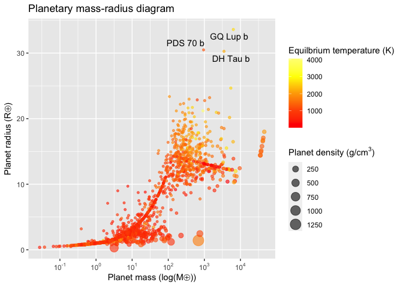
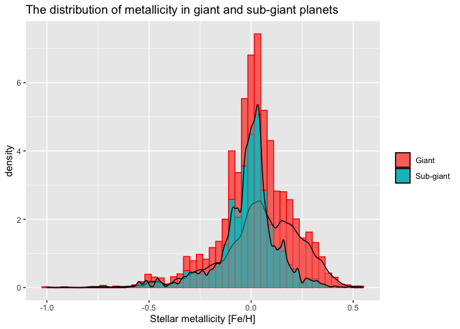

NASA API Vignette
================

-   [Package requirements](#package-requirements)
-   [Custom functions](#custom-functions)
    -   [annualExoDiscoveries()](#annualexodiscoveries)
    -   [calculateHZ](#calculatehz)
    -   [hzFluxCalculator()](#hzfluxcalculator)
    -   [habitableExoFinder()](#habitableexofinder)
-   [Exploratory Data Analysis](#exploratory-data-analysis)
    -   [Basic summaries](#basic-summaries)
    -   [Habitability summaries](#habitability-summaries)
-   [References](#references)

## Package requirements

To re-create this vignette in R, users are required to install

-   **[tidyverse](https://www.tidyverse.org/)** - encompasses packages
    such as `dplyr` for subsetting data and `ggplot2` for creating
    layered graphics.  
-   **[httr](https://httr.r-lib.org/)** - supplies the `GET()` function
    to programmatically retrieve content from NASA Exoplanet Archive’s
    [TAP
    service](https://exoplanetarchive.ipac.caltech.edu/docs/TAP/usingTAP.html#examples).
-   **[jsonlite](https://cran.r-project.org/web/packages/jsonlite/vignettes/json-aaquickstart.html)** -
    supplies the `fromJSON()` function to simplify JSON content into an
    atomic vector.
-   **[DT](https://rstudio.github.io/DT/)** - suplies the `datatables()`
    function with “filtering, pagination, sorting, and many other
    features” in the tables".
-   **[latex2exp](https://cran.r-project.org/web/packages/latex2exp/vignettes/using-latex2exp.html)** -
    “an R package that parses and converts LaTeX math formulas to R’s
    plotmath expressions.” This is useful for labeling masses and radii
    on plots using [solar system
    symbols](https://solarsystem.nasa.gov/resources/680/solar-system-symbols/).
-   **[ggrepel](https://ggrepel.slowkow.com/)** - eliminate overlapping
    text labels in the `ggplot2` exoplanet mass-radius diagram.

## Custom functions

### annualExoDiscoveries()

This custom function programmatically retrieves data from the [NASA
Exoplanet Archive’s TAP
service](https://exoplanetarchive.ipac.caltech.edu/docs/TAP/usingTAP.html#examples).
Users can specify one of two tables - Planetary Systems (**ps**) or
Planetary Systems Composite Parameters (**pscomppars**) - as well as a
range for the year(s) in which planets were discovered. The default
values for this function are:

-   `tableName = "pscomppars"` - according to the [table
    definitions](https://exoplanetarchive.ipac.caltech.edu/docs/API_PS_columns.html)
    for **ps** and **pscomppars**, “PSCompPars is a more filled-in
    table, with only one row per planet, enabling a more statistical
    view of the known exoplanet population and their host environments.
    This table provides a more complete, though not necessarily
    self-consistent, set of parameters.”
-   `startYear = 1989` - the earliest listing in the PSCompPars table,
    attributed to the planet [HD 114762
    b](https://exoplanetarchive.ipac.caltech.edu/overview/HD%20114762%20b#planet_data_HD-114762-b).  
-   `endYear = as.integer(format(Sys.Date(), "%Y"))` - the current
    calendar year as understood by the user’s computer.
-   `controversial = 0` - exclude planets for which the confirmation
    status “has been questioned in the published literature.”

``` r
# Retrieve exoplanet names, discovery year, and discovery method.
# Defaults start in the year 1989 (earliest year in the pscomppars table)
# and end in the current calendar year: format(Sys.Date(), "%Y").

annualExoDiscoveries <- function(tableName = "pscomppars", startYear = 1989, endYear = as.integer(format(Sys.Date(), "%Y")), controversialFlag = 0){
  # Create URL string
  urlString <- paste0("https://exoplanetarchive.ipac.caltech.edu/TAP/sync?query=select+pl_name,disc_year,discoverymethod,pl_orbper,pl_rade,pl_bmasse,pl_radj,pl_bmassj,pl_eqt,pl_dens,st_spectype,st_teff,st_lum,pl_controv_flag,pl_orbeccen,pl_orbsmax,st_mass,st_metratio,st_met+from+", tableName, "+where+disc_year+between+", startYear, "+and+", endYear, "+and+pl_controv_flag+=+", controversialFlag, "&format=json")
  # Provide string to httr GET function
  apiCall <- GET(urlString)
  # Convert JSON content to data frame, rename columns
  apiContent <- apiCall$content %>% rawToChar() %>% fromJSON() %>%
    mutate(luminosityRatio = 10^(st_lum)) 
  
  # Return formatted data frame
  return(apiContent)
}
```

### calculateHZ

This function calculates exoplanetary habitable zones and their
associated stellar flux boundaries for a star of effective temperature
`tempEff` and a stellar luminosity `luminosityRatio`. The calculations
are based on formulae defined by Kopparapu et al., whereby the effective
solar flux *S*<sub>*e**f**f*</sub> is defined as
*S*<sub>*e**f**f*</sub> = *S*<sub>*e**f**f*⊙</sub> + *a**T*<sub>\*</sub> + *b**T*<sub>\*</sub><sup>2</sup> + *c**T*<sub>\*</sub><sup>3</sup> + *d**T*<sub>\*</sub><sup>4</sup>
and the corresponding habiatability zone distances, *d*, are defined as
$d = (\\frac{L/L \\odot}{S\_{eff}})^{0.5}$ AU (Kopparapu et al., 2014).
The required parameters for this function are:

-   `tempEff` - the effective temperature of a star.
    *T*<sub>*e**f**f*</sub> is defined as the difference between
    `tempEff` (*T*<sub>*e**f**f*</sub>) and 5780 K,
    *T*<sub>⋆</sub> = *T*<sub>*e**f**f*</sub> − 5780.
-   `luminosityRatio` - stellar luminosity, defined as the ratio
    $\\frac{L}{L \\odot}$. These values are calculated in the
    `annualExoDiscoveries` function by finding the inverse logarithm of
    `st_lum` (the stellar luminosity in the **PSCompPars** table,
    provided in units of *l**o**g*(*S**o**l**a**r*)). The values in this
    vector are used to calculate the habiatability zone distances, *d*.

The output of this function is a list with four numeric parameters -
*optimisticInnerDist*, *optimisticOuterDist*, *optimisticInnerFlux*, and
*optimisticOuterFlux* - which are used in the function
`hzFluxCalculator()`.

``` r
# Calculate habitable stellar flux boundaries for exoplanetary habitable zones. 
# Distances returned in Astronomical Units (AU).
# Formula and it coefficients provided by Kopparapu et al.
# https://iopscience.iop.org/article/10.1088/2041-8205/787/2/L29
# Re-factored to R from John Armstrong's Python code at
# https://depts.washington.edu/naivpl/sites/default/files/hzcalc.py.txt

calculateHZ <- function(tempEff, luminosityRatio){
  
  # Initiate vectors
  s_eff <- vector()
  distanceFromStar <- vector()
  
  starTemp <- vector()
  recentVenus <- vector()
  runawayGreenhouse <- vector()
  maxGreenhouse <- vector()
  earlyMars <- vector()
  fivemeRunaway <- vector()
  tenthmeRunaway <- vector()
  
  s_eff_sun  = c(1.776, 1.107, 0.356, 0.320, 1.188, 0.99)
  a <- c(2.136e-4, 1.332e-4, 6.171e-5, 5.547e-5, 1.433e-4, 1.209e-4)
  b <- c(2.533e-8, 1.580e-8, 1.698e-9, 1.526e-9, 1.707e-8, 1.404e-8)
  c <- c(-1.332e-11, -8.308e-12, -3.198e-12, -2.874e-12, -8.968e-12, -7.418e-12)
  d <- c(-3.097e-15, -1.931e-15, -5.575e-16, -5.011e-16, -2.084e-15, -1.713e-15)
  
  t_star <- tempEff-5780
  
  for (i in 1:length(a)){
    s_eff[i] <- s_eff_sun[i] + 
      a[i]*t_star + b[i]*t_star^2 + c[i]*t_star^3 + d[i]*t_star^4
    
    distanceFromStar[i] <- (luminosityRatio/s_eff[i])^0.5
    
    optimisticInnerDist <- distanceFromStar[1]
    optimisticOuterDist <- distanceFromStar[4]
    
  }
  
  optimisticInnerDist <- distanceFromStar[1]
  optimisticOuterDist <- distanceFromStar[4]
  
  optimisticInnerFlux <- s_eff[1]
  optimisticOuterFlux <- s_eff[4]
  
  return(list(optimisticInnerDist = optimisticInnerDist, 
              optimisticOuterDist = optimisticOuterDist, 
              optimisticInnerFlux = optimisticInnerFlux, 
              optimisticOuterFlux = optimisticOuterFlux))
}
```

### hzFluxCalculator()

This custom function calculates the minima and the maxima for a planet’s
habitability zone (in units of *AU*) and stellar flux (in units of
*dex*). It requires the name of a data set and operates with the
following default parameters:

-   `earthMassCol = "pl_bmasse"` - a vector with planetary masses in
    units of Earth mass (*M*⊕).
-   `starSpecTypeCol = "st_spectype"` - a vector listing the spectral
    type of host stars.
-   `effectiveTempCol = "st_teff"` - a vector listing the effective
    temperatures of host stars.
-   `luminosityRatioCol = "luminosityRatio"` - a vector with the stellar
    luminosity ratios, $L/L \\odot}$.

These default column names are based on the variables in the [Planetary
Systems Composite Parameters
(PSCompPars)](https://exoplanetarchive.ipac.caltech.edu/docs/API_PS_columns.html)
table. `luminosityRatioCol` is calculated and appended to each data
frame that stems from the `annualExoDiscoveries()` function.

``` r
# Customer function to calculate values for 
# inner and outer habitable zone, flux
hzFluxCalculator <- function(data, earthMassCol = "pl_bmasse", 
                             starSpecTypeCol = "st_spectype", 
                             effectiveTempCol = "st_teff",
                             luminosityRatioCol = "luminosityRatio"){
  
  data %>% mutate(innerHZ = NA, outerHZ = NA, innerFlux = NA, 
                  outerFlux = NA, spectralClass = NA)
  
  earthMassCol <- data[ , earthMassCol]
  starSpecTypeCol <- data[ , starSpecTypeCol]
  effectiveTempCol <- data[ , effectiveTempCol]
  luminosityRatioCol <- data[ , luminosityRatioCol]
  
  for(i in 1:length(earthMassCol)){
    if(!is.na(starSpecTypeCol[i])){
      data$spectralClass[i] <- substr(starSpecTypeCol[i], 1, 1)
    } else {
      data$spectralClass[i] <- NA
    }
    
    
    if(!is.na(earthMassCol[i]) & earthMassCol[i] <= 10 & 
       earthMassCol[i] >= 0.1){
      
      
      hzVars <- calculateHZ(effectiveTempCol[i], 
                            luminosityRatioCol[i])
      
      data$innerHZ[i] <- hzVars[[1]]
      data$outerHZ[i] <- hzVars[[2]]
      
      data$innerFlux[i] <- hzVars[[3]]
      data$outerFlux[i] <- hzVars[[4]]
      
    } else {
      data$innerHZ[i] <- NA
      data$outerHZ[i] <- NA
      data$innerFlux[i] <- NA
      data$outerFlux[i] <- NA
    }
  }
  
  return(data)
}
```

### habitableExoFinder()

This function produces a data frame of potentially habitable exoplanets
from a set of general habitability criteria, many of which are inspired
by the University of Puerto Rico’s [Planetary Habitability
Laboratory](http://phl.upr.edu/projects/habitable-exoplanets-catalog/methods).
These include the conditions that

1.  The planet orbits an F, G, K, or M star (this is accommodated using
    the function `filter(spectralClass %in% c("F", "G", "K", "M")`).
2.  The planet orbits within the optimistic habitable zone defined by
    Kopparapu et al. (2014). Individual habitable zone values are
    calculated using the `calculateHZ()` function and extended to larger
    data sets via the `hzFluxCalculator()` function.
3.  The planet has a radius between 0.5 to 2.5 Earth radii or a minimum
    mass between 0.1 to 10 Earth masses.

These parameters can be tuned using arguments from published research.
For simplicity, the default values are:

-   `minEarthMass = 0.1`
-   `maxEarthMass = 5`
-   `minEarthRadius = 0.5`
-   `maxEarthRadius = 1.5`
-   `maxInnerFlux = 1.5`
-   `maxOuterFlux = 0.20`
-   `minTemp = 273` - units of Kelvin
-   `maxTemp = 340` - units of Kelvin

``` r
# Create function to identify potentially habitable exoplanets. 
# Default function parameters provided by Planetary Habitability Laboratory, 
# http://phl.upr.edu/projects/habitable-exoplanets-catalog
habitableExoFinder <- function(data, minEarthMass = 0.1, maxEarthMass = 5, 
                               minEarthRadius = 0.5, maxEarthRadius = 1.5,
                               maxInnerFlux = 1.5, maxOuterFlux = 0.20,
                               minTemp = 273, maxTemp = 340){
  
  # Subset data using provided parameters
  habitablePlanets <- data %>% select(pl_name, pl_eqt, spectralClass, 
                                      pl_bmasse, pl_rade, pl_orbeccen, 
                                      pl_orbsmax, innerHZ, outerHZ, 
                                      innerFlux, outerFlux) %>% 
    filter(spectralClass %in% c("F", "G", "K", "M") & 
             (pl_orbsmax >= innerHZ) & (pl_orbsmax <= outerHZ) & 
             (pl_bmasse >= minEarthMass) &
             (pl_bmasse <= maxEarthMass) & 
             (pl_rade >= minEarthRadius) & (pl_rade <= maxEarthRadius) &
             (innerFlux <= maxInnerFlux) & (outerFlux >= maxOuterFlux) &
             (pl_eqt <= maxTemp | (is.na(pl_eqt))) & 
             (pl_eqt >= minTemp | (is.na(pl_eqt == NA))))
  
  return(habitablePlanets)
}
```

## Exploratory Data Analysis

### Basic summaries

The `annualExoDiscoveries()` function retrieves the latest exoplanet
data from NASA’s Exoplanet Archive.

``` r
# Retrieve latest exoplanet data
exoplanetData <- annualExoDiscoveries()

# Print a subset of observations
exoplanetData
```

    ## # A tibble: 4,501 × 20
    ##    pl_name   disc_year discoverymethod
    ##    <chr>         <int> <chr>          
    ##  1 OGLE-201…      2020 Microlensing   
    ##  2 GJ 480 b       2020 Radial Velocity
    ##  3 Kepler-2…      2013 Transit        
    ##  4 Kepler-8…      2016 Transit        
    ##  5 K2-283 b       2018 Transit        
    ##  6 Kepler-4…      2016 Transit        
    ##  7 HAT-P-15…      2010 Transit        
    ##  8 HD 14914…      2005 Radial Velocity
    ##  9 HD 21070…      2007 Radial Velocity
    ## 10 HIP 1296…      2010 Radial Velocity
    ## # … with 4,491 more rows, and 17 more
    ## #   variables: pl_orbper <dbl>,
    ## #   pl_rade <dbl>, pl_bmasse <dbl>,
    ## #   pl_radj <dbl>, pl_bmassj <dbl>,
    ## #   pl_eqt <dbl>, pl_dens <dbl>,
    ## #   st_spectype <chr>, st_teff <dbl>,
    ## #   st_lum <dbl>, …

As of Sun Oct 3 19:02:49 2021, the NASA Exoplanet Archive’s [Planetary
Systems Composite
Parameters](https://exoplanetarchive.ipac.caltech.edu/docs/API_PS_columns.html)
(PSCompPars) table lists 4501 confirmed exoplanet observations. The
stacked bar plot below enumerates the annual number of exoplanet
findings since 1989 and highlights 2014 and 2016 as the most prolific
years for discovery.

``` r
# Retrieve latest exoplanet data
annualDiscoveries <- exoplanetData 

# Create horizontal bar plot with annual number of discoveries
annualDiscoveryBar <- ggplot(annualDiscoveries, aes(x = as.character(disc_year)))
annualDiscoveryBar + geom_bar(aes(fill = discoverymethod), 
                             alpha = 0.8, position = "stack") +
  labs(x = "Discovery year", y = "Count",
       title = "Exoplanet discoveries over time", 
       subtitle = "Grouped by discovery method") +
  scale_fill_discrete(name = "Discovery method") +
  theme(axis.text.x = element_text(angle = 45)) + 
  geom_text(stat="count", aes(label=..count..), 
            vjust=0.5, hjust = -0.01, size = 2.2) +
  theme(legend.position = c(0.67, 0.33)) +
  guides(fill=guide_legend(ncol=2)) +
  coord_flip() 
```

<!-- -->

The contingency table below summarizes the cumulative number of
observations for each discovery method.

``` r
# Contingency table 
# Total number of exoplanets found with each discovery method
discoveriesByMethod <- table(annualDiscoveries$discoverymethod)

# Display as data frame for aesthetics
knitr::kable(discoveriesByMethod, 
             caption = "The number of exoplanet discoveries by method.",
             col.names = c("Discovery method", "Frequency"))
```

| Discovery method              | Frequency |
|:------------------------------|----------:|
| Astrometry                    |         1 |
| Disk Kinematics               |         1 |
| Eclipse Timing Variations     |        14 |
| Imaging                       |        51 |
| Microlensing                  |       116 |
| Orbital Brightness Modulation |         4 |
| Pulsar Timing                 |         7 |
| Pulsation Timing Variations   |         2 |
| Radial Velocity               |       871 |
| Transit                       |      3412 |
| Transit Timing Variations     |        22 |

The number of exoplanet discoveries by method.

Of the known 4501 exoplanets, 75.8% were observed while transiting their
host star and temporarily reducing its brightness. Another 19.4% were
observed indirectly via the radial velocity method, whereby the planet
and its star orbit around a common center of gravity and prompt
noticeable Doppler shifts in the stellar spectrum.

Each observation method excels in specific scenarios. The transit and
radial velocity detection methods favor planets which orbit their star
at an average distance of 0.12-1.6 AU.

``` r
# Subset data to include only detection methods with a relatively large number
# of exoplanet discoveries
extendedDiscoveryProp <- exoplanetData
extendedDiscoveryProp <- extendedDiscoveryProp %>% 
  filter(discoverymethod %in% c("Transit", "Radial Velocity", "Microlensing", "Imaging") &
           !is.na(pl_orbsmax))

# Display mean and median semi-major axes (in units of AU) for 
# planets observed by these methods
discoverySummaries <- extendedDiscoveryProp %>% group_by(discoverymethod) %>%
  summarise(meanSMA = mean(pl_orbsmax), medianSMA = median(pl_orbsmax))
discoverySummaries
```

    ## # A tibble: 4 × 3
    ##   discoverymethod meanSMA medianSMA
    ##   <chr>             <dbl>     <dbl>
    ## 1 Imaging         582.     162     
    ## 2 Microlensing      2.70     2.42  
    ## 3 Radial Velocity   1.61     1.02  
    ## 4 Transit           0.129    0.0791

Direct imaging, on the other hand, requires planets to be relatively far
from a star in order for the stellar brightness not to overwhelm the
planetary dimness. In this data set, the median distance for a planet
that was directly observed is 162 AU. Direct imaging also favors young
stars, which tend to be “self-luminous due to ongoing contraction
and…accretion” (service), 2016). The bocplot below shows the
distribution of semi-major axes for four of the most productive
exoplanet observation methods.

``` r
orbsmaxBoxPlot <- ggplot(extendedDiscoveryProp, aes(x = discoverymethod, y = pl_orbsmax))
orbsmaxBoxPlot + geom_boxplot() +
  scale_y_log10() 
```

<!-- -->

``` r
# New vector with temporary data
orbsmaxMassData <- exoplanetData 

# Scatter plot of masses/radii for discovered exoplanets
# Use LaTeX to denote the standard astronomical symbol for the Earth
orbsmaxMassScatter <- ggplot(orbsmaxMassData, aes(x = pl_orbsmax, y = pl_bmasse))
orbsmaxMassScatter + geom_point(aes(col = pl_orbeccen), alpha = 0.6, position = "jitter") +
  scale_x_log10() +
  scale_y_log10() +
  # Select color palette for eccentricity from 
  # https://rdrr.io/r/grDevices/palettes.html
  scale_color_gradientn(colours = terrain.colors(5)) +
  labs(x = "Semi-major axis [AU]", y = TeX(r'(Planet mass $(M\oplus)$)'),
       title = "Mass versus semi-major axis", col = "Orbit eccentricity",
       size = TeX(r'(Planet density $(g/cm^3)$)')) +
  scale_x_log10(breaks = scales::trans_breaks("log10", function(x) 10^x),
   labels = scales::trans_format("log10", scales::math_format(10^.x)))
```

    ## Scale for 'x' is already present.
    ## Adding another scale for 'x', which
    ## will replace the existing scale.

    ## Warning: Removed 197 rows containing missing
    ## values (geom_point).

<!-- -->

Additionally, planets with radii in the range of 0.1 − 5*R*⊕ comprise
more than 60% of the data set. A second cluster of radii in the range
10 − 15*R*⊕ comprise an additional 20%.

``` r
radiiFreq <- ggplot(annualDiscoveries, aes(x = pl_rade)) 
radiiFreq + geom_histogram(color = "blue", fill = "red", 
                           aes(y = (..count..)/sum(..count..)),
                           binwidth = 2) +
  labs(title="Distribution of planetary radii") +
  labs(x = TeX(r'(Radius $(R\oplus$))'), 
       y = "Frequency") +
  geom_density()
```

    ## Warning: Removed 9 rows containing
    ## non-finite values (stat_bin).

    ## Warning: Removed 9 rows containing
    ## non-finite values (stat_density).

<!-- -->

By combining radii with the masses of planets, we can produce a
mass-radius diagram and calculate planetary densities. From this
diagram, it is also apparent that planetary radii tend to increase with
mass until approximately 1000*M*⊕, at which point gravity impels even
the hardiest planetary material to compress and constrains further
radial growth (Hoolst et al., 2019).

``` r
# New vector with temporary data
tempMassData <- exoplanetData 

# Scatter plot of masses/radii for discovered exoplanets
# Use LaTeX to denote the standard astronomical symbol for the Earth
tempMassScatter <- ggplot(tempMassData, aes(x = pl_bmasse, y = pl_rade))
tempMassScatter + geom_point(aes(col = pl_eqt, size = pl_dens), alpha = 0.6, position = "jitter") +
  scale_color_gradientn(colours = heat.colors(5)) +
  labs(x = TeX(r'(Planet mass $(log(M\oplus))]$))'), y = TeX(r'(Planet radius $(R\oplus)$)'),
       title = "Planetary mass-radius diagram", col = "Equilbrium temperature (K)",
       size = TeX(r'(Planet density $(g/cm^3)$)')) +
  # Label planets exceeding R = 25 (Earth), eliminate overlapping labels
  # using geom_text_repel from the ggrepel package
  geom_text_repel(aes(label = ifelse(pl_rade >= 25, pl_name,''))) +
  scale_x_log10(breaks = scales::trans_breaks("log10", function(x) 10^x),
   labels = scales::trans_format("log10", scales::math_format(10^.x)))
```

    ## Warning: Removed 99 rows containing missing
    ## values (geom_point).

    ## Warning: Removed 26 rows containing missing
    ## values (geom_text_repel).

<!-- -->

``` r
# New vector with temporary data
orbsmaxMassData <- exoplanetData 

# Scatter plot of masses/radii for discovered exoplanets
# Use LaTeX to denote the standard astronomical symbol for the Earth
orbsmaxMassScatter <- ggplot(orbsmaxMassData, aes(x = pl_orbsmax, y = pl_bmasse))
orbsmaxMassScatter + geom_point(aes(shape = discoverymethod), alpha = 0.6, position = "jitter") +
  scale_x_log10() +
  scale_y_log10() +
  # Select color palette for eccentricity from 
  # https://rdrr.io/r/grDevices/palettes.html
  scale_color_gradientn(colours = terrain.colors(5)) +
  labs(x = "Semi-major axis [AU]", y = TeX(r'(Planet mass $(M\oplus)$)'),
       title = "Mass versus semi-major axis", col = "Orbit eccentricity",
       size = TeX(r'(Planet density $(g/cm^3)$)')) +
  scale_x_log10(breaks = scales::trans_breaks("log10", function(x) 10^x),
   labels = scales::trans_format("log10", scales::math_format(10^.x)))
```

    ## Scale for 'x' is already present.
    ## Adding another scale for 'x', which
    ## will replace the existing scale.

    ## Warning: The shape palette can deal with a
    ## maximum of 6 discrete values
    ## because more than 6 becomes
    ## difficult to discriminate; you
    ## have 11. Consider specifying
    ## shapes manually if you must have
    ## them.

    ## Warning: Removed 4321 rows containing
    ## missing values (geom_point).

<!-- -->

``` r
summary(annualDiscoveries$pl_bmasse)
```

    ##     Min.  1st Qu.   Median     Mean 
    ##     0.02     3.97     8.55   415.65 
    ##  3rd Qu.     Max.     NA's 
    ##   167.73 45700.00       17

``` r
summary(annualDiscoveries$pl_rade)
```

    ##    Min. 1st Qu.  Median    Mean 
    ##   0.296   1.760   2.740   5.703 
    ## 3rd Qu.    Max.    NA's 
    ##  11.994  33.600       9

``` r
summary(annualDiscoveries$pl_orbeccen)
```

    ##    Min. 1st Qu.  Median    Mean 
    ##  0.0000  0.0000  0.0000  0.0697 
    ## 3rd Qu.    Max.    NA's 
    ##  0.0722  0.9500     533

``` r
summary(annualDiscoveries$pl_bmasse)
```

    ##     Min.  1st Qu.   Median     Mean 
    ##     0.02     3.97     8.55   415.65 
    ##  3rd Qu.     Max.     NA's 
    ##   167.73 45700.00       17

``` r
summary(annualDiscoveries$pl_rade)
```

    ##    Min. 1st Qu.  Median    Mean 
    ##   0.296   1.760   2.740   5.703 
    ## 3rd Qu.    Max.    NA's 
    ##  11.994  33.600       9

``` r
summary(annualDiscoveries$pl_orbeccen)
```

    ##    Min. 1st Qu.  Median    Mean 
    ##  0.0000  0.0000  0.0000  0.0697 
    ## 3rd Qu.    Max.    NA's 
    ##  0.0722  0.9500     533

``` r
# Masses, radii, eccentricities, and orbit semi-major axes
densityOrbtialProp <- exoplanetData
densityOrbtialProp <- densityOrbtialProp %>% select(pl_orbeccen, pl_orbsmax) %>% 
  filter(!is.na(pl_orbeccen) & !is.na(pl_orbsmax))


orbEccenCDF <- ggplot(densityOrbtialProp, aes(x = pl_orbeccen))
orbEccenCDF + stat_ecdf(geom = "step")
```

<!-- -->

``` r
# Scatter plot of masses/radii for discovered exoplanets
# Use LaTeX to denote the standard astronomical symbol for the Earth
orbsEccenScatter <- ggplot(densityOrbtialProp, aes(x = pl_orbsmax, y = pl_orbeccen, scale_x_log10()))
orbsEccenScatter + geom_point(alpha = 0.6, position = "jitter") +
  scale_x_log10() +
  labs(x = TeX(r'(Mass $(log(M\oplus))]$))'), y = TeX(r'(Radius $(R\oplus)$)'),
       title = "Comparison of radius and logarithmic mass amongst known exoplanets")
```

<!-- -->

### Habitability summaries

``` r
metallicityData <- exoplanetData
metallicityData <- metallicityData %>% select(st_metratio, st_met, discoverymethod, pl_bmassj, pl_bmasse, pl_orbper) %>% 
  filter(st_metratio == "[Fe/H]" & 
           (discoverymethod %in% c("Transit", "Radial Velocity", "Microlensing")))

metallicityHisto <- ggplot(metallicityData, aes(x = st_met))
metallicityHisto + geom_histogram(aes(fill = metallicityData$discoverymethod), adjust = 0.5, alpha = 0.5) +
  labs(x = "Stellar metallicity [Fe/H]", y = "Count",
       title = "The distribution of exo planets as a function of stellar metallicity",
       subtitle = "Grouped by discovery method") 
```

    ## Warning: Ignoring unknown parameters:
    ## adjust

    ## Warning: Use of
    ## `metallicityData$discoverymethod` is
    ## discouraged. Use `discoverymethod`
    ## instead.

    ## `stat_bin()` using `bins = 30`.
    ## Pick better value with `binwidth`.

<!-- -->

We can calculate the maxima and minima for habitable zones and flux
using formulae provided by Kopparapu et al. (Kopparapu et al., 2014).

``` r
# Grab up-to-date data from API
planetData <- exoplanetData

# Calculate maxima/minima for habitabilize zone and flux for each exoplanet
hzFluxData <- hzFluxCalculator(planetData)

# List habitable planets using "optimistic" parameters from
# Planetary Habitability Laboratory
listHabitablePlanets <- habitableExoFinder(hzFluxData, minTemp = 181, maxTemp = 279,
                                           maxEarthMass = 10, maxEarthRadius = 2.5)
head(listHabitablePlanets)
```

    ## # A tibble: 6 × 11
    ##   pl_name     pl_eqt spectralClass
    ##   <chr>        <dbl> <chr>        
    ## 1 GJ 180 c       NA  M            
    ## 2 GJ 433 d       NA  M            
    ## 3 GJ 832 c       NA  M            
    ## 4 Wolf 1061 c    NA  M            
    ## 5 GJ 682 b       NA  M            
    ## 6 K2-288 B b    226. M            
    ## # … with 8 more variables:
    ## #   pl_bmasse <dbl>, pl_rade <dbl>,
    ## #   pl_orbeccen <dbl>,
    ## #   pl_orbsmax <dbl>, innerHZ <dbl>,
    ## #   outerHZ <dbl>, innerFlux <dbl>,
    ## #   outerFlux <dbl>

``` r
planetClusters <- exoplanetData
planetClusters <- planetClusters %>% select(pl_bmasse, pl_bmassj) %>% filter()
```

``` r
metallicityData <- exoplanetData 
metallicityData <- metallicityData %>% select(st_metratio, st_met, pl_bmassj, pl_bmasse, pl_orbper) %>% 
  filter(st_metratio == "[Fe/H]" & !(is.na(pl_bmassj)) & (pl_bmassj >= 0.6))

metallicityData %>% mutate(category = NA)
```

    ## # A tibble: 849 × 6
    ##    st_metratio st_met pl_bmassj
    ##    <chr>        <dbl>     <dbl>
    ##  1 [Fe/H]        0.22     1.94 
    ##  2 [Fe/H]        0.29     1.33 
    ##  3 [Fe/H]        0.04     1.81 
    ##  4 [Fe/H]        0.05     1.19 
    ##  5 [Fe/H]        0.14     1.68 
    ##  6 [Fe/H]        0.41     3.74 
    ##  7 [Fe/H]        0.18     0.899
    ##  8 [Fe/H]       -0.46     3.88 
    ##  9 [Fe/H]       -0.09     7.49 
    ## 10 [Fe/H]       -0.03     1.99 
    ## # … with 839 more rows, and 3 more
    ## #   variables: pl_bmasse <dbl>,
    ## #   pl_orbper <dbl>, category <lgl>

``` r
for(i in 1:length(metallicityData$pl_bmassj)){
  
  if(metallicityData$pl_bmassj[i] <= 0.9 & metallicityData$pl_bmassj[i] >= 0.6){
    metallicityData$category[i] <- "Sub-Jupiter"
  } else if(metallicityData$pl_bmassj[i] <= 4) {
    metallicityData$category[i] <- "Jupiter-mass"
  } else {
    metallicityData$category[i] <- "Super-massive"
  }
}

metallicityHisto <- ggplot(metallicityData, aes(x = st_met))
metallicityHisto + geom_histogram(aes(fill = category)) +
  labs(x = "Stellar Effective Temperature [K]", y = "Count",
       title = "The distribution of planets as a function of stellar effective temperature") 
```

    ## `stat_bin()` using `bins = 30`.
    ## Pick better value with `binwidth`.

<!-- -->

``` r
orbPerEccen <- exoplanetData 

exoDiscoveryScatter <- ggplot(orbPerEccen, aes(x = log(pl_orbper), y = pl_orbeccen))
exoDiscoveryScatter + geom_point(aes(size = pl_bmassj, color = pl_bmassj), alpha = 0.6, position = "jitter")
```

    ## Warning: Removed 552 rows containing missing
    ## values (geom_point).

<!-- -->

## References

<div id="refs" class="references csl-bib-body hanging-indent"
line-spacing="2">

<div id="ref-doi:10.1080/23746149.2019.1630316" class="csl-entry">

Hoolst, T. V., Noack, L., & Rivoldini, A. (2019). Exoplanet interiors
and habitability. *Advances in Physics: X*, *4*(1), 1630316.
<https://doi.org/10.1080/23746149.2019.1630316>

</div>

<div id="ref-Kopparapu_2014" class="csl-entry">

Kopparapu, R. K., Ramirez, R. M., SchottelKotte, J., Kasting, J. F.,
Domagal-Goldman, S., & Eymet, V. (2014). HABITABLE ZONES AROUND
MAIN-SEQUENCE STARS: DEPENDENCE ON PLANETARY MASS. *The Astrophysical
Journal*, *787*(2), L29. <https://doi.org/10.1088/2041-8205/787/2/l29>

</div>

<div id="ref-cite-key" class="csl-entry">

service), S. (Online. (2016). *Methods of detecting exoplanets 1st
advanced school on exoplanetary science* (V. Bozza, L. Mancini, & A.
Sozzetti, Eds.). Cham : Springer International Publishing : Imprint:
Springer, 2016. <https://catalog.lib.ncsu.edu/catalog/NCSU3603337>

</div>

</div>
